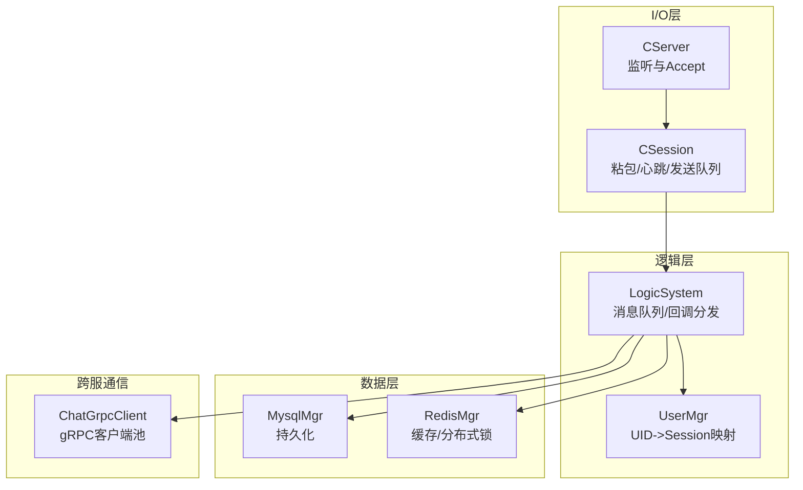
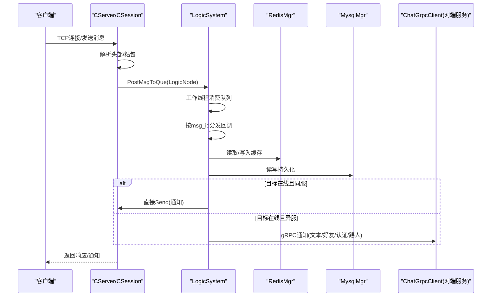
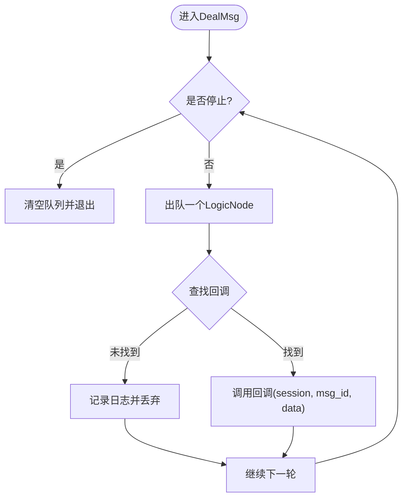
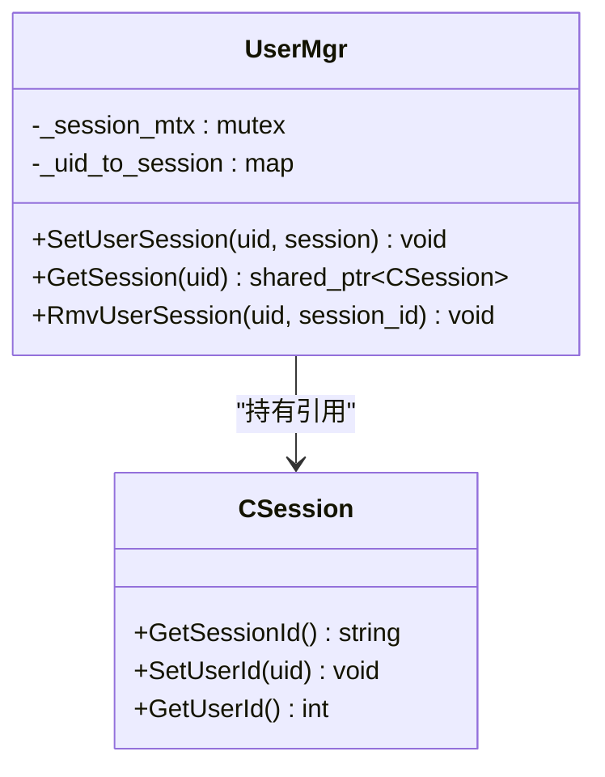
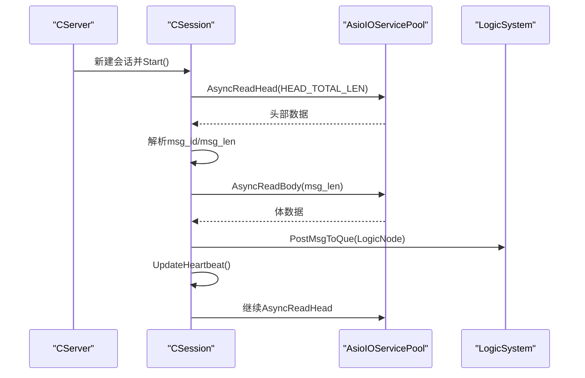
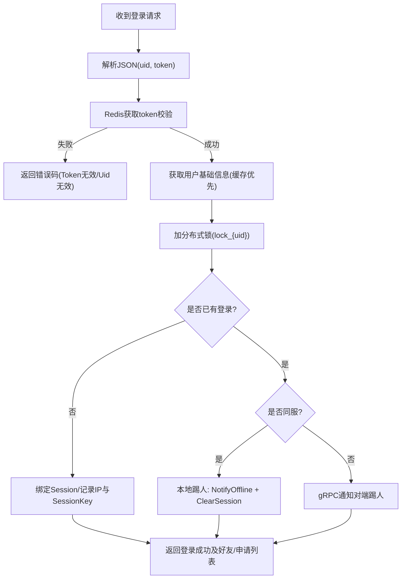
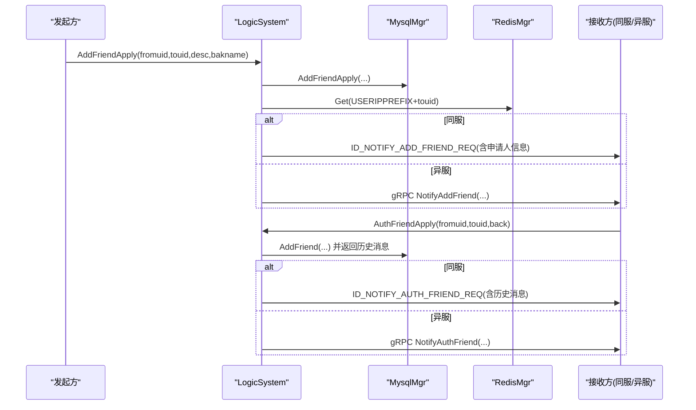
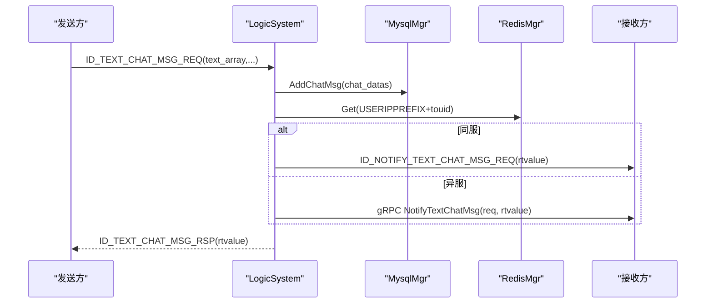
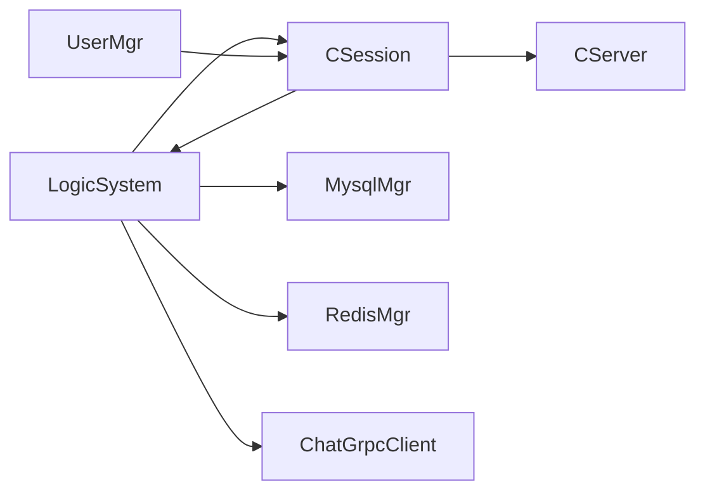

# 聊天逻辑系统

<cite>
**本文引用的文件**   
- [LogicSystem.h](file://server/ChatServer/include/LogicSystem.h)
- [LogicSystem.cpp](file://server/ChatServer/src/LogicSystem.cpp)
- [UserMgr.h](file://server/ChatServer/include/UserMgr.h)
- [UserMgr.cpp](file://server/ChatServer/src/UserMgr.cpp)
- [CSession.h](file://server/ChatServer/include/CSession.h)
- [CSession.cpp](file://server/ChatServer/src/CSession.cpp)
- [CServer.h](file://server/ChatServer/include/CServer.h)
- [MsgNode.h](file://server/ChatServer/include/MsgNode.h)
- [data.h](file://server/ChatServer/include/data.h)
- [const.h](file://server/ChatServer/include/const.h)
- [MysqlMgr.h](file://server/ChatServer/include/MysqlMgr.h)
- [RedisMgr.h](file://server/ChatServer/include/RedisMgr.h)
- [ChatGrpcClient.h](file://server/ChatServer/include/ChatGrpcClient.h)
- [chat.proto](file://proto/chat_service/chat.proto)
- [utils.h](file://server/ChatServer/include/utils.h)
</cite>

## 目录
1. [引言](#引言)
2. [项目结构](#项目结构)
3. [核心组件](#核心组件)
4. [架构总览](#架构总览)
5. [详细组件分析](#详细组件分析)
6. [依赖关系分析](#依赖关系分析)
7. [性能考量](#性能考量)
8. [故障排查指南](#故障排查指南)
9. [结论](#结论)
10. [附录](#附录)

## 引言
本文件面向 ChatServer 的“逻辑系统”模块，系统性梳理其业务处理流程与实现细节。重点覆盖：
- 消息路由与分发（基于消息ID的回调注册与队列消费）
- 好友关系验证、申请与认证流程
- 群组管理与私聊线程管理（加载线程、创建私聊、历史消息分页）
- 权限控制与登录校验（Token校验、分布式锁、踢人机制）
- UserMgr 用户管理器（会话绑定、在线列表、跨进程会话定位）
- 消息分发算法、广播策略与点对点通信（本地直发与跨服gRPC转发）
- 业务规则验证、消息过滤与内容安全（输入校验、错误码、状态机）
- 事务处理、数据一致性与并发控制（MySQL写入、Redis缓存一致性、分布式锁）
- 扩展点与插件化方案（回调注册表、协议扩展、服务间接口）

## 项目结构
ChatServer 采用分层+单例模式组织：
- I/O层：CServer/CSession 负责TCP连接、粘包处理、异步读写、心跳检测
- 逻辑层：LogicSystem 维护消息队列、回调映射、业务处理器
- 数据层：MysqlMgr/RedisMgr 提供持久化与缓存能力
- 跨服通信：ChatGrpcClient 封装gRPC客户端池与通知方法
- 协议定义：chat.proto 定义跨服务消息契约

图表来源
- [CServer.h:1-39](file://server/ChatServer/include/CServer.h#L1-L39)
- [CSession.h:1-86](file://server/ChatServer/include/CSession.h#L1-L86)
- [LogicSystem.h:1-60](file://server/ChatServer/include/LogicSystem.h#L1-L60)
- [UserMgr.h:1-22](file://server/ChatServer/include/UserMgr.h#L1-L22)
- [MysqlMgr.h:1-41](file://server/ChatServer/include/MysqlMgr.h#L1-L41)
- [RedisMgr.h:1-305](file://server/ChatServer/include/RedisMgr.h#L1-L305)
- [ChatGrpcClient.h:1-116](file://server/ChatServer/include/ChatGrpcClient.h#L1-L116)

章节来源
- [CServer.h:1-39](file://server/ChatServer/include/CServer.h#L1-L39)
- [CSession.h:1-86](file://server/ChatServer/include/CSession.h#L1-L86)
- [LogicSystem.h:1-60](file://server/ChatServer/include/LogicSystem.h#L1-L60)
- [UserMgr.h:1-22](file://server/ChatServer/include/UserMgr.h#L1-L22)

## 核心组件
- LogicSystem：单例，维护消息队列与回调映射；启动独立工作线程消费队列；按msg_id分发给具体处理器（登录、搜索、好友申请/认证、文本/图片消息、心跳、线程加载等）。
- UserMgr：单例，维护uid到CSession的映射，提供设置/获取/删除会话的能力，保证并发安全。
- CSession：封装TCP会话，负责头部解析、粘包处理、发送队列、心跳更新与异常清理。
- MysqlMgr/RedisMgr：单例，分别封装数据库与缓存操作，包含连接池、健康检查、分布式锁等。
- ChatGrpcClient：单例，封装gRPC客户端连接池，提供跨服通知接口（好友申请、认证通过、文本消息、踢人、图片通知）。

章节来源
- [LogicSystem.cpp:1-114](file://server/ChatServer/src/LogicSystem.cpp#L1-L114)
- [UserMgr.cpp:1-50](file://server/ChatServer/src/UserMgr.cpp#L1-L50)
- [CSession.cpp:1-200](file://server/ChatServer/src/CSession.cpp#L1-L200)
- [RedisMgr.h:1-305](file://server/ChatServer/include/RedisMgr.h#L1-L305)
- [ChatGrpcClient.h:1-116](file://server/ChatServer/include/ChatGrpcClient.h#L1-L116)

## 架构总览
整体数据流：
- 客户端通过TCP连接至CServer，CSession完成协议解析后将消息节点投递至LogicSystem队列。
- LogicSystem工作线程从队列取出消息，根据msg_id查找回调函数并执行对应业务逻辑。
- 业务逻辑可能访问Redis（缓存/锁）、MySQL（持久化），并通过ChatGrpcClient向其他ChatServer实例或资源/状态服务发起通知。
- 结果通过CSession异步写回客户端。

图表来源
- [CSession.cpp:120-128](file://server/ChatServer/src/CSession.cpp#L120-L128)
- [LogicSystem.cpp:27-81](file://server/ChatServer/src/LogicSystem.cpp#L27-L81)
- [ChatGrpcClient.h:104-108](file://server/ChatServer/include/ChatGrpcClient.h#L104-L108)

## 详细组件分析

### 消息路由与分发（LogicSystem）
- 回调注册：在构造时通过RegisterCallBacks将msg_id与业务处理器绑定。
- 队列模型：PostMsgToQue入队，条件变量唤醒工作线程；DealMsg循环出队并调用回调。
- 处理器示例：LoginHandler、SearchInfo、AddFriendApply、AuthFriendApply、DealChatTextMsg、HeartBeatHandler、GetUserThreadsHandler、CreatePrivateChat、LoadChatMsg、DealChatImgMsg。
- 错误处理：未找到回调则丢弃并打印日志；使用Defer统一构造响应并发送。

图表来源
- [LogicSystem.cpp:43-81](file://server/ChatServer/src/LogicSystem.cpp#L43-L81)
- [LogicSystem.cpp:83-114](file://server/ChatServer/src/LogicSystem.cpp#L83-L114)

章节来源
- [LogicSystem.h:1-60](file://server/ChatServer/include/LogicSystem.h#L1-L60)
- [LogicSystem.cpp:1-114](file://server/ChatServer/src/LogicSystem.cpp#L1-L114)

### 用户管理器（UserMgr）
- 数据结构：unordered_map<int, shared_ptr<CSession>> uid_to_session，互斥保护。
- 关键方法：
  - SetUserSession：绑定uid与session
  - GetSession：查询uid对应的session
  - RmvUserSession：按session_id精确移除，避免误删异地登录的会话
- 并发安全：所有操作均加锁，确保多线程安全。

图表来源
- [UserMgr.h:1-22](file://server/ChatServer/include/UserMgr.h#L1-L22)
- [UserMgr.cpp:1-50](file://server/ChatServer/src/UserMgr.cpp#L1-L50)
- [CSession.h:28-76](file://server/ChatServer/include/CSession.h#L28-L76)

章节来源
- [UserMgr.h:1-22](file://server/ChatServer/include/UserMgr.h#L1-L22)
- [UserMgr.cpp:1-50](file://server/ChatServer/src/UserMgr.cpp#L1-L50)

### 会话与网络I/O（CSession/CServer）
- CSession职责：
  - 异步读头/体，处理粘包与长度校验
  - 发送队列限流（MAX_SENDQUE），顺序写出
  - 心跳更新与过期检测
  - 异常连接清理（Close、ClearSession）
- CServer职责：
  - Accept新连接，维护活跃会话集合
  - 定时器任务（心跳/超时清理）
  - 会话有效性校验

图表来源
- [CSession.cpp:130-191](file://server/ChatServer/src/CSession.cpp#L130-L191)
- [CSession.cpp:87-128](file://server/ChatServer/src/CSession.cpp#L87-L128)
- [CServer.h:1-39](file://server/ChatServer/include/CServer.h#L1-L39)

章节来源
- [CSession.h:1-86](file://server/ChatServer/include/CSession.h#L1-L86)
- [CSession.cpp:1-200](file://server/ChatServer/src/CSession.cpp#L1-L200)
- [CServer.h:1-39](file://server/ChatServer/include/CServer.h#L1-L39)

### 登录与权限控制（LoginHandler）
- Token校验：从Redis中按utoken_{uid}读取token并与请求对比。
- 基础信息加载：ubaseinfo_{uid}优先查缓存，否则回源MySQL并回填缓存。
- 分布式锁：lock_{uid}防止重复登录竞态。
- 踢人逻辑：若同uid已登录，判断是否同服；同服直接NotifyOffline并清理旧会话；异服通过gRPC通知对端踢人。
- 会话绑定：SetUserId、USERIPPREFIX记录服务器名、USER_SESSION_PREFIX记录session_id。

图表来源
- [LogicSystem.cpp:116-252](file://server/ChatServer/src/LogicSystem.cpp#L116-L252)
- [const.h:81-94](file://server/ChatServer/include/const.h#L81-L94)

章节来源
- [LogicSystem.cpp:116-252](file://server/ChatServer/src/LogicSystem.cpp#L116-L252)
- [const.h:1-104](file://server/ChatServer/include/const.h#L1-L104)

### 好友关系与认证（AddFriendApply/AuthFriendApply）
- 申请流程：
  - 写入MySQL申请记录
  - 查询目标用户所在服务器（USERIPPREFIX）
  - 同服：直接通过UserMgr获取session并推送通知
  - 异服：构造AddFriendReq并通过ChatGrpcClient.NotifyAddFriend转发
- 认证流程：
  - 更新好友关系（AddFriend），同时拉取历史聊天记录（AddFriendMsg）
  - 同服：直接推送认证通过通知与历史消息
  - 异服：构造AuthFriendReq并通过gRPC转发

图表来源
- [LogicSystem.cpp:277-352](file://server/ChatServer/src/LogicSystem.cpp#L277-L352)
- [LogicSystem.cpp:354-470](file://server/ChatServer/src/LogicSystem.cpp#L354-L470)
- [chat.proto:14-51](file://proto/chat_service/chat.proto#L14-L51)

章节来源
- [LogicSystem.cpp:277-470](file://server/ChatServer/src/LogicSystem.cpp#L277-L470)
- [chat.proto:14-51](file://proto/chat_service/chat.proto#L14-L51)

### 文本消息处理（DealChatTextMsg）
- 解析fromuid/touid/text_array，生成ChatMessage列表，批量插入MySQL。
- 构造响应（包含message_id、unique_id、content、status、chat_time）。
- 目标在线判定：
  - 同服：直接通过UserMgr获取session并推送ID_NOTIFY_TEXT_CHAT_MSG_REQ
  - 异服：构造TextChatMsgReq并通过gRPC转发，同时携带响应数据

图表来源
- [LogicSystem.cpp:472-566](file://server/ChatServer/src/LogicSystem.cpp#L472-L566)
- [chat.proto:53-74](file://proto/chat_service/chat.proto#L53-L74)

章节来源
- [LogicSystem.cpp:472-566](file://server/ChatServer/src/LogicSystem.cpp#L472-L566)
- [chat.proto:53-74](file://proto/chat_service/chat.proto#L53-L74)

### 心跳处理（HeartBeatHandler）
- 简单回显ID_HEARTBEAT_RSP，用于客户端保活检测。
- CSession内部维护_last_heartbeat原子时间戳，支持IsHeartbeatExpired与UpdateHeartbeat。

章节来源
- [LogicSystem.cpp:568-575](file://server/ChatServer/src/LogicSystem.cpp#L568-L575)
- [CSession.h:46-49](file://server/ChatServer/include/CSession.h#L46-L49)

### 聊天线程与消息加载（GetUserThreadsHandler/CreatePrivateChat/LoadChatMsg）
- GetUserThreadsHandler：分页加载用户的聊天线程（私聊/群聊），返回thread_id、类型、参与者等信息。
- CreatePrivateChat：创建私聊线程并返回thread_id。
- LoadChatMsg：按thread_id与lastId分页加载历史消息，返回PageResult（messages、load_more、next_cursor）。

章节来源
- [LogicSystem.cpp:775-800](file://server/ChatServer/src/LogicSystem.cpp#L775-L800)
- [data.h:32-58](file://server/ChatServer/include/data.h#L32-L58)
- [MysqlMgr.h:24-35](file://server/ChatServer/include/MysqlMgr.h#L24-L35)

### 图片消息处理（DealChatImgMsg）
- 解析图片消息参数，生成NotifyChatImgReq并通过gRPC通知接收方（或同服直接推送）。
- 结合资源服务进行断点续传与进度显示（参考项目文档）。

章节来源
- [chat.proto:86-104](file://proto/chat_service/chat.proto#L86-L104)
- [LogicSystem.cpp:111-112](file://server/ChatServer/src/LogicSystem.cpp#L111-L112)

## 依赖关系分析
- LogicSystem依赖：
  - CSession：发送响应、获取session
  - MysqlMgr：用户信息、好友关系、聊天消息、线程管理
  - RedisMgr：缓存、分布式锁、在线位置
  - ChatGrpcClient：跨服通知
- UserMgr依赖：CSession（会话对象）
- CSession依赖：CServer（会话生命周期管理）、LogicSystem（消息投递）

图表来源
- [LogicSystem.cpp:1-114](file://server/ChatServer/src/LogicSystem.cpp#L1-L114)
- [UserMgr.cpp:1-50](file://server/ChatServer/src/UserMgr.cpp#L1-L50)
- [CSession.cpp:1-200](file://server/ChatServer/src/CSession.cpp#L1-L200)

章节来源
- [LogicSystem.h:1-60](file://server/ChatServer/include/LogicSystem.h#L1-L60)
- [UserMgr.h:1-22](file://server/ChatServer/include/UserMgr.h#L1-L22)
- [CSession.h:1-86](file://server/ChatServer/include/CSession.h#L1-L86)

## 性能考量
- 异步I/O：Boost.Asio非阻塞读写，减少线程阻塞
- 发送队列：CSession内维护发送队列，限制最大长度，避免内存暴涨
- 缓存优先：Redis缓存用户基础信息与在线位置，降低MySQL压力
- 连接池：Redis与gRPC均采用连接池，提升吞吐
- 分布式锁：Redis实现细粒度锁，避免重复登录与竞态
- 批处理：聊天消息批量插入，减少DB往返

[本节为通用指导，不直接分析具体文件]

## 故障排查指南
- 登录失败：
  - 检查Redis中utoken_{uid}是否存在且匹配
  - 确认ubaseinfo_{uid}可正常读取或回源MySQL
  - 查看分布式锁lock_{uid}是否被占用
- 消息未送达：
  - 检查USERIPPREFIX_{touid}是否指向正确服务器
  - 同服：UserMgr.GetSession(touid)是否返回有效session
  - 异服：ChatGrpcClient是否能连通对端服务
- 心跳超时：
  - 检查CSession.IsHeartbeatExpired逻辑与服务端清理策略
- 发送队列满：
  - 关注MAX_SENDQUE阈值与客户端发送频率

章节来源
- [LogicSystem.cpp:116-252](file://server/ChatServer/src/LogicSystem.cpp#L116-L252)
- [CSession.cpp:130-191](file://server/ChatServer/src/CSession.cpp#L130-L191)
- [const.h:1-104](file://server/ChatServer/include/const.h#L1-L104)

## 结论
ChatServer的逻辑系统以LogicSystem为核心，通过消息队列与回调机制实现高内聚的业务处理；UserMgr提供高效的会话映射；CSession保障稳定的网络I/O；Redis与MySQL协同提供高性能缓存与持久化；gRPC支撑跨服通信与一致性。整体设计清晰、可扩展性强，适合大规模聊天场景。

[本节为总结性内容，不直接分析具体文件]

## 附录
- 协议扩展建议：在chat.proto中新增消息类型，并在LogicSystem::RegisterCallBacks中注册回调
- 自定义逻辑集成：通过新增处理器函数并映射到msg_id，保持与现有架构一致
- 监控与日志：建议在关键路径增加结构化日志，便于问题定位

[本节为概念性内容，不直接分析具体文件]