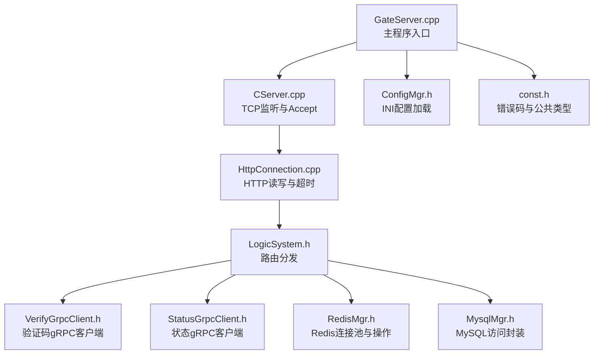
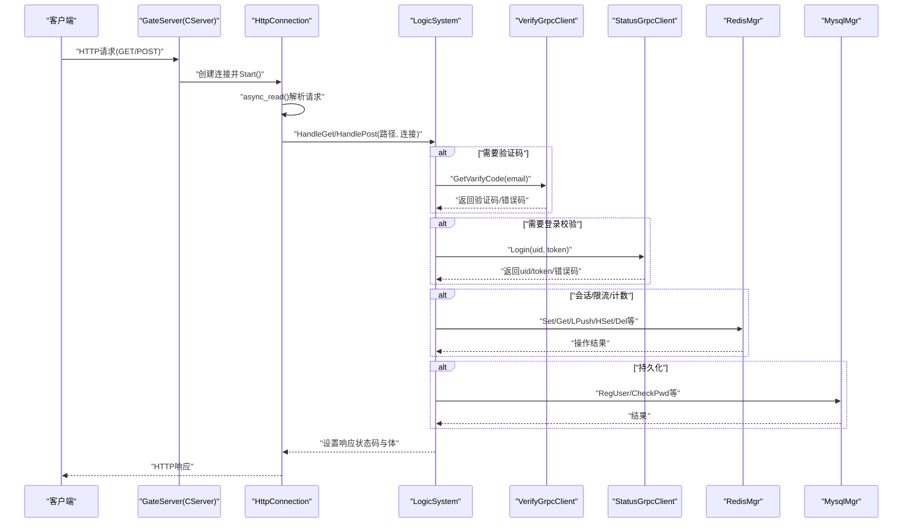
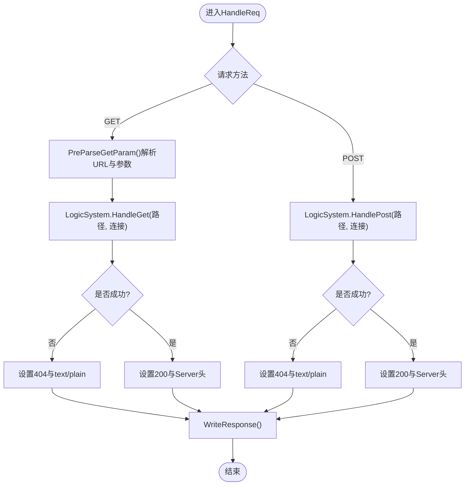
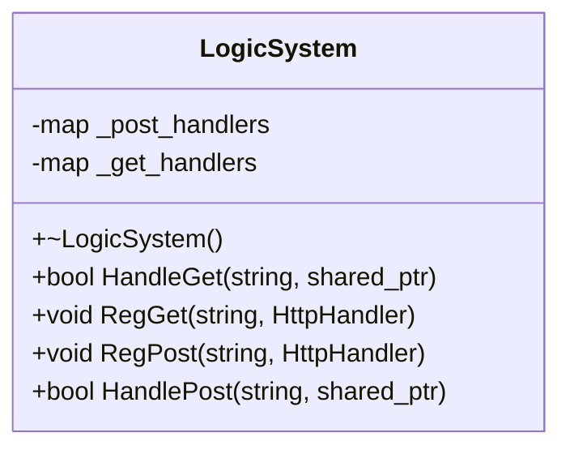
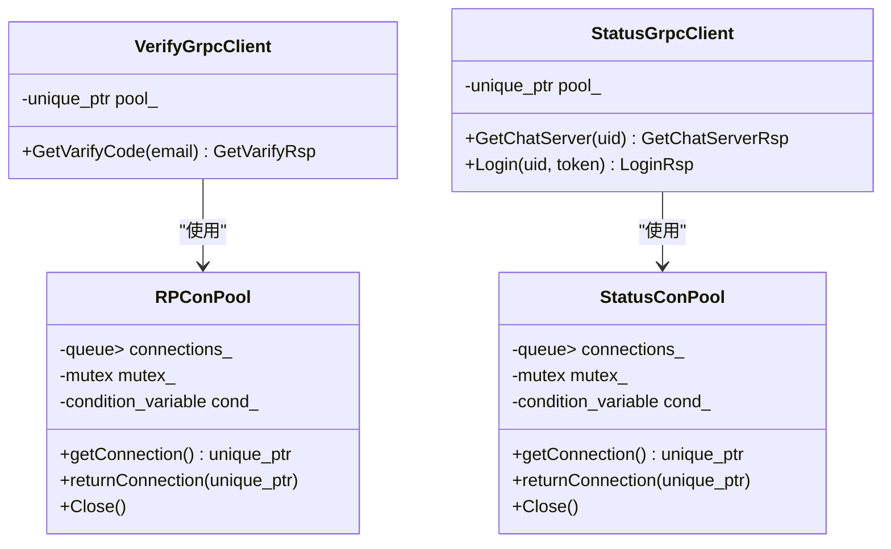
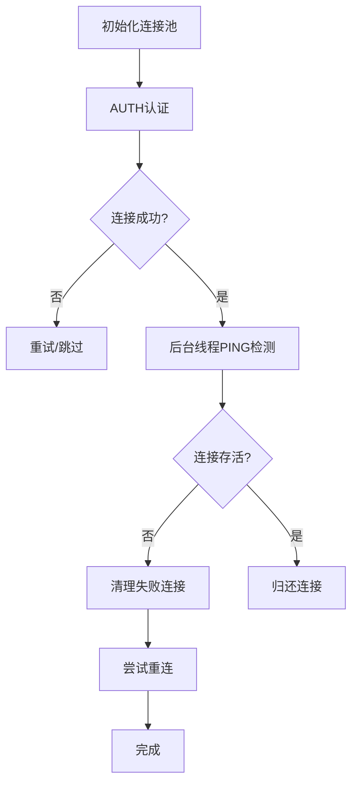
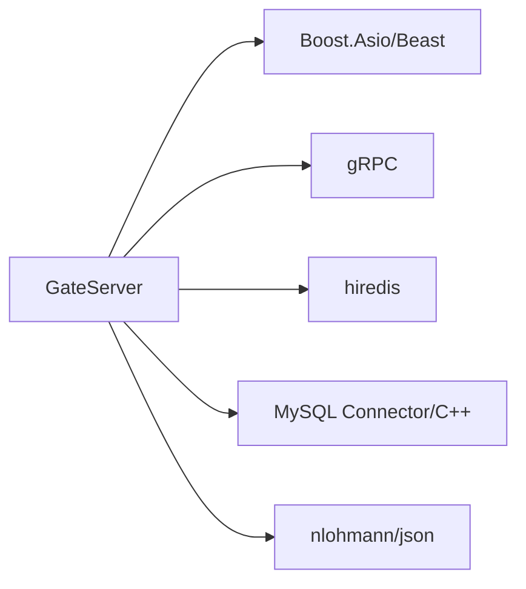

# GateServer网关服务

<cite>
**本文引用的文件**
- [GateServer.cpp](file://server/GateServer/src/GateServer.cpp)
- [CServer.h](file://server/GateServer/include/CServer.h)
- [CServer.cpp](file://server/GateServer/src/CServer.cpp)
- [HttpConnection.h](file://server/GateServer/include/HttpConnection.h)
- [HttpConnection.cpp](file://server/GateServer/src/HttpConnection.cpp)
- [LogicSystem.h](file://server/GateServer/include/LogicSystem.h)
- [ConfigMgr.h](file://server/GateServer/include/ConfigMgr.h)
- [RedisMgr.h](file://server/GateServer/include/RedisMgr.h)
- [MysqlMgr.h](file://server/GateServer/include/MysqlMgr.h)
- [VerifyGrpcClient.h](file://server/GateServer/include/VerifyGrpcClient.h)
- [StatusGrpcClient.h](file://server/GateServer/include/StatusGrpcClient.h)
- [const.h](file://server/GateServer/include/const.h)
- [verify.proto](file://proto/verify_service/verify.proto)
- [status.proto](file://proto/status_service/status.proto)
- [config.ini](file://server/GateServer/config/config.ini)
</cite>

## 目录
1. [简介](#简介)
2. [项目结构](#项目结构)
3. [核心组件](#核心组件)
4. [架构总览](#架构总览)
5. [详细组件分析](#详细组件分析)
6. [依赖关系分析](#依赖关系分析)
7. [性能考虑](#性能考虑)
8. [故障排查指南](#故障排查指南)
9. [结论](#结论)
10. [附录：API与集成指南](#附录api与集成指南)

## 简介
本技术文档围绕GateServer网关服务，系统阐述其作为HTTP网关的核心职责与实现细节。内容涵盖HTTP请求处理、路由转发、用户认证与会话管理、与VerifyServer（验证码服务）和StatusServer（状态服务）的gRPC通信机制、HTTP连接生命周期管理、请求解析与响应构建、Redis缓存操作、MySQL数据库访问、错误处理策略、配置管理、日志记录与监控指标、安全防护、限流控制与负载均衡等。文档同时提供具体的API接口示例与集成指南，帮助读者快速理解并正确集成GateServer。

## 项目结构
GateServer位于server/GateServer目录下，采用分层与模块化组织方式：
- 入口与启动：GateServer.cpp负责初始化配置、数据库与缓存管理器、信号处理、创建并启动HTTP服务器。
- HTTP服务器与连接：CServer负责监听端口与接受新连接；HttpConnection负责读取请求、解析参数、构造响应、超时控制与异步写回。
- 路由与业务编排：LogicSystem维护GET/POST路由表，将请求分发到具体处理器。
- 外部依赖：
  - gRPC客户端：VerifyGrpcClient与StatusGrpcClient分别对接验证码服务与状态服务。
  - 数据层：RedisMgr封装Redis连接池与常用操作；MysqlMgr封装MySQL DAO访问。
  - 配置：ConfigMgr加载INI配置文件。
  - 常量与公共类型：const.h定义错误码、JSON库别名、通用工具等。

**图表来源**
- [GateServer.cpp:128-158](file://server/GateServer/src/GateServer.cpp#L128-L158)
- [CServer.cpp:10-33](file://server/GateServer/src/CServer.cpp#L10-L33)
- [HttpConnection.cpp:132-194](file://server/GateServer/src/HttpConnection.cpp#L132-L194)
- [LogicSystem.h:9-22](file://server/GateServer/include/LogicSystem.h#L9-L22)
- [VerifyGrpcClient.h:80-110](file://server/GateServer/include/VerifyGrpcClient.h#L80-L110)
- [StatusGrpcClient.h:81-94](file://server/GateServer/include/StatusGrpcClient.h#L81-L94)
- [RedisMgr.h:267-303](file://server/GateServer/include/RedisMgr.h#L267-L303)
- [MysqlMgr.h:4-18](file://server/GateServer/include/MysqlMgr.h#L4-L18)
- [ConfigMgr.h:46-82](file://server/GateServer/include/ConfigMgr.h#L46-L82)
- [const.h:31-44](file://server/GateServer/include/const.h#L31-L44)

**章节来源**
- [GateServer.cpp:128-158](file://server/GateServer/src/GateServer.cpp#L128-L158)
- [CServer.cpp:10-33](file://server/GateServer/src/CServer.cpp#L10-L33)
- [HttpConnection.cpp:132-194](file://server/GateServer/src/HttpConnection.cpp#L132-L194)
- [LogicSystem.h:9-22](file://server/GateServer/include/LogicSystem.h#L9-L22)
- [VerifyGrpcClient.h:80-110](file://server/GateServer/include/VerifyGrpcClient.h#L80-L110)
- [StatusGrpcClient.h:81-94](file://server/GateServer/include/StatusGrpcClient.h#L81-L94)
- [RedisMgr.h:267-303](file://server/GateServer/include/RedisMgr.h#L267-L303)
- [MysqlMgr.h:4-18](file://server/GateServer/include/MysqlMgr.h#L4-L18)
- [ConfigMgr.h:46-82](file://server/GateServer/include/ConfigMgr.h#L46-L82)
- [const.h:31-44](file://server/GateServer/include/const.h#L31-L44)

## 核心组件
- 入口与启动（GateServer.cpp）
  - 初始化MysqlMgr与RedisMgr单例，加载配置获取端口，创建io_context与信号集，启动CServer监听，运行事件循环，退出时关闭Redis连接。
- HTTP服务器（CServer）
  - 基于Boost.Asio的TCP Accept器，从AsioIOServicePool获取io_context，异步接受连接，创建HttpConnection并调用Start，持续监听。
- HTTP连接（HttpConnection）
  - 使用beast::http::async_read读取请求，HandleReq根据方法分发GET/POST，PreParseGetParam解析URL与查询参数，WriteResponse设置响应头与体并异步写回，CheckDeadline设置60秒超时。
- 路由系统（LogicSystem）
  - 单例模式，维护GET/POST路由映射，HandleGet/HandlePost根据路径查找处理器执行。
- gRPC客户端
  - VerifyGrpcClient：连接池RPConPool管理多个VarifyService::Stub，提供GetVarifyCode方法，失败时返回统一错误码。
  - StatusGrpcClient：连接池StatusConPool管理多个StatusService::Stub，提供GetChatServer与Login方法。
- 数据访问
  - RedisMgr：连接池RedisConPool，包含PING保活、自动重连、原子计数、分布式锁接口等。
  - MysqlMgr：封装DAO方法，如注册、校验邮箱、更新密码、校验密码等。
- 配置管理（ConfigMgr）
  - 单例加载INI配置，支持按Section与Key取值。
- 常量与错误码（const.h）
  - 定义ErrorCodes枚举、Defer工具类、JSON别名等。

**章节来源**
- [GateServer.cpp:128-158](file://server/GateServer/src/GateServer.cpp#L128-L158)
- [CServer.cpp:10-33](file://server/GateServer/src/CServer.cpp#L10-L33)
- [HttpConnection.cpp:132-194](file://server/GateServer/src/HttpConnection.cpp#L132-L194)
- [LogicSystem.h:9-22](file://server/GateServer/include/LogicSystem.h#L9-L22)
- [VerifyGrpcClient.h:80-110](file://server/GateServer/include/VerifyGrpcClient.h#L80-L110)
- [StatusGrpcClient.h:81-94](file://server/GateServer/include/StatusGrpcClient.h#L81-L94)
- [RedisMgr.h:267-303](file://server/GateServer/include/RedisMgr.h#L267-L303)
- [MysqlMgr.h:4-18](file://server/GateServer/include/MysqlMgr.h#L4-L18)
- [ConfigMgr.h:46-82](file://server/GateServer/include/ConfigMgr.h#L46-L82)
- [const.h:31-44](file://server/GateServer/include/const.h#L31-L44)

## 架构总览
GateServer作为HTTP网关，承担以下职责：
- 接收HTTP请求，解析方法与路径，路由到对应处理器。
- 在处理器中调用VerifyServer获取验证码、调用StatusServer进行登录与会话校验、查询或写入Redis缓存、访问MySQL持久化数据。
- 统一错误码与响应格式，保证对外一致性。
- 通过连接池与超时控制提升稳定性与吞吐。

**图表来源**
- [CServer.cpp:10-33](file://server/GateServer/src/CServer.cpp#L10-L33)
- [HttpConnection.cpp:132-194](file://server/GateServer/src/HttpConnection.cpp#L132-L194)
- [VerifyGrpcClient.h:80-110](file://server/GateServer/include/VerifyGrpcClient.h#L80-L110)
- [StatusGrpcClient.h:81-94](file://server/GateServer/include/StatusGrpcClient.h#L81-L94)
- [RedisMgr.h:267-303](file://server/GateServer/include/RedisMgr.h#L267-L303)
- [MysqlMgr.h:4-18](file://server/GateServer/include/MysqlMgr.h#L4-L18)

## 详细组件分析

### HTTP连接与请求处理（HttpConnection）
- 生命周期
  - Start()异步读取请求，异常捕获后继续等待下一个请求。
  - HandleReq()根据method分支处理GET/POST，未匹配路由返回404。
  - CheckDeadline()设置60秒定时器，超时关闭socket。
  - WriteResponse()设置Content-Length并异步写回，完成后shutdown发送端并取消定时器。
- GET参数解析
  - PreParseGetParam()提取URI与查询字符串，URL解码后填充_get_params。
- 响应构建
  - 设置版本、keep_alive=false、CORS允许所有来源（生产建议限制）、Server头为“GateServer”。

**图表来源**
- [HttpConnection.cpp:132-194](file://server/GateServer/src/HttpConnection.cpp#L132-L194)
- [HttpConnection.cpp:96-130](file://server/GateServer/src/HttpConnection.cpp#L96-L130)
- [HttpConnection.cpp:210-223](file://server/GateServer/src/HttpConnection.cpp#L210-L223)

**章节来源**
- [HttpConnection.cpp:132-194](file://server/GateServer/src/HttpConnection.cpp#L132-L194)
- [HttpConnection.cpp:96-130](file://server/GateServer/src/HttpConnection.cpp#L96-L130)
- [HttpConnection.cpp:210-223](file://server/GateServer/src/HttpConnection.cpp#L210-L223)

### 路由系统（LogicSystem）
- 设计要点
  - 单例模式，避免重复实例化。
  - 维护两个映射表：_get_handlers与_post_handlers，键为路径，值为函数指针。
  - RegGet/RegPost用于注册处理器；HandleGet/HandlePost用于查找并执行。
- 扩展性
  - 新增路由只需注册处理器函数，保持高内聚低耦合。

**图表来源**
- [LogicSystem.h:9-22](file://server/GateServer/include/LogicSystem.h#L9-L22)

**章节来源**
- [LogicSystem.h:9-22](file://server/GateServer/include/LogicSystem.h#L9-L22)

### gRPC客户端（VerifyGrpcClient与StatusGrpcClient）
- 连接池设计
  - RPConPool/StatusConPool维护固定数量的Stub对象，线程安全地借还与归还。
  - 使用条件变量阻塞等待可用连接，支持优雅关闭。
- 调用流程
  - VerifyGrpcClient.GetVarifyCode：构造请求、获取Stub、调用远端、返回应答或设置错误码。
  - StatusGrpcClient.Login/GetChatServer：类似流程，返回统一错误码与业务字段。

**图表来源**
- [VerifyGrpcClient.h:18-78](file://server/GateServer/include/VerifyGrpcClient.h#L18-L78)
- [VerifyGrpcClient.h:80-110](file://server/GateServer/include/VerifyGrpcClient.h#L80-L110)
- [StatusGrpcClient.h:19-79](file://server/GateServer/include/StatusGrpcClient.h#L19-L79)
- [StatusGrpcClient.h:81-94](file://server/GateServer/include/StatusGrpcClient.h#L81-L94)

**章节来源**
- [VerifyGrpcClient.h:18-78](file://server/GateServer/include/VerifyGrpcClient.h#L18-L78)
- [VerifyGrpcClient.h:80-110](file://server/GateServer/include/VerifyGrpcClient.h#L80-L110)
- [StatusGrpcClient.h:19-79](file://server/GateServer/include/StatusGrpcClient.h#L19-L79)
- [StatusGrpcClient.h:81-94](file://server/GateServer/include/StatusGrpcClient.h#L81-L94)

### Redis缓存操作（RedisMgr）
- 连接池特性
  - 初始化时AUTH认证，后台线程周期性PING检测存活，失败连接清理并重连。
  - 提供阻塞与非阻塞取连接接口，确保高并发下的可用性。
- 常用操作
  - Set/Get、LPush/RPop、HSet/HGet/HDel、Del、ExistsKey等。
  - 分布式锁acquireLock/releaseLock、计数IncreaseCount/DecreaseCount/InitCount/DelCount。
- 错误处理
  - 捕获异常释放资源，统计fail_count并触发重连。

**图表来源**
- [RedisMgr.h:112-206](file://server/GateServer/include/RedisMgr.h#L112-L206)
- [RedisMgr.h:267-303](file://server/GateServer/include/RedisMgr.h#L267-L303)

**章节来源**
- [RedisMgr.h:112-206](file://server/GateServer/include/RedisMgr.h#L112-L206)
- [RedisMgr.h:267-303](file://server/GateServer/include/RedisMgr.h#L267-L303)

### MySQL数据库访问（MysqlMgr）
- 功能封装
  - 注册用户、校验邮箱、更新密码、校验密码、存储过程测试等。
- 错误处理
  - 通过DAO层抛出异常，上层捕获并转换为统一错误码。

**章节来源**
- [MysqlMgr.h:4-18](file://server/GateServer/include/MysqlMgr.h#L4-L18)

### 配置管理（ConfigMgr）
- 单例加载INI配置，支持Section与Key访问。
- 启动时读取GateServer端口、各服务Host/Port、数据库与Redis信息。

**章节来源**
- [ConfigMgr.h:46-82](file://server/GateServer/include/ConfigMgr.h#L46-L82)
- [config.ini:1-25](file://server/GateServer/config/config.ini#L1-L25)

### 错误码与常量（const.h）
- ErrorCodes定义统一错误码，包括JSON解析错误、RPC失败、验证码过期/错误、用户存在、密码错误、Token无效等。
- Defer工具类用于RAII式资源释放。

**章节来源**
- [const.h:31-44](file://server/GateServer/include/const.h#L31-L44)

## 依赖关系分析
GateServer对外的依赖主要包括：
- Boost.Asio与Beast：网络I/O与HTTP协议栈。
- gRPC：与VerifyServer与StatusServer通信。
- hiredis：Redis客户端。
- MySQL Connector/C++：数据库访问。
- nlohmann/json：JSON序列化/反序列化。

**图表来源**
- [const.h:1-25](file://server/GateServer/include/const.h#L1-L25)
- [VerifyGrpcClient.h:1-10](file://server/GateServer/include/VerifyGrpcClient.h#L1-L10)
- [StatusGrpcClient.h:1-10](file://server/GateServer/include/StatusGrpcClient.h#L1-L10)
- [RedisMgr.h:1-10](file://server/GateServer/include/RedisMgr.h#L1-L10)
- [MysqlMgr.h:1-5](file://server/GateServer/include/MysqlMgr.h#L1-L5)

**章节来源**
- [const.h:1-25](file://server/GateServer/include/const.h#L1-L25)
- [VerifyGrpcClient.h:1-10](file://server/GateServer/include/VerifyGrpcClient.h#L1-L10)
- [StatusGrpcClient.h:1-10](file://server/GateServer/include/StatusGrpcClient.h#L1-L10)
- [RedisMgr.h:1-10](file://server/GateServer/include/RedisMgr.h#L1-L10)
- [MysqlMgr.h:1-5](file://server/GateServer/include/MysqlMgr.h#L1-L5)

## 性能考虑
- 连接池
  - Redis与gRPC均使用连接池，减少握手与上下文切换开销。
- 异步I/O
  - 使用Boost.Asio与Beast的异步读写，提高并发处理能力。
- 超时控制
  - 每个连接设置60秒超时，防止僵尸连接占用资源。
- 保活与重连
  - Redis后台线程PING检测，失败连接清理并重连，保障可用性。
- 路由查找
  - 使用std::map或unordered_map进行路径匹配，注意选择合适的数据结构与索引策略。

[本节为通用指导，不直接分析具体文件]

## 故障排查指南
- 常见问题定位
  - 连接失败：检查Redis与MySQL配置、网络连通性与认证信息。
  - gRPC调用失败：确认VerifyServer与StatusServer地址与端口，查看错误码。
  - 超时：检查业务逻辑耗时与后端服务响应时间。
- 日志与调试
  - 关注控制台输出中的错误信息与异常堆栈。
  - 增加关键路径日志，便于追踪问题。
- 恢复策略
  - 利用Redis连接池的重连机制与gRPC连接池的优雅关闭。

**章节来源**
- [GateServer.cpp:150-156](file://server/GateServer/src/GateServer.cpp#L150-L156)
- [HttpConnection.cpp:14-28](file://server/GateServer/src/HttpConnection.cpp#L14-L28)
- [RedisMgr.h:112-206](file://server/GateServer/include/RedisMgr.h#L112-L206)
- [VerifyGrpcClient.h:95-103](file://server/GateServer/include/VerifyGrpcClient.h#L95-L103)
- [StatusGrpcClient.h:81-94](file://server/GateServer/include/StatusGrpcClient.h#L81-L94)

## 结论
GateServer作为HTTP网关，具备清晰的层次结构与稳定的基础设施支撑。通过连接池、异步I/O与超时控制，能够有效应对高并发场景。与VerifyServer与StatusServer的gRPC通信提供了验证码与状态管理能力，结合Redis与MySQL实现了缓存与持久化。建议在后续迭代中完善限流、鉴权与监控指标收集，进一步提升安全性与可观测性。

[本节为总结，不直接分析具体文件]

## 附录：API与集成指南
- 验证码接口（GET）
  - 路径：/verify/get?email=xxx
  - 说明：调用VerifyServer获取验证码，返回统一错误码与验证码内容。
  - 示例：GET http://localhost:8080/verify/get?email=user@example.com
- 登录接口（POST）
  - 路径：/auth/login
  - 说明：校验用户凭据，调用StatusServer进行登录，返回uid与token。
  - 示例：POST http://localhost:8080/auth/login
  - 请求体：{ "email": "user@example.com", "password": "your_password" }
- 会话校验接口（POST）
  - 路径：/auth/check
  - 说明：携带uid与token，验证会话有效性。
  - 示例：POST http://localhost:8080/auth/check
  - 请求体：{ "uid": 123, "token": "your_token" }

- 集成步骤
  - 配置：编辑config.ini，填写各服务Host与Port。
  - 启动：编译并运行GateServer，监听指定端口。
  - 调用：通过HTTP客户端发起请求，处理响应与错误码。

**章节来源**
- [config.ini:1-25](file://server/GateServer/config/config.ini#L1-L25)
- [verify.proto:1-19](file://proto/verify_service/verify.proto#L1-L19)
- [status.proto:1-32](file://proto/status_service/status.proto#L1-L32)
- [HttpConnection.cpp:132-194](file://server/GateServer/src/HttpConnection.cpp#L132-L194)