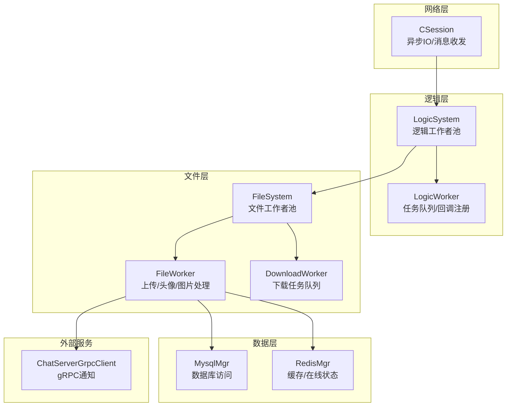
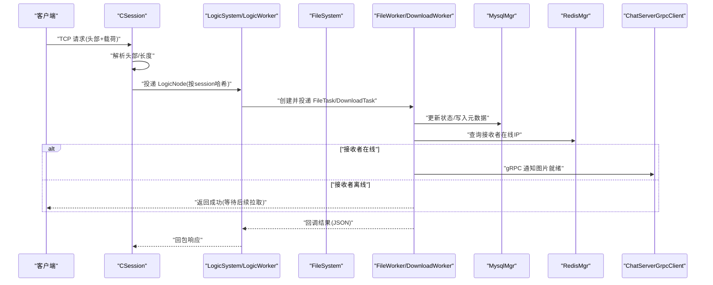
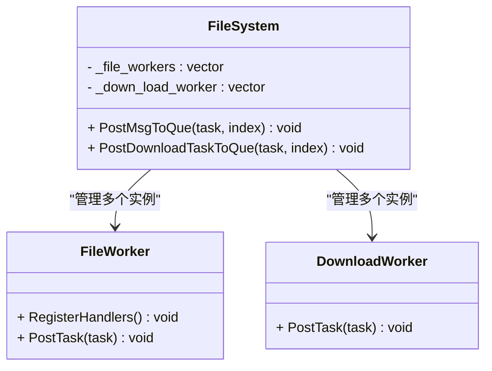
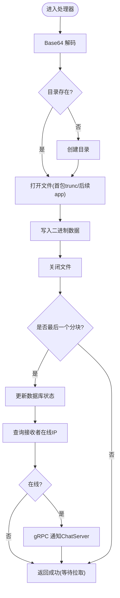
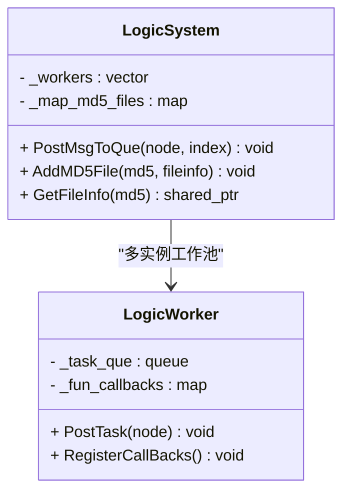
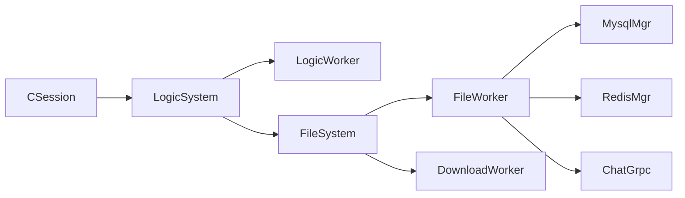
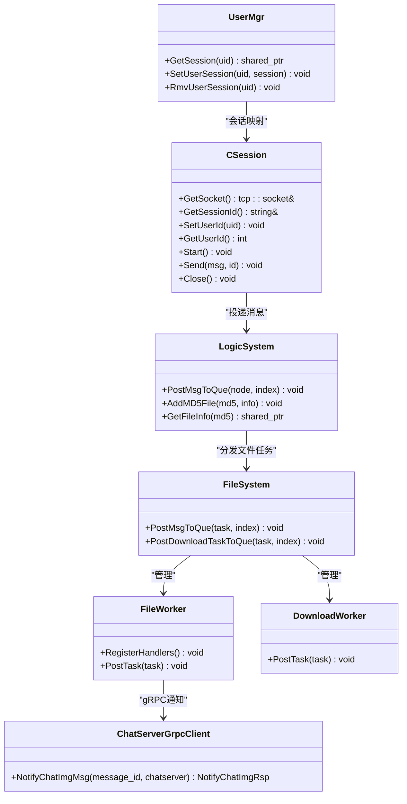

# ResourceServer资源存储服务

<cite>
**本文引用的文件**
- [FileSystem.h](file://server/ResourceServer/include/FileSystem.h)
- [FileWorker.h](file://server/ResourceServer/include/FileWorker.h)
- [FileInfo.h](file://server/ResourceServer/include/FileInfo.h)
- [LogicSystem.h](file://server/ResourceServer/include/LogicSystem.h)
- [CSession.h](file://server/ResourceServer/include/CSession.h)
- [LogicWorker.h](file://server/ResourceServer/include/LogicWorker.h)
- [const.h](file://server/ResourceServer/include/const.h)
- [data.h](file://server/ResourceServer/include/data.h)
- [ChatServerGrpcClient.h](file://server/ResourceServer/include/ChatServerGrpcClient.h)
- [UserMgr.h](file://server/ResourceServer/include/UserMgr.h)
- [FileSystem.cpp](file://server/ResourceServer/src/FileSystem.cpp)
- [FileWorker.cpp](file://server/ResourceServer/src/FileWorker.cpp)
- [LogicSystem.cpp](file://server/ResourceServer/src/LogicSystem.cpp)
- [CSession.cpp](file://server/ResourceServer/src/CSession.cpp)
</cite>

## 目录
1. [简介](#简介)
2. [项目结构](#项目结构)
3. [核心组件](#核心组件)
4. [架构总览](#架构总览)
5. [详细组件分析](#详细组件分析)
6. [依赖关系分析](#依赖关系分析)
7. [性能考量](#性能考量)
8. [故障排查指南](#故障排查指南)
9. [结论](#结论)
10. [附录](#附录)

## 简介
本技术文档围绕 ResourceServer 资源存储服务，系统性阐述其文件上传下载、断点续传、进度跟踪与并发控制等核心能力。重点解析文件系统抽象层 FileSystem、文件工作线程 FileWorker/DownloadWorker、文件信息管理 FileInfo 与 LogicSystem 的协作机制；说明分块上传、合并策略与完整性校验思路；记录与 ChatServer 的通知协作、用户权限验证与存储空间管理；并给出大文件处理、内存管理与磁盘 IO 优化建议，以及 API 接口、错误处理和监控告警方案。

## 项目结构
ResourceServer 采用分层与职责分离的设计：网络会话层（CSession）负责异步读写与消息编解码；逻辑分发层（LogicSystem/LogicWorker）负责业务路由与任务调度；文件服务层（FileSystem/FileWorker/DownloadWorker）负责具体文件 I/O 与分块处理；数据与配置层（MysqlMgr/RedisMgr/ConfigMgr）提供持久化与缓存；跨服务通信通过 gRPC 客户端（ChatServerGrpcClient）完成。

图表来源
- [CSession.h:1-64](file://server/ResourceServer/include/CSession.h#L1-L64)
- [LogicSystem.h:1-33](file://server/ResourceServer/include/LogicSystem.h#L1-L33)
- [FileSystem.h:1-21](file://server/ResourceServer/include/FileSystem.h#L1-L21)
- [FileWorker.h:1-91](file://server/ResourceServer/include/FileWorker.h#L1-L91)

章节来源
- [CSession.h:1-64](file://server/ResourceServer/include/CSession.h#L1-L64)
- [LogicSystem.h:1-33](file://server/ResourceServer/include/LogicSystem.h#L1-L33)
- [FileSystem.h:1-21](file://server/ResourceServer/include/FileSystem.h#L1-L21)
- [FileWorker.h:1-91](file://server/ResourceServer/include/FileWorker.h#L1-L91)

## 核心组件
- CSession：基于 Boost.Asio 的 TCP 会话，实现头部/体异步读取、发送队列与错误恢复。
- LogicSystem/LogicWorker：逻辑消息路由与多工作线程任务队列，按 session hash 均衡分配。
- FileSystem/FileWorker/DownloadWorker：文件工作者池与下载工作者池，封装上传、头像更新、聊天图片处理与下载任务。
- FileInfo/ChatImgInfo：文件元信息与聊天图片关联信息。
- ChatServerGrpcClient：连接池化的 gRPC 客户端，用于向 ChatServer 推送图片就绪通知。
- UserMgr：用户会话映射，维护 uid 到 CSession 的绑定。

章节来源
- [CSession.cpp:1-200](file://server/ResourceServer/src/CSession.cpp#L1-L200)
- [LogicSystem.cpp:1-46](file://server/ResourceServer/src/LogicSystem.cpp#L1-L46)
- [FileSystem.cpp:1-29](file://server/ResourceServer/src/FileSystem.cpp#L1-L29)
- [FileWorker.cpp:1-200](file://server/ResourceServer/src/FileWorker.cpp#L1-L200)
- [FileInfo.h:1-26](file://server/ResourceServer/include/FileInfo.h#L1-L26)
- [ChatServerGrpcClient.h:1-93](file://server/ResourceServer/include/ChatServerGrpcClient.h#L1-L93)
- [UserMgr.h:1-22](file://server/ResourceServer/include/UserMgr.h#L1-L22)

## 架构总览
ResourceServer 的请求处理流程如下：
- 客户端通过 TCP 发送带固定头部的消息（msg_type + length）。
- CSession 解析头部后，将消息投递至 LogicSystem，按 session 哈希选择 LogicWorker。
- LogicWorker 根据 msg_type 调用对应处理器，可能创建 FileTask/DownloadTask 并投递给 FileSystem。
- FileSystem 将任务分发给 FileWorker/DownloadWorker 执行，涉及文件写入、数据库更新、Redis 查询与 gRPC 通知。

图表来源
- [CSession.cpp:1-200](file://server/ResourceServer/src/CSession.cpp#L1-L200)
- [LogicSystem.cpp:1-46](file://server/ResourceServer/src/LogicSystem.cpp#L1-L46)
- [FileWorker.cpp:1-200](file://server/ResourceServer/src/FileWorker.cpp#L1-L200)
- [ChatServerGrpcClient.h:1-93](file://server/ResourceServer/include/ChatServerGrpcClient.h#L1-L93)

## 详细组件分析

### 文件系统抽象层 FileSystem
- 职责：维护 FileWorker 与 DownloadWorker 的工作者池，提供 PostMsgToQue 与 PostDownloadTaskToQue 进行任务分发。
- 并发模型：工作者数量由常量定义（FILE_WORKER_COUNT/DOWN_LOAD_WORKER_COUNT），构造时初始化。
- 扩展性：可通过增加工作者数量提升吞吐。

图表来源
- [FileSystem.h:1-21](file://server/ResourceServer/include/FileSystem.h#L1-L21)
- [FileSystem.cpp:1-29](file://server/ResourceServer/src/FileSystem.cpp#L1-L29)
- [FileWorker.h:1-91](file://server/ResourceServer/include/FileWorker.h#L1-L91)

章节来源
- [FileSystem.h:1-21](file://server/ResourceServer/include/FileSystem.h#L1-L21)
- [FileSystem.cpp:1-29](file://server/ResourceServer/src/FileSystem.cpp#L1-L29)

### 文件工作线程 FileWorker/DownloadWorker
- FileWorker：
  - 内部单线程循环从任务队列取出函数对象执行，使用条件变量与互斥量保证线程安全。
  - 注册多种处理器：普通文件上传、头像上传、聊天图片上传、文件信息同步、续传图片等。
  - 每个处理器均包含 Base64 解码、路径检查与创建、二进制追加写入、最后分块完成后状态更新与通知。
- DownloadWorker：
  - 类似结构，负责下载任务的队列与回调。

图表来源
- [FileWorker.cpp:1-200](file://server/ResourceServer/src/FileWorker.cpp#L1-L200)
- [FileWorker.cpp:200-400](file://server/ResourceServer/src/FileWorker.cpp#L200-L400)

章节来源
- [FileWorker.h:1-91](file://server/ResourceServer/include/FileWorker.h#L1-L91)
- [FileWorker.cpp:1-200](file://server/ResourceServer/src/FileWorker.cpp#L1-L200)
- [FileWorker.cpp:200-400](file://server/ResourceServer/src/FileWorker.cpp#L200-L400)

### 文件信息管理 FileInfo
- FileInfo：保存序列号、文件名、总大小、已传输大小与文件路径字符串，用于分块与续传。
- ChatImgInfo：记录发送者、接收者、消息ID与图片名，便于聊天场景的图片关联。

章节来源
- [FileInfo.h:1-26](file://server/ResourceServer/include/FileInfo.h#L1-L26)

### 逻辑系统 LogicSystem/LogicWorker
- LogicSystem：维护 LogicWorker 池，提供 PostMsgToQue 分发；维护 MD5 到 FileInfo 的映射，支持文件去重与快速查找。
- LogicWorker：注册回调函数表，按 msg_type 路由到具体处理器。

图表来源
- [LogicSystem.h:1-33](file://server/ResourceServer/include/LogicSystem.h#L1-L33)
- [LogicWorker.h:1-38](file://server/ResourceServer/include/LogicWorker.h#L1-L38)
- [LogicSystem.cpp:1-46](file://server/ResourceServer/src/LogicSystem.cpp#L1-L46)

章节来源
- [LogicSystem.h:1-33](file://server/ResourceServer/include/LogicSystem.h#L1-L33)
- [LogicWorker.h:1-38](file://server/ResourceServer/include/LogicWorker.h#L1-L38)
- [LogicSystem.cpp:1-46](file://server/ResourceServer/src/LogicSystem.cpp#L1-L46)

### 网络会话 CSession
- 功能：异步读取头部与载荷，校验长度与 msg_type，构建 RecvNode 并投递到 LogicSystem；发送端维护队列与异步写回调。
- 错误处理：读失败或长度不匹配时关闭会话并从服务器清理。

章节来源
- [CSession.h:1-64](file://server/ResourceServer/include/CSession.h#L1-L64)
- [CSession.cpp:1-200](file://server/ResourceServer/src/CSession.cpp#L1-L200)

### 与 ChatServer 的通知协作
- ChatServerGrpcClient：维护连接池，获取/归还 gRPC Stub，提供 NotifyChatImgMsg 方法。
- FileWorker 在聊天图片上传完成后，查询接收者 IP（Redis），若在线则通过 gRPC 通知 ChatServer 触发客户端拉取。

章节来源
- [ChatServerGrpcClient.h:1-93](file://server/ResourceServer/include/ChatServerGrpcClient.h#L1-L93)
- [FileWorker.cpp:200-400](file://server/ResourceServer/src/FileWorker.cpp#L200-L400)

### 用户权限与会话管理
- UserMgr：维护 uid 到 CSession 的映射，支持设置、获取与移除会话。
- 结合 LogicSystem 的 MD5 映射，可实现重复文件识别与共享存储。

章节来源
- [UserMgr.h:1-22](file://server/ResourceServer/include/UserMgr.h#L1-L22)
- [LogicSystem.h:1-33](file://server/ResourceServer/include/LogicSystem.h#L1-L33)

## 依赖关系分析
- CSession 依赖 LogicSystem 进行消息分发。
- LogicSystem 依赖 LogicWorker 与 FileSystem。
- FileSystem 依赖 FileWorker/DownloadWorker。
- FileWorker 依赖 MysqlMgr、RedisMgr、ChatServerGrpcClient。
- const.h 定义错误码、消息类型、工作者数量与限制。

图表来源
- [CSession.h:1-64](file://server/ResourceServer/include/CSession.h#L1-L64)
- [LogicSystem.h:1-33](file://server/ResourceServer/include/LogicSystem.h#L1-L33)
- [FileSystem.h:1-21](file://server/ResourceServer/include/FileSystem.h#L1-L21)
- [FileWorker.h:1-91](file://server/ResourceServer/include/FileWorker.h#L1-L91)
- [const.h:1-117](file://server/ResourceServer/include/const.h#L1-L117)

章节来源
- [const.h:1-117](file://server/ResourceServer/include/const.h#L1-L117)

## 性能考量
- 并发模型：
  - LogicWorker 与 FileWorker/DownloadWorker 均采用“单生产者-多消费者”的任务队列模式，避免锁竞争热点。
  - 工作者数量由常量控制，可按 CPU 核数与 IO 特性调优。
- 分块上传与续传：
  - 首包 trunc 新建文件，后续分块 app 追加；last 标志位触发最终状态更新与通知。
  - 建议在服务端计算分块 MD5 并与总文件 MD5 比对，确保完整性。
- 内存管理：
  - 大文件应流式写入，避免一次性加载到内存；Base64 解码可考虑增量解码以降低峰值内存。
- 磁盘 IO 优化：
  - 合理设置缓冲区大小与刷盘策略；对高并发写入可使用顺序写与预分配空间。
- 网络与序列化：
  - 固定头部减少解析开销；JSON 体积较大时可考虑 Protobuf 替代。
- 缓存与去重：
  - LogicSystem 的 MD5 映射可用于去重与快速定位；Redis 缓存用户在线状态与基础信息。

[本节为通用性能指导，不直接分析具体文件]

## 故障排查指南
- 常见错误码（部分）：
  - Json解析错误、RPC请求错误、验证码过期/错误、Token失效、uid无效、文件不存在、Redis读取失败、文件读写权限不足、序列/偏移非法、消息id错误等。
- 典型问题定位：
  - 上传失败：检查目录创建、文件打开与写入返回值；确认 last 标志与分块序列正确。
  - 通知未达：确认 Redis 中接收者 IP 是否存在；检查 gRPC 连接池与通道状态。
  - 会话异常：查看 CSession 的错误回调与日志，确认长度校验与 msg_type 合法性。
- 建议日志与监控：
  - 记录关键步骤（解码、目录创建、文件写入、状态更新、gRPC 调用）耗时与错误码。
  - 统计队列长度、工作者空闲率、错误率与超时比例。

章节来源
- [const.h:1-117](file://server/ResourceServer/include/const.h#L1-L117)
- [CSession.cpp:1-200](file://server/ResourceServer/src/CSession.cpp#L1-L200)
- [FileWorker.cpp:1-200](file://server/ResourceServer/src/FileWorker.cpp#L1-L200)

## 结论
ResourceServer 以清晰的分层与工作者池模型实现了高并发、可扩展的文件服务。通过分块上传、续传与状态同步，配合 Redis 与 gRPC 通知，形成完整的图片与文件流转闭环。建议在完整性校验、内存与 IO 优化方面持续完善，以提升稳定性与吞吐。

[本节为总结性内容，不直接分析具体文件]

## 附录

### 文件API接口（基于消息类型）
- ID_UPLOAD_FILE_REQ / ID_UPLOAD_FILE_RSP：普通文件上传请求/回复
- ID_SYNC_FILE_REQ / ID_SYNC_FILE_RSP：文件信息同步请求/回复
- ID_UPLOAD_HEAD_ICON_REQ / ID_UPLOAD_HEAD_ICON_RSP：头像上传请求/回复
- ID_DOWN_LOAD_FILE_REQ / ID_DOWN_LOAD_FILE_RSP：下载文件请求/回复
- ID_IMG_CHAT_UPLOAD_REQ / ID_IMG_CHAT_UPLOAD_RSP：聊天图片上传请求/回复
- ID_NOTIFY_IMG_CHAT_MSG_REQ：通知客户端图片就绪
- ID_FILE_INFO_SYNC_REQ / ID_FILE_INFO_SYNC_RSP：文件信息同步请求/回复
- ID_IMG_CHAT_CONTINUE_UPLOAD_REQ / ID_IMG_CHAT_CONTINUE_UPLOAD_RSP：续传聊天图片请求/回复
- ID_IMG_CHAT_DOWN_INFO_SYNC_REQ / ID_IMG_CHAT_DOWN_INFO_SYNC_RSP：下载同步信息请求/回复
- ID_IMG_CHAT_DOWN_REQ / ID_IMG_CHAT_DOWN_RSP：聊天图片下载请求/回复

章节来源
- [const.h:1-117](file://server/ResourceServer/include/const.h#L1-L117)

### 数据结构与字段说明
- FileInfo：seq、name、total_size、trans_size、file_path_str
- ChatImgInfo：sender_id、receiver_id、message_id、img_name
- UserInfo/ApplyInfo/ChatMessage/PageResult：用户与应用相关的数据结构

章节来源
- [FileInfo.h:1-26](file://server/ResourceServer/include/FileInfo.h#L1-L26)
- [data.h:1-60](file://server/ResourceServer/include/data.h#L1-L60)

### 类关系图（代码级）

图表来源
- [CSession.h:1-64](file://server/ResourceServer/include/CSession.h#L1-L64)
- [LogicSystem.h:1-33](file://server/ResourceServer/include/LogicSystem.h#L1-L33)
- [FileSystem.h:1-21](file://server/ResourceServer/include/FileSystem.h#L1-L21)
- [FileWorker.h:1-91](file://server/ResourceServer/include/FileWorker.h#L1-L91)
- [ChatServerGrpcClient.h:1-93](file://server/ResourceServer/include/ChatServerGrpcClient.h#L1-L93)
- [UserMgr.h:1-22](file://server/ResourceServer/include/UserMgr.h#L1-L22)