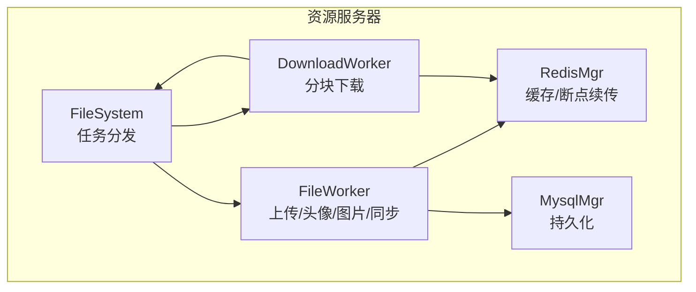
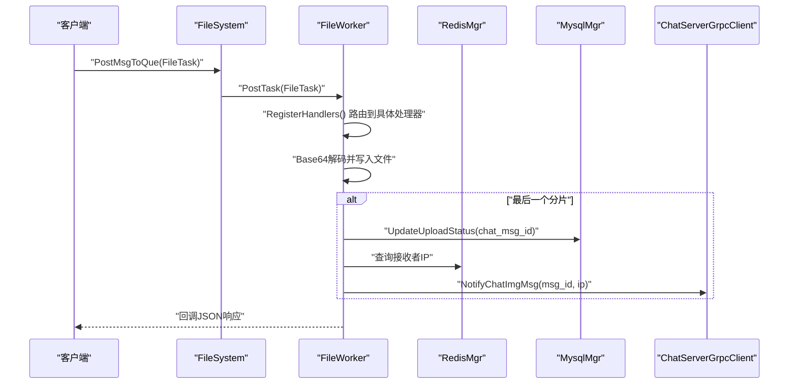
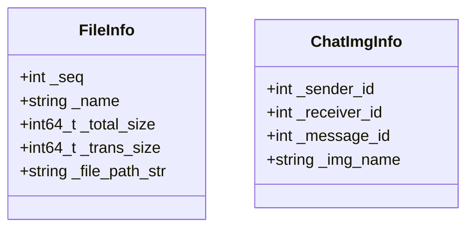
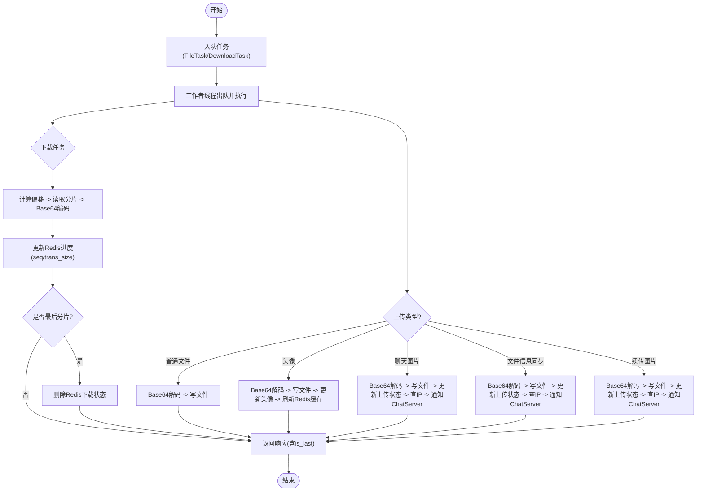
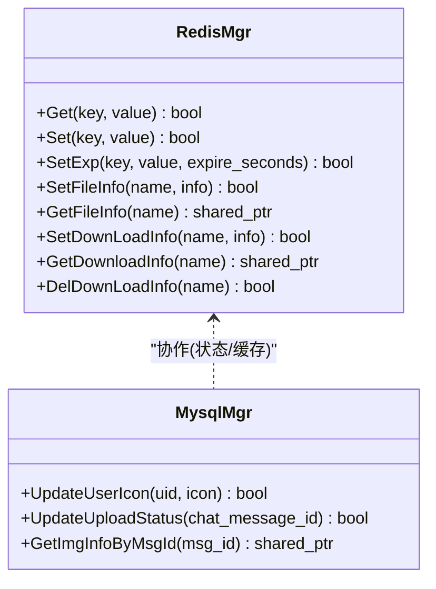
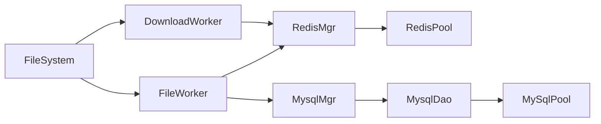

# 文件信息管理

<cite>
**本文引用的文件**   
- [FileInfo.h](file://server/ResourceServer/include/FileInfo.h)
- [FileInfo.cpp](file://server/ResourceServer/src/FileInfo.cpp)
- [FileSystem.h](file://server/ResourceServer/include/FileSystem.h)
- [FileSystem.cpp](file://server/ResourceServer/src/FileSystem.cpp)
- [FileWorker.h](file://server/ResourceServer/include/FileWorker.h)
- [FileWorker.cpp](file://server/ResourceServer/src/FileWorker.cpp)
- [RedisMgr.h](file://server/ResourceServer/include/RedisMgr.h)
- [RedisMgr.cpp](file://server/ResourceServer/src/RedisMgr.cpp)
- [MysqlMgr.h](file://server/ResourceServer/include/MysqlMgr.h)
- [MysqlMgr.cpp](file://server/ResourceServer/src/MysqlMgr.cpp)
- [MysqlDao.h](file://server/ResourceServer/include/MysqlDao.h)
- [const.h](file://server/ResourceServer/include/const.h)
- [data.h](file://server/ResourceServer/include/data.h)
</cite>

## 目录
1. [简介](#简介)
2. [项目结构](#项目结构)
3. [核心组件](#核心组件)
4. [架构总览](#架构总览)
5. [详细组件分析](#详细组件分析)
6. [依赖关系分析](#依赖关系分析)
7. [性能考量](#性能考量)
8. [故障排查指南](#故障排查指南)
9. [结论](#结论)
10. [附录：API与数据结构、操作示例](#附录api与数据结构操作示例)

## 简介
本文件为 ResourceServer 文件信息管理系统的技术文档，聚焦于 FileInfo 类的元数据设计、文件索引维护、断点续传与去重机制、生命周期管理、权限控制、访问日志与安全审计、搜索与统计、以及性能监控。系统基于 C++ 实现，采用工作线程队列处理上传/下载任务，通过 Redis 缓存进行状态同步与断点续传，MySQL 持久化存储用户与聊天消息信息，并通过 gRPC 与其他服务交互。

## 项目结构
ResourceServer 模块围绕“文件系统抽象 + 工作者线程 + 缓存/数据库”的架构组织：
- 文件模型与任务定义：FileInfo、ChatImgInfo、FileTask、DownloadTask
- 文件系统调度：FileSystem（单例）负责将任务分发到多个 FileWorker/DownloadWorker
- 工作者：FileWorker（上传/头像/图片/同步）、DownloadWorker（分块读取+Base64编码）
- 缓存层：RedisMgr（连接池、锁、计数、FileInfo 存取）
- 持久化层：MysqlMgr/MysqlDao（用户、聊天消息、图片状态等）
- 常量与错误码：const.h（消息类型、错误码、传输大小限制等）
- 数据模型：data.h（用户、聊天消息、分页结果等）

**图表来源** 
- [FileSystem.h:7-18](file://server/ResourceServer/include/FileSystem.h#L7-L18)
- [FileSystem.cpp:19-28](file://server/ResourceServer/src/FileSystem.cpp#L19-L28)
- [FileWorker.h:59-91](file://server/ResourceServer/include/FileWorker.h#L59-L91)
- [RedisMgr.h:269-311](file://server/ResourceServer/include/RedisMgr.h#L269-L311)
- [MysqlMgr.h:9-42](file://server/ResourceServer/include/MysqlMgr.h#L9-L42)

**章节来源**
- [FileSystem.h:7-18](file://server/ResourceServer/include/FileSystem.h#L7-L18)
- [FileSystem.cpp:19-28](file://server/ResourceServer/src/FileSystem.cpp#L19-L28)
- [FileWorker.h:59-91](file://server/ResourceServer/include/FileWorker.h#L59-L91)
- [RedisMgr.h:269-311](file://server/ResourceServer/include/RedisMgr.h#L269-L311)
- [MysqlMgr.h:9-42](file://server/ResourceServer/include/MysqlMgr.h#L9-L42)

## 核心组件
- FileInfo：文件元数据载体，包含序列号、文件名、总大小、已传输大小、文件路径字符串；用于下载进度与断点续传状态。
- ChatImgInfo：聊天图片关联信息，包含发送者、接收者、消息ID、图片名。
- FileTask/DownloadTask：上传与下载任务的封装，携带会话、消息类型、用户ID、路径、名称、分片序号、数据、回调等。
- FileSystem：单例，维护多组 FileWorker/DownloadWorker，按索引分发任务。
- FileWorker：注册多种上传处理器（普通文件、头像、聊天图片、文件信息同步、续传），使用 Base64 解码后落盘，并在最后包时更新数据库或通知下游。
- DownloadWorker：按分片读取文件，计算偏移量，Base64 编码返回，维护 Redis 中的下载进度。
- RedisMgr：连接池、基础命令、分布式锁、计数、FileInfo 存取接口（SetFileInfo/GetFileInfo/SetDownLoadInfo/GetDownloadInfo/DelDownLoadInfo）。
- MysqlMgr/MysqlDao：用户与聊天消息相关操作，包括头像更新、上传状态更新、图片信息查询等。

**章节来源**
- [FileInfo.h:4-25](file://server/ResourceServer/include/FileInfo.h#L4-L25)
- [FileWorker.h:15-57](file://server/ResourceServer/include/FileWorker.h#L15-L57)
- [FileWorker.cpp:46-455](file://server/ResourceServer/src/FileWorker.cpp#L46-L455)
- [FileWorker.cpp:480-660](file://server/ResourceServer/src/FileWorker.cpp#L480-L660)
- [RedisMgr.h:269-311](file://server/ResourceServer/include/RedisMgr.h#L269-L311)
- [MysqlMgr.h:35-38](file://server/ResourceServer/include/MysqlMgr.h#L35-L38)

## 架构总览
ResourceServer 的文件管理流程以“任务队列 + 工作者线程”为核心，结合 Redis 缓存与 MySQL 持久化，提供高并发、可恢复的文件上传与下载能力。

**图表来源** 
- [FileSystem.cpp:9-17](file://server/ResourceServer/src/FileSystem.cpp#L9-L17)
- [FileWorker.cpp:46-109](file://server/ResourceServer/src/FileWorker.cpp#L46-L109)
- [FileWorker.cpp:196-280](file://server/ResourceServer/src/FileWorker.cpp#L196-L280)
- [MysqlMgr.cpp:90-93](file://server/ResourceServer/src/MysqlMgr.cpp#L90-L93)

**章节来源**
- [FileSystem.cpp:9-17](file://server/ResourceServer/src/FileSystem.cpp#L9-L17)
- [FileWorker.cpp:46-109](file://server/ResourceServer/src/FileWorker.cpp#L46-L109)
- [FileWorker.cpp:196-280](file://server/ResourceServer/src/FileWorker.cpp#L196-L280)
- [MysqlMgr.cpp:90-93](file://server/ResourceServer/src/MysqlMgr.cpp#L90-L93)

## 详细组件分析

### FileInfo 类与 ChatImgInfo 类
- FileInfo：承载文件元数据，字段包括序列号、文件名、总大小、已传输大小、文件路径字符串。用于下载进度跟踪与断点续传状态。
- ChatImgInfo：记录聊天图片与消息的关系，便于根据消息ID定位图片信息。

**图表来源** 
- [FileInfo.h:4-25](file://server/ResourceServer/include/FileInfo.h#L4-L25)

**章节来源**
- [FileInfo.h:4-25](file://server/ResourceServer/include/FileInfo.h#L4-L25)

### 文件系统与工作者（FileSystem、FileWorker、DownloadWorker）
- FileSystem：单例，初始化固定数量的 FileWorker 与 DownloadWorker，并提供 PostMsgToQue/PostDownloadTaskToQue 方法按索引分发任务。
- FileWorker：内部维护一个任务队列与工作线程，注册多种处理器（普通文件、头像、聊天图片、文件信息同步、续传），统一通过 Base64 解码后落盘，并在最后包时触发后续逻辑（如更新数据库、通知下游）。
- DownloadWorker：按分片读取文件，计算偏移量，Base64 编码返回，维护 Redis 中的下载进度（seq、trans_size、total_size），完成时清理状态。

**图表来源** 
- [FileSystem.cpp:9-17](file://server/ResourceServer/src/FileSystem.cpp#L9-L17)
- [FileWorker.cpp:46-455](file://server/ResourceServer/src/FileWorker.cpp#L46-L455)
- [FileWorker.cpp:480-660](file://server/ResourceServer/src/FileWorker.cpp#L480-L660)

**章节来源**
- [FileSystem.cpp:9-17](file://server/ResourceServer/src/FileSystem.cpp#L9-L17)
- [FileWorker.cpp:46-455](file://server/ResourceServer/src/FileWorker.cpp#L46-L455)
- [FileWorker.cpp:480-660](file://server/ResourceServer/src/FileWorker.cpp#L480-L660)

### 缓存与持久化（RedisMgr、MysqlMgr）
- RedisMgr：提供连接池、基础命令、分布式锁、计数、FileInfo 存取接口。下载过程中使用 SetDownLoadInfo/GetDownloadInfo/DelDownLoadInfo 维护断点续传状态。
- MysqlMgr：封装 DAO 层，提供用户与聊天消息相关操作，包括头像更新、上传状态更新、图片信息查询等。

**图表来源** 
- [RedisMgr.h:269-311](file://server/ResourceServer/include/RedisMgr.h#L269-L311)
- [MysqlMgr.h:35-38](file://server/ResourceServer/include/MysqlMgr.h#L35-L38)

**章节来源**
- [RedisMgr.h:269-311](file://server/ResourceServer/include/RedisMgr.h#L269-L311)
- [MysqlMgr.h:35-38](file://server/ResourceServer/include/MysqlMgr.h#L35-L38)

### 文件生命周期管理、垃圾回收与空间优化
- 生命周期：
  - 上传：首包创建/清空文件，后续分片追加写入；最后包触发业务逻辑（更新状态、通知下游）。
  - 下载：首包获取文件大小并初始化 FileInfo，后续分片从 Redis 恢复进度；完成时清理 Redis 状态。
- 垃圾回收：当前实现未显式实现文件级垃圾回收；可通过定时任务扫描过期或未引用文件进行清理。
- 空间优化：
  - 分块传输（MAX_FILE_LEN=32KB）降低内存占用。
  - Base64 编码在传输层使用，注意体积膨胀约 33%。
  - 建议引入去重机制（哈希指纹）避免重复存储。

**章节来源**
- [FileWorker.cpp:46-109](file://server/ResourceServer/src/FileWorker.cpp#L46-L109)
- [FileWorker.cpp:480-660](file://server/ResourceServer/src/FileWorker.cpp#L480-L660)
- [const.h:114](file://server/ResourceServer/include/const.h#L114)

### 文件权限控制、访问日志与安全审计
- 权限控制：
  - 文件写入失败时返回错误码（如 FileWritePermissionFailed）。
  - 文件读取失败时返回错误码（如 FileReadPermissionFailed）。
- 访问日志：
  - 当前实现通过 std::cout 输出关键步骤（如文件保存成功、读取失败等），可作为简易日志。
- 安全审计：
  - 建议增加操作审计表（谁、何时、何种操作、结果），并与权限校验联动。
  - 对敏感路径进行白名单校验，防止路径穿越攻击。

**章节来源**
- [FileWorker.cpp:86-99](file://server/ResourceServer/src/FileWorker.cpp#L86-L99)
- [FileWorker.cpp:150-163](file://server/ResourceServer/src/FileWorker.cpp#L150-L163)
- [FileWorker.cpp:537-550](file://server/ResourceServer/src/FileWorker.cpp#L537-L550)

### 文件搜索、分类统计与性能监控
- 搜索与分类：
  - 当前未实现文件搜索与分类统计；可在 Redis 中维护索引（按用户、类型、时间等维度），或在 MySQL 中建立索引表。
- 性能监控：
  - 建议在工作者线程中统计 QPS、平均耗时、错误率，并暴露指标接口。
  - 监控 Redis 连接池健康度与 MySQL 连接池状态。

[本节为概念性内容，不直接分析具体文件]

### 文件API接口、数据结构与操作示例
- 上传接口（消息类型参考 const.h）：
  - ID_UPLOAD_FILE_REQ：普通文件上传
  - ID_UPLOAD_HEAD_ICON_REQ：头像上传
  - ID_IMG_CHAT_UPLOAD_REQ：聊天图片上传
  - ID_FILE_INFO_SYNC_REQ：文件信息同步
  - ID_IMG_CHAT_CONTINUE_UPLOAD_REQ：续传聊天图片
- 下载接口：
  - ID_DOWN_LOAD_FILE_REQ：通用文件下载
  - ID_IMG_CHAT_DOWN_REQ：聊天图片下载
- 数据结构：
  - FileTask/DownloadTask：任务封装
  - FileInfo：文件元数据
  - ChatImgInfo：聊天图片关联信息
- 操作示例（描述性）：
  - 上传：客户端分片发送 Base64 数据，服务端解码后按 seq 顺序写入文件，最后包触发业务逻辑。
  - 下载：客户端按 seq 请求分片，服务端计算偏移量读取并 Base64 编码返回，同时更新 Redis 进度。

**章节来源**
- [const.h:72-95](file://server/ResourceServer/include/const.h#L72-L95)
- [FileWorker.h:15-57](file://server/ResourceServer/include/FileWorker.h#L15-L57)
- [FileWorker.cpp:46-455](file://server/ResourceServer/src/FileWorker.cpp#L46-L455)
- [FileWorker.cpp:480-660](file://server/ResourceServer/src/FileWorker.cpp#L480-L660)

## 依赖关系分析
- FileSystem 依赖 FileWorker/DownloadWorker 进行任务处理。
- FileWorker 依赖 RedisMgr（状态/缓存）、MysqlMgr（持久化）、ChatServerGrpcClient（跨服务通知）。
- DownloadWorker 依赖 RedisMgr 维护下载进度。
- RedisMgr 依赖连接池与底层 hiredis。
- MysqlMgr 依赖 MysqlDao 与连接池。

**图表来源** 
- [FileSystem.h:7-18](file://server/ResourceServer/include/FileSystem.h#L7-L18)
- [FileWorker.h:59-91](file://server/ResourceServer/include/FileWorker.h#L59-L91)
- [RedisMgr.h:269-311](file://server/ResourceServer/include/RedisMgr.h#L269-L311)
- [MysqlMgr.h:9-42](file://server/ResourceServer/include/MysqlMgr.h#L9-L42)
- [MysqlDao.h:237-270](file://server/ResourceServer/include/MysqlDao.h#L237-L270)

**章节来源**
- [FileSystem.h:7-18](file://server/ResourceServer/include/FileSystem.h#L7-L18)
- [FileWorker.h:59-91](file://server/ResourceServer/include/FileWorker.h#L59-L91)
- [RedisMgr.h:269-311](file://server/ResourceServer/include/RedisMgr.h#L269-L311)
- [MysqlMgr.h:9-42](file://server/ResourceServer/include/MysqlMgr.h#L9-L42)
- [MysqlDao.h:237-270](file://server/ResourceServer/include/MysqlDao.h#L237-L270)

## 性能考量
- 分块传输：MAX_FILE_LEN=32KB，平衡内存与网络开销。
- Base64 编解码：带来 CPU 与体积开销，建议评估二进制直传方案。
- 工作者线程：固定数量（FILE_WORKER_COUNT/DOWN_LOAD_WORKER_COUNT=4），可根据负载调整。
- 缓存命中：Redis 作为断点续传状态中心，减少磁盘随机读。
- 连接池：Redis/MySQL 连接池提升并发能力，需监控连接健康与超时。

[本节为一般性指导，不直接分析具体文件]

## 故障排查指南
- 常见错误码（const.h）：
  - FileNotExists、FileWritePermissionFailed、FileReadPermissionFailed、FileSeqInvalid、FileOffsetInvalid、FileReadFailed、RedisReadErr 等。
- 排查步骤：
  - 检查文件路径是否存在与权限是否正确。
  - 核对分片序列号与 Redis 中的下载进度是否一致。
  - 查看 Redis 连接池状态与 MySQL 连接池健康。
  - 检查跨服务通知（gRPC）是否成功。

**章节来源**
- [const.h:5-29](file://server/ResourceServer/include/const.h#L5-L29)
- [FileWorker.cpp:537-550](file://server/ResourceServer/src/FileWorker.cpp#L537-L550)
- [FileWorker.cpp:574-591](file://server/ResourceServer/src/FileWorker.cpp#L574-L591)

## 结论
ResourceServer 的文件管理系统以工作线程队列为核心，结合 Redis 缓存与 MySQL 持久化，实现了可靠的上传与下载能力，支持断点续传与分块传输。当前实现尚未包含文件哈希去重、完整生命周期管理与高级搜索统计功能，建议在此基础上扩展以增强系统健壮性与可观测性。

[本节为总结性内容，不直接分析具体文件]

## 附录：API与数据结构、操作示例
- API 列表（消息类型）：
  - 上传：ID_UPLOAD_FILE_REQ、ID_UPLOAD_HEAD_ICON_REQ、ID_IMG_CHAT_UPLOAD_REQ、ID_FILE_INFO_SYNC_REQ、ID_IMG_CHAT_CONTINUE_UPLOAD_REQ
  - 下载：ID_DOWN_LOAD_FILE_REQ、ID_IMG_CHAT_DOWN_REQ
- 数据结构：
  - FileTask/DownloadTask：任务封装
  - FileInfo：文件元数据
  - ChatImgInfo：聊天图片关联信息
- 操作示例（描述性）：
  - 上传：客户端分片发送 Base64 数据，服务端解码后按 seq 顺序写入文件，最后包触发业务逻辑。
  - 下载：客户端按 seq 请求分片，服务端计算偏移量读取并 Base64 编码返回，同时更新 Redis 进度。

**章节来源**
- [const.h:72-95](file://server/ResourceServer/include/const.h#L72-L95)
- [FileWorker.h:15-57](file://server/ResourceServer/include/FileWorker.h#L15-L57)
- [FileWorker.cpp:46-455](file://server/ResourceServer/src/FileWorker.cpp#L46-L455)
- [FileWorker.cpp:480-660](file://server/ResourceServer/src/FileWorker.cpp#L480-L660)