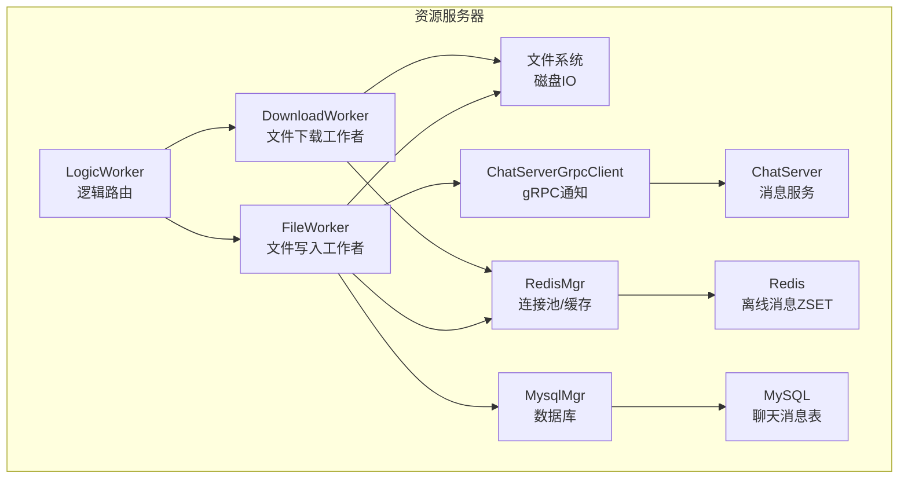
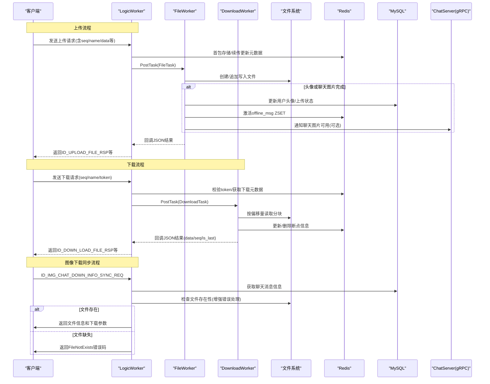
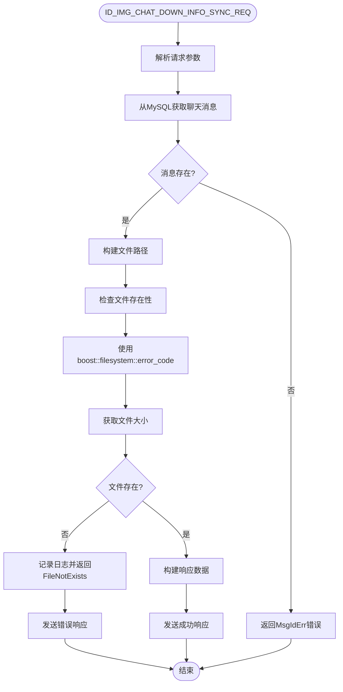
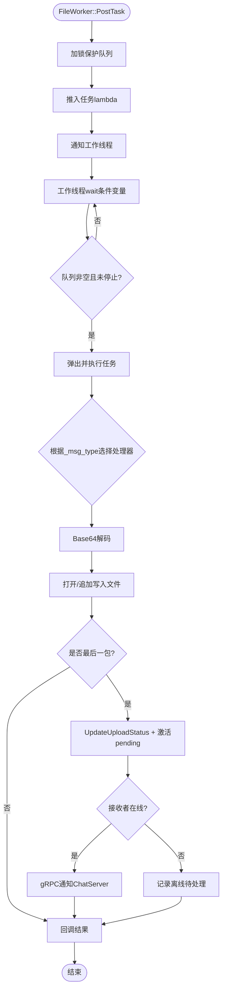
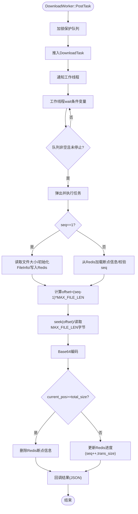
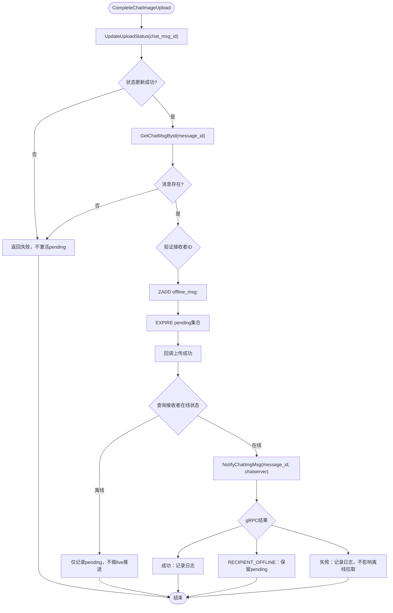
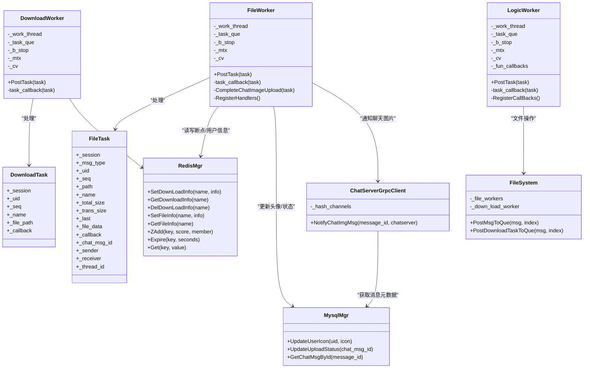

# 文件工作线程系统

<cite>
**本文引用的文件**   
- [FileWorker.h](file://server/ResourceServer/include/FileWorker.h)
- [FileWorker.cpp](file://server/ResourceServer/src/FileWorker.cpp)
- [ChatServerGrpcClient.h](file://server/ResourceServer/include/ChatServerGrpcClient.h)
- [ChatServerGrpcClient.cpp](file://server/ResourceServer/src/ChatServerGrpcClient.cpp)
- [LogicWorker.h](file://server/ResourceServer/include/LogicWorker.h)
- [LogicWorker.cpp](file://server/ResourceServer/src/LogicWorker.cpp)
- [const.h](file://server/ResourceServer/include/const.h)
- [config.ini](file://server/ResourceServer/config/config.ini)
- [RedisMgr.h](file://server/ResourceServer/include/RedisMgr.h)
- [MysqlMgr.h](file://server/ResourceServer/include/MysqlMgr.h)
- [CSession.h](file://server/ResourceServer/include/CSession.h)
- [FileSystem.h](file://server/ResourceServer/include/FileSystem.h)
- [FileSystem.cpp](file://server/ResourceServer/src/FileSystem.cpp)
</cite>

## 更新摘要
**所做更改**   
- 增强LogicWorker中图像下载同步功能的错误处理机制
- 修复ID_IMG_CHAT_DOWN_INFO_SYNC_REQ处理过程中访问缺失文件时的服务器崩溃问题
- 实现boost::filesystem的错误处理，使用error_code重载替代异常抛出
- 完善文件不存在情况的优雅处理和错误响应机制

## 目录
1. [简介](#简介)
2. [项目结构](#项目结构)
3. [核心组件](#核心组件)
4. [架构总览](#架构总览)
5. [详细组件分析](#详细组件分析)
6. [交付系统集成](#交付系统集成)
7. [依赖关系分析](#依赖关系分析)
8. [性能考量](#性能考量)
9. [故障排查指南](#故障排查指南)
10. [结论](#结论)
11. [附录：接口与使用示例](#附录接口与使用示例)

## 简介
本文件工作线程系统为 ResourceServer 提供高并发、可恢复的文件上传与下载能力。其核心由两类工作者组成：
- FileWorker：负责文件写入（含普通文件、头像、聊天图片及续传），通过任务队列与单线程执行器实现串行化落盘，避免同一文件的并发写冲突。
- DownloadWorker：负责分块读取文件并 Base64 编码返回，结合 Redis 中的断点续传元数据，支持大文件稳定传输。

系统采用"逻辑层路由 + I/O 工作者"的解耦设计：网络请求在 LogicWorker 中解析并校验，随后根据消息类型将任务投递到 FileWorker 或 DownloadWorker 的独立队列中处理，并通过回调机制将结果异步回传给调用方。**最新改进**：图像下载同步功能增强了错误处理机制，确保在访问缺失文件时不会导致服务器崩溃，提升了系统的稳定性和可靠性。

## 项目结构
ResourceServer 中与文件工作线程相关的代码主要位于 include 与 src 两个目录：
- include 定义任务结构体、工作者类、常量与外部服务接口
- src 实现工作者线程循环、任务调度、I/O 操作以及与 Redis/MySQL/gRPC 的交互

**图表来源**
- [LogicWorker.cpp:73-155](file://server/ResourceServer/src/LogicWorker.cpp#L73-L155)
- [FileWorker.cpp:46-455](file://server/ResourceServer/src/FileWorker.cpp#L46-L455)
- [ChatServerGrpcClient.cpp:34-128](file://server/ResourceServer/src/ChatServerGrpcClient.cpp#L34-L128)

## 核心组件
- FileTask：封装一次文件写入任务的上下文，包括会话、消息类型、用户ID、路径、文件名、序列号、总大小、已传大小、是否最后一包、Base64数据、回调函数以及聊天相关字段（消息ID、发送者、接收者）。
- DownloadTask：封装一次下载分块的上下文，包含会话、用户ID、序列号、文件名、本地路径与回调函数。
- FileWorker：维护一个任务队列与条件变量，单线程消费任务；内部通过消息类型映射处理器，统一解码、落盘、状态更新与回调。
- DownloadWorker：维护下载任务队列与单线程消费者；按序列号定位偏移量，读取固定长度分块，Base64编码后回调，并在最后清理断点信息。
- **CompleteChatImageUpload**：新增的统一处理函数，负责图片上传完成后的待处理消息激活和跨服通知。

**章节来源**
- [FileWorker.h:15-57](file://server/ResourceServer/include/FileWorker.h#L15-L57)
- [FileWorker.h:59-91](file://server/ResourceServer/include/FileWorker.h#L59-L91)
- [FileWorker.cpp:443-519](file://server/ResourceServer/src/FileWorker.cpp#L443-L519)

## 架构总览
整体流程遵循"请求进入 -> 逻辑校验 -> 任务入队 -> 工作者串行处理 -> 回调响应"的模式。上传与下载分别走不同的工作者，确保写路径与读路径互不阻塞。**最新改进**：图像下载同步功能增强了错误处理，确保在文件缺失情况下能够优雅地处理错误而不导致服务器崩溃。

**图表来源**
- [LogicWorker.cpp:73-155](file://server/ResourceServer/src/LogicWorker.cpp#L73-L155)
- [FileWorker.cpp:46-455](file://server/ResourceServer/src/FileWorker.cpp#L46-L455)
- [ChatServerGrpcClient.cpp:34-128](file://server/ResourceServer/src/ChatServerGrpcClient.cpp#L34-128)

## 详细组件分析

### LogicWorker 图像下载同步功能增强
**最新更新**：ID_IMG_CHAT_DOWN_INFO_SYNC_REQ处理函数实现了增强的错误处理机制，解决了访问缺失文件时服务器崩溃的问题。

**图表来源**
- [LogicWorker.cpp:630-673](file://server/ResourceServer/src/LogicWorker.cpp#L630-L673)

**章节来源**
- [LogicWorker.cpp:630-673](file://server/ResourceServer/src/LogicWorker.cpp#L630-L673)

### FileWorker 线程池设计与任务队列
- 线程模型：单工作线程循环等待条件变量，从队列取出任务并执行。该设计保证同一时刻仅有一个任务被处理，避免对同一文件的并发写导致损坏。
- 任务队列：std::queue<std::function<void()>>，PostTask 将包装后的 lambda 推入队列并唤醒工作线程。
- 处理器注册：RegisterHandlers 将不同 MSG_TYPES 映射到具体处理逻辑，task_callback 根据 _msg_type 查找并调用对应处理器。
- 错误处理：每个处理器均构造 JSON 结果，设置 error 码，并在异常或失败时及时关闭文件句柄并回调。
- 资源清理：析构时置停止标志、通知并 join 线程，确保优雅退出。

**图表来源**
- [FileWorker.cpp:9-44](file://server/ResourceServer/src/FileWorker.cpp#L9-L44)
- [FileWorker.cpp:443-519](file://server/ResourceServer/src/FileWorker.cpp#L443-L519)

**章节来源**
- [FileWorker.h:59-74](file://server/ResourceServer/include/FileWorker.h#L59-L74)
- [FileWorker.cpp:9-44](file://server/ResourceServer/src/FileWorker.cpp#L9-L44)
- [FileWorker.cpp:443-519](file://server/ResourceServer/src/FileWorker.cpp#L443-L519)

### DownloadWorker 线程池设计与断点续传
- 线程模型：单工作线程循环等待条件变量，从队列取出 DownloadTask 并执行。
- 断点续传：首包时计算文件大小并初始化 FileInfo，写入 Redis；后续包从 Redis 读取进度，校验 seq，计算偏移量读取分块，完成后更新或清理 Redis。
- 错误处理：文件不存在、权限不足、读取失败、偏移越界、Redis 读取失败等均会设置相应错误码并回调。
- 资源清理：析构时置停止标志、通知并 join 线程。

**图表来源**
- [FileWorker.cpp:480-513](file://server/ResourceServer/src/FileWorker.cpp#L480-L513)
- [FileWorker.cpp:525-659](file://server/ResourceServer/src/FileWorker.cpp#L525-L659)

**章节来源**
- [FileWorker.h:77-89](file://server/ResourceServer/include/FileWorker.h#L77-L89)
- [FileWorker.cpp:480-513](file://server/ResourceServer/src/FileWorker.cpp#L480-L513)
- [FileWorker.cpp:525-659](file://server/ResourceServer/src/FileWorker.cpp#L525-L659)

### 任务结构与参数传递
- FileTask：包含会话指针、消息类型、用户ID、路径、文件名、序列号、总大小、已传大小、是否最后一包、Base64数据、回调函数、聊天消息ID、发送者、接收者。用于上传场景的完整上下文。
- DownloadTask：包含会话指针、用户ID、序列号、文件名、本地路径、回调函数。用于下载场景的分块上下文。
- 回调函数：std::function<void(const json&)>，工作者在处理完成后调用，携带错误码与业务字段，由上层组装并回发响应。

**章节来源**
- [FileWorker.h:15-57](file://server/ResourceServer/include/FileWorker.h#L15-L57)

### 任务调度算法与负载均衡
- 调度策略：LogicWorker 根据文件名哈希值 % 工作者数量，将任务分配到具体的 FileWorker 或 DownloadWorker。这保证了相同文件的连续分片落在同一工作者，有利于顺序写入与断点续传一致性。
- 负载均衡：基于名称哈希的简单分配，具备一定均匀性；若热点文件较多，可能产生倾斜，可通过一致性哈希或动态权重优化。

**章节来源**
- [LogicWorker.cpp:106-114](file://server/ResourceServer/src/LogicWorker.cpp#L106-L114)
- [LogicWorker.cpp:245-250](file://server/ResourceServer/src/LogicWorker.cpp#L245-L250)
- [LogicWorker.cpp:348-353](file://server/ResourceServer/src/LogicWorker.cpp#L348-L353)
- [LogicWorker.cpp:690-695](file://server/ResourceServer/src/LogicWorker.cpp#L690-L695)

### 错误重试机制
- 当前实现未在工作者内部内置重试逻辑。错误通过 JSON 的 error 字段返回给上层，由上层决定是否重试。
- **新增**：gRPC通知具有有界重试机制，针对UNAVAILABLE/DEADLINE_EXCEEDED/RESOURCE_EXHAUSTED和对端SERVER_BUSY进行指数退避重试。
- 建议：在网络抖动或临时I/O错误时，可在上层增加指数退避重试；对于 Redis 不可用，应快速失败并提示客户端稍后重试。

**章节来源**
- [const.h:5-29](file://server/ResourceServer/include/const.h#L5-L29)
- [ChatServerGrpcClient.cpp:87-128](file://server/ResourceServer/src/ChatServerGrpcClient.cpp#L87-L128)

### 线程安全保证
- 互斥保护：工作者使用 std::mutex 保护任务队列的入队与出队操作。
- 条件变量：使用 std::condition_variable 进行高效等待与唤醒，避免忙轮询。
- 原子标志：_b_stop 使用 std::atomic<bool> 控制线程退出，确保多线程可见性。
- 文件句柄管理：每个处理器在打开文件后立即检查有效性，读写失败时及时关闭并回调错误。

**章节来源**
- [FileWorker.cpp:9-44](file://server/ResourceServer/src/FileWorker.cpp#L9-L44)
- [FileWorker.cpp:480-513](file://server/ResourceServer/src/FileWorker.cpp#L480-L513)

### 内存管理与资源清理
- 智能指针：任务对象使用 std::shared_ptr 管理生命周期，避免手动释放。
- 资源释放：工作者析构时设置停止标志并 join 线程；文件句柄在使用后显式关闭；Redis 连接池提供 Close/ClearConnections 方法。
- 断点清理：下载完成后删除 Redis 中的断点信息，防止内存泄漏。

**章节来源**
- [FileWorker.cpp:39-44](file://server/ResourceServer/src/FileWorker.cpp#L39-L44)
- [FileWorker.cpp:508-513](file://server/ResourceServer/src/FileWorker.cpp#L508-L513)

### 性能监控与任务统计
- 当前实现未内置指标收集。建议在工作者中添加计数器（如任务数、成功/失败计数、平均耗时）并通过日志或外部监控系统暴露。
- 可考虑在回调前记录时间戳，计算处理耗时，便于定位瓶颈。

### 故障恢复功能
- 断点续传：下载端通过 Redis 保存 seq 与 trans_size，重启后可继续传输。
- **新增**：状态同步：聊天图片上传完成后，通过 gRPC 通知 ChatServer 推送消息，确保接收方可感知新资源。
- **新增**：离线兜底：即使gRPC通知失败，也会记录离线待处理消息，用户登录时自动拉取。
- **增强**：权限与路径错误：文件路径不存在或权限不足时立即返回错误码，避免无效重试。

**章节来源**
- [FileWorker.cpp:525-659](file://server/ResourceServer/src/FileWorker.cpp#L525-L659)
- [ChatServerGrpcClient.cpp:34-128](file://server/ResourceServer/src/ChatServerGrpcClient.cpp#L34-L128)

## 交付系统集成

### CompleteChatImageUpload 统一处理机制
**新增**：CompleteChatImageUpload 方法作为聊天图片上传完成的统一处理入口，确保资源可用性与消息投递的一致性。

**图表来源**
- [FileWorker.cpp:443-519](file://server/ResourceServer/src/FileWorker.cpp#L443-L519)

### 双重保障的消息投递机制
系统实现了"在线实时推送 + 离线待处理拉取"的双重保障机制：

1. **在线推送**：当接收者在线时，通过gRPC直接通知ChatServer进行实时推送
2. **离线兜底**：无论在线推送是否成功，都会将消息ID添加到Redis的offline_msg有序集合中
3. **登录拉取**：用户登录时自动拉取offline_msg集合中的待处理消息

### gRPC通知的有界重试策略
ChatServerGrpcClient::NotifyChatImgMsg 实现了智能的重试机制：

- **重试条件**：仅对UNAVAILABLE/DEADLINE_EXCEEDED/RESOURCE_EXHAUSTED和对端SERVER_BUSY(1016)进行重试
- **立即停止**：RECIPIENT_OFFLINE(1015)、未知server、参数类错误立即停止
- **指数退避**：使用RpcBackoffMs、2×RpcBackoffMs进行退避，最大位移限幅防溢出
- **配置驱动**：所有重试参数均可通过[Delivery]配置段动态调整

**章节来源**
- [ChatServerGrpcClient.cpp:34-128](file://server/ResourceServer/src/ChatServerGrpcClient.cpp#L34-L128)
- [config.ini:27-34](file://server/ResourceServer/config/config.ini#L27-L34)

### 配置驱动的交付策略
系统通过[Delivery]配置段实现灵活的交付策略控制：

- **OfflineTtlSeconds**：离线消息过期时间（默认604800秒=7天）
- **OfflinePullBatch**：离线拉取批次大小（默认100条）
- **PullMaxBytes**：单次拉取最大字节数（默认30000字节）
- **RpcDeadlineMs**：gRPC请求超时时间（默认3000ms）
- **RpcMaxAttempts**：最大重试次数（默认3次）
- **RpcBackoffMs**：重试退避基数（默认100ms）

**章节来源**
- [config.ini:27-34](file://server/ResourceServer/config/config.ini#L27-L34)

## 依赖关系分析
- FileWorker 依赖：
  - CSession：用于回调时向客户端发送响应
  - base64：数据编解码
  - ConfigMgr：获取输出路径
  - MysqlMgr：更新用户头像与上传状态
  - RedisMgr：存储/读取断点信息与用户信息
  - ChatServerGrpcClient：通知聊天图片可用
- DownloadWorker 依赖：
  - CSession：回调响应
  - RedisMgr：断点续传元数据
  - 文件系统：分块读取
- **LogicWorker 增强依赖**：
  - boost::filesystem：用于安全的文件操作和错误处理
  - MySQL：获取聊天消息元数据

**图表来源**
- [FileWorker.h:59-91](file://server/ResourceServer/include/FileWorker.h#L59-L91)
- [ChatServerGrpcClient.h:30-55](file://server/ResourceServer/include/ChatServerGrpcClient.h#L30-L55)
- [RedisMgr.h:269-313](file://server/ResourceServer/include/RedisMgr.h#L269-L313)
- [FileSystem.h:7-18](file://server/ResourceServer/include/FileSystem.h#L7-L18)

**章节来源**
- [FileWorker.cpp:46-455](file://server/ResourceServer/src/FileWorker.cpp#L46-L455)
- [FileWorker.cpp:525-659](file://server/ResourceServer/src/FileWorker.cpp#L525-L659)
- [ChatServerGrpcClient.cpp:34-128](file://server/ResourceServer/src/ChatServerGrpcClient.cpp#L34-L128)
- [FileSystem.cpp:9-17](file://server/ResourceServer/src/FileSystem.cpp#L9-L17)

## 性能考量
- 单线程工作者：简化了并发写冲突问题，但吞吐受限于单核。可根据 CPU 核数与 I/O 特性调整工作者数量，或使用多工作者+分片策略。
- 分块大小：MAX_FILE_LEN 决定每次读取/写入的块大小，影响内存占用与网络开销。需权衡延迟与吞吐。
- Redis 连接池：连接复用与心跳检测降低连接建立成本，提升稳定性。
- Base64 编解码：CPU 密集操作，建议在高频路径上优化或采用零拷贝方案。
- **新增**：gRPC通知的有界重试避免了无限重试导致的资源耗尽，同时保证了最终一致性。
- **增强**：boost::filesystem错误处理减少了异常处理的性能开销，提升了文件操作的稳定性。

## 故障排查指南
- 常见问题与定位：
  - 文件不存在：检查路径生成逻辑与权限，确认目录是否存在。
  - 权限不足：检查进程对目标目录的读写权限。
  - 序列号不匹配：核对客户端与服务端的 seq 一致性，确保首包正确初始化。
  - Redis 读取失败：检查连接池状态与认证配置。
  - gRPC 通知失败：确认 ChatServer 地址与端口配置。
  - **新增**：离线消息未拉取：检查Redis中offline_msg集合是否存在，确认用户登录时的拉取逻辑。
  - **新增**：图像下载同步失败：检查boost::filesystem错误处理是否正确，确认文件路径构建逻辑。
- 日志与调试：
  - 工作者内部打印关键路径与错误码，便于定位。
  - 在回调前记录 JSON 内容，验证字段完整性。
  - **新增**：关注CompleteChatImageUpload方法的日志输出，确认pending激活和gRPC通知状态。
  - **新增**：检查ID_IMG_CHAT_DOWN_INFO_SYNC_REQ处理过程中的boost::filesystem错误日志。

**章节来源**
- [const.h:5-29](file://server/ResourceServer/include/const.h#L5-L29)
- [FileWorker.cpp:443-519](file://server/ResourceServer/src/FileWorker.cpp#L443-L519)
- [LogicWorker.cpp:630-673](file://server/ResourceServer/src/LogicWorker.cpp#L630-L673)

## 结论
文件工作线程系统通过分离逻辑与 I/O 工作者，实现了高内聚、低耦合的文件上传与下载能力。单线程工作者确保了写路径的一致性，断点续传提升了大文件传输的鲁棒性。**最新的改进**进一步增强了系统的稳定性和可靠性，特别是图像下载同步功能的错误处理机制，确保在文件缺失情况下能够优雅地处理错误而不导致服务器崩溃。通过"在线推送 + 离线兜底"的双重保障机制和增强的错误处理，系统能够更好地应对各种异常情况，提供更稳定的服务体验。未来可引入更精细的负载均衡、指标监控与自动重试机制，进一步提升系统性能与可用性。

## 附录：接口与使用示例
- 任务接口定义：
  - FileWorker::PostTask(std::shared_ptr<FileTask>)
  - DownloadWorker::PostTask(std::shared_ptr<DownloadTask>)
  - **新增**：FileWorker::CompleteChatImageUpload(std::shared_ptr<FileTask>)
- 使用示例（概念性描述）：
  - 客户端发起上传请求，LogicWorker 解析并校验，构造 FileTask 并投递到 FileWorker。
  - FileWorker 解码数据、写入文件，必要时更新数据库与 Redis，并通过 gRPC 通知 ChatServer。
  - **新增**：图片上传完成后自动激活offline_msg集合，确保接收者可感知新资源。
  - 客户端发起下载请求，LogicWorker 校验 token，构造 DownloadTask 并投递到 DownloadWorker。
  - DownloadWorker 按 seq 读取分块，Base64 编码后回调，客户端拼接文件。
  - **新增**：图像下载同步请求现在具有增强的错误处理，确保在文件缺失时返回适当的错误码而不是崩溃。

**章节来源**
- [FileWorker.h:65-74](file://server/ResourceServer/include/FileWorker.h#L65-L74)
- [FileWorker.h:81-89](file://server/ResourceServer/include/FileWorker.h#L81-L89)
- [FileWorker.cpp:443-519](file://server/ResourceServer/src/FileWorker.cpp#L443-L519)
- [LogicWorker.cpp:73-155](file://server/ResourceServer/src/LogicWorker.cpp#L73-L155)
- [LogicWorker.cpp:300-359](file://server/ResourceServer/src/LogicWorker.cpp#L300-L359)
- [LogicWorker.cpp:630-673](file://server/ResourceServer/src/LogicWorker.cpp#L630-L673)