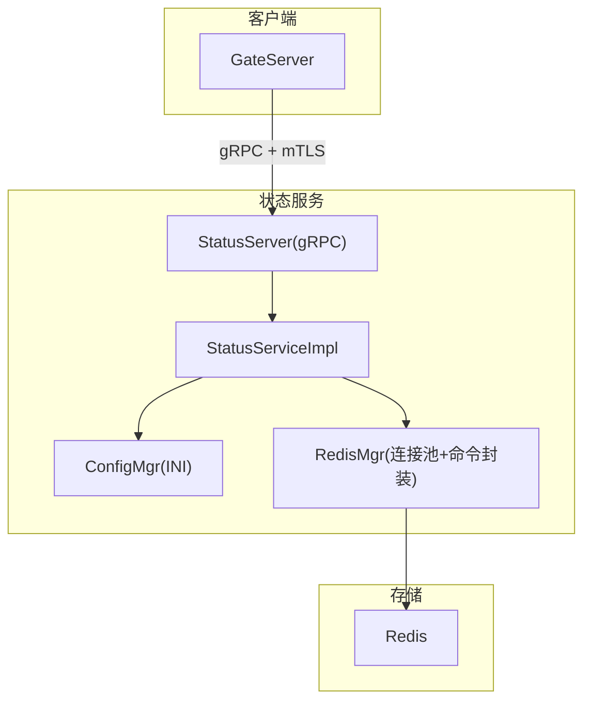
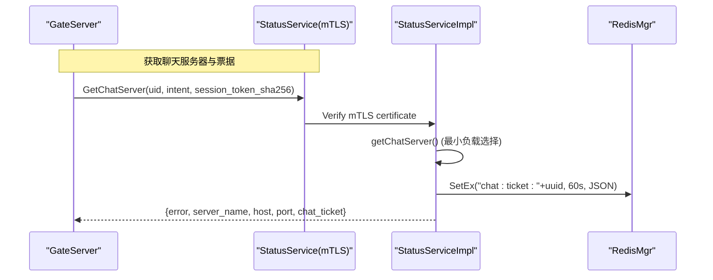
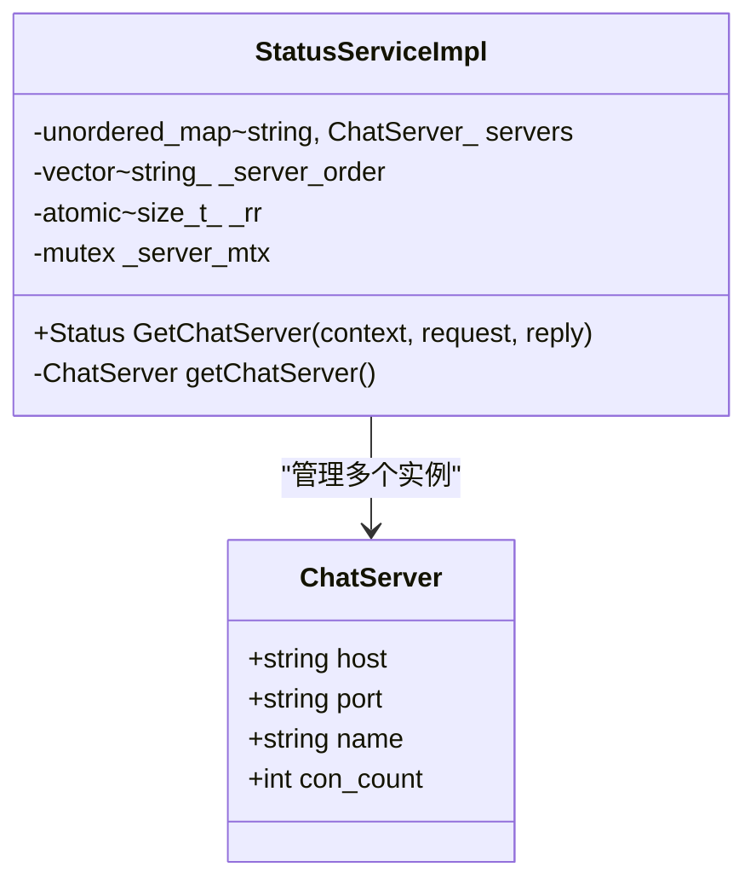
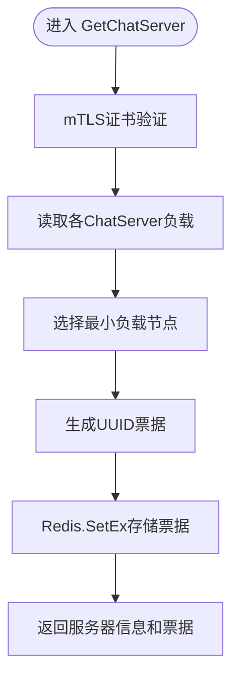
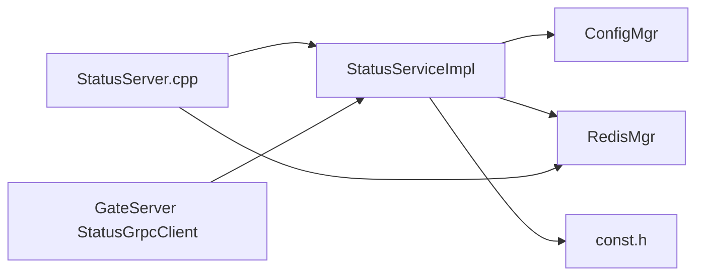

# StatusServer状态管理服务

<cite>
**本文引用的文件**   
- [status.proto](file://proto/status_service/status.proto)
- [StatusServiceImpl.h](file://server/StatusServer/include/StatusServiceImpl.h)
- [StatusServiceImpl.cpp](file://server/StatusServer/src/StatusServiceImpl.cpp)
- [StatusServer.cpp](file://server/StatusServer/src/StatusServer.cpp)
- [config.ini](file://server/StatusServer/config/config.ini)
- [ConfigMgr.h](file://server/StatusServer/include/ConfigMgr.h)
- [RedisMgr.h](file://server/StatusServer/include/RedisMgr.h)
- [RedisMgr.cpp](file://server/StatusServer/src/RedisMgr.cpp)
- [const.h](file://server/StatusServer/include/const.h)
- [GateServer StatusGrpcClient.cpp](file://server/GateServer/src/StatusGrpcClient.cpp)
</cite>

## 更新摘要
**所做更改**
- 移除了Login功能和MySQL集成模块
- 简化了gRPC接口，仅保留GetChatServer功能
- 增强了mTLS安全认证机制
- 优化了负载均衡算法，实现最小负载选择
- 重构了票据系统，使用一次性chat_ticket替代token
- 更新了架构图和接口说明

## 目录
1. [简介](#简介)
2. [项目结构](#项目结构)
3. [核心组件](#核心组件)
4. [架构总览](#架构总览)
5. [详细组件分析](#详细组件分析)
6. [依赖关系分析](#依赖关系分析)
7. [性能与可扩展性](#性能与可扩展性)
8. [故障排查指南](#故障排查指南)
9. [结论](#结论)
10. [附录](#附录)

## 简介
本技术文档围绕 StatusServer 状态管理服务展开，该服务经过重大架构重构，现已专注于单一职责：**ChatServer分配与路由**。主要特性包括：

- **简化的gRPC接口**：仅提供GetChatServer方法，移除了复杂的Login功能
- **增强的安全性**：采用mTLS双向证书认证，确保通信安全
- **智能负载均衡**：基于Redis的实时负载监控，实现最小连接数分配策略
- **一次性票据机制**：使用chat_ticket替代传统token，提升安全性
- **Redis缓存优化**：专注于会话票据存储，移除用户状态管理

该服务通过gRPC暴露单一的GetChatServer接口，为客户端分配合适的ChatServer实例并生成一次性访问票据。

## 项目结构
StatusServer 位于 server/StatusServer 目录下，经过重构后结构更加简洁：

**图表来源**
- [StatusServer.cpp:1-198](file://server/StatusServer/src/StatusServer.cpp#L1-L198)
- [StatusServiceImpl.h:1-51](file://server/StatusServer/include/StatusServiceImpl.h#L1-L51)
- [StatusServiceImpl.cpp:1-170](file://server/StatusServer/src/StatusServiceImpl.cpp#L1-L170)
- [config.ini:1-23](file://server/StatusServer/config/config.ini#L1-L23)
- [RedisMgr.h:1-314](file://server/StatusServer/include/RedisMgr.h#L1-L314)

**章节来源**
- [StatusServer.cpp:1-198](file://server/StatusServer/src/StatusServer.cpp#L1-L198)
- [config.ini:1-23](file://server/StatusServer/config/config.ini#L1-L23)

## 核心组件
- **简化的gRPC服务定义**
  - 服务：StatusService
  - 唯一RPC：GetChatServer
  - 请求/响应：GetChatServerReq/Rsp（包含uid、intent、session_token_sha256）
- **服务实现类**
  - StatusServiceImpl：实现GetChatServer方法，负责ChatServer选择和票据生成
- **配置管理**
  - ConfigMgr：解析INI配置，提供服务器列表访问接口
- **存储与缓存**
  - RedisMgr：基于hiredis的连接池、常用命令封装、分布式锁辅助
- **常量与错误码**
  - const.h：错误码枚举、键前缀常量、分布式锁超时参数

**章节来源**
- [status.proto:1-31](file://proto/status_service/status.proto#L1-L31)
- [StatusServiceImpl.h:1-51](file://server/StatusServer/include/StatusServiceImpl.h#L1-L51)
- [StatusServiceImpl.cpp:1-170](file://server/StatusServer/src/StatusServiceImpl.cpp#L1-L170)
- [ConfigMgr.h:1-84](file://server/StatusServer/include/ConfigMgr.h#L1-L84)
- [RedisMgr.h:1-314](file://server/StatusServer/include/RedisMgr.h#L1-L314)
- [const.h:1-69](file://server/StatusServer/include/const.h#L1-L69)

## 架构总览
StatusServer 现在作为纯粹的"ChatServer分配器"，承担以下职责：

- **智能负载均衡**：根据Redis中的实时负载信息选择最优ChatServer
- **安全认证**：通过mTLS证书验证调用方身份
- **票据生成**：创建一次性chat_ticket供ChatServer验证
- **会话支持**：支持INITIAL和RESUME两种票据意图

**图表来源**
- [status.proto:1-31](file://proto/status_service/status.proto#L1-L31)
- [StatusServiceImpl.cpp:36-80](file://server/StatusServer/src/StatusServiceImpl.cpp#L36-L80)
- [RedisMgr.cpp:82-113](file://server/StatusServer/src/RedisMgr.cpp#L82-L113)

**章节来源**
- [StatusServer.cpp:106-180](file://server/StatusServer/src/StatusServer.cpp#L106-L180)
- [StatusServiceImpl.cpp:36-80](file://server/StatusServer/src/StatusServiceImpl.cpp#L36-L80)

## 详细组件分析

### gRPC接口与协议
- **服务与方法**
  - GetChatServer(GetChatServerReq) -> GetChatServerRsp
- **字段说明**
  - GetChatServerReq：uid、intent（INITIAL/RESUME）、session_token_sha256（仅RESUME时使用）
  - GetChatServerRsp：error、server_name、host、port、chat_ticket
- **错误码**
  - Success、RPCFailed、NoAvailableChatServer等

**章节来源**
- [status.proto:1-31](file://proto/status_service/status.proto#L1-L31)
- [const.h:25-39](file://server/StatusServer/include/const.h#L25-L39)

### 服务实现：StatusServiceImpl
- **构造函数**
  - 从配置加载chatservers列表，构建本地ChatServer映射
- **GetChatServer方法**
  - mTLS证书验证：检查客户端证书的SAN字段是否包含"llfc-gate"
  - ChatServer选择：基于Redis中chatserver:lease:*键的负载值选择最小负载节点
  - 票据生成：创建UUID作为chat_ticket，JSON格式包含uid、server、intent等信息
  - Redis存储：使用SetEx设置60秒过期时间的票据
- **getChatServer方法**
  - 读取所有chatserver:lease:*键，解析负载值
  - 选择负载最小的节点，相同负载时轮转选择
  - 返回完整的ChatServer信息（name、host、port、con_count）

**图表来源**
- [StatusServiceImpl.h:36-49](file://server/StatusServer/include/StatusServiceImpl.h#L36-L49)
- [StatusServiceImpl.cpp:82-169](file://server/StatusServer/src/StatusServiceImpl.cpp#L82-L169)

**章节来源**
- [StatusServiceImpl.h:1-51](file://server/StatusServer/include/StatusServiceImpl.h#L1-L51)
- [StatusServiceImpl.cpp:36-169](file://server/StatusServer/src/StatusServiceImpl.cpp#L36-L169)

### 启动与服务监听
- **主函数流程**
  - 环境变量加载：LLFC_STATUS_CA_CERT_PATH、LLFC_STATUS_SERVER_CERT_PATH、LLFC_STATUS_SERVER_KEY_PATH
  - 证书文件读取：CA证书、服务器证书、私钥
  - 数据迁移：清理旧的utoken_*键，标记schema v2
  - mTLS配置：SSL服务器凭证，要求客户端证书验证
  - gRPC服务器启动：注册服务，监听端口
  - 优雅关闭：信号处理，资源清理

**章节来源**
- [StatusServer.cpp:106-180](file://server/StatusServer/src/StatusServer.cpp#L106-L180)

### 配置管理（INI）
- **关键配置项**
  - StatusServer：Host、Port
  - Redis：Host、Port、Passwd
  - chatservers：Name（逗号分隔的服务器名列表）
  - chatserverN：Name、Host、Port
- **行为**
  - ConfigMgr单例，按section/key取值
  - StatusServiceImpl构造时解析chatservers列表，初始化本地服务器映射

**章节来源**
- [config.ini:1-23](file://server/StatusServer/config/config.ini#L1-L23)
- [ConfigMgr.h:1-84](file://server/StatusServer/include/ConfigMgr.h#L1-L84)
- [StatusServiceImpl.cpp:82-109](file://server/StatusServer/src/StatusServiceImpl.cpp#L82-L109)

### Redis缓存与一致性
- **连接池**
  - RedisConPool：固定大小连接池，后台线程定期PING检测存活，失败自动重连
  - 提供getConnection/returnConnection、Close/ClearConnections
- **命令封装**
  - Get/Set/SetWithExpire/LPush/LPop/RPush/RPop/HSet/HGet/HDel/Del/ExistsKey
  - SCAN模式扫描、SETNX原子操作、EVAL Lua脚本执行
  - 分布式锁acquireLock/releaseLock（内部委托DistLock）
- **状态缓存策略**
  - 聊天票据：key="chat:ticket_"+uuid，value=JSON字符串（60秒过期）
  - 负载信息：key="chatserver:lease:"+name，value=已认证会话数
- **一致性保证**
  - SETEX命令保证票据设置的原子性和过期时间
  - 负载统计通过ChatServer主动上报，避免竞争条件

**图表来源**
- [StatusServiceImpl.cpp:36-80](file://server/StatusServer/src/StatusServiceImpl.cpp#L36-L80)
- [RedisMgr.cpp:82-113](file://server/StatusServer/src/RedisMgr.cpp#L82-L113)

**章节来源**
- [RedisMgr.h:1-314](file://server/StatusServer/include/RedisMgr.h#L1-L314)
- [RedisMgr.cpp:1-200](file://server/StatusServer/src/RedisMgr.cpp#L1-L200)
- [const.h:57-61](file://server/StatusServer/include/const.h#L57-L61)

### 调用方：GateServer
- **StatusGrpcClient实现**
  - 封装对StatusService的GetChatServer调用
  - 支持intent参数（INITIAL/RESUME）和session_token_sha256
  - 3秒超时控制，错误处理
- **连接管理**
  - 使用gRPC Channel复用连接
  - 环境变量的证书路径配置

**章节来源**
- [GateServer StatusGrpcClient.cpp:1-48](file://server/GateServer/src/StatusGrpcClient.cpp#L1-L48)

## 依赖关系分析
- **组件耦合**
  - StatusServiceImpl依赖ConfigMgr（配置）、RedisMgr（缓存）、const（常量）
  - 启动模块依赖AsioIOServicePool（信号处理）、RedisMgr（资源释放）
  - 调用方依赖各自的StatusGrpcClient
- **外部依赖**
  - gRPC（通信）
  - hiredis（Redis客户端）
  - Boost（Asio、PropertyTree、UUID）
  - OpenSSL（mTLS证书处理）

**图表来源**
- [StatusServiceImpl.cpp:1-170](file://server/StatusServer/src/StatusServiceImpl.cpp#L1-L170)
- [StatusServer.cpp:1-198](file://server/StatusServer/src/StatusServer.cpp#L1-L198)
- [GateServer StatusGrpcClient.cpp:1-48](file://server/GateServer/src/StatusGrpcClient.cpp#L1-L48)

**章节来源**
- [StatusServiceImpl.cpp:1-170](file://server/StatusServer/src/StatusServiceImpl.cpp#L1-L170)
- [StatusServer.cpp:1-198](file://server/StatusServer/src/StatusServer.cpp#L1-L198)

## 性能与可扩展性
- **连接池优化**
  - Redis连接池固定大小，后台线程定时PING，异常自动重连，降低连接抖动影响
  - gRPC Channel连接复用减少握手开销
- **算法复杂度**
  - GetChatServer：O(N)遍历本地服务器列表，N为配置中的服务器数量
  - 负载选择：O(M)读取M个ChatServer的负载信息
  - 票据生成：O(1) UUID生成 + O(1) Redis SETEX操作
- **可扩展点**
  - 负载均衡：当前实现最小负载策略，可扩展为加权轮询或一致性哈希
  - 票据类型：支持INITIAL和RESUME两种意图，可扩展更多票据类型
  - 健康检查：可添加ChatServer健康检查机制

## 故障排查指南
- **常见问题定位**
  - mTLS证书问题：检查环境变量证书路径是否正确，证书SAN字段是否包含"llfc-gate"
  - Redis连接失败：查看连接池日志、PING检测结果与重连逻辑
  - 无可用ChatServer：检查Redis中是否存在chatserver:lease:*键，确认ChatServer是否正常上报负载
  - 票据无效：确认GetChatServer是否成功写入Redis，ChatServer是否正确消费票据
- **诊断建议**
  - 启用详细日志（Redis命令执行输出）
  - 监控Redis键是否存在（chat:ticket_*）
  - 观察ChatServer选择策略是否符合预期
  - 检查mTLS证书链完整性

**章节来源**
- [RedisMgr.cpp:1-200](file://server/StatusServer/src/RedisMgr.cpp#L1-L200)
- [StatusServiceImpl.cpp:36-80](file://server/StatusServer/src/StatusServiceImpl.cpp#L36-L80)
- [config.ini:1-23](file://server/StatusServer/config/config.ini#L1-L23)

## 结论
StatusServer经过重大架构重构后，已成为一个专注、安全、高效的ChatServer分配服务。通过移除复杂的Login功能和MySQL集成，服务变得更加简洁可靠。新的mTLS安全机制、智能负载均衡算法和一次性票据设计，为整个聊天系统提供了坚实的基础。未来可在负载均衡策略、健康检查和监控方面进一步增强。

## 附录
- **健康检查建议**
  - 增加/gRPC健康检查端点，返回服务状态与依赖（Redis）可用性
  - 添加ChatServer健康状态监控
- **监控指标**
  - gRPC请求量、延迟、错误率
  - Redis命中率、连接池使用率、PING失败次数
  - ChatServer选择分布（各实例连接数）
  - 票据生成成功率
- **安全加固**
  - 已实现mTLS双向证书认证
  - 票据短期过期（60秒），防止重放攻击
  - 建议添加请求频率限制和IP白名单