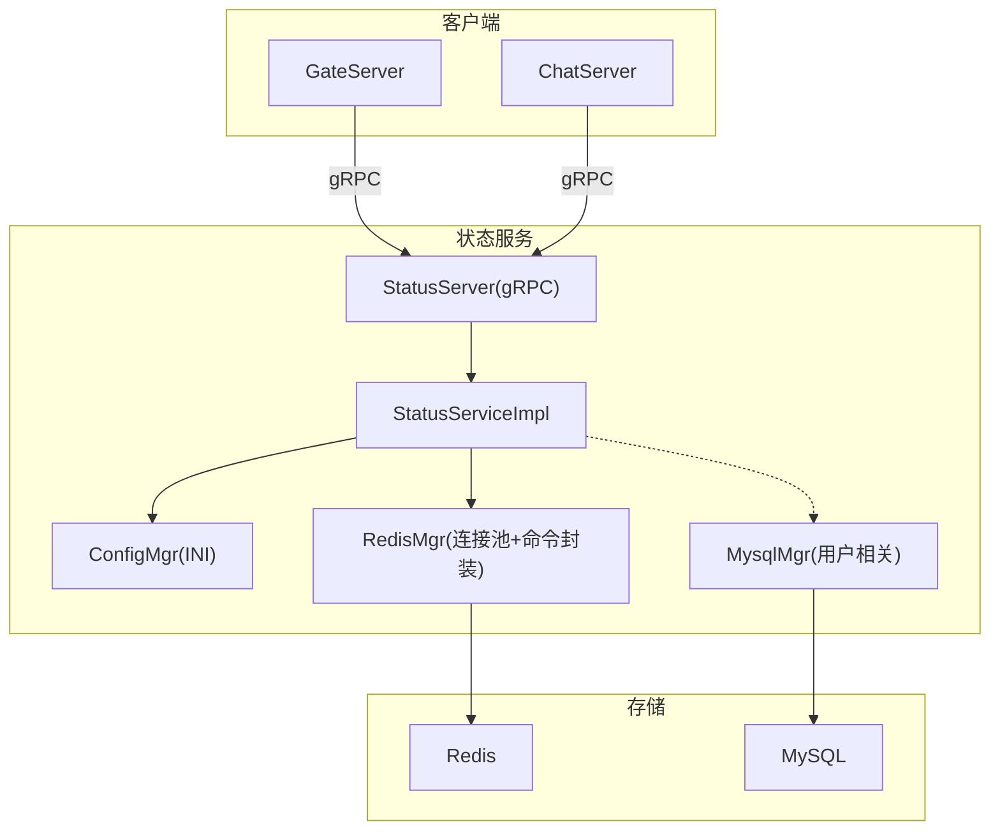
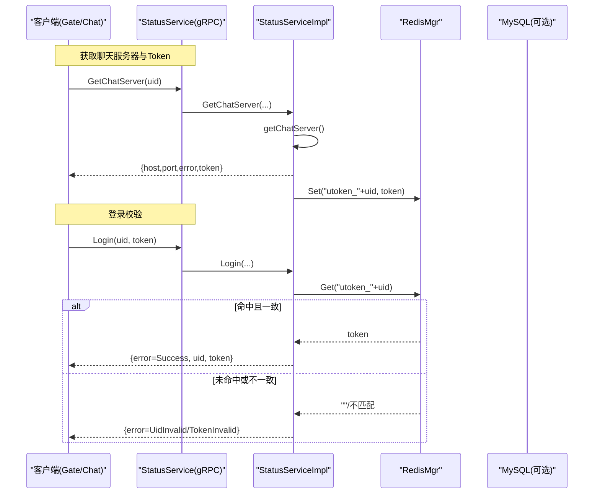
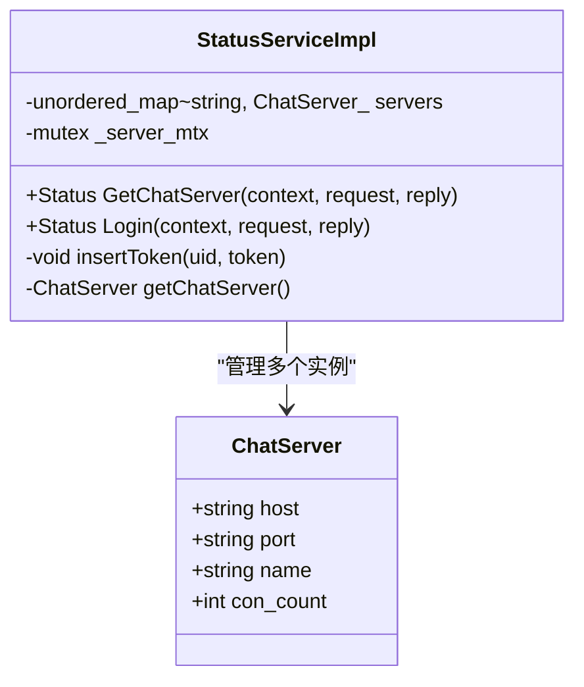
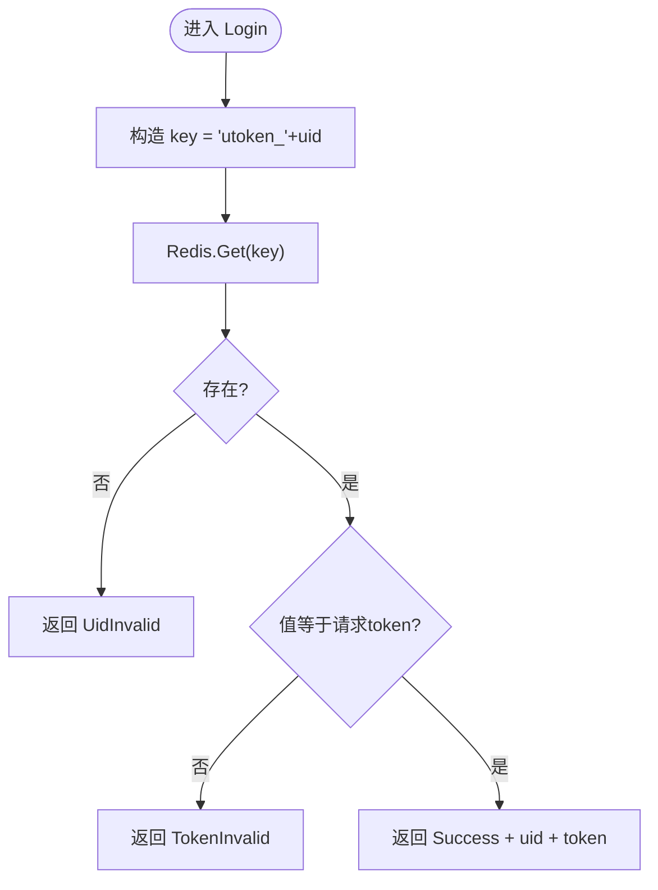
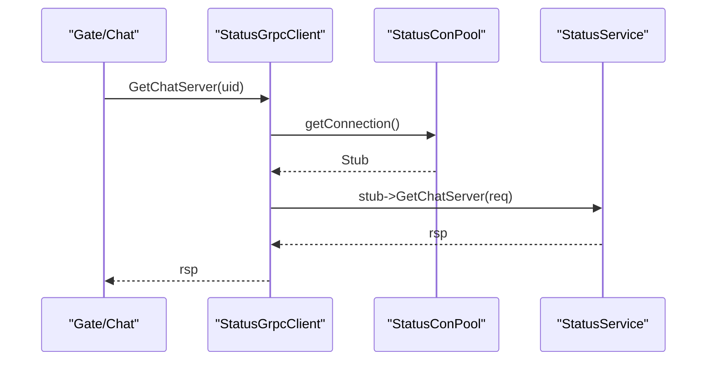
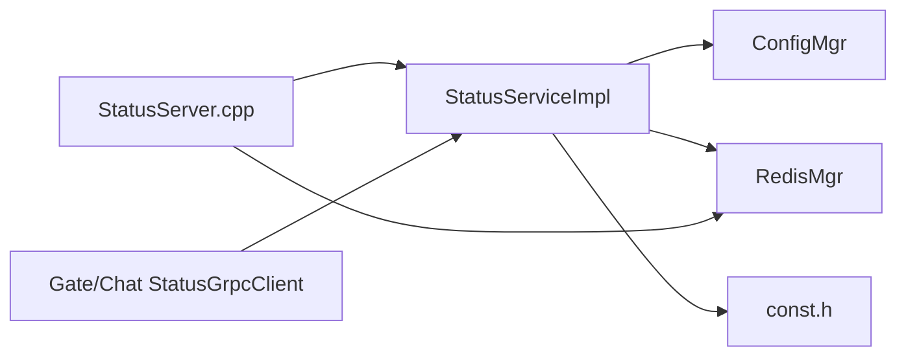

# StatusServer状态管理服务

<cite>
**本文引用的文件**   
- [status.proto](file://proto/status_service/status.proto)
- [StatusServiceImpl.h](file://server/StatusServer/include/StatusServiceImpl.h)
- [StatusServiceImpl.cpp](file://server/StatusServer/src/StatusServiceImpl.cpp)
- [StatusServer.cpp](file://server/StatusServer/src/StatusServer.cpp)
- [config.ini](file://server/StatusServer/config/config.ini)
- [ConfigMgr.h](file://server/StatusServer/include/ConfigMgr.h)
- [RedisMgr.h](file://server/StatusServer/include/RedisMgr.h)
- [RedisMgr.cpp](file://server/StatusServer/src/RedisMgr.cpp)
- [MysqlMgr.h](file://server/StatusServer/include/MysqlMgr.h)
- [MysqlMgr.cpp](file://server/StatusServer/src/MysqlMgr.cpp)
- [const.h](file://server/StatusServer/include/const.h)
- [ChatServer StatusGrpcClient.h](file://server/ChatServer/include/StatusGrpcClient.h)
- [ChatServer StatusGrpcClient.cpp](file://server/ChatServer/src/StatusGrpcClient.cpp)
- [GateServer StatusGrpcClient.h](file://server/GateServer/include/StatusGrpcClient.h)
- [GateServer StatusGrpcClient.cpp](file://server/GateServer/src/StatusGrpcClient.cpp)
</cite>

## 目录
1. [简介](#简介)
2. [项目结构](#项目结构)
3. [核心组件](#核心组件)
4. [架构总览](#架构总览)
5. [详细组件分析](#详细组件分析)
6. [依赖关系分析](#依赖关系分析)
7. [性能与可扩展性](#性能与可扩展性)
8. [故障排查指南](#故障排查指南)
9. [结论](#结论)
10. [附录](#附录)

## 简介
本技术文档围绕 StatusServer 状态管理服务展开，聚焦以下目标：
- 用户在线状态管理、设备登录状态维护与全局用户信息缓存
- gRPC 接口实现（GetChatServer、Login）及调用流程
- 与 MySQL 的交互模式（当前服务中未直接调用，但提供能力）
- Redis 在状态缓存中的应用、数据同步与一致性保证
- 分布式环境下的状态同步、冲突解决与一致性策略
- 状态监控、健康检查与故障诊断工具建议

该服务通过 gRPC 暴露两个核心 RPC：
- GetChatServer：为客户端分配聊天服务器地址与一次性令牌
- Login：校验用户登录令牌并返回结果

状态数据主要使用 Redis 进行缓存与持久化（短期），MySQL 作为可选持久层。配置由 INI 文件驱动，支持多 ChatServer 实例的动态发现与选择。

## 项目结构
StatusServer 位于 server/StatusServer 目录下，包含 gRPC 服务实现、配置管理、Redis/MySQL 管理器以及启动入口。外部调用方（GateServer、ChatServer）通过各自的 StatusGrpcClient 访问该服务。

图表来源
- [StatusServer.cpp:1-69](file://server/StatusServer/src/StatusServer.cpp#L1-L69)
- [StatusServiceImpl.h:1-52](file://server/StatusServer/include/StatusServiceImpl.h#L1-L52)
- [StatusServiceImpl.cpp:1-125](file://server/StatusServer/src/StatusServiceImpl.cpp#L1-L125)
- [config.ini:1-23](file://server/StatusServer/config/config.ini#L1-L23)
- [RedisMgr.h:1-300](file://server/StatusServer/include/RedisMgr.h#L1-L300)
- [MysqlMgr.h:1-18](file://server/StatusServer/include/MysqlMgr.h#L1-L18)

章节来源
- [StatusServer.cpp:1-69](file://server/StatusServer/src/StatusServer.cpp#L1-L69)
- [config.ini:1-23](file://server/StatusServer/config/config.ini#L1-L23)

## 核心组件
- gRPC 服务定义与消息类型
  - 服务：StatusService
  - RPC：GetChatServer、Login
  - 请求/响应：GetChatServerReq/Rsp、LoginReq/Rsp
- 服务实现类
  - StatusServiceImpl：实现上述两个 RPC，负责令牌生成与校验、ChatServer 选择、Redis 写入/读取
- 配置管理
  - ConfigMgr：解析 INI 配置，提供 SectionInfo 访问接口
- 存储与缓存
  - RedisMgr：基于 hiredis 的连接池、常用命令封装、分布式锁辅助
  - MysqlMgr：用户注册、密码校验等（当前服务未直接使用）
- 常量与错误码
  - const.h：错误码枚举、键前缀常量、分布式锁超时参数

章节来源
- [status.proto:1-32](file://proto/status_service/status.proto#L1-L32)
- [StatusServiceImpl.h:1-52](file://server/StatusServer/include/StatusServiceImpl.h#L1-L52)
- [StatusServiceImpl.cpp:1-125](file://server/StatusServer/src/StatusServiceImpl.cpp#L1-L125)
- [ConfigMgr.h:1-84](file://server/StatusServer/include/ConfigMgr.h#L1-L84)
- [RedisMgr.h:1-300](file://server/StatusServer/include/RedisMgr.h#L1-L300)
- [MysqlMgr.h:1-18](file://server/StatusServer/include/MysqlMgr.h#L1-L18)
- [const.h:1-75](file://server/StatusServer/include/const.h#L1-L75)

## 架构总览
StatusServer 作为“状态与路由”中心，承担以下职责：
- 为用户分配 ChatServer 实例（按简单策略选择）
- 生成一次性 Token 并绑定 uid，供后续登录校验
- 提供 Login 接口，校验 token 有效性并返回结果
- 通过 Redis 缓存用户 token、会话信息等；预留 MySQL 用于用户信息持久化

图表来源
- [status.proto:1-32](file://proto/status_service/status.proto#L1-L32)
- [StatusServiceImpl.cpp:1-125](file://server/StatusServer/src/StatusServiceImpl.cpp#L1-L125)
- [RedisMgr.cpp:1-431](file://server/StatusServer/src/RedisMgr.cpp#L1-L431)

章节来源
- [StatusServer.cpp:1-69](file://server/StatusServer/src/StatusServer.cpp#L1-L69)
- [StatusServiceImpl.cpp:1-125](file://server/StatusServer/src/StatusServiceImpl.cpp#L1-L125)

## 详细组件分析

### gRPC 接口与协议
- 服务与方法
  - GetChatServer(GetChatServerReq) -> GetChatServerRsp
  - Login(LoginReq) -> LoginRsp
- 字段说明
  - GetChatServerReq：uid
  - GetChatServerRsp：error、host、port、token
  - LoginReq：uid、token
  - LoginRsp：error、uid、token
- 错误码
  - Success、RpcFailed、TokenInvalid、UidInvalid 等

章节来源
- [status.proto:1-32](file://proto/status_service/status.proto#L1-L32)
- [const.h:1-75](file://server/StatusServer/include/const.h#L1-L75)

### 服务实现：StatusServiceImpl
- 构造函数
  - 从配置加载 chatservers 列表，构建本地 ChatServer 映射
- GetChatServer
  - 选择 ChatServer（当前默认取第一个，注释中包含未来按负载选择的思路）
  - 生成唯一 token（UUID）
  - 将 uid->token 写入 Redis（key 前缀 USERTOKENPREFIX）
  - 返回 host/port/token/error
- Login
  - 根据 uid 构造 key，从 Redis 读取 token
  - 若不存在则返回 UidInvalid；若不匹配则返回 TokenInvalid
  - 否则返回 Success 并回传 uid、token
- insertToken/getChatServer
  - insertToken：Redis SET
  - getChatServer：加互斥锁保护本地 _servers 遍历（当前简化策略）

图表来源
- [StatusServiceImpl.h:1-52](file://server/StatusServer/include/StatusServiceImpl.h#L1-L52)
- [StatusServiceImpl.cpp:1-125](file://server/StatusServer/src/StatusServiceImpl.cpp#L1-L125)

章节来源
- [StatusServiceImpl.h:1-52](file://server/StatusServer/include/StatusServiceImpl.h#L1-L52)
- [StatusServiceImpl.cpp:1-125](file://server/StatusServer/src/StatusServiceImpl.cpp#L1-L125)

### 启动与服务监听
- 主函数
  - 读取配置，组装监听地址
  - 创建 gRPC ServerBuilder，注册服务，启动监听
  - 使用 Boost.Asio 捕获 SIGINT/SIGTERM，优雅关闭
  - 进程退出时关闭 Redis 连接池

章节来源
- [StatusServer.cpp:1-69](file://server/StatusServer/src/StatusServer.cpp#L1-L69)

### 配置管理（INI）
- 关键配置项
  - StatusServer：Host、Port
  - Mysql：Host、Port、User、Passwd、Schema
  - Redis：Host、Port、Passwd
  - chatservers：Name（逗号分隔的服务器名列表）
  - chatserverN：Name、Host、Port
- 行为
  - ConfigMgr 单例，按 section/key 取值
  - StatusServiceImpl 构造时解析 chatservers 列表，初始化本地服务器映射

章节来源
- [config.ini:1-23](file://server/StatusServer/config/config.ini#L1-L23)
- [ConfigMgr.h:1-84](file://server/StatusServer/include/ConfigMgr.h#L1-L84)
- [StatusServiceImpl.cpp:1-125](file://server/StatusServer/src/StatusServiceImpl.cpp#L1-L125)

### Redis 缓存与一致性
- 连接池
  - RedisConPool：固定大小连接池，后台线程定期 PING 检测存活，失败自动重连
  - 提供 getConnection/returnConnection、Close/ClearConnections
- 命令封装
  - Get/Set/SetWithExpire/LPush/LPop/RPush/RPop/HSet/HGet/HDel/Del/ExistsKey
  - 分布式锁 acquireLock/releaseLock（内部委托 DistLock）
- 状态缓存策略
  - 用户 Token：key="utoken_"+uid，value=token（无过期或按需设置）
  - 登录计数（预留）：hash key="logincount"，field=chatserver.name，value=count（代码中有注释方案）
- 一致性保证
  - 单次 GET/SET 操作原子性由 Redis 保障
  - 登录校验采用“读后比较”，避免并发写导致的脏读
  - 分布式锁可用于需要跨节点协调的场景（如统计计数更新）

图表来源
- [StatusServiceImpl.cpp:1-125](file://server/StatusServer/src/StatusServiceImpl.cpp#L1-L125)
- [RedisMgr.cpp:1-431](file://server/StatusServer/src/RedisMgr.cpp#L1-L431)

章节来源
- [RedisMgr.h:1-300](file://server/StatusServer/include/RedisMgr.h#L1-L300)
- [RedisMgr.cpp:1-431](file://server/StatusServer/src/RedisMgr.cpp#L1-L431)
- [const.h:1-75](file://server/StatusServer/include/const.h#L1-L75)

### MySQL 交互（预留能力）
- MysqlMgr 提供用户注册、邮箱校验、密码更新与校验等方法
- 当前 StatusServer 未直接调用这些方法，但具备接入能力（例如将用户基础信息落库）

章节来源
- [MysqlMgr.h:1-18](file://server/StatusServer/include/MysqlMgr.h#L1-L18)
- [MysqlMgr.cpp:1-30](file://server/StatusServer/src/MysqlMgr.cpp#L1-L30)

### 调用方：GateServer 与 ChatServer
- 两者均实现 StatusGrpcClient，封装对 StatusService 的调用
- 连接池：StatusConPool，复用 gRPC Channel/Stub
- 调用流程：
  - GetChatServer(uid)：获取 ChatServer 地址与 token
  - Login(uid, token)：校验 token 有效性

图表来源
- [ChatServer StatusGrpcClient.h:1-99](file://server/ChatServer/include/StatusGrpcClient.h#L1-L99)
- [ChatServer StatusGrpcClient.cpp:1-53](file://server/ChatServer/src/StatusGrpcClient.cpp#L1-L53)
- [GateServer StatusGrpcClient.h:1-98](file://server/GateServer/include/StatusGrpcClient.h#L1-L98)
- [GateServer StatusGrpcClient.cpp:1-53](file://server/GateServer/src/StatusGrpcClient.cpp#L1-L53)

章节来源
- [ChatServer StatusGrpcClient.h:1-99](file://server/ChatServer/include/StatusGrpcClient.h#L1-L99)
- [ChatServer StatusGrpcClient.cpp:1-53](file://server/ChatServer/src/StatusGrpcClient.cpp#L1-L53)
- [GateServer StatusGrpcClient.h:1-98](file://server/GateServer/include/StatusGrpcClient.h#L1-L98)
- [GateServer StatusGrpcClient.cpp:1-53](file://server/GateServer/src/StatusGrpcClient.cpp#L1-L53)

## 依赖关系分析
- 组件耦合
  - StatusServiceImpl 依赖 ConfigMgr（配置）、RedisMgr（缓存）、const（常量）
  - 启动模块依赖 AsioIOServicePool（信号处理）、RedisMgr（资源释放）
  - 调用方依赖各自 StatusGrpcClient
- 外部依赖
  - gRPC（通信）
  - hiredis（Redis 客户端）
  - MySQL Connector/C++（数据库，当前未直接使用）
  - Boost（Asio、PropertyTree、UUID）

图表来源
- [StatusServiceImpl.cpp:1-125](file://server/StatusServer/src/StatusServiceImpl.cpp#L1-L125)
- [StatusServer.cpp:1-69](file://server/StatusServer/src/StatusServer.cpp#L1-L69)
- [ChatServer StatusGrpcClient.cpp:1-53](file://server/ChatServer/src/StatusGrpcClient.cpp#L1-L53)
- [GateServer StatusGrpcClient.cpp:1-53](file://server/GateServer/src/StatusGrpcClient.cpp#L1-L53)

章节来源
- [StatusServiceImpl.cpp:1-125](file://server/StatusServer/src/StatusServiceImpl.cpp#L1-L125)
- [StatusServer.cpp:1-69](file://server/StatusServer/src/StatusServer.cpp#L1-L69)

## 性能与可扩展性
- 连接池
  - Redis 连接池固定大小，后台线程定时 PING，异常自动重连，降低连接抖动影响
  - gRPC Channel/Stub 连接池减少握手开销
- 算法复杂度
  - GetChatServer：O(N) 遍历本地服务器列表（N 为配置中的服务器数量），当前为简单策略
  - Login：O(1) Redis 读写
- 可扩展点
  - 负载均衡：可结合 Redis 的 logincount hash 做最小连接数选择（代码中有注释方案）
  - Token 过期：可通过 SetWithExpire 控制有效期，提升安全性
  - 异步通知：可在 Login 成功后通过队列推送事件给 ChatServer（需扩展）

[本节为通用指导，无需引用具体文件]

## 故障排查指南
- 常见问题定位
  - gRPC 调用失败：检查 StatusGrpcClient 连接池是否可用、网络连通性与端口配置
  - Token 无效：确认 GetChatServer 是否成功写入 Redis，Login 是否正确读取
  - Redis 连接异常：查看连接池日志、PING 检测结果与重连逻辑
  - 配置错误：核对 config.ini 中 StatusServer、Redis、chatservers 等段
- 诊断建议
  - 启用详细日志（Redis 命令执行输出）
  - 监控 Redis 键是否存在（utoken_*）
  - 观察 ChatServer 选择策略是否符合预期

章节来源
- [RedisMgr.cpp:1-431](file://server/StatusServer/src/RedisMgr.cpp#L1-L431)
- [StatusServiceImpl.cpp:1-125](file://server/StatusServer/src/StatusServiceImpl.cpp#L1-L125)
- [config.ini:1-23](file://server/StatusServer/config/config.ini#L1-L23)

## 结论
StatusServer 以简洁可靠的 gRPC 接口为核心，结合 Redis 缓存与连接池，实现了用户 Token 管理与 ChatServer 路由分配。当前实现聚焦于基本功能与稳定性，具备良好的扩展空间（负载均衡、Token 过期、事件通知等）。建议在后续迭代中完善分布式计数与一致性策略，增强可观测性与容错能力。

[本节为总结性内容，无需引用具体文件]

## 附录
- 健康检查建议
  - 增加 /health 或 gRPC 健康检查端点，返回服务状态与依赖（Redis/MySQL）可用性
- 监控指标
  - gRPC 请求量、延迟、错误率
  - Redis 命中率、连接池使用率、PING 失败次数
  - ChatServer 选择分布（各实例连接数）
- 安全加固
  - 使用 TLS 替代 InsecureChannelCredentials
  - Token 加入签名与过期时间，防止伪造与重放

[本节为通用建议，无需引用具体文件]