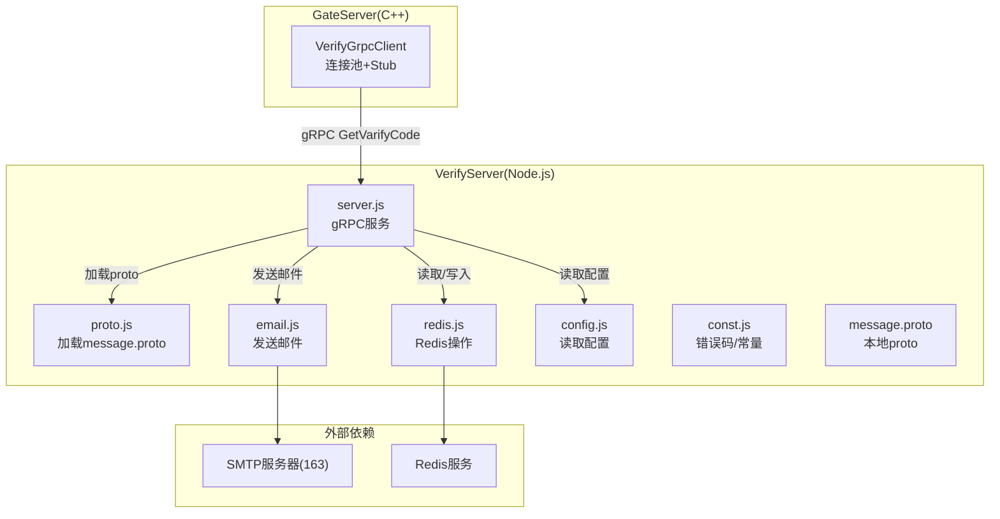
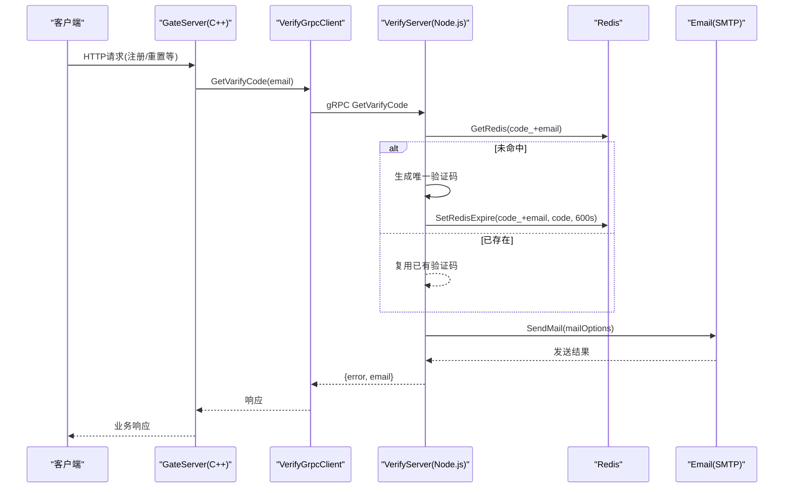
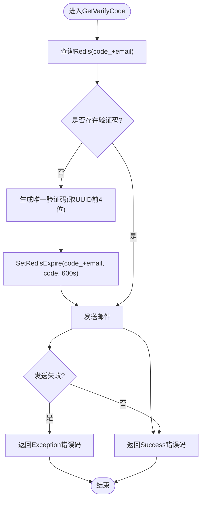
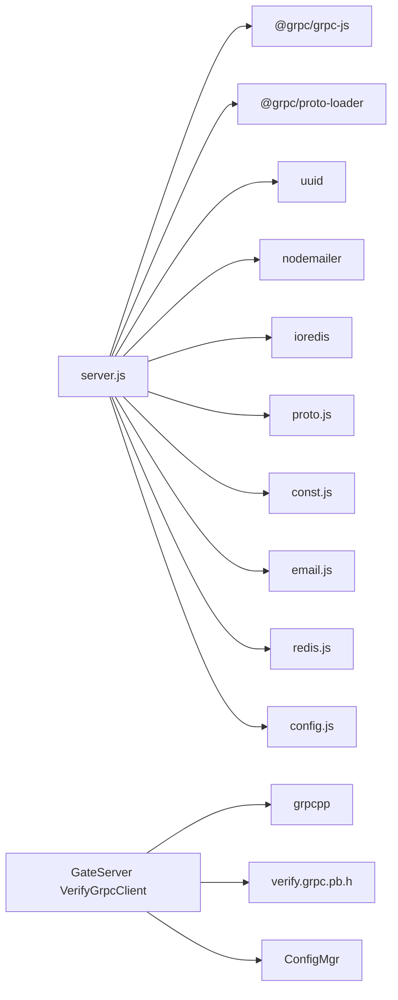

# VerifyServer验证码服务

<cite>
**本文引用的文件**   
- [server.js](file://server/VarifyServer/server.js)
- [email.js](file://server/VarifyServer/email.js)
- [redis.js](file://server/VarifyServer/redis.js)
- [proto.js](file://server/VarifyServer/proto.js)
- [config.js](file://server/VarifyServer/config.js)
- [const.js](file://server/VarifyServer/const.js)
- [message.proto](file://server/VarifyServer/message.proto)
- [verify.proto](file://proto/verify_service/verify.proto)
- [VerifyGrpcClient.h](file://server/GateServer/include/VerifyGrpcClient.h)
- [VerifyGrpcClient.cpp](file://server/GateServer/src/VerifyGrpcClient.cpp)
- [config.json](file://server/VarifyServer/config.json)
- [day08-邮箱认证服务.md](file://开发文档/day08-邮箱认证服务.md)
- [day10-多服务验证码派发功能调试.md](file://开发文档/day10-多服务验证码派发功能调试.md)
</cite>

## 目录
1. [简介](#简介)
2. [项目结构](#项目结构)
3. [核心组件](#核心组件)
4. [架构总览](#架构总览)
5. [详细组件分析](#详细组件分析)
6. [依赖关系分析](#依赖关系分析)
7. [性能与可扩展性](#性能与可扩展性)
8. [安全与防刷机制](#安全与防刷机制)
9. [API接口文档](#api接口文档)
10. [错误处理与监控](#错误处理与监控)
11. [故障排查指南](#故障排查指南)
12. [结论](#结论)

## 简介
本技术文档围绕基于Node.js实现的VerifyServer验证码服务，系统性阐述其架构设计、模块职责、数据流与控制流、以及与gRPC网关（GateServer）的集成方式。重点覆盖：
- 邮箱验证码生成、发送与管理
- Redis缓存管理与过期策略
- gRPC协议定义与调用链路
- 验证码生命周期管理、重试与频率限制
- 邮件模板定制、SMTP配置与发送队列扩展建议
- 安全性、防刷与限流方案
- API接口说明、错误码与监控方案

该服务通过gRPC暴露GetVarifyCode接口，GateServer作为C++客户端调用该服务完成验证码下发流程。

## 项目结构
VerifyServer采用模块化组织，核心文件如下：
- server.js：gRPC服务入口，实现GetVarifyCode业务逻辑
- email.js：基于nodemailer的邮件发送封装
- redis.js：ioredis封装，提供Redis读写与过期设置
- proto.js：动态加载message.proto，生成gRPC服务描述
- config.js：读取config.json中的邮箱、MySQL、Redis等配置
- const.js：常量与错误码定义
- message.proto：gRPC消息与服务定义（本地使用）
- verify.proto：跨服务定义的Proto文件（GateServer侧引用）
- GateServer侧VerifyGrpcClient：连接池与gRPC客户端封装

图表来源
- [server.js:1-76](file://server/VarifyServer/server.js#L1-L76)
- [proto.js:1-12](file://server/VarifyServer/proto.js#L1-L12)
- [email.js:1-37](file://server/VarifyServer/email.js#L1-L37)
- [redis.js:1-101](file://server/VarifyServer/redis.js#L1-L101)
- [config.js:1-15](file://server/VarifyServer/config.js#L1-L15)
- [const.js:1-10](file://server/VarifyServer/const.js#L1-L10)
- [message.proto:1-44](file://server/VarifyServer/message.proto#L1-L44)
- [VerifyGrpcClient.h:1-113](file://server/GateServer/include/VerifyGrpcClient.h#L1-L113)
- [VerifyGrpcClient.cpp:1-9](file://server/GateServer/src/VerifyGrpcClient.cpp#L1-L9)

章节来源
- [server.js:1-76](file://server/VarifyServer/server.js#L1-L76)
- [proto.js:1-12](file://server/VarifyServer/proto.js#L1-L12)
- [email.js:1-37](file://server/VarifyServer/email.js#L1-L37)
- [redis.js:1-101](file://server/VarifyServer/redis.js#L1-L101)
- [config.js:1-15](file://server/VarifyServer/config.js#L1-L15)
- [const.js:1-10](file://server/VarifyServer/const.js#L1-L10)
- [message.proto:1-44](file://server/VarifyServer/message.proto#L1-L44)
- [verify.proto:1-19](file://proto/verify_service/verify.proto#L1-L19)
- [VerifyGrpcClient.h:1-113](file://server/GateServer/include/VerifyGrpcClient.h#L1-L113)
- [VerifyGrpcClient.cpp:1-9](file://server/GateServer/src/VerifyGrpcClient.cpp#L1-L9)

## 核心组件
- gRPC服务层（server.js）
  - 暴露GetVarifyCode RPC，接收email参数
  - 查询Redis中是否已有验证码；若无则生成并设置过期时间
  - 组装邮件内容并通过email模块发送
  - 返回统一错误码与email字段
- 邮件模块（email.js）
  - 基于nodemailer创建SMTP传输通道
  - 封装SendMail为Promise，便于异步调用
- Redis模块（redis.js）
  - ioredis客户端初始化与错误重连
  - 提供GetRedis、QueryRedis、SetRedisExpire等方法
  - 心跳机制定时写键用于健康检查
- 配置与常量（config.js、const.js、config.json）
  - 从config.json读取邮箱、Redis、MySQL配置
  - 定义code_prefix与错误码枚举
- Proto加载（proto.js、message.proto、verify.proto）
  - 动态加载message.proto，生成服务描述
  - 跨服务协议在verify.proto中定义，GateServer侧使用

章节来源
- [server.js:1-76](file://server/VarifyServer/server.js#L1-L76)
- [email.js:1-37](file://server/VarifyServer/email.js#L1-L37)
- [redis.js:1-101](file://server/VarifyServer/redis.js#L1-L101)
- [config.js:1-15](file://server/VarifyServer/config.js#L1-L15)
- [const.js:1-10](file://server/VarifyServer/const.js#L1-L10)
- [config.json:1-21](file://server/VarifyServer/config.json#L1-L21)
- [proto.js:1-12](file://server/VarifyServer/proto.js#L1-L12)
- [message.proto:1-44](file://server/VarifyServer/message.proto#L1-L44)
- [verify.proto:1-19](file://proto/verify_service/verify.proto#L1-L19)

## 架构总览
VerifyServer作为独立微服务，通过gRPC对外暴露验证码获取能力。GateServer作为C++网关，维护一个gRPC连接池，复用对VerifyServer的调用。

图表来源
- [server.js:15-64](file://server/VarifyServer/server.js#L15-L64)
- [redis.js:41-98](file://server/VarifyServer/redis.js#L41-L98)
- [email.js:22-35](file://server/VarifyServer/email.js#L22-L35)
- [VerifyGrpcClient.h:87-104](file://server/GateServer/include/VerifyGrpcClient.h#L87-L104)
- [VerifyGrpcClient.cpp:4-9](file://server/GateServer/src/VerifyGrpcClient.cpp#L4-L9)

## 详细组件分析

### gRPC服务与业务流程（server.js）
- 服务启动：绑定端口50051，注册VarifyService.GetVarifyCode处理器
- 请求处理：
  - 解析email参数
  - 查询Redis是否存在验证码，不存在则生成短码（UUID前4位），设置过期时间600秒
  - 构造邮件文本并调用email模块发送
  - 返回统一错误码与email
- 异常处理：捕获异常后返回Exception错误码

图表来源
- [server.js:15-64](file://server/VarifyServer/server.js#L15-L64)
- [redis.js:87-98](file://server/VarifyServer/redis.js#L87-L98)

章节来源
- [server.js:1-76](file://server/VarifyServer/server.js#L1-L76)

### 邮件发送模块（email.js）
- 使用nodemailer创建SMTP传输对象，配置host、port、secure与auth
- SendMail函数将回调式sendMail封装为Promise，便于异步调用
- 支持自定义mailOptions（from、to、subject、text等）

章节来源
- [email.js:1-37](file://server/VarifyServer/email.js#L1-L37)

### Redis缓存模块（redis.js）
- 客户端初始化：主机、端口、密码、离线队列与就绪检查配置
- 事件监听：error与end事件触发重连
- 心跳：每60秒写一次heartbeat键，便于健康检查
- 方法：
  - GetRedis(key)：获取值，空返回null
  - QueryRedis(key)：判断key是否存在
  - SetRedisExpire(key,value,exptime)：设置值与过期时间

章节来源
- [redis.js:1-101](file://server/VarifyServer/redis.js#L1-L101)

### Proto与gRPC加载（proto.js、message.proto、verify.proto）
- proto.js动态加载message.proto，导出message命名空间供服务使用
- message.proto定义VarifyService与GetVarifyReq/Rsp
- verify.proto为跨服务协议定义，GateServer侧使用该定义生成Stub

章节来源
- [proto.js:1-12](file://server/VarifyServer/proto.js#L1-L12)
- [message.proto:1-44](file://server/VarifyServer/message.proto#L1-L44)
- [verify.proto:1-19](file://proto/verify_service/verify.proto#L1-L19)

### GateServer侧gRPC客户端（VerifyGrpcClient.h/.cpp）
- RPConPool：维护固定数量的VarifyService::Stub连接池，线程安全获取与归还
- VerifyGrpcClient：单例，封装GetVarifyCode调用，状态码处理与连接池回收

章节来源
- [VerifyGrpcClient.h:18-113](file://server/GateServer/include/VerifyGrpcClient.h#L18-L113)
- [VerifyGrpcClient.cpp:1-9](file://server/GateServer/src/VerifyGrpcClient.cpp#L1-L9)

## 依赖关系分析
- server.js依赖：
  - @grpc/grpc-js：gRPC服务端
  - @grpc/proto-loader：动态加载proto
  - uuid：生成唯一ID
  - nodemailer：发送邮件
  - ioredis：Redis客户端
  - 内部模块：proto.js、const.js、email.js、redis.js、config.js
- GateServer依赖：
  - grpcpp：C++ gRPC客户端
  - verify.grpc.pb.h：由verify.proto生成的头文件
  - 内部ConfigMgr：读取VarifyServer地址与端口

图表来源
- [server.js:1-76](file://server/VarifyServer/server.js#L1-L76)
- [VerifyGrpcClient.h:1-113](file://server/GateServer/include/VerifyGrpcClient.h#L1-L113)

章节来源
- [server.js:1-76](file://server/VarifyServer/server.js#L1-L76)
- [VerifyGrpcClient.h:1-113](file://server/GateServer/include/VerifyGrpcClient.h#L1-L113)

## 性能与可扩展性
- 并发模型
  - Node.js单线程事件循环，适合I/O密集型任务（邮件、Redis）
  - GateServer侧使用连接池减少gRPC握手开销，提升吞吐
- Redis优化
  - 使用过期时间控制验证码有效期，避免长期占用内存
  - 心跳键可用于健康检查与快速发现节点状态
- 邮件发送
  - 当前为同步阻塞式调用（await），在高并发下可能成为瓶颈
  - 建议引入发送队列（如bull或amqp）进行异步化与削峰填谷
- 扩展点
  - 可横向扩展多个VerifyServer实例，GateServer侧负载均衡
  - 增加速率限制中间件（按IP或邮箱维度）

[本节为通用指导，不直接分析具体文件]

## 安全与防刷机制
- 验证码长度与随机性
  - 当前使用UUID前4位，熵较低，易被暴力破解
  - 建议改为6位数字或字母组合，提高复杂度
- 频率限制
  - 当前无显式限流，同一邮箱短时间内可重复获取
  - 建议在Redis中记录最近发送时间与次数，限制单位时间内请求上限
- 传输安全
  - gRPC使用InsecureChannelCredentials，生产环境应启用TLS
  - SMTP建议使用授权码与SSL/TLS加密
- 敏感配置
  - config.json包含邮箱授权码与数据库密码，需纳入密钥管理系统
- 审计与监控
  - 建议记录发送日志（成功/失败、耗时、错误码），接入集中式日志系统

[本节为通用指导，不直接分析具体文件]

## API接口文档
- 服务名称：VarifyService
- 方法：GetVarifyCode
- 请求体：GetVarifyReq
  - email: string（邮箱地址）
- 响应体：GetVarifyRsp
  - error: int32（错误码，0表示成功）
  - email: string（原样返回）
  - code: string（当前实现未填充，可在后续版本返回）

错误码定义（const.js）
- Success: 0
- RedisErr: 1
- Exception: 2

调用示例（概念性）
- GateServer通过VerifyGrpcClient发起gRPC调用，传入email，收到error与email字段
- 若error=0表示验证码已成功生成并发送

章节来源
- [message.proto:5-17](file://server/VarifyServer/message.proto#L5-L17)
- [verify.proto:6-18](file://proto/verify_service/verify.proto#L6-L18)
- [const.js:1-10](file://server/VarifyServer/const.js#L1-L10)
- [server.js:15-64](file://server/VarifyServer/server.js#L15-L64)

## 错误处理与监控
- 错误分类
  - RedisErr：Redis写入失败
  - Exception：其他异常（网络、邮件服务等）
- 处理策略
  - 捕获异常后返回Exception错误码，便于上层重试或告警
  - Redis连接错误自动重连（error与end事件）
- 监控建议
  - 指标：请求量、成功率、平均耗时、Redis命中率、邮件发送成功率
  - 日志：结构化日志（email、error、耗时、traceId）
  - 健康检查：Redis heartbeat键、gRPC存活探针

章节来源
- [redis.js:16-34](file://server/VarifyServer/redis.js#L16-L34)
- [server.js:56-62](file://server/VarifyServer/server.js#L56-L62)
- [const.js:3-7](file://server/VarifyServer/const.js#L3-L7)

## 故障排查指南
- 无法连接Redis
  - 检查config.json中redis.host/port/passwd是否正确
  - 查看RedisCli错误日志与重连行为
- 邮件发送失败
  - 确认SMTP配置（host、port、secure、auth.user/auth.pass）
  - 检查邮箱授权码是否有效
  - 查看email模块日志输出
- gRPC调用超时或失败
  - 检查GateServer配置的VarifyServer Host/Port
  - 确认VerifyServer进程运行且端口可达
- 验证码未生效或重复
  - 检查Redis key是否存在与过期时间
  - 确认GetRedis/SetRedisExpire调用顺序与返回值

章节来源
- [redis.js:1-101](file://server/VarifyServer/redis.js#L1-L101)
- [email.js:1-37](file://server/VarifyServer/email.js#L1-L37)
- [VerifyGrpcClient.cpp:4-9](file://server/GateServer/src/VerifyGrpcClient.cpp#L4-L9)

## 结论
VerifyServer以简洁清晰的模块化设计实现了验证码的生成、缓存与邮件发送，结合GateServer的连接池与gRPC通信，形成稳定的验证码下发链路。当前实现满足基本功能需求，但在安全性（验证码强度、传输加密）、限流与异步化方面仍有改进空间。建议在生产环境中完善TLS、限流策略、发送队列与监控体系，以提升稳定性与可观测性。

[本节为总结性内容，不直接分析具体文件]