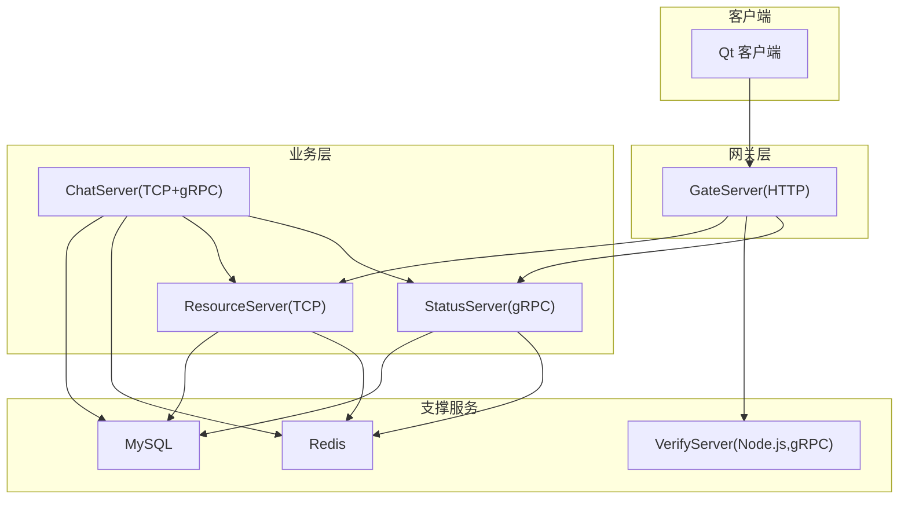
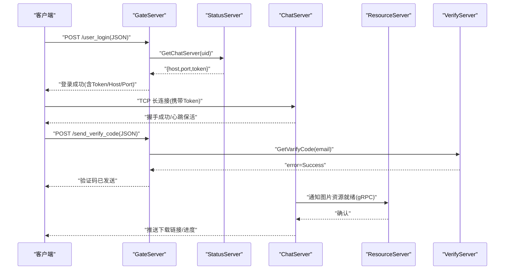
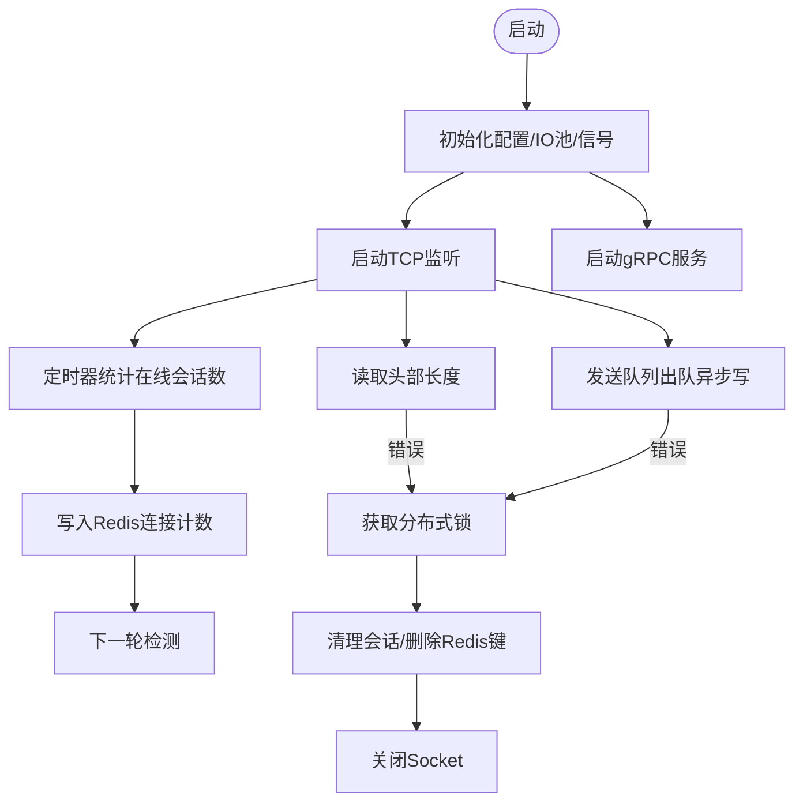
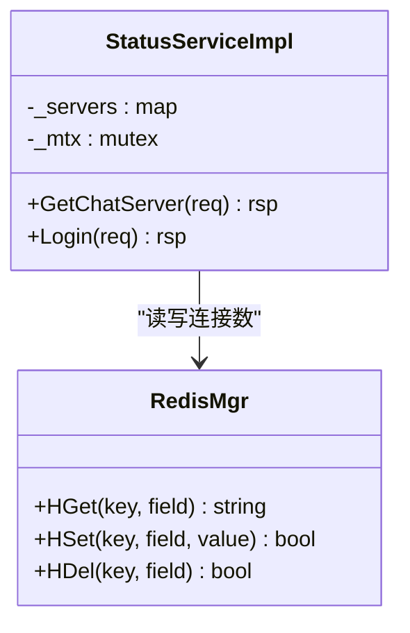
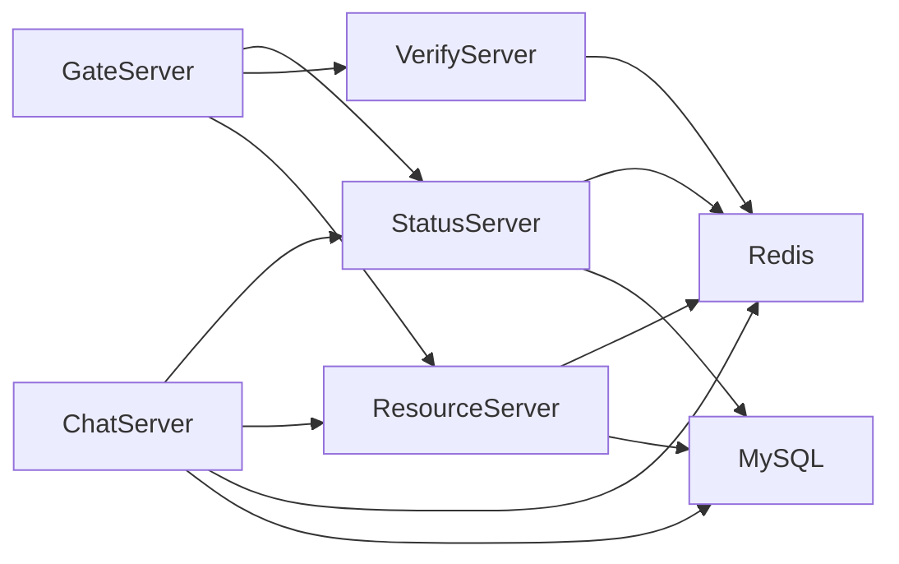

# 微服务架构设计

<cite>
**本文引用的文件**   
- [README.md](file://README.md)
- [CMakeLists.txt](file://CMakeLists.txt)
- [GateServer.cpp](file://server/GateServer/src/GateServer.cpp)
- [config.ini](file://server/GateServer/config/config.ini)
- [ChatServer.cpp](file://server/ChatServer/src/ChatServer.cpp)
- [chatserver1.ini](file://server/ChatServer/config/chatserver1.ini)
- [chatserver2.ini](file://server/ChatServer/config/chatserver2.ini)
- [StatusServer.cpp](file://server/StatusServer/src/StatusServer.cpp)
- [ResourceServer.cpp](file://server/ResourceServer/src\ResourceServer.cpp)
- [server.js](file://server/VarifyServer/server.js)
- [chat.proto](file://proto/chat_service/chat.proto)
- [status.proto](file://proto/status_service/status.proto)
- [verify.proto](file://proto/verify_service/verify.proto)
- [day27-分布式服务设计.md](file://开发文档/day27-分布式服务设计.md)
- [day35心跳逻辑.md](file://开发文档/day35心跳逻辑.md)
- [CSession.cpp](file://server/ChatServer/src/CSession.cpp)
</cite>

## 目录
1. [引言](#引言)
2. [项目结构](#项目结构)
3. [核心组件](#核心组件)
4. [架构总览](#架构总览)
5. [详细组件分析](#详细组件分析)
6. [依赖关系分析](#依赖关系分析)
7. [性能与扩展性](#性能与扩展性)
8. [故障排查指南](#故障排查指南)
9. [结论](#结论)
10. [附录：协议与配置参考](#附录协议与配置参考)

## 引言
本设计文档面向 LLFCChat 微服务架构，围绕 GateServer（HTTP 网关）、ChatServer（聊天核心）、StatusServer（状态管理）、ResourceServer（资源存储）和 VerifyServer（验证码服务）的职责划分、协作模式、通信协议、消息格式、错误处理、生命周期与配置管理、监控方案、服务注册发现、负载均衡与熔断策略、扩展点与插件机制，以及分布式环境下的协调与一致性保证进行系统化说明。读者可据此快速理解系统全貌并指导部署与运维。

## 项目结构
仓库采用多语言混合实现：
- C++ 后端服务：GateServer、ChatServer、StatusServer、ResourceServer
- Node.js 验证码服务：VerifyServer
- gRPC 接口定义：proto 目录
- Qt 客户端：client/llfcchat
- CMake 构建：根 CMakeLists 与各子模块

图表来源
- [CMakeLists.txt:1-34](file://CMakeLists.txt#L1-L34)
- [README.md:1-112](file://README.md#L1-L112)

章节来源
- [CMakeLists.txt:1-34](file://CMakeLists.txt#L1-L34)
- [README.md:1-112](file://README.md#L1-L112)

## 核心组件
- GateServer：对外 HTTP 入口，负责鉴权、路由转发、调用 StatusServer 获取 ChatServer 地址与 Token、调用 VerifyServer 发送验证码、对接 ResourceServer 上传下载等。
- ChatServer：长连接 TCP 服务器，承载聊天消息收发、好友申请/认证、踢人、图片消息通知；通过 gRPC 暴露跨实例通信能力；维护在线会话、心跳、分布式锁清理。
- StatusServer：状态管理与负载均衡中心，维护各 ChatServer 的连接数与健康信息，按最小连接数策略返回目标 ChatServer 的 host/port/token。
- ResourceServer：文件与资源存储服务，提供断点续传、分片上传/下载、进度回调；与 ChatServer 通过 gRPC 协同推送资源下载通知。
- VerifyServer：Node.js 实现的验证码服务，基于 Redis 生成/缓存验证码并通过邮件发送。

章节来源
- [GateServer.cpp:128-158](file://server/GateServer/src/GateServer.cpp#L128-L158)
- [ChatServer.cpp:20-79](file://server/ChatServer/src/ChatServer.cpp#L20-L79)
- [StatusServer.cpp:17-52](file://server/StatusServer/src/StatusServer.cpp#L17-L52)
- [ResourceServer.cpp:15-41](file://server/ResourceServer/src\ResourceServer.cpp#L15-L41)
- [server.js:15-73](file://server/VarifyServer/server.js#L15-L73)

## 架构总览
整体采用“HTTP 网关 + gRPC 内部总线 + TCP 长连接”的分层架构。外部请求统一由 GateServer 接入，经 StatusServer 做负载均衡后指向具体 ChatServer；ChatServer 之间通过 gRPC 完成跨节点消息转发与事件同步；ResourceServer 独立承担大对象存储与传输；VerifyServer 提供验证码能力。

图表来源
- [status.proto:1-32](file://proto/status_service/status.proto#L1-L32)
- [chat.proto:1-105](file://proto/chat_service/chat.proto#L1-L105)
- [verify.proto:1-19](file://proto/verify_service/verify.proto#L1-L19)
- [GateServer.cpp:128-158](file://server/GateServer/src/GateServer.cpp#L128-L158)
- [ChatServer.cpp:20-79](file://server/ChatServer/src/ChatServer.cpp#L20-L79)
- [server.js:15-73](file://server/VarifyServer/server.js#L15-L73)

## 详细组件分析

### GateServer（HTTP 网关）
职责
- 解析 HTTP 请求，校验 JSON 参数
- 调用 StatusServer 获取 ChatServer 路由信息（host/port/token）
- 调用 VerifyServer 发送验证码
- 与 ResourceServer 交互完成文件上传/下载
- 统一错误码与响应格式

关键流程
- 用户登录：验证用户名密码 → 查询 StatusServer → 返回 ChatServer 地址与 Token
- 验证码：接收邮箱 → 调用 VerifyServer → 返回结果
- 资源：根据业务需要转发或直连 ResourceServer

配置要点
- 监听端口、VerifyServer/StatusServer/Mysql/Redis/ResourceServer 的地址与端口

章节来源
- [GateServer.cpp:128-158](file://server/GateServer/src/GateServer.cpp#L128-L158)
- [config.ini:1-25](file://server/GateServer/config/config.ini#L1-L25)

### ChatServer（聊天核心）
职责
- 维护 TCP 长连接与会话（CSession），处理粘包/断包、读写队列
- 实现聊天消息、好友申请/认证、踢人、图片消息通知等业务
- 启动 gRPC 服务，供其他 ChatServer/StatusServer/ResourceServer 调用
- 心跳检测、异常会话清理、分布式锁保护

关键流程
- 启动：初始化 AsioIOServicePool、注册信号、启动 TCP 与 gRPC
- 心跳：定时统计在线会话数并写入 Redis，用于 StatusServer 负载均衡
- 异常处理：读失败/写失败时加分布式锁清理会话，避免重复清理与死锁

图表来源
- [ChatServer.cpp:20-79](file://server/ChatServer/src/ChatServer.cpp#L20-L79)
- [CSession.cpp:184-224](file://server/ChatServer/src/CSession.cpp#L184-L224)
- [day35心跳逻辑.md:272-365](file://开发文档/day35心跳逻辑.md#L272-L365)

章节来源
- [ChatServer.cpp:20-79](file://server/ChatServer/src/ChatServer.cpp#L20-L79)
- [CSession.cpp:184-224](file://server/ChatServer/src/CSession.cpp#L184-L224)
- [day35心跳逻辑.md:272-365](file://开发文档/day35心跳逻辑.md#L272-L365)

### StatusServer（状态管理）
职责
- 维护 ChatServer 列表与连接数（Redis Hash）
- 提供 GetChatServer 接口，按最小连接数策略返回目标 ChatServer
- 提供 Login 接口，校验 Token 并返回用户信息

关键流程
- 启动 gRPC 服务
- 收到 GetChatServerReq(uid) 后，遍历 Redis 中各 ChatServer 的连接数，选择最小者返回 host/port/token

图表来源
- [StatusServer.cpp:17-52](file://server/StatusServer/src/StatusServer.cpp#L17-L52)
- [status.proto:1-32](file://proto/status_service/status.proto#L1-L32)
- [day27-分布式服务设计.md:487-524](file://开发文档/day27-分布式服务设计.md#L487-L524)

章节来源
- [StatusServer.cpp:17-52](file://server/StatusServer/src/StatusServer.cpp#L17-L52)
- [status.proto:1-32](file://proto/status_service/status.proto#L1-L32)
- [day27-分布式服务设计.md:487-524](file://开发文档/day27-分布式服务设计.md#L487-L524)

### ResourceServer（资源存储）
职责
- 提供文件上传/下载、断点续传、进度上报
- 与 ChatServer 通过 gRPC 协同，通知客户端开始下载
- 持久化元数据到 MySQL，使用 Redis 辅助状态

关键流程
- 启动 TCP 服务
- 接收分片上传请求，落盘并更新元数据
- 收到 ChatServer 的通知后，向客户端推送下载链接与进度

章节来源
- [ResourceServer.cpp:15-41](file://server/ResourceServer/src\ResourceServer.cpp#L15-L41)

### VerifyServer（验证码服务）
职责
- 基于 Redis 生成/缓存验证码（带过期时间）
- 发送邮件并将结果返回给 GateServer

关键流程
- 收到 GetVarifyReq(email) → 从 Redis 取/生成验证码 → 发送邮件 → 返回 error=Success

章节来源
- [server.js:15-73](file://server/VarifyServer/server.js#L15-L73)
- [verify.proto:1-19](file://proto/verify_service/verify.proto#L1-L19)

## 依赖关系分析
- GateServer 依赖 StatusServer、VerifyServer、ResourceServer、Mysql、Redis
- ChatServer 依赖 StatusServer（可选）、ResourceServer（可选）、Mysql、Redis
- StatusServer 依赖 Mysql、Redis
- ResourceServer 依赖 Mysql、Redis
- VerifyServer 依赖 Redis、邮件服务

图表来源
- [config.ini:1-25](file://server/GateServer/config/config.ini#L1-L25)
- [chatserver1.ini:1-29](file://server/ChatServer/config/chatserver1.ini#L1-L29)
- [chatserver2.ini:1-29](file://server/ChatServer/config/chatserver2.ini#L1-L29)

章节来源
- [config.ini:1-25](file://server/GateServer/config/config.ini#L1-L25)
- [chatserver1.ini:1-29](file://server/ChatServer/config/chatserver1.ini#L1-L29)
- [chatserver2.ini:1-29](file://server/ChatServer/config/chatserver2.ini#L1-L29)

## 性能与扩展性
- I/O 模型：GateServer/ChatServer/ResourceServer 均基于 Boost.Asio 异步 I/O，配合线程池提升吞吐
- 负载均衡：StatusServer 基于 Redis 中的连接数，按最小连接数策略分配新连接
- 心跳与容错：ChatServer 定时统计在线会话并更新 Redis，便于 StatusServer 感知负载；异常会话通过分布式锁安全清理
- 可扩展性：新增 ChatServer 只需按配置启动并注册自身连接数，即可被 StatusServer 纳入调度
- 资源传输：ResourceServer 支持断点续传与分片，降低大文件传输失败成本

章节来源
- [day27-分布式服务设计.md:1-541](file://开发文档/day27-分布式服务设计.md#L1-L541)
- [day35心跳逻辑.md:272-365](file://开发文档/day35心跳逻辑.md#L272-L365)

## 故障排查指南
常见问题与定位建议
- 登录失败
  - 检查 GateServer 对 StatusServer 的 gRPC 调用是否成功
  - 核对数据库凭据与表结构
- 验证码未收到
  - 检查 VerifyServer 日志、Redis 验证码键是否存在且未过期
  - 检查邮件服务配置与网络连通性
- 聊天消息不同步
  - 检查 ChatServer 间 gRPC 调用链（NotifyTextChatMsg/NotifyKickUser）
  - 查看 Redis 分布式锁是否冲突或超时
- 资源下载失败
  - 检查 ResourceServer 文件路径与权限
  - 确认 ChatServer 是否正确下发下载通知

章节来源
- [CSession.cpp:184-224](file://server/ChatServer/src/CSession.cpp#L184-L224)
- [day35心跳逻辑.md:272-365](file://开发文档/day35心跳逻辑.md#L272-L365)

## 结论
LLFCChat 以 GateServer 为统一入口，结合 StatusServer 的轻量级负载均衡与 ChatServer 的高并发长连接能力，形成清晰的服务边界与协作模式。ResourceServer 专注大对象传输，VerifyServer 提供验证码能力，整体架构具备良好的扩展性与可运维性。通过 Redis 作为共享状态中枢，实现了跨进程/跨节点的协调与一致性保障。

## 附录：协议与配置参考

### gRPC 接口概览
- ChatService（chat.proto）
  - NotifyAddFriend/AddFriendReq→Rsp
  - NotifyAuthFriend/AuthFriendReq→Rsp
  - NotifyTextChatMsg/TextChatMsgReq→Rsp
  - NotifyKickUser/KickUserReq→Rsp
  - NotifyChatImgMsg/NotifyChatImgReq→Rsp
- StatusService（status.proto）
  - GetChatServer(GetChatServerReq)→GetChatServerRsp
  - Login(LoginReq)→LoginRsp
- VarifyService（verify.proto）
  - GetVarifyCode(GetVarifyReq)→GetVarifyRsp

章节来源
- [chat.proto:1-105](file://proto/chat_service/chat.proto#L1-L105)
- [status.proto:1-32](file://proto/status_service/status.proto#L1-L32)
- [verify.proto:1-19](file://proto/verify_service/verify.proto#L1-L19)

### 配置文件示例
- GateServer（config.ini）
  - GateServer.Port、VerifyServer.Host/Port、StatusServer.Host/Port、Mysql.*、Redis.*、ResServer.*
- ChatServer（chatserver1.ini/chatserver2.ini）
  - SelfServer.Name/Host/Port/RPCPort、PeerServer.Servers、对应 Peer 的配置段

章节来源
- [config.ini:1-25](file://server/GateServer/config/config.ini#L1-L25)
- [chatserver1.ini:1-29](file://server/ChatServer/config/chatserver1.ini#L1-L29)
- [chatserver2.ini:1-29](file://server/ChatServer/config/chatserver2.ini#L1-L29)