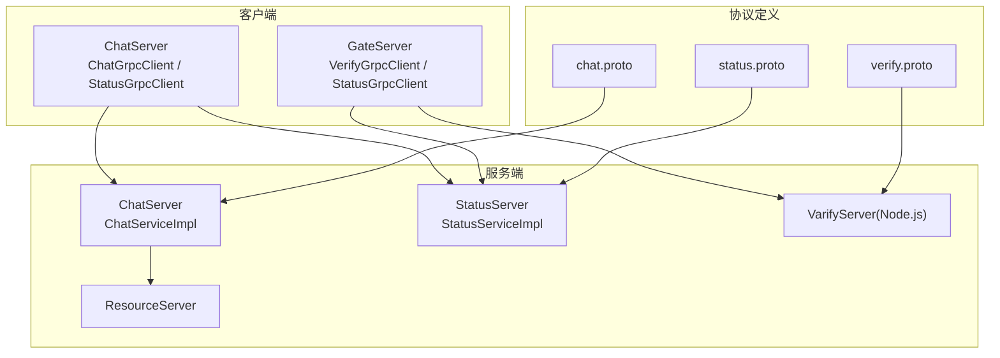
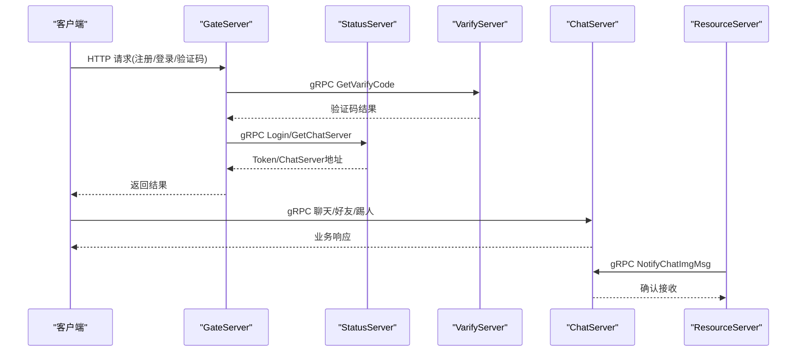
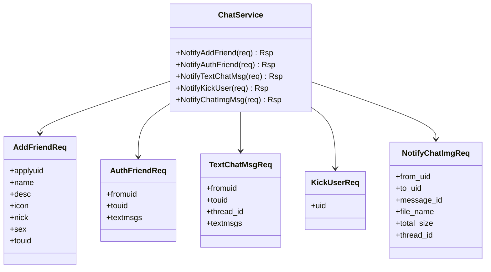
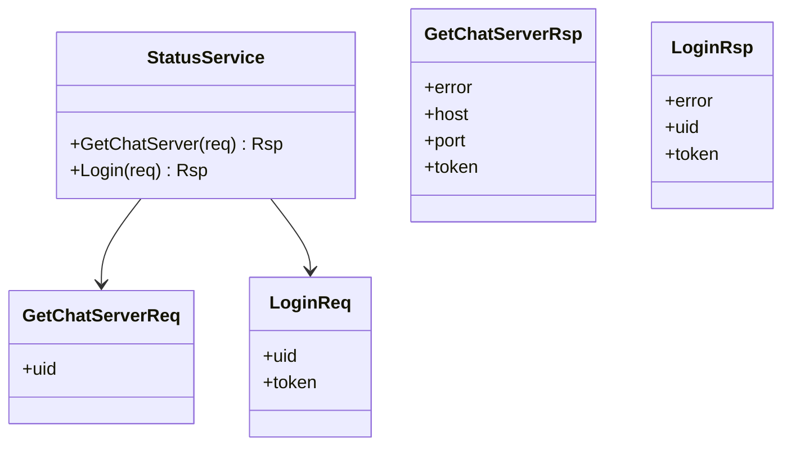
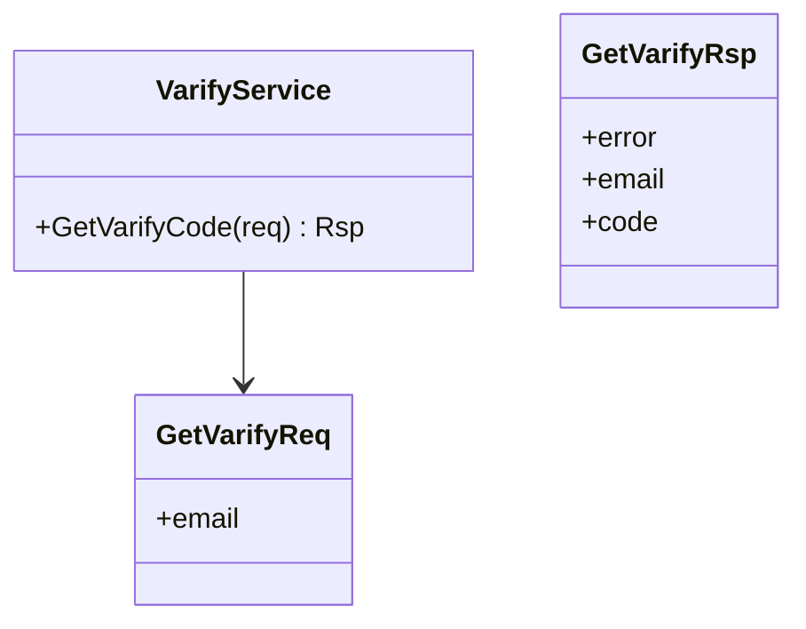
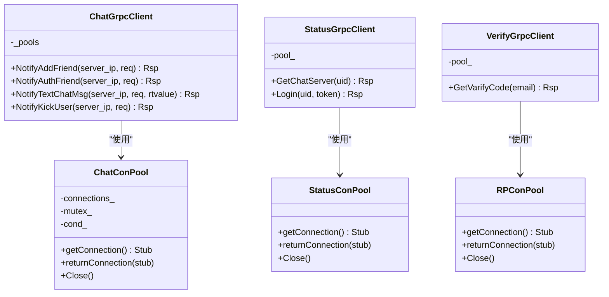
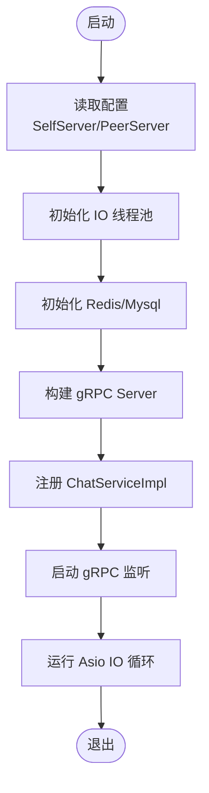
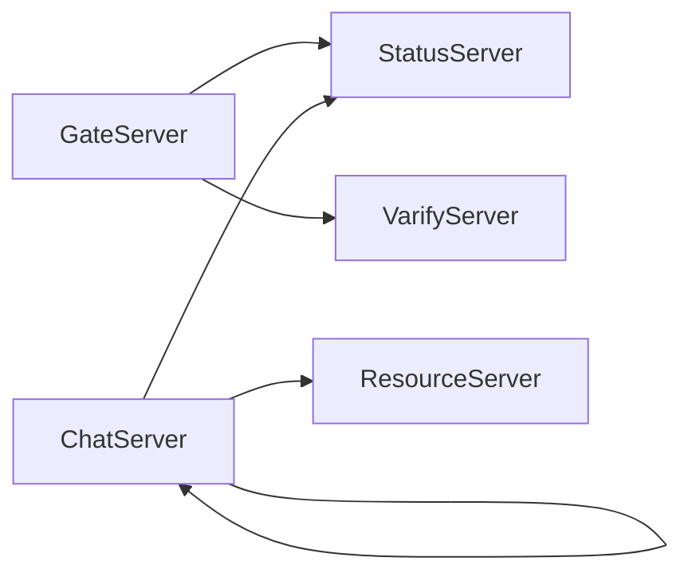

# 服务间通信机制

<cite>
**本文引用的文件**
- [chat.proto](file://proto/chat_service/chat.proto)
- [status.proto](file://proto/status_service/status.proto)
- [verify.proto](file://proto/verify_service/verify.proto)
- [ChatGrpcClient.h](file://server/ChatServer/include/ChatGrpcClient.h)
- [StatusGrpcClient.h（ChatServer）](file://server/ChatServer/include/StatusGrpcClient.h)
- [VerifyGrpcClient.h](file://server/GateServer/include/VerifyGrpcClient.h)
- [StatusGrpcClient.h（GateServer）](file://server/GateServer/include/StatusGrpcClient.h)
- [ChatServiceImpl.h](file://server/ChatServer/include/ChatServiceImpl.h)
- [StatusServiceImpl.h](file://server/StatusServer/include/StatusServiceImpl.h)
- [ChatServer.cpp](file://server/ChatServer/src/ChatServer.cpp)
- [GateServer.cpp](file://server/GateServer/src/GateServer.cpp)
- [const.h](file://server/ChatServer/include/const.h)
- [config.ini（GateServer）](file://server/GateServer/config/config.ini)
- [chatserver1.ini（ChatServer）](file://server/ChatServer/config/chatserver1.ini)
</cite>

## 目录
1. [引言](#引言)
2. [项目结构](#项目结构)
3. [核心组件](#核心组件)
4. [架构总览](#架构总览)
5. [详细组件分析](#详细组件分析)
6. [依赖关系分析](#依赖关系分析)
7. [性能与可靠性](#性能与可靠性)
8. [安全与认证](#安全与认证)
9. [监控与可观测性](#监控与可观测性)
10. [故障排查指南](#故障排查指南)
11. [结论](#结论)

## 引言
本技术文档围绕 LLFCChat 微服务间的 gRPC 通信机制展开，系统梳理协议定义、消息格式、服务接口设计、调用关系与数据流转；并基于现有代码实现，总结服务发现、负载均衡、故障转移、超时重试、熔断降级、异步通知、事件驱动等关键能力。同时给出监控、链路追踪与性能分析建议，以及常见问题定位与解决方案，帮助读者快速理解与扩展该系统的通信层。

## 项目结构
LLFCChat 采用多服务拆分：GateServer（HTTP 网关）、ChatServer（聊天业务 gRPC 服务）、StatusServer（状态与路由服务）、ResourceServer（资源服务）、VarifyServer（验证码 Node.js 服务）。gRPC 协议定义位于 proto 目录，各服务通过独立的 C++ 客户端封装访问远端 gRPC 服务，并使用配置中心管理地址与端口。

图表来源
- [chat.proto:1-105](file://proto/chat_service/chat.proto#L1-L105)
- [status.proto:1-32](file://proto/status_service/status.proto#L1-L32)
- [verify.proto:1-19](file://proto/verify_service/verify.proto#L1-L19)
- [ChatServiceImpl.h:1-55](file://server/ChatServer/include/ChatServiceImpl.h#L1-L55)
- [StatusServiceImpl.h:1-52](file://server/StatusServer/include/StatusServiceImpl.h#L1-L52)
- [VerifyGrpcClient.h:1-113](file://server/GateServer/include/VerifyGrpcClient.h#L1-L113)
- [StatusGrpcClient.h（GateServer）:1-98](file://server/GateServer/include/StatusGrpcClient.h#L1-L98)
- [ChatGrpcClient.h:1-116](file://server/ChatServer/include/ChatGrpcClient.h#L1-L116)
- [StatusGrpcClient.h（ChatServer）:1-99](file://server/ChatServer/include/StatusGrpcClient.h#L1-L99)

章节来源
- [ChatServer.cpp:1-81](file://server/ChatServer/src/ChatServer.cpp#L1-L81)
- [GateServer.cpp:1-160](file://server/GateServer/src/GateServer.cpp#L1-L160)
- [config.ini（GateServer）:1-25](file://server/GateServer/config/config.ini#L1-L25)
- [chatserver1.ini（ChatServer）:1-30](file://server/ChatServer/config/chatserver1.ini#L1-L30)

## 核心组件
- gRPC 协议与服务
  - ChatService：好友申请、好友认证、文本聊天、踢人、图片消息通知等。
  - StatusService：获取 ChatServer 路由信息、登录校验。
  - VarifyService：发送验证码。
- 客户端连接池
  - ChatGrpcClient：对 ChatService 的 gRPC 客户端封装，内含连接池与单例。
  - StatusGrpcClient（ChatServer/GateServer）：对 StatusService 的 gRPC 客户端封装。
  - VerifyGrpcClient：对 VarifyService 的 gRPC 客户端封装。
- 服务端实现
  - ChatServiceImpl：实现 ChatService 接口，转发到内部逻辑系统。
  - StatusServiceImpl：维护 ChatServer 注册表与 Token 映射，提供路由与登录。
- 配置与常量
  - const.h：错误码、消息 ID、分布式锁相关常量。
  - config.ini：各服务监听端口、依赖服务地址。

章节来源
- [chat.proto:1-105](file://proto/chat_service/chat.proto#L1-L105)
- [status.proto:1-32](file://proto/status_service/status.proto#L1-L32)
- [verify.proto:1-19](file://proto/verify_service/verify.proto#L1-L19)
- [ChatGrpcClient.h:1-116](file://server/ChatServer/include/ChatGrpcClient.h#L1-L116)
- [StatusGrpcClient.h（ChatServer）:1-99](file://server/ChatServer/include/StatusGrpcClient.h#L1-L99)
- [VerifyGrpcClient.h:1-113](file://server/GateServer/include/VerifyGrpcClient.h#L1-L113)
- [StatusGrpcClient.h（GateServer）:1-98](file://server/GateServer/include/StatusGrpcClient.h#L1-L98)
- [ChatServiceImpl.h:1-55](file://server/ChatServer/include/ChatServiceImpl.h#L1-L55)
- [StatusServiceImpl.h:1-52](file://server/StatusServer/include/StatusServiceImpl.h#L1-L52)
- [const.h:1-104](file://server/ChatServer/include/const.h#L1-L104)
- [config.ini（GateServer）:1-25](file://server/GateServer/config/config.ini#L1-L25)
- [chatserver1.ini（ChatServer）:1-30](file://server/ChatServer/config/chatserver1.ini#L1-L30)

## 架构总览
整体通信流程如下：
- GateServer 作为 HTTP 入口，负责用户注册、登录、验证码等流程，并通过 gRPC 调用 StatusServer 和 VarifyServer。
- ChatServer 暴露 ChatService，处理聊天、好友关系、踢人等业务，并可被其他 ChatServer 实例或 ResourceServer 调用。
- StatusServer 维护 ChatServer 注册信息与 Token，为客户端提供路由与鉴权。
- ResourceServer 负责文件与图片资源，通过 gRPC 通知 ChatServer 图片消息就绪。

图表来源
- [GateServer.cpp:1-160](file://server/GateServer/src/GateServer.cpp#L1-L160)
- [ChatServer.cpp:1-81](file://server/ChatServer/src/ChatServer.cpp#L1-L81)
- [status.proto:1-32](file://proto/status_service/status.proto#L1-L32)
- [verify.proto:1-19](file://proto/verify_service/verify.proto#L1-L19)
- [chat.proto:1-105](file://proto/chat_service/chat.proto#L1-L105)

## 详细组件分析

### ChatService 协议与消息
- 服务方法
  - NotifyAddFriend：好友申请通知
  - NotifyAuthFriend：好友认证通知
  - NotifyTextChatMsg：文本聊天消息推送
  - NotifyKickUser：踢人通知
  - NotifyChatImgMsg：图片消息通知（由 ResourceServer 调用）
- 消息体
  - AddFriendReq/Rsp、AuthFriendReq/Rsp、TextChatData、TextChatMsgReq/Rsp、KickUserReq/Rsp、NotifyChatImgReq/Rsp

图表来源
- [chat.proto:1-105](file://proto/chat_service/chat.proto#L1-L105)

章节来源
- [chat.proto:1-105](file://proto/chat_service/chat.proto#L1-L105)

### StatusService 协议与消息
- 服务方法
  - GetChatServer：根据 uid 获取 ChatServer 地址与 token
  - Login：登录校验，返回 token
- 消息体
  - GetChatServerReq/Rsp、LoginReq/Rsp

图表来源
- [status.proto:1-32](file://proto/status_service/status.proto#L1-L32)

章节来源
- [status.proto:1-32](file://proto/status_service/status.proto#L1-L32)

### VarifyService 协议与消息
- 服务方法
  - GetVarifyCode：发送验证码
- 消息体
  - GetVarifyReq/Rsp

图表来源
- [verify.proto:1-19](file://proto/verify_service/verify.proto#L1-L19)

章节来源
- [verify.proto:1-19](file://proto/verify_service/verify.proto#L1-L19)

### gRPC 客户端封装与连接池
- ChatGrpcClient
  - 使用 ChatConPool 管理多个 ChatService::Stub，支持并发复用与优雅关闭。
  - 对外暴露 NotifyAddFriend、NotifyAuthFriend、NotifyTextChatMsg、NotifyKickUser 等方法。
- StatusGrpcClient（ChatServer/GateServer）
  - 使用 StatusConPool 管理多个 StatusService::Stub。
  - 暴露 GetChatServer、Login 方法。
- VerifyGrpcClient
  - 使用 RPConPool 管理多个 VarifyService::Stub。
  - 暴露 GetVarifyCode 方法，失败时设置统一错误码。

图表来源
- [ChatGrpcClient.h:1-116](file://server/ChatServer/include/ChatGrpcClient.h#L1-L116)
- [StatusGrpcClient.h（ChatServer）:1-99](file://server/ChatServer/include/StatusGrpcClient.h#L1-L99)
- [StatusGrpcClient.h（GateServer）:1-98](file://server/GateServer/include/StatusGrpcClient.h#L1-L98)
- [VerifyGrpcClient.h:1-113](file://server/GateServer/include/VerifyGrpcClient.h#L1-L113)

章节来源
- [ChatGrpcClient.h:1-116](file://server/ChatServer/include/ChatGrpcClient.h#L1-L116)
- [StatusGrpcClient.h（ChatServer）:1-99](file://server/ChatServer/include/StatusGrpcClient.h#L1-L99)
- [StatusGrpcClient.h（GateServer）:1-98](file://server/GateServer/include/StatusGrpcClient.h#L1-L98)
- [VerifyGrpcClient.h:1-113](file://server/GateServer/include/VerifyGrpcClient.h#L1-L113)

### 服务端实现与启动流程
- ChatServiceImpl
  - 实现 ChatService 接口，将请求转发至内部逻辑系统（如 CServer、LogicSystem）。
  - 支持图片消息通知回调。
- StatusServiceImpl
  - 维护 ChatServer 注册表（主机、端口、名称、连接数），提供路由选择与登录校验。
- 启动流程
  - ChatServer：初始化 AsioIOServicePool、RedisMgr、CServer、gRPC ServerBuilder，注册服务并启动。
  - GateServer：初始化 Redis/Mysql、AsioIOServicePool、CServer，启动 HTTP 服务。

图表来源
- [ChatServer.cpp:1-81](file://server/ChatServer/src/ChatServer.cpp#L1-L81)
- [ChatServiceImpl.h:1-55](file://server/ChatServer/include/ChatServiceImpl.h#L1-L55)
- [StatusServiceImpl.h:1-52](file://server/StatusServer/include/StatusServiceImpl.h#L1-L52)

章节来源
- [ChatServer.cpp:1-81](file://server/ChatServer/src/ChatServer.cpp#L1-L81)
- [ChatServiceImpl.h:1-55](file://server/ChatServer/include/ChatServiceImpl.h#L1-L55)
- [StatusServiceImpl.h:1-52](file://server/StatusServer/include/StatusServiceImpl.h#L1-L52)

### 配置与常量
- 配置项
  - GateServer：HTTP 端口、VarifyServer/StatusServer 地址、Mysql/Redis 连接、ResourceServer 地址。
  - ChatServer：SelfServer 名称/Host/Port/RPCPort、PeerServer 列表、数据库与 Redis。
- 常量
  - ErrorCodes：统一错误码（如 RPCFailed、TokenInvalid 等）。
  - MSG_IDS：自定义 TCP 消息类型 ID（用于内部消息路由）。
  - 分布式锁前缀与超时参数。

章节来源
- [config.ini（GateServer）:1-25](file://server/GateServer/config/config.ini#L1-L25)
- [chatserver1.ini（ChatServer）:1-30](file://server/ChatServer/config/chatserver1.ini#L1-L30)
- [const.h:1-104](file://server/ChatServer/include/const.h#L1-L104)

## 依赖关系分析
- GateServer 依赖 StatusServer（路由/登录）与 VarifyServer（验证码）。
- ChatServer 依赖 StatusServer（登录/路由）与 ResourceServer（图片通知）。
- 各服务通过 gRPC 客户端连接池复用通道，降低握手开销。
- 配置集中管理，便于多实例部署与动态切换。

图表来源
- [GateServer.cpp:1-160](file://server/GateServer/src/GateServer.cpp#L1-L160)
- [ChatServer.cpp:1-81](file://server/ChatServer/src/ChatServer.cpp#L1-L81)
- [config.ini（GateServer）:1-25](file://server/GateServer/config/config.ini#L1-L25)
- [chatserver1.ini（ChatServer）:1-30](file://server/ChatServer/config/chatserver1.ini#L1-L30)

章节来源
- [GateServer.cpp:1-160](file://server/GateServer/src/GateServer.cpp#L1-L160)
- [ChatServer.cpp:1-81](file://server/ChatServer/src/ChatServer.cpp#L1-L81)
- [config.ini（GateServer）:1-25](file://server/GateServer/config/config.ini#L1-L25)
- [chatserver1.ini（ChatServer）:1-30](file://server/ChatServer/config/chatserver1.ini#L1-L30)

## 性能与可靠性
- 连接池与复用
  - 各 gRPC 客户端均实现连接池，减少 Channel 创建与握手成本，提升吞吐。
- 超时控制
  - 当前客户端未显式设置 ClientContext 超时，建议在调用处增加合理超时，避免阻塞。
- 重试策略
  - 当前未实现自动重试，可在客户端封装层按错误码进行有限次重试（幂等接口优先）。
- 熔断与降级
  - 未实现熔断器，建议引入断路器模式，在下游不可用时快速失败并降级。
- 负载均衡
  - StatusServer 返回单一 ChatServer 地址，属于简单路由；可扩展为轮询/加权/一致性哈希。
- 异步与事件驱动
  - 图片消息通过 gRPC 通知（NotifyChatImgMsg）实现异步下载；聊天消息推送采用同步 RPC 通知。
- 监控与可观测性
  - 建议接入 gRPC 指标（延迟、QPS、错误率）、日志与链路追踪（OpenTelemetry）。

[本节为通用指导，不直接分析具体文件]

## 安全与认证
- 传输加密
  - 当前使用 InsecureChannelCredentials/InsecureServerCredentials，未启用 TLS。生产环境应启用 mTLS。
- 身份认证
  - StatusServer 的 Login 返回 token，后续请求可携带 token 进行鉴权；需在服务端实现拦截器验证。
- 权限控制
  - 建议在 gRPC 拦截器中校验 token 与权限，防止越权访问。
- 密钥管理
  - 证书与密钥应通过安全渠道分发，避免硬编码。

章节来源
- [ChatGrpcClient.h:1-116](file://server/ChatServer/include/ChatGrpcClient.h#L1-L116)
- [StatusGrpcClient.h（ChatServer）:1-99](file://server/ChatServer/include/StatusGrpcClient.h#L1-L99)
- [VerifyGrpcClient.h:1-113](file://server/GateServer/include/VerifyGrpcClient.h#L1-L113)
- [StatusGrpcClient.h（GateServer）:1-98](file://server/GateServer/include/StatusGrpcClient.h#L1-L98)
- [ChatServer.cpp:1-81](file://server/ChatServer/src/ChatServer.cpp#L1-L81)

## 监控与可观测性
- 指标采集
  - 统计 gRPC 调用次数、延迟分布、错误码分布（ErrorCodes）。
- 链路追踪
  - 注入 traceId，跨服务传递，便于端到端定位问题。
- 日志规范
  - 记录关键路径日志（登录、路由、消息推送、图片通知），包含 uid、thread_id、msg_id。
- 告警规则
  - 针对高错误率、慢调用、连接池耗尽、下游不可用等设置阈值告警。

[本节为通用指导，不直接分析具体文件]

## 故障排查指南
- 常见问题
  - 连接失败：检查配置中的 Host/Port、防火墙、服务是否启动。
  - 超时：客户端未设置超时导致阻塞，需增加超时与重试。
  - 认证失败：Token 无效或过期，检查 StatusServer 登录流程与存储。
  - 路由错误：StatusServer 返回的地址不正确，检查注册与心跳。
  - 图片下载失败：NotifyChatImgMsg 未触发或 ResourceServer 不可用。
- 定位步骤
  - 查看服务日志与错误码（ErrorCodes）。
  - 检查连接池状态与队列长度。
  - 验证配置项与网络连通性。
  - 使用抓包工具分析 gRPC 请求/响应。
- 修复建议
  - 增加超时、重试、熔断、降级。
  - 完善健康检查与自动恢复。
  - 加强监控与告警。

章节来源
- [const.h:1-104](file://server/ChatServer/include/const.h#L1-L104)
- [VerifyGrpcClient.h:1-113](file://server/GateServer/include/VerifyGrpcClient.h#L1-L113)
- [config.ini（GateServer）:1-25](file://server/GateServer/config/config.ini#L1-L25)
- [chatserver1.ini（ChatServer）:1-30](file://server/ChatServer/config/chatserver1.ini#L1-L30)

## 结论
LLFCChat 的微服务通信以 gRPC 为核心，通过协议定义与客户端连接池实现了高效、可扩展的服务间调用。当前实现已具备基础的路由、认证与异步通知能力，但在安全、超时重试、熔断降级、负载均衡与可观测性方面仍有改进空间。建议在生产环境中逐步补齐这些能力，以提升系统的稳定性与可维护性。