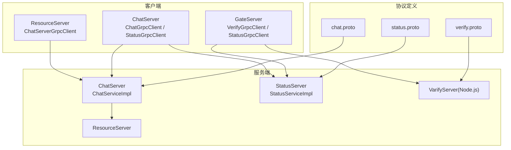
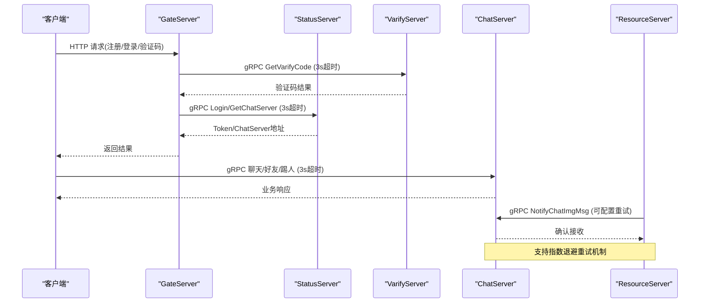
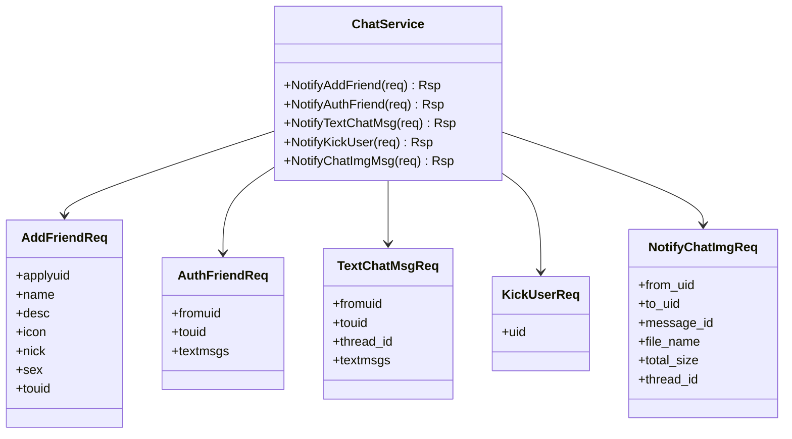
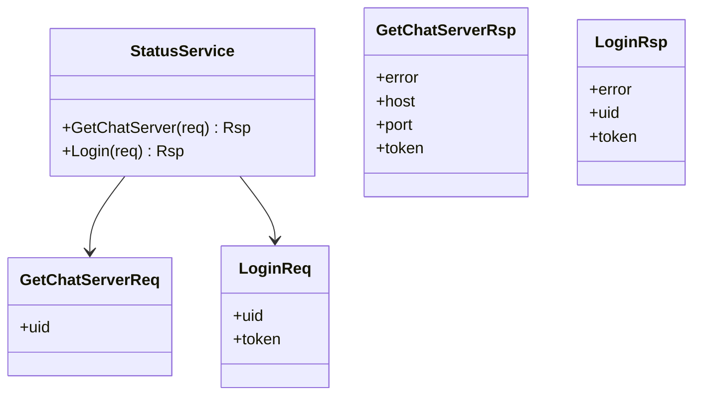
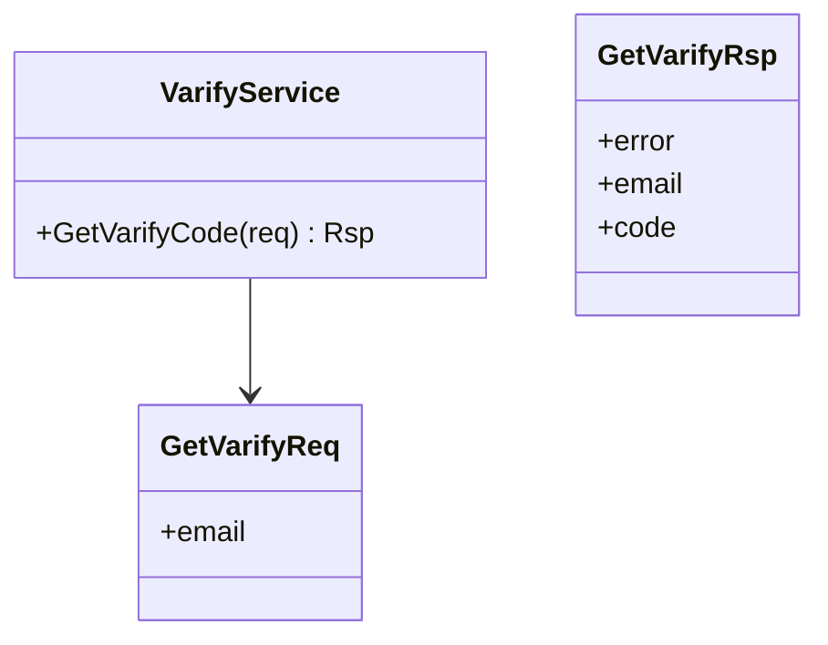
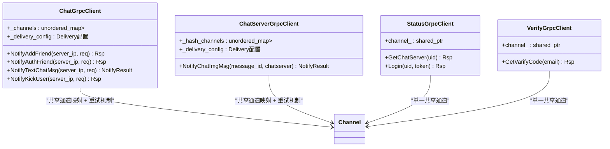
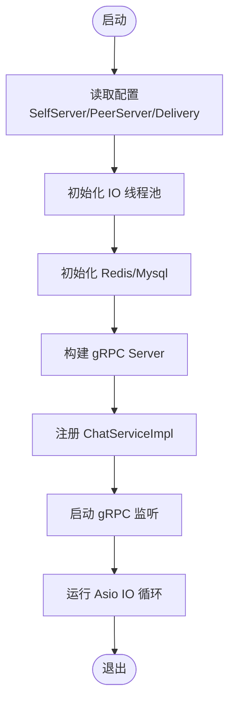
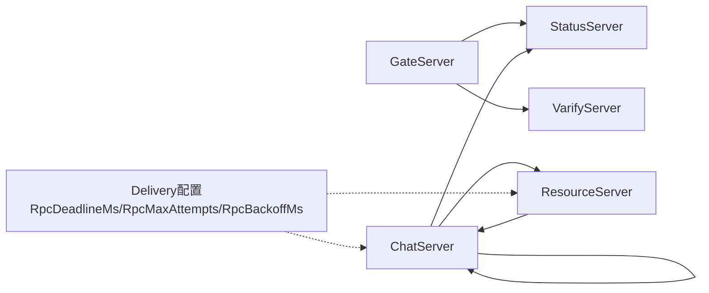

# 服务间通信机制

<cite>
**本文引用的文件**
- [chat.proto](file://proto/chat_service/chat.proto)
- [status.proto](file://proto/status_service/status.proto)
- [verify.proto](file://proto/verify_service/verify.proto)
- [ChatGrpcClient.h](file://server/ChatServer/include/ChatGrpcClient.h)
- [ChatGrpcClient.cpp](file://server/ChatServer/src/ChatGrpcClient.cpp)
- [StatusGrpcClient.h（ChatServer）](file://server/ChatServer/include/StatusGrpcClient.h)
- [StatusGrpcClient.cpp（ChatServer）](file://server/ChatServer/src/StatusGrpcClient.cpp)
- [VerifyGrpcClient.h](file://server/GateServer/include/VerifyGrpcClient.h)
- [VerifyGrpcClient.cpp](file://server/GateServer/src/VerifyGrpcClient.cpp)
- [StatusGrpcClient.h（GateServer）](file://server/GateServer/include/StatusGrpcClient.h)
- [StatusGrpcClient.cpp（GateServer）](file://server/GateServer/src/StatusGrpcClient.cpp)
- [ChatServiceImpl.h](file://server/ChatServer/include/ChatServiceImpl.h)
- [StatusServiceImpl.h](file://server/StatusServer/include/StatusServiceImpl.h)
- [ChatServer.cpp](file://server/ChatServer/src/ChatServer.cpp)
- [GateServer.cpp](file://server/GateServer/src/GateServer.cpp)
- [const.h](file://server/ChatServer/include/const.h)
- [config.ini（GateServer）](file://server/GateServer/config/config.ini)
- [chatserver1.ini（ChatServer）](file://server/ChatServer/config/chatserver1.ini)
- [ChatServerGrpcClient.h](file://server/ResourceServer/include/ChatServerGrpcClient.h)
- [ChatServerGrpcClient.cpp](file://server/ResourceServer/src/ChatServerGrpcClient.cpp)
- [config.ini（ResourceServer）](file://server/ResourceServer/config/config.ini)
</cite>

## 更新摘要
**所做更改**
- 新增了可配置的跨服务交付重试机制，包括超时控制、最大重试次数和退避策略
- 详细说明了ChatServer和ResourceServer的gRPC客户端重试实现
- 更新了Delivery配置部分的详细说明
- 增强了可靠性与故障恢复章节的内容
- 修正了架构图以反映新的重试机制

## 目录
1. [引言](#引言)
2. [项目结构](#项目结构)
3. [核心组件](#核心组件)
4. [架构总览](#架构总览)
5. [详细组件分析](#详细组件分析)
6. [依赖关系分析](#依赖关系分析)
7. [性能与可靠性](#性能与可靠性)
8. [安全与认证](#安全与认证)
9. [监控与可观测性](#监控与可观测性)
10. [故障排查指南](#故障排查指南)
11. [结论](#结论)

## 引言
本技术文档围绕 LLFCChat 微服务间的 gRPC 通信机制展开，系统梳理协议定义、消息格式、服务接口设计、调用关系与数据流转；并基于现有代码实现，总结服务发现、负载均衡、故障转移、超时重试、熔断降级、异步通知、事件驱动等关键能力。同时给出监控、链路追踪与性能分析建议，以及常见问题定位与解决方案，帮助读者快速理解与扩展该系统的通信层。

**更新** 当前架构已实现可配置的跨服务交付重试机制，通过统一的Delivery配置管理超时控制、最大重试次数和指数退避策略，显著提升了系统的可靠性和容错能力。

## 项目结构
LLFCChat 采用多服务拆分：GateServer（HTTP 网关）、ChatServer（聊天业务 gRPC 服务）、StatusServer（状态与路由服务）、ResourceServer（资源服务）、VarifyServer（验证码 Node.js 服务）。gRPC 协议定义位于 proto 目录，各服务通过独立的 C++ 客户端封装访问远端 gRPC 服务，并使用配置中心管理地址与端口。

图表来源
- [chat.proto:1-105](file://proto/chat_service/chat.proto#L1-L105)
- [status.proto:1-32](file://proto/status_service/status.proto#L1-L32)
- [verify.proto:1-19](file://proto/verify_service/verify.proto#L1-L19)
- [ChatServiceImpl.h:1-55](file://server/ChatServer/include/ChatServiceImpl.h#L1-L55)
- [StatusServiceImpl.h:1-52](file://server/StatusServer/include/StatusServiceImpl.h#L1-L52)
- [VerifyGrpcClient.h:1-45](file://server/GateServer/include/VerifyGrpcClient.h#L1-L45)
- [StatusGrpcClient.h（GateServer）:1-36](file://server/GateServer/include/StatusGrpcClient.h#L1-L36)
- [ChatGrpcClient.h:1-119](file://server/ChatServer/include/ChatGrpcClient.h#L1-L119)
- [StatusGrpcClient.h（ChatServer）:1-59](file://server/ChatServer/include/StatusGrpcClient.h#L1-L59)
- [ChatServerGrpcClient.h:1-55](file://server/ResourceServer/include/ChatServerGrpcClient.h#L1-L55)

章节来源
- [ChatServer.cpp:1-81](file://server/ChatServer/src/ChatServer.cpp#L1-L81)
- [GateServer.cpp:1-160](file://server/GateServer/src/GateServer.cpp#L1-L160)
- [config.ini（GateServer）:1-25](file://server/GateServer/config/config.ini#L1-L25)
- [chatserver1.ini（ChatServer）:1-40](file://server/ChatServer/config/chatserver1.ini#L1-L40)

## 核心组件
- gRPC 协议与服务
  - ChatService：好友申请、好友认证、文本聊天、踢人、图片消息通知等。
  - StatusService：获取 ChatServer 路由信息、登录校验。
  - VarifyService：发送验证码。
- **更新** 可配置的gRPC客户端架构
  - ChatGrpcClient：使用共享Channel映射管理多个目标节点的gRPC通道，支持可配置的重试机制和指数退避。
  - ChatServerGrpcClient（ResourceServer）：集成类似的可靠通知机制，支持图片消息的可靠投递。
  - StatusGrpcClient（ChatServer/GateServer）：使用单个共享Channel连接到StatusServer。
  - VerifyGrpcClient：使用单个共享Channel连接到VarifyServer。
- 服务端实现
  - ChatServiceImpl：实现 ChatService 接口，转发到内部逻辑系统。
  - StatusServiceImpl：维护 ChatServer 注册表与 Token 映射，提供路由与登录。
- 配置与常量
  - const.h：错误码、消息 ID、分布式锁相关常量。
  - config.ini：各服务监听端口、依赖服务地址、Delivery重试配置。

**更新** 所有gRPC客户端现在都支持可配置的Delivery重试机制，通过统一的配置项管理超时、重试次数和退避策略，确保跨服务调用的可靠性。

章节来源
- [chat.proto:1-105](file://proto/chat_service/chat.proto#L1-L105)
- [status.proto:1-32](file://proto/status_service/status.proto#L1-L32)
- [verify.proto:1-19](file://proto/verify_service/verify.proto#L1-L19)
- [ChatGrpcClient.h:1-119](file://server/ChatServer/include/ChatGrpcClient.h#L1-L119)
- [ChatServerGrpcClient.h:1-55](file://server/ResourceServer/include/ChatServerGrpcClient.h#L1-L55)
- [StatusGrpcClient.h（ChatServer）:1-59](file://server/ChatServer/include/StatusGrpcClient.h#L1-L59)
- [VerifyGrpcClient.h:1-45](file://server/GateServer/include/VerifyGrpcClient.h#L1-L45)
- [StatusGrpcClient.h（GateServer）:1-36](file://server/GateServer/include/StatusGrpcClient.h#L1-L36)
- [ChatServiceImpl.h:1-55](file://server/ChatServer/include/ChatServiceImpl.h#L1-L55)
- [StatusServiceImpl.h:1-52](file://server/StatusServer/include/StatusServiceImpl.h#L1-L52)
- [const.h:1-104](file://server/ChatServer/include/const.h#L1-L104)
- [config.ini（GateServer）:1-25](file://server/GateServer/config/config.ini#L1-L25)
- [chatserver1.ini（ChatServer）:1-40](file://server/ChatServer/config/chatserver1.ini#L1-L40)

## 架构总览
整体通信流程如下：
- GateServer 作为 HTTP 入口，负责用户注册、登录、验证码等流程，并通过 gRPC 调用 StatusServer 和 VarifyServer。
- ChatServer 暴露 ChatService，处理聊天、好友关系、踢人等业务，并可被其他 ChatServer 实例或 ResourceServer 调用。
- StatusServer 维护 ChatServer 注册信息与 Token，为客户端提供路由与鉴权。
- ResourceServer 负责文件与图片资源，通过 gRPC 通知 ChatServer 图片消息就绪。

图表来源
- [GateServer.cpp:1-160](file://server/GateServer/src/GateServer.cpp#L1-L160)
- [ChatServer.cpp:1-81](file://server/ChatServer/src/ChatServer.cpp#L1-L81)
- [status.proto:1-32](file://proto/status_service/status.proto#L1-L32)
- [verify.proto:1-19](file://proto/verify_service/verify.proto#L1-L19)
- [chat.proto:1-105](file://proto/chat_service/chat.proto#L1-L105)

## 详细组件分析

### ChatService 协议与消息
- 服务方法
  - NotifyAddFriend：好友申请通知
  - NotifyAuthFriend：好友认证通知
  - NotifyTextChatMsg：文本聊天消息推送
  - NotifyKickUser：踢人通知
  - NotifyChatImgMsg：图片消息通知（由 ResourceServer 调用）
- 消息体
  - AddFriendReq/Rsp、AuthFriendReq/Rsp、TextChatData、TextChatMsgReq/Rsp、KickUserReq/Rsp、NotifyChatImgReq/Rsp

图表来源
- [chat.proto:1-105](file://proto/chat_service/chat.proto#L1-L105)

章节来源
- [chat.proto:1-105](file://proto/chat_service/chat.proto#L1-L105)

### StatusService 协议与消息
- 服务方法
  - GetChatServer：根据 uid 获取 ChatServer 地址与 token
  - Login：登录校验，返回 token
- 消息体
  - GetChatServerReq/Rsp、LoginReq/Rsp

图表来源
- [status.proto:1-32](file://proto/status_service/status.proto#L1-L32)

章节来源
- [status.proto:1-32](file://proto/status_service/status.proto#L1-L32)

### VarifyService 协议与消息
- 服务方法
  - GetVarifyCode：发送验证码
- 消息体
  - GetVarifyReq/Rsp

图表来源
- [verify.proto:1-19](file://proto/verify_service/verify.proto#L1-L19)

章节来源
- [verify.proto:1-19](file://proto/verify_service/verify.proto#L1-L19)

### **更新** 可配置的gRPC客户端架构与重试机制
- **ChatGrpcClient**
  - 使用`unordered_map<std::string, std::shared_ptr<Channel>> _channels`管理多个目标节点的共享gRPC通道
  - 启动时从配置文件读取PeerServer列表，为每个节点创建共享Channel
  - 对外暴露 NotifyAddFriend、NotifyAuthFriend、NotifyTextChatMsg、NotifyKickUser 等方法
  - **新增** 可配置的重试机制：支持RpcDeadlineMs、RpcMaxAttempts、RpcBackoffMs配置
  - 每次尝试创建新的ClientContext，设置固定deadline，支持指数退避策略
  - 只对特定错误码（UNAVAILABLE、DEADLINE_EXCEEDED、RESOURCE_EXHAUSTED、SERVER_BUSY）进行重试
- **ChatServerGrpcClient（ResourceServer）**
  - 使用`unordered_map<std::string, std::shared_ptr<Channel>> _hash_channels`管理ChatServer连接
  - 暴露 NotifyChatImgMsg 方法，支持图片消息的可靠通知
  - **新增** 相同的重试机制：支持配置化的超时、重试次数和退避策略
  - 对应用层错误码（RECIPIENT_OFFLINE、SERVER_BUSY）进行智能处理
- **StatusGrpcClient（ChatServer/GateServer）**
  - 使用单个`std::shared_ptr<Channel> channel_`连接到StatusServer
  - 暴露 GetChatServer、Login 方法
  - 所有调用都包含3秒超时控制
- **VerifyGrpcClient**
  - 使用单个`std::shared_ptr<Channel> channel_`连接到VarifyServer
  - 暴露 GetVarifyCode 方法，失败时设置统一错误码
  - 包含3秒超时控制

**更新** 架构实现了完整的可配置重试机制，通过统一的Delivery配置管理所有gRPC调用的超时、重试和退避策略，确保跨服务调用的可靠性。

图表来源
- [ChatGrpcClient.h:1-119](file://server/ChatServer/include/ChatGrpcClient.h#L1-L119)
- [ChatGrpcClient.cpp:1-242](file://server/ChatServer/src/ChatGrpcClient.cpp#L1-L242)
- [ChatServerGrpcClient.h:1-55](file://server/ResourceServer/include/ChatServerGrpcClient.h#L1-L55)
- [ChatServerGrpcClient.cpp:1-141](file://server/ResourceServer/src/ChatServerGrpcClient.cpp#L1-L141)
- [StatusGrpcClient.h（ChatServer）:1-59](file://server/ChatServer/include/StatusGrpcClient.h#L1-L59)
- [StatusGrpcClient.h（GateServer）:1-36](file://server/GateServer/include/StatusGrpcClient.h#L1-L36)
- [VerifyGrpcClient.h:1-45](file://server/GateServer/include/VerifyGrpcClient.h#L1-L45)

章节来源
- [ChatGrpcClient.h:1-119](file://server/ChatServer/include/ChatGrpcClient.h#L1-L119)
- [ChatGrpcClient.cpp:1-242](file://server/ChatServer/src/ChatGrpcClient.cpp#L1-L242)
- [ChatServerGrpcClient.h:1-55](file://server/ResourceServer/include/ChatServerGrpcClient.h#L1-L55)
- [ChatServerGrpcClient.cpp:1-141](file://server/ResourceServer/src/ChatServerGrpcClient.cpp#L1-L141)
- [StatusGrpcClient.h（ChatServer）:1-59](file://server/ChatServer/include/StatusGrpcClient.h#L1-L59)
- [StatusGrpcClient.h（GateServer）:1-36](file://server/GateServer/include/StatusGrpcClient.h#L1-L36)
- [VerifyGrpcClient.h:1-45](file://server/GateServer/include/VerifyGrpcClient.h#L1-L45)

### 服务端实现与启动流程
- ChatServiceImpl
  - 实现 ChatService 接口，将请求转发至内部逻辑系统（如 CServer、LogicSystem）。
  - 支持图片消息通知回调。
- StatusServiceImpl
  - 维护 ChatServer 注册表（主机、端口、名称、连接数），提供路由选择与登录校验。
- 启动流程
  - ChatServer：初始化 AsioIOServicePool、RedisMgr、CServer、gRPC ServerBuilder，注册服务并启动。
  - GateServer：初始化 Redis/Mysql、AsioIOServicePool、CServer，启动 HTTP 服务。

图表来源
- [ChatServer.cpp:1-81](file://server/ChatServer/src/ChatServer.cpp#L1-L81)
- [ChatServiceImpl.h:1-55](file://server/ChatServer/include/ChatServiceImpl.h#L1-L55)
- [StatusServiceImpl.h:1-52](file://server/StatusServer/include/StatusServiceImpl.h#L1-L52)

章节来源
- [ChatServer.cpp:1-81](file://server/ChatServer/src/ChatServer.cpp#L1-L81)
- [ChatServiceImpl.h:1-55](file://server/ChatServer/include/ChatServiceImpl.h#L1-L55)
- [StatusServiceImpl.h:1-52](file://server/StatusServer/include/StatusServiceImpl.h#L1-L52)

### 配置与常量
- 配置项
  - GateServer：HTTP 端口、VarifyServer/StatusServer 地址、Mysql/Redis 连接、ResourceServer 地址。
  - ChatServer：SelfServer 名称/Host/Port/RPCPort、PeerServer 列表、数据库与 Redis。
  - **新增** Delivery配置：RpcDeadlineMs（默认3000ms）、RpcMaxAttempts（默认3次）、RpcBackoffMs（默认100ms）。
- 常量
  - ErrorCodes：统一错误码（如 RPCFailed、TokenInvalid、SERVER_BUSY、RECIPIENT_OFFLINE 等）。
  - MSG_IDS：自定义 TCP 消息类型 ID（用于内部消息路由）。
  - 分布式锁前缀与超时参数。

**更新** Delivery配置部分包含了完整的重试机制参数，支持灵活的超时控制和退避策略配置。

章节来源
- [config.ini（GateServer）:1-25](file://server/GateServer/config/config.ini#L1-L25)
- [chatserver1.ini（ChatServer）:1-40](file://server/ChatServer/config/chatserver1.ini#L1-L40)
- [config.ini（ResourceServer）:1-34](file://server/ResourceServer/config/config.ini#L1-L34)
- [const.h:1-104](file://server/ChatServer/include/const.h#L1-L104)

## 依赖关系分析
- GateServer 依赖 StatusServer（路由/登录）与 VarifyServer（验证码）。
- ChatServer 依赖 StatusServer（登录/路由）与 ResourceServer（图片通知）。
- **更新** 各服务通过共享gRPC通道复用连接，降低握手开销和资源消耗。
- **更新** Retry机制通过统一的Delivery配置管理，确保跨服务调用的可靠性。
- 配置集中管理，便于多实例部署与动态切换。

图表来源
- [GateServer.cpp:1-160](file://server/GateServer/src/GateServer.cpp#L1-L160)
- [ChatServer.cpp:1-81](file://server/ChatServer/src/ChatServer.cpp#L1-L81)
- [config.ini（GateServer）:1-25](file://server/GateServer/config/config.ini#L1-L25)
- [chatserver1.ini（ChatServer）:1-40](file://server/ChatServer/config/chatserver1.ini#L1-L40)
- [config.ini（ResourceServer）:1-34](file://server/ResourceServer/config/config.ini#L1-L34)

章节来源
- [GateServer.cpp:1-160](file://server/GateServer/src/GateServer.cpp#L1-L160)
- [ChatServer.cpp:1-81](file://server/ChatServer/src/ChatServer.cpp#L1-L81)
- [config.ini（GateServer）:1-25](file://server/GateServer/config/config.ini#L1-L25)
- [chatserver1.ini（ChatServer）:1-40](file://server/ChatServer/config/chatserver1.ini#L1-L40)
- [config.ini（ResourceServer）:1-34](file://server/ResourceServer/config/config.ini#L1-L34)

## 性能与可靠性
- **更新** 可配置的跨服务交付重试机制
  - 所有gRPC客户端都支持统一的Delivery配置，包括RpcDeadlineMs、RpcMaxAttempts、RpcBackoffMs
  - 支持指数退避策略：第n次重试等待时间为backoff_ms × 2^(n-1)，上限保护防止溢出
  - 智能错误分类：仅对网络错误（UNAVAILABLE、DEADLINE_EXCEEDED、RESOURCE_EXHAUSTED）和应用层繁忙（SERVER_BUSY）进行重试
  - 立即停止条件：未知服务器、参数错误、接收方离线（RECIPIENT_OFFLINE）等情况不重试
- **更新** 超时控制机制
  - 所有gRPC调用都设置了可配置的超时时间（默认3秒）
  - 每次重试都创建新的ClientContext，确保超时重置
  - 防止调用阻塞导致的资源泄漏和级联故障
- **更新** 错误处理
  - 所有RPC调用失败时返回统一的RPCFailed错误码
  - 客户端自动处理连接异常和服务不可用情况
  - NotifyResult结构体同时携带gRPC状态码和应用层错误码
- **更新** 负载均衡
  - StatusServer 返回单一 ChatServer 地址，属于简单路由；可扩展为轮询/加权/一致性哈希。
- **更新** 异步与事件驱动
  - 图片消息通过 gRPC 通知（NotifyChatImgMsg）实现异步下载；聊天消息推送采用同步 RPC 通知。
  - ResourceServer的图片通知支持可靠的跨服务交付，不影响离线拉取兜底。
- **更新** 监控与可观测性
  - 建议接入 gRPC 指标（延迟、QPS、错误率）、日志与链路追踪（OpenTelemetry）。
  - 记录重试次数、退避时间和最终成功状态。

**更新** 新架构通过可配置的Delivery重试机制，显著提升了系统的可靠性和容错能力，确保了跨服务调用的稳定性。

[本节为通用指导，不直接分析具体文件]

## 安全与认证
- 传输加密
  - 当前使用 InsecureChannelCredentials/InsecureServerCredentials，未启用 TLS。生产环境应启用 mTLS。
- 身份认证
  - StatusServer 的 Login 返回 token，后续请求可携带 token 进行鉴权；需在服务端实现拦截器验证。
- 权限控制
  - 建议在 gRPC 拦截器中校验 token 与权限，防止越权访问。
- 密钥管理
  - 证书与密钥应通过安全渠道分发，避免硬编码。

章节来源
- [ChatGrpcClient.h:1-119](file://server/ChatServer/include/ChatGrpcClient.h#L1-L119)
- [StatusGrpcClient.h（ChatServer）:1-59](file://server/ChatServer/include/StatusGrpcClient.h#L1-L59)
- [VerifyGrpcClient.h:1-45](file://server/GateServer/include/VerifyGrpcClient.h#L1-L45)
- [StatusGrpcClient.h（GateServer）:1-36](file://server/GateServer/include/StatusGrpcClient.h#L1-L36)
- [ChatServer.cpp:1-81](file://server/ChatServer/src/ChatServer.cpp#L1-L81)

## 监控与可观测性
- 指标采集
  - 统计 gRPC 调用次数、延迟分布、错误码分布（ErrorCodes）。
  - **新增** 记录重试次数、退避时间和最终成功状态。
- 链路追踪
  - 注入 traceId，跨服务传递，便于端到端定位问题。
- 日志规范
  - 记录关键路径日志（登录、路由、消息推送、图片通知），包含 uid、thread_id、msg_id。
  - **新增** 记录重试决策、退避策略和最终结果。
- 告警规则
  - 针对高错误率、慢调用、连接池耗尽、下游不可用等设置阈值告警。
  - **新增** 针对频繁重试和退避的告警规则。

[本节为通用指导，不直接分析具体文件]

## 故障排查指南
- **更新** 常见问题
  - 连接失败：检查配置中的 Host/Port、防火墙、服务是否启动。
  - **新增** 重试相关问题：检查Delivery配置是否正确，重试次数是否合理，退避时间是否合适。
  - 超时问题：所有gRPC调用都有可配置的超时限制，超时会导致RPCFailed错误码。
  - 认证失败：Token 无效或过期，检查 StatusServer 登录流程与存储。
  - 路由错误：StatusServer 返回的地址不正确，检查注册与心跳。
  - 图片下载失败：NotifyChatImgMsg 未触发或 ResourceServer 不可用。
  - **新增** 通道复用问题：检查共享Channel是否正确初始化和管理。
  - **新增** 指数退避问题：检查退避计算是否正确，是否存在溢出保护。
- **更新** 定位步骤
  - 查看服务日志与错误码（ErrorCodes）。
  - 检查共享Channel状态和连接数量。
  - 验证配置项与网络连通性。
  - 使用抓包工具分析 gRPC 请求/响应。
  - **新增** 检查Delivery配置和重试日志。
  - **新增** 分析重试决策和退避策略。
- **更新** 修复建议
  - 调整超时时间以适应不同场景需求。
  - 优化重试次数和退避策略配置。
  - 增加熔断机制和降级保护。
  - 完善健康检查与自动恢复。
  - 加强监控与告警。

章节来源
- [const.h:1-104](file://server/ChatServer/include/const.h#L1-L104)
- [VerifyGrpcClient.h:1-45](file://server/GateServer/include/VerifyGrpcClient.h#L1-L45)
- [config.ini（GateServer）:1-25](file://server/GateServer/config/config.ini#L1-L25)
- [chatserver1.ini（ChatServer）:1-40](file://server/ChatServer/config/chatserver1.ini#L1-L40)
- [config.ini（ResourceServer）:1-34](file://server/ResourceServer/config/config.ini#L1-L34)

## 结论
LLFCChat 的微服务通信以 gRPC 为核心，通过**可配置的跨服务交付重试机制**实现了高效、可靠的服务间调用。**更新后的架构**具有以下优势：

- **可靠性提升**：实现了完整的Delivery重试机制，支持可配置的超时控制、最大重试次数和指数退避策略
- **智能错误处理**：区分网络错误、应用层错误和参数错误，针对不同情况采取不同的重试策略
- **性能优化**：通过Channel复用减少TCP连接建立开销，合理的退避策略避免雪崩效应
- **易于配置**：统一的Delivery配置管理所有重试相关参数，便于调优和维护
- **可扩展性**：为未来的熔断降级、负载均衡和更丰富的监控指标奠定了良好基础

当前实现已具备基础的跨服务可靠通信能力，但在安全、熔断降级、负载均衡与可观测性方面仍有改进空间。建议在生产环境中逐步补齐这些能力，以提升系统的稳定性与可维护性。

**更新** 新的可配置重试机制为系统的可靠性提供了坚实保障，能够有效应对网络波动、服务临时不可用等异常情况，确保跨服务调用的最终一致性。