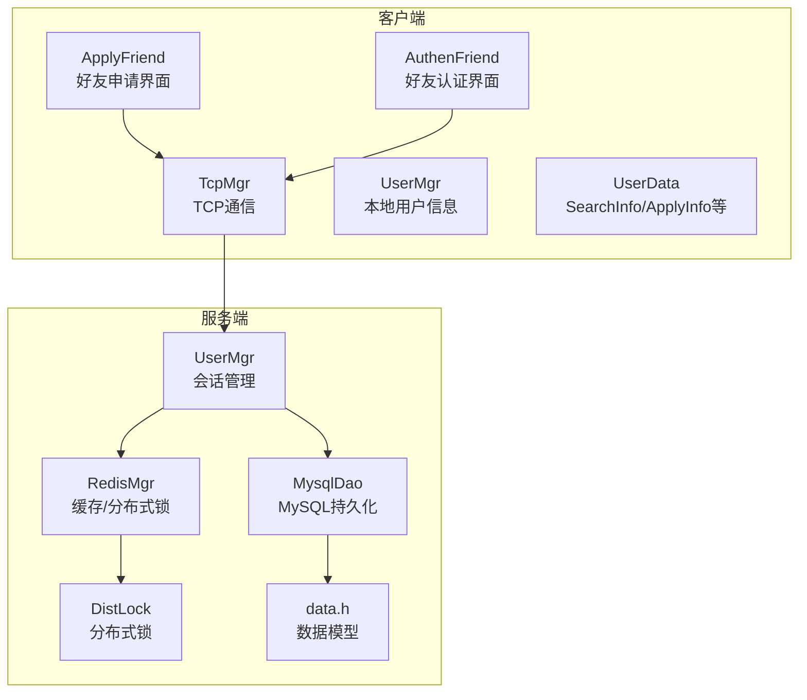
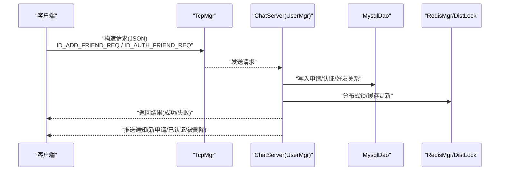
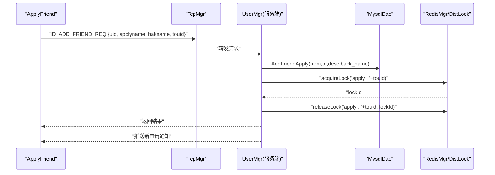
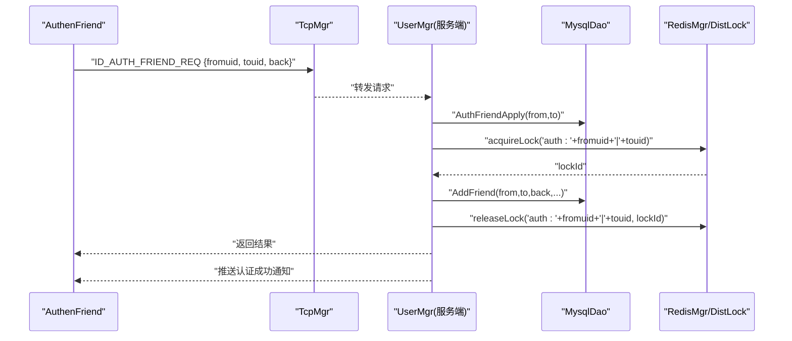
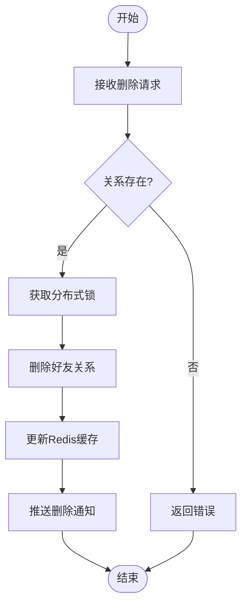
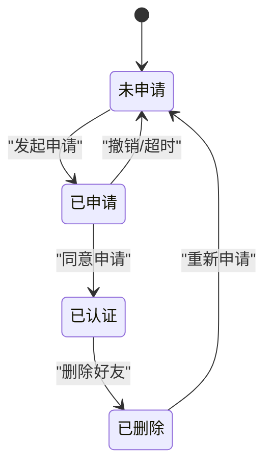
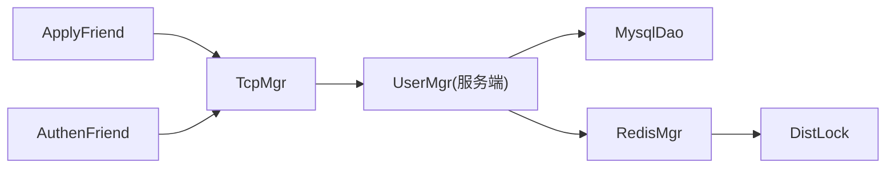

# 好友管理数据流

<cite>
**本文引用的文件**   
- [applyfriend.h](file://client/llfcchat/include/applyfriend.h)
- [applyfriend.cpp](file://client/llfcchat/src/applyfriend.cpp)
- [authenfriend.h](file://client/llfcchat/include/authenfriend.h)
- [authenfriend.cpp](file://client/llfcchat/src/authenfriend.cpp)
- [userdata.h](file://client/llfcchat/include/userdata.h)
- [tcpmgr.h](file://client/llfcchat/include/tcpmgr.h)
- [usermgr.h](file://client/llfcchat/include/usermgr.h)
- [MysqlDao.h](file://server/ChatServer/include/MysqlDao.h)
- [RedisMgr.h](file://server/ChatServer/include/RedisMgr.h)
- [DistLock.h](file://server/ChatServer/include/DistLock.h)
- [UserMgr.h](file://server/ChatServer/include/UserMgr.h)
- [UserMgr.cpp](file://server/ChatServer/include/UserMgr.cpp)
- [data.h](file://server/ChatServer/include/data.h)
</cite>

## 目录
1. [简介](#简介)
2. [项目结构](#项目结构)
3. [核心组件](#核心组件)
4. [架构总览](#架构总览)
5. [详细组件分析](#详细组件分析)
6. [依赖关系分析](#依赖关系分析)
7. [性能考虑](#性能考虑)
8. [故障排查指南](#故障排查指南)
9. [结论](#结论)
10. [附录](#附录)

## 简介
本文件面向LLFCChat系统的好友管理功能，聚焦“好友申请、认证、删除”的完整数据流与状态流转。文档从客户端请求处理、服务端业务逻辑、分布式锁与缓存一致性、消息通知与状态同步等维度进行系统化说明，并给出时序图、状态机图与流程图，帮助读者快速理解并发访问控制、冲突解决策略以及好友列表缓存更新机制。

## 项目结构
- 客户端（Qt/C++）
  - 好友申请界面：ApplyFriend（含标签选择、输入校验、发送请求）
  - 好友认证界面：AuthenFriend（接收待认证申请，填写备注后确认）
  - 网络层：TcpMgr（封装TCP发送/接收）、UserMgr（本地用户信息）
  - 数据结构：SearchInfo、ApplyInfo、AddFriendApply、UserInfo等
- 服务端（C++ ChatServer）
  - 会话与在线用户：UserMgr（uid->session映射）
  - 持久化：MysqlDao（好友申请、认证、好友关系、聊天会话与消息）
  - 缓存与分布式锁：RedisMgr（连接池、原子操作、分布式锁接口）、DistLock（基于Redis的加解锁）
  - 数据模型：data.h中的UserInfo、ApplyInfo、ChatMessage等

**图表来源** 
- [applyfriend.cpp](file://client/llfcchat/src/applyfriend.cpp)
- [authenfriend.cpp](file://client/llfcchat/src/authenfriend.cpp)
- [UserMgr.h](file://server/ChatServer/include/UserMgr.h)
- [MysqlDao.h](file://server/ChatServer/include/MysqlDao.h)
- [RedisMgr.h](file://server/ChatServer/include/RedisMgr.h)
- [DistLock.h](file://server/ChatServer/include/DistLock.h)
- [data.h](file://server/ChatServer/include/data.h)

**章节来源**
- [applyfriend.h](file://client/llfcchat/include/applyfriend.h)
- [applyfriend.cpp](file://client/llfcchat/src/applyfriend.cpp)
- [authenfriend.h](file://client/llfcchat/include/authenfriend.h)
- [authenfriend.cpp](file://client/llfcchat/src/authenfriend.cpp)
- [userdata.h](file://client/llfcchat/include/userdata.h)
- [UserMgr.h](file://server/ChatServer/include/UserMgr.h)
- [MysqlDao.h](file://server/ChatServer/include/MysqlDao.h)
- [RedisMgr.h](file://server/ChatServer/include/RedisMgr.h)
- [DistLock.h](file://server/ChatServer/include/DistLock.h)
- [data.h](file://server/ChatServer/include/data.h)

## 核心组件
- 客户端界面与交互
  - ApplyFriend：负责好友申请界面的标签选择、输入校验、组装请求并发送
  - AuthenFriend：负责展示待认证申请、填写备注、提交认证结果
- 客户端网络与数据
  - TcpMgr：统一发送/接收消息通道，触发ID_ADD_FRIEND_REQ、ID_AUTH_FRIEND_REQ等请求
  - UserMgr：提供当前登录用户UID等信息
  - UserData：定义SearchInfo、ApplyInfo、AddFriendApply、UserInfo等数据结构
- 服务端会话与持久化
  - UserMgr：维护uid到CSession的映射，用于推送消息
  - MysqlDao：实现好友申请写入、认证通过、建立好友关系、查询好友列表等
  - RedisMgr：提供缓存读写、队列、哈希、分布式锁能力
  - DistLock：封装基于Redis的分布式锁获取与释放

**章节来源**
- [applyfriend.cpp](file://client/llfcchat/src/applyfriend.cpp)
- [authenfriend.cpp](file://client/llfcchat/src/authenfriend.cpp)
- [userdata.h](file://client/llfcchat/include/userdata.h)
- [UserMgr.h](file://server/ChatServer/include/UserMgr.h)
- [MysqlDao.h](file://server/ChatServer/include/MysqlDao.h)
- [RedisMgr.h](file://server/ChatServer/include/RedisMgr.h)
- [DistLock.h](file://server/ChatServer/include/DistLock.h)

## 架构总览
整体采用“客户端UI + TCP通信 + 服务端会话/持久化 + Redis缓存/分布式锁”的分层架构。好友申请与认证流程由客户端发起，经TcpMgr发送至服务端；服务端在UserMgr中定位目标会话，使用MysqlDao完成持久化，并通过RedisMgr与DistLock保证并发一致性与冲突解决；最终通过会话推送通知给相关客户端，更新本地缓存与UI。

**图表来源** 
- [applyfriend.cpp](file://client/llfcchat/src/applyfriend.cpp)
- [authenfriend.cpp](file://client/llfcchat/src/authenfriend.cpp)
- [UserMgr.h](file://server/ChatServer/include/UserMgr.h)
- [MysqlDao.h](file://server/ChatServer/include/MysqlDao.h)
- [RedisMgr.h](file://server/ChatServer/include/RedisMgr.h)
- [DistLock.h](file://server/ChatServer/include/DistLock.h)

## 详细组件分析

### 好友申请流程（客户端→服务端→存储→通知）
- 客户端界面
  - ApplyFriend收集申请人信息、备注、标签，组装JSON，调用TcpMgr发送ID_ADD_FRIEND_REQ
- 服务端处理
  - UserMgr根据目标uid查找会话
  - MysqlDao写入好友申请记录（from、to、desc、back_name）
  - RedisMgr更新申请计数或缓存，必要时使用DistLock对同一目标的申请进行串行化
  - 向目标用户推送新申请通知
- 客户端响应
  - 收到成功后刷新申请列表；失败则提示错误

**图表来源** 
- [applyfriend.cpp](file://client/llfcchat/src/applyfriend.cpp)
- [MysqlDao.h](file://server/ChatServer/include/MysqlDao.h)
- [RedisMgr.h](file://server/ChatServer/include/RedisMgr.h)
- [DistLock.h](file://server/ChatServer/include/DistLock.h)

**章节来源**
- [applyfriend.cpp](file://client/llfcchat/src/applyfriend.cpp)
- [MysqlDao.h](file://server/ChatServer/include/MysqlDao.h)
- [RedisMgr.h](file://server/ChatServer/include/RedisMgr.h)
- [DistLock.h](file://server/ChatServer/include/DistLock.h)

### 好友认证流程（接收申请→填写备注→确认）
- 客户端界面
  - AuthenFriend加载待认证申请信息（SetApplyInfo），允许填写备注
  - 点击确认后发送ID_AUTH_FRIEND_REQ（fromuid、touid、back）
- 服务端处理
  - 校验申请是否存在且未过期
  - MysqlDao更新申请状态为已通过，并建立好友关系
  - 使用RedisMgr更新双方好友缓存，必要时加锁避免重复认证
  - 双向推送认证成功通知，触发各自好友列表刷新

**图表来源** 
- [authenfriend.cpp](file://client/llfcchat/src/authenfriend.cpp)
- [MysqlDao.h](file://server/ChatServer/include/MysqlDao.h)
- [RedisMgr.h](file://server/ChatServer/include/RedisMgr.h)
- [DistLock.h](file://server/ChatServer/include/DistLock.h)

**章节来源**
- [authenfriend.cpp](file://client/llfcchat/src/authenfriend.cpp)
- [MysqlDao.h](file://server/ChatServer/include/MysqlDao.h)
- [RedisMgr.h](file://server/ChatServer/include/RedisMgr.h)
- [DistLock.h](file://server/ChatServer/include/DistLock.h)

### 好友删除流程（解绑关系→清理缓存→通知）
- 客户端触发删除请求（ID_DEL_FRIEND_REQ）
- 服务端校验关系存在性，执行删除操作
- 使用分布式锁确保删除操作的原子性
- 更新Redis缓存（移除双方好友条目）
- 双向推送删除通知，客户端刷新好友列表

**图表来源** 
- [MysqlDao.h](file://server/ChatServer/include/MysqlDao.h)
- [RedisMgr.h](file://server/ChatServer/include/RedisMgr.h)
- [DistLock.h](file://server/ChatServer/include/DistLock.h)

**章节来源**
- [MysqlDao.h](file://server/ChatServer/include/MysqlDao.h)
- [RedisMgr.h](file://server/ChatServer/include/RedisMgr.h)
- [DistLock.h](file://server/ChatServer/include/DistLock.h)

### 好友关系状态机
- 状态定义
  - 未申请：双方无关联
  - 已申请：A向B发出申请，等待B处理
  - 已认证：B同意申请，双方成为好友
  - 已删除：任一方删除好友关系
- 转换规则
  - 未申请 → 已申请：A发起申请
  - 已申请 → 已认证：B同意申请
  - 已申请 → 未申请：A撤销申请或超时失效
  - 已认证 → 已删除：任一方删除好友
  - 已删除 → 未申请：重新发起申请

**图表来源** 
- [MysqlDao.h](file://server/ChatServer/include/MysqlDao.h)
- [data.h](file://server/ChatServer/include/data.h)

**章节来源**
- [MysqlDao.h](file://server/ChatServer/include/MysqlDao.h)
- [data.h](file://server/ChatServer/include/data.h)

### 分布式好友关系管理与一致性
- 分布式锁
  - 针对同一目标的申请、认证、删除操作，使用DistLock.acquireLock与releaseLock保证串行化
  - 锁键设计：apply:{touid}、auth:{fromuid}|{touid}、del:{fromuid}|{touid}
- 缓存一致性
  - Redis缓存好友列表、申请计数、在线会话映射
  - 写路径先更新数据库，再更新缓存；读路径优先读缓存，失败回源
- 冲突解决
  - 重复申请：检查申请表是否已有相同记录
  - 重复认证：检查申请状态是否为“已申请”
  - 并发删除：通过分布式锁避免同时删除导致的状态不一致

**章节来源**
- [RedisMgr.h](file://server/ChatServer/include/RedisMgr.h)
- [DistLock.h](file://server/ChatServer/include/DistLock.h)
- [MysqlDao.h](file://server/ChatServer/include/MysqlDao.h)

### 消息通知机制与状态同步
- 通知类型
  - 新申请通知：发送给目标用户
  - 认证成功通知：发送给双方
  - 删除通知：发送给双方
- 推送方式
  - 通过UserMgr查找目标用户的CSession，直接推送消息
- 客户端同步
  - 收到通知后更新本地缓存（好友列表、申请列表）
  - 刷新UI显示

**章节来源**
- [UserMgr.h](file://server/ChatServer/include/UserMgr.h)
- [UserMgr.cpp](file://server/ChatServer/include/UserMgr.cpp)

### 好友搜索算法与关系链维护
- 搜索算法
  - 客户端支持按名称、昵称、描述模糊搜索
  - 服务端可基于索引字段（name、nick、desc）进行分页查询
- 关系链维护
  - 好友关系为双向对称关系，需同时维护双方的好友列表
  - 删除时需同步清理双方关系

**章节来源**
- [userdata.h](file://client/llfcchat/include/userdata.h)
- [MysqlDao.h](file://server/ChatServer/include/MysqlDao.h)

### 隐私保护机制
- 申请可见性：仅目标用户可见自己的申请列表
- 好友可见性：仅好友之间可查看基本信息（头像、昵称等）
- 敏感信息脱敏：不在日志中输出敏感字段

**章节来源**
- [data.h](file://server/ChatServer/include/data.h)

## 依赖关系分析
- 客户端依赖
  - ApplyFriend/AuthenFriend依赖TcpMgr进行网络通信
  - 依赖UserMgr获取当前用户信息
  - 依赖UserData中的数据结构进行数据传递
- 服务端依赖
  - UserMgr依赖CSession进行会话管理
  - MysqlDao依赖MySQL连接池进行持久化
  - RedisMgr依赖hiredis进行缓存操作
  - DistLock依赖Redis实现分布式锁

**图表来源** 
- [applyfriend.cpp](file://client/llfcchat/src/applyfriend.cpp)
- [authenfriend.cpp](file://client/llfcchat/src/authenfriend.cpp)
- [UserMgr.h](file://server/ChatServer/include/UserMgr.h)
- [MysqlDao.h](file://server/ChatServer/include/MysqlDao.h)
- [RedisMgr.h](file://server/ChatServer/include/RedisMgr.h)
- [DistLock.h](file://server/ChatServer/include/DistLock.h)

**章节来源**
- [applyfriend.cpp](file://client/llfcchat/src/applyfriend.cpp)
- [authenfriend.cpp](file://client/llfcchat/src/authenfriend.cpp)
- [UserMgr.h](file://server/ChatServer/include/UserMgr.h)
- [MysqlDao.h](file://server/ChatServer/include/MysqlDao.h)
- [RedisMgr.h](file://server/ChatServer/include/RedisMgr.h)
- [DistLock.h](file://server/ChatServer/include/DistLock.h)

## 性能考虑
- 连接池优化
  - MySQL连接池自动检测健康状态，定期重连
  - Redis连接池PING保活，失败自动重连
- 缓存策略
  - 热点数据（好友列表、申请计数）优先读缓存
  - 写操作先写库再更新缓存，保证一致性
- 并发控制
  - 使用分布式锁避免竞态条件
  - 会话管理使用互斥锁保护uid->session映射

**章节来源**
- [MysqlDao.h](file://server/ChatServer/include/MysqlDao.h)
- [RedisMgr.h](file://server/ChatServer/include/RedisMgr.h)
- [UserMgr.cpp](file://server/ChatServer/include/UserMgr.cpp)

## 故障排查指南
- 常见问题
  - 网络连接失败：检查TcpMgr配置与服务端状态
  - 数据库连接异常：查看MySQL连接池健康状态
  - Redis连接失败：检查认证信息与连接池状态
  - 分布式锁超时：检查锁持有时间与业务耗时
- 调试建议
  - 启用详细日志，记录关键步骤
  - 使用Redis监控工具观察缓存状态
  - 检查数据库事务是否提交成功

**章节来源**
- [MysqlDao.h](file://server/ChatServer/include/MysqlDao.h)
- [RedisMgr.h](file://server/ChatServer/include/RedisMgr.h)
- [UserMgr.cpp](file://server/ChatServer/include/UserMgr.cpp)

## 结论
LLFCChat的好友管理功能通过清晰的客户端-服务端分层架构、完善的分布式锁与缓存机制，实现了高并发下的数据一致性与用户体验。申请、认证、删除流程完整覆盖，通知机制及时可靠，为系统的可扩展性与稳定性奠定了坚实基础。

## 附录
- 数据结构参考
  - SearchInfo：搜索用户信息
  - ApplyInfo：好友申请信息
  - AddFriendApply：添加好友申请详情
  - UserInfo：用户基本信息
  - ChatMessage：聊天消息信息

**章节来源**
- [userdata.h](file://client/llfcchat/include/userdata.h)
- [data.h](file://server/ChatServer/include/data.h)