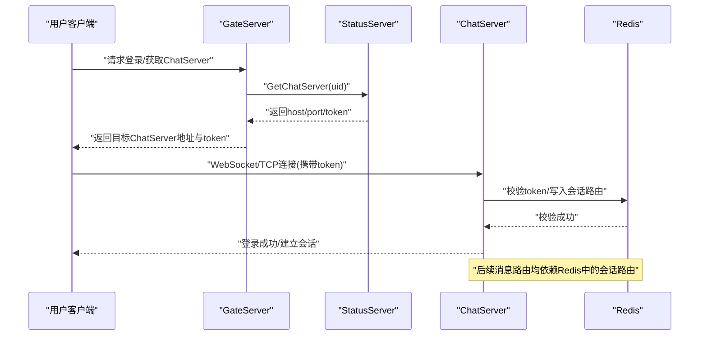
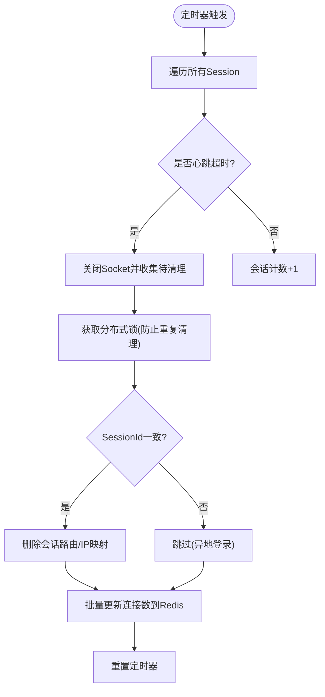
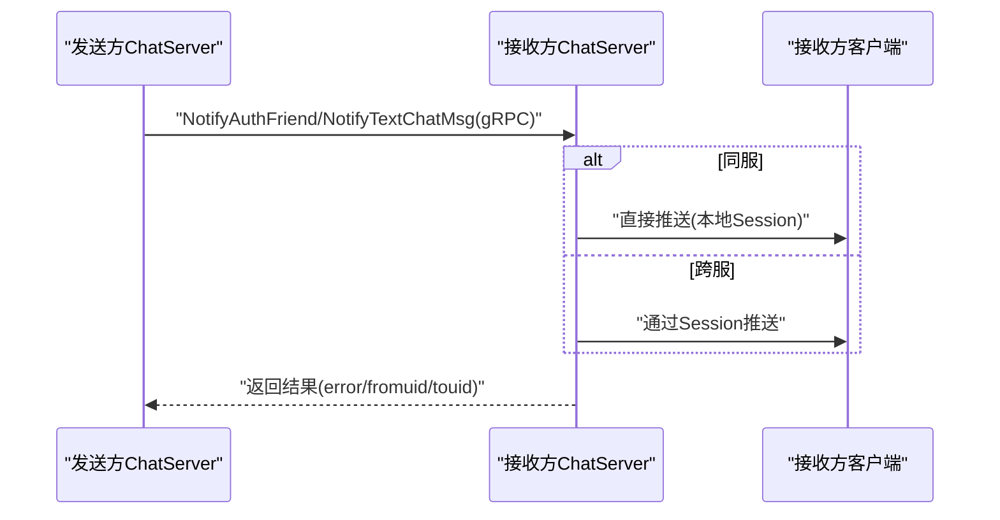
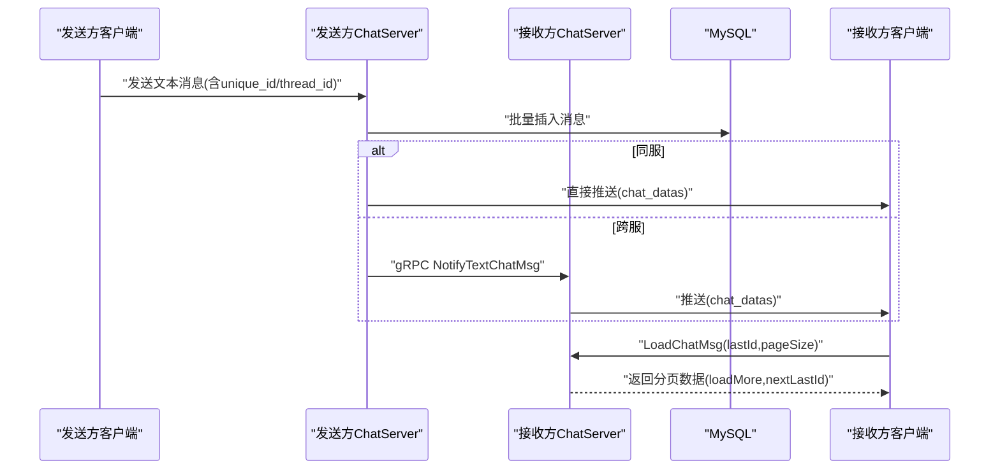
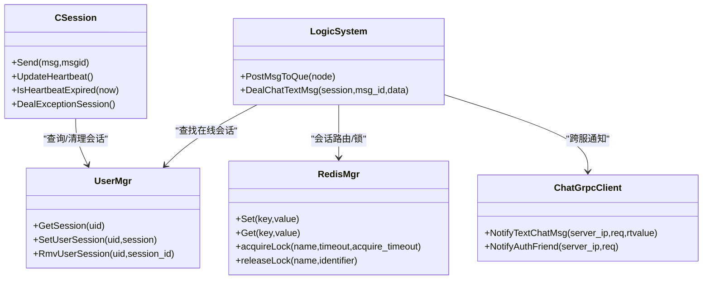

# 实时同步数据流

<cite>
**本文引用的文件**   
- [README.md](file://README.md)
- [chat.proto](file://proto/chat_service/chat.proto)
- [status.proto](file://proto/status_service/status.proto)
- [RedisMgr.h](file://server/ChatServer/include/RedisMgr.h)
- [StatusServiceImpl.h](file://server/StatusServer/include/StatusServiceImpl.h)
- [StatusGrpcClient.h](file://server/GateServer/include/StatusGrpcClient.h)
- [CSession.h](file://server/ChatServer/include/CSession.h)
- [UserMgr.h](file://server/ChatServer/include/UserMgr.h)
- [UserMgr.cpp](file://server/ChatServer/src/UserMgr.cpp)
- [LogicSystem.h](file://server/ChatServer/include/LogicSystem.h)
- [ChatServiceImpl.cpp](file://server/ChatServer/src/ChatServiceImpl.cpp)
- [ChatGrpcClient.cpp](file://server/ChatServer/src/ChatGrpcClient.cpp)
- [GateServer.cpp](file://server/GateServer/src/GateServer.cpp)
- [redis.js](file://server/VarifyServer/redis.js)
- [day35心跳逻辑.md](file://开发文档/day35心跳逻辑.md)
- [day29好友认证和聊天通信.md](file://开发文档/day29-好友认证和聊天通信.md)
- [day37聊天信息存储方案.md](file://开发文档/day37-聊天信息存储方案.md)
- [day38断点续传.md](file://开发文档/day38-断点续传.md)
</cite>

## 目录
1. [引言](#引言)
2. [项目结构](#项目结构)
3. [核心组件](#核心组件)
4. [架构总览](#架构总览)
5. [详细组件分析](#详细组件分析)
6. [依赖关系分析](#依赖关系分析)
7. [性能考量](#性能考量)
8. [故障排查指南](#故障排查指南)
9. [结论](#结论)
10. [附录](#附录)

## 引言
本文件面向LLFCChat系统的“实时同步”能力，围绕用户在线状态、好友状态与聊天记录的跨进程/跨节点同步机制进行系统化设计说明。系统采用：
- gRPC服务作为服务间通信总线（ChatService、StatusService）
- Redis作为分布式缓存与协调中心（会话路由、令牌校验、分布式锁、计数统计）
- TCP长连接（Boost.Asio）承载客户端消息通道，配合心跳检测保障连接活性
- 事件驱动的消息处理管线（LogicSystem）实现增量推送与跨服转发

重点覆盖：
- 状态变更事件传播路径
- 增量同步算法（基于唯一ID与时间戳的幂等合并）
- 冲突检测与合并策略（分布式锁+版本号/唯一ID）
- 分布式一致性、网络分区处理与故障恢复
- 状态缓存策略、批量更新优化与内存管理

## 项目结构
- 客户端：Qt + Boost.Asio，维护TCP长连接，负责UI渲染与本地状态缓存
- GateServer：接入层，提供HTTP/WS入口，鉴权后转发至ChatServer
- ChatServer：业务主服务，维护用户会话、消息路由、跨服gRPC通知
- StatusServer：注册与路由服务，分配ChatServer并签发Token
- VarifyServer：辅助服务（验证码、Redis心跳示例）
- Redis：集中式缓存与协调（会话路由、令牌、分布式锁、计数）

```mermaid
graph TB
Client["客户端(QT/Asio)"] --> Gate["GateServer(接入层)"]
Gate --> Status["StatusServer(路由/鉴权)"]
Gate --> Chat["ChatServer(业务/会话)"]
Chat --> Chat["ChatServer(多实例)"]
Chat --> Redis["Redis(缓存/锁/路由)"]
Chat --> DB["MySQL(持久化)"]
Chat -. gRPC .-> Chat
Chat -. gRPC .-> Resource["ResourceServer(可选)"]
```

图表来源
- [status.proto:1-32](file://proto/status_service/status.proto#L1-L32)
- [chat.proto:1-105](file://proto/chat_service/chat.proto#L1-L105)
- [GateServer.cpp:128-160](file://server/GateServer/src/GateServer.cpp#L128-L160)
- [ChatServiceImpl.cpp:187-221](file://server/ChatServer/src/ChatServiceImpl.cpp#L187-L221)

章节来源
- [README.md:1-112](file://README.md#L1-L112)
- [GateServer.cpp:128-160](file://server/GateServer/src/GateServer.cpp#L128-L160)

## 核心组件
- CSession：封装TCP会话、读写队列、心跳与异常处理，支持离线通知与图片下载通知
- UserMgr：维护uid到session的映射，支持按session_id精确清理
- LogicSystem：消息分发与处理中心，注册各业务回调（登录、搜索、好友申请、聊天文本/图片、线程加载等）
- RedisMgr：连接池、键值/列表/哈希操作、分布式锁、计数统计、过期设置
- StatusServiceImpl/StatusGrpcClient：服务发现与Token发放/校验
- ChatServiceImpl/ChatGrpcClient：跨服gRPC通知（文本消息、图片通知、踢人）

章节来源
- [CSession.h:1-86](file://server/ChatServer/include/CSession.h#L1-L86)
- [UserMgr.h:1-22](file://server/ChatServer/include/UserMgr.h#L1-L22)
- [UserMgr.cpp:1-50](file://server/ChatServer/src/UserMgr.cpp#L1-L50)
- [LogicSystem.h:1-60](file://server/ChatServer/include/LogicSystem.h#L1-L60)
- [RedisMgr.h:1-305](file://server/ChatServer/include/RedisMgr.h#L1-L305)
- [StatusServiceImpl.h:1-52](file://server/StatusServer/include/StatusServiceImpl.h#L1-L52)
- [StatusGrpcClient.h:1-98](file://server/GateServer/include/StatusGrpcClient.h#L1-L98)
- [ChatServiceImpl.cpp:169-221](file://server/ChatServer/src/ChatServiceImpl.cpp#L169-L221)
- [ChatGrpcClient.cpp:90-141](file://server/ChatServer/src/ChatGrpcClient.cpp#L90-L141)

## 架构总览
整体采用“接入层—业务层—状态/路由服务—缓存/存储”的分层架构。实时同步的关键在于：
- 会话路由：通过Redis记录用户当前所在ChatServer及session_id
- Token鉴权：StatusServer签发Token，ChatServer校验后建立会话
- 消息路由：发送方ChatServer根据目标uid查询Redis中的服务器名，同服直推，跨服gRPC通知
- 状态广播：好友申请/认证、踢人、图片下载通知等通过gRPC或本地session推送
- 心跳保活：服务端定时扫描，结合分布式锁清理僵尸会话



图表来源
- [status.proto:1-32](file://proto/status_service/status.proto#L1-L32)
- [StatusServiceImpl.cpp:17-27](file://server/StatusServer/src/StatusServiceImpl.cpp#L17-L27)
- [ChatGrpcClient.cpp:90-103](file://server/ChatServer/src/ChatGrpcClient.cpp#L90-L103)

## 详细组件分析

### 用户在线状态与心跳机制
- Session心跳：CSession维护_last_heartbeat时间戳，每次收到消息即更新；服务端定时器周期性检查是否超时
- 超时处理：若超时则关闭socket，并通过分布式锁清理Redis中的会话路由与IP映射，避免并发清理导致竞态
- 连接数统计：心跳结束后汇总当前会话数量，批量写入Redis用于负载均衡



图表来源
- [CSession.h:46-51](file://server/ChatServer/include/CSession.h#L46-L51)
- [day35心跳逻辑.md:95-146](file://开发文档/day35心跳逻辑.md#L95-L146)
- [day35心跳逻辑.md:644-688](file://开发文档/day35心跳逻辑.md#L644-L688)

章节来源
- [CSession.h:46-51](file://server/ChatServer/include/CSession.h#L46-L51)
- [day35心跳逻辑.md:95-146](file://开发文档/day35心跳逻辑.md#L95-L146)
- [day35心跳逻辑.md:644-688](file://开发文档/day35心跳逻辑.md#L644-L688)

### 好友状态与认证通知
- 好友申请/认证：通过ChatService.NotifyAuthFriend在跨服间传递认证消息；同服直接通过UserMgr查找session推送
- 踢人：ChatService.NotifyKickUser触发目标端下线通知，并清理本地会话



图表来源
- [chat.proto:1-105](file://proto/chat_service/chat.proto#L1-L105)
- [ChatGrpcClient.cpp:107-135](file://server/ChatServer/src/ChatGrpcClient.cpp#L107-L135)
- [ChatServiceImpl.cpp:187-210](file://server/ChatServer/src/ChatServiceImpl.cpp#L187-L210)

章节来源
- [chat.proto:1-105](file://proto/chat_service/chat.proto#L1-L105)
- [ChatGrpcClient.cpp:107-135](file://server/ChatServer/src/ChatGrpcClient.cpp#L107-L135)
- [ChatServiceImpl.cpp:187-210](file://server/ChatServer/src/ChatServiceImpl.cpp#L187-L210)
- [day29好友认证和聊天通信.md:827-895](file://开发文档/day29-好友认证和聊天通信.md#L827-L895)

### 聊天记录实时同步与增量拉取
- 消息入库：文本消息批量插入MySQL，生成message_id与unique_id
- 实时推送：同服直接推送，跨服通过gRPC通知；响应中包含chat_datas用于客户端增量合并
- 增量拉取：客户端携带lastId/pageSize拉取历史，服务端分页返回并标记loadMore



图表来源
- [day37聊天信息存储方案.md:3283-3383](file://开发文档/day37-聊天信息存储方案.md#L3283-L3383)
- [chat.proto:53-74](file://proto/chat_service/chat.proto#L53-L74)
- [ChatGrpcClient.cpp:137-141](file://server/ChatServer/src/ChatGrpcClient.cpp#L137-L141)

章节来源
- [day37聊天信息存储方案.md:3283-3383](file://开发文档/day37-聊天信息存储方案.md#L3283-L3383)
- [chat.proto:53-74](file://proto/chat_service/chat.proto#L53-L74)
- [ChatGrpcClient.cpp:137-141](file://server/ChatServer/src/ChatGrpcClient.cpp#L137-L141)

### 分布式状态一致性、冲突检测与合并
- 一致性保障：
  - 会话路由：Redis中保存uid->server_name/session_id，确保单点路由
  - Token校验：StatusServer签发，ChatServer校验，避免非法接入
  - 分布式锁：清理会话时加锁，避免多实例并发清理导致不一致
- 冲突检测：
  - 同一uid多端登录：通过session_id比对判断是否为异地登录
  - 消息幂等：unique_id去重，避免重复渲染
- 合并策略：
  - 客户端以unique_id为键合并消息，保证顺序与去重
  - 分页拉取使用nextLastId推进游标，避免重复拉取

章节来源
- [RedisMgr.h:290-305](file://server/ChatServer/include/RedisMgr.h#L290-L305)
- [day35心跳逻辑.md:95-146](file://开发文档/day35心跳逻辑.md#L95-L146)
- [day37聊天信息存储方案.md:3283-3383](file://开发文档/day37-聊天信息存储方案.md#L3283-L3383)

### WebSocket长连接管理与客户端状态同步
- 连接建立：GateServer鉴权后转发至ChatServer，建立TCP长连接
- 心跳保活：客户端定期发送心跳，服务端更新_last_heartbeat
- 状态同步：
  - 在线状态：登录成功后写入Redis会话路由，登出/踢人时清理
  - 好友状态：认证通过后通过gRPC或本地推送更新
  - 聊天记录：实时推送+增量拉取双通道

章节来源
- [CSession.h:46-51](file://server/ChatServer/include/CSession.h#L46-L51)
- [GateServer.cpp:128-160](file://server/GateServer/src/GateServer.cpp#L128-L160)
- [day35心跳逻辑.md:95-146](file://开发文档/day35心跳逻辑.md#L95-L146)

### 状态缓存策略、批量更新与内存管理
- 缓存策略：
  - 用户基础信息：登录后从DB读取并写入Redis缓存，减少DB压力
  - 上传进度：断点续传场景将进度写入Redis，支持跨进程恢复
- 批量更新：
  - 心跳周期结束后批量更新连接数，降低频繁写Redis开销
  - 消息入库批量插入，减少事务开销
- 内存管理：
  - CSession维护发送队列与互斥锁，避免并发写冲突
  - Redis连接池复用连接，定期检查存活并自动重连

章节来源
- [ChatGrpcClient.cpp:90-103](file://server/ChatServer/src/ChatGrpcClient.cpp#L90-L103)
- [day38断点续传.md:1682-1837](file://开发文档/day38-断点续传.md#L1682-L1837)
- [day35心跳逻辑.md:644-688](file://开发文档/day35心跳逻辑.md#L644-L688)
- [RedisMgr.h:1-100](file://server/ChatServer/include/RedisMgr.h#L1-L100)

## 依赖关系分析
- 服务间依赖：
  - GateServer依赖StatusServer进行路由与鉴权
  - ChatServer依赖StatusServer进行Token校验，依赖Redis进行会话路由与锁
  - ChatServer之间通过gRPC进行消息通知
- 组件内依赖：
  - LogicSystem依赖UserMgr、RedisMgr、MysqlMgr
  - CSession依赖CServer、SendNode/RecvNode
  - RedisMgr依赖hiredis连接池与心跳检测线程



图表来源
- [CSession.h:1-86](file://server/ChatServer/include/CSession.h#L1-L86)
- [UserMgr.h:1-22](file://server/ChatServer/include/UserMgr.h#L1-L22)
- [LogicSystem.h:1-60](file://server/ChatServer/include/LogicSystem.h#L1-L60)
- [RedisMgr.h:1-305](file://server/ChatServer/include/RedisMgr.h#L1-L305)
- [ChatGrpcClient.cpp:107-141](file://server/ChatServer/src/ChatGrpcClient.cpp#L107-L141)

章节来源
- [CSession.h:1-86](file://server/ChatServer/include/CSession.h#L1-L86)
- [UserMgr.h:1-22](file://server/ChatServer/include/UserMgr.h#L1-L22)
- [LogicSystem.h:1-60](file://server/ChatServer/include/LogicSystem.h#L1-L60)
- [RedisMgr.h:1-305](file://server/ChatServer/include/RedisMgr.h#L1-L305)
- [ChatGrpcClient.cpp:107-141](file://server/ChatServer/src/ChatGrpcClient.cpp#L107-L141)

## 性能考量
- 连接复用：Redis连接池与gRPC Channel池减少握手开销
- 批量操作：消息入库、连接数统计采用批量写入，降低Redis压力
- 异步处理：LogicSystem使用独立工作线程处理消息，避免阻塞IO
- 心跳优化：定时器周期扫描，避免频繁I/O；失败连接快速回收
- 缓存命中：用户基础信息、上传进度等热点数据缓存于Redis

[本节为通用指导，不直接分析具体文件]

## 故障排查指南
- 连接断开：
  - 检查客户端心跳是否按时发送
  - 查看服务端定时器是否正常运行
  - 确认Redis连接池是否正常（PING测试）
- 消息丢失：
  - 核对unique_id是否重复
  - 检查跨服gRPC调用是否成功
  - 验证MySQL插入是否成功
- 状态不一致：
  - 检查分布式锁是否正确释放
  - 确认Redis会话路由是否被误删
  - 验证Token是否过期或被篡改

章节来源
- [day35心跳逻辑.md:95-146](file://开发文档/day35心跳逻辑.md#L95-L146)
- [redis.js:1-48](file://server/VarifyServer/redis.js#L1-L48)
- [ChatServiceImpl.cpp:187-210](file://server/ChatServer/src/ChatServiceImpl.cpp#L187-L210)

## 结论
LLFCChat的实时同步体系通过gRPC服务总线、Redis协调中心与TCP长连接实现了高可用、低延迟的状态与消息同步。借助心跳机制、分布式锁与增量拉取策略，系统在分布式环境下保持了良好的一致性与可恢复性。未来可进一步优化Redis发布订阅模式的使用，提升事件广播效率，并引入更细粒度的监控指标以支撑容量规划与故障定位。

[本节为总结性内容，不直接分析具体文件]

## 附录
- 关键协议定义：
  - ChatService：好友申请、文本聊天、图片通知、踢人
  - StatusService：ChatServer路由、登录鉴权
- 配置项参考：
  - Redis主机、端口、密码
  - ChatServer集群名称与端口
  - 心跳超时阈值与定时器间隔

章节来源
- [chat.proto:1-105](file://proto/chat_service/chat.proto#L1-L105)
- [status.proto:1-32](file://proto/status_service/status.proto#L1-L32)
- [GateServer.cpp:128-160](file://server/GateServer/src/GateServer.cpp#L128-L160)