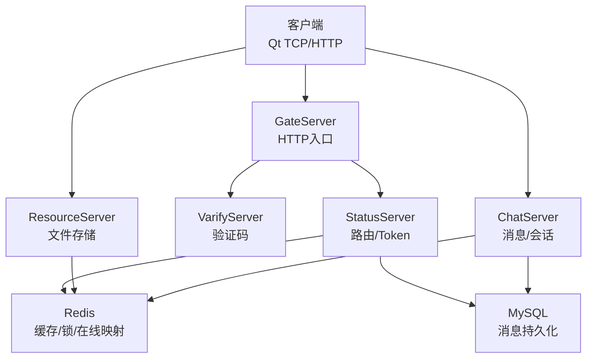
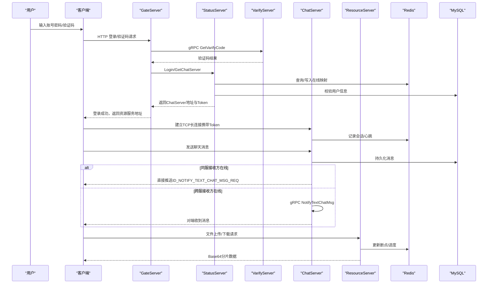
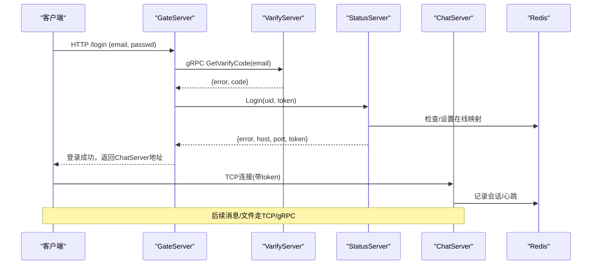
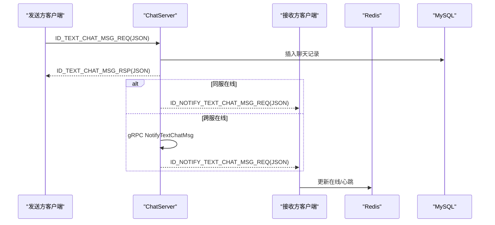
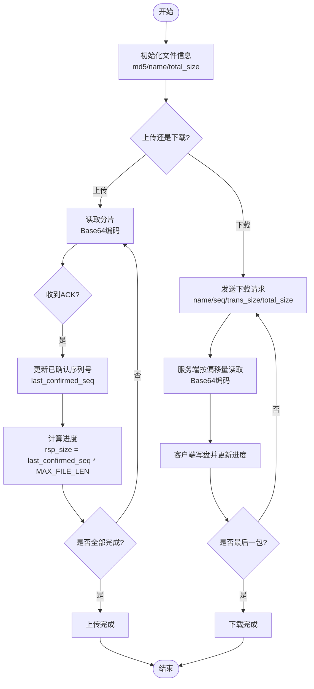
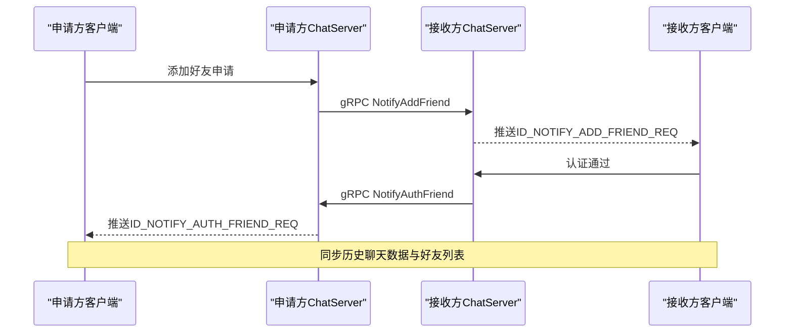
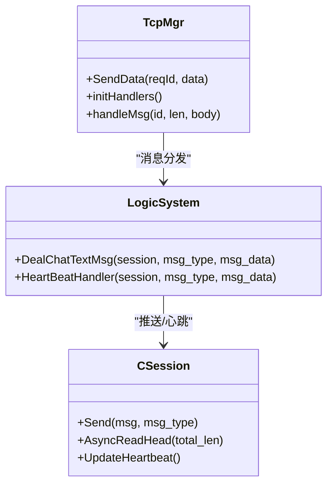
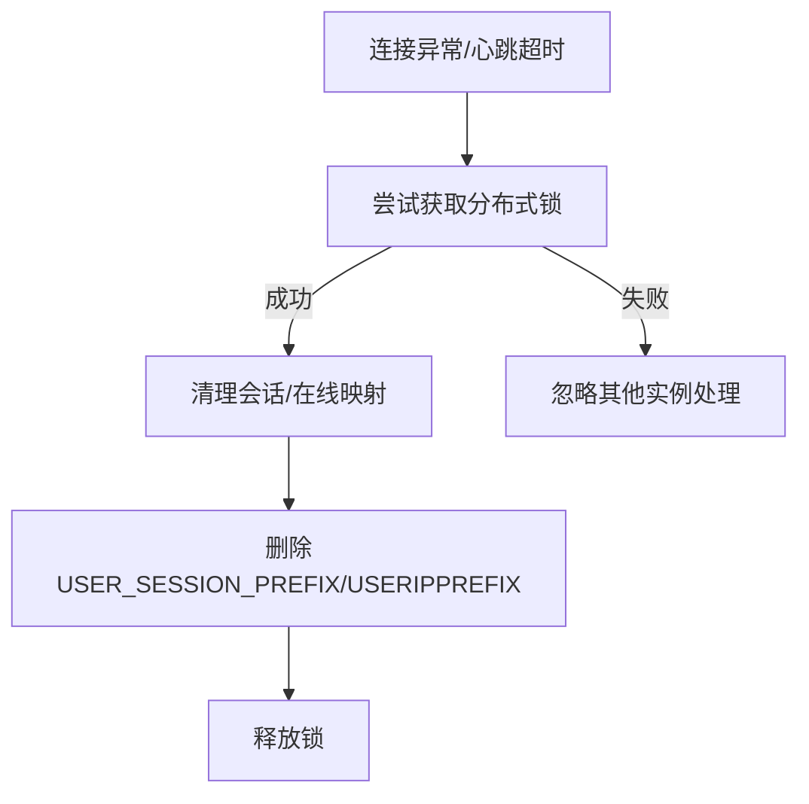
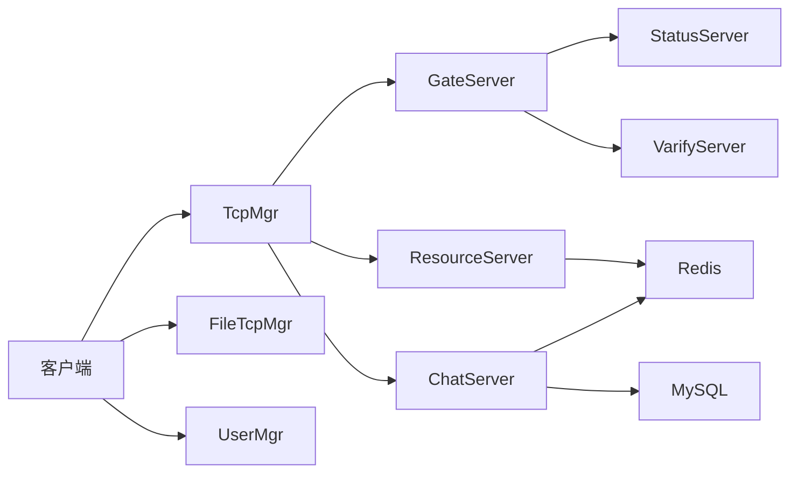

# 数据流设计

<cite>
**本文引用的文件**
- [README.md](file://README.md)
- [chat.proto](file://proto/chat_service/chat.proto)
- [verify.proto](file://proto/verify_service/verify.proto)
- [status.proto](file://proto/status_service/status.proto)
- [main.cpp](file://client/llfcchat/src/main.cpp)
- [tcpmgr.cpp](file://client/llfcchat/src/tcpmgr.cpp)
- [filetcpmgr.cpp](file://client/llfcchat/src/filetcpmgr.cpp)
- [usermgr.cpp](file://client/llfcchat/src/usermgr.cpp)
- [GateServer.cpp](file://server/GateServer/src/GateServer.cpp)
- [CServer.h](file://server/GateServer/include/CServer.h)
- [ChatServer.cpp](file://server/ChatServer/src/ChatServer.cpp)
- [CSession.h](file://server/ChatServer/include/CSession.h)
- [LogicSystem.cpp](file://server/ChatServer/src/LogicSystem.cpp)
- [ChatGrpcClient.cpp](file://server/ChatServer/src/ChatGrpcClient.cpp)
- [ResourceServer.cpp](file://server/ResourceServer/src/ResourceServer.cpp)
- [ChatServerGrpcClient.cpp](file://server/ResourceServer/src/ChatServerGrpcClient.cpp)
- [RedisMgr.h（StatusServer）](file://server/StatusServer/include/RedisMgr.h)
- [RedisMgr.h（GateServer）](file://server/GateServer/include/RedisMgr.h)
- [RedisMgr.h（ChatServer）](file://server/ChatServer/include/RedisMgr.h)
- [day37-聊天信息存储方案.md](file://开发文档/day37-聊天信息存储方案.md)
- [day38-断点续传.md](file://开发文档/day38-断点续传.md)
- [day40-聊天图片资源续传和进度显示.md](file://开发文档/day40-聊天图片资源续传和进度显示.md)
- [day42-用户加载聊天资源.md](file://开发文档/day42-用户加载聊天资源.md)
- [day44-webrtc信令服务器实现.md](file://开发文档/day44-webrtc信令服务器实现.md)
</cite>

## 目录
1. [简介](#简介)
2. [项目结构](#项目结构)
3. [核心组件](#核心组件)
4. [架构总览](#架构总览)
5. [详细组件分析](#详细组件分析)
6. [依赖关系分析](#依赖关系分析)
7. [性能考量](#性能考量)
8. [故障排查指南](#故障排查指南)
9. [结论](#结论)
10. [附录](#附录)

## 简介
本文件面向LLFCChat系统的数据流设计，覆盖以下关键路径与机制：
- 用户认证流程（HTTP登录、验证码、状态服务分配、TCP长连接建立）
- 聊天消息流转（文本消息同步响应与异步推送、跨服转发）
- 文件传输流程（上传/下载、分片、断点续传、进度回调）
- 好友关系管理（申请、认证、列表同步）
- 同步与异步处理模式（请求-响应模型与事件驱动）
- 客户端、网关、业务服务、数据存储之间的数据流转
- 实时通信推送机制、缓存同步策略（Redis）、分布式锁与会话清理
- 数据序列化格式、压缩策略与传输优化建议

## 项目结构
系统由客户端与多后端服务组成：
- 客户端（Qt C++）：负责UI、网络I/O、消息编解码、本地缓存与文件IO
- GateServer（网关）：HTTP入口、鉴权、路由到状态服务
- StatusServer（状态服务）：会话路由、Token签发、在线状态
- ChatServer（聊天服务）：消息持久化、在线会话管理、跨服通知
- ResourceServer（资源服务）：文件读写、图片/附件存储
- VarifyServer（Node.js）：验证码发送
- Redis/MySQL：缓存与持久化

图表来源
- [GateServer.cpp:128-160](file://server/GateServer/src/GateServer.cpp#L128-L160)
- [ChatServer.cpp:20-81](file://server/ChatServer/src/ChatServer.cpp#L20-L81)
- [ResourceServer.cpp:15-42](file://server/ResourceServer/src/ResourceServer.cpp#L15-L42)
- [status.proto:1-32](file://proto/status_service/status.proto#L1-L32)
- [verify.proto:1-19](file://proto/verify_service/verify.proto#L1-L19)

章节来源
- [README.md:1-112](file://README.md#L1-L112)

## 核心组件
- 客户端网络层
  - TcpMgr：TCP粘包处理、消息分发、JSON解析、信号派发
  - FileTcpMgr：文件上传/下载、分片、断点续传、进度回调
  - UserMgr：用户信息、好友/申请列表、传输任务状态管理
- 服务端
  - GateServer：HTTP服务、Redis/MySQL初始化、启动Asio IO池
  - ChatServer：gRPC服务、会话管理、消息落库、跨服通知
  - ResourceServer：文件IO、Base64编码、分块读取
  - StatusServer：GetChatServer/Login、在线映射、心跳计数
- 协议与接口
  - chat.proto：聊天相关RPC定义（文本、图片通知、踢人、好友认证）
  - status.proto：状态服务（获取ChatServer地址、登录校验）
  - verify.proto：验证码服务

章节来源
- [tcpmgr.cpp:1-800](file://client/llfcchat/src/tcpmgr.cpp#L1-L800)
- [filetcpmgr.cpp:501-1114](file://client/llfcchat/src/filetcpmgr.cpp#L501-L1114)
- [usermgr.cpp:375-564](file://client/llfcchat/src/usermgr.cpp#L375-L564)
- [GateServer.cpp:128-160](file://server/GateServer/src/GateServer.cpp#L128-L160)
- [ChatServer.cpp:20-81](file://server/ChatServer/src/ChatServer.cpp#L20-L81)
- [ResourceServer.cpp:15-42](file://server/ResourceServer/src/ResourceServer.cpp#L15-L42)
- [chat.proto:1-105](file://proto/chat_service/chat.proto#L1-L105)
- [status.proto:1-32](file://proto/status_service/status.proto#L1-L32)
- [verify.proto:1-19](file://proto/verify_service/verify.proto#L1-L19)

## 架构总览
整体采用“网关+微服务”的架构：
- 客户端通过HTTP访问GateServer进行注册/登录/验证码；随后根据StatusServer返回的ChatServer地址建立TCP长连接
- ChatServer维护用户会话、消息持久化、跨服通知（gRPC）
- ResourceServer提供文件读写能力，支持Base64分片传输与断点续传
- Redis用于在线用户映射、分布式锁、会话状态、下载进度等
- MySQL用于用户信息、聊天记录等持久化

图表来源
- [status.proto:1-32](file://proto/status_service/status.proto#L1-L32)
- [verify.proto:1-19](file://proto/verify_service/verify.proto#L1-L19)
- [chat.proto:1-105](file://proto/chat_service/chat.proto#L1-L105)
- [ChatServer.cpp:20-81](file://server/ChatServer/src/ChatServer.cpp#L20-L81)
- [GateServer.cpp:128-160](file://server/GateServer/src/GateServer.cpp#L128-L160)
- [ResourceServer.cpp:15-42](file://server/ResourceServer/src/ResourceServer.cpp#L15-L42)

## 详细组件分析

### 用户认证流程（HTTP + gRPC + TCP）
- 客户端通过HTTP向GateServer发起登录或验证码请求
- GateServer调用VarifyServer获取验证码，调用StatusServer完成用户校验并返回ChatServer地址与Token
- 客户端使用Token与ChatServer建立TCP长连接，后续所有聊天与文件操作基于该连接
- 心跳机制维持连接活跃，异常断开时清理Redis中的会话与在线映射

图表来源
- [GateServer.cpp:128-160](file://server/GateServer/src/GateServer.cpp#L128-L160)
- [status.proto:1-32](file://proto/status_service/status.proto#L1-L32)
- [verify.proto:1-19](file://proto/verify_service/verify.proto#L1-L19)
- [ChatServer.cpp:20-81](file://server/ChatServer/src/ChatServer.cpp#L20-L81)

章节来源
- [day42-用户加载聊天资源.md:99-166](file://开发文档/day42-用户加载聊天资源.md#L99-L166)
- [day42-用户加载聊天资源.md:560-614](file://开发文档/day42-用户加载聊天资源.md#L560-L614)

### 聊天消息流转（同步响应 + 异步推送）
- 发送方客户端将文本消息封装为JSON并通过TCP发送至ChatServer
- ChatServer持久化消息至MySQL，构造回复给发送方（ID_TEXT_CHAT_MSG_RSP）
- 若接收方在同服在线，直接通过Session推送ID_NOTIFY_TEXT_CHAT_MSG_REQ
- 若接收方在异服，通过gRPC NotifyTextChatMsg跨服通知
- 客户端收到通知后更新界面，未读/已读状态转换

图表来源
- [tcpmgr.cpp:452-548](file://client/llfcchat/src/tcpmgr.cpp#L452-L548)
- [day37-聊天信息存储方案.md:3283-3383](file://开发文档/day37-聊天信息存储方案.md#L3283-L3383)
- [ChatGrpcClient.cpp:137-173](file://server/ChatServer/src/ChatGrpcClient.cpp#L137-L173)

章节来源
- [tcpmgr.cpp:452-548](file://client/llfcchat/src/tcpmgr.cpp#L452-L548)
- [day37-聊天信息存储方案.md:3283-3383](file://开发文档/day37-聊天信息存储方案.md#L3283-L3383)

### 文件传输流程（上传/下载、分片、断点续传）
- 上传：客户端按固定分片大小读取文件，Base64编码后逐片发送；服务端回ACK确认序列号；客户端维护已确认集合与最后确认序列号，计算进度
- 下载：客户端发起下载请求，服务端从Redis恢复断点信息，按偏移量读取文件并Base64编码返回；客户端写盘并更新进度
- 断点续传：Redis保存当前seq、trans_size、total_size等信息；网络中断后可从上次位置继续

图表来源
- [filetcpmgr.cpp:501-1114](file://client/llfcchat/src/filetcpmgr.cpp#L501-L1114)
- [day38-断点续传.md:2897-3084](file://开发文档/day38-断点续传.md#L2897-L3084)
- [day40-聊天图片资源续传和进度显示.md:637-876](file://开发文档/day40-聊天图片资源续传和进度显示.md#L637-L876)

章节来源
- [filetcpmgr.cpp:501-1114](file://client/llfcchat/src/filetcpmgr.cpp#L501-L1114)
- [day38-断点续传.md:2897-3084](file://开发文档/day38-断点续传.md#L2897-L3084)
- [day40-聊天图片资源续传和进度显示.md:637-876](file://开发文档/day40-聊天图片资源续传和进度显示.md#L637-L876)

### 好友关系管理（申请、认证、列表同步）
- 客户端发起添加好友申请，服务器间通过gRPC NotifyAddFriend/NotifyAuthFriend交互
- 接收方收到申请后，可认证通过；认证通过后双方同步历史聊天数据
- 客户端维护好友列表与申请列表，登录后从服务器拉取并展示

图表来源
- [chat.proto:1-105](file://proto/chat_service/chat.proto#L1-L105)
- [tcpmgr.cpp:272-449](file://client/llfcchat/src/tcpmgr.cpp#L272-L449)

章节来源
- [chat.proto:1-105](file://proto/chat_service/chat.proto#L1-L105)
- [tcpmgr.cpp:272-449](file://client/llfcchat/src/tcpmgr.cpp#L272-L449)

### 实时通信推送机制与事件驱动
- 客户端通过TcpMgr注册消息处理器，按消息类型分发到对应回调
- 服务器端通过Session直接推送或gRPC跨服通知，形成事件驱动的即时更新
- 心跳机制定期刷新会话时间戳，异常断开触发清理逻辑

图表来源
- [tcpmgr.cpp:182-800](file://client/llfcchat/src/tcpmgr.cpp#L182-L800)
- [LogicSystem.cpp:564-591](file://server/ChatServer/src/LogicSystem.cpp#L564-L591)
- [CSession.h:28-86](file://server/ChatServer/include/CSession.h#L28-L86)

章节来源
- [tcpmgr.cpp:182-800](file://client/llfcchat/src/tcpmgr.cpp#L182-L800)
- [LogicSystem.cpp:564-591](file://server/ChatServer/src/LogicSystem.cpp#L564-L591)
- [CSession.h:28-86](file://server/ChatServer/include/CSession.h#L28-L86)

### 缓存同步策略与分布式锁
- Redis用于在线用户映射（USERIPPREFIX）、会话ID（USER_SESSION_PREFIX）、下载进度、分布式锁（LOCK_PREFIX）
- 心跳过期或连接异常时，通过分布式锁确保唯一清理会话与在线映射
- 下载断点信息保存在Redis，支持跨进程/重启续传

图表来源
- [day35心跳逻辑.md:95-146](file://开发文档/day35心跳逻辑.md#L95-L146)
- [RedisMgr.h（ChatServer）:198-246](file://server/ChatServer/include/RedisMgr.h#L198-L246)
- [RedisMgr.h（GateServer）:198-246](file://server/GateServer/include/RedisMgr.h#L198-L246)
- [RedisMgr.h（StatusServer）:203-246](file://server/StatusServer/include/RedisMgr.h#L203-L246)

章节来源
- [day35心跳逻辑.md:95-146](file://开发文档/day35心跳逻辑.md#L95-L146)
- [RedisMgr.h（ChatServer）:198-246](file://server/ChatServer/include/RedisMgr.h#L198-L246)

## 依赖关系分析
- 客户端依赖：
  - Qt网络模块（QTcpSocket）、QSettings、QJsonDocument
  - 自定义模块：TcpMgr、FileTcpMgr、UserMgr
- 服务端依赖：
  - Boost.Asio/Beast（网络与HTTP）
  - gRPC（服务间通信）
  - hiredis（Redis客户端）
  - MySQL连接器（数据库）
- 外部服务：
  - VarifyServer（Node.js）提供验证码
  - WebRTC信令服务器（可选，用于视频通话）

图表来源
- [main.cpp:1-44](file://client/llfcchat/src/main.cpp#L1-L44)
- [GateServer.cpp:128-160](file://server/GateServer/src/GateServer.cpp#L128-L160)
- [ChatServer.cpp:20-81](file://server/ChatServer/src/ChatServer.cpp#L20-L81)
- [ResourceServer.cpp:15-42](file://server/ResourceServer/src/ResourceServer.cpp#L15-L42)

章节来源
- [main.cpp:1-44](file://client/llfcchat/src/main.cpp#L1-L44)

## 性能考量
- 序列化格式
  - 聊天消息与状态控制使用JSON（轻量、易调试）
  - 服务间通信使用Protocol Buffers（高效、强类型）
- 压缩策略
  - 文件传输采用Base64编码（便于JSON包裹），建议在网关或客户端启用gzip压缩以减少带宽占用
- 传输优化
  - 分片大小MAX_FILE_LEN平衡内存与网络开销
  - 滑动窗口与ACK机制避免拥塞与丢包重传
  - Redis缓存在线映射与断点信息，降低数据库压力
- 并发模型
  - Asio IO线程池提升高并发处理能力
  - gRPC连接池复用减少握手开销

[本节为通用指导，不直接分析具体文件]

## 故障排查指南
- 登录失败
  - 检查验证码服务可用性（VarifyServer）
  - 核对StatusServer返回的ChatServer地址与Token
  - 查看GateServer日志中MySQL/Redis连接状态
- 消息未送达
  - 确认接收方在线映射（Redis USERIPPREFIX）
  - 检查跨服gRPC连通性与错误码
  - 验证MySQL插入是否成功
- 文件传输失败
  - 核对分片ACK与序列号一致性
  - 检查Redis断点信息是否过期
  - 确认磁盘权限与路径正确性
- 连接异常
  - 观察心跳超时与分布式锁清理逻辑
  - 检查CSession异常处理与Close流程

章节来源
- [tcpmgr.cpp:182-800](file://client/llfcchat/src/tcpmgr.cpp#L182-L800)
- [day35心跳逻辑.md:95-146](file://开发文档/day35心跳逻辑.md#L95-L146)
- [day38-断点续传.md:2897-3084](file://开发文档/day38-断点续传.md#L2897-L3084)

## 结论
LLFCChat系统通过清晰的职责划分与高效的网络模型实现了稳定的认证、聊天与文件传输能力。JSON与Protobuf的组合兼顾了灵活性与性能；Redis与MySQL分别承担缓存与持久化职责；分布式锁与会话清理保障了多实例环境下的数据一致性。未来可在网关层引入统一压缩、限流与监控，进一步提升系统吞吐与可观测性。

[本节为总结，不直接分析具体文件]

## 附录
- 协议定义
  - chat.proto：聊天服务RPC与消息结构
  - status.proto：状态服务接口
  - verify.proto：验证码服务接口
- 开发文档参考
  - day37：聊天信息存储方案
  - day38：断点续传实现
  - day40：图片资源续传与进度显示
  - day42：用户加载聊天资源
  - day44：WebRTC信令服务器实现

章节来源
- [chat.proto:1-105](file://proto/chat_service/chat.proto#L1-L105)
- [status.proto:1-32](file://proto/status_service/status.proto#L1-L32)
- [verify.proto:1-19](file://proto/verify_service/verify.proto#L1-L19)
- [day37-聊天信息存储方案.md:3283-3383](file://开发文档/day37-聊天信息存储方案.md#L3283-L3383)
- [day38-断点续传.md:2897-3084](file://开发文档/day38-断点续传.md#L2897-L3084)
- [day40-聊天图片资源续传和进度显示.md:637-876](file://开发文档/day40-聊天图片资源续传和进度显示.md#L637-L876)
- [day42-用户加载聊天资源.md:99-166](file://开发文档/day42-用户加载聊天资源.md#L99-L166)
- [day44-webrtc信令服务器实现.md:1-86](file://开发文档/day44-webrtc信令服务器实现.md#L1-L86)