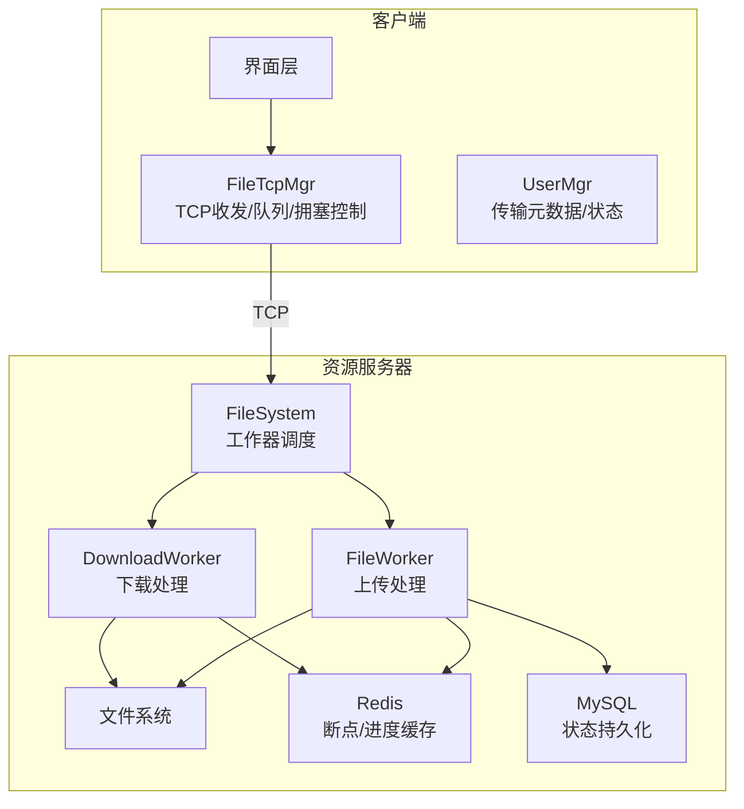
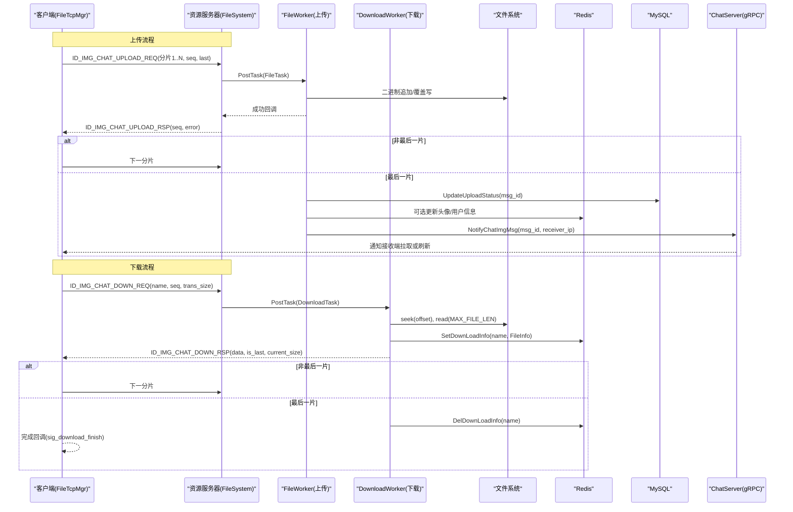
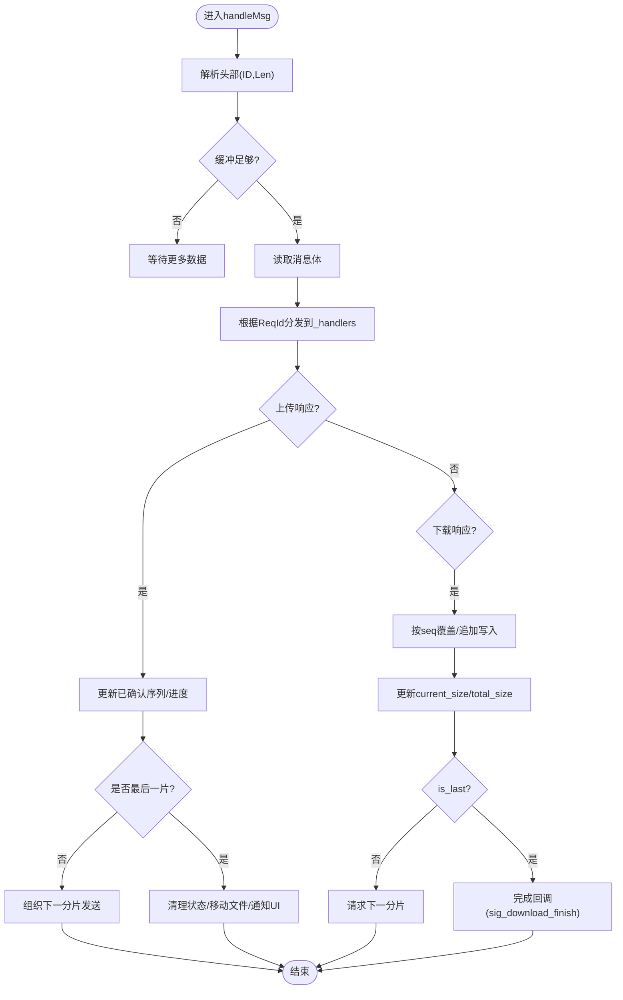
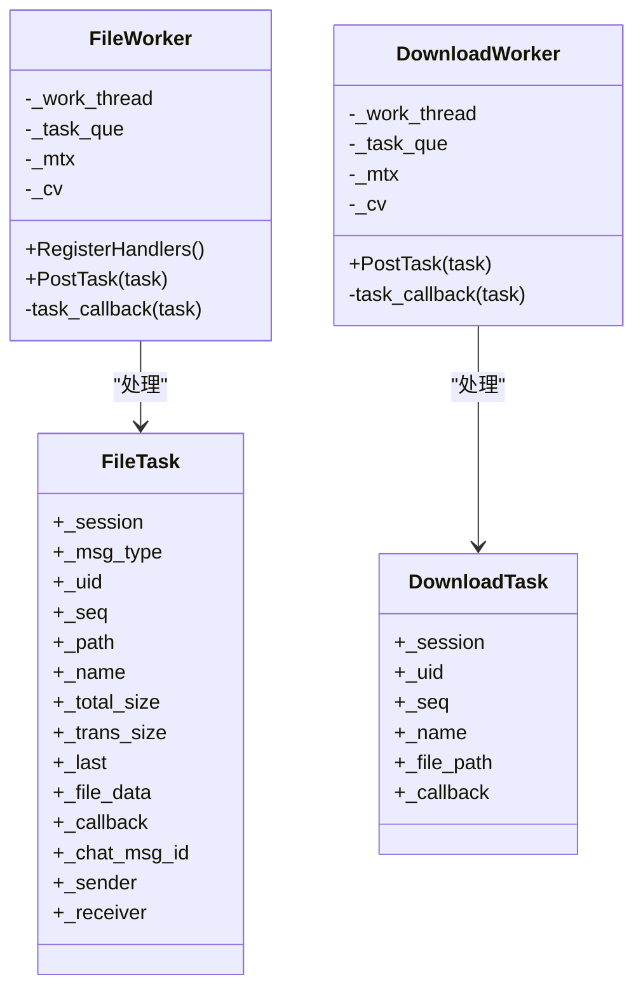
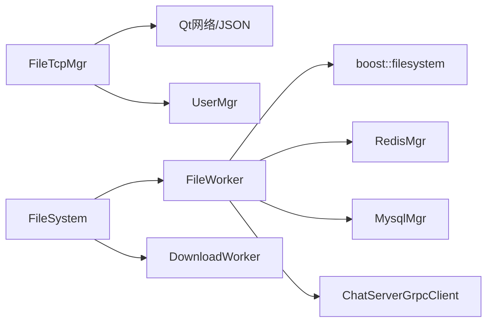
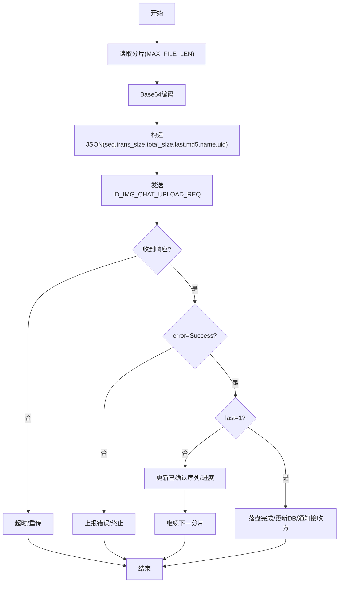
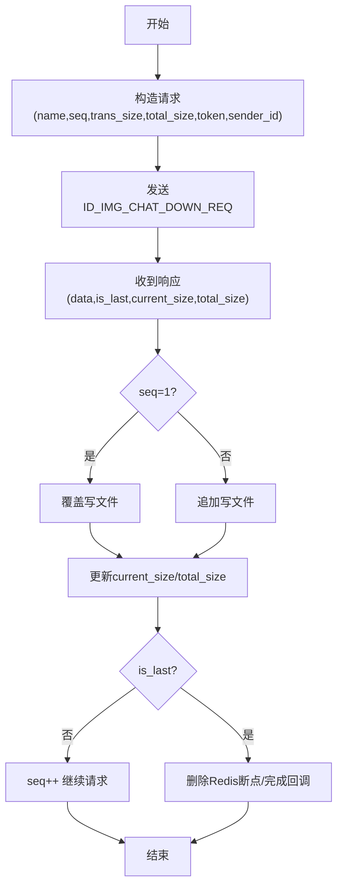

# 文件传输数据流

<cite>
**本文引用的文件**   
- [filetcpmgr.h](file://client/llfcchat/include/filetcpmgr.h)
- [filetcpmgr.cpp](file://client/llfcchat/src/filetcpmgr.cpp)
- [global.h](file://client/llfcchat/include/global.h)
- [FileWorker.h](file://server/ResourceServer/include/FileWorker.h)
- [FileWorker.cpp](file://server/ResourceServer/src/FileWorker.cpp)
- [FileSystem.h](file://server/ResourceServer/include/FileSystem.h)
- [FileSystem.cpp](file://server/ResourceServer/src/FileSystem.cpp)
- [FileInfo.h](file://server/ResourceServer/include/FileInfo.h)
- [const.h](file://server/ResourceServer/include/const.h)
- [RedisMgr.h](file://server/ResourceServer/include/RedisMgr.h)
- [MysqlMgr.h](file://server/ResourceServer/include/MysqlMgr.h)
</cite>

## 目录
1. [引言](#引言)
2. [项目结构](#项目结构)
3. [核心组件](#核心组件)
4. [架构总览](#架构总览)
5. [详细组件分析](#详细组件分析)
6. [依赖关系分析](#依赖关系分析)
7. [性能考量](#性能考量)
8. [故障排查指南](#故障排查指南)
9. [结论](#结论)
10. [附录](#附录)

## 引言
本文件为 LLFCChat 系统的“文件传输”功能提供数据流设计文档，覆盖客户端分片上传、ResourceServer 文件处理、文件系统存储与进度反馈机制。重点说明大文件分块策略、并发控制、内存管理与磁盘 I/O 优化；给出文件传输时序图、分片处理流程图与错误恢复机制；解释断点续传原理、传输进度同步、文件完整性校验与存储空间管理；并记录不同文件格式的处理差异与特殊类型的优化策略。

## 项目结构
- 客户端（Qt/C++）：通过 FileTcpMgr 建立与 ResourceServer 的 TCP 连接，负责消息编解码、发送队列、拥塞窗口控制、分片读取与写入、进度回调等。
- 资源服务器（C++）：通过 FileWorker/DownloadWorker 线程池处理上传与下载任务，使用 Redis 维护断点信息，MySQL 更新状态，文件系统落盘。
- 协议与常量：全局 ReqId、ErrorCodes、MAX_FILE_LEN、拥塞窗口上限等定义在 global.h 与 const.h 中。

**图表来源** 
- [filetcpmgr.h:1-85](file://client/llfcchat/include/filetcpmgr.h#L1-L85)
- [filetcpmgr.cpp:1-143](file://client/llfcchat/src/filetcpmgr.cpp#L1-L143)
- [FileSystem.h:1-21](file://server/ResourceServer/include/FileSystem.h#L1-L21)
- [FileSystem.cpp:1-29](file://server/ResourceServer/src/FileSystem.cpp#L1-L29)
- [FileWorker.h:1-91](file://server/ResourceServer/include/FileWorker.h#L1-L91)
- [FileWorker.cpp:1-110](file://server/ResourceServer/src/FileWorker.cpp#L1-L110)

**章节来源**
- [filetcpmgr.h:1-85](file://client/llfcchat/include/filetcpmgr.h#L1-L85)
- [filetcpmgr.cpp:1-143](file://client/llfcchat/src/filetcpmgr.cpp#L1-L143)
- [global.h:1-296](file://client/llfcchat/include/global.h#L1-L296)
- [const.h:1-117](file://server/ResourceServer/include/const.h#L1-L117)

## 核心组件
- 客户端 FileTcpMgr
  - 职责：TCP 连接管理、粘包/拆包解析、发送队列与拥塞窗口、分片读取与 Base64 编解码、进度信号回调、断点续传控制。
  - 关键成员：_send_queue、_current_block、_bytes_sent、_pending、_cwnd_size、_handlers。
- 服务器端 FileWorker/DownloadWorker
  - 职责：上传分片落盘、下载分片读取、断点续传状态维护（Redis）、最终状态更新（MySQL）、通知下游服务（gRPC）。
  - 关键数据结构：FileTask、DownloadTask、FileInfo。
- 文件系统抽象 FileSystem
  - 职责：将任务分发到多个 FileWorker/DownloadWorker 实例，实现水平扩展。
- 全局常量与协议
  - MAX_FILE_LEN=32KB，拥塞窗口上限 MAX_CWND_SIZE=5，ReqId 定义上传/下载/续传相关消息 ID。

**章节来源**
- [filetcpmgr.h:1-85](file://client/llfcchat/include/filetcpmgr.h#L1-L85)
- [filetcpmgr.cpp:186-241](file://client/llfcchat/src/filetcpmgr.cpp#L186-L241)
- [FileWorker.h:15-57](file://server/ResourceServer/include/FileWorker.h#L15-L57)
- [FileWorker.cpp:456-478](file://server/ResourceServer/src/FileWorker.cpp#L456-L478)
- [FileSystem.h:7-18](file://server/ResourceServer/include/FileSystem.h#L7-L18)
- [global.h:22-24](file://client/llfcchat/include/global.h#L22-L24)
- [const.h:114](file://server/ResourceServer/include/const.h#L114)

## 架构总览
下图展示一次完整的“聊天图片上传+断点续传”的数据流：客户端按分片发送，服务器逐片落盘并在最后一片时更新数据库并通过 gRPC 通知 ChatServer 推送给接收方。

**图表来源** 
- [filetcpmgr.cpp:521-608](file://client/llfcchat/src/filetcpmgr.cpp#L521-L608)
- [filetcpmgr.cpp:695-800](file://client/llfcchat/src/filetcpmgr.cpp#L695-L800)
- [FileWorker.cpp:196-280](file://server/ResourceServer/src/FileWorker.cpp#L196-L280)
- [FileWorker.cpp:525-659](file://server/ResourceServer/src/FileWorker.cpp#L525-L659)

## 详细组件分析

### 客户端 FileTcpMgr：TCP 收发与分片控制
- 粘包/拆包
  - 固定头部长度 FILE_UPLOAD_HEAD_LEN=6（ID:2 + Len:4），循环从缓冲区解析头与体，避免粘包问题。
- 发送队列与拥塞控制
  - _send_queue 保存待发包，_pending 标记当前正在发送的块，_cwnd_size 限制并发未确认分片数量。
  - bytesWritten 回调驱动继续发送或出队下一个块。
- 分片上传
  - 每次读取 MAX_FILE_LEN（32KB）作为一帧，Base64 编码后封装 JSON 发送，包含 name、seq、trans_size、total_size、last、md5、uid 等字段。
- 分片下载
  - 根据 seq 决定覆盖/追加写入；is_last 标志结束；更新 current_size/total_size 并触发进度回调。
- 断点续传
  - 上传：收到服务器响应后根据 trans_size 定位文件偏移继续读取；若 total_size==trans_size 则结束。
  - 下载：根据 seq 和 Redis 中的 FileInfo 进行续传；暂停状态直接返回。

**图表来源** 
- [filetcpmgr.cpp:16-55](file://client/llfcchat/src/filetcpmgr.cpp#L16-L55)
- [filetcpmgr.cpp:186-241](file://client/llfcchat/src/filetcpmgr.cpp#L186-L241)
- [filetcpmgr.cpp:246-332](file://client/llfcchat/src/filetcpmgr.cpp#L246-L332)
- [filetcpmgr.cpp:334-433](file://client/llfcchat/src/filetcpmgr.cpp#L334-L433)
- [filetcpmgr.cpp:521-608](file://client/llfcchat/src/filetcpmgr.cpp#L521-L608)
- [filetcpmgr.cpp:695-800](file://client/llfcchat/src/filetcpmgr.cpp#L695-L800)

**章节来源**
- [filetcpmgr.h:26-82](file://client/llfcchat/include/filetcpmgr.h#L26-L82)
- [filetcpmgr.cpp:16-143](file://client/llfcchat/src/filetcpmgr.cpp#L16-L143)
- [global.h:15-24](file://client/llfcchat/include/global.h#L15-L24)

### 服务器端 FileWorker/DownloadWorker：分片处理与断点续传
- 上传处理器
  - 解码 Base64 数据，按 seq=1 覆盖写，否则追加写；最后一片时更新 MySQL 上传状态，并通过 gRPC 通知 ChatServer 推送给接收者。
- 下载处理器
  - 首次下载获取文件大小并初始化 FileInfo，写入 Redis；后续下载从 Redis 恢复 seq/trans_size，校验 seq 一致性后按 offset 读取分片；is_last 时删除 Redis 记录。
- 并发与队列
  - 每个 Worker 独立线程 + 条件变量唤醒；PostTask 入队，task_callback 执行具体逻辑。

**图表来源** 
- [FileWorker.h:15-57](file://server/ResourceServer/include/FileWorker.h#L15-L57)
- [FileWorker.h:59-91](file://server/ResourceServer/include/FileWorker.h#L59-L91)
- [FileWorker.cpp:456-478](file://server/ResourceServer/src/FileWorker.cpp#L456-L478)
- [FileWorker.cpp:525-659](file://server/ResourceServer/src/FileWorker.cpp#L525-L659)

**章节来源**
- [FileWorker.cpp:196-280](file://server/ResourceServer/src/FileWorker.cpp#L196-L280)
- [FileWorker.cpp:525-659](file://server/ResourceServer/src/FileWorker.cpp#L525-L659)

### 文件系统抽象 FileSystem：工作器调度
- 维护多实例 FileWorker/DownloadWorker，按 index 路由任务，提升吞吐与隔离性。

**章节来源**
- [FileSystem.h:7-18](file://server/ResourceServer/include/FileSystem.h#L7-L18)
- [FileSystem.cpp:19-29](file://server/ResourceServer/src/FileSystem.cpp#L19-L29)

### 协议与常量：ReqId、ErrorCodes、MAX_FILE_LEN
- 上传/下载/续传相关 ReqId 集中在 global.h，服务器侧 MSG_TYPES 在 const.h。
- ErrorCodes 统一错误码，便于两端一致处理。
- MAX_FILE_LEN=32KB 作为分片大小，兼顾网络与内存占用。

**章节来源**
- [global.h:43-88](file://client/llfcchat/include/global.h#L43-L88)
- [const.h:72-95](file://server/ResourceServer/include/const.h#L72-L95)
- [const.h:114](file://server/ResourceServer/include/const.h#L114)

## 依赖关系分析
- 客户端依赖
  - Qt 网络与事件循环（QTcpSocket、QQueue、QThread、QJson）。
  - UserMgr 管理传输元数据（如 MsgInfo、DownloadInfo）。
- 服务器依赖
  - boost::filesystem 操作路径与文件。
  - hiredis 访问 Redis（断点/进度缓存）。
  - MySQL 持久化状态（上传完成、头像更新）。
  - gRPC 调用 ChatServer 推送消息。

**图表来源** 
- [filetcpmgr.cpp:1-143](file://client/llfcchat/src/filetcpmgr.cpp#L1-L143)
- [FileWorker.cpp:1-110](file://server/ResourceServer/src/FileWorker.cpp#L1-L110)
- [RedisMgr.h:269-313](file://server/ResourceServer/include/RedisMgr.h#L269-L313)
- [MysqlMgr.h:9-42](file://server/ResourceServer/include/MysqlMgr.h#L9-L42)

**章节来源**
- [filetcpmgr.cpp:1-143](file://client/llfcchat/src/filetcpmgr.cpp#L1-L143)
- [FileWorker.cpp:1-110](file://server/ResourceServer/src/FileWorker.cpp#L1-L110)
- [RedisMgr.h:269-313](file://server/ResourceServer/include/RedisMgr.h#L269-L313)
- [MysqlMgr.h:9-42](file://server/ResourceServer/include/MysqlMgr.h#L9-L42)

## 性能考量
- 分片大小
  - MAX_FILE_LEN=32KB，平衡网络开销与内存占用；对超大文件可考虑动态调整。
- 并发控制
  - 客户端拥塞窗口 _cwnd_size 限制未确认分片数，避免雪崩；服务器端多 Worker 并行处理。
- 内存管理
  - 分片读写采用流式方式，避免一次性加载整个文件；Base64 编解码仅在分片级别进行。
- 磁盘 I/O
  - 首片覆盖写，后续追加写；使用二进制模式减少转换开销；必要时可引入异步 I/O。
- 缓存与持久化
  - Redis 用于断点续传与进度缓存，降低重复计算与重传成本；MySQL 仅做必要状态更新。

[本节为通用指导，不直接分析具体文件]

## 故障排查指南
- 常见错误码
  - FileNotExists、FileWritePermissionFailed、FileReadPermissionFailed、FileSeqInvalid、FileOffsetInvalid、RedisReadErr 等。
- 客户端排查
  - 检查 TCP 连接状态与错误回调；确认 _send_queue 与 _pending 状态；核对 ReqId 与 JSON 字段。
- 服务器排查
  - 检查 Redis 连接池与健康检查；确认文件权限与路径存在；验证 seq 与 offset 一致性；查看 MySQL 更新是否成功。
- 断点续传失败
  - 确认 Redis 中 FileInfo 是否存在且过期时间合理；校验客户端 seq 与服务端期望一致；检查 is_last 标志是否正确。

**章节来源**
- [const.h:5-29](file://server/ResourceServer/include/const.h#L5-L29)
- [filetcpmgr.cpp:65-93](file://client/llfcchat/src/filetcpmgr.cpp#L65-L93)
- [FileWorker.cpp:525-659](file://server/ResourceServer/src/FileWorker.cpp#L525-L659)

## 结论
LLFCChat 的文件传输模块以“分片+确认+断点续传”为核心，结合客户端拥塞控制与服务器端多线程 Worker，实现了稳定高效的大文件传输。通过 Redis 缓存断点与进度、MySQL 持久化状态、gRPC 跨服务通知，形成端到端的闭环。建议后续优化方向包括：动态分片大小、异步 I/O、更细粒度的错误恢复与重试策略、以及针对视频/压缩包等特殊格式的预处理与校验增强。

[本节为总结，不直接分析具体文件]

## 附录
- 分片处理流程图（上传）

**图表来源** 
- [filetcpmgr.cpp:246-332](file://client/llfcchat/src/filetcpmgr.cpp#L246-L332)
- [FileWorker.cpp:196-280](file://server/ResourceServer/src/FileWorker.cpp#L196-L280)

- 分片处理流程图（下载）

**图表来源** 
- [filetcpmgr.cpp:334-433](file://client/llfcchat/src/filetcpmgr.cpp#L334-L433)
- [FileWorker.cpp:525-659](file://server/ResourceServer/src/FileWorker.cpp#L525-L659)