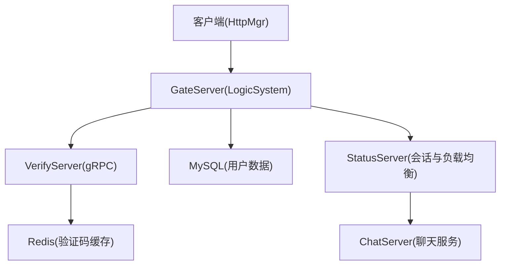
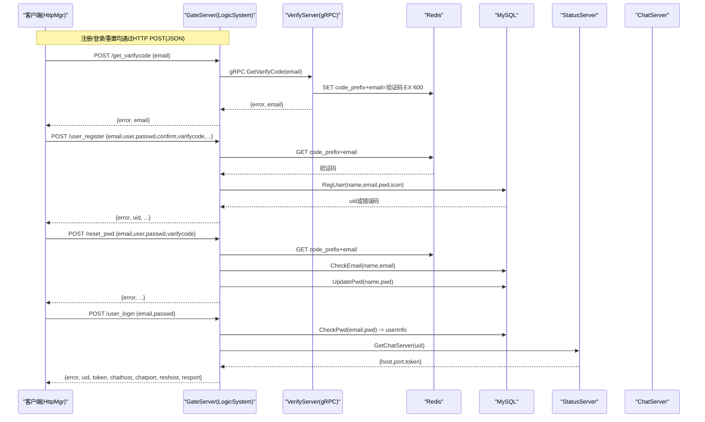
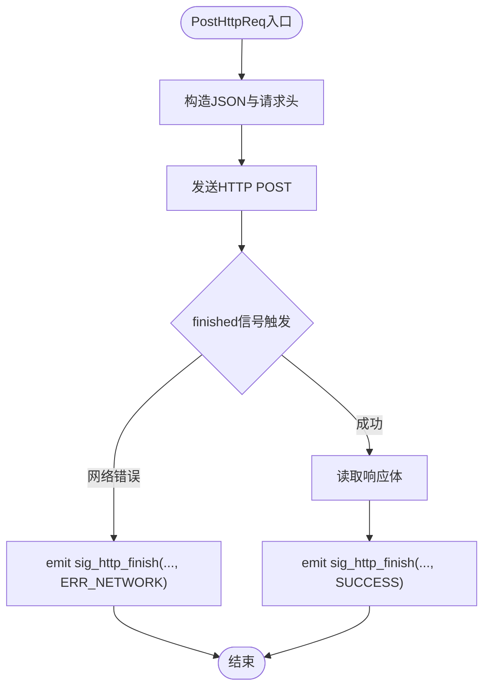
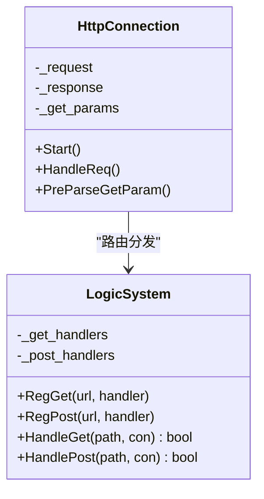
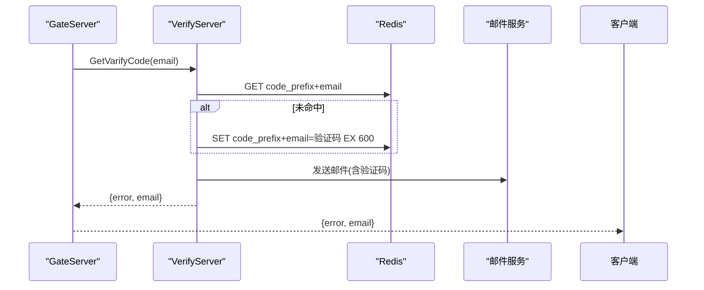
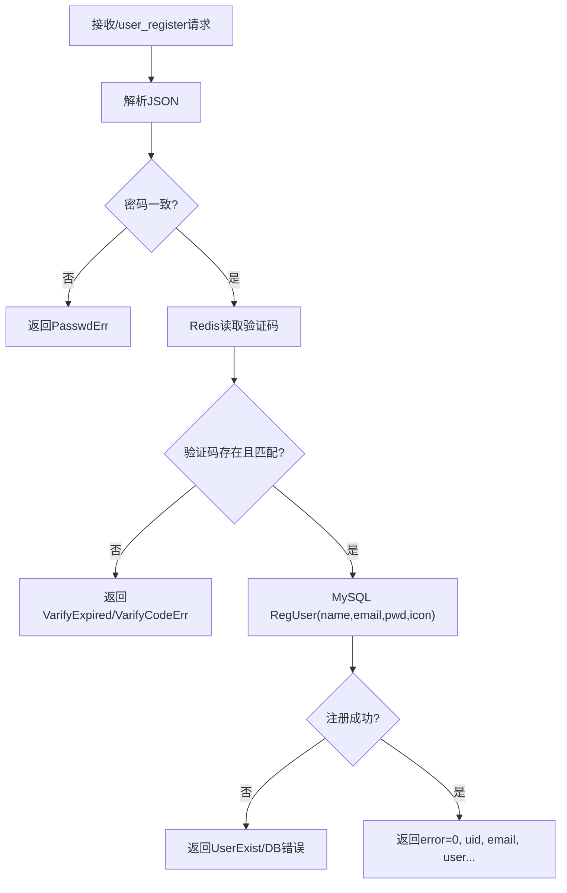
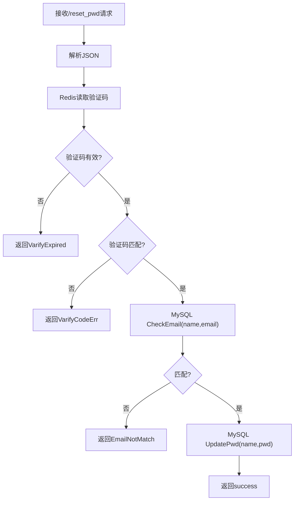
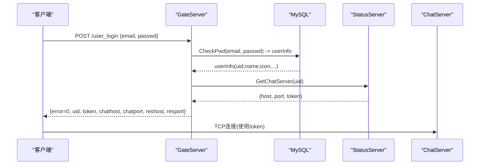
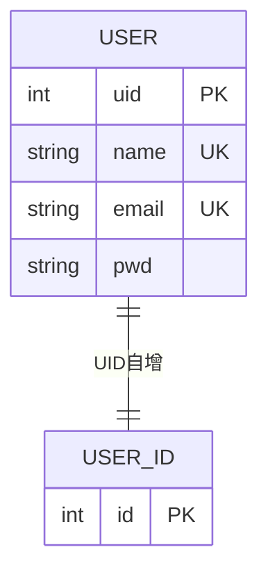
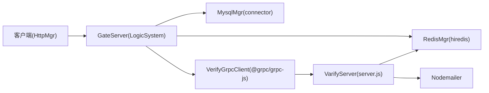

# 用户认证数据流

<cite>
**本文引用的文件**   
- [README.md](file://README.md)
- [HttpConnection.h](file://server/GateServer/include/HttpConnection.h)
- [HttpConnection.cpp](file://server/GateServer/src/HttpConnection.cpp)
- [LogicSystem.h](file://server/GateServer/include/LogicSystem.h)
- [LogicSystem.cpp](file://server/GateServer/src/LogicSystem.cpp)
- [httpmgr.h](file://client/llfcchat/include/httpmgr.h)
- [httpmgr.cpp](file://client/llfcchat/src/httpmgr.cpp)
- [MysqlMgr.h](file://server/GateServer/include/MysqlMgr.h)
- [RedisMgr.h](file://server/GateServer/include/RedisMgr.h)
- [VerifyGrpcClient.h](file://server/GateServer/include/VerifyGrpcClient.h)
- [verify.proto](file://proto/verify_service/verify.proto)
- [server.js](file://server/VarifyServer/server.js)
- [day11-注册功能.md](file://开发文档/day11-注册功能.md)
- [day14-登录功能.md](file://开发文档/day14-登录功能.md)
- [day08-邮箱认证服务.md](file://开发文档/day08-邮箱认证服务.md)
- [day10-多服务验证码派发功能调试.md](file://开发文档/day10-多服务验证码派发功能调试.md)
- [llfc.sql](file://sql备份/llfc.sql)
</cite>

## 目录
1. [简介](#简介)
2. [项目结构](#项目结构)
3. [核心组件](#核心组件)
4. [架构总览](#架构总览)
5. [详细组件分析](#详细组件分析)
6. [依赖关系分析](#依赖关系分析)
7. [性能考量](#性能考量)
8. [故障排查指南](#故障排查指南)
9. [结论](#结论)
10. [附录](#附录)

## 简介
本文件面向LLFCChat系统的用户认证流程，系统性梳理注册、登录、密码重置的端到端数据流转。涵盖客户端HTTP请求、GateServer网关路由与处理、VerifyServer验证码服务（Node.js/gRPC）、Redis缓存操作、MySQL数据库存储，以及邮箱验证、验证码生成与校验、用户状态管理与会话保持策略。同时给出时序图展示各组件调用关系，说明数据序列化格式、错误处理机制与安全防护措施，重点解释异步验证码派发、多设备登录支持与分布式会话管理。

## 项目结构
认证相关的关键路径：
- 客户端（Qt/C++）通过HttpMgr发起HTTP POST请求，携带JSON载荷。
- GateServer（C++/Beast）解析HTTP请求，按URL路由到对应业务逻辑。
- GateServer通过gRPC调用VerifyServer（Node.js）发送验证码邮件，并通过Redis存取验证码。
- GateServer通过MySQL进行用户数据的增删改查。
- 登录成功后，GateServer通过StatusServer分配ChatServer并返回连接信息与会话令牌。

图表来源
- [LogicSystem.cpp:105-395](file://server/GateServer/src/LogicSystem.cpp#L105-L395)
- [VerifyGrpcClient.h:80-110](file://server/GateServer/include/VerifyGrpcClient.h#L80-L110)
- [RedisMgr.h:267-303](file://server/GateServer/include/RedisMgr.h#L267-L303)
- [MysqlMgr.h:1-20](file://server/GateServer/include/MysqlMgr.h#L1-L20)
- [httpmgr.cpp:8-38](file://client/llfcchat/src/httpmgr.cpp#L8-L38)

章节来源
- [README.md:1-112](file://README.md#L1-L112)
- [LogicSystem.cpp:1-467](file://server/GateServer/src/LogicSystem.cpp#L1-L467)
- [HttpConnection.cpp:1-225](file://server/GateServer/src/HttpConnection.cpp#L1-L225)
- [httpmgr.cpp:1-62](file://client/llfcchat/src/httpmgr.cpp#L1-L62)

## 核心组件
- 客户端HTTP管理器（HttpMgr）：封装QNetworkAccessManager，统一POST请求、错误处理与模块级信号分发。
- GateServer网关（LogicSystem）：HTTP路由注册与分发；集成验证码、注册、重置、登录等接口；协调Redis、MySQL、gRPC服务。
- 验证码服务（VerifyServer）：基于gRPC提供GetVarifyCode，生成验证码、写入Redis、发送邮件。
- 缓存层（Redis）：以“CODEPREFIX+email”为键存储验证码，设置过期时间，支撑高并发读取与校验。
- 持久化层（MySQL）：用户表、ID自增表及存储过程，保证用户名/邮箱唯一性与事务一致性。
- 状态服务（StatusServer）：维护ChatServer资源池，按uid分配连接并签发token，支持多设备登录与会话管理。

章节来源
- [httpmgr.h:1-34](file://client/llfcchat/include/httpmgr.h#L1-L34)
- [httpmgr.cpp:1-62](file://client/llfcchat/src/httpmgr.cpp#L1-L62)
- [LogicSystem.h:1-24](file://server/GateServer/include/LogicSystem.h#L1-L24)
- [LogicSystem.cpp:1-467](file://server/GateServer/src/LogicSystem.cpp#L1-L467)
- [VerifyGrpcClient.h:1-113](file://server/GateServer/include/VerifyGrpcClient.h#L1-L113)
- [RedisMgr.h:1-305](file://server/GateServer/include/RedisMgr.h#L1-L305)
- [MysqlMgr.h:1-20](file://server/GateServer/include/MysqlMgr.h#L1-L20)

## 架构总览
下图展示了认证主流程中各组件的交互顺序与职责边界。

图表来源
- [LogicSystem.cpp:105-395](file://server/GateServer/src/LogicSystem.cpp#L105-L395)
- [VerifyGrpcClient.h:80-110](file://server/GateServer/include/VerifyGrpcClient.h#L80-L110)
- [RedisMgr.h:267-303](file://server/GateServer/include/RedisMgr.h#L267-L303)
- [MysqlMgr.h:1-20](file://server/GateServer/include/MysqlMgr.h#L1-L20)
- [day14-登录功能.md:147-382](file://开发文档/day14-登录功能.md#L147-L382)

## 详细组件分析

### 客户端HTTP请求与响应分发（HttpMgr）
- 使用QNetworkAccessManager发起POST请求，Content-Type为application/json。
- 完成回调中统一处理网络错误与成功响应，发出sig_http_finish信号。
- slot_http_finish根据Modules区分模块（注册/重置/登录），再转发至对应模块信号，实现解耦。

图表来源
- [httpmgr.cpp:8-38](file://client/llfcchat/src/httpmgr.cpp#L8-L38)
- [httpmgr.h:18-31](file://client/llfcchat/include/httpmgr.h#L18-L31)

章节来源
- [httpmgr.cpp:1-62](file://client/llfcchat/src/httpmgr.cpp#L1-L62)
- [httpmgr.h:1-34](file://client/llfcchat/include/httpmgr.h#L1-L34)

### GateServer网关路由与处理（LogicSystem + HttpConnection）
- HttpConnection负责HTTP读写、超时控制、GET参数解析，并将请求交由LogicSystem处理。
- LogicSystem在构造时注册所有POST路由（/get_varifycode、/user_register、/reset_pwd、/user_login）。
- 每个handler解析JSON、执行校验、调用Redis/MySQL/gRPC，最终写回JSON响应。

图表来源
- [HttpConnection.h:1-36](file://server/GateServer/include/HttpConnection.h#L1-L36)
- [HttpConnection.cpp:132-194](file://server/GateServer/src/HttpConnection.cpp#L132-L194)
- [LogicSystem.h:1-24](file://server/GateServer/include/LogicSystem.h#L1-L24)
- [LogicSystem.cpp:406-467](file://server/GateServer/src/LogicSystem.cpp#L406-L467)

章节来源
- [HttpConnection.cpp:1-225](file://server/GateServer/src/HttpConnection.cpp#L1-L225)
- [LogicSystem.cpp:1-467](file://server/GateServer/src/LogicSystem.cpp#L1-L467)

### 验证码获取与异步派发（VerifyServer + Redis）
- GateServer通过VerifyGrpcClient调用VerifyServer的GetVarifyCode。
- VerifyServer从Redis读取或生成验证码（取UUID前4位），设置过期时间（600秒），并通过邮件服务发送。
- 返回{error, email}给GateServer，再由GateServer返回客户端。

图表来源
- [VerifyGrpcClient.h:80-110](file://server/GateServer/include/VerifyGrpcClient.h#L80-L110)
- [server.js:15-64](file://server/VarifyServer/server.js#L15-L64)
- [day10-多服务验证码派发功能调试.md:128-180](file://开发文档/day10-多服务验证码派发功能调试.md#L128-L180)

章节来源
- [server.js:1-76](file://server/VarifyServer/server.js#L1-L76)
- [verify.proto:1-19](file://proto/verify_service/verify.proto#L1-L19)
- [day08-邮箱认证服务.md:1-49](file://开发文档/day08-邮箱认证服务.md#L1-L49)
- [day10-多服务验证码派发功能调试.md:128-180](file://开发文档/day10-多服务验证码派发功能调试.md#L128-L180)

### 用户注册流程（/user_register）
- 客户端发送包含email、user、passwd、confirm、varifycode等的JSON。
- GateServer校验两次密码一致，从Redis读取验证码并比对，调用MySQL注册用户（检查唯一性）。
- 成功返回uid与用户信息，失败返回相应错误码。

图表来源
- [LogicSystem.cpp:148-233](file://server/GateServer/src/LogicSystem.cpp#L148-L233)
- [MysqlMgr.h:10-14](file://server/GateServer/include/MysqlMgr.h#L10-L14)
- [RedisMgr.h:273-284](file://server/GateServer/include/RedisMgr.h#L273-L284)

章节来源
- [LogicSystem.cpp:148-233](file://server/GateServer/src/LogicSystem.cpp#L148-L233)
- [day11-注册功能.md:1-708](file://开发文档/day11-注册功能.md#L1-L708)
- [llfc.sql:710-740](file://sql备份/llfc.sql#L710-L740)

### 密码重置流程（/reset_pwd）
- 客户端发送email、user、新密码、验证码。
- GateServer先校验Redis中的验证码，再校验用户名与邮箱是否匹配，最后更新密码。

图表来源
- [LogicSystem.cpp:235-316](file://server/GateServer/src/LogicSystem.cpp#L235-L316)
- [MysqlMgr.h:11-13](file://server/GateServer/include/MysqlMgr.h#L11-L13)

章节来源
- [LogicSystem.cpp:235-316](file://server/GateServer/src/LogicSystem.cpp#L235-L316)

### 用户登录流程（/user_login）
- 客户端发送email、passwd。
- GateServer校验密码并获取用户信息，调用StatusServer分配ChatServer，返回连接信息与token。
- 客户端据此建立TCP连接并进行后续聊天通信。

图表来源
- [LogicSystem.cpp:318-395](file://server/GateServer/src/LogicSystem.cpp#L318-L395)
- [day14-登录功能.md:147-382](file://开发文档/day14-登录功能.md#L147-L382)

章节来源
- [LogicSystem.cpp:318-395](file://server/GateServer/src/LogicSystem.cpp#L318-L395)
- [day14-登录功能.md:147-382](file://开发文档/day14-登录功能.md#L147-L382)

### 数据模型与存储（MySQL）
- 注册存储过程reg_user_procedure确保用户名/邮箱唯一性，原子更新user_id表并插入user记录。
- 登录CheckPwd校验密码并填充UserInfo。
- 重置UpdatePwd更新密码。

图表来源
- [llfc.sql:710-740](file://sql备份/llfc.sql#L710-L740)

章节来源
- [llfc.sql:710-740](file://sql备份/llfc.sql#L710-L740)
- [MysqlMgr.h:10-14](file://server/GateServer/include/MysqlMgr.h#L10-L14)

## 依赖关系分析
- 客户端依赖Qt网络库与JSON序列化。
- GateServer依赖Boost.Beast、jsoncpp、hiredis、mysql connector、grpcpp。
- VerifyServer依赖@grpc/grpc-js、uuid、nodemailer、redis模块。
- 服务间通过gRPC协议定义（verify.proto）进行强类型通信。

图表来源
- [httpmgr.cpp:1-62](file://client/llfcchat/src/httpmgr.cpp#L1-L62)
- [LogicSystem.cpp:1-467](file://server/GateServer/src/LogicSystem.cpp#L1-L467)
- [RedisMgr.h:1-305](file://server/GateServer/include/RedisMgr.h#L1-L305)
- [MysqlMgr.h:1-20](file://server/GateServer/include/MysqlMgr.h#L1-L20)
- [VerifyGrpcClient.h:1-113](file://server/GateServer/include/VerifyGrpcClient.h#L1-L113)
- [server.js:1-76](file://server/VarifyServer/server.js#L1-L76)

章节来源
- [verify.proto:1-19](file://proto/verify_service/verify.proto#L1-L19)
- [day08-邮箱认证服务.md:1-49](file://开发文档/day08-邮箱认证服务.md#L1-L49)

## 性能考量
- Redis连接池与心跳检测：RedisConPool维护连接队列，周期性PING保活，异常自动重连，降低延迟与抖动。
- gRPC连接池：VerifyGrpcClient与StatusGrpcClient均使用连接池复用通道，减少握手开销。
- HTTP短连接：GateServer默认keep_alive=false，简化生命周期管理，适合微服务拆分场景。
- 验证码过期策略：600秒TTL避免长期占用内存，降低暴力破解风险。
- 数据库事务：注册存储过程使用START TRANSACTION/ROLLBACK/COMMIT保证一致性。

[本节为通用指导，不直接分析具体文件]

## 故障排查指南
- JSON解析失败：GateServer返回Error_Json，检查客户端Content-Type与字段名。
- 验证码过期/错误：返回VarifyExpired或VarifyCodeErr，确认Redis键是否存在且未过期。
- 用户名/邮箱已存在：返回UserExist，检查MySQL唯一约束。
- gRPC调用失败：返回RPCFailed，检查VerifyServer/StatusServer可达性与配置。
- 网络错误：客户端ERR_NETWORK，检查DNS、代理与防火墙。

章节来源
- [LogicSystem.cpp:105-395](file://server/GateServer/src/LogicSystem.cpp#L105-L395)
- [httpmgr.cpp:20-38](file://client/llfcchat/src/httpmgr.cpp#L20-L38)

## 结论
LLFCChat的用户认证体系以GateServer为核心枢纽，结合VerifyServer的异步验证码派发、Redis的高性能缓存与MySQL的事务一致性，实现了安全可靠的注册、登录与密码重置流程。通过gRPC连接池与状态服务分配，系统具备良好的扩展性与多设备登录支持。建议在生产环境加强HTTPS、限流与审计日志，进一步提升安全性与可观测性。

[本节为总结性内容，不直接分析具体文件]

## 附录
- 数据序列化格式：
  - 客户端与服务端之间采用JSON（application/json）。
  - gRPC消息由verify.proto定义，强类型传输。
- 错误码约定：
  - Error_Json、PasswdErr、VarifyExpired、VarifyCodeErr、UserExist、EmailNotMatch、PasswdInvalid、RPCFailed等。
- 安全防护措施：
  - 验证码TTL限制、输入校验、唯一性约束、事务回滚、gRPC鉴权token。
- 多设备登录与会话管理：
  - StatusServer按uid分配ChatServer并签发token，客户端凭token建立TCP连接，支持多端并行登录。

[本节为补充说明，不直接分析具体文件]