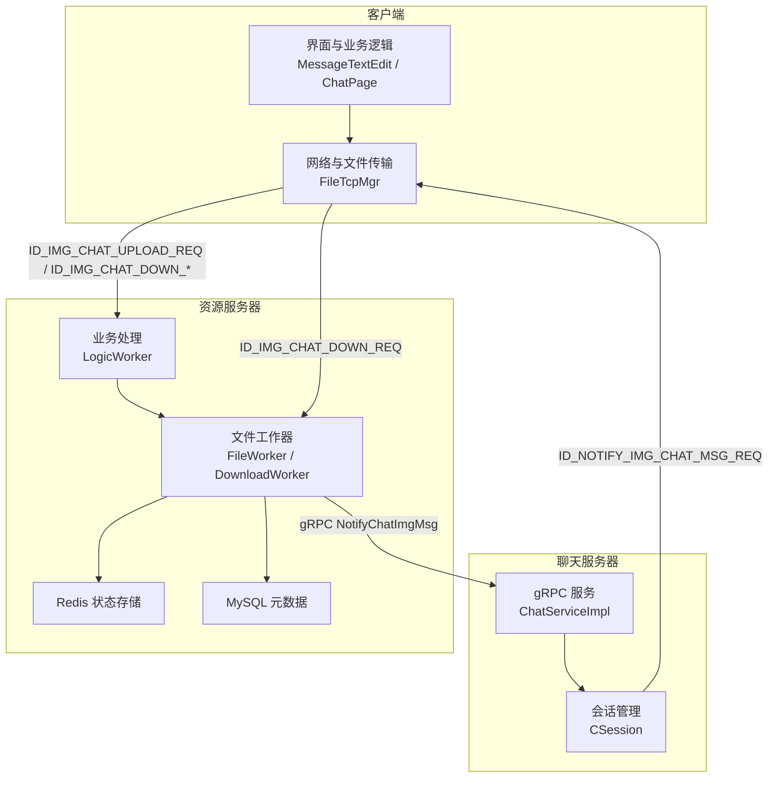
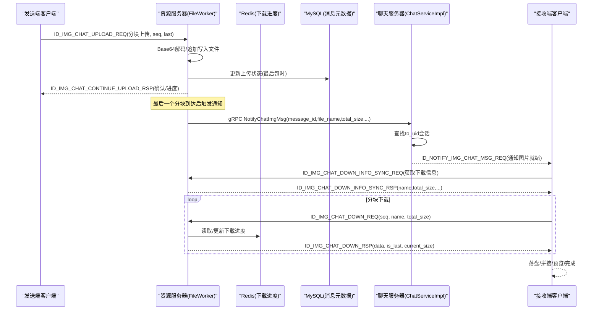
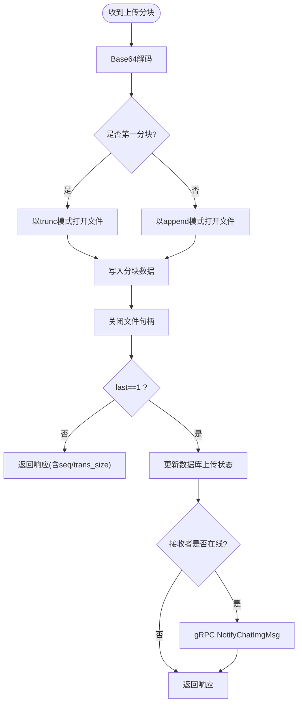
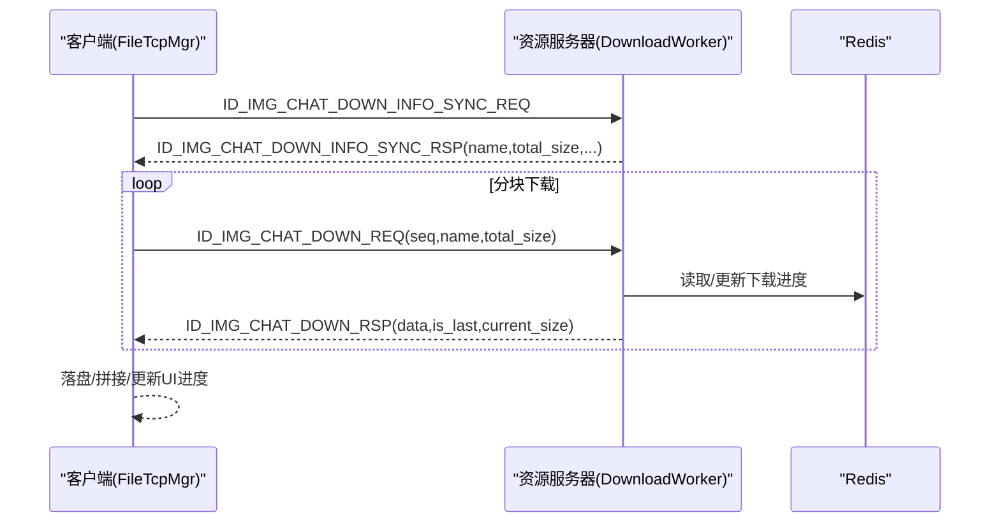
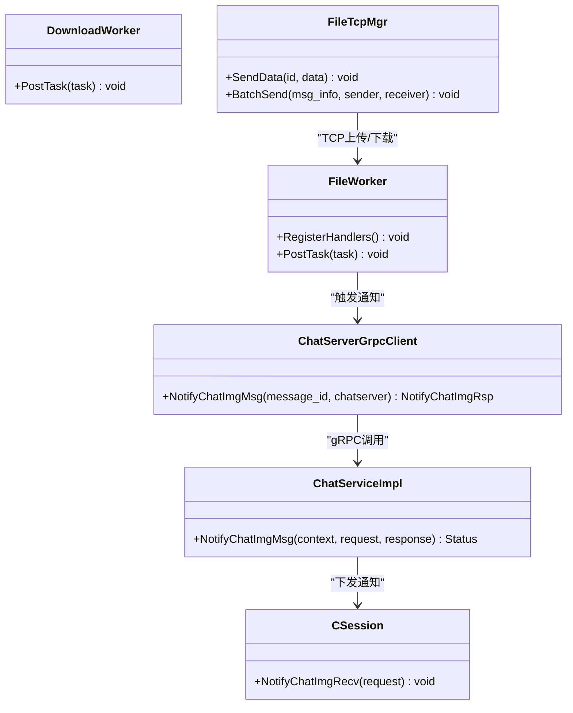

# 图片消息传输流程

<cite>
**本文引用的文件**   
- [chat.proto](file://proto/chat_service/chat.proto)
- [ChatServiceImpl.h](file://server/ChatServer/include/ChatServiceImpl.h)
- [ChatServiceImpl.cpp](file://server/ChatServer/src/ChatServiceImpl.cpp)
- [ChatServerGrpcClient.cpp](file://server/ResourceServer/src/ChatServerGrpcClient.cpp)
- [FileWorker.h](file://server/ResourceServer/include/FileWorker.h)
- [FileWorker.cpp](file://server/ResourceServer/src/FileWorker.cpp)
- [FileInfo.h](file://server/ResourceServer/include/FileInfo.h)
- [global.h](file://client/llfcchat/include/global.h)
- [filetcpmgr.h](file://client/llfcchat/include/filetcpmgr.h)
- [filetcpmgr.cpp](file://client/llfcchat/src/filetcpmgr.cpp)
- [MessageTextEdit.cpp](file://client/llfcchat/src/MessageTextEdit.cpp)
- [chatpage.cpp](file://client/llfcchat/src/chatpage.cpp)
- [day41-通知客户端异步下载聊天图片.md](file://开发文档/day41-通知客户端异步下载聊天图片.md)
- [day38-断点续传.md](file://开发文档/day38-断点续传.md)
- [day40-聊天图片资源续传和进度显示.md](file://开发文档/day40-聊天图片资源续传和进度显示.md)
</cite>

## 目录
1. [简介](#简介)
2. [项目结构](#项目结构)
3. [核心组件](#核心组件)
4. [架构总览](#架构总览)
5. [详细组件分析](#详细组件分析)
6. [依赖关系分析](#依赖关系分析)
7. [性能考量](#性能考量)
8. [故障排查指南](#故障排查指南)
9. [结论](#结论)
10. [附录](#附录)

## 简介
本文件面向LLFCChat系统的“图片消息传输”能力，围绕NotifyChatImgReq与NotifyChatImgRsp的完整数据流进行说明。内容涵盖：
- 图片上传至ResourceServer、分块传输、断点续传机制与进度反馈
- 通过gRPC通知接收方图片已就绪，客户端发起异步下载
- file_name命名规则、total_size校验、message_id关联与图片缓存策略
- 完整的上传/下载时序图、分块协议定义与错误恢复机制
- 大图片处理的性能优化方案与内存管理策略

## 项目结构
与图片消息传输相关的代码分布在以下模块：
- 协议层：proto/chat_service/chat.proto 定义了NotifyChatImgReq/NotifyChatImgRsp及服务接口
- 资源服务器（ResourceServer）：负责图片持久化、分块写入、Redis状态维护、向ChatServer发起gRPC通知
- 聊天服务器（ChatServer）：实现NotifyChatImgMsg回调，转发给在线用户会话
- 客户端（Qt/C++）：负责图片选择、分块上传、断点续传、下载请求、UI进度展示与缓存

图表来源
- [chat.proto:1-105](file://proto/chat_service/chat.proto#L1-L105)
- [ChatServiceImpl.cpp:217-239](file://server/ChatServer/src/ChatServiceImpl.cpp#L217-L239)
- [ChatServerGrpcClient.cpp:1-40](file://server/ResourceServer/src/ChatServerGrpcClient.cpp#L1-L40)
- [FileWorker.cpp:196-280](file://server/ResourceServer/src/FileWorker.cpp#L196-L280)
- [filetcpmgr.cpp:800-895](file://client/llfcchat/src/filetcpmgr.cpp#L800-L895)

章节来源
- [chat.proto:1-105](file://proto/chat_service/chat.proto#L1-L105)
- [ChatServiceImpl.h:1-55](file://server/ChatServer/include/ChatServiceImpl.h#L1-L55)
- [ChatServiceImpl.cpp:1-240](file://server/ChatServer/src/ChatServiceImpl.cpp#L1-L240)
- [ChatServerGrpcClient.cpp:1-40](file://server/ResourceServer/src/ChatServerGrpcClient.cpp#L1-L40)
- [FileWorker.h:1-91](file://server/ResourceServer/include/FileWorker.h#L1-L91)
- [FileWorker.cpp:1-660](file://server/ResourceServer/src/FileWorker.cpp#L1-L660)
- [global.h:79-133](file://client/llfcchat/include/global.h#L79-L133)
- [filetcpmgr.h:1-85](file://client/llfcchat/include/filetcpmgr.h#L1-L85)
- [filetcpmgr.cpp:800-999](file://client/llfcchat/src/filetcpmgr.cpp#L800-L999)

## 核心组件
- gRPC 协议与消息
  - NotifyChatImgReq/NotifyChatImgRsp：包含from_uid、to_uid、message_id、file_name、total_size、thread_id等字段，用于通知接收端图片已就绪并携带下载所需元信息
- 资源服务器（ResourceServer）
  - FileWorker：处理图片上传分块写入、续传、完成后的数据库状态更新与gRPC通知
  - DownloadWorker：按seq分块读取文件、Base64编码返回，维护Redis中的下载断点信息
  - Redis：保存下载进度（name、seq、trans_size、total_size），支持断点续传
  - MySQL：存储聊天消息元数据（sender_id、recv_id、thread_id、content即file_name、status等）
- 聊天服务器（ChatServer）
  - ChatServiceImpl::NotifyChatImgMsg：根据to_uid查找会话，调用CSession::NotifyChatImgRecv将通知下发到客户端
- 客户端（Qt/C++）
  - FileTcpMgr：封装上传/下载请求、拥塞窗口控制、断点续传、进度信号
  - MessageTextEdit：图片选择、MD5计算、唯一文件名生成、插入消息列表
  - ChatPage：下载完成后更新气泡与UI状态

章节来源
- [chat.proto:86-105](file://proto/chat_service/chat.proto#L86-L105)
- [FileWorker.cpp:196-280](file://server/ResourceServer/src/FileWorker.cpp#L196-L280)
- [FileWorker.cpp:525-659](file://server/ResourceServer/src/FileWorker.cpp#L525-L659)
- [ChatServiceImpl.cpp:217-239](file://server/ChatServer/src/ChatServiceImpl.cpp#L217-L239)
- [filetcpmgr.cpp:925-996](file://client/llfcchat/src/filetcpmgr.cpp#L925-L996)
- [MessageTextEdit.cpp:129-176](file://client/llfcchat/src/MessageTextEdit.cpp#L129-L176)
- [chatpage.cpp:348-367](file://client/llfcchat/src/chatpage.cpp#L348-L367)

## 架构总览
下图展示了从发送端上传图片到接收端收到通知并异步下载的端到端流程。

图表来源
- [FileWorker.cpp:196-280](file://server/ResourceServer/src/FileWorker.cpp#L196-L280)
- [FileWorker.cpp:525-659](file://server/ResourceServer/src/FileWorker.cpp#L525-L659)
- [ChatServerGrpcClient.cpp:1-40](file://server/ResourceServer/src/ChatServerGrpcClient.cpp#L1-L40)
- [ChatServiceImpl.cpp:217-239](file://server/ChatServer/src/ChatServiceImpl.cpp#L217-L239)
- [filetcpmgr.cpp:800-895](file://client/llfcchat/src/filetcpmgr.cpp#L800-L895)

## 详细组件分析

### gRPC 协议与消息定义
- NotifyChatImgReq/NotifyChatImgRsp字段说明
  - from_uid/to_uid：发送者/接收者UID
  - message_id：与聊天消息表关联的消息ID
  - file_name：图片文件名（由ResourceServer根据消息元数据填充）
  - total_size：图片总大小（字节）
  - thread_id：会话线程ID
- 服务接口
  - NotifyChatImgMsg：ResourceServer调用，通知ChatServer图片已就绪；ChatServer再推送给接收端

章节来源
- [chat.proto:86-105](file://proto/chat_service/chat.proto#L86-L105)
- [ChatServiceImpl.h:29-55](file://server/ChatServer/include/ChatServiceImpl.h#L29-L55)

### ResourceServer 图片上传与通知
- 上传分块处理
  - 接收ID_IMG_CHAT_UPLOAD_REQ或ID_IMG_CHAT_CONTINUE_UPLOAD_REQ
  - Base64解码后按seq顺序写入文件；首个分块trunc创建，后续append追加
  - last=1时标记完成，更新数据库上传状态
- 通知接收端
  - 查询接收者IP（Redis键USERIPPREFIX+receiver_str）
  - 若在线则通过ChatServerGrpcClient::NotifyChatImgMsg调用ChatServer
  - 构造NotifyChatImgReq：message_id、file_name（来自MySQL content）、from_uid、to_uid、thread_id、total_size（文件系统统计）
- 错误处理
  - 目录创建失败、文件权限、Redis读写异常、RPC失败等均有对应错误码

图表来源
- [FileWorker.cpp:196-280](file://server/ResourceServer/src/FileWorker.cpp#L196-L280)
- [ChatServerGrpcClient.cpp:1-40](file://server/ResourceServer/src/ChatServerGrpcClient.cpp#L1-L40)

章节来源
- [FileWorker.cpp:196-280](file://server/ResourceServer/src/FileWorker.cpp#L196-L280)
- [ChatServerGrpcClient.cpp:1-40](file://server/ResourceServer/src/ChatServerGrpcClient.cpp#L1-L40)

### ChatServer 接收gRPC通知并下发客户端
- 实现NotifyChatImgMsg回调
  - 根据to_uid查找会话
  - 若存在，调用CSession::NotifyChatImgRecv构建JSON并下发ID_NOTIFY_IMG_CHAT_MSG_REQ
  - 回包设置error与message_id
- 未在线情况
  - 直接返回OK（不阻塞上游），等待下次上线后再推送（当前实现为即时通知）

章节来源
- [ChatServiceImpl.cpp:217-239](file://server/ChatServer/src/ChatServiceImpl.cpp#L217-L239)
- [day41-通知客户端异步下载聊天图片.md:217-269](file://开发文档/day41-通知客户端异步下载聊天图片.md#L217-L269)

### 客户端侧：通知处理与异步下载
- 通知处理
  - 解析ID_NOTIFY_IMG_CHAT_MSG_REQ，提取message_id、sender_id、img_name、total_size、thread_id
  - 初始化本地MsgInfo（路径user/{uid}/chatimg/{sender_id}/img_name），设置下载状态与进度
- 下载流程
  - 先请求ID_IMG_CHAT_DOWN_INFO_SYNC_REQ获取name、total_size、msg_type、status等
  - 随后循环发送ID_IMG_CHAT_DOWN_REQ(seq, name, total_size)，直到is_last=1
  - 收到ID_IMG_CHAT_DOWN_RSP后写入本地文件，更新进度信号
- 完成回调
  - ChatPage::DownloadFileFinished更新PictureBubble与数据模型，设置TransferState::Completed

图表来源
- [filetcpmgr.cpp:800-895](file://client/llfcchat/src/filetcpmgr.cpp#L800-L895)
- [FileWorker.cpp:525-659](file://server/ResourceServer/src/FileWorker.cpp#L525-L659)

章节来源
- [filetcpmgr.cpp:800-895](file://client/llfcchat/src/filetcpmgr.cpp#L800-L895)
- [chatpage.cpp:348-367](file://client/llfcchat/src/chatpage.cpp#L348-L367)

### 分块传输协议定义与断点续传
- 上传协议关键字段
  - md5：文件哈希（用于去重/校验）
  - name：唯一文件名（客户端生成）
  - seq：分块序号（从1开始递增）
  - trans_size：累计已传输字节数
  - total_size：文件总大小
  - last：是否为最后一块
  - data：Base64编码的分块数据
  - last_seq：最大序列号（拥塞窗口控制参考）
- 下载协议关键字段
  - seq：请求的分块序号
  - name：文件名
  - total_size：总大小
  - data：Base64编码的分块数据
  - is_last：是否为最后一块
  - current_size：当前累计字节数
- 断点续传
  - 上传：服务端Redis记录name对应的seq与trans_size；客户端根据last_seq与rsp_seqs集合推进
  - 下载：DownloadWorker在Redis中维护下载进度，首次请求建立FileInfo，后续续传校验seq一致性

章节来源
- [day38-断点续传.md:479-1066](file://开发文档/day38-断点续传.md#L479-L1066)
- [day40-聊天图片资源续传和进度显示.md:552-631](file://开发文档/day40-聊天图片资源续传和进度显示.md#L552-L631)
- [FileWorker.cpp:525-659](file://server/ResourceServer/src/FileWorker.cpp#L525-L659)

### file_name命名规则、total_size校验与message_id关联
- file_name命名规则
  - 客户端生成唯一文件名（基于原始名称与MD5），避免冲突
  - 存储路径：AppData/user/{uid}/chatimg/{sender_id}/{file_name}
- total_size校验
  - 上传：客户端计算total_size并在每个分块上报trans_size；服务端校验last与累计大小一致
  - 下载：服务端统计文件大小作为total_size，客户端据此计算进度百分比
- message_id关联
  - 上传完成时更新MySQL中该message_id的状态为已完成
  - 通知与下载均携带message_id，确保消息与资源一一对应

章节来源
- [MessageTextEdit.cpp:129-176](file://client/llfcchat/src/MessageTextEdit.cpp#L129-L176)
- [filetcpmgr.cpp:800-895](file://client/llfcchat/src/filetcpmgr.cpp#L800-L895)
- [FileWorker.cpp:196-280](file://server/ResourceServer/src/FileWorker.cpp#L196-L280)

### 图片缓存策略
- 客户端本地缓存
  - 图片文件按sender_id分目录存放，便于多会话复用
  - 加载历史消息时优先检查本地是否存在，不存在则显示占位图并触发下载
- 服务端缓存
  - Redis用于上传/下载进度与临时状态，过期清理
  - MySQL存储消息元数据与状态，保证持久化

章节来源
- [filetcpmgr.cpp:800-895](file://client/llfcchat/src/filetcpmgr.cpp#L800-L895)
- [FileWorker.cpp:525-659](file://server/ResourceServer/src/FileWorker.cpp#L525-L659)

## 依赖关系分析
- 组件耦合
  - ResourceServer依赖MysqlMgr、RedisMgr、ConfigMgr与ChatServerGrpcClient
  - ChatServer依赖UserMgr、CSession与Redis/Mysql（基础信息查询）
  - 客户端依赖FileTcpMgr、UserMgr、QStandardPaths与UI组件
- 外部依赖
  - gRPC通信（ResourceServer -> ChatServer）
  - TCP/JSON协议（客户端 <-> ResourceServer）
  - Redis（状态与断点）、MySQL（元数据）

图表来源
- [ChatServiceImpl.h:29-55](file://server/ChatServer/include/ChatServiceImpl.h#L29-L55)
- [ChatServiceImpl.cpp:217-239](file://server/ChatServer/src/ChatServiceImpl.cpp#L217-L239)
- [ChatServerGrpcClient.cpp:1-40](file://server/ResourceServer/src/ChatServerGrpcClient.cpp#L1-L40)
- [FileWorker.h:1-91](file://server/ResourceServer/include/FileWorker.h#L1-L91)
- [filetcpmgr.h:1-85](file://client/llfcchat/include/filetcpmgr.h#L1-L85)

章节来源
- [ChatServiceImpl.h:1-55](file://server/ChatServer/include/ChatServiceImpl.h#L1-L55)
- [ChatServiceImpl.cpp:1-240](file://server/ChatServer/src/ChatServiceImpl.cpp#L1-L240)
- [ChatServerGrpcClient.cpp:1-40](file://server/ResourceServer/src/ChatServerGrpcClient.cpp#L1-L40)
- [FileWorker.h:1-91](file://server/ResourceServer/include/FileWorker.h#L1-L91)
- [filetcpmgr.h:1-85](file://client/llfcchat/include/filetcpmgr.h#L1-L85)

## 性能考量
- 分块大小与并发
  - MAX_FILE_LEN决定单分块大小，影响网络吞吐与内存占用
  - 客户端拥塞窗口_cwnd_size限制并发分块数量，避免拥塞
- I/O与编码开销
  - Base64编解码带来CPU开销，建议对超大图片考虑二进制直传或压缩
  - 文件I/O采用顺序追加，减少随机写带来的碎片
- 缓存与内存
  - 使用Redis缓存下载/上传进度，降低重复计算与磁盘访问
  - 客户端预览图缩放到合适尺寸，避免大图渲染导致卡顿
- 断点续传
  - 通过seq与trans_size快速恢复，减少重传成本
  - 下载完成后清理Redis状态，避免脏数据累积

[本节为通用指导，无需特定文件引用]

## 故障排查指南
- 上传失败
  - 检查目录创建与文件权限错误码
  - 核对last标志与累计字节数是否匹配total_size
  - 查看Redis中上传进度是否一致
- 下载失败
  - 校验seq一致性，防止乱序或越界
  - 检查Redis中下载进度是否过期或被覆盖
  - 确认is_last标志与current_size等于total_size
- 通知未达
  - 检查接收者是否在线（Redis USERIPPREFIX键）
  - 确认gRPC连接池与ChatServer地址配置正确
  - 查看ChatServer日志中NotifyChatImgMsg回调执行情况

章节来源
- [FileWorker.cpp:196-280](file://server/ResourceServer/src/FileWorker.cpp#L196-L280)
- [FileWorker.cpp:525-659](file://server/ResourceServer/src/FileWorker.cpp#L525-L659)
- [ChatServerGrpcClient.cpp:1-40](file://server/ResourceServer/src/ChatServerGrpcClient.cpp#L1-L40)
- [ChatServiceImpl.cpp:217-239](file://server/ChatServer/src/ChatServiceImpl.cpp#L217-L239)

## 结论
LLFCChat的图片消息传输通过“分块上传 + Redis断点 + gRPC通知 + 异步下载”的架构实现了高可靠与大文件友好性。NotifyChatImgReq/Rsp贯穿了资源就绪通知与下载元信息传递，配合客户端的拥塞窗口与进度反馈，形成完整的闭环。建议在超大图片场景下引入压缩与二进制直传，进一步优化带宽与CPU消耗。

[本节为总结，无需特定文件引用]

## 附录
- 关键常量与枚举
  - ReqId：ID_NOTIFY_IMG_CHAT_MSG_REQ、ID_IMG_CHAT_DOWN_REQ、ID_IMG_CHAT_DOWN_INFO_SYNC_REQ等
  - ErrorCodes：SUCCESS、ERR_JSON、RPCFailed、FileNotExists等
- 数据结构
  - FileInfo：seq、name、total_size、trans_size、file_path_str
  - ChatImgInfo：sender_id、receiver_id、message_id、img_name

章节来源
- [global.h:79-133](file://client/llfcchat/include/global.h#L79-L133)
- [FileInfo.h:1-26](file://server/ResourceServer/include/FileInfo.h#L1-L26)