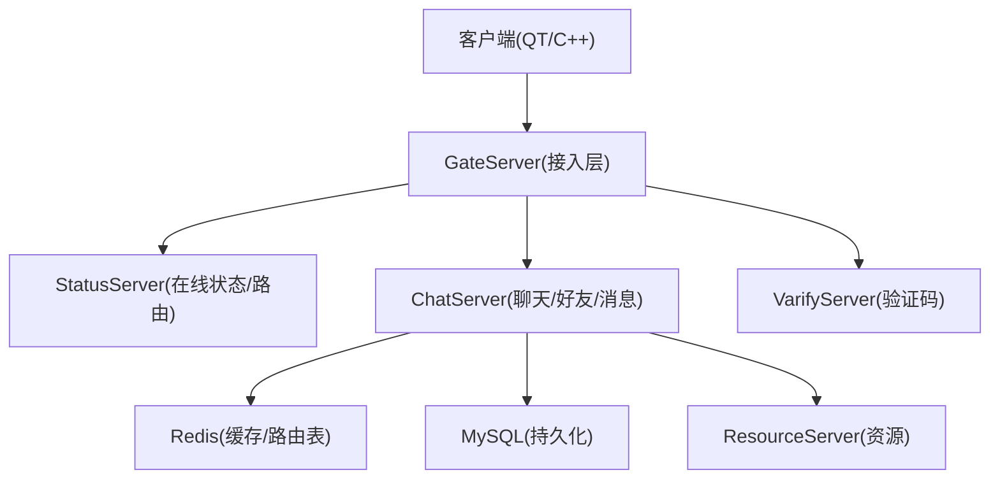
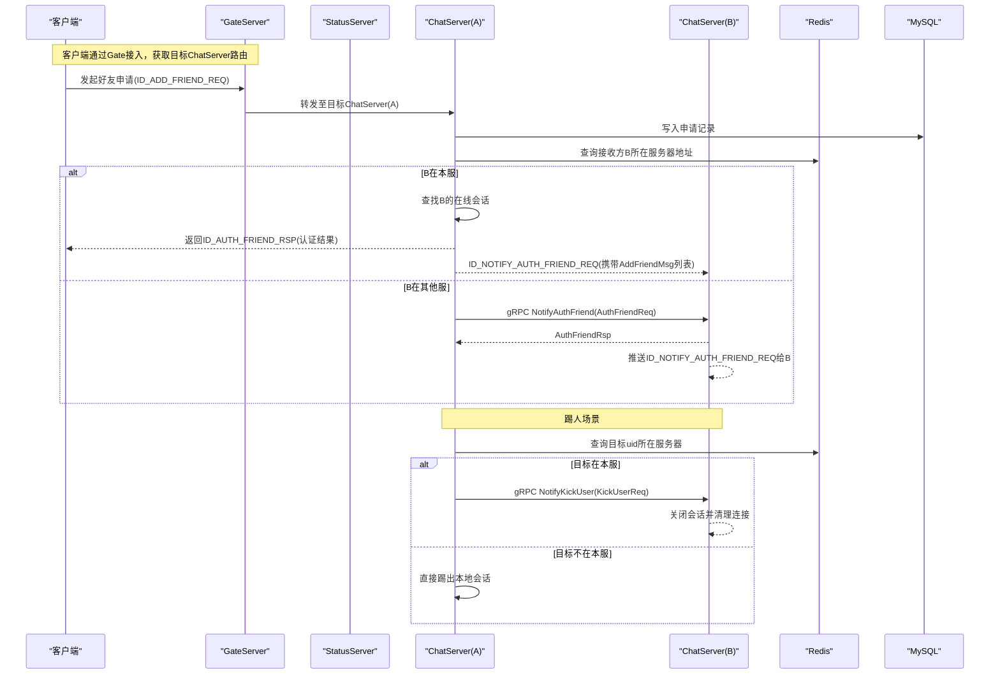
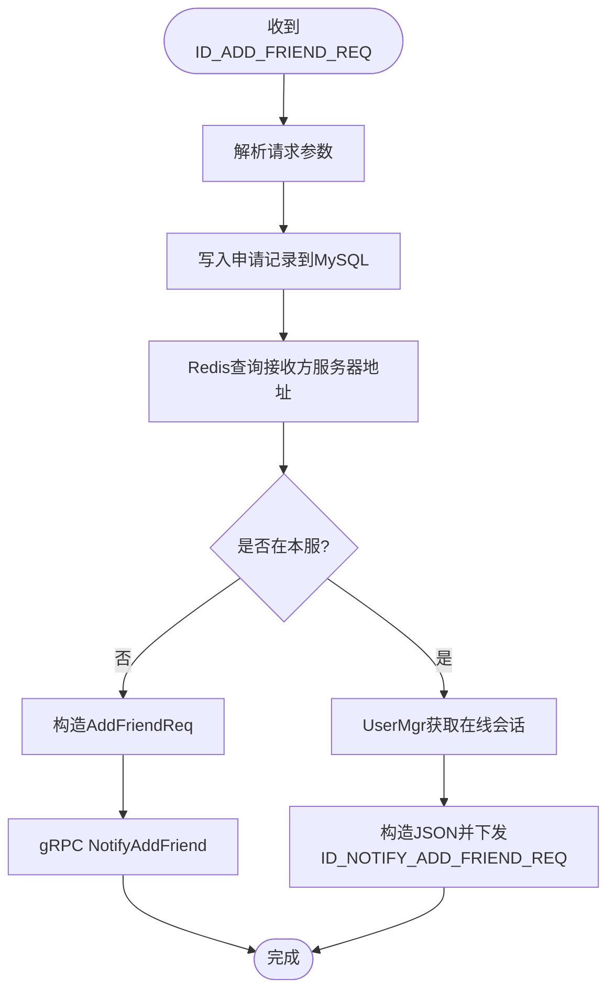
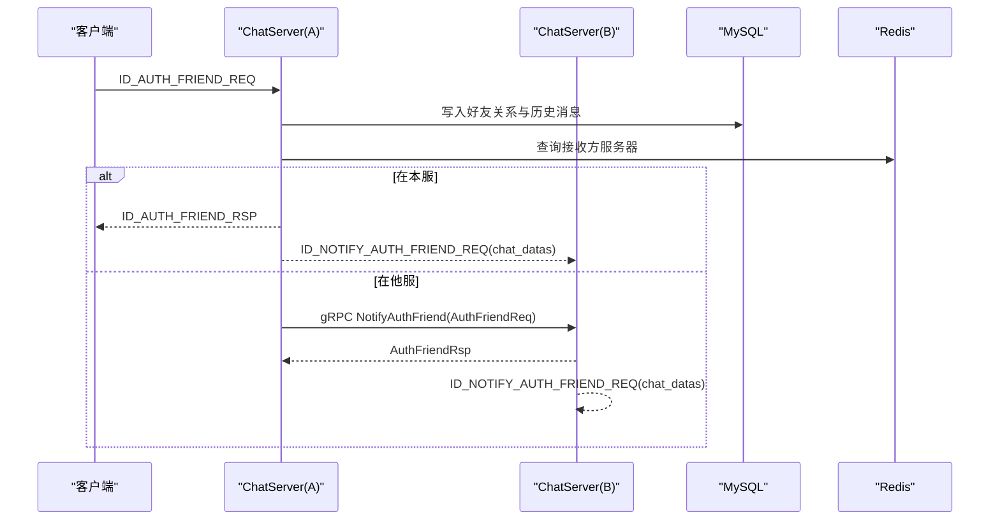
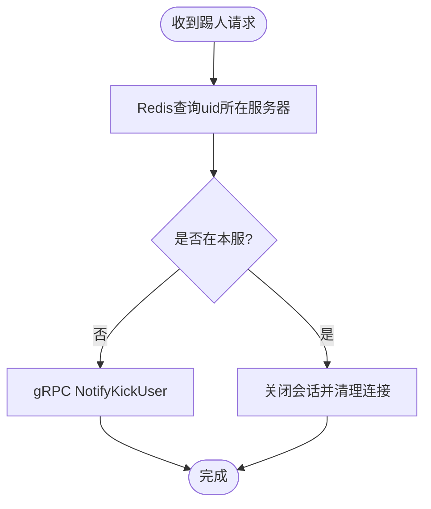
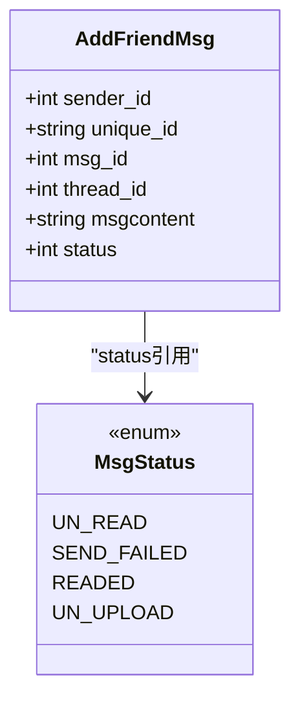
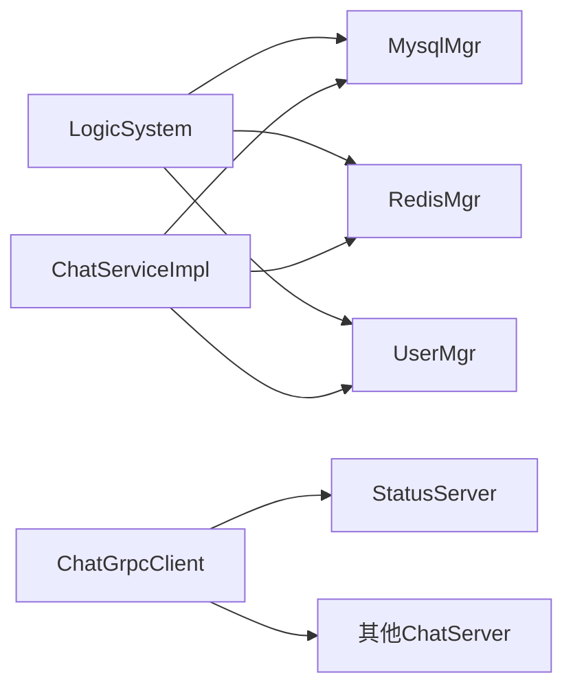

# 好友通知消息流程

<cite>
**本文引用的文件**   
- [chat.proto](file://proto/chat_service/chat.proto)
- [status.proto](file://proto/status_service/status.proto)
- [LogicSystem.h](file://server/ChatServer/include/LogicSystem.h)
- [LogicSystem.cpp](file://server/ChatServer/src/LogicSystem.cpp)
- [ChatServiceImpl.cpp](file://server/ChatServer/src/ChatServiceImpl.cpp)
- [ChatGrpcClient.cpp](file://server/ChatServer/src/ChatGrpcClient.cpp)
- [UserMgr.h](file://server/ChatServer/include/UserMgr.h)
- [MysqlMgr.h](file://server/ChatServer/include/MysqlMgr.h)
- [const.h](file://server/ChatServer/include/const.h)
- [data.h](file://server/ChatServer/include/data.h)
- [applyfriend.h](file://client/llfcchat/include/applyfriend.h)
- [applyfriend.cpp](file://client/llfcchat/src/applyfriend.cpp)
- [day29-好友认证和聊天通信.md](file://开发文档/day29-好友认证和聊天通信.md)
- [day34多服程踢人逻辑.md](file://开发文档/day34多服程踢人逻辑.md)
</cite>

## 目录
1. [引言](#引言)
2. [项目结构](#项目结构)
3. [核心组件](#核心组件)
4. [架构总览](#架构总览)
5. [详细组件分析](#详细组件分析)
6. [依赖关系分析](#依赖关系分析)
7. [性能考量](#性能考量)
8. [故障排查指南](#故障排查指南)
9. [结论](#结论)
10. [附录](#附录)

## 引言
本文件聚焦LLFCChat系统的“好友通知消息”功能，围绕AddFriendReq、AuthFriendReq与KickUserReq三类请求的数据流展开，系统阐述：
- 好友申请验证与跨服务通知
- 认证消息传递与AddFriendMsg结构体使用（unique_id生成、status状态管理）
- 用户被踢出的分布式一致性保证与广播机制
- 在线状态同步、多设备登录冲突处理
- 跨服务通信的可靠性与异常处理策略

## 项目结构
本项目采用多服务架构，关键节点包括：
- 客户端（Qt/C++）：负责UI交互与TCP消息收发
- GateServer：接入层，负责鉴权与路由
- ChatServer：聊天与好友关系核心服务，实现好友申请、认证、消息推送、踢人等逻辑
- StatusServer：在线状态与路由信息维护
- ResourceServer：资源存储与部分数据持久化
- VarifyServer：验证码服务（Node.js）

[本图为概念性结构图，不直接映射具体源码文件]

## 核心组件
- Proto定义：统一消息契约，包含好友申请、认证、文本聊天、图片通知、踢人等接口与数据结构
- ChatServer：
  - LogicSystem：业务编排与消息分发（好友申请、认证、聊天消息）
  - ChatServiceImpl：gRPC服务端实现（跨服通知、本地会话推送）
  - ChatGrpcClient：gRPC客户端封装（跨服调用）
  - UserMgr：在线会话管理（uid->session）
  - MysqlMgr：数据库访问（好友关系、聊天记录）
- StatusServer：提供GetChatServer与Login接口，用于路由与登录态校验
- 客户端：应用层界面与TCP协议处理

**章节来源**
- [chat.proto:1-105](file://proto/chat_service/chat.proto#L1-L105)
- [status.proto:1-32](file://proto/status_service/status.proto#L1-L32)
- [LogicSystem.h:1-60](file://server/ChatServer/include/LogicSystem.h#L1-L60)
- [ChatServiceImpl.cpp:1-240](file://server/ChatServer/src/ChatServiceImpl.cpp#L1-L240)
- [ChatGrpcClient.cpp:143-202](file://server/ChatServer/src/ChatGrpcClient.cpp#L143-L202)
- [UserMgr.h:1-22](file://server/ChatServer/include/UserMgr.h#L1-L22)
- [MysqlMgr.h:1-41](file://server/ChatServer/include/MysqlMgr.h#L1-L41)

## 架构总览
下图展示好友申请、认证与踢人的端到端时序。

**图表来源**
- [LogicSystem.cpp:294-352](file://server/ChatServer/src/LogicSystem.cpp#L294-L352)
- [LogicSystem.cpp:354-470](file://server/ChatServer/src/LogicSystem.cpp#L354-L470)
- [ChatServiceImpl.cpp:16-103](file://server/ChatServer/src/ChatServiceImpl.cpp#L16-L103)
- [ChatGrpcClient.cpp:175-202](file://server/ChatServer/src/ChatGrpcClient.cpp#L175-L202)
- [day34多服程踢人逻辑.md:272-328](file://开发文档/day34多服程踢人逻辑.md#L272-L328)

## 详细组件分析

### AddFriendReq 处理流程（好友申请）
- 触发点：客户端发送ID_ADD_FRIEND_REQ到ChatServer
- 处理步骤：
  - 解析请求参数（fromuid、touid、描述等）
  - 写入申请记录到MySQL
  - 查询Redis中接收方touid所在的ChatServer地址
  - 若接收方在本服：
    - 从UserMgr获取在线会话，构造JSON通知并下发ID_NOTIFY_ADD_FRIEND_REQ
  - 若接收方在他服：
    - 构造AddFriendReq并通过gRPC调用NotifyAddFriend
    - 目标ChatServer收到后，查找在线会话并推送通知

**图表来源**
- [LogicSystem.cpp:294-352](file://server/ChatServer/src/LogicSystem.cpp#L294-L352)
- [ChatServiceImpl.cpp:16-47](file://server/ChatServer/src/ChatServiceImpl.cpp#L16-L47)

**章节来源**
- [chat.proto:15-29](file://proto/chat_service/chat.proto#L15-L29)
- [LogicSystem.cpp:294-352](file://server/ChatServer/src/LogicSystem.cpp#L294-L352)
- [ChatServiceImpl.cpp:16-47](file://server/ChatServer/src/ChatServiceImpl.cpp#L16-L47)

### AuthFriendReq 处理流程（好友认证）
- 触发点：客户端发送ID_AUTH_FRIEND_REQ到ChatServer
- 处理步骤：
  - 解析请求（fromuid、touid、back_name等）
  - 更新好友关系到MySQL，同时读取或生成AddFriendMsg列表（含unique_id、msg_id、thread_id、msgcontent、status）
  - 查询Redis获取接收方服务器地址
  - 若接收方在本服：
    - 构造ID_NOTIFY_AUTH_FRIEND_REQ通知，附带chat_datas数组（每个元素包含sender、msg_id、thread_id、unique_id、msg_content、chat_time、status）
  - 若接收方在他服：
    - 构造AuthFriendReq（textmsgs为AddFriendMsg列表），通过gRPC NotifyAuthFriend推送
    - 目标ChatServer组装JSON并下发ID_NOTIFY_AUTH_FRIEND_REQ

**图表来源**
- [LogicSystem.cpp:354-470](file://server/ChatServer/src/LogicSystem.cpp#L354-L470)
- [ChatServiceImpl.cpp:49-103](file://server/ChatServer/src/ChatServiceImpl.cpp#L49-L103)

**章节来源**
- [chat.proto:32-51](file://proto/chat_service/chat.proto#L32-L51)
- [LogicSystem.cpp:354-470](file://server/ChatServer/src/LogicSystem.cpp#L354-L470)
- [ChatServiceImpl.cpp:49-103](file://server/ChatServer/src/ChatServiceImpl.cpp#L49-L103)

### KickUserReq 处理流程（用户踢出）
- 触发点：管理员或业务逻辑需要踢出某用户
- 处理步骤：
  - 查询Redis获取uid所在ChatServer地址
  - 若目标在本服：
    - 直接关闭会话并清理连接
  - 若目标在他服：
    - 通过gRPC NotifyKickUser通知目标ChatServer执行踢出
  - 目标ChatServer收到后：
    - 查找在线会话，调用NotifyOffline并清除旧连接

**图表来源**
- [ChatGrpcClient.cpp:175-202](file://server/ChatServer/src/ChatGrpcClient.cpp#L175-L202)
- [ChatServiceImpl.cpp:187-210](file://server/ChatServer/src/ChatServiceImpl.cpp#L187-L210)
- [day34多服程踢人逻辑.md:272-328](file://开发文档/day34多服程踢人逻辑.md#L272-L328)

**章节来源**
- [chat.proto:77-84](file://proto/chat_service/chat.proto#L77-L84)
- [ChatGrpcClient.cpp:175-202](file://server/ChatServer/src/ChatGrpcClient.cpp#L175-L202)
- [ChatServiceImpl.cpp:187-210](file://server/ChatServer/src/ChatServiceImpl.cpp#L187-L210)

### AddFriendMsg 结构体使用与状态管理
- 字段说明：
  - sender_id：发送者UID
  - unique_id：消息唯一标识（用于去重与幂等）
  - msg_id：数据库自增消息ID
  - thread_id：聊天线程ID（私聊/群聊）
  - msgcontent：消息内容
  - status：消息状态（未读/已读/发送失败/未上传等）
- 使用场景：
  - 好友认证通过后，将历史消息以AddFriendMsg列表形式随认证通知下发
  - 客户端根据unique_id进行去重，按thread_id组织会话，按status控制显示
- unique_id生成策略：
  - 建议在写入数据库前由上游生成全局唯一ID（如UUID或雪花算法），确保跨设备一致性与幂等
- status状态管理：
  - UN_READ=0，SEND_FAILED=1，READED=2，UN_UPLOAD=3
  - 在消息落库时设置初始状态，客户端回执后更新为已读

**图表来源**
- [chat.proto:32-39](file://proto/chat_service/chat.proto#L32-L39)
- [const.h:96-101](file://server/ChatServer/include/const.h#L96-L101)

**章节来源**
- [chat.proto:32-39](file://proto/chat_service/chat.proto#L32-L39)
- [const.h:96-101](file://server/ChatServer/include/const.h#L96-L101)

### 分布式一致性保证与消息广播机制
- 路由一致性：
  - Redis维护uid->server_ip映射，所有跨服通知均基于该映射，保证消息到达正确实例
- 会话一致性：
  - UserMgr维护uid->session映射，仅对在线会话进行推送；离线则忽略（可结合离线消息队列扩展）
- 消息广播：
  - 同一用户多设备登录时，可在UserMgr中维护多session，遍历推送；当前实现为单session，需扩展支持多设备
- 幂等性：
  - 通过unique_id与msg_id组合，客户端侧去重；服务端落库前检查重复键

**章节来源**
- [UserMgr.h:1-22](file://server/ChatServer/include/UserMgr.h#L1-L22)
- [const.h:81-88](file://server/ChatServer/include/const.h#L81-L88)

### 在线状态同步与多设备登录冲突处理
- 在线状态：
  - StatusServer提供Login接口，GateServer/ChatServer调用以校验token与uid
  - ChatServer通过UserMgr维护在线会话，断线时清理
- 多设备冲突：
  - 当前实现为单会话；建议扩展UserMgr为uid->sessions集合，支持多设备并发
  - 冲突策略：新登录覆盖旧会话，或允许共存但限制敏感操作

**章节来源**
- [status.proto:1-32](file://proto/status_service/status.proto#L1-L32)
- [UserMgr.h:1-22](file://server/ChatServer/include/UserMgr.h#L1-L22)

### 客户端交互与界面集成
- 好友申请界面：
  - ApplyFriend对话框负责输入申请信息与标签选择，提交后通过TCP发送ID_ADD_FRIEND_REQ
- 认证通知处理：
  - 客户端注册ID_NOTIFY_AUTH_FRIEND_REQ处理器，解析chat_datas并渲染认证历史消息

**章节来源**
- [applyfriend.h:1-59](file://client/llfcchat/include/applyfriend.h#L1-L59)
- [applyfriend.cpp:1-200](file://client/llfcchat/src/applyfriend.cpp#L1-L200)
- [day29-好友认证和聊天通信.md:100-420](file://开发文档/day29-好友认证和聊天通信.md#L100-L420)

## 依赖关系分析
- ChatServer内部依赖：
  - LogicSystem依赖MysqlMgr、RedisMgr、UserMgr
  - ChatServiceImpl依赖UserMgr、RedisMgr、MysqlMgr
  - ChatGrpcClient依赖gRPC池与错误码
- 外部依赖：
  - StatusServer：路由与登录态
  - ResourceServer：资源存取
  - VarifyServer：验证码

**图表来源**
- [LogicSystem.h:1-60](file://server/ChatServer/include/LogicSystem.h#L1-L60)
- [ChatServiceImpl.cpp:1-240](file://server/ChatServer/src/ChatServiceImpl.cpp#L1-L240)
- [ChatGrpcClient.cpp:143-202](file://server/ChatServer/src/ChatGrpcClient.cpp#L143-L202)

**章节来源**
- [LogicSystem.h:1-60](file://server/ChatServer/include/LogicSystem.h#L1-L60)
- [ChatServiceImpl.cpp:1-240](file://server/ChatServer/src/ChatServiceImpl.cpp#L1-L240)
- [ChatGrpcClient.cpp:143-202](file://server/ChatServer/src/ChatGrpcClient.cpp#L143-L202)

## 性能考量
- Redis缓存命中率：频繁查询uid->server映射与用户基础信息，应保证高可用与低延迟
- gRPC连接池：复用连接减少握手开销，避免频繁创建销毁
- 批量处理：认证通知中的chat_datas建议批量下发，减少网络往返
- 异步化：数据库写入与消息推送解耦，使用队列缓冲峰值流量
- 内存管理：UserMgr会话映射需定期清理离线会话，防止内存泄漏

[本节为通用指导，不直接分析具体文件]

## 故障排查指南
- RPC失败：
  - 检查ChatGrpcClient的错误码与状态，确认目标服务器可达
  - 日志定位：ErrorCodes::RPCFailed
- 用户未在线：
  - UserMgr.GetSession返回空，确认登录流程与心跳正常
- 消息重复：
  - 检查unique_id生成策略与客户端去重逻辑
- 踢人无效：
  - 确认Redis中uid映射正确，目标ChatServer存活

**章节来源**
- [const.h:5-20](file://server/ChatServer/include/const.h#L5-L20)
- [ChatGrpcClient.cpp:175-202](file://server/ChatServer/src/ChatGrpcClient.cpp#L175-L202)
- [ChatServiceImpl.cpp:187-210](file://server/ChatServer/src/ChatServiceImpl.cpp#L187-L210)

## 结论
LLFCChat的好友通知消息功能通过Proto契约、Redis路由、gRPC跨服通信与MySQL持久化，实现了可靠的好友申请、认证与踢人流程。AddFriendMsg结构体承载认证历史消息，unique_id与status保障幂等与状态一致性。未来可扩展多设备会话支持与离线消息队列，进一步提升用户体验与系统健壮性。

[本节为总结，不直接分析具体文件]

## 附录
- 消息ID常量定义参考：MSG_IDS枚举
- 错误码定义参考：ErrorCodes枚举
- 用户与聊天数据结构参考：UserInfo、ChatMessage、ChatThreadInfo

**章节来源**
- [const.h:49-79](file://server/ChatServer/include/const.h#L49-L79)
- [data.h:4-51](file://server/ChatServer/include/data.h#L4-L51)