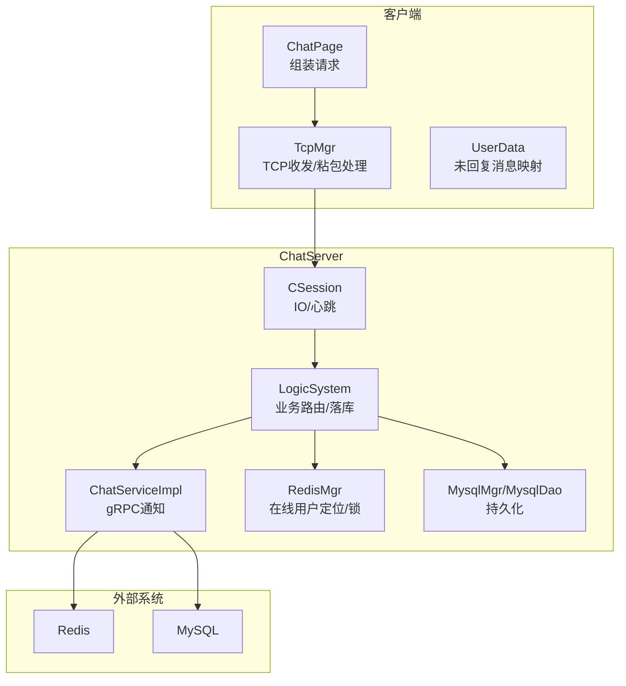
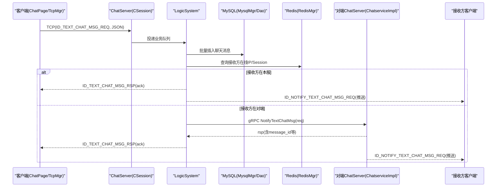
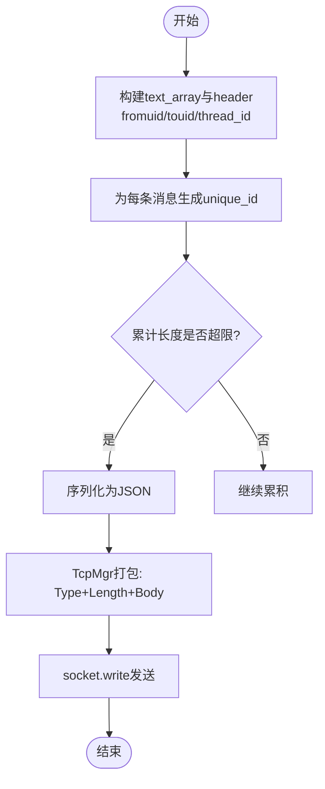
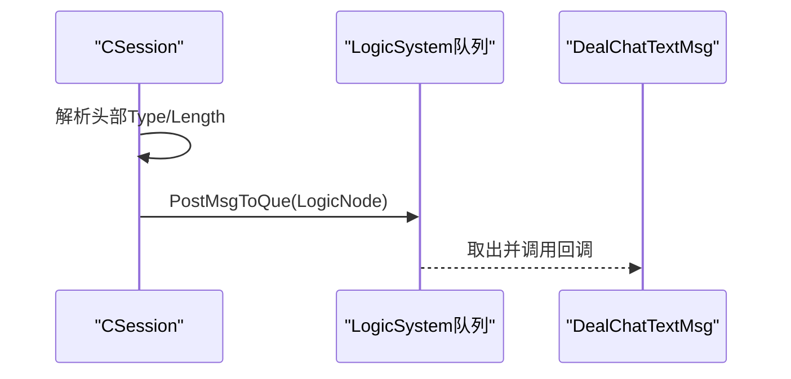
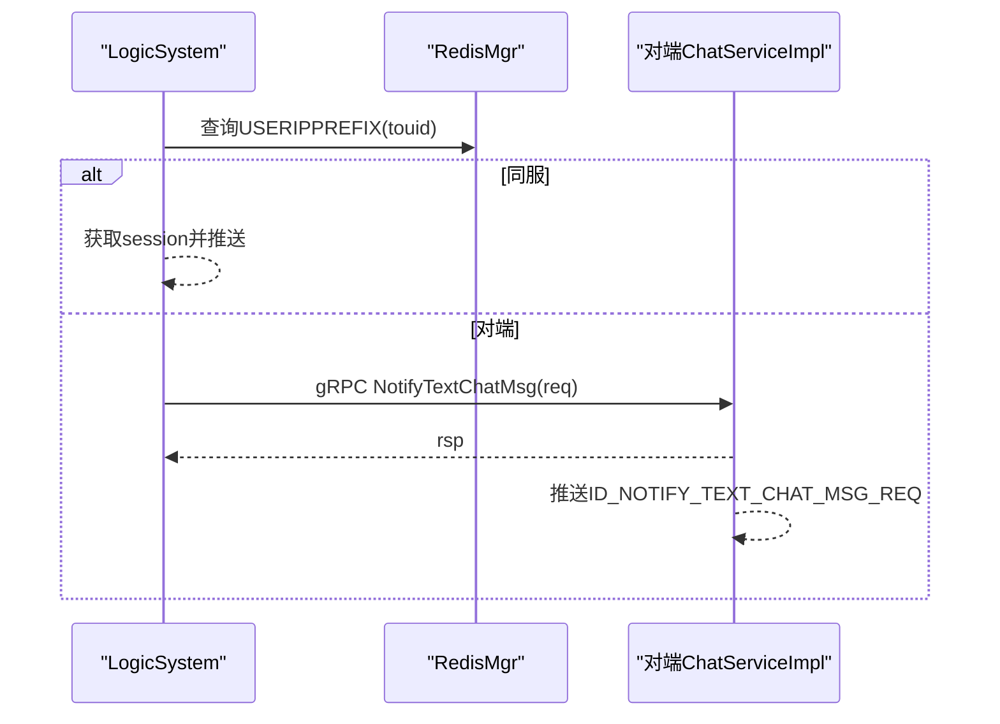
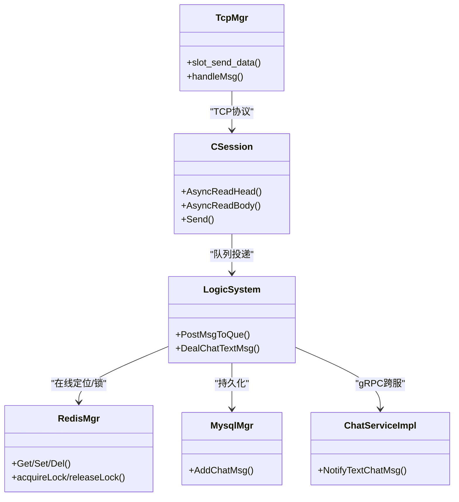

# 文本消息传输流程

<cite>
**本文引用的文件**   
- [chat.proto](file://proto/chat_service/chat.proto)
- [ChatServiceImpl.cpp](file://server/ChatServer/src/ChatServiceImpl.cpp)
- [LogicSystem.cpp](file://server/ChatServer/src/LogicSystem.cpp)
- [CSession.cpp](file://server/ChatServer/src/CSession.cpp)
- [RedisMgr.h](file://server/ChatServer/include/RedisMgr.h)
- [MysqlMgr.h](file://server/ChatServer/include/MysqlMgr.h)
- [MysqlDao.cpp](file://server/ChatServer/src/MysqlDao.cpp)
- [tcpmgr.h](file://client/llfcchat/include/tcpmgr.h)
- [tcpmgr.cpp](file://client/llfcchat/src/tcpmgr.cpp)
- [chatpage.cpp](file://client/llfcchat/src/chatpage.cpp)
- [userdata.cpp](file://client/llfcchat/src/userdata.cpp)
- [const.h](file://server/ChatServer/include/const.h)
- [day29-好友认证和聊天通信.md](file://开发文档/day29-好友认证和聊天通信.md)
- [day37-聊天信息存储方案.md](file://开发文档/day37-聊天信息存储方案.md)
</cite>

## 目录
1. [简介](#简介)
2. [项目结构](#项目结构)
3. [核心组件](#核心组件)
4. [架构总览](#架构总览)
5. [详细组件分析](#详细组件分析)
6. [依赖关系分析](#依赖关系分析)
7. [性能考量](#性能考量)
8. [故障排查指南](#故障排查指南)
9. [结论](#结论)
10. [附录](#附录)

## 简介
本文面向LLFCChat系统的“文本消息传输”能力，围绕客户端到服务端、跨服路由、实时推送与持久化存储的完整数据流进行说明。重点覆盖：
- TextChatMsgReq与TextChatMsgRsp在客户端与服务端之间的处理链路
- 客户端TCP连接建立、消息序列化与发送
- ChatServer的消息路由、MySQL持久化、Redis在线用户定位与即时推送
- TextChatData字段含义、unique_id生成策略、msg_id序列化与thread_id管理
- 消息确认机制、断线重连、消息去重与顺序保证策略
- 端到端时序图与错误处理、重试细节

## 项目结构
本功能涉及客户端（Qt）与服务端（ChatServer、Redis、MySQL）以及跨服务gRPC调用。关键路径如下：
- 客户端：TcpMgr负责TCP粘包/拆包、消息类型+长度头封装；ChatPage负责组装JSON并触发发送；UserData维护未回复消息映射用于状态更新
- 服务端：CSession负责IO与心跳；LogicSystem负责业务路由与落库；ChatServiceImpl实现gRPC接口；RedisMgr提供在线用户定位与分布式锁；MysqlMgr/MysqlDao负责持久化



图表来源
- [chatpage.cpp:427-560](file://client/llfcchat/src/chatpage.cpp#L427-L560)
- [tcpmgr.cpp:1044-1069](file://client/llfcchat/src/tcpmgr.cpp#L1044-L1069)
- [CSession.cpp:130-191](file://server/ChatServer/src/CSession.cpp#L130-L191)
- [LogicSystem.cpp:472-566](file://server/ChatServer/src/LogicSystem.cpp#L472-L566)
- [ChatServiceImpl.cpp:105-139](file://server/ChatServer/src/ChatServiceImpl.cpp#L105-L139)
- [RedisMgr.h:267-305](file://server/ChatServer/include/RedisMgr.h#L267-L305)
- [MysqlMgr.h:8-39](file://server/ChatServer/include/MysqlMgr.h#L8-L39)

章节来源
- [chatpage.cpp:427-560](file://client/llfcchat/src/chatpage.cpp#L427-L560)
- [tcpmgr.cpp:1044-1069](file://client/llfcchat/src/tcpmgr.cpp#L1044-L1069)
- [CSession.cpp:130-191](file://server/ChatServer/src/CSession.cpp#L130-L191)
- [LogicSystem.cpp:472-566](file://server/ChatServer/src/LogicSystem.cpp#L472-L566)
- [ChatServiceImpl.cpp:105-139](file://server/ChatServer/src/ChatServiceImpl.cpp#L105-L139)
- [RedisMgr.h:267-305](file://server/ChatServer/include/RedisMgr.h#L267-L305)
- [MysqlMgr.h:8-39](file://server/ChatServer/include/MysqlMgr.h#L8-L39)

## 核心组件
- 协议定义：TextChatMsgReq、TextChatMsgRsp、TextChatData
- 客户端TCP栈：TcpMgr（粘包/拆包、网络字节序、发送队列）
- 服务端会话层：CSession（异步读写、心跳、异常清理）
- 业务逻辑层：LogicSystem（消息路由、落库、跨服通知）
- gRPC接口：ChatServiceImpl.NotifyTextChatMsg
- 缓存与定位：RedisMgr（在线用户IP/Session、分布式锁）
- 持久化：MysqlMgr/MysqlDao（聊天消息表写入）

章节来源
- [chat.proto:54-74](file://proto/chat_service/chat.proto#L54-L74)
- [tcpmgr.h:22-87](file://client/llfcchat/include/tcpmgr.h#L22-L87)
- [CSession.cpp:130-191](file://server/ChatServer/src/CSession.cpp#L130-L191)
- [LogicSystem.cpp:472-566](file://server/ChatServer/src/LogicSystem.cpp#L472-L566)
- [ChatServiceImpl.cpp:105-139](file://server/ChatServer/src/ChatServiceImpl.cpp#L105-L139)
- [RedisMgr.h:267-305](file://server/ChatServer/include/RedisMgr.h#L267-L305)
- [MysqlMgr.h:8-39](file://server/ChatServer/include/MysqlMgr.h#L8-L39)

## 架构总览
下图展示从客户端发送文本消息到接收方收到消息的端到端流程，包括本地确认、跨服路由、Redis定位、MySQL落库与双向推送。



图表来源
- [chatpage.cpp:427-560](file://client/llfcchat/src/chatpage.cpp#L427-L560)
- [tcpmgr.cpp:1044-1069](file://client/llfcchat/src/tcpmgr.cpp#L1044-L1069)
- [CSession.cpp:130-191](file://server/ChatServer/src/CSession.cpp#L130-L191)
- [LogicSystem.cpp:472-566](file://server/ChatServer/src/LogicSystem.cpp#L472-L566)
- [ChatServiceImpl.cpp:105-139](file://server/ChatServer/src/ChatServiceImpl.cpp#L105-L139)
- [RedisMgr.h:267-305](file://server/ChatServer/include/RedisMgr.h#L267-L305)
- [MysqlMgr.h:8-39](file://server/ChatServer/include/MysqlMgr.h#L8-L39)

## 详细组件分析

### 协议与数据结构
- TextChatData
  - unique_id：客户端生成的唯一标识（UUID字符串），用于客户端侧去重、状态同步与UI绑定
  - msg_id：服务端分配或回传的数据库主键，用于最终确认与幂等
  - msgcontent：文本内容
  - chat_time：时间戳（服务端生成）
- TextChatMsgReq
  - fromuid/touid/thread_id：发送者、接收者与聊天线程ID
  - textmsgs：TextChatData数组
- TextChatMsgRsp
  - error/fromuid/touid/thread_id/textmsgs：响应码与消息元数据（包含服务端回填的message_id等）

章节来源
- [chat.proto:54-74](file://proto/chat_service/chat.proto#L54-L74)
- [day37-聊天信息存储方案.md:3462-3486](file://开发文档/day37-聊天信息存储方案.md#L3462-L3486)

### 客户端发送流程与序列化
- ChatPage将多条文本聚合为JSON，限制单包大小（累计超过阈值即发送）
- 每个文本项附带unique_id（QUuid生成），并加入“未回复”映射以便后续状态更新
- TcpMgr将消息封装为“Type(2B)+Length(2B)+Body”的网络帧，使用大端字节序发送



图表来源
- [chatpage.cpp:427-560](file://client/llfcchat/src/chatpage.cpp#L427-L560)
- [tcpmgr.cpp:1044-1069](file://client/llfcchat/src/tcpmgr.cpp#L1044-L1069)

章节来源
- [chatpage.cpp:427-560](file://client/llfcchat/src/chatpage.cpp#L427-L560)
- [tcpmgr.cpp:1044-1069](file://client/llfcchat/src/tcpmgr.cpp#L1044-L1069)

### 服务端接收与路由
- CSession解析头部（Type/Length）、校验合法性后读取Body，投递至LogicSystem队列
- LogicSystem根据MSG_TYPES注册回调，ID_TEXT_CHAT_MSG_REQ进入DealChatTextMsg处理



图表来源
- [CSession.cpp:130-191](file://server/ChatServer/src/CSession.cpp#L130-L191)
- [LogicSystem.cpp:83-114](file://server/ChatServer/src/LogicSystem.cpp#L83-L114)

章节来源
- [CSession.cpp:130-191](file://server/ChatServer/src/CSession.cpp#L130-L191)
- [LogicSystem.cpp:83-114](file://server/ChatServer/src/LogicSystem.cpp#L83-L114)

### 消息落库与应答
- DealChatTextMsg将text_array转为ChatMessage列表，设置chat_time/sender/recv/status/type等，批量插入MySQL
- 构造ID_TEXT_CHAT_MSG_RSP返回给发送方，包含message_id等信息用于客户端确认

章节来源
- [LogicSystem.cpp:472-566](file://server/ChatServer/src/LogicSystem.cpp#L472-L566)
- [MysqlMgr.h:8-39](file://server/ChatServer/include/MysqlMgr.h#L8-L39)
- [MysqlDao.cpp:1078-1102](file://server/ChatServer/src/MysqlDao.cpp#L1078-L1102)

### 跨服路由与Redis定位
- LogicSystem通过Redis查询touid对应的服务器名称/IP
- 若在同服：直接通过UserMgr获取session并推送ID_NOTIFY_TEXT_CHAT_MSG_REQ
- 若在对端：构造TextChatMsgReq并通过ChatGrpcClient调用NotifyTextChatMsg，对端ChatServiceImpl查找session并推送



图表来源
- [LogicSystem.cpp:527-566](file://server/ChatServer/src/LogicSystem.cpp#L527-L566)
- [ChatServiceImpl.cpp:105-139](file://server/ChatServer/src/ChatServiceImpl.cpp#L105-L139)
- [RedisMgr.h:267-305](file://server/ChatServer/include/RedisMgr.h#L267-L305)

章节来源
- [LogicSystem.cpp:527-566](file://server/ChatServer/src/LogicSystem.cpp#L527-L566)
- [ChatServiceImpl.cpp:105-139](file://server/ChatServer/src/ChatServiceImpl.cpp#L105-L139)
- [RedisMgr.h:267-305](file://server/ChatServer/include/RedisMgr.h#L267-L305)

### 客户端接收与确认
- 客户端注册ID_TEXT_CHAT_MSG_RSP处理器，解析error与textmsgs，按unique_id匹配未回复消息，更新msg_id与送达状态
- 对于ID_NOTIFY_TEXT_CHAT_MSG_REQ，渲染对方消息并更新本地状态

章节来源
- [day29-好友认证和聊天通信.md:984-1016](file://开发文档/day29-好友认证和聊天通信.md#L984-L1016)
- [tcpmgr.h:75-86](file://client/llfcchat/include/tcpmgr.h#L75-L86)

### thread_id管理与去重策略
- thread_id由私聊创建流程确定（存在则复用，不存在则新建并关联private_chat）
- unique_id用于客户端侧去重与状态映射；服务端以message_id作为幂等键
- 客户端在未收到ACK前维持_unrsp_map，收到ACK后迁移至已确认映射

章节来源
- [day37-聊天信息存储方案.md:1081-1124](file://开发文档/day37-聊天信息存储方案.md#L1081-L1124)
- [userdata.cpp:49-68](file://client/llfcchat/src/userdata.cpp#L49-L68)

### 消息确认机制、断线重连与顺序保证
- 确认机制：客户端发送时记录unique_id→未回复映射；收到ID_TEXT_CHAT_MSG_RSP后按unique_id更新msg_id与状态
- 断线重连：TcpMgr监听连接事件与错误，断开后重建连接；服务端CSession心跳超时清理并释放资源
- 顺序保证：同一会话内按发送顺序投递；服务端落库使用自增ID，跨服通过gRPC顺序返回；客户端按unique_id映射恢复顺序

章节来源
- [tcpmgr.cpp:1019-1069](file://client/llfcchat/src/tcpmgr.cpp#L1019-L1069)
- [CSession.cpp:285-335](file://server/ChatServer/src/CSession.cpp#L285-L335)
- [LogicSystem.cpp:472-566](file://server/ChatServer/src/LogicSystem.cpp#L472-L566)

## 依赖关系分析
- 客户端依赖：Qt网络模块、Json序列化、UserData状态管理
- 服务端依赖：Boost.Asio、hiredis、MySQL Connector/C++、gRPC
- 关键耦合点：
  - CSession与LogicSystem通过队列解耦
  - LogicSystem与Redis/Mysql/GRPC多后端交互
  - 客户端TcpMgr与服务端CSession遵循相同“Type+Length+Body”协议



图表来源
- [tcpmgr.h:22-87](file://client/llfcchat/include/tcpmgr.h#L22-L87)
- [CSession.cpp:130-191](file://server/ChatServer/src/CSession.cpp#L130-L191)
- [LogicSystem.cpp:83-114](file://server/ChatServer/src/LogicSystem.cpp#L83-L114)
- [RedisMgr.h:267-305](file://server/ChatServer/include/RedisMgr.h#L267-L305)
- [MysqlMgr.h:8-39](file://server/ChatServer/include/MysqlMgr.h#L8-L39)
- [ChatServiceImpl.cpp:105-139](file://server/ChatServer/src/ChatServiceImpl.cpp#L105-L139)

章节来源
- [tcpmgr.h:22-87](file://client/llfcchat/include/tcpmgr.h#L22-L87)
- [CSession.cpp:130-191](file://server/ChatServer/src/CSession.cpp#L130-L191)
- [LogicSystem.cpp:83-114](file://server/ChatServer/src/LogicSystem.cpp#L83-L114)
- [RedisMgr.h:267-305](file://server/ChatServer/include/RedisMgr.h#L267-L305)
- [MysqlMgr.h:8-39](file://server/ChatServer/include/MysqlMgr.h#L8-L39)
- [ChatServiceImpl.cpp:105-139](file://server/ChatServer/src/ChatServiceImpl.cpp#L105-L139)

## 性能考量
- 客户端聚合发送：按1024字节阈值批量发送，减少小包开销
- 服务端异步IO：CSession使用Boost.Asio异步读写，避免阻塞
- 队列解耦：LogicSystem独立消费线程，削峰填谷
- 连接池：Redis与MySQL均使用连接池，降低握手成本
- 推送优化：同服直推，跨服仅一次gRPC转发

[本节为通用指导，不直接分析具体文件]

## 故障排查指南
- 客户端连接失败/断开：检查TcpMgr信号槽与错误处理；确认网络可达与端口配置
- 消息未达：核对ID_TEXT_CHAT_MSG_RSP是否返回且error=Success；检查客户端unrsp映射是否被正确清理
- 跨服推送失败：检查Redis中USERIPPREFIX是否存在；确认对端ChatServiceImpl能获取session并推送
- 心跳超时：CSession检测心跳过期并清理会话；检查客户端心跳间隔与阈值
- 分布式锁：登录踢人与异常清理使用Redis锁，确保并发安全

章节来源
- [tcpmgr.cpp:1019-1069](file://client/llfcchat/src/tcpmgr.cpp#L1019-L1069)
- [CSession.cpp:285-335](file://server/ChatServer/src/CSession.cpp#L285-L335)
- [RedisMgr.h:267-305](file://server/ChatServer/include/RedisMgr.h#L267-L305)
- [const.h:49-79](file://server/ChatServer/include/const.h#L49-L79)

## 结论
LLFCChat的文本消息传输链路通过“客户端聚合发送—服务端异步IO—队列解耦—MySQL落库—Redis定位—gRPC跨服—双向推送”的架构实现了高可靠、低延迟与可扩展性。unique_id与msg_id分别承担客户端去重与服务端幂等，thread_id保障会话一致性。结合心跳、分布式锁与连接池，系统在异常场景下具备良好鲁棒性。

[本节为总结，不直接分析具体文件]

## 附录

### 端到端时序图（含错误处理与重试）
```mermaid
sequenceDiagram
participant C as "客户端"
participant T as "TcpMgr"
participant S as "CSession"
participant L as "LogicSystem"
participant D as "MySQL"
participant R as "Redis"
participant P as "对端ChatServiceImpl"
participant B as "接收方客户端"
C->>T : 组装JSON(text_array/header)
T->>S : TCP(ID_TEXT_CHAT_MSG_REQ)
S->>L : 投递队列
L->>D : 批量插入消息
L->>R : 查询接收方在线
alt 同服
L-->>C : ID_TEXT_CHAT_MSG_RSP(ack)
L-->>B : ID_NOTIFY_TEXT_CHAT_MSG_REQ
else 对端
L->>P : gRPC NotifyTextChatMsg
P-->>L : rsp
L-->>C : ID_TEXT_CHAT_MSG_RSP(ack)
P-->>B : ID_NOTIFY_TEXT_CHAT_MSG_REQ
end
Note over C,B : 客户端按unique_id更新状态; 若超时未收到ack可重试
```

图表来源
- [chatpage.cpp:427-560](file://client/llfcchat/src/chatpage.cpp#L427-L560)
- [tcpmgr.cpp:1044-1069](file://client/llfcchat/src/tcpmgr.cpp#L1044-L1069)
- [CSession.cpp:130-191](file://server/ChatServer/src/CSession.cpp#L130-L191)
- [LogicSystem.cpp:472-566](file://server/ChatServer/src/LogicSystem.cpp#L472-L566)
- [ChatServiceImpl.cpp:105-139](file://server/ChatServer/src/ChatServiceImpl.cpp#L105-L139)
- [RedisMgr.h:267-305](file://server/ChatServer/include/RedisMgr.h#L267-L305)
- [MysqlMgr.h:8-39](file://server/ChatServer/include/MysqlMgr.h#L8-L39)