# 聊天消息数据流

<cite>
**本文引用的文件**   
- [README.md](file://README.md)
- [chat.proto](file://proto/chat_service/chat.proto)
- [tcpmgr.h](file://client/llfcchat/include/tcpmgr.h)
- [tcpmgr.cpp](file://client/llfcchat/src/tcpmgr.cpp)
- [CSession.h](file://server/ChatServer/include/CSession.h)
- [RedisMgr.h](file://server/ChatServer/include/RedisMgr.h)
- [MysqlDao.h](file://server/ChatServer/include/MysqlDao.h)
- [LogicSystem.h](file://server/ChatServer/include/LogicSystem.h)
- [data.h](file://server/ChatServer/include/data.h)
- [const.h](file://server/ChatServer/include/const.h)
</cite>

## 目录
1. [简介](#简介)
2. [项目结构](#项目结构)
3. [核心组件](#核心组件)
4. [架构总览](#架构总览)
5. [详细组件分析](#详细组件分析)
6. [依赖分析](#依赖分析)
7. [性能考虑](#性能考虑)
8. [故障排查指南](#故障排查指南)
9. [结论](#结论)
10. [附录](#附录)

## 简介
本设计文档聚焦LLFCChat系统的聊天消息数据流，覆盖文本、图片、文件三类消息的端到端传输流程。内容涵盖客户端TCP连接建立、消息序列化与粘包处理、ChatServer路由转发、Redis实时推送与缓存同步、MySQL持久化存储；并详细说明消息确认机制、断线重连、消息去重与顺序保证策略。文档包含关键时序图、状态转换图与性能优化建议，重点解释双向通信协议、心跳检测、消息队列使用及缓存同步策略，同时记录不同消息类型的处理差异与特殊场景处理逻辑。

## 项目结构
系统由Qt客户端与服务端多进程组成：
- 客户端（Qt）：负责UI、TCP连接管理、消息收发与本地展示。
- ChatServer：基于Boost.Asio的高并发TCP服务器，负责会话管理、业务路由、Redis推送与MySQL持久化。
- 其他服务（Gate/Status/Resource等）：提供网关、状态、资源下载等能力（本文聚焦ChatServer）。

```mermaid
graph TB
subgraph "客户端"
UI["界面层"]
TCP["TcpMgr<br/>QTcpSocket"]
end
subgraph "服务端"
ASIO["AsioIOServicePool<br/>事件循环"]
SESSION["CSession<br/>会话/心跳/读写"]
LOGIC["LogicSystem<br/>消息路由/业务处理"]
REDIS["RedisMgr<br/>连接池/推送"]
MYSQL["MysqlDao<br/>连接池/持久化"]
end
UI --> TCP
TCP < --> ASIO
ASIO --> SESSION
SESSION --> LOGIC
LOGIC --> REDIS
LOGIC --> MYSQL
```

图表来源
- [tcpmgr.h:22-87](file://client/llfcchat/include/tcpmgr.h#L22-L87)
- [CSession.h:28-76](file://server/ChatServer/include/CSession.h#L28-L76)
- [LogicSystem.h:17-58](file://server/ChatServer/include/LogicSystem.h#L17-L58)
- [RedisMgr.h:267-305](file://server/ChatServer/include/RedisMgr.h#L267-L305)
- [MysqlDao.h:236-267](file://server/ChatServer/include/MysqlDao.h#L236-L267)

章节来源
- [README.md:1-112](file://README.md#L1-L112)

## 核心组件
- 客户端TCP管理器（TcpMgr）
  - 职责：封装QTcpSocket，实现粘包/拆包、发送队列、错误处理、信号回调分发。
  - 关键点：头部长度解析、发送缓冲与异步写入、断开重连触发点。
- 服务端会话（CSession）
  - 职责：维护单个TCP会话，处理读头/读体、心跳过期检测、离线通知、图片消息通知。
  - 关键点：异步读写、发送队列与锁、心跳时间戳。
- 业务逻辑系统（LogicSystem）
  - 职责：消息路由、注册回调、线程工作队列、调用Redis/MySQL/GPRC。
  - 关键点：按msg_type分派处理器、批量消息处理、线程安全队列。
- Redis管理器（RedisMgr）
  - 职责：连接池、PING保活、分布式锁、计数统计、键值操作。
  - 关键点：连接健康检查与自动重连、原子性命令。
- MySQL访问层（MysqlDao）
  - 职责：连接池、SQL执行、分页查询、消息落库。
  - 关键点：连接存活检测、失败重试、事务边界（由上层控制）。

章节来源
- [tcpmgr.h:22-87](file://client/llfcchat/include/tcpmgr.h#L22-L87)
- [tcpmgr.cpp:1-200](file://client/llfcchat/src/tcpmgr.cpp#L1-L200)
- [CSession.h:28-76](file://server/ChatServer/include/CSession.h#L28-L76)
- [LogicSystem.h:17-58](file://server/ChatServer/include/LogicSystem.h#L17-L58)
- [RedisMgr.h:267-305](file://server/ChatServer/include/RedisMgr.h#L267-L305)
- [MysqlDao.h:236-267](file://server/ChatServer/include/MysqlDao.h#L236-L267)

## 架构总览
整体采用“客户端TCP + 服务端Asio + 逻辑队列 + Redis/MySQL”的分层架构。消息以自定义二进制协议在TCP上传输，服务端通过LogicSystem进行路由，再经Redis进行实时推送与缓存同步，最终持久化到MySQL。

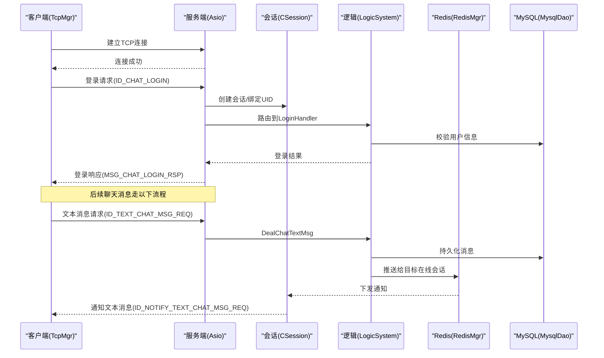

图表来源
- [const.h:49-79](file://server/ChatServer/include/const.h#L49-L79)
- [LogicSystem.h:28-50](file://server/ChatServer/include/LogicSystem.h#L28-L50)
- [MysqlDao.h:260-267](file://server/ChatServer/include/MysqlDao.h#L260-L267)
- [RedisMgr.h:273-284](file://server/ChatServer/include/RedisMgr.h#L273-L284)

## 详细组件分析

### 客户端TCP管理器（TcpMgr）
- 粘包/拆包
  - 读取时先解析固定长度的头部（消息类型+长度），再按长度读取消息体，避免粘包。
- 发送队列
  - 使用QQueue缓存待发送数据，bytesWritten回调驱动逐块发送，避免阻塞。
- 错误与断开
  - 监听error/disconnected信号，统一上报sig_connection_closed供上层重连。
- 消息分发
  - handleMsg根据ReqId将数据交给已注册的回调函数处理。

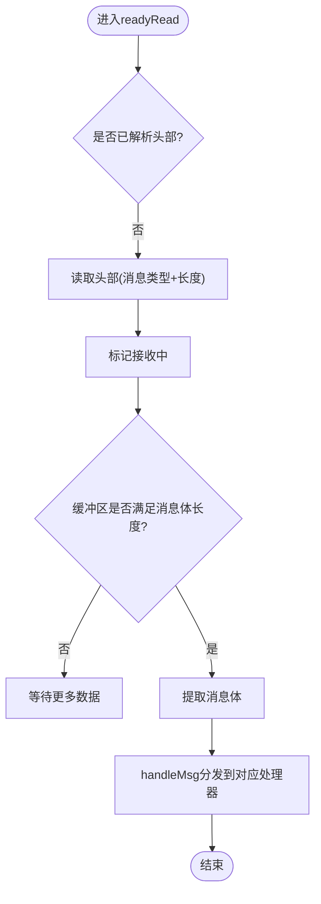

图表来源
- [tcpmgr.cpp:18-55](file://client/llfcchat/src/tcpmgr.cpp#L18-L55)

章节来源
- [tcpmgr.h:22-87](file://client/llfcchat/include/tcpmgr.h#L22-L87)
- [tcpmgr.cpp:1-200](file://client/llfcchat/src/tcpmgr.cpp#L1-L200)

### 服务端会话（CSession）
- 异步读写
  - AsyncReadHead/AsyncReadBody配合状态机完成头部与消息体的分步读取。
- 心跳检测
  - IsHeartbeatExpired/UpdateHeartbeat维护_last_heartbeat，超时则触发异常处理。
- 发送队列
  - _send_que与_handleWrite确保有序、非阻塞发送。
- 图片消息通知
  - NotifyChatImgRecv用于向客户端下发图片消息通知（文件名、大小、thread_id等）。

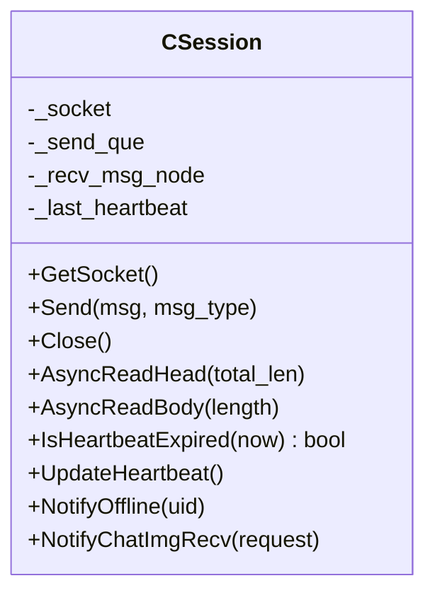

图表来源
- [CSession.h:28-76](file://server/ChatServer/include/CSession.h#L28-L76)

章节来源
- [CSession.h:28-76](file://server/ChatServer/include/CSession.h#L28-L76)

### 业务逻辑系统（LogicSystem）
- 消息路由
  - RegisterCallBacks注册各msg_type对应的处理器，如DealChatTextMsg、DealChatImgMsg、HeartBeatHandler等。
- 工作队列
  - PostMsgToQue将网络I/O线程收到的消息入队，单线程DealMsg消费，保证顺序与一致性。
- 典型流程
  - 文本消息：DealChatTextMsg -> MysqlDao.AddChatMsg -> RedisMgr.LPush/RPush -> 推送给目标会话。
  - 图片消息：DealChatImgMsg -> 资源服务交互 -> Redis通知 -> 客户端异步下载。

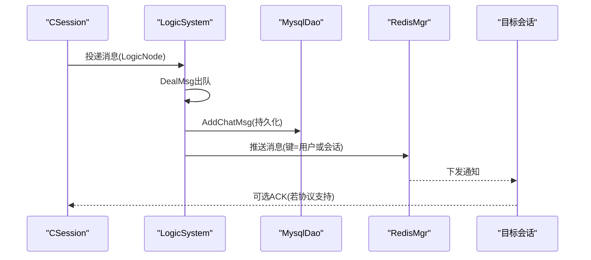

图表来源
- [LogicSystem.h:22-50](file://server/ChatServer/include/LogicSystem.h#L22-L50)
- [MysqlDao.h:260-267](file://server/ChatServer/include/MysqlDao.h#L260-L267)
- [RedisMgr.h:273-284](file://server/ChatServer/include/RedisMgr.h#L273-L284)

章节来源
- [LogicSystem.h:17-58](file://server/ChatServer/include/LogicSystem.h#L17-L58)

### Redis管理器（RedisMgr）
- 连接池
  - RedisConPool维护多个redisContext，周期性PING保活，失败自动重建。
- 常用接口
  - Get/Set/LPush/RPush/HSet/HDel/Del/ExistsKey等。
- 分布式锁
  - acquireLock/releaseLock基于Redis原子操作实现。
- 计数与统计
  - IncreaseCount/DecreaseCount用于服务实例计数等。

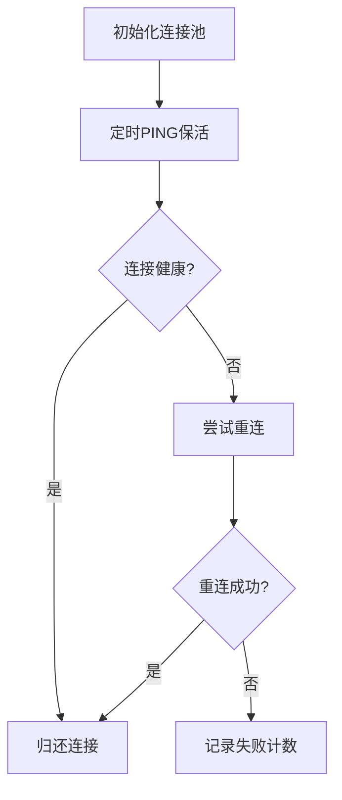

图表来源
- [RedisMgr.h:112-206](file://server/ChatServer/include/RedisMgr.h#L112-L206)

章节来源
- [RedisMgr.h:9-305](file://server/ChatServer/include/RedisMgr.h#L9-L305)

### MySQL访问层（MysqlDao）
- 连接池
  - MySqlPool维护sql::Connection，定期SELECT 1保活，失败重建。
- 消息持久化
  - AddChatMsg/AddChatMsg(vector)批量插入，LoadChatMsg分页加载，CreatePrivateChat创建私聊会话。
- 查询接口
  - GetUserThreads/LoadChatMsg返回PageResult（含next_cursor用于分页）。

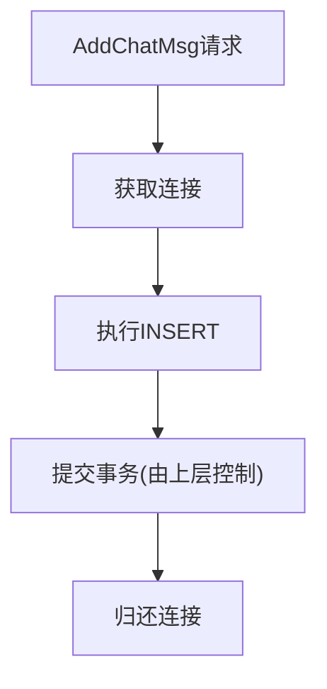

图表来源
- [MysqlDao.h:125-145](file://server/ChatServer/include/MysqlDao.h#L125-L145)

章节来源
- [MysqlDao.h:25-267](file://server/ChatServer/include/MysqlDao.h#L25-L267)

### 协议与消息类型
- 协议定义
  - chat.proto定义了跨服务RPC接口与消息结构，包括文本消息、图片消息通知、好友认证、踢人等。
- 消息类型
  - data.h中的ChatMsgType枚举区分TEXT/PIC/VIDEO/FILE，影响处理路径与存储格式。
- 消息类型
  - const.h中MSG_TYPES定义了客户端-服务端消息类型映射，用于路由与分发。

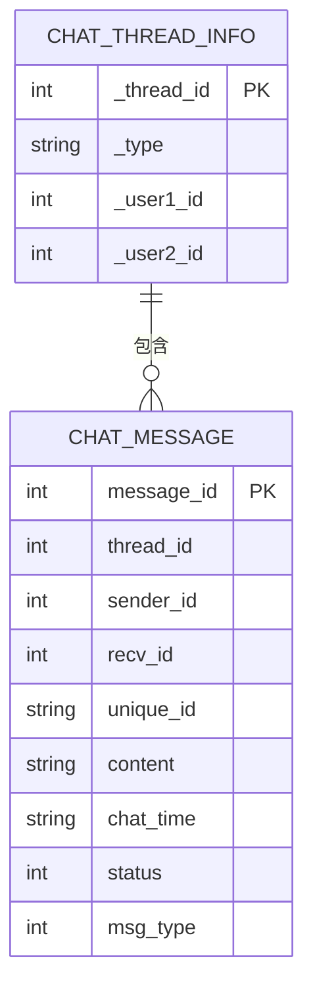

图表来源
- [data.h:32-65](file://server/ChatServer/include/data.h#L32-L65)

章节来源
- [chat.proto:1-105](file://proto/chat_service/chat.proto#L1-L105)
- [data.h:32-65](file://server/ChatServer/include/data.h#L32-L65)
- [const.h:49-79](file://server/ChatServer/include/const.h#L49-L79)

### 文本消息完整流程
- 客户端发送
  - TcpMgr.SendData组装请求（ID_TEXT_CHAT_MSG_REQ），写入TCP。
- 服务端处理
  - CSession异步读取 -> LogicSystem.DealChatTextMsg -> MysqlDao.AddChatMsg -> RedisMgr推送。
- 目标客户端接收
  - CSession.NotifyChatImgRecv类似逻辑下发通知（文本为ID_NOTIFY_TEXT_CHAT_MSG_REQ）。

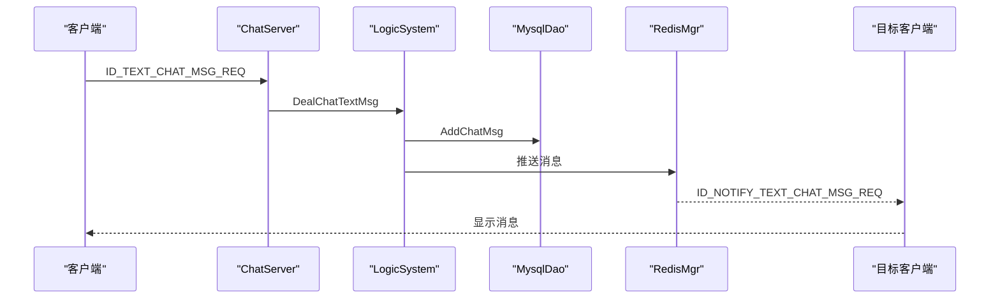

图表来源
- [const.h:60-62](file://server/ChatServer/include/const.h#L60-L62)
- [LogicSystem.h:32-33](file://server/ChatServer/include/LogicSystem.h#L32-L33)
- [MysqlDao.h:262-263](file://server/ChatServer/include/MysqlDao.h#L262-L263)
- [RedisMgr.h:275-278](file://server/ChatServer/include/RedisMgr.h#L275-L278)

章节来源
- [const.h:60-62](file://server/ChatServer/include/const.h#L60-L62)
- [LogicSystem.h:32-33](file://server/ChatServer/include/LogicSystem.h#L32-L33)
- [MysqlDao.h:262-263](file://server/ChatServer/include/MysqlDao.h#L262-L263)
- [RedisMgr.h:275-278](file://server/ChatServer/include/RedisMgr.h#L275-L278)

### 图片消息完整流程
- 客户端发送
  - 先上传资源（可能经由ResourceServer），成功后构造ID_IMG_CHAT_MSG_REQ。
- 服务端处理
  - LogicSystem.DealChatImgMsg -> 持久化元数据 -> Redis通知 -> 目标客户端收到ID_NOTIFY_IMG_CHAT_MSG_REQ后异步下载。
- 资源下载
  - 客户端根据文件名、大小等信息从资源服务拉取实际文件。

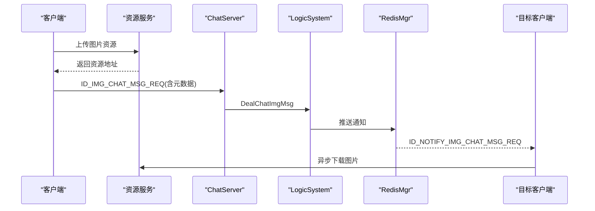

图表来源
- [const.h:74-76](file://server/ChatServer/include/const.h#L74-L76)
- [chat.proto:86-104](file://proto/chat_service/chat.proto#L86-L104)
- [LogicSystem.h:49-49](file://server/ChatServer/include/LogicSystem.h#L49-L49)

章节来源
- [const.h:74-76](file://server/ChatServer/include/const.h#L74-L76)
- [chat.proto:86-104](file://proto/chat_service/chat.proto#L86-L104)
- [LogicSystem.h:49-49](file://server/ChatServer/include/LogicSystem.h#L49-L49)

### 文件消息完整流程
- 与图片消息类似，但content可能为文件元数据（名称、大小、哈希等）。
- 客户端收到通知后按需分片下载，支持断点续传（参考开发文档相关条目）。

章节来源
- [data.h:60-65](file://server/ChatServer/include/data.h#L60-L65)
- [const.h:77-78](file://server/ChatServer/include/const.h#L77-L78)

### 消息确认机制
- 当前代码未显式实现应用层ACK；建议在重要消息（如图片/文件）增加客户端回执，服务端记录status字段（UN_READ/READ等）。
- 可结合Redis键（如msg_ack:{message_id}）做幂等与去重。

章节来源
- [const.h:96-101](file://server/ChatServer/include/const.h#L96-L101)
- [data.h:40-51](file://server/ChatServer/include/data.h#L40-L51)

### 断线重连处理
- 客户端：TcpMgr监听disconnected/error，触发sig_connection_closed，上层实现指数退避重连。
- 服务端：CSession.IsHeartbeatExpired判断心跳超时，DealExceptionSession清理会话。

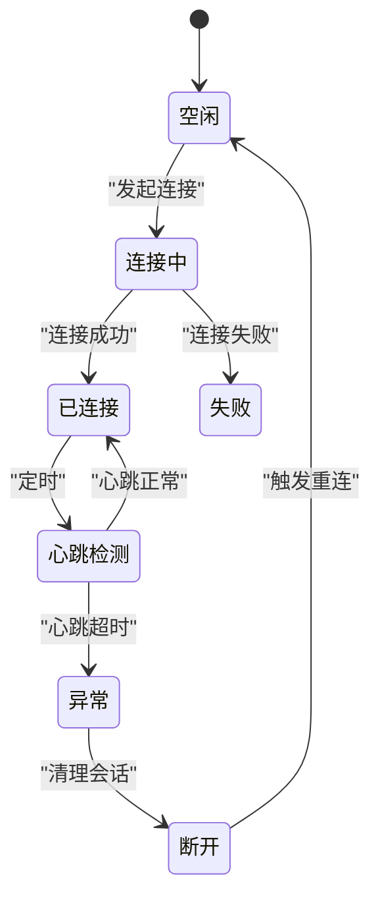

图表来源
- [CSession.h:46-51](file://server/ChatServer/include/CSession.h#L46-L51)
- [tcpmgr.cpp:94-98](file://client/llfcchat/src/tcpmgr.cpp#L94-L98)

章节来源
- [CSession.h:46-51](file://server/ChatServer/include/CSession.h#L46-L51)
- [tcpmgr.cpp:94-98](file://client/llfcchat/src/tcpmgr.cpp#L94-L98)

### 消息去重与顺序保证
- 去重
  - unique_id作为唯一标识，Redis可用SETNX实现幂等；MySQL唯一索引约束重复插入。
- 顺序
  - LogicSystem单线程消费队列保证顺序；客户端按thread_id与message_id排序展示。

章节来源
- [data.h:40-51](file://server/ChatServer/include/data.h#L40-L51)
- [LogicSystem.h:51-54](file://server/ChatServer/include/LogicSystem.h#L51-L54)

### 心跳检测机制
- 客户端定时发送ID_HEART_BEAT_REQ，服务端CSession.UpdateHeartbeat更新时间戳。
- 服务端定时检测IsHeartbeatExpired，超时则关闭会话。

章节来源
- [const.h:64-65](file://server/ChatServer/include/const.h#L64-L65)
- [CSession.h:46-49](file://server/ChatServer/include/CSession.h#L46-L49)

### 消息队列使用与缓存同步策略
- 队列
  - LogicSystem内部队列解耦I/O与业务；Redis List可用于离线消息堆积（LPUSH/BRPOP）。
- 缓存同步
  - Redis保存最近N条消息或用户会话状态；MySQL作为权威源；客户端首次加载从MySQL分页，增量从Redis拉取。

章节来源
- [LogicSystem.h:51-54](file://server/ChatServer/include/LogicSystem.h#L51-L54)
- [RedisMgr.h:275-278](file://server/ChatServer/include/RedisMgr.h#L275-L278)
- [MysqlDao.h:261-261](file://server/ChatServer/include/MysqlDao.h#L261-L261)

## 依赖分析
- 客户端依赖
  - QTcpSocket、QThread、QQueue、QJson等Qt库。
- 服务端依赖
  - Boost.Asio、gRPC、hiredis、MySQL Connector/C++、nlohmann/json。
- 模块耦合
  - CSession依赖const.h与MsgNode；LogicSystem依赖RedisMgr与MysqlDao；RedisMgr与MysqlDao各自维护连接池。

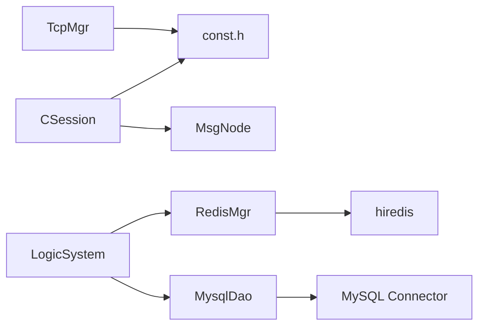

图表来源
- [const.h:49-79](file://server/ChatServer/include/const.h#L49-L79)
- [RedisMgr.h:267-305](file://server/ChatServer/include/RedisMgr.h#L267-L305)
- [MysqlDao.h:236-267](file://server/ChatServer/include/MysqlDao.h#L236-L267)

章节来源
- [const.h:49-79](file://server/ChatServer/include/const.h#L49-L79)
- [RedisMgr.h:267-305](file://server/ChatServer/include/RedisMgr.h#L267-L305)
- [MysqlDao.h:236-267](file://server/ChatServer/include/MysqlDao.h#L236-L267)

## 性能考虑
- I/O
  - 客户端使用QQueue与bytesWritten回调避免阻塞；服务端使用Asio异步读写与发送队列。
- 连接池
  - Redis与MySQL连接池减少握手开销，周期PING保活提升可用性。
- 批处理
  - MysqlDao支持批量插入；LogicSystem可合并小消息批量落库。
- 缓存
  - 热点数据（用户信息、最近消息）放Redis，降低MySQL压力。
- 序列化
  - 文本消息使用JSON便于调试；大对象（图片/文件）仅传递元数据，实际内容走资源服务。

[本节为通用指导，不直接分析具体文件]

## 故障排查指南
- 连接问题
  - 客户端检查host/port、防火墙；服务端查看Asio日志与端口占用。
- 粘包/丢包
  - 核对头部长度解析逻辑与缓冲区处理；检查发送队列与bytesWritten回调。
- 心跳超时
  - 检查客户端心跳发送频率与服务端IsHeartbeatExpired阈值。
- Redis不可用
  - 观察RedisMgr保活线程与fail_count；必要时重启连接池。
- MySQL连接失败
  - 检查MySqlPool保活线程与reconnect逻辑；确认账号权限与schema。

章节来源
- [tcpmgr.cpp:64-98](file://client/llfcchat/src/tcpmgr.cpp#L64-L98)
- [CSession.h:46-51](file://server/ChatServer/include/CSession.h#L46-L51)
- [RedisMgr.h:137-206](file://server/ChatServer/include/RedisMgr.h#L137-L206)
- [MysqlDao.h:62-123](file://server/ChatServer/include/MysqlDao.h#L62-L123)

## 结论
LLFCChat的聊天消息数据流以高并发Asio为核心，结合Qt客户端的稳健TCP管理与Redis/MySQL的连接池与保活机制，实现了文本、图片、文件消息的稳定传输。通过LogicSystem的队列化路由与Redis的实时推送，系统在可扩展性与实时性之间取得平衡。未来可在应用层ACK、消息幂等与更细粒度的限流方面进一步增强。

[本节为总结，不直接分析具体文件]

## 附录
- 协议参考
  - chat.proto定义了跨服务RPC与消息结构，便于扩展新消息类型。
- 数据结构
  - data.h定义了用户、申请、聊天线程与消息结构，支撑业务逻辑。
- 消息类型
  - const.h集中定义消息类型与错误码，便于统一维护。

章节来源
- [chat.proto:1-105](file://proto/chat_service/chat.proto#L1-L105)
- [data.h:1-65](file://server/ChatServer/include/data.h#L1-L65)
- [const.h:1-104](file://server/ChatServer/include/const.h#L1-L104)