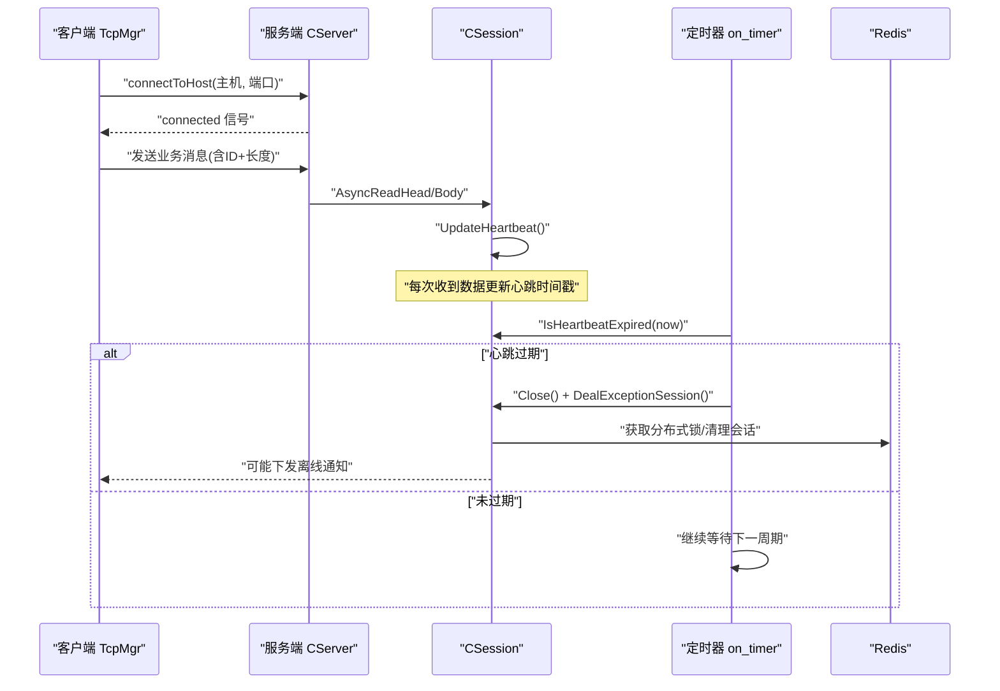
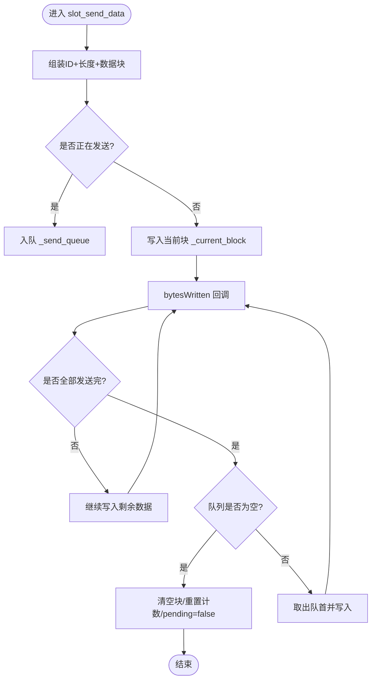
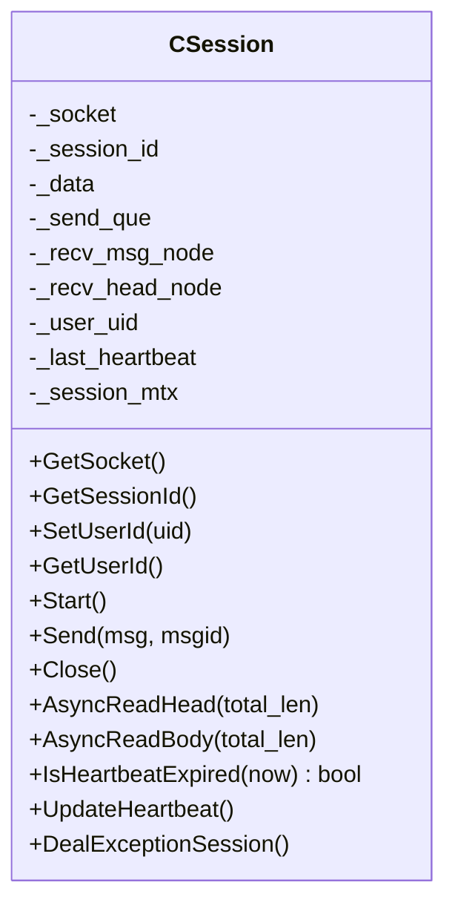
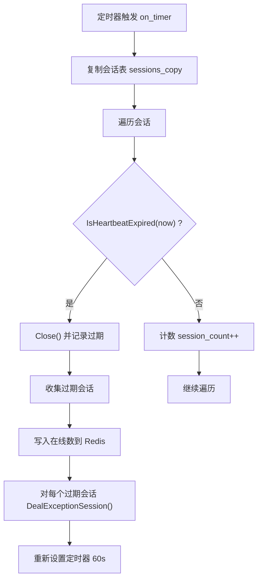
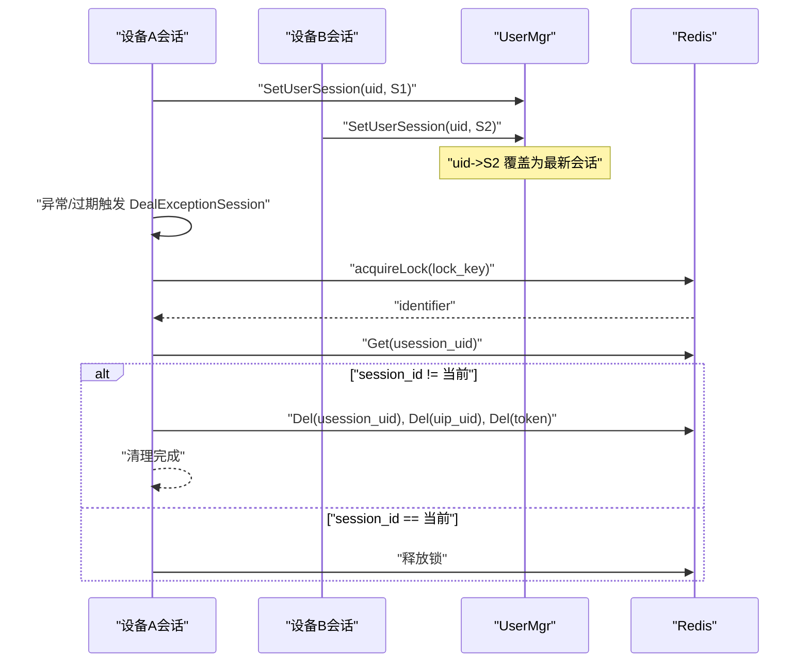
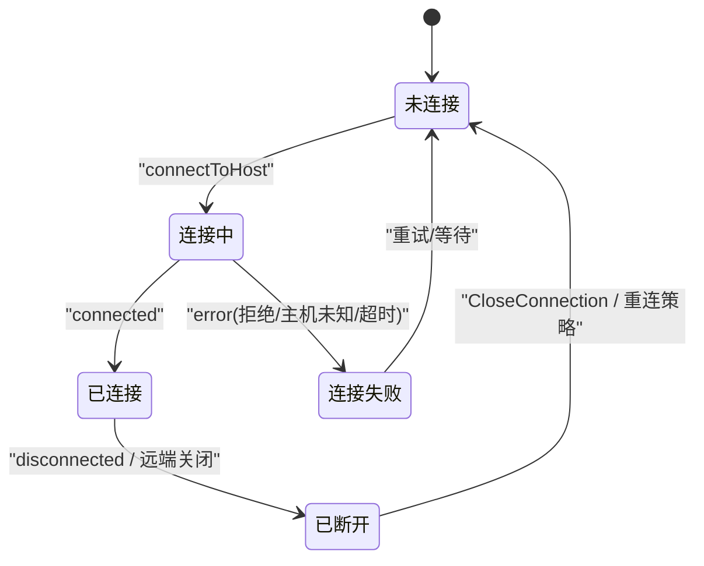
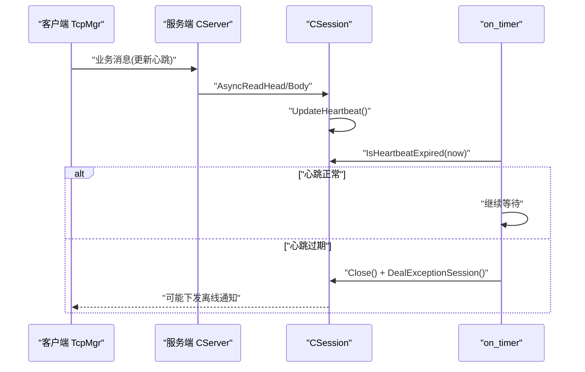
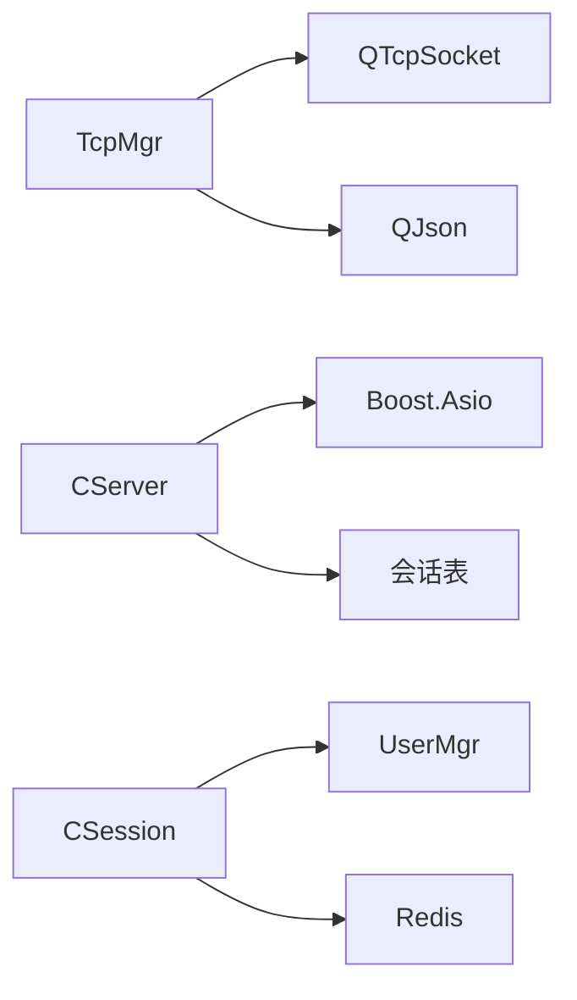

# 连接管理和心跳机制

<cite>
**本文引用的文件**   
- [tcpmgr.h](file://client/llfcchat/include/tcpmgr.h)
- [tcpmgr.cpp](file://client/llfcchat/src/tcpmgr.cpp)
- [CSession.h](file://server/ChatServer/include/CSession.h)
- [CSession.cpp](file://server/ChatServer/src/CSession.cpp)
- [CServer.h](file://server/ChatServer/include/CServer.h)
- [CServer.cpp](file://server/ChatServer/src/CServer.cpp)
- [UserMgr.h](file://server/ChatServer/include/UserMgr.h)
- [UserMgr.cpp](file://server/ChatServer/src/UserMgr.cpp)
- [const.h](file://server/ChatServer/include/const.h)
- [day35心跳逻辑.md](file://开发文档/day35心跳逻辑.md)
</cite>

## 目录
1. [引言](#引言)
2. [项目结构](#项目结构)
3. [核心组件](#核心组件)
4. [架构总览](#架构总览)
5. [详细组件分析](#详细组件分析)
6. [依赖关系分析](#依赖关系分析)
7. [性能与高并发优化](#性能与高并发优化)
8. [故障排查与调试指南](#故障排查与调试指南)
9. [结论](#结论)

## 引言
本技术文档聚焦于 LLFCChat 系统的连接管理与心跳机制，覆盖客户端与服务端在 TCP 长连接上的建立、维护、销毁全流程；解析连接池与会话状态跟踪、资源清理策略；详述心跳检测原理（间隔配置、超时判定、自动重连）；解释多设备登录支持、连接冲突处理与用户踢出逻辑；并提供连接状态转换图、心跳时序图与故障恢复流程。同时给出高并发场景下的优化建议、内存泄漏防护要点与关键监控指标，以及常见异常的调试方法与排障清单。

## 项目结构
- 客户端侧：基于 Qt 的 TcpMgr 管理单个 TCP 连接，负责粘包/半包处理、消息分发、发送队列与信号回调。
- 服务端侧：基于 Boost.Asio 的 CServer 监听端口并创建 CSession 会话，使用定时器进行心跳检测与过期清理，结合 UserMgr 维护用户到 Session 的映射，Redis 用于分布式锁与会话信息存储。

```mermaid
graph TB
subgraph "客户端"
A["TcpMgr<br/>TCP连接管理"]
end
subgraph "服务端"
B["CServer<br/>监听与定时任务"]
C["CSession<br/>单会话读写/心跳"]
D["UserMgr<br/>用户-会话映射"]
E["Redis<br/>分布式锁/会话缓存"]
end
A <- --> B
B --> C
C --> D
C --> E
```

**图表来源** 
- [tcpmgr.h:22-87](file://client/llfcchat/include/tcpmgr.h#L22-L87)
- [CServer.h:10-37](file://server/ChatServer/include/CServer.h#L10-L37)
- [CSession.h:28-76](file://server/ChatServer/include/CSession.h#L28-L76)
- [UserMgr.h:8-20](file://server/ChatServer/include/UserMgr.h#L8-L20)

**章节来源**
- [tcpmgr.h:22-87](file://client/llfcchat/include/tcpmgr.h#L22-L87)
- [CServer.h:10-37](file://server/ChatServer/include/CServer.h#L10-L37)
- [CSession.h:28-76](file://server/ChatServer/include/CSession.h#L28-L76)
- [UserMgr.h:8-20](file://server/ChatServer/include/UserMgr.h#L8-L20)

## 核心组件
- 客户端 TcpMgr
  - 职责：封装 QTcpSocket，实现粘包/半包解析、发送队列、错误与断开处理、消息路由至业务处理器。
  - 关键点：发送队列与 pending 标志避免重复写；readyRead 循环读取直到完整消息；错误分支统一上报。
- 服务端 CServer
  - 职责：接受新连接、维护活跃会话集合、启动定时器周期性检测心跳过期、统计在线数。
  - 关键点：线程安全的会话表；定时器周期触发；过期会话收集后统一清理。
- 服务端 CSession
  - 职责：异步读写协议头/体、更新心跳时间戳、异常时清理与踢人逻辑。
  - 关键点：_last_heartbeat 原子时间戳；IsHeartbeatExpired 判断；DealExceptionSession 分布式清理。
- 服务端 UserMgr
  - 职责：维护 uid -> session 映射，提供设置、查询、删除接口。
  - 关键点：互斥保护；删除时校验 session_id 一致性。
- 常量与协议
  - const.h 定义消息 ID、错误码、头部长度、队列上限等。

**章节来源**
- [tcpmgr.cpp:171-174](file://client/llfcchat/src/tcpmgr.cpp#L171-L174)
- [tcpmgr.cpp:1044-1079](file://client/llfcchat/src/tcpmgr.cpp#L1044-L1079)
- [CServer.cpp:8-14](file://server/ChatServer/src/CServer.cpp#L8-L14)
- [CServer.cpp:75-118](file://server/ChatServer/src/CServer.cpp#L75-L118)
- [CSession.cpp:10-16](file://server/ChatServer/src/CSession.cpp#L10-L16)
- [CSession.cpp:285-299](file://server/ChatServer/src/CSession.cpp#L285-L299)
- [UserMgr.cpp:21-44](file://server/ChatServer/src/UserMgr.cpp#L21-L44)
- [const.h:38-79](file://server/ChatServer/include/const.h#L38-L79)

## 架构总览
下图展示客户端与服务端的连接生命周期、心跳检测与异常处理的交互关系。



**图表来源** 
- [CServer.cpp:75-118](file://server/ChatServer/src/CServer.cpp#L75-L118)
- [CSession.cpp:130-191](file://server/ChatServer/src/CSession.cpp#L130-L191)
- [CSession.cpp:285-299](file://server/ChatServer/src/CSession.cpp#L285-L299)
- [CSession.cpp:301-333](file://server/ChatServer/src/CSession.cpp#L301-L333)
- [tcpmgr.cpp:12-16](file://client/llfcchat/src/tcpmgr.cpp#L12-L16)

## 详细组件分析

### 客户端 TcpMgr：连接建立、发送与接收
- 连接建立
  - 通过 slot_tcp_connect 发起 connectToHost；connected 信号触发 sig_con_success(true)。
- 数据接收
  - readyRead 中循环读取，先解析头部（ID+长度），再按长度读取消息体；使用 _b_recv_pending 标记半包等待。
- 数据发送
  - SendData 组装 ID+长度+数据块；若正在发送则入队；bytesWritten 回调推进发送进度，完成后取队首继续。
- 错误与断开
  - error 分支区分拒绝、远程关闭、主机未知、超时等；disconnected 触发 sig_connection_closed。
- 消息分发
  - handleMsg 根据 ReqId 查找处理器并执行，如登录响应、聊天消息、图片下载等。



**图表来源** 
- [tcpmgr.cpp:1044-1079](file://client/llfcchat/src/tcpmgr.cpp#L1044-L1079)
- [tcpmgr.cpp:103-129](file://client/llfcchat/src/tcpmgr.cpp#L103-L129)

**章节来源**
- [tcpmgr.cpp:12-16](file://client/llfcchat/src/tcpmgr.cpp#L12-L16)
- [tcpmgr.cpp:18-55](file://client/llfcchat/src/tcpmgr.cpp#L18-L55)
- [tcpmgr.cpp:103-129](file://client/llfcchat/src/tcpmgr.cpp#L103-L129)
- [tcpmgr.cpp:1044-1079](file://client/llfcchat/src/tcpmgr.cpp#L1044-L1079)
- [tcpmgr.cpp:1019-1028](file://client/llfcchat/src/tcpmgr.cpp#L1019-L1028)

### 服务端 CSession：会话读写与心跳维护
- 异步读写
  - AsyncReadHead 读取固定长度的协议头，校验 msg_id/msg_len，分配 RecvNode 后调用 AsyncReadBody。
  - AsyncReadBody 读取完整消息体，拷贝到节点，更新心跳时间戳，投递到 LogicSystem，再回到头部读取。
- 心跳检测
  - IsHeartbeatExpired 比较当前时间与 _last_heartbeat，超过阈值认为过期。
  - UpdateHeartbeat 在每次成功读取消息时更新时间戳。
- 异常处理与清理
  - HandleWrite 失败或读异常时 Close() 并调用 DealExceptionSession。
  - DealExceptionSession 使用 Redis 分布式锁，校验当前 session_id 是否与缓存一致，不一致则视为异地登录，清理本地与会话相关键值。



**图表来源** 
- [CSession.h:28-76](file://server/ChatServer/include/CSession.h#L28-L76)
- [CSession.cpp:130-191](file://server/ChatServer/src/CSession.cpp#L130-L191)
- [CSession.cpp:285-299](file://server/ChatServer/src/CSession.cpp#L285-L299)
- [CSession.cpp:301-333](file://server/ChatServer/src/CSession.cpp#L301-L333)

**章节来源**
- [CSession.cpp:130-191](file://server/ChatServer/src/CSession.cpp#L130-L191)
- [CSession.cpp:285-299](file://server/ChatServer/src/CSession.cpp#L285-L299)
- [CSession.cpp:301-333](file://server/ChatServer/src/CSession.cpp#L301-L333)

### 服务端 CServer：会话管理与心跳定时器
- 接受连接
  - StartAccept 从 IOServicePool 获取 io_context，创建 CSession 并异步 accept。
- 会话表维护
  - HandleAccept 成功后将 session 加入 _sessions；ClearSession 移除并解绑用户会话。
- 心跳定时器
  - on_timer 每60秒遍历会话副本，调用 IsHeartbeatExpired 判断过期，关闭 socket 并收集过期会话；统计在线数写入 Redis；对过期会话统一调用 DealExceptionSession。



**图表来源** 
- [CServer.cpp:75-118](file://server/ChatServer/src/CServer.cpp#L75-L118)
- [CServer.cpp:21-32](file://server/ChatServer/src/CServer.cpp#L21-L32)
- [CServer.cpp:40-53](file://server/ChatServer/src/CServer.cpp#L40-L53)

**章节来源**
- [CServer.cpp:8-14](file://server/ChatServer/src/CServer.cpp#L8-L14)
- [CServer.cpp:21-32](file://server/ChatServer/src/CServer.cpp#L21-L32)
- [CServer.cpp:40-53](file://server/ChatServer/src/CServer.cpp#L40-L53)
- [CServer.cpp:75-118](file://server/ChatServer/src/CServer.cpp#L75-L118)

### 多设备登录支持与踢出逻辑
- 用户-会话映射
  - UserMgr::SetUserSession 保存 uid->session；RmvUserSession 删除时校验 session_id 一致性，防止误删其他设备的会话。
- 分布式踢人
  - CSession::DealExceptionSession 使用 Redis 分布式锁，检查 USER_SESSION_PREFIX 中的 session_id；若不一致说明异地登录，清理本地与会话相关键值，达到“踢人”效果。
- 客户端下线通知
  - 服务端可下发 ID_NOTIFY_OFF_LINE_REQ，客户端处理器触发 sig_notify_offline，界面据此断开或提示。



**图表来源** 
- [UserMgr.cpp:21-44](file://server/ChatServer/src/UserMgr.cpp#L21-L44)
- [CSession.cpp:301-333](file://server/ChatServer/src/CSession.cpp#L301-L333)
- [const.h:81-88](file://server/ChatServer/include/const.h#L81-L88)

**章节来源**
- [UserMgr.cpp:21-44](file://server/ChatServer/src/UserMgr.cpp#L21-L44)
- [CSession.cpp:301-333](file://server/ChatServer/src/CSession.cpp#L301-L333)
- [const.h:81-88](file://server/ChatServer/include/const.h#L81-L88)

### 连接状态转换图


**图表来源** 
- [tcpmgr.cpp:12-16](file://client/llfcchat/src/tcpmgr.cpp#L12-L16)
- [tcpmgr.cpp:64-91](file://client/llfcchat/src/tcpmgr.cpp#L64-L91)
- [tcpmgr.cpp:94-98](file://client/llfcchat/src/tcpmgr.cpp#L94-L98)

### 心跳时序图


**图表来源** 
- [CSession.cpp:285-299](file://server/ChatServer/src/CSession.cpp#L285-L299)
- [CServer.cpp:75-118](file://server/ChatServer/src/CServer.cpp#L75-L118)

### 故障恢复流程
- 客户端
  - 连接失败或断开时，上层可触发重连（例如延迟指数退避），重建连接后恢复业务。
- 服务端
  - 定时器发现过期会话，关闭 socket 并清理；若检测到异地登录，清除 Redis 中的会话与 token，确保唯一在线。

**章节来源**
- [CServer.cpp:75-118](file://server/ChatServer/src/CServer.cpp#L75-L118)
- [CSession.cpp:301-333](file://server/ChatServer/src/CSession.cpp#L301-L333)

## 依赖关系分析
- 客户端依赖
  - QTcpSocket、QThread、QQueue、QJson；消息处理器注册与分发。
- 服务端依赖
  - Boost.Asio（网络）、std::mutex（并发）、Redis（分布式锁/缓存）、Mysql/Config（扩展）。
- 模块耦合
  - CServer 持有会话表，CSession 依赖 UserMgr 与 Redis；客户端 TcpMgr 与业务层通过信号解耦。



**图表来源** 
- [tcpmgr.h:22-87](file://client/llfcchat/include/tcpmgr.h#L22-L87)
- [CServer.h:10-37](file://server/ChatServer/include/CServer.h#L10-L37)
- [CSession.h:28-76](file://server/ChatServer/include/CSession.h#L28-L76)
- [UserMgr.h:8-20](file://server/ChatServer/include/UserMgr.h#L8-L20)

**章节来源**
- [tcpmgr.h:22-87](file://client/llfcchat/include/tcpmgr.h#L22-L87)
- [CServer.h:10-37](file://server/ChatServer/include/CServer.h#L10-L37)
- [CSession.h:28-76](file://server/ChatServer/include/CSession.h#L28-L76)
- [UserMgr.h:8-20](file://server/ChatServer/include/UserMgr.h#L8-L20)

## 性能与高并发优化
- 发送路径
  - 客户端使用 QQueue 与 pending 标志串行化写操作，避免竞争与重复 write；服务端 CSession 使用 _send_que 与互斥锁保证并发安全。
- 接收路径
  - 客户端在 readyRead 中一次性读取所有可用数据，减少事件回调开销；服务端 async_read_some 递归拼接，避免粘包/半包问题。
- 心跳与定时器
  - 服务端定时器周期扫描，仅复制会话表快照遍历，降低锁竞争；过期会话集中处理，避免长时间持锁。
- 内存与资源
  - 合理设置 MAX_LENGTH、MAX_SENDQUE、HEAD_TOTAL_LEN；及时清空 _current_block、_buffer 与临时对象；析构时关闭 socket，避免句柄泄露。
- 监控指标
  - 在线会话数（Redis LOGIN_COUNT）、发送队列长度、平均/最大 RTT、错误率（拒绝/超时/网络错误）、心跳过期率、GC/内存峰值。

[本节为通用指导，不直接分析具体文件]

## 故障排查与调试指南
- 常见问题
  - 连接被拒绝/主机未知/超时：检查网络可达性与防火墙规则；确认服务器端口与地址正确。
  - 粘包/半包：确认客户端与服务端协议头长度一致（HEAD_TOTAL_LEN=4，ID+Length各2字节）；检查字节序设置（BigEndian）。
  - 心跳过期频繁：检查客户端是否定期发送消息或心跳；核对服务端 IsHeartbeatExpired 阈值（示例为20s，生产建议与定时器周期匹配）。
  - 多设备踢人：确认 Redis 中 usession_* 键值与 session_id 一致性；分布式锁获取与释放是否正常。
- 调试方法
  - 客户端：打印 connected/disconnected/error 信号；观察 _send_queue 长度与 _pending 状态；捕获 sig_login_failed/sig_connection_closed。
  - 服务端：查看 on_timer 日志、会话数量统计；关注 HandleWrite 错误码；检查 Redis 键值变化。
- 定位步骤
  - 复现断线：抓包确认是否有 FIN/RST；检查中间设备空闲超时；验证心跳包是否按时发出。
  - 定位消息丢失：比对请求 ID 与响应 ID；检查处理器注册是否正确；确认 JSON 字段完整性。

**章节来源**
- [tcpmgr.cpp:64-91](file://client/llfcchat/src/tcpmgr.cpp#L64-L91)
- [tcpmgr.cpp:103-129](file://client/llfcchat/src/tcpmgr.cpp#L103-L129)
- [CSession.cpp:193-217](file://server/ChatServer/src/CSession.cpp#L193-L217)
- [CServer.cpp:75-118](file://server/ChatServer/src/CServer.cpp#L75-L118)
- [day35心跳逻辑.md:272-315](file://开发文档/day35心跳逻辑.md#L272-L315)

## 结论
LLFCChat 的连接管理与心跳机制以客户端 TcpMgr 与服务端 CServer/CSession 为核心，采用异步 I/O、队列缓冲与定时器扫描，实现了稳定可靠的长连接通信。通过分布式锁与 Redis 会话缓存，系统支持多设备登录与冲突踢人。建议在上线前完善监控指标与告警策略，持续优化发送/接收路径与内存占用，确保在高并发场景下的稳定性与性能。