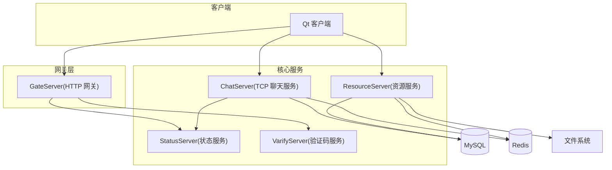
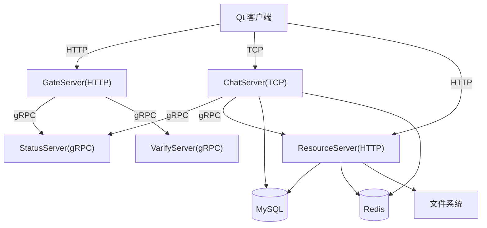
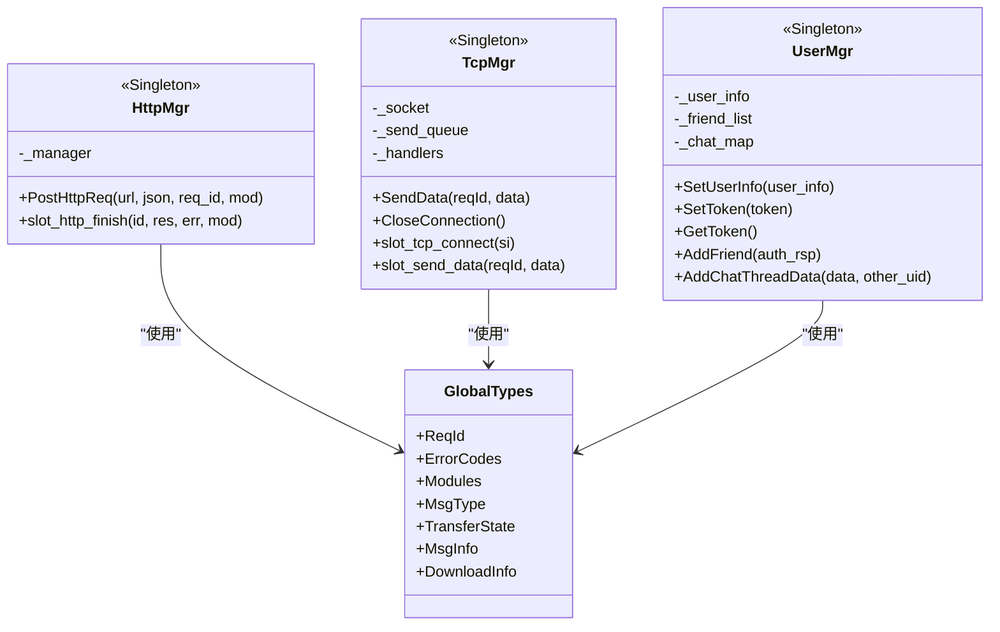
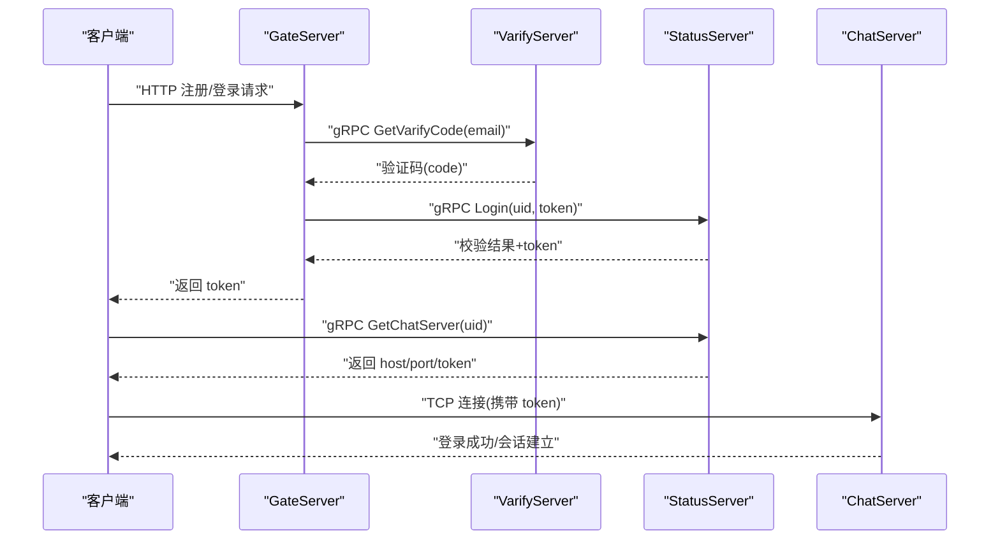
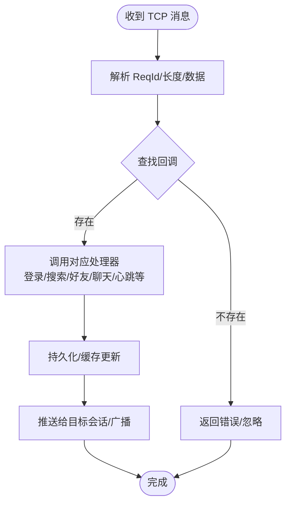
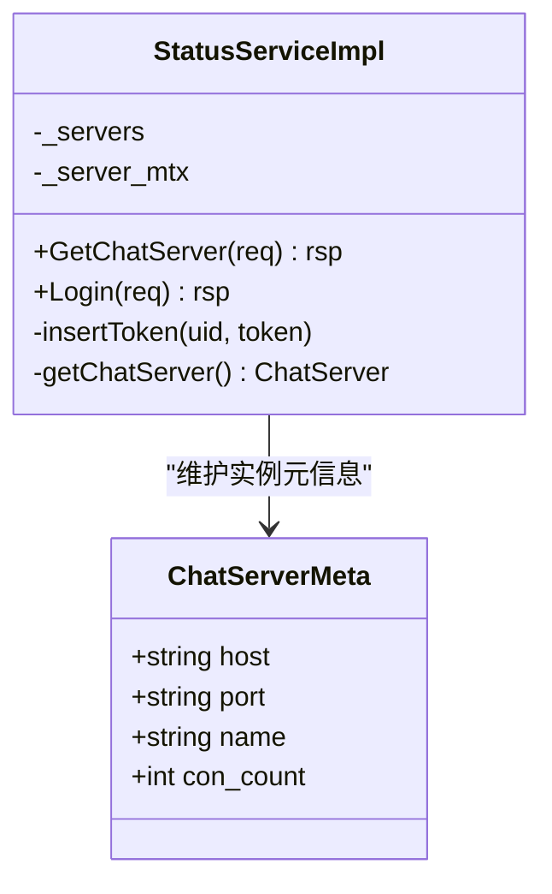
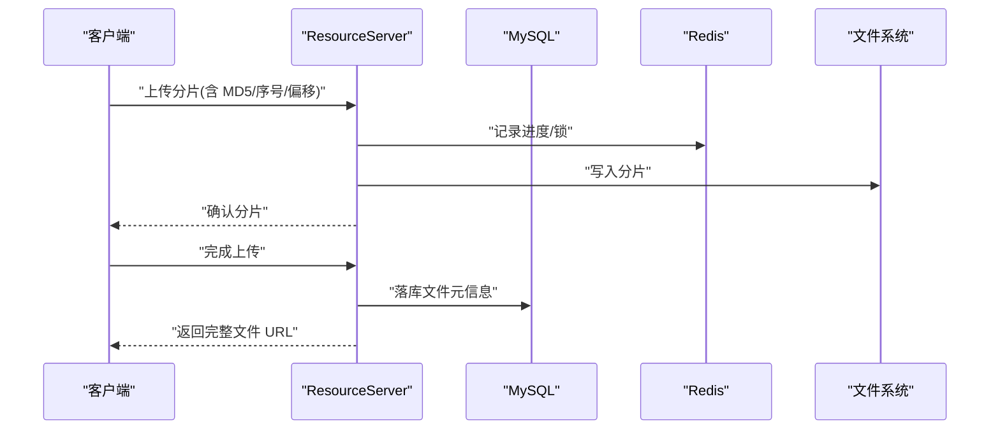
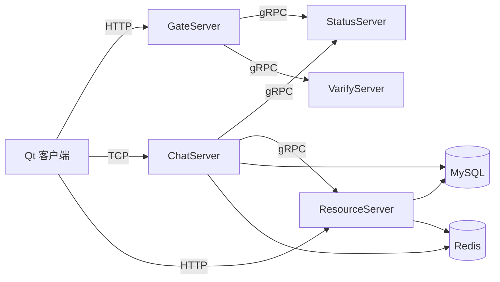

# 整体架构设计

<cite>
**本文引用的文件**   
- [README.md](file://README.md)
- [CMakeLists.txt](file://CMakeLists.txt)
- [client CMakeLists.txt](file://client/llfcchat/CMakeLists.txt)
- [server CMakeLists.txt](file://server/CMakeLists.txt)
- [proto chat_service/chat.proto](file://proto/chat_service/chat.proto)
- [proto status_service/status.proto](file://proto/status_service/status.proto)
- [proto verify_service/verify.proto](file://proto/verify_service/verify.proto)
- [client main.cpp](file://client/llfcchat/src/main.cpp)
- [client httpmgr.h](file://client/llfcchat/include/httpmgr.h)
- [client tcpmgr.h](file://client/llfcchat/include/tcpmgr.h)
- [client global.h](file://client/llfcchat/include/global.h)
- [client usermgr.h](file://client/llfcchat/include/usermgr.h)
- [server GateServer CServer.h](file://server/GateServer/include/CServer.h)
- [server GateServer HttpConnection.h](file://server/GateServer/include/HttpConnection.h)
- [server ChatServer CServer.h](file://server/ChatServer/include/CServer.h)
- [server ChatServer LogicSystem.h](file://server/ChatServer/include/LogicSystem.h)
- [server StatusServer StatusServiceImpl.h](file://server/StatusServer/include/StatusServiceImpl.h)
- [server ResourceServer LogicSystem.h](file://server/ResourceServer/include/LogicSystem.h)
- [开发文档 心跳逻辑.md](file://开发文档/day35心跳逻辑.md)
- [开发文档 断点续传.md](file://开发文档/day38-断点续传.md)
</cite>

## 目录
1. [引言](#引言)
2. [项目结构](#项目结构)
3. [核心组件](#核心组件)
4. [架构总览](#架构总览)
5. [详细组件分析](#详细组件分析)
6. [依赖关系分析](#依赖关系分析)
7. [性能与高可用](#性能与高可用)
8. [故障排查指南](#故障排查指南)
9. [结论](#结论)
10. [附录](#附录)

## 引言
本文件为 LLFCChat 项目的整体架构设计文档，面向开发者与运维人员，系统阐述分层架构、模块划分、组件关系与数据流。重点说明：
- 客户端 Qt 应用与后端微服务之间的交互模式（HTTP 网关、TCP 长连接、gRPC 服务调用）
- 微服务拆分策略与服务边界定义
- 高可用设计、负载均衡策略与故障转移机制
- 技术选型理由、架构约束与设计原则
- 系统上下文图、部署架构图与组件依赖关系图

## 项目结构
仓库采用“客户端 + 多服务”的模块化组织方式，顶层 CMake 统一聚合子工程，分别构建客户端与多个服务端：
- client/llfcchat：Qt 桌面客户端，包含 UI、网络层（HTTP/TCP）、业务管理（用户、会话、消息等）
- server/*：微服务集合
  - GateServer：HTTP 网关，负责认证、鉴权、路由到具体聊天服务器
  - ChatServer：聊天核心服务，维护 TCP 长连接、会话、消息转发、好友关系、聊天线程等
  - StatusServer：状态服务，提供聊天服务器发现与登录令牌校验
  - ResourceServer：资源服务，负责文件上传下载、图片资源缓存与断点续传
  - VarifyServer（Node.js）：验证码服务，通过 gRPC 对外暴露
- proto/*：gRPC 协议定义（chat_service、status_service、verify_service）
- webrtc-demo：WebRTC 信令示例（独立于主架构）

图表来源
- [CMakeLists.txt:1-34](file://CMakeLists.txt#L1-L34)
- [server CMakeLists.txt:1-38](file://server/CMakeLists.txt#L1-L38)
- [client CMakeLists.txt:1-222](file://client/llfcchat/CMakeLists.txt#L1-L222)

章节来源
- [CMakeLists.txt:1-34](file://CMakeLists.txt#L1-L34)
- [server CMakeLists.txt:1-38](file://server/CMakeLists.txt#L1-L38)
- [client CMakeLists.txt:1-222](file://client/llfcchat/CMakeLists.txt#L1-L222)

## 核心组件
- 客户端网络与管理
  - HTTP 管理器：封装 HTTP 请求，用于注册、登录、重置密码等与 GateServer 的交互
  - TCP 管理器：维护与 ChatServer 的 TCP 长连接，处理粘包、消息分发、离线通知、聊天消息推送等
  - 用户管理器：维护当前用户信息、好友列表、申请列表、聊天会话、文件传输状态等
  - 全局常量与类型：ReqId、ErrorCodes、Modules、MsgType、TransferState 等
- 网关服务（GateServer）
  - HTTP 接入：基于 Boost.Beast 的 HTTP 服务器，解析请求参数并转发至对应服务
  - 鉴权与路由：校验验证码、登录态，返回 Token；根据用户选择或负载策略将后续 TCP 连接指向 ChatServer
- 聊天服务（ChatServer）
  - TCP 会话管理：Accept、Session 生命周期、心跳检测、踢人逻辑
  - 业务逻辑：搜索用户、好友申请/认证、文本/图片聊天、加载聊天线程与消息
  - 存储访问：通过 DAO/Manager 访问 MySQL、Redis
- 状态服务（StatusServer）
  - gRPC 接口：GetChatServer（返回目标 ChatServer 地址与 Token）、Login（校验 Token）
  - 内部维护 ChatServer 实例信息与连接计数
- 资源服务（ResourceServer）
  - 文件上传/下载、分片与断点续传、MD5 去重、进度同步
  - 与 ChatServer 通过 gRPC 进行图片消息通知协调
- 验证码服务（VarifyServer）
  - Node.js 实现，gRPC 暴露 GetVarifyCode，供 GateServer 调用

章节来源
- [client httpmgr.h:1-34](file://client/llfcchat/include/httpmgr.h#L1-L34)
- [client tcpmgr.h:1-90](file://client/llfcchat/include/tcpmgr.h#L1-L90)
- [client usermgr.h:1-116](file://client/llfcchat/include/usermgr.h#L1-L116)
- [client global.h:1-296](file://client/llfcchat/include/global.h#L1-L296)
- [server GateServer CServer.h:1-16](file://server/GateServer/include/CServer.h#L1-L16)
- [server GateServer HttpConnection.h:1-36](file://server/GateServer/include/HttpConnection.h#L1-L36)
- [server ChatServer CServer.h:1-33](file://server/ChatServer/include/CServer.h#L1-L33)
- [server ChatServer LogicSystem.h:1-60](file://server/ChatServer/include/LogicSystem.h#L1-L60)
- [server StatusServer StatusServiceImpl.h:1-52](file://server/StatusServer/include/StatusServiceImpl.h#L1-L52)
- [server ResourceServer LogicSystem.h:1-33](file://server/ResourceServer/include/LogicSystem.h#L1-L33)

## 架构总览
LLFCChat 采用“前端 Qt + 网关 + 多微服务”的分层架构：
- 表现层：Qt 客户端，负责 UI 与本地状态管理
- 接入层：GateServer 作为 HTTP 网关，统一入口、鉴权、路由
- 业务层：ChatServer、ResourceServer、StatusServer、VarifyServer 各司其职
- 数据层：MySQL、Redis、文件系统

图表来源
- [proto chat_service/chat.proto:1-105](file://proto/chat_service/chat.proto#L1-L105)
- [proto status_service/status.proto:1-32](file://proto/status_service/status.proto#L1-L32)
- [proto verify_service/verify.proto:1-19](file://proto/verify_service/verify.proto#L1-L19)
- [server GateServer CServer.h:1-16](file://server/GateServer/include/CServer.h#L1-L16)
- [server ChatServer CServer.h:1-33](file://server/ChatServer/include/CServer.h#L1-L33)
- [server StatusServer StatusServiceImpl.h:1-52](file://server/StatusServer/include/StatusServiceImpl.h#L1-L52)
- [server ResourceServer LogicSystem.h:1-33](file://server/ResourceServer/include/LogicSystem.h#L1-L33)

## 详细组件分析

### 客户端网络与管理（HTTP/TCP）
- HTTP 管理器
  - 职责：封装 QNetworkAccessManager，发起 POST 请求，回调统一处理结果
  - 关键能力：按 ReqId 区分请求类型，按 Modules 区分模块，信号驱动 UI 更新
- TCP 管理器
  - 职责：维护 QTcpSocket，处理粘包、发送队列、消息分发、离线通知、聊天消息推送
  - 关键能力：线程化接收、事件槽函数映射、消息 ID/长度解析、异步发送
- 用户管理器
  - 职责：维护用户信息、Token、好友/申请列表、聊天会话、文件传输状态
  - 关键能力：分页加载聊天/联系人、会话映射、上传/下载任务管理、Label 资源重置
- 全局常量
  - 定义 ReqId、ErrorCodes、Modules、MsgType、TransferState、MsgInfo、DownloadInfo 等

图表来源
- [client httpmgr.h:1-34](file://client/llfcchat/include/httpmgr.h#L1-L34)
- [client tcpmgr.h:1-90](file://client/llfcchat/include/tcpmgr.h#L1-L90)
- [client usermgr.h:1-116](file://client/llfcchat/include/usermgr.h#L1-L116)
- [client global.h:1-296](file://client/llfcchat/include/global.h#L1-L296)

章节来源
- [client httpmgr.h:1-34](file://client/llfcchat/include/httpmgr.h#L1-L34)
- [client tcpmgr.h:1-90](file://client/llfcchat/include/tcpmgr.h#L1-L90)
- [client usermgr.h:1-116](file://client/llfcchat/include/usermgr.h#L1-L116)
- [client global.h:1-296](file://client/llfcchat/include/global.h#L1-L296)

### 网关服务（GateServer）
- HTTP 接入：基于 Boost.Beast 的 HttpConnection，解析 GET/POST，设置超时
- 鉴权与路由：调用 VarifyServer 获取验证码，调用 StatusServer 完成登录与 Token 校验，返回 Token 给客户端
- 路由策略：根据用户 UID 与负载情况，返回 ChatServer 的地址与端口，客户端据此建立 TCP 长连接

图表来源
- [server GateServer HttpConnection.h:1-36](file://server/GateServer/include/HttpConnection.h#L1-L36)
- [proto verify_service/verify.proto:1-19](file://proto/verify_service/verify.proto#L1-L19)
- [proto status_service/status.proto:1-32](file://proto/status_service/status.proto#L1-L32)
- [server StatusServer StatusServiceImpl.h:1-52](file://server/StatusServer/include/StatusServiceImpl.h#L1-L52)

章节来源
- [server GateServer CServer.h:1-16](file://server/GateServer/include/CServer.h#L1-L16)
- [server GateServer HttpConnection.h:1-36](file://server/GateServer/include/HttpConnection.h#L1-L36)
- [proto verify_service/verify.proto:1-19](file://proto/verify_service/verify.proto#L1-L19)
- [proto status_service/status.proto:1-32](file://proto/status_service/status.proto#L1-L32)

### 聊天服务（ChatServer）
- TCP 会话管理：CServer 接受连接，CSession 维护会话状态、心跳定时器、消息收发
- 业务逻辑：LogicSystem 单例，消息队列+工作线程，注册各 ReqId 回调（登录、搜索、好友申请/认证、文本/图片聊天、心跳、加载聊天线程/消息等）
- 存储访问：MysqlDao/MysqlMgr、RedisMgr 访问数据库与缓存
- 跨服协作：通过 ChatGrpcClient 调用其他 ChatServer 或 ResourceServer

图表来源
- [server ChatServer CServer.h:1-33](file://server/ChatServer/include/CServer.h#L1-L33)
- [server ChatServer LogicSystem.h:1-60](file://server/ChatServer/include/LogicSystem.h#L1-L60)
- [proto chat_service/chat.proto:1-105](file://proto/chat_service/chat.proto#L1-L105)

章节来源
- [server ChatServer CServer.h:1-33](file://server/ChatServer/include/CServer.h#L1-L33)
- [server ChatServer LogicSystem.h:1-60](file://server/ChatServer/include/LogicSystem.h#L1-L60)
- [proto chat_service/chat.proto:1-105](file://proto/chat_service/chat.proto#L1-L105)

### 状态服务（StatusServer）
- gRPC 接口：GetChatServer（根据 uid 返回 ChatServer 地址与 token）、Login（校验 token）
- 内部维护 ChatServer 实例信息（host/port/name/con_count），支持简单负载均衡与故障切换

图表来源
- [server StatusServer StatusServiceImpl.h:1-52](file://server/StatusServer/include/StatusServiceImpl.h#L1-L52)

章节来源
- [server StatusServer StatusServiceImpl.h:1-52](file://server/StatusServer/include/StatusServiceImpl.h#L1-L52)
- [proto status_service/status.proto:1-32](file://proto/status_service/status.proto#L1-L32)

### 资源服务（ResourceServer）
- 文件上传/下载：分片传输、断点续传、MD5 去重、进度同步
- 与 ChatServer 协作：通过 gRPC 通知图片消息，协调客户端异步下载
- 存储：MySQL、Redis、文件系统

图表来源
- [server ResourceServer LogicSystem.h:1-33](file://server/ResourceServer/include/LogicSystem.h#L1-L33)
- [开发文档 断点续传.md:1068-1129](file://开发文档/day38-断点续传.md#L1068-L1129)

章节来源
- [server ResourceServer LogicSystem.h:1-33](file://server/ResourceServer/include/LogicSystem.h#L1-L33)
- [开发文档 断点续传.md:1068-1129](file://开发文档/day38-断点续传.md#L1068-L1129)

### 验证码服务（VarifyServer）
- Node.js 实现，gRPC 暴露 GetVarifyCode，供 GateServer 调用
- 结合 Redis 存储验证码，支持多服务派发

章节来源
- [proto verify_service/verify.proto:1-19](file://proto/verify_service/verify.proto#L1-L19)

## 依赖关系分析
- 客户端依赖
  - Qt 框架（Core/Gui/Network/Widgets）
  - 自定义模块：httpmgr、tcpmgr、usermgr、global
- 网关依赖
  - Boost.Asio/Beast（HTTP）
  - gRPC 客户端（StatusServer、VarifyServer）
- 聊天服务依赖
  - Boost.Asio（TCP）
  - gRPC 客户端（StatusServer、ResourceServer）
  - MySQL/Redis 访问层
- 资源服务依赖
  - 文件系统、MySQL/Redis、gRPC 客户端（ChatServer）

图表来源
- [CMakeLists.txt:1-34](file://CMakeLists.txt#L1-L34)
- [server CMakeLists.txt:1-38](file://server/CMakeLists.txt#L1-L38)
- [client CMakeLists.txt:1-222](file://client/llfcchat/CMakeLists.txt#L1-L222)

章节来源
- [CMakeLists.txt:1-34](file://CMakeLists.txt#L1-L34)
- [server CMakeLists.txt:1-38](file://server/CMakeLists.txt#L1-L38)
- [client CMakeLists.txt:1-222](file://client/llfcchat/CMakeLists.txt#L1-L222)

## 性能与高可用
- 性能优化
  - 客户端：TCP 粘包处理、发送队列、异步 IO、UI 线程与网络线程分离
  - 聊天服务：消息队列+工作线程、会话定时心跳、批量推送
  - 资源服务：分片上传/下载、MD5 去重、Redis 进度缓存
- 高可用设计
  - 状态服务集中管理 ChatServer 实例与连接计数，支持简单负载均衡与故障切换
  - 心跳机制：客户端/服务器双向心跳，防止中间设备回收空闲连接，及时感知断线
  - 分布式锁：跨服踢人逻辑保证原子性，避免重复登录
  - 断点续传：提升大文件传输稳定性与用户体验
- 负载均衡策略
  - 基于 StatusServer 的 GetChatServer 返回不同实例地址，可按连接数或权重分配
- 故障转移机制
  - 客户端在连接失败时重试或切换至备用 ChatServer
  - 资源服务分片校验与断点续传保障一致性

章节来源
- [开发文档 心跳逻辑.md:1-39](file://开发文档/day35心跳逻辑.md#L1-L39)
- [开发文档 断点续传.md:1068-1129](file://开发文档/day38-断点续传.md#L1068-L1129)
- [server ChatServer CServer.h:1-33](file://server/ChatServer/include/CServer.h#L1-L33)
- [server StatusServer StatusServiceImpl.h:1-52](file://server/StatusServer/include/StatusServiceImpl.h#L1-L52)

## 故障排查指南
- 常见问题定位
  - 客户端无法登录：检查 GateServer 是否可达、验证码服务是否正常、StatusServer 登录校验是否通过
  - TCP 连接断开：检查心跳间隔、防火墙/NAT 超时设置、服务器会话清理逻辑
  - 文件上传失败：检查分片顺序、MD5 校验、Redis 进度锁、文件系统权限
  - 聊天消息未到达：检查目标会话是否存在、消息路由是否正确、跨服 gRPC 调用是否成功
- 调试建议
  - 启用日志输出（客户端与服务端）
  - 抓包分析 TCP/HTTP/gRPC 报文
  - 检查配置项（端口、Host、Token、Redis/MySQL 连接）

章节来源
- [client main.cpp:1-44](file://client/llfcchat/src/main.cpp#L1-L44)
- [server GateServer HttpConnection.h:1-36](file://server/GateServer/include/HttpConnection.h#L1-L36)
- [server ChatServer LogicSystem.h:1-60](file://server/ChatServer/include/LogicSystem.h#L1-L60)

## 结论
LLFCChat 采用清晰的“客户端 + 网关 + 多微服务”架构，通过 HTTP 网关统一接入、TCP 长连接实时通信、gRPC 服务间调用，实现了可扩展、可维护的聊天系统。借助状态服务、心跳机制、分布式锁与断点续传，系统在性能与高可用性方面具备良好基础。未来可在负载均衡、服务发现、监控告警等方面进一步演进。

## 附录
- 技术选型理由
  - Qt：成熟的 GUI 框架，适合桌面客户端快速开发
  - Boost.Asio/Beast：高性能网络编程，支撑 HTTP/TCP 服务
  - gRPC：强类型接口，跨语言服务调用，适合微服务间通信
  - MySQL/Redis：关系型数据存储与缓存，满足读写分离与高并发场景
  - Node.js：验证码服务轻量实现，便于扩展
- 架构约束与设计原则
  - 单一职责：每个服务专注特定领域（聊天、状态、资源、验证码）
  - 解耦：通过标准协议（HTTP/gRPC）与消息格式（JSON/proto）解耦
  - 可观测：心跳、日志、指标采集为后续监控奠定基础
  - 可扩展：状态服务集中管理实例，支持横向扩展