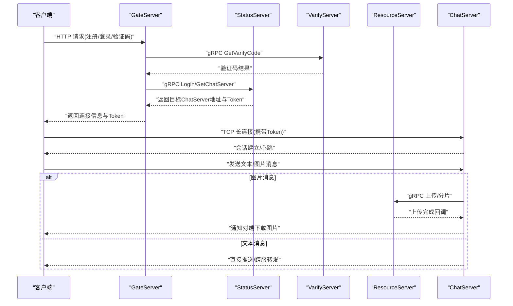
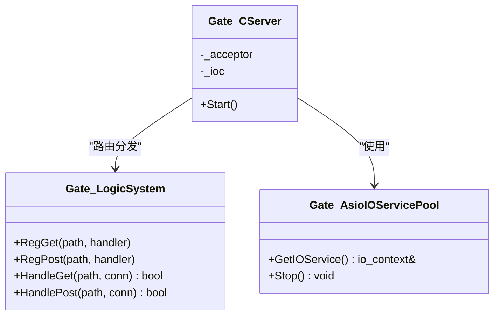
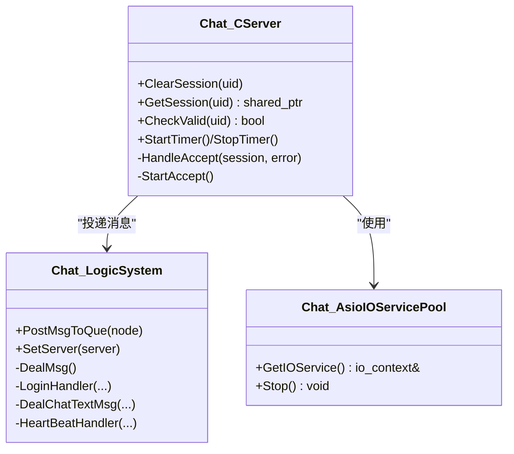
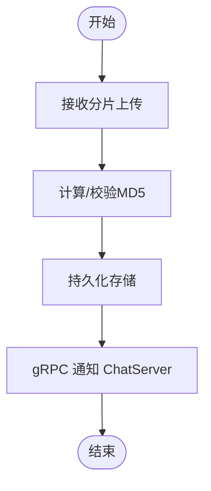
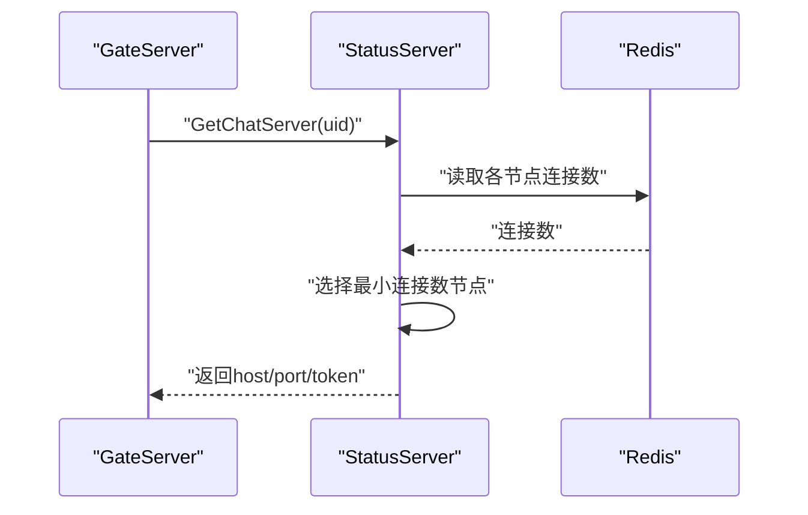
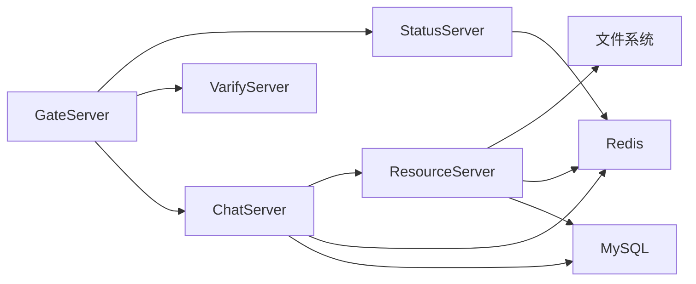

# 架构设计

<cite>
**本文引用的文件**   
- [README.md](file://README.md)
- [CMakeLists.txt](file://CMakeLists.txt)
- [vcpkg.json](file://vcpkg.json)
- [chat.proto](file://proto/chat_service/chat.proto)
- [status.proto](file://proto/status_service/status.proto)
- [verify.proto](file://proto/verify_service/verify.proto)
- [ChatServer.cpp](file://server/ChatServer/src/ChatServer.cpp)
- [CServer.h（ChatServer）](file://server/ChatServer/include/CServer.h)
- [AsioIOServicePool.h（ChatServer）](file://server/ChatServer/include/AsioIOServicePool.h)
- [LogicSystem.h（ChatServer）](file://server/ChatServer/include/LogicSystem.h)
- [CServer.h（GateServer）](file://server/GateServer/include/CServer.h)
- [AsioIOServicePool.h（GateServer）](file://server/GateServer/include/AsioIOServicePool.h)
- [LogicSystem.h（GateServer）](file://server/GateServer/include/LogicSystem.h)
- [CServer.h（ResourceServer）](file://server/ResourceServer/include/CServer.h)
- [AsioIOServicePool.h（ResourceServer）](file://server/ResourceServer/include/AsioIOServicePool.h)
- [LogicSystem.h（ResourceServer）](file://server/ResourceServer/include/LogicSystem.h)
- [StatusServiceImpl.h](file://server/StatusServer/include/StatusServiceImpl.h)
- [AsioIOServicePool.h（StatusServer）](file://server/StatusServer/include/AsioIOServicePool.h)
- [day16-asio实现tcp服务器.md](file://开发文档/day16-asio实现tcp服务器.md)
- [day27-分布式服务设计.md](file://开发文档/day27-分布式服务设计.md)
- [day08-邮箱认证服务.md](file://开发文档/day08-邮箱认证服务.md)
- [day14-登录功能.md](file://开发文档/day14-登录功能.md)
- [day37-聊天信息存储方案.md](file://开发文档/day37-聊天信息存储方案.md)
- [day41-通知客户端异步下载聊天图片.md](file://开发文档/day41-通知客户端异步下载聊天图片.md)
</cite>

## 目录
1. [引言](#引言)
2. [项目结构](#项目结构)
3. [核心组件](#核心组件)
4. [架构总览](#架构总览)
5. [详细组件分析](#详细组件分析)
6. [依赖关系分析](#依赖关系分析)
7. [性能与可扩展性](#性能与可扩展性)
8. [故障排查指南](#故障排查指南)
9. [结论](#结论)
10. [附录：技术栈与兼容性](#附录技术栈与兼容性)

## 引言
本架构文档面向LLFCChat微服务系统，覆盖高层设计、架构模式、系统边界、客户端-服务器通信模式、微服务拆分策略与数据流。重点说明gRPC服务间通信、基于Boost.Asio的异步I/O模型、分布式设计与扩展性考虑，并给出基础设施需求、部署拓扑与安全、监控、灾难恢复等横切关注点。

## 项目结构
仓库采用多子工程组织：
- client/llfcchat：Qt桌面客户端，负责UI与网络交互（HTTP/TCP）。
- server/*：后端微服务，包括GateServer（HTTP网关）、ChatServer（聊天会话与消息路由）、ResourceServer（资源上传/下载）、StatusServer（状态与注册发现）、VarifyServer（Node.js验证码服务）。
- proto：gRPC协议定义，按服务划分。
- cmake：构建脚本与gRPC代码生成。
- vcpkg.json：第三方依赖声明。
- 开发文档：按天记录的设计与实现要点。

```mermaid
graph TB
subgraph "客户端"
QtClient["Qt 客户端"]
end
subgraph "网关层"
Gate["GateServer<br/>HTTP 网关"]
end
subgraph "业务服务层"
Chat["ChatServer<br/>聊天会话与消息路由"]
Res["ResourceServer<br/>资源上传/下载"]
Status["StatusServer<br/>状态与注册发现"]
Verify["VarifyServer<br/>验证码(Node.js)"]
end
subgraph "基础设施"
Redis["Redis"]
MySQL["MySQL"]
FS["文件系统"]
end
QtClient --> |HTTP/TCP| Gate
Gate --> |gRPC| Status
Gate --> |gRPC| Verify
Gate --> |gRPC| Chat
Chat < --> |gRPC| Chat
Chat --> |gRPC| Res
Chat --> Redis
Chat --> MySQL
Res --> FS
Res --> Redis
Res --> MySQL
Status --> Redis
```

**图示来源** 
- [ChatServer.cpp:40-79](file://server/ChatServer/src/ChatServer.cpp#L40-L79)
- [status.proto:1-32](file://proto/status_service/status.proto#L1-L32)
- [chat.proto:1-105](file://proto/chat_service/chat.proto#L1-L105)
- [verify.proto:1-19](file://proto/verify_service/verify.proto#L1-L19)

**章节来源**
- [CMakeLists.txt:1-34](file://CMakeLists.txt#L1-L34)
- [vcpkg.json:1-32](file://vcpkg.json#L1-L32)
- [README.md:1-112](file://README.md#L1-L112)

## 核心组件
- GateServer：对外暴露HTTP接口，统一鉴权、路由与限流；通过gRPC调用其他服务。
- ChatServer：维护用户TCP长连接、会话管理、消息路由、跨服转发、心跳与踢人逻辑；提供gRPC服务端供其他实例或资源服务调用。
- ResourceServer：处理大文件分片上传、断点续传、MD5校验与异步通知；通过gRPC回调ChatServer通知对端客户端。
- StatusServer：维护ChatServer节点注册表与负载均衡（最小连接数），提供登录与获取目标ChatServer地址的能力。
- VarifyServer：Node.js实现的验证码发送服务，供GateServer调用。

关键职责边界：
- HTTP入口与鉴权在GateServer。
- 实时消息与会话在ChatServer。
- 资源传输在ResourceServer。
- 服务发现与状态在StatusServer。
- 外部能力（邮件验证码）在VarifyServer。

**章节来源**
- [CServer.h（GateServer）:1-16](file://server/GateServer/include/CServer.h#L1-L16)
- [CServer.h（ChatServer）:1-33](file://server/ChatServer/include/CServer.h#L1-L33)
- [CServer.h（ResourceServer）:1-25](file://server/ResourceServer/include/CServer.h#L1-L25)
- [StatusServiceImpl.h:1-52](file://server/StatusServer/include/StatusServiceImpl.h#L1-L52)
- [verify.proto:1-19](file://proto/verify_service/verify.proto#L1-L19)

## 架构总览
系统采用“网关+微服务”的分层架构，服务间通过gRPC进行强类型通信，内部使用Redis缓存与MySQL持久化，文件由ResourceServer管理。客户端通过GateServer进行HTTP接入，随后根据状态服务分配至具体ChatServer建立TCP长连接。



**图示来源** 
- [status.proto:1-32](file://proto/status_service/status.proto#L1-L32)
- [chat.proto:1-105](file://proto/chat_service/chat.proto#L1-L105)
- [verify.proto:1-19](file://proto/verify_service/verify.proto#L1-L19)
- [day14-登录功能.md:254-329](file://开发文档/day14-登录功能.md#L254-L329)
- [day41-通知客户端异步下载聊天图片.md:217-269](file://开发文档/day41-通知客户端异步下载聊天图片.md#L217-L269)

## 详细组件分析

### GateServer（HTTP网关）
- 职责：接收HTTP请求，路由到对应处理器；调用验证码服务与状态服务；将登录后的目标ChatServer地址与Token下发给客户端。
- 并发模型：基于Boost.Asio的IOService池，轮询分配io_context，提升吞吐。
- 关键类：
  - CServer：监听端口、接受连接、分发请求。
  - LogicSystem：GET/POST处理器注册与分发。
  - AsioIOServicePool：多线程IO上下文池。



**图示来源** 
- [CServer.h（GateServer）:1-16](file://server/GateServer/include/CServer.h#L1-L16)
- [LogicSystem.h（GateServer）:1-24](file://server/GateServer/include/LogicSystem.h#L1-L24)
- [AsioIOServicePool.h（GateServer）:1-27](file://server/GateServer/include/AsioIOServicePool.h#L1-L27)

**章节来源**
- [day16-asio实现tcp服务器.md:108-167](file://开发文档/day16-asio实现tcp服务器.md#L108-L167)
- [day08-邮箱认证服务.md:227-299](file://开发文档/day08-邮箱认证服务.md#L227-L299)

### ChatServer（聊天会话与消息路由）
- 职责：维护用户TCP会话、消息路由、跨服转发、心跳检测、踢人逻辑；提供gRPC服务端用于服务间通信。
- 并发模型：AsioIOServicePool + 单线程逻辑队列（LogicSystem）解耦IO与业务处理。
- 关键类：
  - CServer：Accept、Session管理、定时器。
  - LogicSystem：消息队列、回调注册、业务处理（登录、搜索、好友申请、聊天、心跳、图片等）。
  - gRPC服务端：注册ChatService，跨服转发消息与通知。



**图示来源** 
- [CServer.h（ChatServer）:1-33](file://server/ChatServer/include/CServer.h#L1-L33)
- [LogicSystem.h（ChatServer）:1-60](file://server/ChatServer/include/LogicSystem.h#L1-L60)
- [AsioIOServicePool.h（ChatServer）:1-27](file://server/ChatServer/include/AsioIOServicePool.h#L1-L27)
- [ChatServer.cpp:40-79](file://server/ChatServer/src/ChatServer.cpp#L40-L79)

**章节来源**
- [day16-asio实现tcp服务器.md:1-61](file://开发文档/day16-asio实现tcp服务器.md#L1-L61)
- [day37-聊天信息存储方案.md:3462-3528](file://开发文档/day37-聊天信息存储方案.md#L3462-L3528)

### ResourceServer（资源上传/下载）
- 职责：接收分片上传、计算MD5、断点续传、存储文件；上传完成后通过gRPC回调ChatServer，由ChatServer通知对端客户端下载。
- 并发模型：AsioIOServicePool + LogicWorker并行处理文件任务。
- 关键类：
  - CServer：接受TCP连接与Session管理。
  - LogicSystem：文件元数据管理、工作器调度。
  - AsioIOServicePool：多线程IO上下文池。



**图示来源** 
- [CServer.h（ResourceServer）:1-25](file://server/ResourceServer/include/CServer.h#L1-L25)
- [LogicSystem.h（ResourceServer）:1-33](file://server/ResourceServer/include/LogicSystem.h#L1-L33)
- [AsioIOServicePool.h（ResourceServer）:1-27](file://server/ResourceServer/include/AsioIOServicePool.h#L1-L27)
- [day41-通知客户端异步下载聊天图片.md:217-269](file://开发文档/day41-通知客户端异步下载聊天图片.md#L217-L269)

**章节来源**
- [day41-通知客户端异步下载聊天图片.md:61-269](file://开发文档/day41-通知客户端异步下载聊天图片.md#L61-L269)

### StatusServer（状态与注册发现）
- 职责：维护ChatServer节点列表与连接计数，提供登录与获取目标ChatServer的gRPC接口；基于Redis统计连接数实现最小连接数负载均衡。
- 关键类：
  - StatusServiceImpl：实现StatusService，包含GetChatServer与Login。
  - AsioIOServicePool：多线程IO上下文池。



**图示来源** 
- [StatusServiceImpl.h:1-52](file://server/StatusServer/include/StatusServiceImpl.h#L1-L52)
- [day27-分布式服务设计.md:487-524](file://开发文档/day27-分布式服务设计.md#L487-L524)

**章节来源**
- [day27-分布式服务设计.md:1-541](file://开发文档/day27-分布式服务设计.md#L1-L541)

### VarifyServer（验证码服务）
- 职责：提供gRPC接口发送验证码邮件；GateServer通过gRPC调用。
- 技术选型：Node.js实现，独立部署。

**章节来源**
- [verify.proto:1-19](file://proto/verify_service/verify.proto#L1-L19)
- [day08-邮箱认证服务.md:405-445](file://开发文档/day08-邮箱认证服务.md#L405-L445)

## 依赖关系分析
- 构建与依赖：
  - CMake顶层配置要求Ninja Multi-Config生成器，启用C++17，引入vcpkg管理依赖。
  - vcpkg声明了Boost.Asio/Beast、nlohmann-json、grpc、protobuf、hiredis、mysql-connector-cpp、Qt5基础与图像格式库。
- 服务间依赖：
  - GateServer依赖StatusServer与VarifyServer。
  - ChatServer依赖ResourceServer（图片上传回调）、Redis、MySQL。
  - ResourceServer依赖文件系统、Redis、MySQL。
  - StatusServer依赖Redis。



**图示来源** 
- [CMakeLists.txt:1-34](file://CMakeLists.txt#L1-L34)
- [vcpkg.json:1-32](file://vcpkg.json#L1-L32)

**章节来源**
- [CMakeLists.txt:1-34](file://CMakeLists.txt#L1-L34)
- [vcpkg.json:1-32](file://vcpkg.json#L1-L32)

## 性能与可扩展性
- 异步I/O模型：
  - 所有服务均采用Boost.Asio的IOService池，按CPU核数创建多个io_context，轮询分配，避免锁竞争，提高并发吞吐。
- 消息处理解耦：
  - ChatServer通过LogicSystem的消息队列将IO与业务处理分离，降低延迟抖动。
- 分布式与负载均衡：
  - StatusServer维护节点连接数，GateServer据此选择最小连接数的ChatServer，实现水平扩展。
- 资源传输优化：
  - ResourceServer支持分片上传与断点续传，减少重传成本；通过gRPC回调机制异步通知，避免阻塞。
- 可观测性与弹性：
  - 建议增加健康检查、指标采集（QPS、延迟、错误率）、日志聚合与告警；结合容器编排实现自动扩缩容。

[本节为通用指导，不直接分析具体文件]

## 故障排查指南
- 连接问题：
  - 检查GateServer是否成功从StatusServer获取ChatServer地址与Token。
  - 确认客户端TCP连接是否携带有效Token并通过ChatServer校验。
- 消息丢失：
  - 核对ChatServer的LogicSystem消息队列是否积压；检查跨服转发是否成功。
  - 图片消息需确认ResourceServer上传完成回调是否触发。
- 服务不可用：
  - 查看StatusServer的节点注册与连接计数是否正确更新。
  - 验证Redis与MySQL连通性。
- 日志与调试：
  - 开启各服务的详细日志，定位异常堆栈与错误码。
  - 使用网络抓包工具验证gRPC与HTTP请求响应。

**章节来源**
- [day16-asio实现tcp服务器.md:108-167](file://开发文档/day16-asio实现tcp服务器.md#L108-L167)
- [day41-通知客户端异步下载聊天图片.md:217-269](file://开发文档/day41-通知客户端异步下载聊天图片.md#L217-L269)

## 结论
LLFCChat采用清晰的微服务分层与gRPC服务间通信，结合Asio异步I/O与分布式状态管理，实现了高并发、可扩展的聊天系统。通过GateServer统一入口、ChatServer会话与消息路由、ResourceServer资源管理与StatusServer负载均衡，系统在性能与可维护性上取得良好平衡。后续可在可观测性、安全加固与自动化运维方面持续完善。

[本节为总结，不直接分析具体文件]

## 附录：技术栈与兼容性
- 语言与框架：
  - C++17，Qt5（客户端），Node.js（验证码服务）。
- 网络与序列化：
  - Boost.Asio/Beast（HTTP/TCP），gRPC/Protobuf（服务间通信）。
- 数据存储：
  - MySQL（持久化），Redis（缓存与状态）。
- 构建与依赖管理：
  - CMake（Ninja Multi-Config），vcpkg（依赖声明）。
- 版本与兼容性：
  - C++标准17，Qt5基础与图像格式库，gRPC与Protobuf由vcpkg管理。

**章节来源**
- [CMakeLists.txt:1-34](file://CMakeLists.txt#L1-L34)
- [vcpkg.json:1-32](file://vcpkg.json#L1-L32)
- [README.md:1-112](file://README.md#L1-L112)