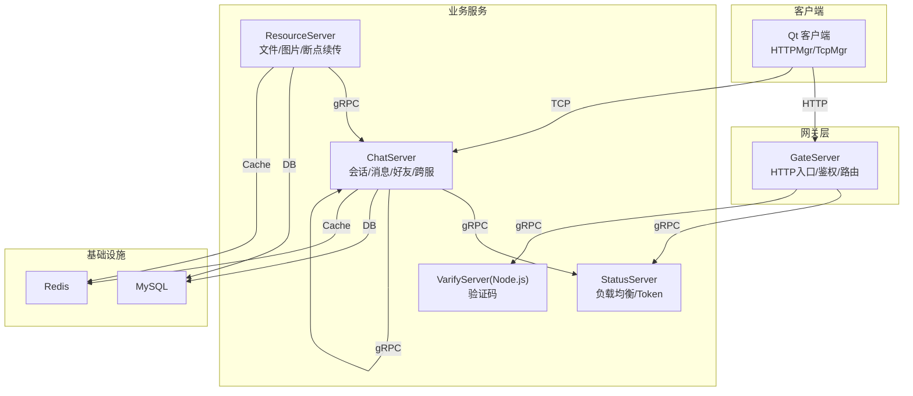
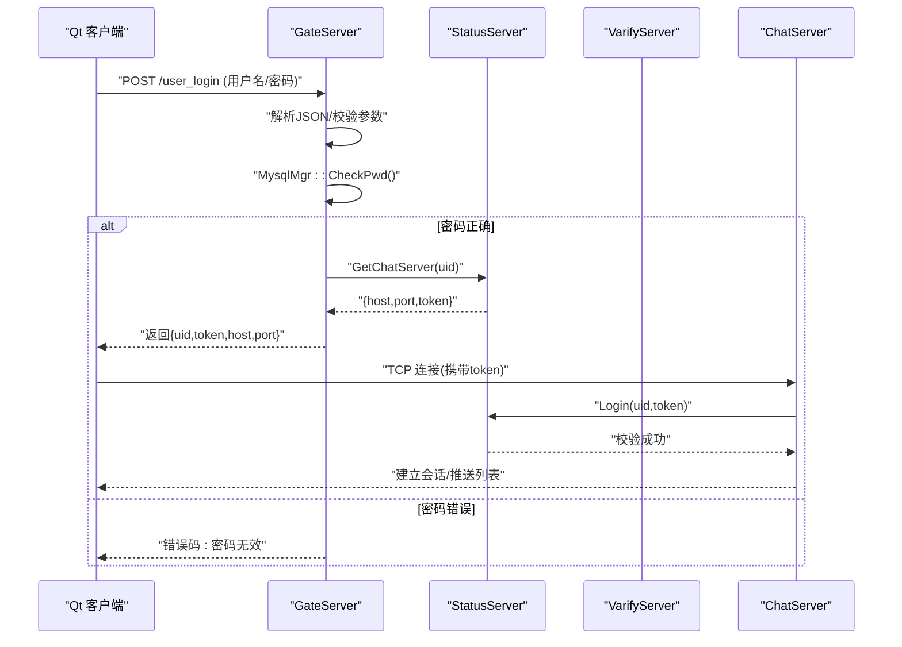
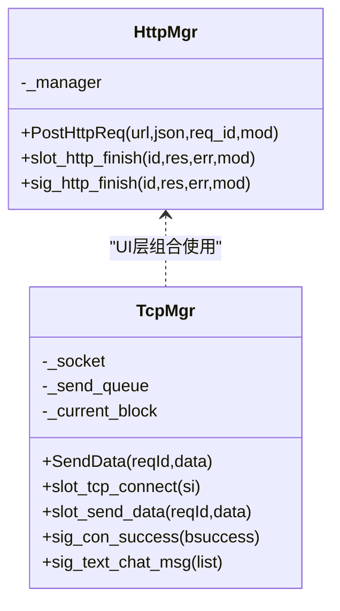
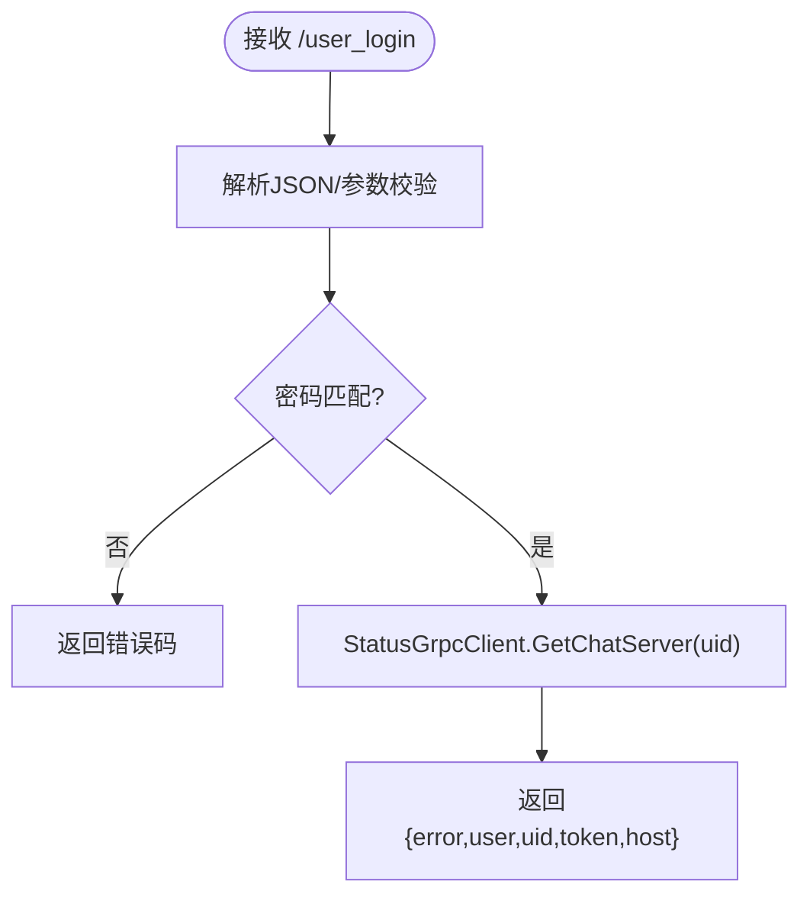
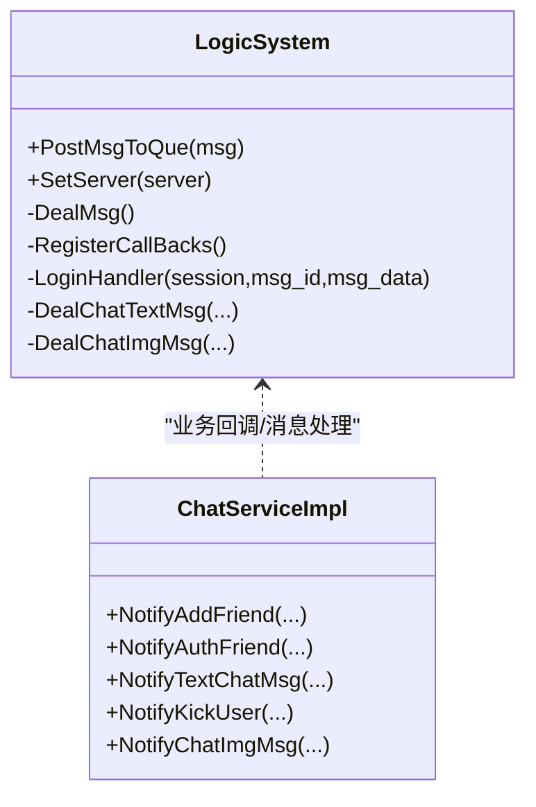
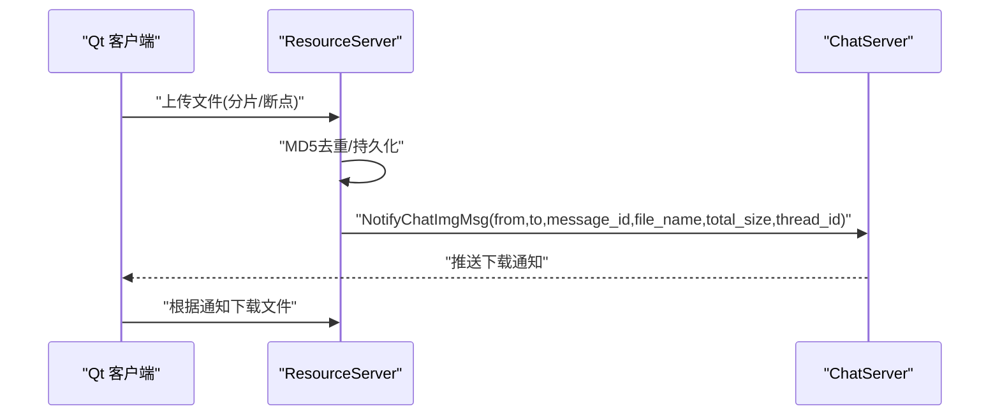
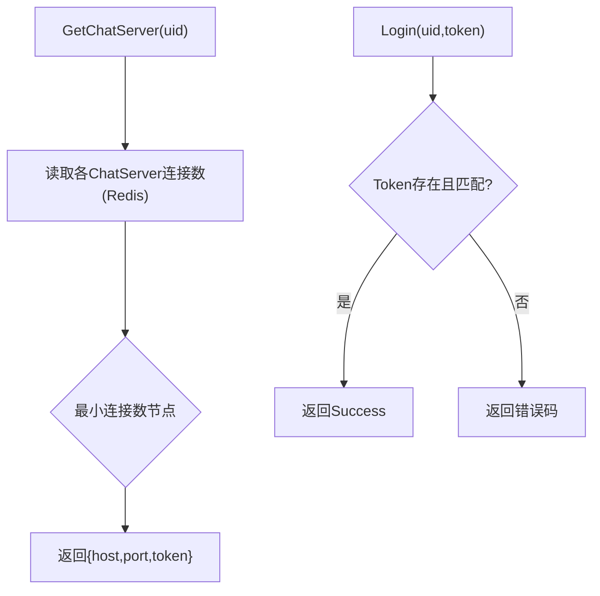
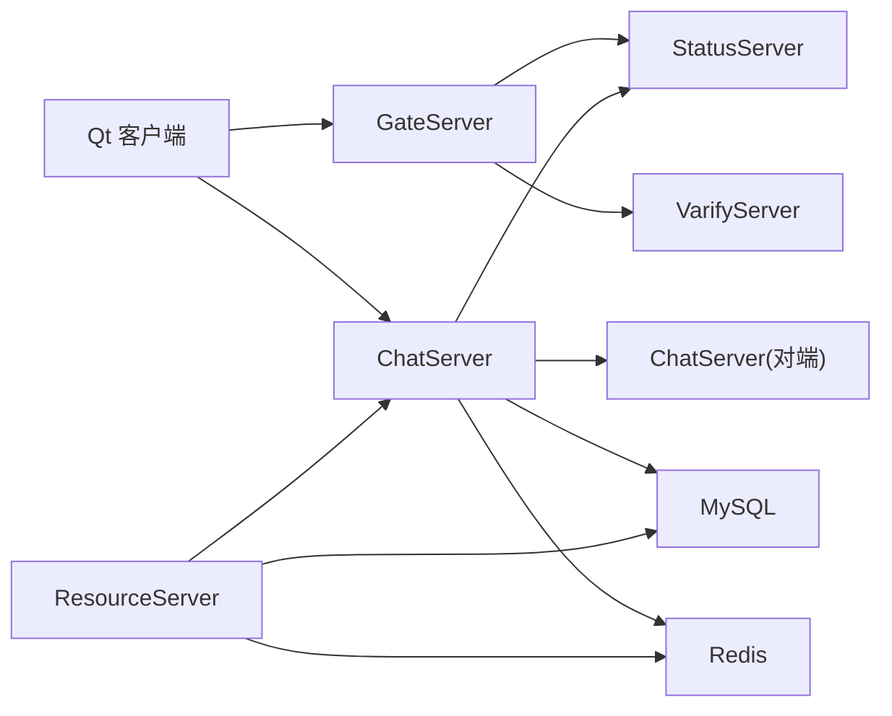

# 系统边界设计

<cite>
**本文引用的文件**   
- [README.md](file://README.md)
- [CMakeLists.txt](file://CMakeLists.txt)
- [client/llfcchat/include/httpmgr.h](file://client/llfcchat/include/httpmgr.h)
- [client/llfcchat/include/tcpmgr.h](file://client/llfcchat/include/tcpmgr.h)
- [server/GateServer/include/LogicSystem.h](file://server/GateServer/include/LogicSystem.h)
- [server/GateServer/config/config.ini](file://server/GateServer/config/config.ini)
- [server/GateServer/CMakeLists.txt](file://server/GateServer/CMakeLists.txt)
- [server/ChatServer/include/LogicSystem.h](file://server/ChatServer/include/LogicSystem.h)
- [server/ChatServer/src/ChatServer.cpp](file://server/ChatServer/src/ChatServer.cpp)
- [server/ChatServer/config/chatserver1.ini](file://server/ChatServer/config/chatserver1.ini)
- [server/StatusServer/include/StatusServiceImpl.h](file://server/StatusServer/include/StatusServiceImpl.h)
- [server/ResourceServer/include/LogicSystem.h](file://server/ResourceServer/include/LogicSystem.h)
- [proto/chat_service/chat.proto](file://proto/chat_service/chat.proto)
- [proto/status_service/status.proto](file://proto/status_service/status.proto)
- [proto/verify_service/verify.proto](file://proto/verify_service/verify.proto)
- [开发文档/day27-分布式服务设计.md](file://开发文档/day27-分布式服务设计.md)
- [开发文档/day14-登录功能.md](file://开发文档/day14-登录功能.md)
- [开发文档/day08-邮箱认证服务.md](file://开发文档/day08-邮箱认证服务.md)
- [开发文档/day37-聊天信息存储方案.md](file://开发文档/day37-聊天信息存储方案.md)
- [开发文档/day41-通知客户端异步下载聊天图片.md](file://开发文档/day41-通知客户端异步下载聊天图片.md)
</cite>

## 目录
1. [引言](#引言)
2. [项目结构](#项目结构)
3. [核心组件](#核心组件)
4. [架构总览](#架构总览)
5. [详细组件分析](#详细组件分析)
6. [依赖关系分析](#依赖关系分析)
7. [性能与扩展性](#性能与扩展性)
8. [故障排查指南](#故障排查指南)
9. [结论](#结论)
10. [附录：接口契约与配置要点](#附录接口契约与配置要点)

## 引言
本文件为 LLFCChat 系统的“系统边界设计”文档，目标是明确客户端应用、网关服务、业务服务与外部依赖的边界范围，定义各组件职责分离、接口契约与依赖关系，说明系统的外部接口、内部 API 和第三方集成点。同时给出系统上下文图、组件图和部署边界图，记录安全边界、访问控制与数据隔离策略，重点阐述微服务间的解耦设计、服务降级与容错机制，并提供系统扩展点和集成指南。

## 项目结构
LLFCChat 采用多进程/多服务架构，包含以下主要模块：
- 客户端（Qt C++）：HTTP 管理、TCP 长连接管理、UI 交互
- 网关服务 GateServer：HTTP 入口、鉴权路由、状态查询、验证码派发
- 聊天服务 ChatServer：用户会话、消息路由、好友关系、跨服通信
- 资源服务 ResourceServer：文件上传/下载、断点续传、图片资源处理
- 状态服务 StatusServer：负载均衡、Token 管理、服务发现
- 验证服务 VarifyServer（Node.js）：验证码生成与校验
- 基础设施：MySQL、Redis、gRPC、Proto 协议

图表来源
- [CMakeLists.txt:1-34](file://CMakeLists.txt#L1-L34)
- [server/GateServer/CMakeLists.txt:31-91](file://server/GateServer/CMakeLists.txt#L31-L91)

章节来源
- [CMakeLists.txt:1-34](file://CMakeLists.txt#L1-L34)
- [README.md:1-112](file://README.md#L1-L112)

## 核心组件
- 客户端 HTTP 管理器（HttpMgr）：封装 HTTP 请求，统一回调与错误码，面向 UI 暴露信号槽接口
- 客户端 TCP 管理器（TcpMgr）：维护与 ChatServer 的 TCP 长连接，负责粘包处理、消息分发、队列发送
- 网关服务（GateServer）：HTTP 路由与逻辑编排，调用 StatusServer 获取 ChatServer 地址与 Token，调用 VarifyServer 派发验证码
- 聊天服务（ChatServer）：实现 gRPC 服务，处理好友申请、认证、文本/图片消息、踢人、跨服转发；维护用户会话与线程
- 资源服务（ResourceServer）：文件分片上传、断点续传、MD5 去重、通知客户端异步下载
- 状态服务（StatusServer）：注册 ChatServer 节点、按连接数负载均衡选择、Token 生命周期管理
- 验证服务（VarifyServer）：基于 Redis 的验证码生成与校验

章节来源
- [client/llfcchat/include/httpmgr.h:1-34](file://client/llfcchat/include/httpmgr.h#L1-L34)
- [client/llfcchat/include/tcpmgr.h:1-90](file://client/llfcchat/include/tcpmgr.h#L1-L90)
- [server/GateServer/include/LogicSystem.h:1-24](file://server/GateServer/include/LogicSystem.h#L1-L24)
- [server/ChatServer/include/LogicSystem.h:1-60](file://server/ChatServer/include/LogicSystem.h#L1-L60)
- [server/ResourceServer/include/LogicSystem.h:1-33](file://server/ResourceServer/include/LogicSystem.h#L1-L33)
- [server/StatusServer/include/StatusServiceImpl.h:1-52](file://server/StatusServer/include/StatusServiceImpl.h#L1-L52)

## 架构总览
系统边界清晰划分：
- 外部边界：客户端通过 HTTP 与 GateServer 交互；通过 TCP 与 ChatServer 进行实时通信；通过 gRPC 在服务器间通信
- 内部边界：GateServer 仅做路由与编排，不持有业务状态；ChatServer 承载聊天业务；ResourceServer 专注文件传输；StatusServer 提供发现与负载；VarifyServer 提供验证码能力
- 数据边界：用户凭证与基础信息落库 MySQL；会话与缓存使用 Redis；文件以 MD5 去重并持久化

图表来源
- [开发文档/day14-登录功能.md:147-329](file://开发文档/day14-登录功能.md#L147-L329)
- [server/StatusServer/include/StatusServiceImpl.h:1-52](file://server/StatusServer/include/StatusServiceImpl.h#L1-L52)

## 详细组件分析

### 客户端边界与职责
- HTTP 边界：通过 HttpMgr 发起注册、重置、登录等 HTTP 请求，统一错误码与模块回调
- TCP 边界：通过 TcpMgr 维持与 ChatServer 的长连接，处理粘包、消息分发、发送队列、心跳与离线通知
- 安全边界：本地保存 token，后续 TCP 握手需携带 token；敏感操作由服务端二次校验

图表来源
- [client/llfcchat/include/httpmgr.h:1-34](file://client/llfcchat/include/httpmgr.h#L1-L34)
- [client/llfcchat/include/tcpmgr.h:1-90](file://client/llfcchat/include/tcpmgr.h#L1-L90)

章节来源
- [client/llfcchat/include/httpmgr.h:1-34](file://client/llfcchat/include/httpmgr.h#L1-L34)
- [client/llfcchat/include/tcpmgr.h:1-90](file://client/llfcchat/include/tcpmgr.h#L1-L90)

### 网关服务 GateServer
- 职责：HTTP 路由、登录校验、验证码派发、状态查询、向 StatusServer 获取 ChatServer 地址与 Token
- 接口契约：/user_login（POST JSON），返回 uid、token、host、port
- 依赖：MysqlMgr、RedisMgr、StatusGrpcClient、VerifyGrpcClient

图表来源
- [server/GateServer/include/LogicSystem.h:1-24](file://server/GateServer/include/LogicSystem.h#L1-L24)
- [开发文档/day14-登录功能.md:147-329](file://开发文档/day14-登录功能.md#L147-L329)

章节来源
- [server/GateServer/include/LogicSystem.h:1-24](file://server/GateServer/include/LogicSystem.h#L1-L24)
- [server/GateServer/config/config.ini:1-25](file://server/GateServer/config/config.ini#L1-L25)
- [server/GateServer/CMakeLists.txt:31-91](file://server/GateServer/CMakeLists.txt#L31-L91)
- [开发文档/day14-登录功能.md:147-329](file://开发文档/day14-登录功能.md#L147-L329)

### 聊天服务 ChatServer
- 职责：gRPC 服务实现、用户会话管理、消息路由、好友关系、跨服转发、心跳与踢人
- 接口契约：chat.proto 定义的 NotifyAddFriend、NotifyAuthFriend、NotifyTextChatMsg、NotifyKickUser、NotifyChatImgMsg
- 依赖：MysqlDao/MysqlMgr、RedisMgr、StatusGrpcClient、对端 ChatServer gRPC 客户端

图表来源
- [server/ChatServer/include/LogicSystem.h:1-60](file://server/ChatServer/include/LogicSystem.h#L1-L60)
- [proto/chat_service/chat.proto:1-105](file://proto/chat_service/chat.proto#L1-L105)

章节来源
- [server/ChatServer/include/LogicSystem.h:1-60](file://server/ChatServer/include/LogicSystem.h#L1-L60)
- [server/ChatServer/src/ChatServer.cpp:40-79](file://server/ChatServer/src/ChatServer.cpp#L40-L79)
- [proto/chat_service/chat.proto:1-105](file://proto/chat_service/chat.proto#L1-L105)
- [开发文档/day37-聊天信息存储方案.md:3462-3528](file://开发文档/day37-聊天信息存储方案.md#L3462-L3528)

### 资源服务 ResourceServer
- 职责：文件上传/下载、断点续传、MD5 去重、通知客户端异步下载
- 接口契约：通过 gRPC 与 ChatServer 协作，下发图片下载通知
- 依赖：MysqlDao/MysqlMgr、RedisMgr、ChatServerGrpcClient

图表来源
- [server/ResourceServer/include/LogicSystem.h:1-33](file://server/ResourceServer/include/LogicSystem.h#L1-L33)
- [开发文档/day41-通知客户端异步下载聊天图片.md:61-157](file://开发文档/day41-通知客户端异步下载聊天图片.md#L61-L157)

章节来源
- [server/ResourceServer/include/LogicSystem.h:1-33](file://server/ResourceServer/include/LogicSystem.h#L1-L33)
- [开发文档/day41-通知客户端异步下载聊天图片.md:61-157](file://开发文档/day41-通知客户端异步下载聊天图片.md#L61-L157)

### 状态服务 StatusServer
- 职责：注册 ChatServer 节点、按连接数负载均衡选择、Token 管理与校验
- 接口契约：status.proto 定义的 GetChatServer、Login
- 依赖：Redis 存储连接计数、内存 Token 表

图表来源
- [server/StatusServer/include/StatusServiceImpl.h:1-52](file://server/StatusServer/include/StatusServiceImpl.h#L1-L52)
- [开发文档/day27-分布式服务设计.md:487-524](file://开发文档/day27-分布式服务设计.md#L487-L524)

章节来源
- [server/StatusServer/include/StatusServiceImpl.h:1-52](file://server/StatusServer/include/StatusServiceImpl.h#L1-L52)
- [开发文档/day27-分布式服务设计.md:221-276](file://开发文档/day27-分布式服务设计.md#L221-L276)
- [开发文档/day27-分布式服务设计.md:487-524](file://开发文档/day27-分布式服务设计.md#L487-L524)

### 验证服务 VarifyServer
- 职责：验证码生成与校验，基于 Redis 缓存
- 接口契约：verify.proto 定义的 GetVarifyCode
- 依赖：Redis

章节来源
- [proto/verify_service/verify.proto:1-19](file://proto/verify_service/verify.proto#L1-L19)
- [开发文档/day08-邮箱认证服务.md:405-445](file://开发文档/day08-邮箱认证服务.md#L405-L445)

## 依赖关系分析
- 客户端依赖：GateServer(HTTP)、ChatServer(TCP)
- GateServer 依赖：StatusServer(gRPC)、VarifyServer(gRPC)、MySQL、Redis
- ChatServer 依赖：StatusServer(gRPC)、对端 ChatServer(gRPC)、MySQL、Redis
- ResourceServer 依赖：ChatServer(gRPC)、MySQL、Redis
- StatusServer 依赖：Redis、内存表

图表来源
- [server/GateServer/CMakeLists.txt:31-91](file://server/GateServer/CMakeLists.txt#L31-L91)
- [server/ChatServer/src/ChatServer.cpp:40-79](file://server/ChatServer/src/ChatServer.cpp#L40-L79)
- [server/StatusServer/include/StatusServiceImpl.h:1-52](file://server/StatusServer/include/StatusServiceImpl.h#L1-L52)

章节来源
- [server/GateServer/CMakeLists.txt:31-91](file://server/GateServer/CMakeLists.txt#L31-L91)
- [server/ChatServer/src/ChatServer.cpp:40-79](file://server/ChatServer/src/ChatServer.cpp#L40-L79)
- [server/StatusServer/include/StatusServiceImpl.h:1-52](file://server/StatusServer/include/StatusServiceImpl.h#L1-L52)

## 性能与扩展性
- 解耦设计
  - GateServer 只做路由与编排，无状态，便于水平扩展
  - ChatServer 通过 gRPC 与对端通信，支持多实例与跨服转发
  - ResourceServer 独立承担文件 IO，避免阻塞聊天主流程
  - StatusServer 集中管理节点与负载，支持动态扩缩容
- 服务降级与容错
  - gRPC 连接池与超时重试（如 ChatServerConPool/StatusConPool）
  - 验证码失败回退到默认错误码，登录失败快速返回
  - 文件上传断点续传，网络异常可恢复
- 扩展点
  - Proto 新增 RPC 方法即可扩展新能力（如群聊、语音）
  - GateServer 新增 HTTP 路由即可接入新前端或第三方系统
  - ChatServer 增加新的消息类型处理器即可扩展业务

章节来源
- [开发文档/day27-分布式服务设计.md:221-276](file://开发文档/day27-分布式服务设计.md#L221-L276)
- [开发文档/day41-通知客户端异步下载聊天图片.md:61-157](file://开发文档/day41-通知客户端异步下载聊天图片.md#L61-L157)
- [proto/chat_service/chat.proto:1-105](file://proto/chat_service/chat.proto#L1-L105)

## 故障排查指南
- 登录失败
  - 检查 GateServer 日志中 JSON 解析与密码校验结果
  - 确认 StatusServer 是否返回有效 host/port/token
  - 核对客户端 TCP 连接是否携带正确 token
- 验证码失败
  - 检查 VarifyServer 运行状态与 Redis 连通性
  - 查看 VerifyGrpcClient 连接池与返回错误码
- 聊天消息未达
  - 检查 ChatServer 是否在线、对端 ChatServer 可达
  - 确认 Redis 连接计数与 Token 有效性
- 文件下载失败
  - 检查 ResourceServer 文件完整性与 MD5 一致性
  - 确认 NotifyChatImgMsg 是否被 ChatServer 正确转发

章节来源
- [开发文档/day14-登录功能.md:147-329](file://开发文档/day14-登录功能.md#L147-L329)
- [开发文档/day08-邮箱认证服务.md:405-445](file://开发文档/day08-邮箱认证服务.md#L405-L445)
- [开发文档/day37-聊天信息存储方案.md:3462-3528](file://开发文档/day37-聊天信息存储方案.md#L3462-L3528)
- [开发文档/day41-通知客户端异步下载聊天图片.md:61-157](file://开发文档/day41-通知客户端异步下载聊天图片.md#L61-L157)

## 结论
LLFCChat 通过清晰的系统边界与职责分离，实现了高内聚、低耦合的微服务架构。GateServer 作为统一入口，ChatServer 承载核心聊天业务，ResourceServer 专注文件传输，StatusServer 提供服务发现与负载均衡，VarifyServer 提供验证码能力。借助 gRPC 与 Proto 契约，系统具备良好的扩展性与可维护性。配合 Redis 与 MySQL 的数据隔离与缓存策略，系统在可用性、可扩展性与安全性方面达到工程级要求。

## 附录：接口契约与配置要点
- 外部接口
  - GateServer HTTP：/user_login（POST JSON），返回用户信息与 ChatServer 地址及 Token
- 内部 API
  - StatusService：GetChatServer、Login
  - ChatService：NotifyAddFriend、NotifyAuthFriend、NotifyTextChatMsg、NotifyKickUser、NotifyChatImgMsg
  - VarifyService：GetVarifyCode
- 配置要点
  - GateServer 配置：端口、VarifyServer、StatusServer、MySQL、Redis、ResourceServer
  - ChatServer 配置：SelfServer（名称、Host、Port、RPCPort）、PeerServer（对端节点）

章节来源
- [server/GateServer/config/config.ini:1-25](file://server/GateServer/config/config.ini#L1-L25)
- [server/ChatServer/config/chatserver1.ini:1-30](file://server/ChatServer/config/chatserver1.ini#L1-L30)
- [proto/status_service/status.proto:1-32](file://proto/status_service/status.proto#L1-L32)
- [proto/chat_service/chat.proto:1-105](file://proto/chat_service/chat.proto#L1-L105)
- [proto/verify_service/verify.proto:1-19](file://proto/verify_service/verify.proto#L1-L19)