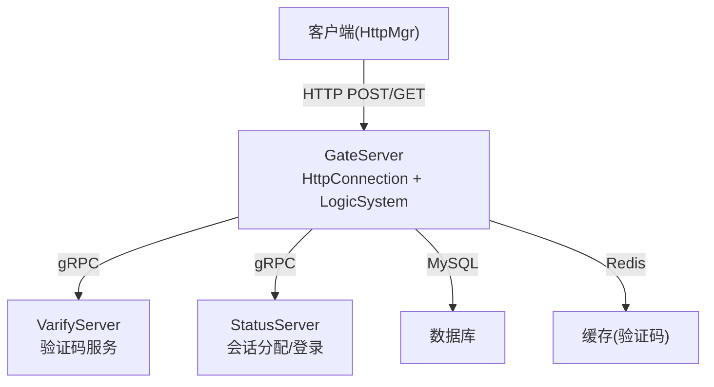
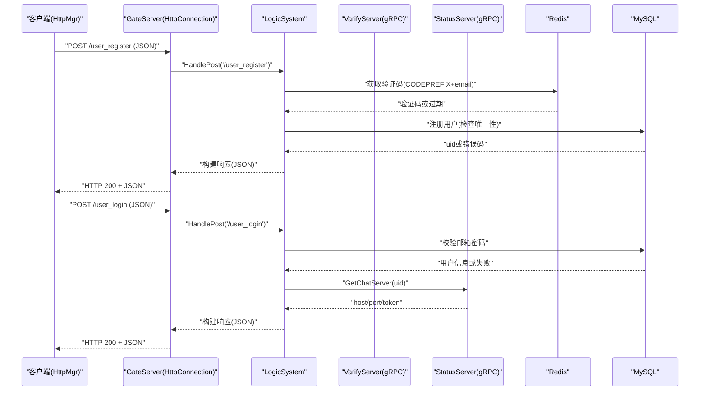
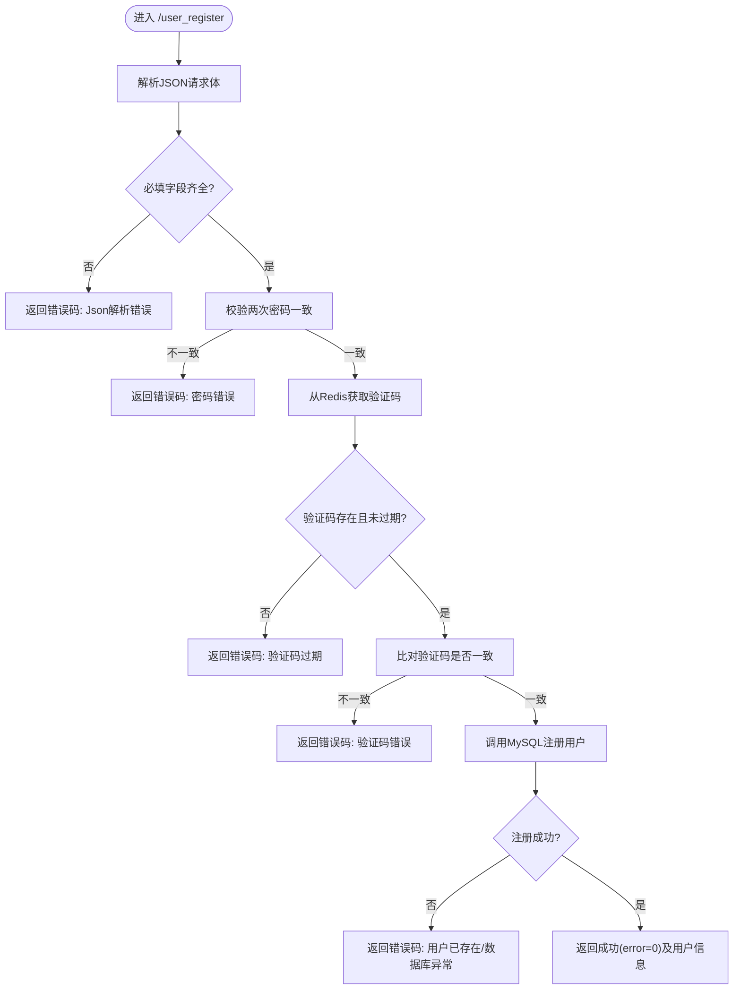
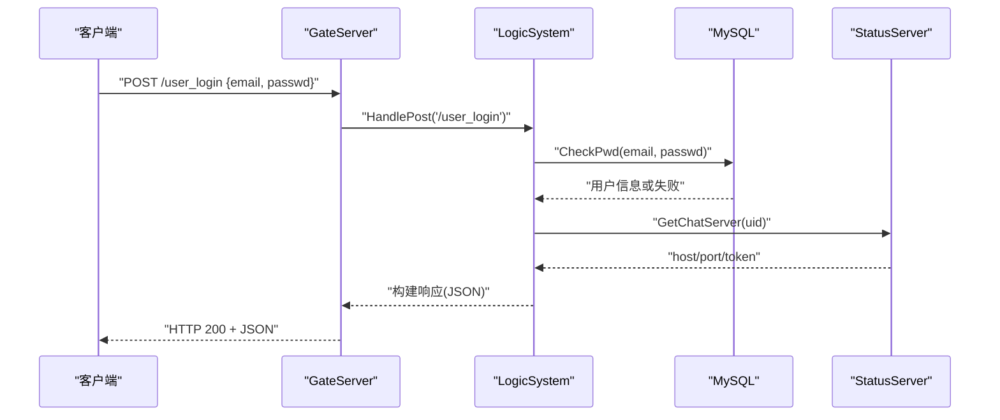
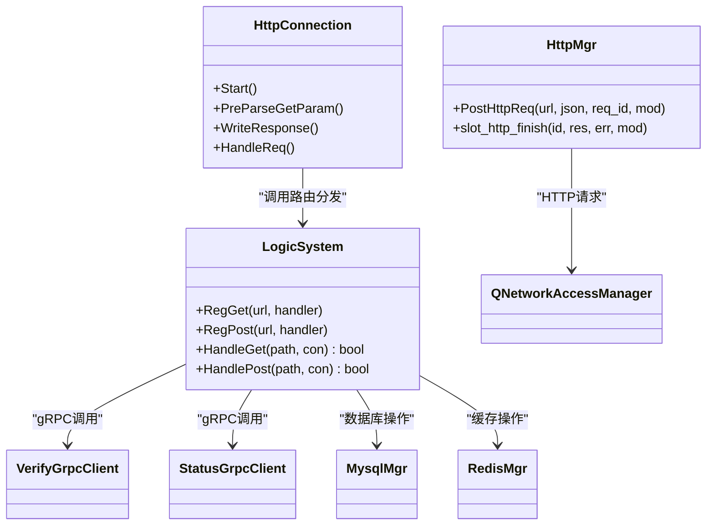

# HTTP API设计

<cite>
**本文引用的文件**   
- [HttpConnection.h](file://server/GateServer/include/HttpConnection.h)
- [HttpConnection.cpp](file://server/GateServer/src/HttpConnection.cpp)
- [LogicSystem.h](file://server/GateServer/include/LogicSystem.h)
- [LogicSystem.cpp](file://server/GateServer/src/LogicSystem.cpp)
- [const.h](file://server/GateServer/include/const.h)
- [httpmgr.h](file://client/llfcchat/include/httpmgr.h)
- [httpmgr.cpp](file://client/llfcchat/src/httpmgr.cpp)
- [global.h](file://client/llfcchat/include/global.h)
- [verify.proto](file://proto/verify_service/verify.proto)
- [status.proto](file://proto/status_service/status.proto)
</cite>

## 目录
1. [简介](#简介)
2. [项目结构](#项目结构)
3. [核心组件](#核心组件)
4. [架构总览](#架构总览)
5. [详细组件分析](#详细组件分析)
6. [依赖关系分析](#依赖关系分析)
7. [性能考虑](#性能考虑)
8. [故障排查指南](#故障排查指南)
9. [结论](#结论)
10. [附录](#附录)

## 简介
本文件为LLFCChat系统的HTTP API设计文档，面向客户端与后端网关（GateServer）的交互。系统采用RESTful风格，通过GateServer统一接收HTTP请求，再根据路由分发到具体业务逻辑；验证码、用户认证与聊天服务分配分别由VarifyServer、StatusServer等微服务提供，GateServer通过gRPC调用这些服务完成业务流程。本文档涵盖：
- RESTful接口规范：URL路径、HTTP方法、请求参数、响应格式
- 认证机制与Token使用
- 错误码定义与HTTP状态码使用规范
- JSON数据格式、字段类型与必填校验
- 完整API调用示例、错误处理策略与性能优化建议
- 客户端交互流程与安全性考虑

## 项目结构
GateServer作为HTTP入口，负责解析请求、路由分发、鉴权与跨服务调用；客户端通过Qt网络模块发起HTTP请求。关键文件职责如下：
- GateServer侧：
  - HttpConnection：封装HTTP连接、请求/响应对象、超时控制、CORS设置、GET参数解析
  - LogicSystem：注册并分发GET/POST路由，执行业务逻辑
  - const.h：全局错误码、常量定义
- 客户端侧：
  - httpmgr：封装QNetworkAccessManager，统一发送POST请求、处理响应信号
  - global.h：通用枚举、常量、数据结构（如ReqId、Modules、传输相关常量）
- gRPC协议：
  - verify.proto：验证码服务接口
  - status.proto：状态服务接口（分配ChatServer、登录校验）

**图表来源** 
- [HttpConnection.cpp:132-194](file://server/GateServer/src/HttpConnection.cpp#L132-L194)
- [LogicSystem.cpp:36-396](file://server/GateServer/src/LogicSystem.cpp#L36-L396)
- [verify.proto:1-19](file://proto/verify_service/verify.proto#L1-L19)
- [status.proto:1-32](file://proto/status_service/status.proto#L1-L32)

**章节来源**
- [HttpConnection.h:1-36](file://server/GateServer/include/HttpConnection.h#L1-L36)
- [HttpConnection.cpp:1-225](file://server/GateServer/src/HttpConnection.cpp#L1-L225)
- [LogicSystem.h:1-24](file://server/GateServer/include/LogicSystem.h#L1-L24)
- [LogicSystem.cpp:1-467](file://server/GateServer/src/LogicSystem.cpp#L1-L467)
- [const.h:1-65](file://server/GateServer/include/const.h#L1-L65)
- [httpmgr.h:1-34](file://client/llfcchat/include/httpmgr.h#L1-L34)
- [httpmgr.cpp:1-62](file://client/llfcchat/src/httpmgr.cpp#L1-L62)
- [global.h:1-296](file://client/llfcchat/include/global.h#L1-L296)
- [verify.proto:1-19](file://proto/verify_service/verify.proto#L1-L19)
- [status.proto:1-32](file://proto/status_service/status.proto#L1-L32)

## 核心组件
- GateServer HTTP连接层（HttpConnection）
  - 异步读取请求、设置CORS、短连接、超时控制
  - GET请求参数解析（URL解码、键值对提取）
  - 统一响应写入与Content-Type设置
- GateServer 路由与业务分发（LogicSystem）
  - 注册GET/POST路由映射
  - HandleGet/HandlePost查找并执行对应处理器
  - 各业务处理器实现JSON解析、校验、跨服务调用、响应构建
- 客户端HTTP管理器（HttpMgr）
  - 统一POST请求封装，设置application/json
  - 异步回调处理网络错误与成功响应，按模块分发信号

**章节来源**
- [HttpConnection.cpp:132-194](file://server/GateServer/src/HttpConnection.cpp#L132-L194)
- [LogicSystem.cpp:406-467](file://server/GateServer/src/LogicSystem.cpp#L406-L467)
- [httpmgr.cpp:8-62](file://client/llfcchat/src/httpmgr.cpp#L8-L62)

## 架构总览
GateServer作为统一入口，将HTTP请求分发至具体业务处理器；业务处理器根据需要调用验证码服务（VarifyServer）与状态服务（StatusServer），并通过Redis与MySQL进行缓存与持久化。客户端通过Qt网络模块发起HTTP请求，收到响应后按模块分发结果。

**图表来源** 
- [LogicSystem.cpp:148-396](file://server/GateServer/src/LogicSystem.cpp#L148-L396)
- [verify.proto:1-19](file://proto/verify_service/verify.proto#L1-L19)
- [status.proto:1-32](file://proto/status_service/status.proto#L1-L32)

## 详细组件分析

### 接口规范与路由
- 基础约定
  - 所有接口返回JSON，Content-Type为text/json
  - 统一错误码字段error，成功为0，其他见错误码表
  - HTTP状态码：成功200，未找到路由404
- 已实现的HTTP接口
  - GET /get_test：测试接口，回显GET查询参数
  - POST /test_procedure：测试存储过程调用
  - POST /get_varifycode：获取邮箱验证码
  - POST /user_register：用户注册
  - POST /reset_pwd：重置密码
  - POST /user_login：用户登录

**章节来源**
- [LogicSystem.cpp:36-396](file://server/GateServer/src/LogicSystem.cpp#L36-L396)
- [HttpConnection.cpp:132-194](file://server/GateServer/src/HttpConnection.cpp#L132-L194)

### 用户注册接口
- URL与方法：POST /user_register
- 请求体字段（JSON）
  - email：字符串，必填，邮箱地址
  - user：字符串，必填，用户名/昵称
  - passwd：字符串，必填，密码
  - confirm：字符串，必填，确认密码
  - icon：字符串，可选，头像（base64或路径）
  - varifycode：字符串，必填，验证码
- 响应体字段（JSON）
  - error：整数，错误码
  - uid：整数，新用户ID（成功时）
  - email/user/passwd/confirm/icon/varifycode：原样回显（用于调试）
- 处理流程
  - 解析JSON，校验必填字段
  - 校验两次密码一致
  - Redis校验验证码是否过期且匹配
  - MySQL注册用户，检查唯一性
  - 返回成功或错误码

**图表来源** 
- [LogicSystem.cpp:148-233](file://server/GateServer/src/LogicSystem.cpp#L148-L233)

**章节来源**
- [LogicSystem.cpp:148-233](file://server/GateServer/src/LogicSystem.cpp#L148-L233)

### 重置密码接口
- URL与方法：POST /reset_pwd
- 请求体字段（JSON）
  - email：字符串，必填，邮箱地址
  - user：字符串，必填，用户名
  - passwd：字符串，必填，新密码
  - varifycode：字符串，必填，验证码
- 响应体字段（JSON）
  - error：整数，错误码
  - email/user/passwd/varifycode：原样回显
- 处理流程
  - 解析JSON，校验必填字段
  - Redis校验验证码是否过期且匹配
  - MySQL校验用户名与邮箱是否匹配
  - 更新数据库密码，返回成功或错误码

**章节来源**
- [LogicSystem.cpp:235-316](file://server/GateServer/src/LogicSystem.cpp#L235-L316)

### 用户登录接口
- URL与方法：POST /user_login
- 请求体字段（JSON）
  - email：字符串，必填，邮箱地址
  - passwd：字符串，必填，密码
- 响应体字段（JSON）
  - error：整数，错误码
  - email：字符串，邮箱
  - uid：整数，用户ID
  - token：字符串，TCP连接认证令牌
  - chathost/chatport：字符串，分配的ChatServer地址与端口
  - reshost/resport：字符串，ResourceServer地址与端口
- 处理流程
  - 解析JSON，校验必填字段
  - MySQL校验邮箱与密码，获取用户信息
  - 调用StatusServer分配ChatServer（返回host/port/token）
  - 读取配置获取ResourceServer信息
  - 返回成功或错误码

**图表来源** 
- [LogicSystem.cpp:318-396](file://server/GateServer/src/LogicSystem.cpp#L318-L396)
- [status.proto:1-32](file://proto/status_service/status.proto#L1-L32)

**章节来源**
- [LogicSystem.cpp:318-396](file://server/GateServer/src/LogicSystem.cpp#L318-L396)

### 获取验证码接口
- URL与方法：POST /get_varifycode
- 请求体字段（JSON）
  - email：字符串，必填，邮箱地址
- 响应体字段（JSON）
  - error：整数，错误码
  - email：字符串，邮箱
- 处理流程
  - 解析JSON，校验必填字段
  - 调用VarifyServer生成验证码并发送邮件，同时存入Redis（key为CODEPREFIX+email）
  - 返回错误码与邮箱

**章节来源**
- [LogicSystem.cpp:105-147](file://server/GateServer/src/LogicSystem.cpp#L105-L147)
- [verify.proto:1-19](file://proto/verify_service/verify.proto#L1-L19)

### 文件上传接口说明
当前GateServer的HTTP路由中未包含文件上传接口。结合客户端global.h中的文件传输相关常量与枚举，文件上传通常通过TCP长连接或专用资源服务器（ResourceServer）完成。若需扩展HTTP文件上传，建议在GateServer新增路由处理器，实现分块上传、断点续传、MD5校验等逻辑，并与ResourceServer协同。

[本节为概念性说明，不直接分析具体文件]

### 认证机制与Token使用
- 登录成功后，GateServer返回token给客户端
- 客户端后续与ChatServer建立TCP连接时使用该token进行认证
- Token由StatusServer生成并随ChatServer分配信息一并返回

**章节来源**
- [LogicSystem.cpp:318-396](file://server/GateServer/src/LogicSystem.cpp#L318-L396)
- [status.proto:1-32](file://proto/status_service/status.proto#L1-L32)

### 错误码定义与HTTP状态码使用规范
- 错误码（error字段）
  - 0：成功
  - 1001：JSON解析错误
  - 1002：RPC请求错误
  - 1003：验证码过期
  - 1004：验证码错误
  - 1005：用户已存在
  - 1006：密码错误
  - 1007：邮箱不匹配
  - 1008：更新密码失败
  - 1009：密码无效
  - 1010：Token失效
  - 1011：UID无效
- HTTP状态码
  - 200：请求成功
  - 404：未找到路由（当LogicSystem未注册对应路径时）

**章节来源**
- [const.h:31-44](file://server/GateServer/include/const.h#L31-L44)
- [HttpConnection.cpp:146-194](file://server/GateServer/src/HttpConnection.cpp#L146-L194)

### JSON数据格式与字段验证
- Content-Type统一为text/json
- 所有接口在处理器内解析JSON，缺失必填字段或解析失败返回错误码1001
- 字段类型与必填要求在各接口段落中明确列出

**章节来源**
- [LogicSystem.cpp:60-103](file://server/GateServer/src/LogicSystem.cpp#L60-L103)
- [LogicSystem.cpp:105-147](file://server/GateServer/src/LogicSystem.cpp#L105-L147)
- [LogicSystem.cpp:148-233](file://server/GateServer/src/LogicSystem.cpp#L148-L233)
- [LogicSystem.cpp:235-316](file://server/GateServer/src/LogicSystem.cpp#L235-L316)
- [LogicSystem.cpp:318-396](file://server/GateServer/src/LogicSystem.cpp#L318-L396)

### 客户端HTTP调用示例
- 使用HttpMgr发送POST请求，设置Content-Type为application/json
- 请求完成后通过信号槽机制分发到对应模块（REGISTERMOD/RESETMOD/LOGINMOD）
- 错误处理：网络错误返回ERR_NETWORK，成功则携带响应体

**章节来源**
- [httpmgr.cpp:8-62](file://client/llfcchat/src/httpmgr.cpp#L8-L62)
- [global.h:91-101](file://client/llfcchat/include/global.h#L91-L101)

## 依赖关系分析
GateServer内部依赖关系：
- HttpConnection依赖LogicSystem进行路由分发
- LogicSystem依赖VerifyGrpcClient、StatusGrpcClient、MysqlMgr、RedisMgr
- 客户端HttpMgr依赖QNetworkAccessManager

**图表来源** 
- [HttpConnection.h:1-36](file://server/GateServer/include/HttpConnection.h#L1-L36)
- [LogicSystem.h:1-24](file://server/GateServer/include/LogicSystem.h#L1-L24)
- [httpmgr.h:1-34](file://client/llfcchat/include/httpmgr.h#L1-L34)

**章节来源**
- [HttpConnection.h:1-36](file://server/GateServer/include/HttpConnection.h#L1-L36)
- [LogicSystem.h:1-24](file://server/GateServer/include/LogicSystem.h#L1-L24)
- [httpmgr.h:1-34](file://client/llfcchat/include/httpmgr.h#L1-L34)

## 性能考虑
- 连接管理
  - 使用短连接（keep_alive=false），避免连接池复杂性与资源占用
  - 设置连接超时（60秒），防止僵尸连接
- 并发与异步
  - 基于Boost.Asio的异步读写，提升吞吐
  - 客户端使用Qt的信号槽异步处理响应，避免阻塞UI
- 缓存与数据库
  - 验证码缓存于Redis，减少邮件服务压力与重复发送
  - MySQL操作尽量使用预处理语句与索引优化
- 网络与序列化
  - 统一JSON格式，减少解析复杂度
  - 合理设置Content-Length，避免粘包问题

[本节为通用性能建议，不直接分析具体文件]

## 故障排查指南
- 常见问题
  - JSON解析失败：检查请求体是否为合法JSON，确保Content-Type正确
  - 验证码过期或错误：确认验证码是否已发送且在有效期内，核对输入
  - 用户已存在：检查邮箱或用户名是否已注册
  - RPC失败：检查VarifyServer/StatusServer可用性
  - 未找到路由：确认URL路径是否正确注册
- 定位步骤
  - 查看GateServer日志输出（请求体、错误码）
  - 检查Redis中验证码是否存在
  - 验证MySQL查询结果与更新操作
  - 确认gRPC调用返回值与错误信息

**章节来源**
- [LogicSystem.cpp:60-103](file://server/GateServer/src/LogicSystem.cpp#L60-L103)
- [LogicSystem.cpp:105-147](file://server/GateServer/src/LogicSystem.cpp#L105-L147)
- [LogicSystem.cpp:148-233](file://server/GateServer/src/LogicSystem.cpp#L148-L233)
- [LogicSystem.cpp:235-316](file://server/GateServer/src/LogicSystem.cpp#L235-L316)
- [LogicSystem.cpp:318-396](file://server/GateServer/src/LogicSystem.cpp#L318-L396)

## 结论
LLFCChat的HTTP API以GateServer为核心，采用RESTful风格与JSON数据格式，实现了用户注册、重置密码、登录与验证码获取等关键功能。系统通过gRPC与微服务协作，结合Redis与MySQL完成缓存与持久化。客户端通过HttpMgr统一发起请求并处理响应。整体设计清晰、可扩展性强，适合进一步扩展文件上传等高级功能。

[本节为总结性内容，不直接分析具体文件]

## 附录
- 安全建议
  - 生产环境限制CORS来源，避免*通配
  - 对敏感字段（密码）进行加密传输与存储
  - 增加请求频率限制与IP白名单
- 扩展建议
  - 新增文件上传HTTP接口，支持分块与断点续传
  - 引入统一的API网关鉴权中间件
  - 完善错误码分类与国际化提示

[本节为概念性建议，不直接分析具体文件]