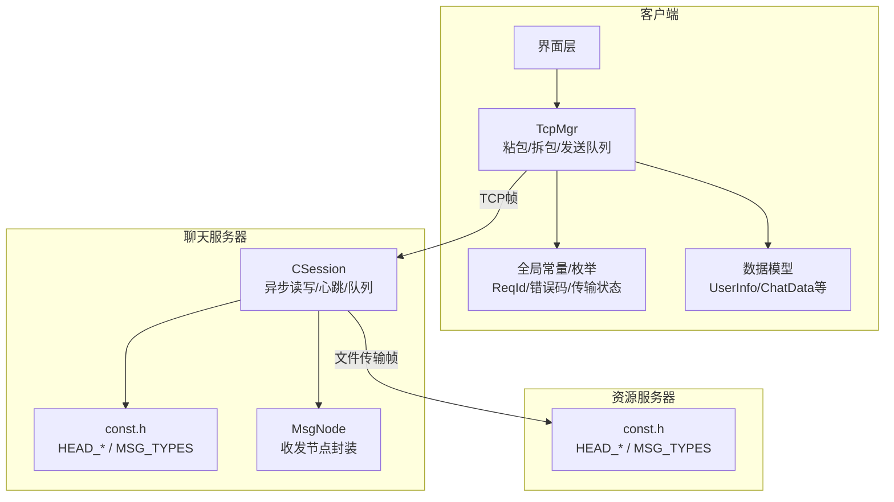
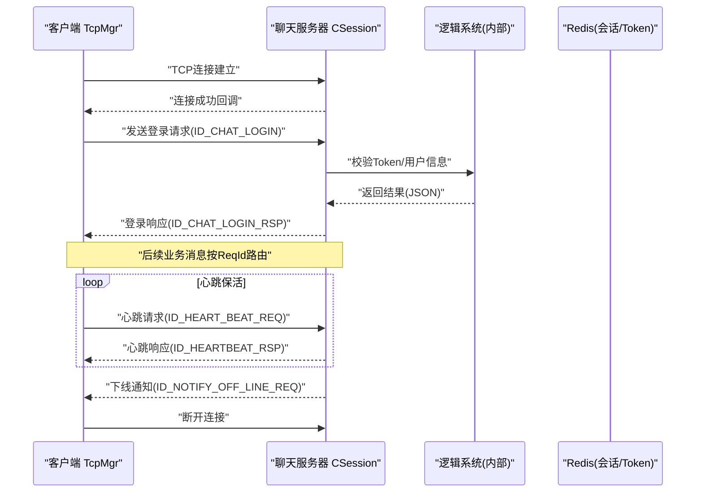
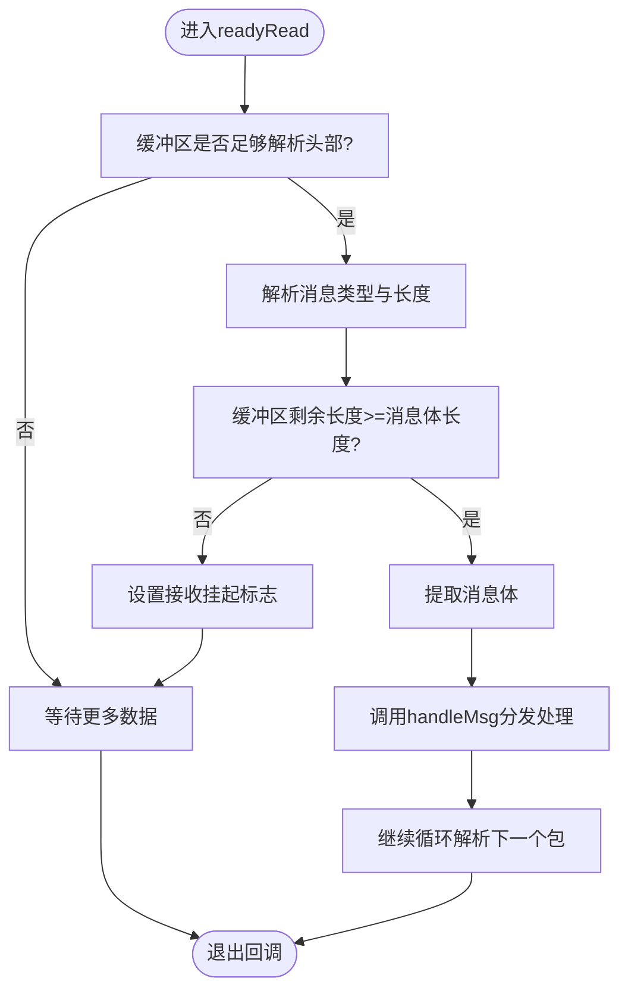
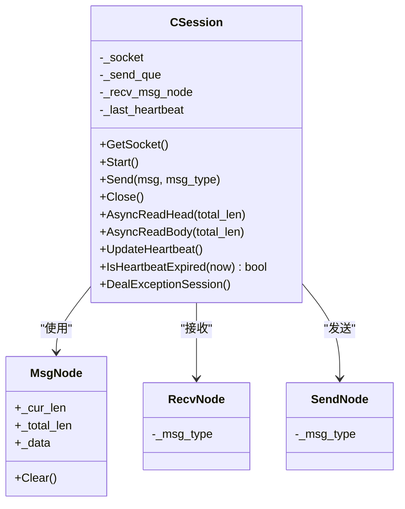
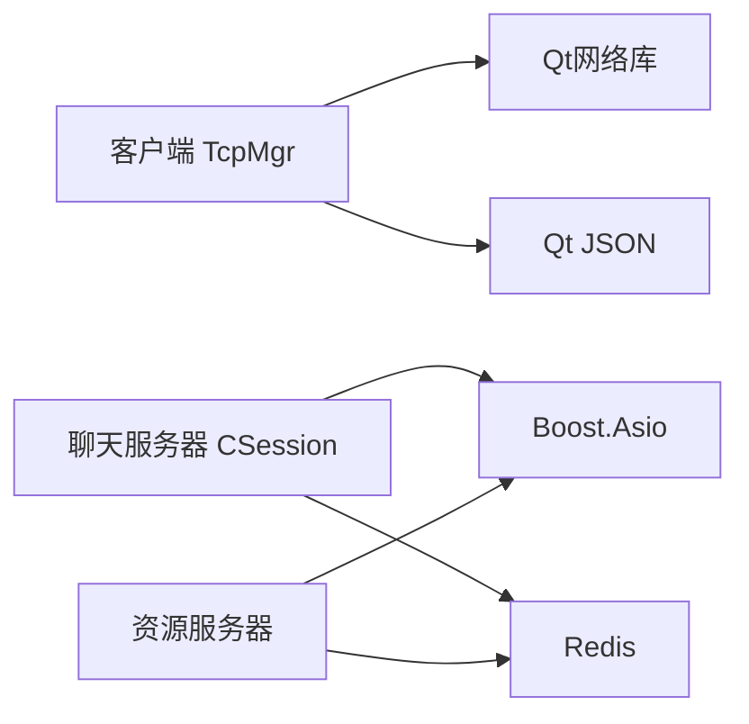
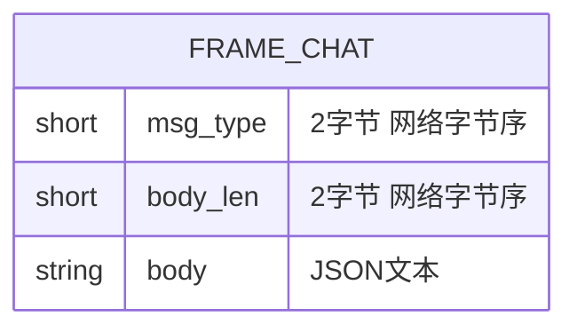
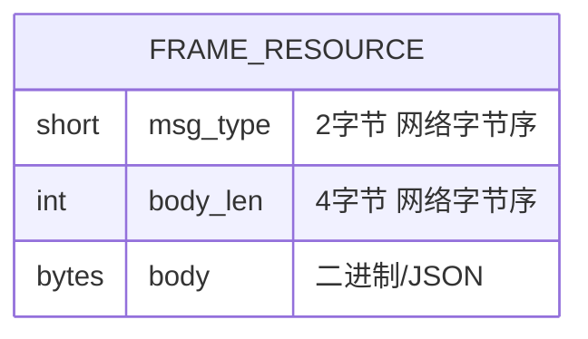

# TCP二进制协议

<cite>
**本文引用的文件**   
- [tcpmgr.h](file://client/llfcchat/include/tcpmgr.h)
- [tcpmgr.cpp](file://client/llfcchat/src/tcpmgr.cpp)
- [global.h](file://client/llfcchat/include/global.h)
- [userdata.h](file://client/llfcchat/include/userdata.h)
- [CSession.h](file://server/ChatServer/include/CSession.h)
- [CSession.cpp](file://server/ChatServer/src/CSession.cpp)
- [const.h（聊天服务器）](file://server/ChatServer/include/const.h)
- [MsgNode.h](file://server/ChatServer/include/MsgNode.h)
- [const.h（资源服务器）](file://server/ResourceServer/include/const.h)
</cite>

## 目录
1. [简介](#简介)
2. [项目结构](#项目结构)
3. [核心组件](#核心组件)
4. [架构总览](#架构总览)
5. [详细组件分析](#详细组件分析)
6. [依赖关系分析](#依赖关系分析)
7. [性能考虑](#性能考虑)
8. [故障排查指南](#故障排查指南)
9. [结论](#结论)
10. [附录：消息帧格式与示例](#附录消息帧格式与示例)

## 简介
本设计文档面向LLFCChat系统的TCP二进制通信协议，覆盖以下要点：
- 自定义二进制消息帧格式：头部字段、长度编码、字节序与边界处理
- 连接建立流程、身份认证握手、心跳保活机制、断线重连策略
- 消息类型标识、序列号管理、流量控制与拥塞窗口
- 协议版本兼容、错误处理与异常恢复方案
- 完整消息帧规范与示例数据包说明

该协议在客户端使用Qt网络栈进行粘包/拆包处理，在服务端基于Boost.Asio实现异步I/O与队列化发送。

## 项目结构
- 客户端（Qt）负责TCP连接、粘包处理、消息编解码、事件分发与UI交互
- 聊天服务器（C++/Asio）负责会话管理、消息路由、心跳检测与离线通知
- 资源服务器（C++/Asio）负责大文件分片上传下载、续传与进度同步
- 全局常量与枚举定义消息类型、错误码、传输状态等

**图表来源** 
- [tcpmgr.h:1-90](file://client/llfcchat/include/tcpmgr.h#L1-L90)
- [tcpmgr.cpp:1-137](file://client/llfcchat/src/tcpmgr.cpp#L1-L137)
- [global.h:43-88](file://client/llfcchat/include/global.h#L43-L88)
- [CSession.h:28-76](file://server/ChatServer/include/CSession.h#L28-L76)
- [const.h（聊天服务器）:38-79](file://server/ChatServer/include/const.h#L38-L79)
- [MsgNode.h:1-48](file://server/ChatServer/include/MsgNode.h#L1-L48)
- [const.h（资源服务器）:53-95](file://server/ResourceServer/include/const.h#L53-L95)

**章节来源**
- [tcpmgr.h:1-90](file://client/llfcchat/include/tcpmgr.h#L1-L90)
- [tcpmgr.cpp:1-137](file://client/llfcchat/src/tcpmgr.cpp#L1-L137)
- [global.h:43-88](file://client/llfcchat/include/global.h#L43-L88)
- [CSession.h:28-76](file://server/ChatServer/include/CSession.h#L28-L76)
- [const.h（聊天服务器）:38-79](file://server/ChatServer/include/const.h#L38-L79)
- [MsgNode.h:1-48](file://server/ChatServer/include/MsgNode.h#L1-L48)
- [const.h（资源服务器）:53-95](file://server/ResourceServer/include/const.h#L53-L95)

## 核心组件
- 客户端TcpMgr
  - 负责QTcpSocket生命周期、readyRead粘包解析、bytesWritten分段发送、发送队列与pending标志
  - 维护_message_type/_message_len用于解析头部，_buffer作为接收缓冲
- 服务端CSession
  - 基于Asio的异步读头/体、写队列、心跳更新与过期检测、异常会话清理
  - 使用RecvNode/SendNode封装消息体与头部信息
- 全局常量与枚举
  - ReqId定义所有业务消息类型；ErrorCodes统一错误码；传输状态与消息类型枚举

**章节来源**
- [tcpmgr.h:22-87](file://client/llfcchat/include/tcpmgr.h#L22-L87)
- [tcpmgr.cpp:18-137](file://client/llfcchat/src/tcpmgr.cpp#L18-L137)
- [CSession.h:28-76](file://server/ChatServer/include/CSession.h#L28-L76)
- [CSession.cpp:130-191](file://server/ChatServer/src/CSession.cpp#L130-L191)
- [global.h:43-88](file://client/llfcchat/include/global.h#L43-L88)

## 架构总览
下图展示客户端与服务端的交互流程，包括连接建立、登录认证、消息收发与心跳保活。

**图表来源** 
- [tcpmgr.cpp:18-137](file://client/llfcchat/src/tcpmgr.cpp#L18-L137)
- [CSession.cpp:130-191](file://server/ChatServer/src/CSession.cpp#L130-L191)
- [CSession.cpp:250-277](file://server/ChatServer/src/CSession.cpp#L250-L277)
- [global.h:43-88](file://client/llfcchat/include/global.h#L43-L88)
- [const.h（聊天服务器）:49-79](file://server/ChatServer/include/const.h#L49-L79)

## 详细组件分析

### 客户端TcpMgr：粘包/拆包与发送队列
- 接收流程
  - readyRead将所有可读数据追加到_buffer
  - 循环解析：先读取固定长度的头部（消息类型+长度），再根据长度读取消息体
  - 若头部或体不完整，设置_b_recv_pending并继续等待
- 发送流程
  - bytesWritten回调中累计已发送字节数，未发完则继续write
  - 发送完成后检查_send_queue，若有下一包则继续出队发送
  - 使用_pending标志避免并发写入冲突

**图表来源** 
- [tcpmgr.cpp:18-55](file://client/llfcchat/src/tcpmgr.cpp#L18-L55)

**章节来源**
- [tcpmgr.cpp:18-137](file://client/llfcchat/src/tcpmgr.cpp#L18-L137)

### 服务端CSession：异步读写、心跳与异常处理
- 读流程
  - AsyncReadHead读取固定长度头部，解析msg_type与msg_len（网络字节序转换）
  - 校验合法性后分配RecvNode并AsyncReadBody读取完整消息体
  - 将消息投递至逻辑队列，随后继续监听头部
- 写流程
  - Send将消息封装为SendNode入队，若队列为空则立即异步写出
  - HandleWrite在回调中弹出已发送节点并继续发送下一包
- 心跳与异常
  - UpdateHeartbeat每次收到数据时更新时间戳
  - IsHeartbeatExpired判断超时（如20秒）触发清理
  - DealExceptionSession清理Redis中的会话与Token，防止多端登录冲突

**图表来源** 
- [CSession.h:28-76](file://server/ChatServer/include/CSession.h#L28-L76)
- [MsgNode.h:1-48](file://server/ChatServer/include/MsgNode.h#L1-L48)
- [CSession.cpp:130-191](file://server/ChatServer/src/CSession.cpp#L130-L191)
- [CSession.cpp:200-217](file://server/ChatServer/src/CSession.cpp#L200-L217)
- [CSession.cpp:285-333](file://server/ChatServer/src/CSession.cpp#L285-L333)

**章节来源**
- [CSession.cpp:130-191](file://server/ChatServer/src/CSession.cpp#L130-L191)
- [CSession.cpp:200-217](file://server/ChatServer/src/CSession.cpp#L200-L217)
- [CSession.cpp:285-333](file://server/ChatServer/src/CSession.cpp#L285-L333)

### 消息类型标识与错误码
- 客户端ReqId与服务端MSG_TYPES保持一致，涵盖登录、搜索、好友申请、聊天消息、心跳、文件传输等
- ErrorCodes统一错误码，包含SUCCESS、JSON解析失败、网络错误、Token失效等

**章节来源**
- [global.h:43-88](file://client/llfcchat/include/global.h#L43-L88)
- [const.h（聊天服务器）:49-79](file://server/ChatServer/include/const.h#L49-L79)

### 数据模型与消息体
- 客户端使用QJsonDocument/QJsonObject对消息体进行编解码
- 数据结构包括UserInfo、TextChatData、ImgChatData、ChatThreadInfo等，便于UI渲染与业务处理

**章节来源**
- [tcpmgr.cpp:182-800](file://client/llfcchat/src/tcpmgr.cpp#L182-L800)
- [userdata.h:1-288](file://client/llfcchat/include/userdata.h#L1-L288)

## 依赖关系分析
- 客户端依赖Qt网络库与JSON库，通过TcpMgr统一管理IO与消息分发
- 服务端依赖Boost.Asio进行高性能异步IO，使用Redis进行会话与分布式锁管理
- 资源服务器与聊天服务器共享部分消息类型与错误码，但头部长度不同（聊天服务器4字节，资源服务器6字节）

**图表来源** 
- [tcpmgr.h:1-90](file://client/llfcchat/include/tcpmgr.h#L1-L90)
- [CSession.h:1-27](file://server/ChatServer/include/CSession.h#L1-L27)
- [const.h（聊天服务器）:38-47](file://server/ChatServer/include/const.h#L38-L47)
- [const.h（资源服务器）:53-61](file://server/ResourceServer/include/const.h#L53-L61)

**章节来源**
- [tcpmgr.h:1-90](file://client/llfcchat/include/tcpmgr.h#L1-L90)
- [CSession.h:1-27](file://server/ChatServer/include/CSession.h#L1-L27)
- [const.h（聊天服务器）:38-47](file://server/ChatServer/include/const.h#L38-L47)
- [const.h（资源服务器）:53-61](file://server/ResourceServer/include/const.h#L53-L61)

## 性能考虑
- 客户端发送队列与bytesWritten分段写入避免阻塞UI线程
- 服务端使用异步读写与队列化发送，限制最大队列长度防止内存溢出
- 心跳间隔与超时阈值需合理配置，避免频繁心跳或误判离线
- 大文件传输采用分片与续传，减少单次传输压力

[本节为通用指导，不直接分析具体文件]

## 故障排查指南
- 连接失败
  - 检查网络连通性与端口配置
  - 查看客户端error信号分支（连接拒绝、主机未找到、超时等）
- 粘包/丢包
  - 确认客户端缓冲区长度判断与_remove操作正确
  - 检查服务端AsyncReadHead/AsyncReadBody长度一致性
- 心跳超时
  - 核对IsHeartbeatExpired阈值与UpdateHeartbeat调用时机
  - 检查网络延迟与服务器负载
- 多端登录冲突
  - 查看DealExceptionSession中Redis会话清理逻辑

**章节来源**
- [tcpmgr.cpp:64-98](file://client/llfcchat/src/tcpmgr.cpp#L64-L98)
- [CSession.cpp:285-333](file://server/ChatServer/src/CSession.cpp#L285-L333)

## 结论
LLFCChat的TCP二进制协议通过固定长度头部与动态长度消息体实现高效可靠的通信。客户端与服务端分别采用Qt与Asio的高性能I/O模型，结合心跳保活与异常恢复机制，确保连接的稳定性与用户体验。未来可进一步优化消息压缩、加密与版本协商机制。

[本节为总结性内容，不直接分析具体文件]

## 附录：消息帧格式与示例

### 聊天服务器消息帧格式
- 头部总长度：4字节
- 头部组成：
  - 消息类型：2字节（网络字节序）
  - 消息体长度：2字节（网络字节序）
- 消息体：JSON字符串（UTF-8）

**图表来源** 
- [const.h（聊天服务器）:38-47](file://server/ChatServer/include/const.h#L38-L47)
- [CSession.cpp:160-175](file://server/ChatServer/src/CSession.cpp#L160-L175)

### 资源服务器消息帧格式
- 头部总长度：6字节
- 头部组成：
  - 消息类型：2字节（网络字节序）
  - 消息体长度：4字节（网络字节序）
- 消息体：二进制或JSON（依业务而定）

**图表来源** 
- [const.h（资源服务器）:53-59](file://server/ResourceServer/include/const.h#L53-L59)

### 示例数据包说明
- 登录请求（ID_CHAT_LOGIN）
  - 头部：msg_type=1005, body_len=JSON长度
  - 体：{"uid":..., "token":...}
- 登录响应（ID_CHAT_LOGIN_RSP）
  - 头部：msg_type=1006, body_len=JSON长度
  - 体：{"error":0, "uid":..., "name":..., "nick":..., "icon":..., "sex":..., "desc":..., "apply_list":[], "friend_list":[]}
- 心跳请求（ID_HEART_BEAT_REQ）
  - 头部：msg_type=1023, body_len=0
- 心跳响应（ID_HEARTBEAT_RSP）
  - 头部：msg_type=1024, body_len=0

注意：以上字段与结构来源于客户端处理器与服务端构造逻辑，实际实现以源码为准。

**章节来源**
- [tcpmgr.cpp:182-234](file://client/llfcchat/src/tcpmgr.cpp#L182-L234)
- [CSession.cpp:250-277](file://server/ChatServer/src/CSession.cpp#L250-L277)
- [global.h:43-88](file://client/llfcchat/include/global.h#L43-L88)
- [const.h（聊天服务器）:49-79](file://server/ChatServer/include/const.h#L49-L79)