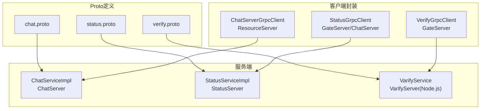
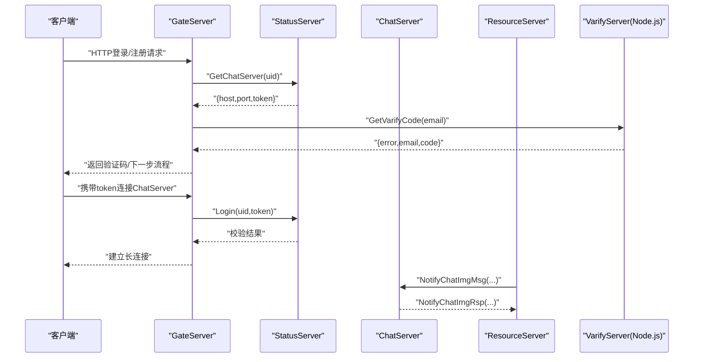
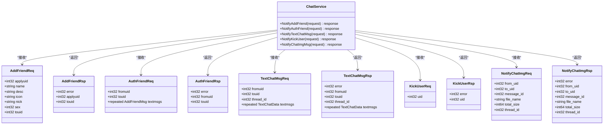
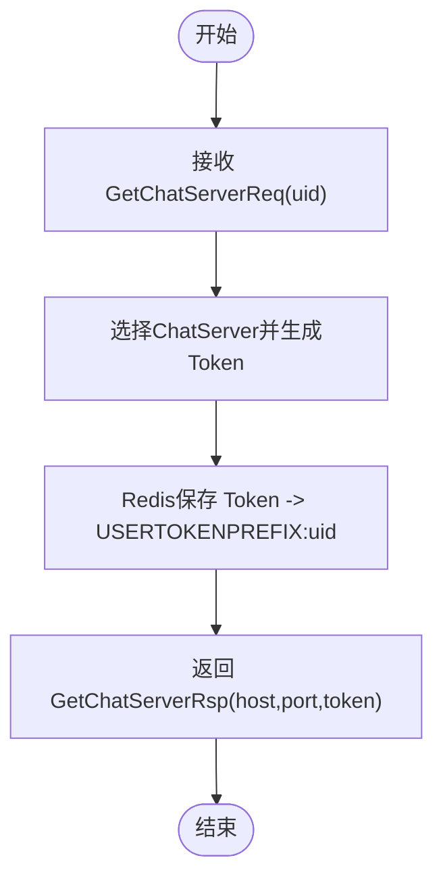
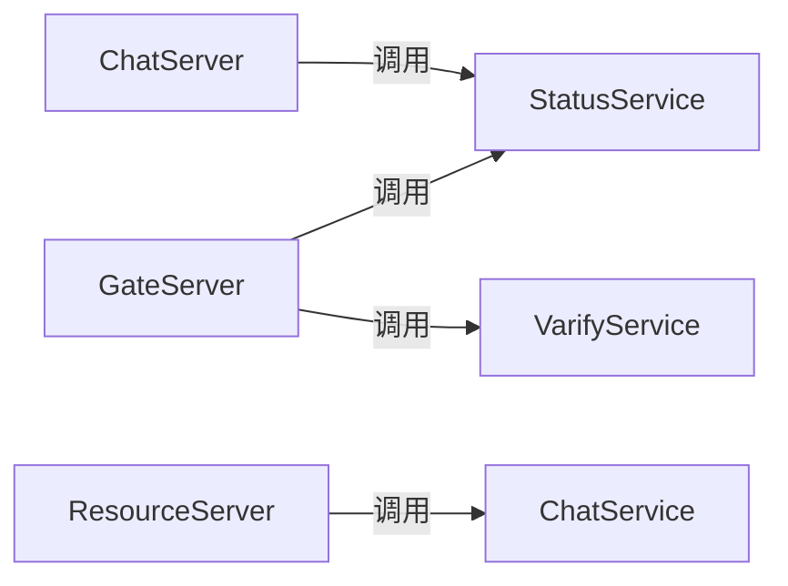
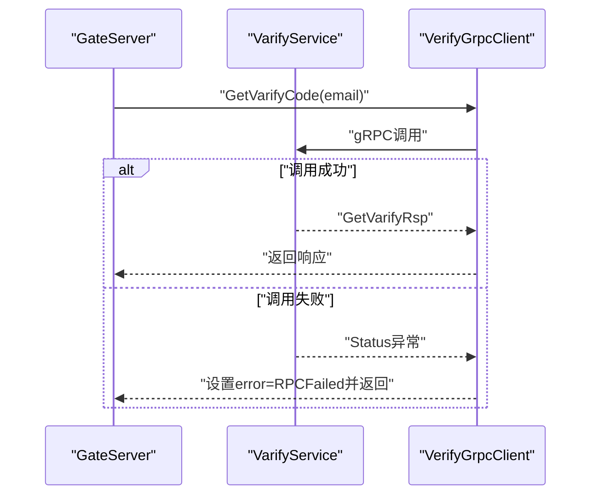

# gRPC接口设计

<cite>
**本文引用的文件**   
- [chat.proto](file://proto/chat_service/chat.proto)
- [status.proto](file://proto/status_service/status.proto)
- [verify.proto](file://proto/verify_service/verify.proto)
- [ChatServiceImpl.h](file://server/ChatServer/include/ChatServiceImpl.h)
- [ChatServiceImpl.cpp](file://server/ChatServer/src/ChatServiceImpl.cpp)
- [StatusServiceImpl.h](file://server/StatusServer/include/StatusServiceImpl.h)
- [StatusServiceImpl.cpp](file://server/StatusServer/src/StatusServiceImpl.cpp)
- [VerifyGrpcClient.h](file://server/GateServer/include/VerifyGrpcClient.h)
- [StatusGrpcClient.h (GateServer)](file://server/GateServer/include/StatusGrpcClient.h)
- [StatusGrpcClient.h (ChatServer)](file://server/ChatServer/include/StatusGrpcClient.h)
- [ChatServerGrpcClient.h](file://server/ResourceServer/include/ChatServerGrpcClient.h)
</cite>

## 目录
1. [简介](#简介)
2. [项目结构](#项目结构)
3. [核心组件](#核心组件)
4. [架构总览](#架构总览)
5. [详细组件分析](#详细组件分析)
6. [依赖关系分析](#依赖关系分析)
7. [性能与超时配置](#性能与超时配置)
8. [错误处理机制](#错误处理机制)
9. [版本管理与向后兼容](#版本管理与向后兼容)
10. [客户端实现示例（C++）](#客户端实现示例c)
11. [服务端部署指南](#服务端部署指南)
12. [故障排查](#故障排查)
13. [结论](#结论)

## 简介
本文件为LLFCChat系统的gRPC接口设计文档，覆盖以下服务：
- ChatService：聊天服务器间消息通知、好友申请与认证、文本与图片消息推送、踢人等。
- StatusService：会话路由与登录鉴权（分配ChatServer地址与Token、校验Token）。
- VerifyService（VarifyService）：验证码派发（Node.js实现），供GateServer调用。

文档包含：
- Protocol Buffers消息定义与服务接口规范
- 请求/响应字段类型与验证规则
- 服务间通信模式、错误处理与超时配置建议
- 接口版本管理与向后兼容策略
- C++ gRPC客户端实现要点与示例路径
- 服务端部署与运行注意事项

## 项目结构
Proto文件位于proto目录下，按服务划分：
- chat_service/chat.proto：ChatService接口与消息
- status_service/status.proto：StatusService接口与消息
- verify_service/verify.proto：VarifyService接口与消息

各服务的C++实现位于server子目录中，包含服务实现类与客户端Stub封装（连接池、单例等）。

图表来源
- [chat.proto:1-105](file://proto/chat_service/chat.proto#L1-L105)
- [status.proto:1-32](file://proto/status_service/status.proto#L1-L32)
- [verify.proto:1-19](file://proto/verify_service/verify.proto#L1-L19)
- [ChatServiceImpl.h:1-55](file://server/ChatServer/include/ChatServiceImpl.h#L1-L55)
- [StatusServiceImpl.h:1-52](file://server/StatusServer/include/StatusServiceImpl.h#L1-L52)
- [VerifyGrpcClient.h:1-113](file://server/GateServer/include/VerifyGrpcClient.h#L1-L113)
- [StatusGrpcClient.h (GateServer):1-98](file://server/GateServer/include/StatusGrpcClient.h#L1-L98)
- [StatusGrpcClient.h (ChatServer):1-99](file://server/ChatServer/include/StatusGrpcClient.h#L1-L99)
- [ChatServerGrpcClient.h:1-93](file://server/ResourceServer/include/ChatServerGrpcClient.h#L1-L93)

章节来源
- [chat.proto:1-105](file://proto/chat_service/chat.proto#L1-L105)
- [status.proto:1-32](file://proto/status_service/status.proto#L1-L32)
- [verify.proto:1-19](file://proto/verify_service/verify.proto#L1-L19)

## 核心组件
- ChatService：提供好友申请通知、好友认证通知、文本聊天消息推送、踢人通知、图片消息通知等RPC方法。
- StatusService：提供获取ChatServer地址与Token、用户登录校验的RPC方法。
- VarifyService：提供获取验证码的RPC方法（Node.js实现）。

章节来源
- [chat.proto:1-105](file://proto/chat_service/chat.proto#L1-L105)
- [status.proto:1-32](file://proto/status_service/status.proto#L1-L32)
- [verify.proto:1-19](file://proto/verify_service/verify.proto#L1-L19)

## 架构总览
系统采用多服务协作：
- GateServer作为入口，调用StatusService获取ChatServer路由信息，调用VarifyService发送验证码。
- ChatServer负责在线用户会话转发与消息广播。
- ResourceServer负责资源上传下载，并通过ChatService向ChatServer推送图片消息通知。
- StatusServer维护ChatServer列表与Token生命周期管理。

图表来源
- [status.proto:1-32](file://proto/status_service/status.proto#L1-L32)
- [verify.proto:1-19](file://proto/verify_service/verify.proto#L1-L19)
- [chat.proto:1-105](file://proto/chat_service/chat.proto#L1-L105)
- [StatusServiceImpl.cpp:17-27](file://server/StatusServer/src/StatusServiceImpl.cpp#L17-L27)
- [StatusServiceImpl.cpp:94-116](file://server/StatusServer/src/StatusServiceImpl.cpp#L94-L116)
- [ChatServiceImpl.cpp:105-139](file://server/ChatServer/src/ChatServiceImpl.cpp#L105-L139)

## 详细组件分析

### ChatService接口与消息
- 服务方法
  - NotifyAddFriend：通知目标用户收到好友申请
  - NotifyAuthFriend：通知目标用户好友认证结果与历史消息
  - NotifyTextChatMsg：推送文本聊天消息
  - NotifyKickUser：踢出指定用户
  - NotifyChatImgMsg：通知图片消息元数据（文件名、大小、线程ID等）

- 关键消息字段说明
  - AddFriendReq/AddFriendRsp：申请人与目标用户ID、昵称、头像、性别、描述等；响应含错误码与双方UID
  - AuthFriendReq/AuthFriendRsp：发起方UID、目标UID、文本消息数组（每条含唯一ID、消息ID、线程ID、内容、状态）
  - TextChatMsgReq/TextChatMsgRsp：fromuid/touid、thread_id、textmsgs数组（unique_id、msg_id、msgcontent、chat_time）
  - KickUserReq/KickUserRsp：uid与错误码
  - NotifyChatImgReq/NotifyChatImgRsp：from_uid/to_uid、message_id、file_name、total_size、thread_id

- 业务逻辑要点
  - 若目标用户不在内存会话中，直接返回成功（避免阻塞）
  - 将Proto消息转换为内部JSON格式后通过TCP会话下发给客户端
  - 基础用户信息优先从Redis读取，未命中则回源MySQL并缓存

图表来源
- [chat.proto:1-105](file://proto/chat_service/chat.proto#L1-L105)
- [ChatServiceImpl.h:1-55](file://server/ChatServer/include/ChatServiceImpl.h#L1-L55)

章节来源
- [chat.proto:1-105](file://proto/chat_service/chat.proto#L1-L105)
- [ChatServiceImpl.h:1-55](file://server/ChatServer/include/ChatServiceImpl.h#L1-L55)
- [ChatServiceImpl.cpp:16-47](file://server/ChatServer/src/ChatServiceImpl.cpp#L16-L47)
- [ChatServiceImpl.cpp:49-103](file://server/ChatServer/src/ChatServiceImpl.cpp#L49-L103)
- [ChatServiceImpl.cpp:105-139](file://server/ChatServer/src/ChatServiceImpl.cpp#L105-L139)
- [ChatServiceImpl.cpp:187-200](file://server/ChatServer/src/ChatServiceImpl.cpp#L187-L200)

### StatusService接口与消息
- 服务方法
  - GetChatServer：根据uid分配ChatServer地址与Token
  - Login：校验Token有效性并返回uid与token

- 关键消息字段说明
  - GetChatServerReq/GetChatServerRsp：uid；响应含error、host、port、token
  - LoginReq/LoginRsp：uid、token；响应含error、uid、token

- 业务逻辑要点
  - 生成唯一Token并写入Redis（键前缀USERTOKENPREFIX+uid）
  - 登录时检查Redis中是否存在该Token且值匹配，否则返回无效错误码

图表来源
- [status.proto:1-32](file://proto/status_service/status.proto#L1-L32)
- [StatusServiceImpl.cpp:17-27](file://server/StatusServer/src/StatusServiceImpl.cpp#L17-L27)
- [StatusServiceImpl.cpp:118-123](file://server/StatusServer/src/StatusServiceImpl.cpp#L118-L123)

章节来源
- [status.proto:1-32](file://proto/status_service/status.proto#L1-L32)
- [StatusServiceImpl.h:1-52](file://server/StatusServer/include/StatusServiceImpl.h#L1-L52)
- [StatusServiceImpl.cpp:17-27](file://server/StatusServer/src/StatusServiceImpl.cpp#L17-L27)
- [StatusServiceImpl.cpp:94-116](file://server/StatusServer/src/StatusServiceImpl.cpp#L94-L116)

### VarifyService接口与消息
- 服务方法
  - GetVarifyCode：根据email派发验证码

- 关键消息字段说明
  - GetVarifyReq：email
  - GetVarifyRsp：error、email、code

- 业务逻辑要点
  - Node.js实现，GateServer通过gRPC调用获取验证码

章节来源
- [verify.proto:1-19](file://proto/verify_service/verify.proto#L1-L19)

## 依赖关系分析
- GateServer依赖：
  - StatusGrpcClient：调用StatusService获取ChatServer路由与登录校验
  - VerifyGrpcClient：调用VarifyService派发验证码
- ChatServer依赖：
  - StatusGrpcClient：用于自身登录校验或与其他服务交互
  - 内部UserMgr、RedisMgr、MysqlMgr用于会话与用户信息管理
- ResourceServer依赖：
  - ChatServerGrpcClient：向ChatServer推送图片消息通知

图表来源
- [StatusGrpcClient.h (GateServer):1-98](file://server/GateServer/include/StatusGrpcClient.h#L1-L98)
- [VerifyGrpcClient.h:1-113](file://server/GateServer/include/VerifyGrpcClient.h#L1-L113)
- [ChatServerGrpcClient.h:1-93](file://server/ResourceServer/include/ChatServerGrpcClient.h#L1-L93)
- [StatusGrpcClient.h (ChatServer):1-99](file://server/ChatServer/include/StatusGrpcClient.h#L1-L99)

章节来源
- [StatusGrpcClient.h (GateServer):1-98](file://server/GateServer/include/StatusGrpcClient.h#L1-L98)
- [VerifyGrpcClient.h:1-113](file://server/GateServer/include/VerifyGrpcClient.h#L1-L113)
- [ChatServerGrpcClient.h:1-93](file://server/ResourceServer/include/ChatServerGrpcClient.h#L1-L93)
- [StatusGrpcClient.h (ChatServer):1-99](file://server/ChatServer/include/StatusGrpcClient.h#L1-L99)

## 性能与超时配置
- 连接池
  - 各客户端均使用连接池（RPConPool/StatusConPool/ChatServerConPool）复用Channel与Stub，减少握手开销
  - 使用互斥量与条件变量保证并发安全与资源回收
- 超时建议
  - 在ClientContext中设置合理超时（例如1~3秒），避免阻塞
  - 对长轮询或流式场景需单独评估
- 重试与退避
  - 对网络抖动可引入指数退避重试，限制最大重试次数
- 序列化与负载
  - Proto3默认高效序列化；注意大对象（如图片元数据）仅传递必要字段

章节来源
- [VerifyGrpcClient.h:18-78](file://server/GateServer/include/VerifyGrpcClient.h#L18-L78)
- [StatusGrpcClient.h (GateServer):19-79](file://server/GateServer/include/StatusGrpcClient.h#L19-L79)
- [StatusGrpcClient.h (ChatServer):20-80](file://server/ChatServer/include/StatusGrpcClient.h#L20-L80)
- [ChatServerGrpcClient.h:19-79](file://server/ResourceServer/include/ChatServerGrpcClient.h#L19-L79)

## 错误处理机制
- gRPC层
  - 使用grpc::Status进行错误传播；客户端通过status.ok()判断
  - 当RPC失败时，客户端统一设置错误码并返回上层
- 应用层
  - 响应体中的error字段承载业务错误码（如Success、UidInvalid、TokenInvalid、RPCFailed等）
  - ChatServiceImpl中对“目标用户不在线”的情况直接返回OK，避免阻塞上游
- 典型流程
  - GateServer调用VerifyGrpcClient.GetVarifyCode，失败时设置ErrorCodes::RPCFailed
  - StatusServer.Login校验失败返回UidInvalid或TokenInvalid

图表来源
- [VerifyGrpcClient.h:87-104](file://server/GateServer/include/VerifyGrpcClient.h#L87-L104)
- [StatusServiceImpl.cpp:94-116](file://server/StatusServer/src/StatusServiceImpl.cpp#L94-L116)

章节来源
- [VerifyGrpcClient.h:87-104](file://server/GateServer/include/VerifyGrpcClient.h#L87-L104)
- [ChatServiceImpl.cpp:16-47](file://server/ChatServer/src/ChatServiceImpl.cpp#L16-L47)
- [StatusServiceImpl.cpp:94-116](file://server/StatusServer/src/StatusServiceImpl.cpp#L94-L116)

## 版本管理与向后兼容
- 字段编号不可重用：新增字段使用新的序号，旧客户端忽略未知字段
- 兼容性策略
  - 新增可选字段保持默认行为不变
  - 废弃字段保留但标记为deprecated（可在注释中说明）
  - 重大变更通过独立service或message命名空间演进（如v2）
- 迁移建议
  - 灰度发布：新旧版本并存，逐步切换流量
  - 客户端能力协商：通过扩展字段声明支持的能力集

[本节为通用指导，不直接分析具体文件]

## 客户端实现示例（C++）
- 连接池封装
  - 使用队列存储Stub实例，线程安全获取与归还
  - 析构时关闭连接并清空队列
- 调用示例（以VerifyGrpcClient为例）
  - 构造Request，设置email
  - 从连接池获取Stub，调用GetVarifyCode
  - 成功则返回响应，失败则设置错误码并返回
- 其他客户端（StatusGrpcClient、ChatServerGrpcClient）结构与用法类似

章节来源
- [VerifyGrpcClient.h:18-78](file://server/GateServer/include/VerifyGrpcClient.h#L18-L78)
- [VerifyGrpcClient.h:87-104](file://server/GateServer/include/VerifyGrpcClient.h#L87-L104)
- [StatusGrpcClient.h (GateServer):19-79](file://server/GateServer/include/StatusGrpcClient.h#L19-L79)
- [ChatServerGrpcClient.h:19-79](file://server/ResourceServer/include/ChatServerGrpcClient.h#L19-L79)

## 服务端部署指南
- ChatServer
  - 实现ChatService::Service，监听端口并提供RPC
  - 依赖Redis与MySQL进行用户信息与缓存
- StatusServer
  - 实现StatusService::Service，维护ChatServer列表与Token
  - 启动时加载配置文件，解析可用ChatServer节点
- VarifyServer（Node.js）
  - 实现VarifyService，提供验证码派发
- 配置与启动
  - 确保各服务配置正确（主机、端口、数据库连接）
  - 先启动StatusServer与VarifyServer，再启动ChatServer与ResourceServer

章节来源
- [ChatServiceImpl.h:1-55](file://server/ChatServer/include/ChatServiceImpl.h#L1-L55)
- [StatusServiceImpl.h:1-52](file://server/StatusServer/include/StatusServiceImpl.h#L1-L52)
- [StatusServiceImpl.cpp:29-55](file://server/StatusServer/src/StatusServiceImpl.cpp#L29-L55)
- [verify.proto:1-19](file://proto/verify_service/verify.proto#L1-L19)

## 故障排查
- 常见问题
  - RPC失败：检查网络连接、端口配置、防火墙
  - 登录失败：确认Token是否过期或不存在于Redis
  - 消息未达：目标用户会话不存在，属于预期行为（直接返回OK）
- 定位手段
  - 查看服务日志（Redis/MySQL访问、gRPC调用）
  - 检查连接池状态与资源释放
  - 使用抓包工具验证gRPC帧

章节来源
- [StatusServiceImpl.cpp:94-116](file://server/StatusServer/src/StatusServiceImpl.cpp#L94-L116)
- [ChatServiceImpl.cpp:16-47](file://server/ChatServer/src/ChatServiceImpl.cpp#L16-L47)
- [VerifyGrpcClient.h:87-104](file://server/GateServer/include/VerifyGrpcClient.h#L87-L104)

## 结论
本设计通过清晰的Proto定义与分层服务实现了LLFCChat的聊天、状态路由与验证码派发能力。客户端采用连接池提升性能，服务端通过Redis/MySQL保障数据一致性与可用性。建议在后续迭代中完善超时与重试策略、增强监控与告警，并遵循版本兼容原则平滑演进。