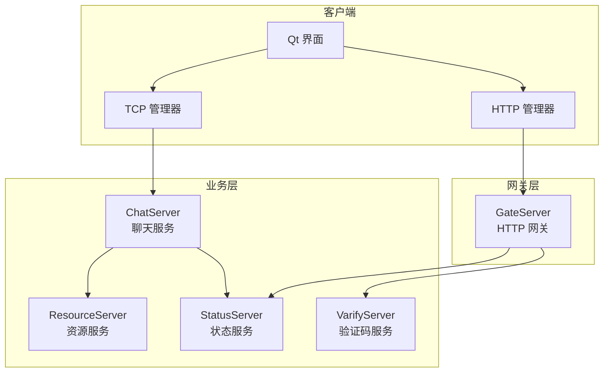
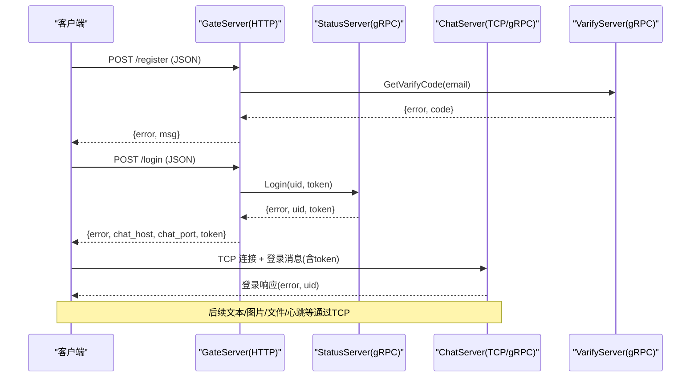
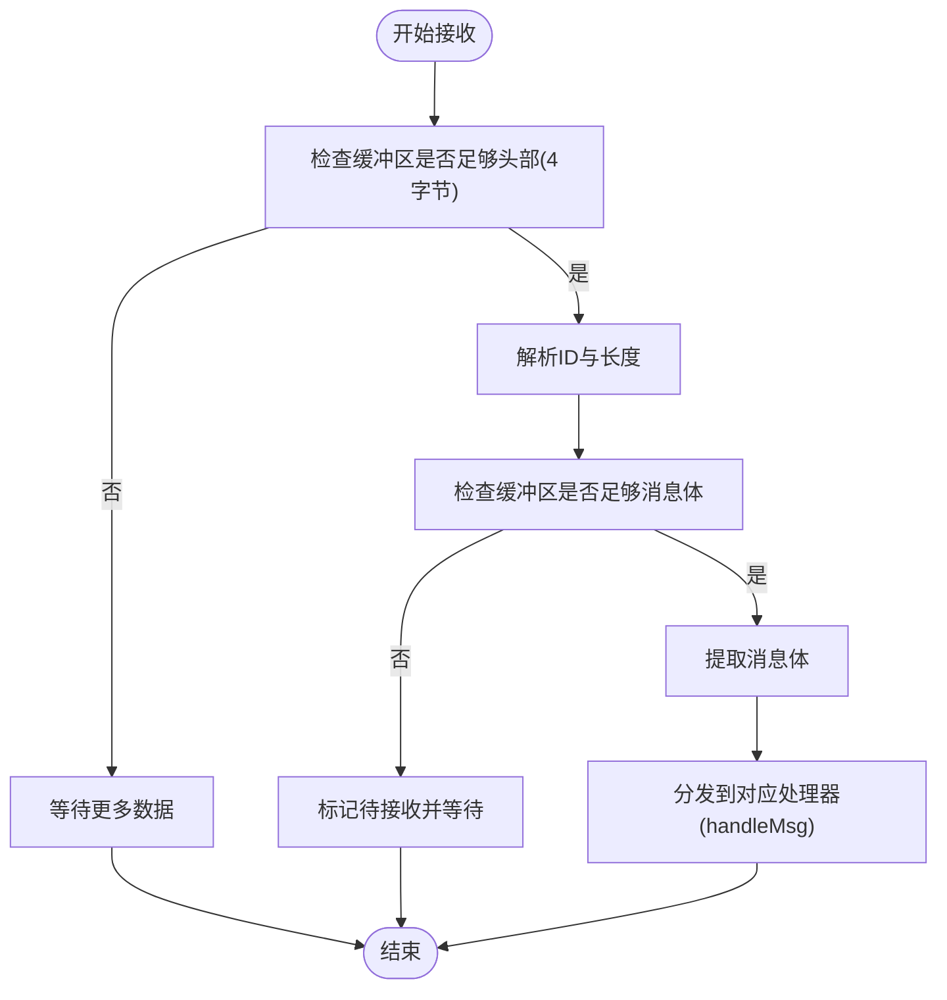
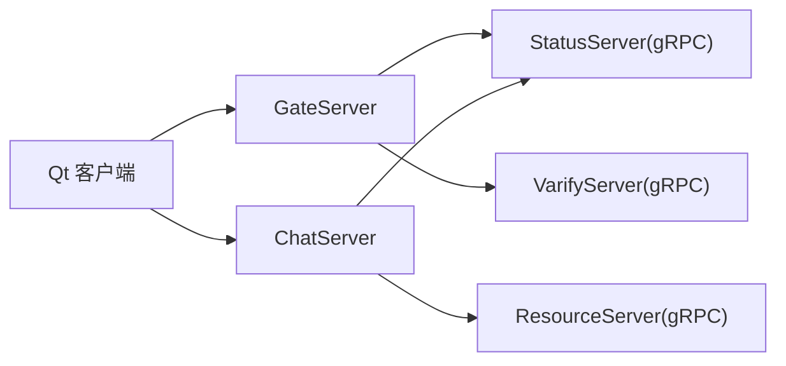
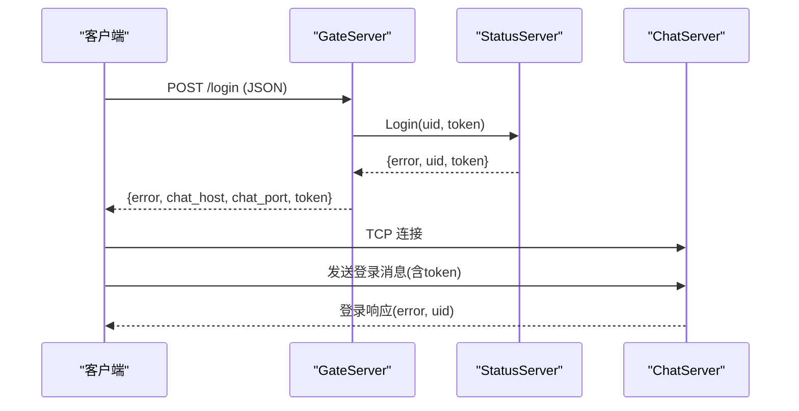
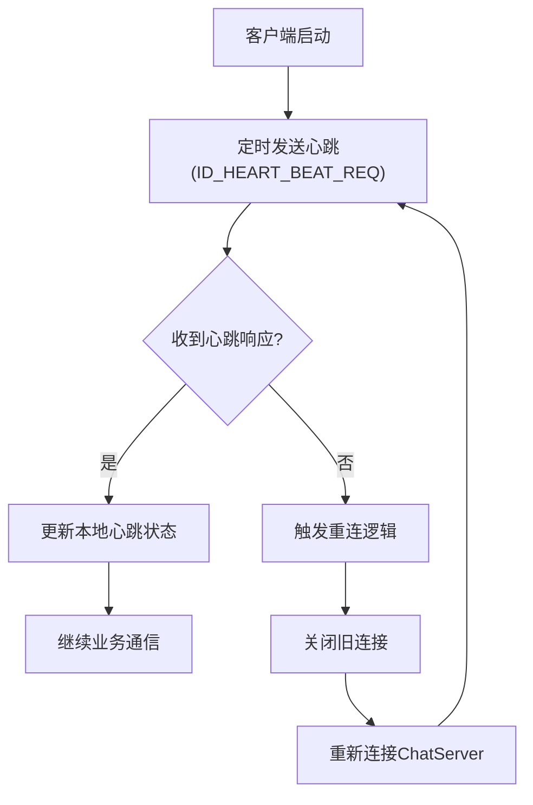

# 通信协议设计

<cite>
**本文引用的文件**
- [chat.proto](file://proto/chat_service/chat.proto)
- [status.proto](file://proto/status_service/status.proto)
- [verify.proto](file://proto/verify_service/verify.proto)
- [CSession.h](file://server/ChatServer/include/CSession.h)
- [const.h（ChatServer）](file://server/ChatServer/include/const.h)
- [MsgNode.h](file://server/ChatServer/include/MsgNode.h)
- [HttpConnection.h](file://server/GateServer/include/HttpConnection.h)
- [HttpConnection.cpp](file://server/GateServer/src/HttpConnection.cpp)
- [tcpmgr.h](file://client/llfcchat/include/tcpmgr.h)
- [httpmgr.h](file://client/llfcchat/include/httpmgr.h)
- [global.h（客户端）](file://client/llfcchat/include/global.h)
- [data.h（ChatServer）](file://server/ChatServer/include/data.h)
</cite>

## 目录
1. [简介](#简介)
2. [项目结构](#项目结构)
3. [核心组件](#核心组件)
4. [架构总览](#架构总览)
5. [详细组件分析](#详细组件分析)
6. [依赖关系分析](#依赖关系分析)
7. [性能考虑](#性能考虑)
8. [故障排查指南](#故障排查指南)
9. [结论](#结论)
10. [附录：API参考与示例](#附录api参考与示例)

## 简介
本文件为 LLFCChat 系统的通信协议设计文档，覆盖以下三类接口规范：
- HTTP REST API（GateServer 提供）
- TCP 二进制协议（ChatServer 提供，用于长连接实时通信）
- gRPC 接口（服务间调用，跨语言互操作）

文档重点说明消息格式、字段类型、编码方式、版本兼容策略；连接建立、认证授权、心跳保活、断线重连机制；握手流程、错误码定义与异常处理策略；以及连接池、消息批处理、流量控制等性能优化措施。同时给出跨语言互操作性建议、协议演进与安全防护措施，并提供完整的 API 参考与示例路径。

## 项目结构
LLFCChat 采用多服务架构：
- GateServer：HTTP 网关，负责注册、登录、验证码等 HTTP 请求路由与鉴权，并返回 ChatServer/ResourceServer 的连接信息。
- ChatServer：聊天业务服务器，维护用户 TCP 长连接，处理文本/图片/文件消息、好友申请与认证、踢人通知、心跳等。
- StatusServer：状态服务，提供 ChatServer 分配与登录校验的 gRPC 能力。
- ResourceServer：资源服务，负责头像、图片、文件等资源上传下载。
- VarifyServer（Node.js）：验证码服务，通过 gRPC 对外暴露获取验证码接口。
- Client（Qt C++）：桌面客户端，使用 HTTP 管理模块与 TCP 管理模块分别对接 GateServer 和 ChatServer。

图表来源
- [HttpConnection.h:1-36](file://server/GateServer/include/HttpConnection.h#L1-L36)
- [CSession.h:1-86](file://server/ChatServer/include/CSession.h#L1-L86)
- [status.proto:1-32](file://proto/status_service/status.proto#L1-L32)
- [verify.proto:1-19](file://proto/verify_service/verify.proto#L1-L19)

章节来源
- [HttpConnection.h:1-36](file://server/GateServer/include/HttpConnection.h#L1-L36)
- [CSession.h:1-86](file://server/ChatServer/include/CSession.h#L1-L86)
- [status.proto:1-32](file://proto/status_service/status.proto#L1-L32)
- [verify.proto:1-19](file://proto/verify_service/verify.proto#L1-L19)

## 核心组件
- HTTP 网关（GateServer）
  - 基于 Boost.Beast 实现异步 HTTP 服务器，解析 GET/POST，统一路由到 LogicSystem，返回 JSON 响应。
  - 支持 URL 参数解析、CORS 头设置、超时保护。
- TCP 会话（ChatServer）
  - 基于 Boost.Asio 的异步 I/O，维护用户会话、发送队列、心跳检测、粘包处理。
  - 自定义二进制帧：头部包含消息 ID 与长度，随后是消息体。
- gRPC 服务
  - ChatService：聊天服务间转发（好友申请、认证、文本/图片消息、踢人）。
  - StatusService：ChatServer 分配与登录校验。
  - VarifyService：验证码下发。
- 客户端模块
  - HttpMgr：封装 HTTP 请求，统一回调与错误码。
  - TcpMgr：封装 TCP 长连接、粘包处理、发送队列、事件信号。

章节来源
- [HttpConnection.cpp:1-200](file://server/GateServer/src/HttpConnection.cpp#L1-L200)
- [CSession.h:1-86](file://server/ChatServer/include/CSession.h#L1-L86)
- [chat.proto:1-105](file://proto/chat_service/chat.proto#L1-L105)
- [status.proto:1-32](file://proto/status_service/status.proto#L1-L32)
- [verify.proto:1-19](file://proto/verify_service/verify.proto#L1-L19)
- [httpmgr.h:1-34](file://client/llfcchat/include/httpmgr.h#L1-L34)
- [tcpmgr.h:1-90](file://client/llfcchat/include/tcpmgr.h#L1-L90)

## 架构总览
系统采用“HTTP 网关 + 长连接 TCP + 内部 gRPC”的分层架构：
- 外部客户端通过 HTTP 完成注册、登录、验证码等无状态操作。
- 登录后由 GateServer 返回 ChatServer 地址与 Token，客户端建立 TCP 长连接进行实时通信。
- 服务间通过 gRPC 进行高内聚、强类型的跨进程调用。

图表来源
- [HttpConnection.cpp:132-194](file://server/GateServer/src/HttpConnection.cpp#L132-L194)
- [status.proto:6-31](file://proto/status_service/status.proto#L6-L31)
- [verify.proto:6-18](file://proto/verify_service/verify.proto#L6-L18)
- [CSession.h:28-76](file://server/ChatServer/include/CSession.h#L28-L76)

## 详细组件分析

### HTTP REST API（GateServer）
- 传输协议：HTTP/1.1，JSON 载荷，短连接。
- 路由处理：GET/POST 均交由 LogicSystem 处理，未匹配路由返回 404。
- 安全与跨域：默认允许所有来源（生产应限制），设置 Server 头标识。
- 超时保护：连接处理设置 deadline 定时器。

关键要点
- URL 参数解析：支持查询字符串键值对解析与 URL 解码。
- 响应体：成功时 200 OK，失败时根据业务返回 JSON 错误码。

章节来源
- [HttpConnection.h:1-36](file://server/GateServer/include/HttpConnection.h#L1-L36)
- [HttpConnection.cpp:96-194](file://server/GateServer/src/HttpConnection.cpp#L96-L194)

### TCP 二进制协议（ChatServer）
- 帧格式
  - 头部：固定长度，包含消息 ID（2 字节）、消息体长度（2 字节），网络字节序（大端）。
  - 消息体：具体业务数据（通常为 JSON 或序列化结构）。
- 粘包处理
  - 接收侧循环读取，先解析头部，再按长度读取完整消息体，避免粘包/半包问题。
- 发送队列
  - 使用队列与 bytesWritten 回调保证有序、可靠发送。
- 心跳保活
  - 客户端定时发送心跳请求，服务端更新最后心跳时间，过期则断开。
- 错误码
  - 使用统一的 ErrorCodes 枚举，涵盖 JSON/RPC/验证码/用户态等错误。

图表来源
- [tcpmgr.cpp:18-55](file://client/llfcchat/src/tcpmgr.cpp#L18-L55)
- [const.h（ChatServer）:38-79](file://server/ChatServer/include/const.h#L38-L79)
- [MsgNode.h:1-48](file://server/ChatServer/include/MsgNode.h#L1-L48)

章节来源
- [CSession.h:28-76](file://server/ChatServer/include/CSession.h#L28-L76)
- [const.h（ChatServer）:38-79](file://server/ChatServer/include/const.h#L38-L79)
- [MsgNode.h:1-48](file://server/ChatServer/include/MsgNode.h#L1-L48)
- [tcpmgr.h:22-90](file://client/llfcchat/include/tcpmgr.h#L22-L90)
- [tcpmgr.cpp:18-55](file://client/llfcchat/src/tcpmgr.cpp#L18-L55)

### gRPC 接口（服务间）
- ChatService
  - NotifyAddFriend：通知添加好友申请
  - NotifyAuthFriend：通知好友认证
  - NotifyTextChatMsg：推送文本聊天消息
  - NotifyKickUser：踢人通知
  - NotifyChatImgMsg：图片消息通知
- StatusService
  - GetChatServer：根据 uid 分配 ChatServer 地址与 token
  - Login：校验 token 并返回 uid/token
- VarifyService
  - GetVarifyCode：根据邮箱下发验证码

字段与类型
- 全部使用 proto3 定义，int32/int64/string/repeated 等基础类型。
- error 字段用于统一错误码传递。

章节来源
- [chat.proto:1-105](file://proto/chat_service/chat.proto#L1-L105)
- [status.proto:1-32](file://proto/status_service/status.proto#L1-L32)
- [verify.proto:1-19](file://proto/verify_service/verify.proto#L1-L19)

### 客户端模块（Qt）
- HttpMgr
  - 封装 QNetworkAccessManager，统一 Post 请求与回调。
  - 通过 ReqId 区分不同模块请求，错误码统一映射。
- TcpMgr
  - 封装 QTcpSocket，处理连接、粘包、发送队列、事件信号。
  - 使用 QDataStream 大端序写入 ID 与长度，确保跨平台一致。

章节来源
- [httpmgr.h:1-34](file://client/llfcchat/include/httpmgr.h#L1-L34)
- [tcpmgr.h:1-90](file://client/llfcchat/include/tcpmgr.h#L1-L90)
- [global.h（客户端）:43-88](file://client/llfcchat/include/global.h#L43-L88)

## 依赖关系分析
- GateServer 依赖：
  - Boost.Beast（HTTP 解析）
  - MySQL/Redis（持久化与缓存）
  - gRPC 客户端（调用 StatusServer、VarifyServer）
- ChatServer 依赖：
  - Boost.Asio（异步 I/O）
  - gRPC 客户端（调用 StatusServer、ResourceServer）
  - MySQL/Redis（用户、会话、消息存储）
- 客户端依赖：
  - Qt（网络、UI、线程）
  - nlohmann/json（可选，用于 JSON 处理）

图表来源
- [status.proto:1-32](file://proto/status_service/status.proto#L1-L32)
- [verify.proto:1-19](file://proto/verify_service/verify.proto#L1-L19)
- [chat.proto:1-105](file://proto/chat_service/chat.proto#L1-L105)

章节来源
- [status.proto:1-32](file://proto/status_service/status.proto#L1-L32)
- [verify.proto:1-19](file://proto/verify_service/verify.proto#L1-L19)
- [chat.proto:1-105](file://proto/chat_service/chat.proto#L1-L105)

## 性能考虑
- 连接池
  - ChatServer 使用 AsioIOServicePool 提升并发处理能力。
  - 客户端 TcpMgr 使用发送队列与 bytesWritten 回调减少阻塞。
- 消息批处理
  - 文本消息支持 repeated TextChatData 批量推送，降低往返次数。
- 流量控制
  - 客户端实现拥塞窗口（MAX_CWND_SIZE）与序列号控制，支持断点续传。
  - 服务端设置最大收发队列长度，防止内存膨胀。
- 心跳与超时
  - 服务端记录 _last_heartbeat，定期检测过期；客户端定时发送心跳。
- 资源分片
  - 图片/文件分片传输，结合 MD5 校验与续传，提高可靠性与吞吐。

章节来源
- [CSession.h:46-76](file://server/ChatServer/include/CSession.h#L46-L76)
- [global.h（客户端）:15-25](file://client/llfcchat/include/global.h#L15-L25)
- [chat.proto:54-74](file://proto/chat_service/chat.proto#L54-L74)

## 故障排查指南
- 常见错误码
  - Success：0
  - Error_Json：1001（JSON 解析错误）
  - RPCFailed：1002（RPC 调用失败）
  - VarifyExpired：1003（验证码过期）
  - VarifyCodeErr：1004（验证码错误）
  - UserExist：1005（用户已存在）
  - PasswdErr：1006（密码错误）
  - EmailNotMatch：1007（邮箱不匹配）
  - PasswdUpFailed：1008（更新密码失败）
  - PasswdInvalid：1009（密码无效）
  - TokenInvalid：1010（Token 失效）
  - UidInvalid：1011（uid 无效）
  - CREATE_CHAT_FAILED：1012（创建聊天失败）
  - LOAD_CHAT_FAILED：1013（加载聊天失败）
- 异常处理策略
  - HTTP 层：未匹配路由返回 404，异常捕获输出日志。
  - TCP 层：粘包/半包处理，错误事件分类提示，断开后触发重连逻辑。
  - gRPC 层：错误码透传，上层统一处理。

章节来源
- [const.h（ChatServer）:5-20](file://server/ChatServer/include/const.h#L5-L20)
- [const.h（GateServer）:31-44](file://server/GateServer/include/const.h#L31-L44)
- [HttpConnection.cpp:132-194](file://server/GateServer/src/HttpConnection.cpp#L132-L194)
- [tcpmgr.cpp:63-91](file://client/llfcchat/src/tcpmgr.cpp#L63-L91)

## 结论
LLFCChat 通过 HTTP 网关、TCP 长连接与 gRPC 服务间的清晰分层，实现了高可用、可扩展的即时通信系统。协议设计强调跨语言互操作、健壮的错误码体系与完善的性能优化策略。建议在后续演进中持续完善版本兼容性、安全加固与监控告警能力。

## 附录：API参考与示例

### HTTP REST API（GateServer）
- 通用约定
  - Content-Type：application/json
  - 响应体：{ "error": int, ... }
- 主要接口（示例路径）
  - POST /register：注册用户
  - POST /login：用户登录
  - GET /verify/code?email=...：获取验证码
- 示例请求/响应路径
  - 注册：[httpmgr.h:18-31](file://client/llfcchat/include/httpmgr.h#L18-L31)
  - 登录：[global.h（客户端）:43-88](file://client/llfcchat/include/global.h#L43-L88)

章节来源
- [HttpConnection.cpp:132-194](file://server/GateServer/src/HttpConnection.cpp#L132-L194)
- [httpmgr.h:18-31](file://client/llfcchat/include/httpmgr.h#L18-L31)
- [global.h（客户端）:43-88](file://client/llfcchat/include/global.h#L43-L88)

### TCP 二进制协议（ChatServer）
- 帧格式
  - 头部：2 字节消息 ID + 2 字节消息体长度（大端）
  - 消息体：JSON 或结构化数据
- 消息 ID 定义（部分）
  - 登录/响应、搜索、好友申请/认证、文本/图片消息、心跳、离线通知、聊天线程/消息加载等
- 示例路径
  - 消息 ID 枚举：[const.h（ChatServer）:49-79](file://server/ChatServer/include/const.h#L49-L79)
  - 客户端发送封装：[tcpmgr.h:28-49](file://client/llfcchat/include/tcpmgr.h#L28-L49)
  - 客户端接收解析：[tcpmgr.cpp:18-55](file://client/llfcchat/src/tcpmgr.cpp#L18-L55)

章节来源
- [const.h（ChatServer）:49-79](file://server/ChatServer/include/const.h#L49-L79)
- [tcpmgr.h:28-49](file://client/llfcchat/include/tcpmgr.h#L28-L49)
- [tcpmgr.cpp:18-55](file://client/llfcchat/src/tcpmgr.cpp#L18-L55)

### gRPC 接口（服务间）
- ChatService
  - NotifyAddFriend/AddFriendReq+Rsp
  - NotifyAuthFriend/AuthFriendReq+Rsp
  - NotifyTextChatMsg/TextChatMsgReq+Rsp
  - NotifyKickUser/KickUserReq+Rsp
  - NotifyChatImgMsg/NotifyChatImgReq+Rsp
- StatusService
  - GetChatServer/GetChatServerReq+Rsp
  - Login/LoginReq+Rsp
- VarifyService
  - GetVarifyCode/GetVarifyReq+Rsp

章节来源
- [chat.proto:6-12](file://proto/chat_service/chat.proto#L6-L12)
- [status.proto:6-9](file://proto/status_service/status.proto#L6-L9)
- [verify.proto:6-8](file://proto/verify_service/verify.proto#L6-L8)

### 数据模型（ChatServer）
- UserInfo：用户基本信息
- ApplyInfo：好友申请信息
- ChatThreadInfo：聊天线程信息
- ChatMessage：聊天消息
- PageResult：分页结果（含 next_cursor）
- ChatMsgType：消息类型枚举（TEXT/PIC/VIDEO/FILE）

章节来源
- [data.h（ChatServer）:4-65](file://server/ChatServer/include/data.h#L4-L65)

### 连接建立与认证授权流程（示例）

图表来源
- [status.proto:22-31](file://proto/status_service/status.proto#L22-L31)
- [HttpConnection.cpp:132-194](file://server/GateServer/src/HttpConnection.cpp#L132-L194)
- [CSession.h:28-76](file://server/ChatServer/include/CSession.h#L28-L76)

### 心跳保活与断线重连（示例）

图表来源
- [const.h（ChatServer）:64-65](file://server/ChatServer/include/const.h#L64-L65)
- [CSession.h:46-49](file://server/ChatServer/include/CSession.h#L46-L49)
- [tcpmgr.cpp:93-98](file://client/llfcchat/src/tcpmgr.cpp#L93-L98)

### 安全与防护建议
- 传输安全：生产环境启用 TLS（HTTPS/TLS-TCP）。
- 鉴权：Token 有效期与刷新机制，服务端校验与黑名单。
- 限流：网关层速率限制，防刷验证码与登录。
- 输入校验：JSON/gRPC 字段校验，防止注入与越界。
- 审计：关键操作日志与异常告警。