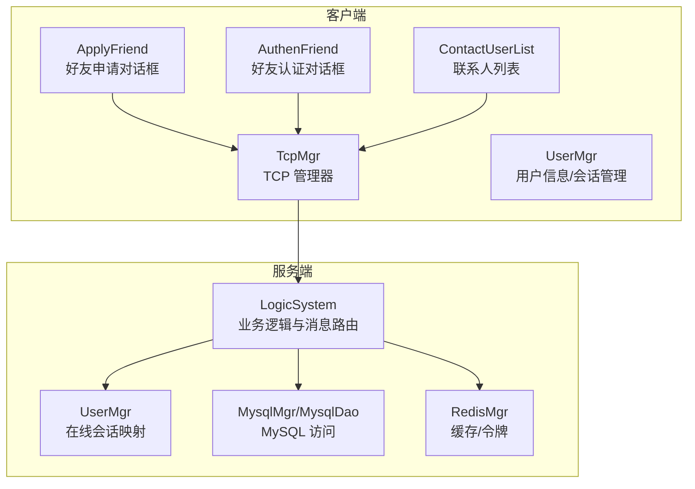
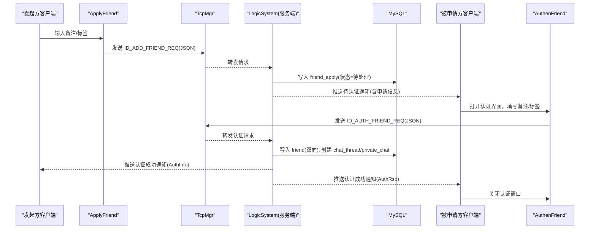
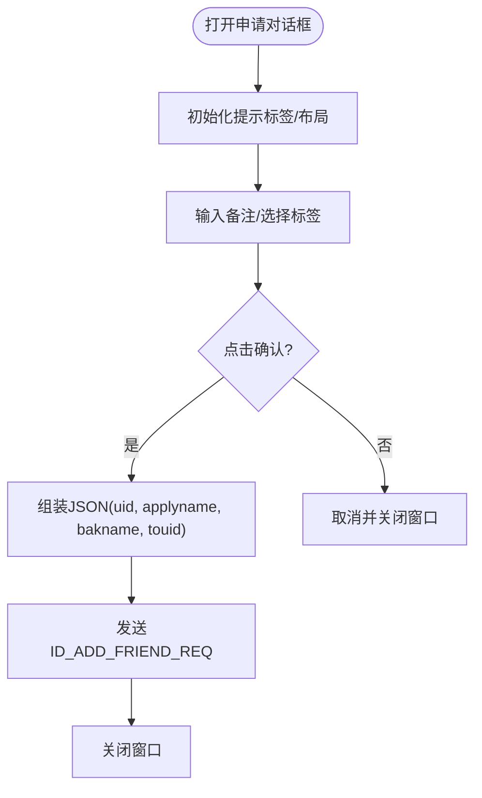
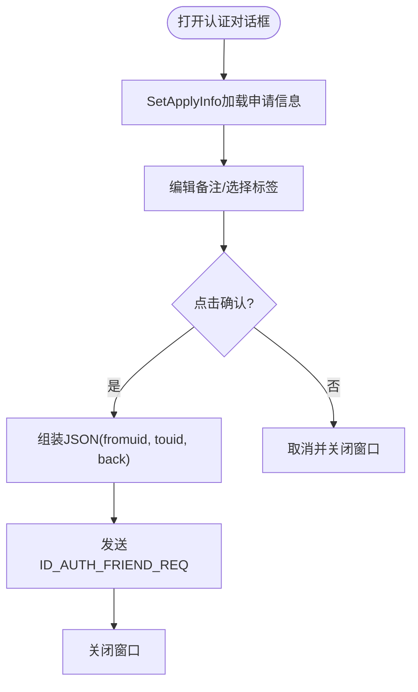
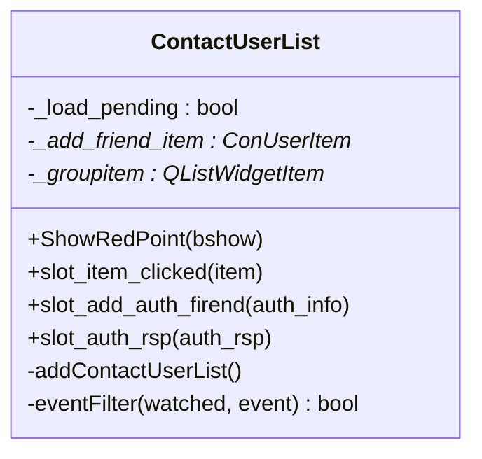
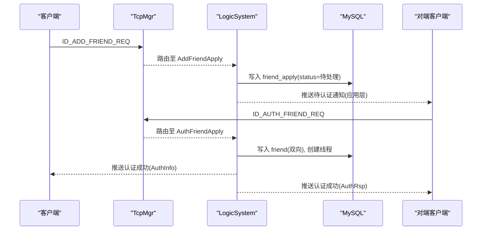
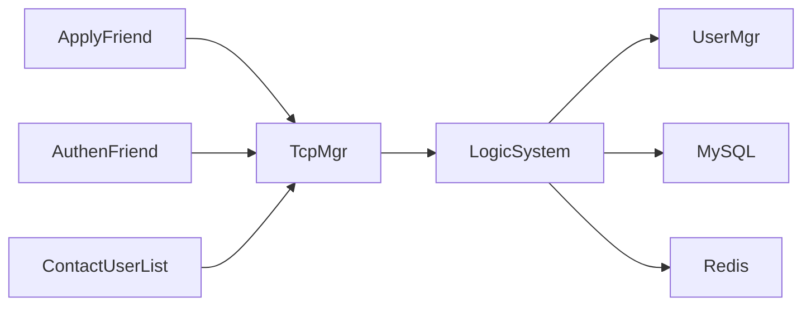
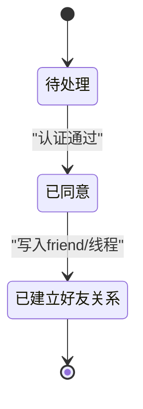

# 好友关系管理

<cite>
**本文引用的文件**   
- [applyfriend.h](file://client/llfcchat/include/applyfriend.h)
- [applyfriend.cpp](file://client/llfcchat/src/applyfriend.cpp)
- [authenfriend.h](file://client/llfcchat/include/authenfriend.h)
- [authenfriend.cpp](file://client/llfcchat/src/authenfriend.cpp)
- [contactuserlist.h](file://client/llfcchat/include/contactuserlist.h)
- [contactuserlist.cpp](file://client/llfcchat/src/contactuserlist.cpp)
- [userdata.h](file://client/llfcchat/include/userdata.h)
- [LogicSystem.cpp](file://server/ChatServer/src/LogicSystem.cpp)
- [UserMgr.cpp](file://server/ChatServer/src/UserMgr.cpp)
- [data.h](file://server/ChatServer/include/data.h)
- [llfc.sql](file://sql备份/llfc.sql)
</cite>

## 目录
1. [简介](#简介)
2. [项目结构](#项目结构)
3. [核心组件](#核心组件)
4. [架构总览](#架构总览)
5. [详细组件分析](#详细组件分析)
6. [依赖分析](#依赖分析)
7. [性能考虑](#性能考虑)
8. [故障排查指南](#故障排查指南)
9. [结论](#结论)
10. [附录](#附录)

## 简介
本技术文档围绕 LLFCChat 项目的“好友关系管理系统”展开，覆盖以下关键能力：
- 好友申请流程：发送申请、状态管理、通知推送、超时处理
- 好友认证处理：请求校验、双向确认、关系建立、数据同步
- 联系人列表维护：分组展示、搜索过滤、状态显示、实时更新
- 数据库设计：表结构、索引优化、事务与一致性保证
- 客户端界面实现：申请界面、认证界面、联系人列表的交互与数据处理
- 事件驱动机制、性能优化策略与异常处理方案

## 项目结构
本项目采用前后端分离的多服务架构。客户端基于 Qt/C++，服务端包含 ChatServer（聊天与业务逻辑）、GateServer（网关）、ResourceServer（资源）、StatusServer（状态）等。好友关系相关代码主要分布在客户端 UI 层与服务端 LogicSystem 中，并通过 TCP/JSON 消息进行通信；持久化由 MySQL 完成。

图表来源
- [applyfriend.cpp:477-506](file://client/llfcchat/src/applyfriend.cpp#L477-L506)
- [authenfriend.cpp:412-436](file://client/llfcchat/src/authenfriend.cpp#L412-L436)
- [contactuserlist.cpp:205-257](file://client/llfcchat/src/contactuserlist.cpp#L205-L257)
- [LogicSystem.cpp:83-114](file://server/ChatServer/src/LogicSystem.cpp#L83-L114)
- [UserMgr.cpp:10-44](file://server/ChatServer/src/UserMgr.cpp#L10-L44)

章节来源
- [applyfriend.h:1-59](file://client/llfcchat/include/applyfriend.h#L1-L59)
- [applyfriend.cpp:1-515](file://client/llfcchat/src/applyfriend.cpp#L1-L515)
- [authenfriend.h:1-64](file://client/llfcchat/include/authenfriend.h#L1-L64)
- [authenfriend.cpp:1-443](file://client/llfcchat/src/authenfriend.cpp#L1-L443)
- [contactuserlist.h:1-38](file://client/llfcchat/include/contactuserlist.h#L1-L38)
- [contactuserlist.cpp:1-260](file://client/llfcchat/src/contactuserlist.cpp#L1-L260)
- [LogicSystem.cpp:1-200](file://server/ChatServer/src/LogicSystem.cpp#L1-L200)
- [UserMgr.cpp:1-50](file://server/ChatServer/src/UserMgr.cpp#L1-L50)

## 核心组件
- 客户端申请对话框 ApplyFriend：负责收集申请备注、标签，组装 JSON 并发送 ID_ADD_FRIEND_REQ
- 客户端认证对话框 AuthenFriend：接收待认证申请，填写备注后发送 ID_AUTH_FRIEND_REQ
- 联系人列表 ContactUserList：展示分组、新增朋友入口、实时插入新好友项，响应认证结果信号
- 数据结构 userdata：定义 SearchInfo、AddFriendApply、ApplyInfo、AuthInfo、AuthRsp、UserInfo 等
- 服务端 LogicSystem：注册消息回调，处理好友申请与认证，查询/更新数据库，推送通知
- 服务端 UserMgr：维护 uid 到 session 的映射，用于定向推送

章节来源
- [applyfriend.cpp:477-506](file://client/llfcchat/src/applyfriend.cpp#L477-L506)
- [authenfriend.cpp:412-436](file://client/llfcchat/src/authenfriend.cpp#L412-L436)
- [contactuserlist.cpp:205-257](file://client/llfcchat/src/contactuserlist.cpp#L205-L257)
- [userdata.h:11-143](file://client/llfcchat/include/userdata.h#L11-L143)
- [LogicSystem.cpp:83-114](file://server/ChatServer/src/LogicSystem.cpp#L83-L114)
- [UserMgr.cpp:10-44](file://server/ChatServer/src/UserMgr.cpp#L10-L44)

## 架构总览
好友关系管理的端到端流程如下：
- 发起方在 ApplyFriend 输入备注与标签，发送申请请求
- 服务端 LogicSystem 校验参数、写入 friend_apply 表，向被申请方推送待处理通知
- 被申请方在 AuthenFriend 选择标签并确认，发送认证请求
- 服务端 LogicSystem 校验、写入 friend 双向记录，创建私聊线程，向双方推送成功通知
- 客户端 ContactUserList 监听认证结果信号，动态插入新好友条目

图表来源
- [applyfriend.cpp:477-506](file://client/llfcchat/src/applyfriend.cpp#L477-L506)
- [authenfriend.cpp:412-436](file://client/llfcchat/src/authenfriend.cpp#L412-L436)
- [LogicSystem.cpp:83-114](file://server/ChatServer/src/LogicSystem.cpp#L83-L114)
- [llfc.sql:292-358](file://sql备份/llfc.sql#L292-L358)
- [llfc.sql:177-290](file://sql备份/llfc.sql#L177-L290)
- [llfc.sql:406-433](file://sql备份/llfc.sql#L406-L433)

## 详细组件分析

### 好友申请界面（ApplyFriend）
- 功能要点
  - 初始化提示标签库，支持“更多”展开与自动换行布局
  - 输入框回车或点击提示项添加标签，支持去重与选中态切换
  - 确认时组装 JSON（uid、applyname、bakname、touid），通过 TcpMgr 发送 ID_ADD_FRIEND_REQ
  - 取消则直接关闭窗口
- 交互细节
  - 滚动区域鼠标进入/离开控制滚动条显隐
  - 标签面板自适应高度，避免溢出
- 数据流
  - SetSearchInfo 预填充默认备注与被邀请人名称
  - SlotApplySure 触发网络发送并销毁窗口

图表来源
- [applyfriend.cpp:58-93](file://client/llfcchat/src/applyfriend.cpp#L58-L93)
- [applyfriend.cpp:119-127](file://client/llfcchat/src/applyfriend.cpp#L119-L127)
- [applyfriend.cpp:477-506](file://client/llfcchat/src/applyfriend.cpp#L477-L506)

章节来源
- [applyfriend.h:1-59](file://client/llfcchat/include/applyfriend.h#L1-L59)
- [applyfriend.cpp:1-515](file://client/llfcchat/src/applyfriend.cpp#L1-L515)

### 好友认证界面（AuthenFriend）
- 功能要点
  - SetApplyInfo 加载待认证申请信息（对方昵称/头像等）
  - 标签系统与应用一致，支持新增与选中态
  - 确认时组装 JSON（fromuid、touid、back），发送 ID_AUTH_FRIEND_REQ
- 交互细节
  - 与 ApplyFriend 相同的滚动条显隐与标签布局逻辑
- 数据流
  - SlotApplySure 触发认证请求并关闭窗口

图表来源
- [authenfriend.cpp:117-121](file://client/llfcchat/src/authenfriend.cpp#L117-L121)
- [authenfriend.cpp:412-436](file://client/llfcchat/src/authenfriend.cpp#L412-L436)

章节来源
- [authenfriend.h:1-64](file://client/llfcchat/include/authenfriend.h#L1-L64)
- [authenfriend.cpp:1-443](file://client/llfcchat/src/authenfriend.cpp#L1-L443)

### 联系人列表（ContactUserList）
- 功能要点
  - 顶部“新的朋友”入口，点击跳转到申请页面
  - “联系人”分组下动态加载后端返回的好友列表
  - 监听 TcpMgr 的信号：
    - sig_add_auth_firend：对端同意认证，插入新好友项
    - sig_auth_rsp：自己同意认证，插入新好友项
  - 滚动到底部触发加载更多（当前为占位逻辑，预留扩展点）
- 交互细节
  - 自定义 item 类型区分无效项、分组提示、申请入口、联系人
  - 滚动条按需显示，滚轮事件节流防抖

图表来源
- [contactuserlist.h:12-37](file://client/llfcchat/include/contactuserlist.h#L12-L37)
- [contactuserlist.cpp:41-101](file://client/llfcchat/src/contactuserlist.cpp#L41-L101)
- [contactuserlist.cpp:103-160](file://client/llfcchat/src/contactuserlist.cpp#L103-L160)
- [contactuserlist.cpp:205-257](file://client/llfcchat/src/contactuserlist.cpp#L205-L257)

章节来源
- [contactuserlist.h:1-38](file://client/llfcchat/include/contactuserlist.h#L1-L38)
- [contactuserlist.cpp:1-260](file://client/llfcchat/src/contactuserlist.cpp#L1-L260)

### 数据结构与模型（userdata.h）
- SearchInfo：搜索结果（uid、name、nick、desc、sex、icon）
- AddFriendApply：申请基础信息（from_uid、name、desc、icon、nick、sex）
- ApplyInfo：申请详情（含 status 字段，用于界面展示）
- AuthInfo/AuthRsp：认证请求/响应（peer 基本信息与 thread_id）
- UserInfo：统一的用户信息视图（可由多种来源构造）
- ChatDataBase/TextChatData/ImgChatData：聊天消息基类与派生类
- ChatThreadInfo/ChatThreadData：聊天线程与消息缓存

章节来源
- [userdata.h:11-143](file://client/llfcchat/include/userdata.h#L11-L143)

### 服务端逻辑（LogicSystem）
- 消息路由：RegisterCallBacks 将消息 ID 绑定到具体处理器
  - ID_ADD_FRIEND_REQ -> AddFriendApply
  - ID_AUTH_FRIEND_REQ -> AuthFriendApply
- 登录流程中会拉取用户的申请列表与好友列表，供客户端初始化
- 工作线程 DealMsg 消费队列中的消息，按 msg_id 分发回调

图表来源
- [LogicSystem.cpp:83-114](file://server/ChatServer/src/LogicSystem.cpp#L83-L114)
- [LogicSystem.cpp:167-197](file://server/ChatServer/src/LogicSystem.cpp#L167-L197)

章节来源
- [LogicSystem.cpp:1-200](file://server/ChatServer/src/LogicSystem.cpp#L1-L200)

### 用户会话管理（UserMgr）
- 维护 uid -> session 的映射，用于精准推送
- 提供设置、获取、移除会话的方法，并发安全（互斥锁保护）

章节来源
- [UserMgr.cpp:10-44](file://server/ChatServer/src/UserMgr.cpp#L10-L44)

### 数据模型（data.h）
- 服务端侧的数据结构：UserInfo、ApplyInfo、ChatThreadInfo、ChatMessage、PageResult、ChatMsgType
- 与客户端 userdata.h 对应，便于跨进程序列化/反序列化

章节来源
- [data.h:1-65](file://server/ChatServer/include/data.h#L1-L65)

## 依赖分析
- 客户端
  - ApplyFriend/AuthenFriend 依赖 TcpMgr 发送请求，依赖 UserMgr 获取当前 uid
  - ContactUserList 依赖 TcpMgr 的信号以刷新 UI
- 服务端
  - LogicSystem 依赖 MysqlMgr/MysqlDao、RedisMgr、UserMgr
  - UserMgr 依赖 CSession 抽象
- 数据库
  - friend_apply：存储申请记录，唯一键 (from_uid, to_uid)
  - friend：存储双向好友关系，唯一键 (self_id, friend_id)
  - chat_thread/private_chat：存储聊天线程与参与者

图表来源
- [applyfriend.cpp:477-506](file://client/llfcchat/src/applyfriend.cpp#L477-L506)
- [authenfriend.cpp:412-436](file://client/llfcchat/src/authenfriend.cpp#L412-L436)
- [contactuserlist.cpp:205-257](file://client/llfcchat/src/contactuserlist.cpp#L205-L257)
- [LogicSystem.cpp:83-114](file://server/ChatServer/src/LogicSystem.cpp#L83-L114)

章节来源
- [applyfriend.cpp:1-515](file://client/llfcchat/src/applyfriend.cpp#L1-L515)
- [authenfriend.cpp:1-443](file://client/llfcchat/src/authenfriend.cpp#L1-L443)
- [contactuserlist.cpp:1-260](file://client/llfcchat/src/contactuserlist.cpp#L1-L260)
- [LogicSystem.cpp:1-200](file://server/ChatServer/src/LogicSystem.cpp#L1-L200)

## 性能考虑
- 客户端 UI
  - 标签布局使用 QFontMetrics 计算宽度，避免频繁重排
  - 滚动区域仅在鼠标进入时显示滚动条，减少绘制开销
  - 列表滚动到底部时使用定时器节流，防止重复加载
- 服务端
  - LogicSystem 使用条件变量+队列的消费模型，降低忙等
  - Redis 缓存用户 token，快速校验登录态
  - MySQL 索引优化：friend_apply、friend、private_chat 均具备合适索引，提升查询与写入效率

[本节为通用性能建议，不直接分析具体文件]

## 故障排查指南
- 申请未收到通知
  - 检查 LogicSystem 是否注册了 ID_ADD_FRIEND_REQ 回调
  - 确认 Redis 中用户 token 有效，确保能定位对端 session
- 认证失败或重复
  - 检查 friend_apply 唯一键冲突（from_uid, to_uid）
  - 确认 friend 表中已存在双向记录，避免重复插入
- 联系人列表未更新
  - 检查 TcpMgr 是否发出 sig_add_auth_firend/sig_auth_rsp
  - 确认 ContactUserList 槽函数是否正确插入新项

章节来源
- [LogicSystem.cpp:83-114](file://server/ChatServer/src/LogicSystem.cpp#L83-L114)
- [contactuserlist.cpp:205-257](file://client/llfcchat/src/contactuserlist.cpp#L205-L257)
- [llfc.sql:292-358](file://sql备份/llfc.sql#L292-L358)
- [llfc.sql:177-290](file://sql备份/llfc.sql#L177-L290)

## 结论
LLFCChat 的好友关系管理模块通过清晰的客户端 UI 与服务端逻辑解耦，结合稳定的消息路由与数据库设计，实现了从申请、认证到关系建立的全链路闭环。联系人列表的动态更新与事件驱动机制保证了良好的用户体验。后续可在超时处理、批量操作与分布式一致性方面进一步增强。

[本节为总结性内容，不直接分析具体文件]

## 附录

### 数据库设计与索引优化
- friend_apply：记录好友申请，唯一键 (from_uid, to_uid)，status 表示状态
- friend：记录双向好友关系，唯一键 (self_id, friend_id)
- chat_thread/private_chat：聊天线程与参与者映射，unique/private 索引提升查询效率
- chat_message：消息表，索引 idx_thread_created/idx_thread_message 优化分页与时间排序

章节来源
- [llfc.sql:292-358](file://sql备份/llfc.sql#L292-L358)
- [llfc.sql:177-290](file://sql备份/llfc.sql#L177-L290)
- [llfc.sql:406-433](file://sql备份/llfc.sql#L406-L433)
- [llfc.sql:24-37](file://sql备份/llfc.sql#L24-L37)

### 事件驱动与状态流转
- 客户端信号：sig_add_auth_firend、sig_auth_rsp
- 服务端回调：ID_ADD_FRIEND_REQ、ID_AUTH_FRIEND_REQ
- 状态机：待处理 -> 已同意 -> 已建立好友关系

图表来源
- [contactuserlist.cpp:205-257](file://client/llfcchat/src/contactuserlist.cpp#L205-L257)
- [LogicSystem.cpp:83-114](file://server/ChatServer/src/LogicSystem.cpp#L83-L114)