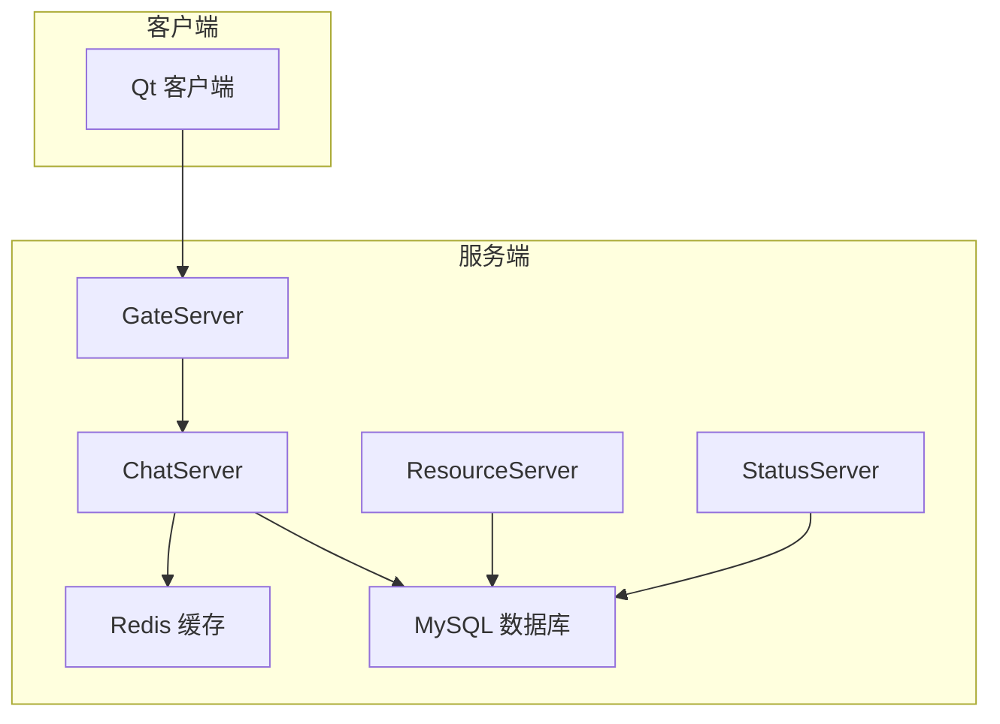
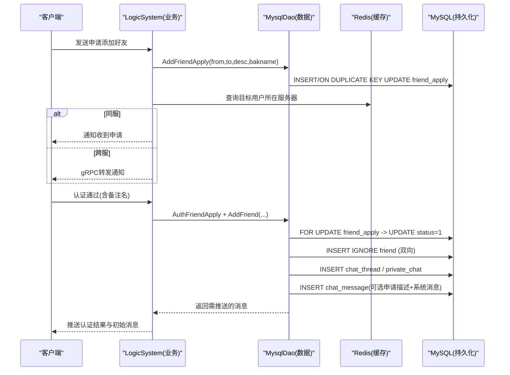
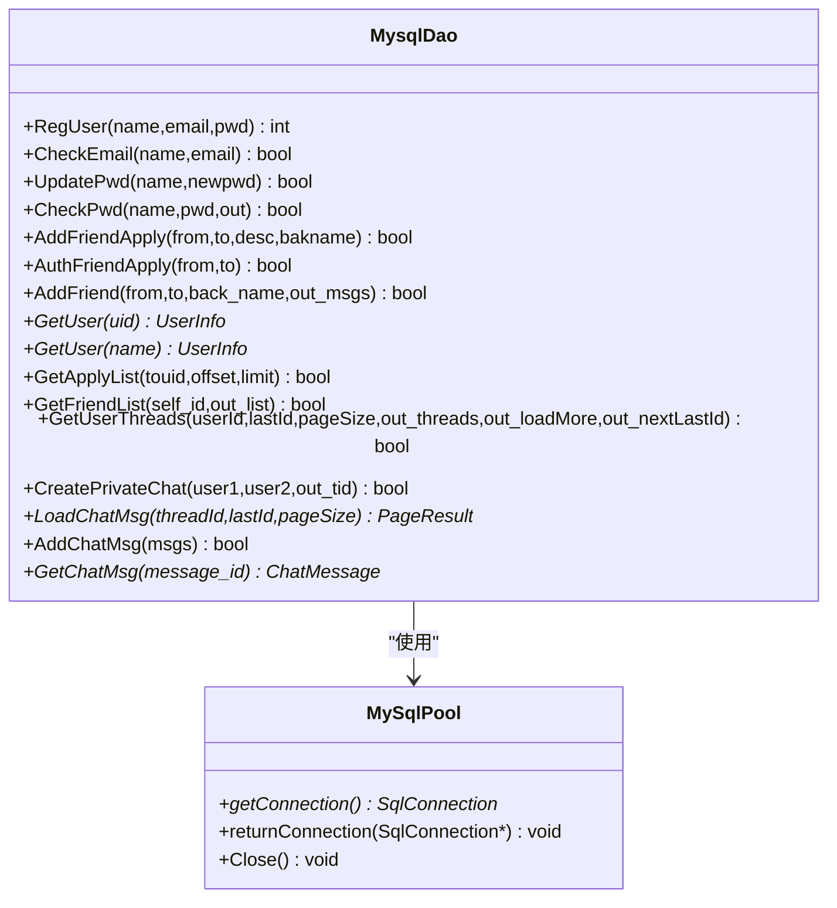
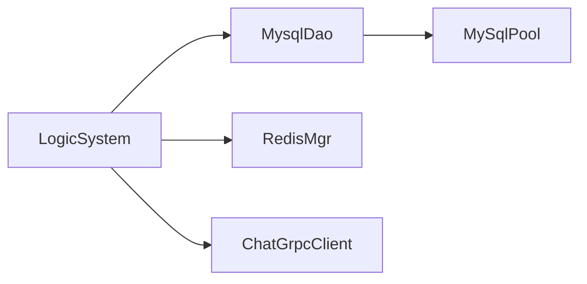

# 好友数据模型

<cite>
**本文引用的文件**   
- [llfc.sql](file://sql备份/llfc.sql)
- [llfc2.sql](file://sql备份/llfc2.sql)
- [llfc3.sql](file://sql备份/llfc3.sql)
- [MysqlDao.h](file://server/ChatServer/include/MysqlDao.h)
- [MysqlDao.cpp](file://server/ChatServer/src/MysqlDao.cpp)
- [const.h](file://server/ChatServer/include/const.h)
- [data.h](file://server/ChatServer/include/data.h)
- [LogicSystem.cpp](file://server/ChatServer/src/LogicSystem.cpp)
</cite>

## 目录
1. [引言](#引言)
2. [项目结构](#项目结构)
3. [核心组件](#核心组件)
4. [架构总览](#架构总览)
5. [详细组件分析](#详细组件分析)
6. [依赖关系分析](#依赖关系分析)
7. [性能与一致性](#性能与一致性)
8. [故障排查指南](#故障排查指南)
9. [结论](#结论)
10. [附录：SQL与ORM映射示例](#附录sql与orm映射示例)

## 引言
本技术文档围绕LLFCChat项目的“好友关系”数据模型展开，系统性阐述数据库表结构设计、状态管理机制、数据访问层（DAO）实现、事务与并发控制、查询优化策略以及缓存与一致性保证。读者可据此理解从申请、认证到建立好友关系的完整数据流与代码路径，并掌握相关SQL与ORM映射实践。

## 项目结构
本项目采用多服务架构，其中ChatServer负责聊天与好友逻辑，ResourceServer提供资源能力，GateServer作为网关，StatusServer处理状态等。与好友关系直接相关的持久化由MySQL承担，并通过MysqlDao进行CRUD封装；Redis用于用户在线位置与基础信息缓存。

[无图表来源，因为该图为概念性架构示意]

## 核心组件
- 数据库表族：user、friend、friend_apply、chat_thread、private_chat、chat_message、group_chat、group_chat_member
- DAO层：MysqlDao（连接池、事务、锁、CRUD）
- 业务层：LogicSystem（请求路由、跨服通知、Redis交互）
- 常量与数据结构：const.h（消息ID、错误码）、data.h（UserInfo、ApplyInfo、ChatMessage等）

**章节来源**
- [MysqlDao.h:236-267](file://server/ChatServer/include/MysqlDao.h#L236-L267)
- [const.h:49-101](file://server/ChatServer/include/const.h#L49-L101)
- [data.h:4-65](file://server/ChatServer/include/data.h#L4-L65)

## 架构总览
好友关系的核心流程包括：
- 申请添加好友：写入 friend_apply，通知对端
- 认证通过：更新 friend_apply 状态，插入双向 friend 记录，创建私聊 thread 与初始消息
- 查询列表：分页获取申请列表、好友列表、聊天线程

**图表来源**
- [MysqlDao.cpp:169-209](file://server/ChatServer/src/MysqlDao.cpp#L169-L209)
- [MysqlDao.cpp:211-244](file://server/ChatServer/src/MysqlDao.cpp#L211-L244)
- [MysqlDao.cpp:247-504](file://server/ChatServer/src/MysqlDao.cpp#L247-L504)
- [LogicSystem.cpp:300-353](file://server/ChatServer/src/LogicSystem.cpp#L300-L353)

## 详细组件分析

### 数据库表结构与规范
- user：用户基本信息，uid唯一，email唯一，name索引
- friend：好友关系表，self_id/friend_id唯一联合索引，back为备注名
- friend_apply：好友申请记录，from_uid/to_uid唯一联合索引，status表示申请状态
- chat_thread：会话主题，type区分私聊/群聊
- private_chat：私聊会话映射，thread_id为主键，user1/user2唯一约束
- chat_message：消息表，按thread_id与时间/ID索引
- group_chat/group_chat_member：群聊及成员关系

字段与约束要点：
- 主键均为自增或显式主键，避免热点竞争
- 关键查询均设计复合索引，如 self_friend、from_to_uid、idx_private_user*_thread
- 字符集统一 utf8mb4，支持表情与多语言

**章节来源**
- [llfc.sql:177-187](file://sql备份/llfc.sql#L177-L187)
- [llfc.sql:292-304](file://sql备份/llfc.sql#L292-L304)
- [llfc.sql:147-155](file://sql备份/llfc.sql#L147-L155)
- [llfc.sql:406-418](file://sql备份/llfc.sql#L406-L418)
- [llfc.sql:464-481](file://sql备份/llfc.sql#L464-L481)

### 状态管理与转换规则
- friend_apply.status
  - 0：待处理（未认证）
  - 1：已认证（已通过）
  - 其他值预留扩展
- 转换规则
  - 申请阶段：INSERT/ON DUPLICATE KEY UPDATE，保持status=0
  - 认证阶段：UPDATE SET status=1，同时插入双向 friend 记录，创建私聊与初始消息
- 消息状态 MsgStatus
  - UN_READ=0，SEND_FAILED=1，READED=2，UN_UPLOAD=3

**章节来源**
- [llfc.sql:295-304](file://sql备份/llfc.sql#L295-L304)
- [const.h:96-101](file://server/ChatServer/include/const.h#L96-L101)

### 数据访问层（DAO）设计与实现
- 连接池：MySqlPool 管理连接生命周期、健康检查与自动重连
- 事务与锁：AddFriend使用FOR UPDATE锁定申请行，确保并发安全；失败时rollback
- CRUD封装：AddFriendApply、AuthFriendApply、AddFriend、GetApplyList、GetFriendList、GetUserThreads等
- 错误处理：捕获SQLException，记录错误码与状态，必要时重试提示

**图表来源**
- [MysqlDao.h:236-267](file://server/ChatServer/include/MysqlDao.h#L236-L267)
- [MysqlDao.cpp:1-17](file://server/ChatServer/src/MysqlDao.cpp#L1-L17)

**章节来源**
- [MysqlDao.h:236-267](file://server/ChatServer/include/MysqlDao.h#L236-L267)
- [MysqlDao.cpp:169-209](file://server/ChatServer/src/MysqlDao.cpp#L169-L209)
- [MysqlDao.cpp:211-244](file://server/ChatServer/src/MysqlDao.cpp#L211-L244)
- [MysqlDao.cpp:247-504](file://server/ChatServer/src/MysqlDao.cpp#L247-L504)
- [MysqlDao.cpp:593-633](file://server/ChatServer/src/MysqlDao.cpp#L593-L633)
- [MysqlDao.cpp:635-678](file://server/ChatServer/src/MysqlDao.cpp#L635-L678)

### 好友关系查询优化策略
- 好友列表：按self_id精确查询，再关联用户信息；建议将用户信息缓存至Redis以减少二次查询
- 申请列表：基于apply.id分页，order by id ASC，LIMIT控制页大小
- 聊天线程：使用CTE合并私聊与群聊，LIMIT pageSize+1判断是否还有下一页，nextLastId用于游标分页
- 索引利用：充分利用自增主键与复合索引，避免全表扫描

**章节来源**
- [MysqlDao.cpp:593-633](file://server/ChatServer/src/MysqlDao.cpp#L593-L633)
- [MysqlDao.cpp:681-770](file://server/ChatServer/src/MysqlDao.cpp#L681-L770)

### 缓存机制与数据一致性
- Redis用途
  - 用户在线位置：uip_{uid} -> serverName
  - 用户基础信息：ubaseinfo_{uid} -> 用户资料
- 一致性保障
  - 申请与认证在事务内完成，结合FOR UPDATE防止竞态
  - 跨服通知通过gRPC同步，失败时上层重试
  - 读多写少场景下，用户信息可短期缓存，但好友关系变更强一致落库

**章节来源**
- [LogicSystem.cpp:300-353](file://server/ChatServer/src/LogicSystem.cpp#L300-L353)
- [const.h:81-88](file://server/ChatServer/include/const.h#L81-L88)

### ORM映射配置与使用方式
- 对象映射
  - UserInfo：对应user表，uid/name/email/nick/desc/sex/icon/back
  - ApplyInfo：对应friend_apply展示视图，包含uid/name/desc/icon/nick/sex/status
  - ChatMessage/ChatThreadInfo/PageResult：对应消息与线程分页查询结果
- 使用方式
  - 通过MysqlDao接口返回std::shared_ptr<T>，上层组装JSON或Protobuf响应
  - 分页查询返回PageResult，包含load_more与next_cursor

**章节来源**
- [data.h:4-65](file://server/ChatServer/include/data.h#L4-L65)
- [MysqlDao.cpp:508-548](file://server/ChatServer/src/MysqlDao.cpp#L508-L548)
- [MysqlDao.cpp:681-770](file://server/ChatServer/src/MysqlDao.cpp#L681-L770)

## 依赖关系分析
- 模块耦合
  - LogicSystem依赖MysqlDao进行数据操作，依赖RedisMgr进行缓存读写
  - MysqlDao依赖MySqlPool进行连接管理
- 外部依赖
  - MySQL JDBC驱动
  - Redis（通过RedisMgr）
  - gRPC（跨服通信）

**图表来源**
- [MysqlDao.h:236-267](file://server/ChatServer/include/MysqlDao.h#L236-L267)
- [LogicSystem.cpp:300-353](file://server/ChatServer/src/LogicSystem.cpp#L300-L353)

**章节来源**
- [MysqlDao.h:236-267](file://server/ChatServer/include/MysqlDao.h#L236-L267)
- [LogicSystem.cpp:300-353](file://server/ChatServer/src/LogicSystem.cpp#L300-L353)

## 性能与一致性
- 连接池与健康检查：周期性检测连接存活，异常自动重连
- 事务边界：AddFriend全流程事务，失败回滚，避免部分成功
- 并发控制：FOR UPDATE锁定申请行，避免重复认证导致死锁
- 索引优化：复合索引覆盖高频查询，减少回表
- 分页策略：游标分页避免深翻页性能问题

**章节来源**
- [MysqlDao.cpp:1-17](file://server/ChatServer/src/MysqlDao.cpp#L1-L17)
- [MysqlDao.cpp:247-504](file://server/ChatServer/src/MysqlDao.cpp#L247-L504)
- [MysqlDao.cpp:681-770](file://server/ChatServer/src/MysqlDao.cpp#L681-L770)

## 故障排查指南
- 常见错误
  - SQLSTATE异常：检查参数绑定与SQL语法
  - 死锁（错误码1213）：确认FOR UPDATE顺序与插入顺序一致，避免交叉锁
  - 连接池耗尽：检查连接归还逻辑与长事务
- 定位方法
  - 打印SQL与参数，验证执行计划
  - 查看Redis缓存键是否存在，确认跨服路由正确
  - 检查日志中错误码与堆栈

**章节来源**
- [MysqlDao.cpp:486-504](file://server/ChatServer/src/MysqlDao.cpp#L486-L504)
- [const.h:5-20](file://server/ChatServer/include/const.h#L5-L20)

## 结论
LLFCChat的好友关系数据模型以简洁的三张核心表（user、friend、friend_apply）支撑完整的申请与认证流程，配合DAO层的事务与锁机制确保一致性。通过合理的索引与分页策略，系统在大规模用户场景下仍具备良好性能。Redis缓存有效降低数据库压力，gRPC保障跨服一致性。整体设计清晰、可扩展性强。

## 附录：SQL与ORM映射示例

- 好友申请插入（幂等）
  - INSERT INTO friend_apply (from_uid, to_uid, descs, back_name) VALUES (?, ?, ?, ?) ON DUPLICATE KEY UPDATE from_uid = from_uid, to_uid = to_uid, descs = ?, back_name = ?
  - 对应DAO：AddFriendApply

- 认证通过并建立好友
  - SELECT ... FROM friend_apply WHERE from_uid = ? AND to_uid = ? FOR UPDATE
  - UPDATE friend_apply SET status = 1 WHERE from_uid = ? AND to_uid = ?
  - INSERT IGNORE INTO friend(self_id, friend_id, back) VALUES (?, ?, ?)
  - INSERT INTO chat_thread(type, created_at) VALUES ('private', NOW())
  - INSERT INTO private_chat(thread_id, user1_id, user2_id) VALUES (?, ?, ?)
  - INSERT INTO chat_message(...) （申请描述与系统消息）
  - 对应DAO：AuthFriendApply + AddFriend

- 分页加载聊天线程
  - WITH all_threads AS (...) SELECT ... ORDER BY thread_id LIMIT ?;
  - 对应DAO：GetUserThreads

- ORM映射
  - UserInfo <-> user
  - ApplyInfo <-> friend_apply + user
  - ChatMessage/ChatThreadInfo/PageResult <-> chat_message/chat_thread/private_chat

**章节来源**
- [MysqlDao.cpp:169-209](file://server/ChatServer/src/MysqlDao.cpp#L169-L209)
- [MysqlDao.cpp:211-244](file://server/ChatServer/src/MysqlDao.cpp#L211-L244)
- [MysqlDao.cpp:247-504](file://server/ChatServer/src/MysqlDao.cpp#L247-L504)
- [MysqlDao.cpp:681-770](file://server/ChatServer/src/MysqlDao.cpp#L681-L770)
- [data.h:4-65](file://server/ChatServer/include/data.h#L4-L65)