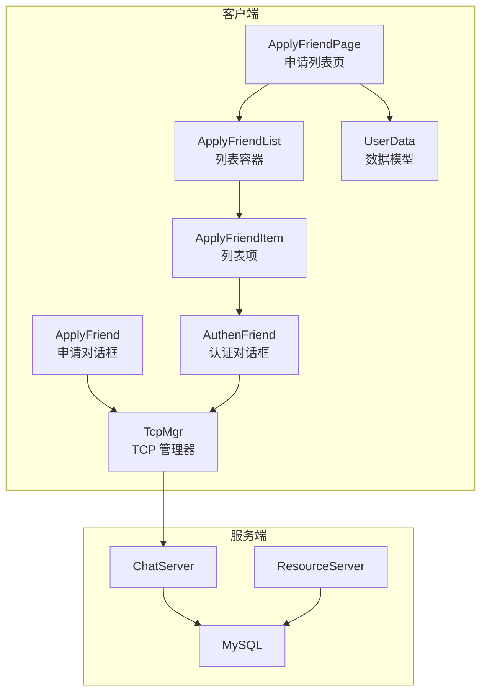
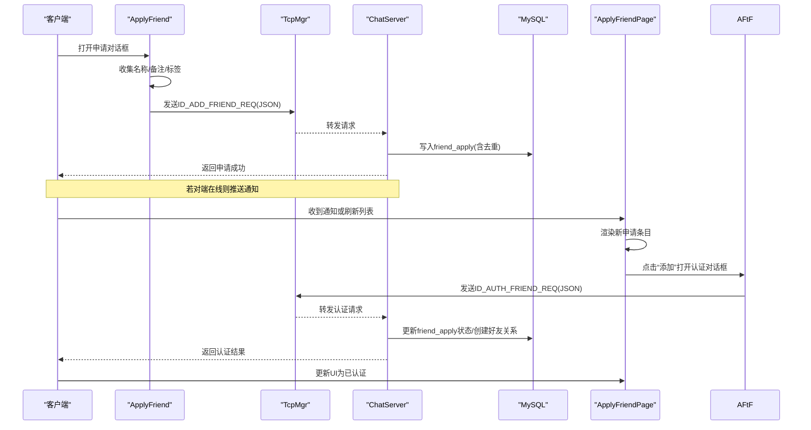
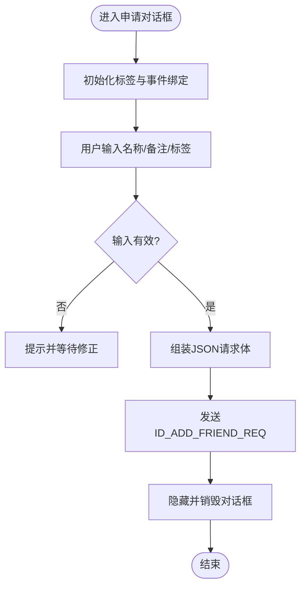
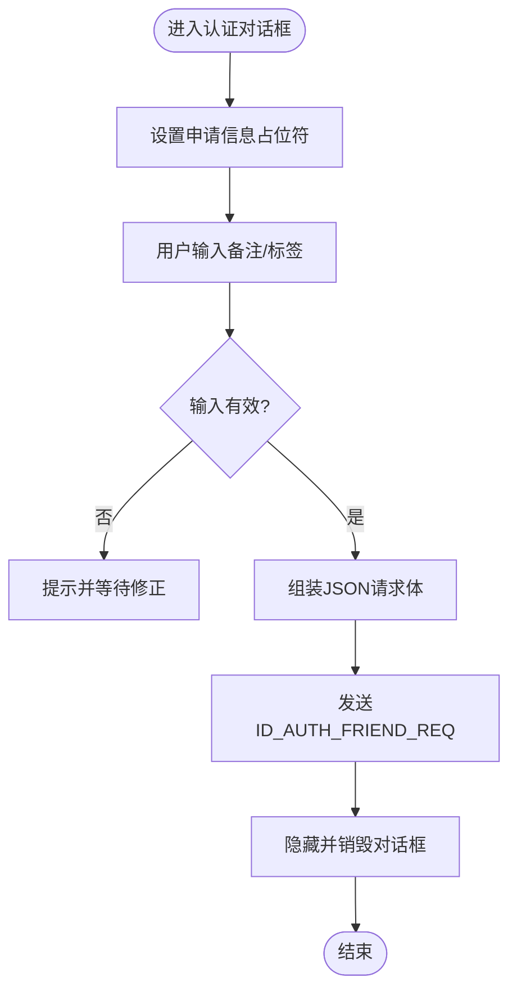
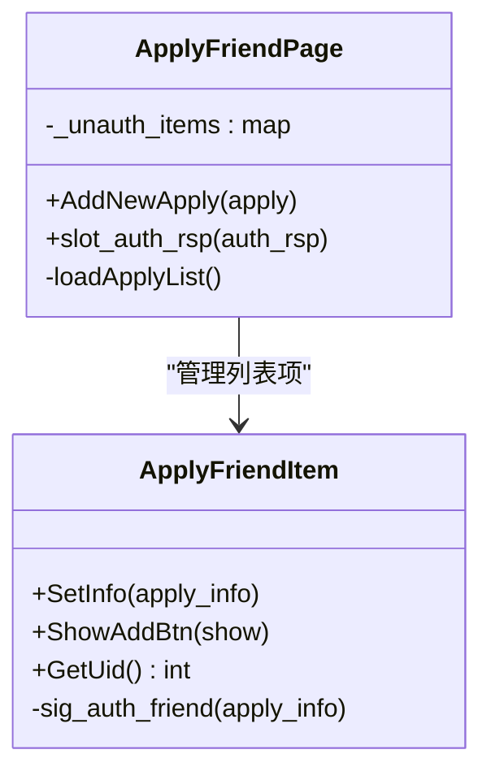
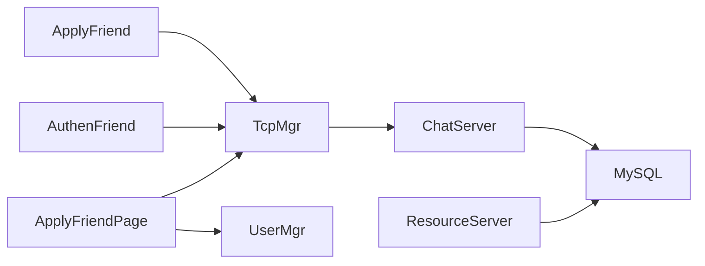

# 好友申请功能

<cite>
**本文引用的文件**   
- [applyfriend.h](file://client/llfcchat/include/applyfriend.h)
- [applyfriend.cpp](file://client/llfcchat/src/applyfriend.cpp)
- [applyfrienditem.h](file://client/llfcchat/include/applyfrienditem.h)
- [applyfrienditem.cpp](file://client/llfcchat/src/applyfrienditem.cpp)
- [applyfriendlist.h](file://client/llfcchat/include/applyfriendlist.h)
- [applyfriendlist.cpp](file://client/llfcchat/src/applyfriendlist.cpp)
- [applyfriendpage.h](file://client/llfcchat/include/applyfriendpage.h)
- [applyfriendpage.cpp](file://client/llfcchat/src/applyfriendpage.cpp)
- [authenfriend.h](file://client/llfcchat/include/authenfriend.h)
- [authenfriend.cpp](file://client/llfcchat/src/authenfriend.cpp)
- [userdata.h](file://client/llfcchat/include/userdata.h)
- [global.h](file://client/llfcchat/include/global.h)
- [message.proto](file://server/proto/chat/message.proto)
- [MysqlDao.cpp（ChatServer）](file://server/ChatServer/src/MysqlDao.cpp)
- [MysqlDao.cpp（ResourceServer）](file://server/ResourceServer/src/MysqlDao.cpp)
- [day28-好友查询和申请.md](file://开发文档/day28-好友查询和申请.md)
- [day37-聊天信息存储方案.md](file://开发文档/day37-聊天信息存储方案.md)
</cite>

## 目录
1. [简介](#简介)
2. [项目结构](#项目结构)
3. [核心组件](#核心组件)
4. [架构总览](#架构总览)
5. [详细组件分析](#详细组件分析)
6. [依赖关系分析](#依赖关系分析)
7. [性能与并发控制](#性能与并发控制)
8. [故障排查指南](#故障排查指南)
9. [结论](#结论)
10. [附录：协议与数据模型](#附录协议与数据模型)

## 简介
本技术文档围绕 LLFCChat 的“好友申请”功能，系统性梳理从客户端 UI 交互、消息封装与发送、服务端处理与持久化、到状态管理与通知推送的完整链路。重点覆盖以下方面：
- 客户端申请界面交互：申请对话框、标签输入与选择、确认/取消流程
- 申请列表展示与状态显示：未认证/已认证状态的切换与更新
- 服务端处理逻辑：申请写入、重复检测、事务一致性、会话在线判断与通知
- gRPC 协议定义与传输机制：请求/响应消息结构与调用时序
- 状态枚举与转换规则：申请状态、消息状态、错误码等
- 异常处理策略：网络异常、数据库异常、重复操作保护
- 代码示例路径：关键调用点与参数配置说明

## 项目结构
好友申请功能涉及客户端 UI、数据模型、网络通信以及服务端持久化与通知。整体结构如下：
- 客户端 UI 层：ApplyFriend（申请对话框）、AuthenFriend（认证对话框）、ApplyFriendPage（申请列表页）、ApplyFriendItem（列表项）、ApplyFriendList（列表容器）
- 数据模型：AddFriendApply、ApplyInfo、AuthRsp 等
- 网络通信：通过 TcpMgr 发送 JSON 报文，使用 ReqId 区分不同业务请求
- 服务端：ChatServer/ResourceServer 中的 MysqlDao 负责持久化；根据用户是否在线进行即时通知

图表来源
- [applyfriend.h:1-59](file://client/llfcchat/include/applyfriend.h#L1-L59)
- [applyfriend.cpp:1-515](file://client/llfcchat/src/applyfriend.cpp#L1-L515)
- [applyfrienditem.h:1-36](file://client/llfcchat/include/applyfrienditem.h#L1-L36)
- [applyfrienditem.cpp:1-55](file://client/llfcchat/src/applyfrienditem.cpp#L1-L55)
- [applyfriendlist.h:1-21](file://client/llfcchat/include/applyfriendlist.h#L1-L21)
- [applyfriendlist.cpp:1-52](file://client/llfcchat/src/applyfriendlist.cpp#L1-L52)
- [applyfriendpage.h:1-36](file://client/llfcchat/include/applyfriendpage.h#L1-L36)
- [applyfriendpage.cpp:1-136](file://client/llfcchat/src/applyfriendpage.cpp#L1-L136)
- [authenfriend.h:1-64](file://client/llfcchat/include/authenfriend.h#L1-L64)
- [authenfriend.cpp:1-443](file://client/llfcchat/src/authenfriend.cpp#L1-L443)
- [userdata.h:1-288](file://client/llfcchat/include/userdata.h#L1-L288)

章节来源
- [applyfriend.h:1-59](file://client/llfcchat/include/applyfriend.h#L1-L59)
- [applyfriend.cpp:1-515](file://client/llfcchat/src/applyfriend.cpp#L1-L515)
- [applyfrienditem.h:1-36](file://client/llfcchat/include/applyfrienditem.h#L1-L36)
- [applyfrienditem.cpp:1-55](file://client/llfcchat/src/applyfrienditem.cpp#L1-L55)
- [applyfriendlist.h:1-21](file://client/llfcchat/include/applyfriendlist.h#L1-L21)
- [applyfriendlist.cpp:1-52](file://client/llfcchat/src/applyfriendlist.cpp#L1-L52)
- [applyfriendpage.h:1-36](file://client/llfcchat/include/applyfriendpage.h#L1-L36)
- [applyfriendpage.cpp:1-136](file://client/llfcchat/src/applyfriendpage.cpp#L1-L136)
- [authenfriend.h:1-64](file://client/llfcchat/include/authenfriend.h#L1-L64)
- [authenfriend.cpp:1-443](file://client/llfcchat/src/authenfriend.cpp#L1-L443)
- [userdata.h:1-288](file://client/llfcchat/include/userdata.h#L1-L288)

## 核心组件
- ApplyFriend（申请对话框）
  - 负责收集申请信息（名称、备注、标签），构建 JSON 并发送 ID_ADD_FRIEND_REQ
  - 支持标签输入、提示、动态布局与滚动条显示
- AuthenFriend（认证对话框）
  - 接收待认证申请，填写备注后发送 ID_AUTH_FRIEND_REQ
  - 同样支持标签输入与提示
- ApplyFriendPage（申请列表页）
  - 加载本地 UserMgr 的申请列表，渲染 ApplyFriendItem
  - 监听 TcpMgr 的认证结果信号，更新 UI 状态
- ApplyFriendItem（列表项）
  - 展示头像、用户名、描述，提供“添加/已添加”按钮切换
  - 点击“添加”触发认证对话框
- ApplyFriendList（列表容器）
  - 自定义滚动行为与事件过滤，隐藏滚动条并在悬浮时显示
- 数据模型（UserData）
  - AddFriendApply、ApplyInfo、AuthRsp 等用于前后端数据传递与 UI 展示

章节来源
- [applyfriend.cpp:1-515](file://client/llfcchat/src/applyfriend.cpp#L1-L515)
- [authenfriend.cpp:1-443](file://client/llfcchat/src/authenfriend.cpp#L1-L443)
- [applyfriendpage.cpp:1-136](file://client/llfcchat/src/applyfriendpage.cpp#L1-L136)
- [applyfrienditem.cpp:1-55](file://client/llfcchat/src/applyfrienditem.cpp#L1-L55)
- [applyfriendlist.cpp:1-52](file://client/llfcchat/src/applyfriendlist.cpp#L1-L52)
- [userdata.h:1-288](file://client/llfcchat/include/userdata.h#L1-L288)

## 架构总览
好友申请的整体流程包括客户端发起申请、服务端持久化与通知、认证处理与状态同步。下图展示了端到端的调用时序：

图表来源
- [applyfriend.cpp:1-515](file://client/llfcchat/src/applyfriend.cpp#L1-L515)
- [authenfriend.cpp:1-443](file://client/llfcchat/src/authenfriend.cpp#L1-L443)
- [applyfriendpage.cpp:1-136](file://client/llfcchat/src/applyfriendpage.cpp#L1-L136)
- [MysqlDao.cpp（ChatServer）:388-438](file://server/ChatServer/src/MysqlDao.cpp#L388-L438)
- [MysqlDao.cpp（ResourceServer）:212-245](file://server/ResourceServer/src/MysqlDao.cpp#L212-L245)

## 详细组件分析

### 申请对话框（ApplyFriend）
- 交互设计
  - 输入框占位符提示，回车键将标签加入展示栏
  - 标签区域支持“更多”展开、动态换行与滚动条显示
  - 确认按钮组装 JSON（uid、applyname、bakname、touid）并通过 TcpMgr 发送 ID_ADD_FRIEND_REQ
- 数据处理
  - 维护 _add_labels 与 _friend_labels 两个映射，避免重复添加
  - 自动调整布局高度与滚动区域尺寸
- 错误处理
  - 空输入时回退到占位符文本
  - 取消按钮直接关闭并释放资源

图表来源
- [applyfriend.cpp:1-515](file://client/llfcchat/src/applyfriend.cpp#L1-L515)
- [global.h:43-88](file://client/llfcchat/include/global.h#L43-L88)

章节来源
- [applyfriend.cpp:1-515](file://client/llfcchat/src/applyfriend.cpp#L1-L515)
- [global.h:43-88](file://client/llfcchat/include/global.h#L43-L88)

### 认证对话框（AuthenFriend）
- 交互设计
  - 预填对方名称作为备注占位符，支持标签输入与提示
  - 确认按钮组装 JSON（fromuid、touid、back）并通过 TcpMgr 发送 ID_AUTH_FRIEND_REQ
- 数据处理
  - 复用标签管理逻辑，确保不重复添加
  - 取消按钮直接关闭并释放资源

图表来源
- [authenfriend.cpp:1-443](file://client/llfcchat/src/authenfriend.cpp#L1-L443)
- [global.h:43-88](file://client/llfcchat/include/global.h#L43-L88)

章节来源
- [authenfriend.cpp:1-443](file://client/llfcchat/src/authenfriend.cpp#L1-L443)
- [global.h:43-88](file://client/llfcchat/include/global.h#L43-L88)

### 申请列表页（ApplyFriendPage）
- 列表加载
  - 从 UserMgr 获取本地申请列表，逐项渲染 ApplyFriendItem
  - 根据 _status 决定显示“添加”或“已添加”按钮
- 状态更新
  - 订阅 TcpMgr 的 sig_auth_rsp 信号，根据 peer_uid 查找对应条目并切换按钮状态
- 新增申请
  - AddNewApply 方法插入新条目到列表顶部，并连接认证信号以打开认证对话框

图表来源
- [applyfriendpage.cpp:1-136](file://client/llfcchat/src/applyfriendpage.cpp#L1-L136)
- [applyfrienditem.cpp:1-55](file://client/llfcchat/src/applyfrienditem.cpp#L1-L55)

章节来源
- [applyfriendpage.cpp:1-136](file://client/llfcchat/src/applyfriendpage.cpp#L1-L136)
- [applyfrienditem.cpp:1-55](file://client/llfcchat/src/applyfrienditem.cpp#L1-L55)

### 列表容器（ApplyFriendList）
- 自定义滚动行为：鼠标悬浮显示滚动条，离开隐藏
- 滚轮事件处理：平滑滚动
- 点击事件：触发 sig_show_search(false)，用于隐藏搜索框

章节来源
- [applyfriendlist.cpp:1-52](file://client/llfcchat/src/applyfriendlist.cpp#L1-L52)

### 数据模型（UserData）
- AddFriendApply：包含 from_uid、name、desc、icon、nick、sex
- ApplyInfo：包含 uid、name、desc、icon、nick、sex、status
- AuthRsp：包含 peer_uid、peer_name、peer_nick、peer_icon、peer_sex、thread_id

章节来源
- [userdata.h:1-288](file://client/llfcchat/include/userdata.h#L1-L288)

## 依赖关系分析
- 客户端内部依赖
  - ApplyFriend/AuthenFriend 依赖 TcpMgr 发送请求
  - ApplyFriendPage 依赖 UserMgr 获取申请列表，依赖 TcpMgr 接收认证结果
  - ApplyFriendItem 依赖 ListItemBase 基类与 Ui 生成代码
- 服务端依赖
  - ChatServer/ResourceServer 的 MysqlDao 负责 friend_apply 表与 chat_message 表的读写
  - 认证通过后更新 friend_apply 状态，并插入好友关系与初始消息

图表来源
- [applyfriend.cpp:1-515](file://client/llfcchat/src/applyfriend.cpp#L1-L515)
- [authenfriend.cpp:1-443](file://client/llfcchat/src/authenfriend.cpp#L1-L443)
- [applyfriendpage.cpp:1-136](file://client/llfcchat/src/applyfriendpage.cpp#L1-L136)
- [MysqlDao.cpp（ChatServer）:388-438](file://server/ChatServer/src/MysqlDao.cpp#L388-L438)
- [MysqlDao.cpp（ResourceServer）:212-245](file://server/ResourceServer/src/MysqlDao.cpp#L212-L245)

章节来源
- [applyfriend.cpp:1-515](file://client/llfcchat/src/applyfriend.cpp#L1-L515)
- [authenfriend.cpp:1-443](file://client/llfcchat/src/authenfriend.cpp#L1-L443)
- [applyfriendpage.cpp:1-136](file://client/llfcchat/src/applyfriendpage.cpp#L1-L136)
- [MysqlDao.cpp（ChatServer）:388-438](file://server/ChatServer/src/MysqlDao.cpp#L388-L438)
- [MysqlDao.cpp（ResourceServer）:212-245](file://server/ResourceServer/src/MysqlDao.cpp#L212-L245)

## 性能与并发控制
- 重复检测
  - 客户端通过 _add_labels/_friend_labels 避免重复标签与重复添加
  - 服务端使用 ON DUPLICATE KEY UPDATE 保证 friend_apply 唯一性
- 并发控制
  - 认证流程使用 FOR UPDATE 锁定申请记录，防止并发冲突
  - 事务提交确保好友关系与消息插入的一致性
- 性能优化
  - 列表项按需渲染，避免一次性加载大量数据
  - 滚动条按需显示，减少不必要的绘制开销

章节来源
- [applyfriend.cpp:1-515](file://client/llfcchat/src/applyfriend.cpp#L1-L515)
- [authenfriend.cpp:1-443](file://client/llfcchat/src/authenfriend.cpp#L1-L443)
- [MysqlDao.cpp（ChatServer）:1904-2122](file://开发文档/day37-聊天信息存储方案.md#L1904-L2122)
- [MysqlDao.cpp（ChatServer）:388-438](file://server/ChatServer/src/MysqlDao.cpp#L388-L438)
- [MysqlDao.cpp（ResourceServer）:212-245](file://server/ResourceServer/src/MysqlDao.cpp#L212-L245)

## 故障排查指南
- 常见问题
  - 申请未生效：检查 TCP 请求是否发送成功，确认 ReqId 是否正确
  - 认证失败：查看数据库事务是否回滚，确认 FOR UPDATE 锁是否被其他事务持有
  - UI 状态不同步：确认 sig_auth_rsp 信号是否被正确接收与处理
- 调试建议
  - 在 SlotApplySure/SlotApplySure 中打印 JSON 内容，验证字段完整性
  - 在服务端日志中观察 SQL 执行结果与异常堆栈
  - 使用断点跟踪 ApplyFriendPage::slot_auth_rsp 的状态更新逻辑

章节来源
- [applyfriend.cpp:1-515](file://client/llfcchat/src/applyfriend.cpp#L1-L515)
- [authenfriend.cpp:1-443](file://client/llfcchat/src/authenfriend.cpp#L1-L443)
- [applyfriendpage.cpp:1-136](file://client/llfcchat/src/applyfriendpage.cpp#L1-L136)
- [MysqlDao.cpp（ChatServer）:388-438](file://server/ChatServer/src/MysqlDao.cpp#L388-L438)
- [MysqlDao.cpp（ResourceServer）:212-245](file://server/ResourceServer/src/MysqlDao.cpp#L212-L245)

## 结论
LLFCChat 的好友申请功能通过清晰的客户端 UI 交互、稳健的服务端持久化与事务控制，实现了完整的申请与认证流程。标签输入与提示提升了用户体验，列表状态同步保证了实时性。建议在后续迭代中增加超时重试与更完善的错误提示，以提升健壮性与可观测性。

## 附录：协议与数据模型
- gRPC 协议定义（message.proto）
  - AddFriendReq/RplyFriendReq/AuthFriendReq 等消息结构
  - ChatService 接口：NotifyAddFriend、RplyAddFriend、NotifyAuthFriend 等
- 数据模型（UserData）
  - AddFriendApply、ApplyInfo、AuthRsp 等结构体字段说明
- 错误码与状态
  - ErrorCodes、MsgStatus、ClickLbState 等枚举定义

章节来源
- [message.proto:1-167](file://server/proto/chat/message.proto#L1-L167)
- [userdata.h:1-288](file://client/llfcchat/include/userdata.h#L1-L288)
- [global.h:91-116](file://client/llfcchat/include/global.h#L91-L116)