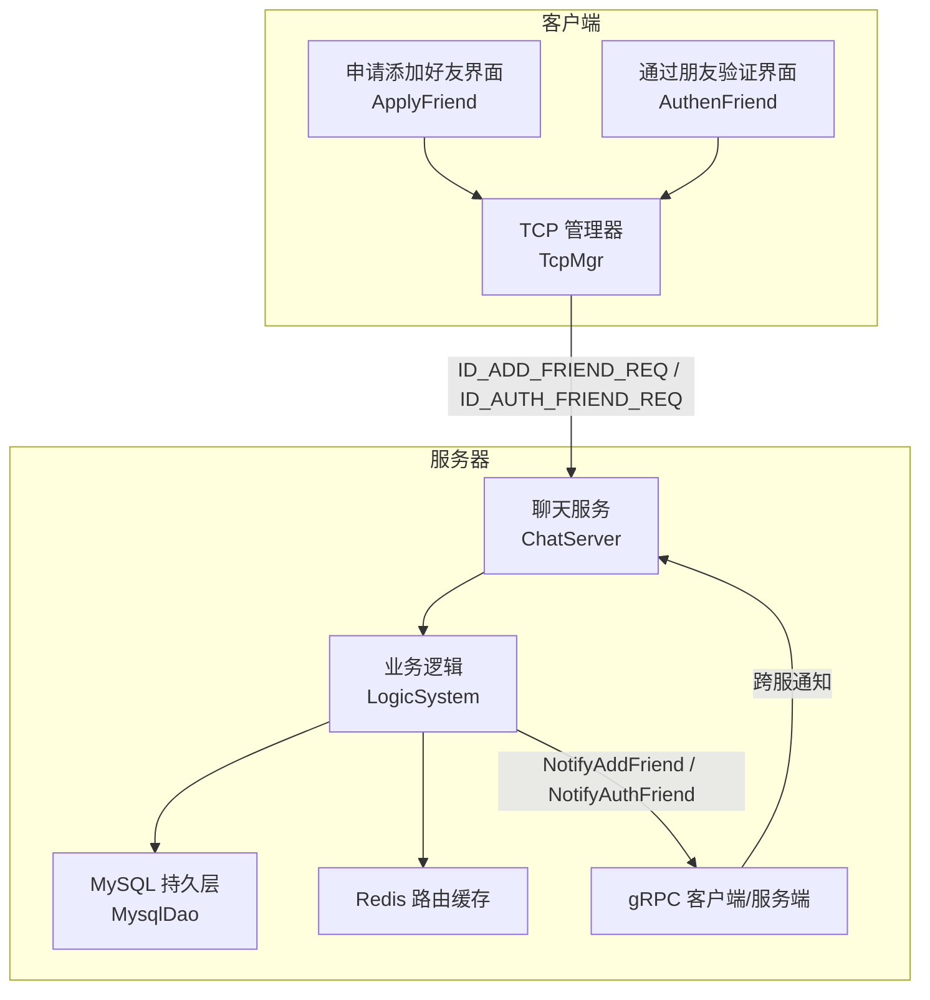
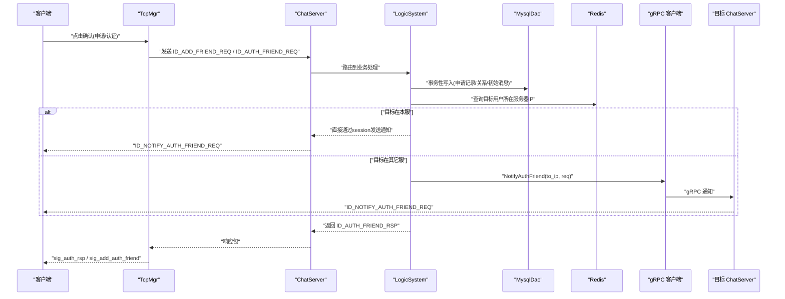
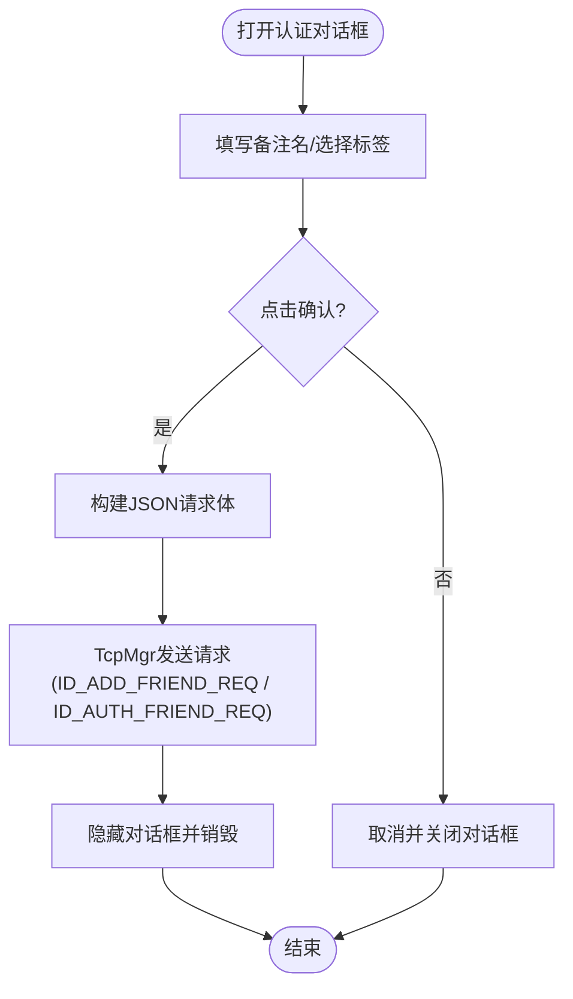
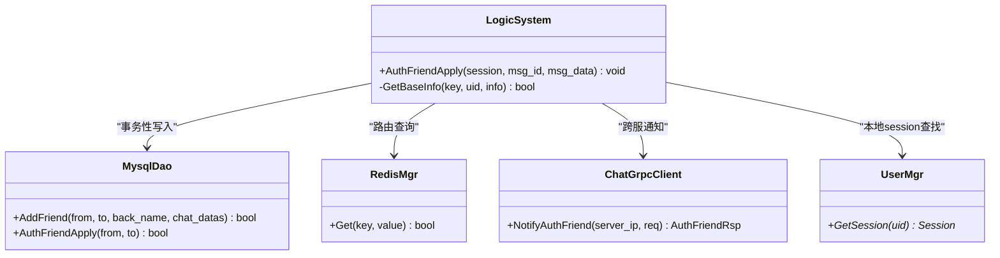
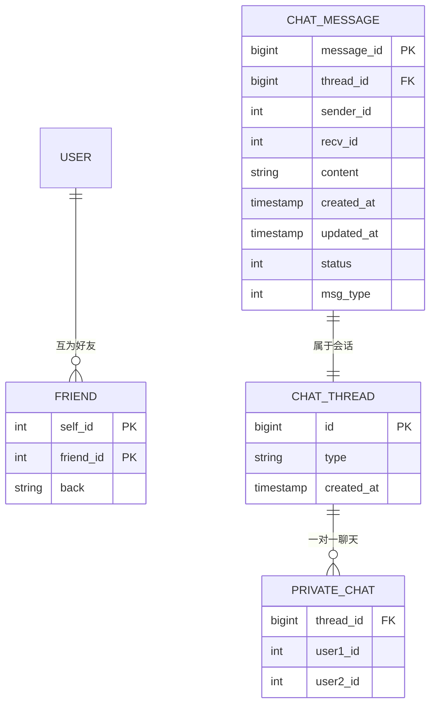
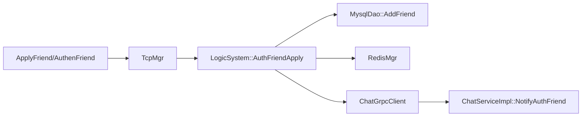

# 好友认证功能

<cite>
**本文引用的文件**   
- [applyfriend.h](file://client/llfcchat/include/applyfriend.h)
- [authenfriend.h](file://client/llfcchat/include/authenfriend.h)
- [applyfriend.cpp](file://client/llfcchat/src/applyfriend.cpp)
- [authenfriend.cpp](file://client/llfcchat/src/authenfriend.cpp)
- [tcpmgr.h](file://client/llfcchat/include/tcpmgr.h)
- [tcpmgr.cpp](file://client/llfcchat/src/tcpmgr.cpp)
- [userdata.h](file://client/llfcchat/include/userdata.h)
- [authenfriend.ui](file://client/llfcchat/ui/authenfriend.ui)
- [applyfriend.ui](file://client/llfcchat/ui/applyfriend.ui)
- [message.proto](file://server/proto/chat/message.proto)
- [LogicSystem.cpp](file://server/ChatServer/src/LogicSystem.cpp)
- [MysqlDao.cpp](file://server/ResourceServer/src/MysqlDao.cpp)
- [ChatServiceImpl.cpp](file://server/ChatServer/src/ChatServiceImpl.cpp)
- [day29-好友认证和聊天通信.md](file://开发文档/day29-好友认证和聊天通信.md)
- [day37-聊天信息存储方案.md](file://开发文档/day37-聊天信息存储方案.md)
</cite>

## 目录
1. [简介](#简介)
2. [项目结构](#项目结构)
3. [核心组件](#核心组件)
4. [架构总览](#架构总览)
5. [详细组件分析](#详细组件分析)
6. [依赖关系分析](#依赖关系分析)
7. [性能考虑](#性能考虑)
8. [故障排查指南](#故障排查指南)
9. [结论](#结论)
10. [附录](#附录)

## 简介
本技术文档围绕 LLFCChat 项目的“好友认证”功能，系统性阐述从客户端发起认证到服务端处理、双向确认、关系建立与数据同步的完整流程。重点覆盖：
- 客户端认证界面的交互逻辑（对话框、标签输入、确认按钮、结果反馈）
- 服务端认证处理的核心逻辑（请求解析、权限校验、事务处理、一致性保证）
- 消息通信协议与状态同步机制（TCP 业务消息 + gRPC 跨服通知）
- 失败处理策略、重试机制与用户体验优化建议
- 关键接口调用路径与代码片段索引

## 项目结构
本项目采用前后端分离与多服务架构：
- 客户端（Qt/C++）：负责 UI 交互、TCP 连接管理、消息编解码与事件分发
- ChatServer（C++）：处理好友申请与认证的业务逻辑、数据库操作、Redis 路由、gRPC 跨服通知
- ResourceServer（C++）：提供 MySQL 持久化能力（包含好友申请与关系表操作）
- Proto 定义：统一消息结构与 RPC 接口

图表来源
- [applyfriend.cpp:477-506](file://client/llfcchat/src/applyfriend.cpp#L477-L506)
- [authenfriend.cpp:412-436](file://client/llfcchat/src/authenfriend.cpp#L412-L436)
- [tcpmgr.h:22-87](file://client/llfcchat/include/tcpmgr.h#L22-L87)
- [LogicSystem.cpp:360-478](file://server/ChatServer/src/LogicSystem.cpp#L360-L478)
- [MysqlDao.cpp:247-2121](file://server/ResourceServer/src/MysqlDao.cpp#L247-L2121)
- [message.proto:46-166](file://server/proto/chat/message.proto#L46-L166)

章节来源
- [applyfriend.cpp:1-515](file://client/llfcchat/src/applyfriend.cpp#L1-L515)
- [authenfriend.cpp:1-443](file://client/llfcchat/src/authenfriend.cpp#L1-L443)
- [tcpmgr.h:1-90](file://client/llfcchat/include/tcpmgr.h#L1-L90)
- [message.proto:1-167](file://server/proto/chat/message.proto#L1-L167)

## 核心组件
- 客户端认证界面
  - ApplyFriend：申请添加好友对话框，支持备注名、标签选择、确认/取消
  - AuthenFriend：通过朋友验证对话框，支持备注名、标签选择、确认/取消
- 网络与消息
  - TcpMgr：封装 TCP 连接、发送队列、消息分发与回调注册
  - 数据结构：ApplyInfo、AuthInfo、TextChatData 等用于承载用户信息与聊天数据
- 服务端逻辑
  - LogicSystem::AuthFriendApply：处理认证请求，更新关系、创建会话、推送通知
  - MysqlDao：实现好友申请记录、关系建立、初始消息写入的事务性操作
  - ChatServiceImpl：gRPC 通知接收与转发

章节来源
- [applyfriend.h:1-59](file://client/llfcchat/include/applyfriend.h#L1-L59)
- [authenfriend.h:1-64](file://client/llfcchat/include/authenfriend.h#L1-L64)
- [tcpmgr.h:22-87](file://client/llfcchat/include/tcpmgr.h#L22-L87)
- [userdata.h:48-93](file://client/llfcchat/include/userdata.h#L48-L93)
- [LogicSystem.cpp:360-478](file://server/ChatServer/src/LogicSystem.cpp#L360-L478)
- [MysqlDao.cpp:247-2121](file://server/ResourceServer/src/MysqlDao.cpp#L247-L2121)

## 架构总览
好友认证涉及两条主通道：
- TCP 通道：客户端与服务端之间的业务消息（申请/认证请求与响应）
- gRPC 通道：跨 ChatServer 实例的通知（将认证结果与历史消息推送到对端在线用户）

图表来源
- [tcpmgr.cpp:335-367](file://client/llfcchat/src/tcpmgr.cpp#L335-L367)
- [LogicSystem.cpp:360-478](file://server/ChatServer/src/LogicSystem.cpp#L360-L478)
- [MysqlDao.cpp:247-2121](file://server/ResourceServer/src/MysqlDao.cpp#L247-L2121)
- [ChatServiceImpl.cpp:49-84](file://server/ChatServer/src/ChatServiceImpl.cpp#L49-L84)
- [message.proto:95-166](file://server/proto/chat/message.proto#L95-L166)

## 详细组件分析

### 客户端认证界面交互逻辑
- ApplyFriend（申请添加好友）
  - 输入框：名称、备注名、标签输入
  - 标签区域：支持预设标签快速选择、新增自定义标签、多选展示
  - 确认按钮：组装 JSON（uid、applyname、bakname、touid），通过 TcpMgr 发送 ID_ADD_FRIEND_REQ
  - 取消按钮：关闭对话框并释放资源
- AuthenFriend（通过朋友验证）
  - 输入框：备注名、标签输入
  - 确认按钮：组装 JSON（fromuid、touid、back），通过 TcpMgr 发送 ID_AUTH_FRIEND_REQ
  - 取消按钮：关闭对话框并释放资源

图表来源
- [applyfriend.cpp:477-506](file://client/llfcchat/src/applyfriend.cpp#L477-L506)
- [authenfriend.cpp:412-436](file://client/llfcchat/src/authenfriend.cpp#L412-L436)
- [applyfriend.ui:1-562](file://client/llfcchat/ui/applyfriend.ui#L1-L562)
- [authenfriend.ui:1-527](file://client/llfcchat/ui/authenfriend.ui#L1-L527)

章节来源
- [applyfriend.cpp:1-515](file://client/llfcchat/src/applyfriend.cpp#L1-L515)
- [authenfriend.cpp:1-443](file://client/llfcchat/src/authenfriend.cpp#L1-L443)
- [applyfriend.ui:1-562](file://client/llfcchat/ui/applyfriend.ui#L1-L562)
- [authenfriend.ui:1-527](file://client/llfcchat/ui/authenfriend.ui#L1-L527)

### 服务端认证处理核心逻辑
- 请求解析与校验
  - 解析 JSON 获取 fromuid、touid、back 等字段
  - 校验 touid 有效性，读取基础信息（昵称、头像、性别等）
- 事务性关系建立
  - 使用 MysqlDao::AddFriend 进行事务操作：
    - 锁定并读取 friend_apply 记录（FOR UPDATE）
    - 更新申请状态为已同意
    - INSERT IGNORE 写入双方好友关系（self_id/friend_id/back）
    - 创建 chat_thread（私聊会话）
    - 插入 private_chat 关联
    - 可选插入初始消息（申请描述或“我们是好友了！”）
- 实时通知与跨服同步
  - 查询 Redis 获取目标用户所在服务器 IP
  - 若目标在本服：直接通过 UserMgr 获取 session 并发送 ID_NOTIFY_AUTH_FRIEND_REQ
  - 若目标在其它服：构造 AuthFriendReq 并通过 gRPC NotifyAuthFriend 通知目标 ChatServer
- 响应回发
  - 使用 Defer 确保 ID_AUTH_FRIEND_RSP 始终返回给发起方，携带对方基础信息与 chat_datas（初始消息列表）

图表来源
- [LogicSystem.cpp:360-478](file://server/ChatServer/src/LogicSystem.cpp#L360-L478)
- [MysqlDao.cpp:247-2121](file://server/ResourceServer/src/MysqlDao.cpp#L247-L2121)
- [ChatServiceImpl.cpp:49-84](file://server/ChatServer/src/ChatServiceImpl.cpp#L49-L84)

章节来源
- [LogicSystem.cpp:360-478](file://server/ChatServer/src/LogicSystem.cpp#L360-L478)
- [MysqlDao.cpp:247-2121](file://server/ResourceServer/src/MysqlDao.cpp#L247-L2121)
- [ChatServiceImpl.cpp:49-84](file://server/ChatServer/src/ChatServiceImpl.cpp#L49-L84)

### 消息通信协议与状态同步
- TCP 业务消息
  - ID_ADD_FRIEND_REQ：申请添加好友请求
  - ID_AUTH_FRIEND_REQ：认证通过请求
  - ID_AUTH_FRIEND_RSP：认证响应（包含对方基础信息与初始消息）
  - ID_NOTIFY_AUTH_FRIEND_REQ：认证通过通知（含 chat_datas）
- gRPC 通知
  - NotifyAddFriend：通知新用户申请
  - NotifyAuthFriend：通知认证通过及初始消息
- 数据结构
  - AddFriendReq/RplyFriendReq/AuthFriendReq 等由 message.proto 统一定义

图表来源
- [message.proto:46-166](file://server/proto/chat/message.proto#L46-L166)
- [MysqlDao.cpp:247-2121](file://server/ResourceServer/src/MysqlDao.cpp#L247-L2121)

章节来源
- [message.proto:1-167](file://server/proto/chat/message.proto#L1-L167)
- [tcpmgr.cpp:335-367](file://client/llfcchat/src/tcpmgr.cpp#L335-L367)

### 客户端消息处理与状态同步
- TcpMgr 注册处理器
  - ID_AUTH_FRIEND_RSP：解析 error/name/nick/icon/sex/uid，构造 AuthRsp 并触发 sig_auth_rsp
  - ID_NOTIFY_AUTH_FRIEND_REQ：解析 fromuid/name/nick/icon/sex 与 chat_datas，构造 AuthInfo 并触发 sig_add_auth_friend
- 上层 UI 监听信号
  - 收到 sig_auth_rsp：显示认证结果（成功/失败提示）
  - 收到 sig_add_auth_friend：刷新联系人列表、初始化聊天会话与历史消息

章节来源
- [tcpmgr.h:64-87](file://client/llfcchat/include/tcpmgr.h#L64-L87)
- [tcpmgr.cpp:335-367](file://client/llfcchat/src/tcpmgr.cpp#L335-L367)
- [day29-好友认证和聊天通信.md:340-420](file://开发文档/day29-好友认证和聊天通信.md#L340-L420)
- [day37-聊天信息存储方案.md:2185-2333](file://开发文档/day37-聊天信息存储方案.md#L2185-L2333)

## 依赖关系分析
- 客户端依赖
  - Ui 层：applyfriend.ui / authenfriend.ui
  - 业务层：applyfriend.cpp / authenfriend.cpp
  - 网络层：tcpmgr.h/cpp
  - 数据模型：userdata.h
- 服务端依赖
  - 业务层：LogicSystem.cpp
  - 持久层：MysqlDao.cpp
  - 路由缓存：RedisMgr（通过配置键 USERIPPREFIX）
  - 跨服通信：ChatGrpcClient（基于 message.proto）

图表来源
- [applyfriend.cpp:477-506](file://client/llfcchat/src/applyfriend.cpp#L477-L506)
- [authenfriend.cpp:412-436](file://client/llfcchat/src/authenfriend.cpp#L412-L436)
- [tcpmgr.h:22-87](file://client/llfcchat/include/tcpmgr.h#L22-L87)
- [LogicSystem.cpp:360-478](file://server/ChatServer/src/LogicSystem.cpp#L360-L478)
- [MysqlDao.cpp:247-2121](file://server/ResourceServer/src/MysqlDao.cpp#L247-L2121)
- [ChatServiceImpl.cpp:49-84](file://server/ChatServer/src/ChatServiceImpl.cpp#L49-L84)

章节来源
- [tcpmgr.h:1-90](file://client/llfcchat/include/tcpmgr.h#L1-L90)
- [message.proto:1-167](file://server/proto/chat/message.proto#L1-L167)

## 性能考虑
- 数据库事务
  - 使用 FOR UPDATE 行级锁避免并发冲突
  - 批量写入（关系、会话、初始消息）减少往返开销
- 内存与网络
  - 本地 session 直发避免不必要的 gRPC 调用
  - 仅传输必要字段（error、基础信息、chat_datas）
- 可扩展性
  - 通过 Redis 路由实现水平扩展
  - gRPC 异步通知提升吞吐

[本节为通用指导，不直接分析具体文件]

## 故障排查指南
- 常见错误码
  - UidInvalid：目标用户无效
  - ERR_JSON：JSON 解析失败
  - SUCCESS：成功
- 排查步骤
  - 检查 TCP 请求是否到达服务端（日志打印 fromuid/touid）
  - 检查 Redis 路由键是否存在（USERIPPREFIX + touid）
  - 检查数据库事务是否提交成功（关系、会话、消息）
  - 检查 gRPC 调用是否成功（跨服通知）
  - 客户端处理器是否正确注册（ID_AUTH_FRIEND_RSP / ID_NOTIFY_AUTH_FRIEND_REQ）

章节来源
- [LogicSystem.cpp:360-478](file://server/ChatServer/src/LogicSystem.cpp#L360-L478)
- [tcpmgr.cpp:335-367](file://client/llfcchat/src/tcpmgr.cpp#L335-L367)
- [day29-好友认证和聊天通信.md:340-420](file://开发文档/day29-好友认证和聊天通信.md#L340-L420)
- [day37-聊天信息存储方案.md:2185-2333](file://开发文档/day37-聊天信息存储方案.md#L2185-L2333)

## 结论
LLFCChat 的好友认证功能通过清晰的客户端 UI 交互、稳健的服务端事务处理与高效的跨服通知机制，实现了可靠的双向确认与关系建立。TCP 与 gRPC 的组合确保了实时性与可扩展性，配合 Redis 路由与 MySQL 事务保证了数据一致性与高可用。建议在后续迭代中增强错误提示、重试机制与监控埋点，进一步提升用户体验与系统可观测性。

[本节为总结性内容，不直接分析具体文件]

## 附录
- 关键接口调用路径（示例）
  - 客户端发送申请：ApplyFriend::SlotApplySure -> TcpMgr::sig_send_data(ID_ADD_FRIEND_REQ)
  - 客户端发送认证：AuthenFriend::SlotApplySure -> TcpMgr::sig_send_data(ID_AUTH_FRIEND_REQ)
  - 服务端处理认证：LogicSystem::AuthFriendApply -> MysqlDao::AddFriend -> RedisMgr::Get -> ChatGrpcClient::NotifyAuthFriend
  - 客户端接收响应：TcpMgr::_handlers[ID_AUTH_FRIEND_RSP] -> sig_auth_rsp
  - 客户端接收通知：TcpMgr::_handlers[ID_NOTIFY_AUTH_FRIEND_REQ] -> sig_add_auth_friend

章节来源
- [applyfriend.cpp:477-506](file://client/llfcchat/src/applyfriend.cpp#L477-L506)
- [authenfriend.cpp:412-436](file://client/llfcchat/src/authenfriend.cpp#L412-L436)
- [tcpmgr.h:64-87](file://client/llfcchat/include/tcpmgr.h#L64-L87)
- [LogicSystem.cpp:360-478](file://server/ChatServer/src/LogicSystem.cpp#L360-L478)
- [MysqlDao.cpp:247-2121](file://server/ResourceServer/src/MysqlDao.cpp#L247-L2121)
- [ChatServiceImpl.cpp:49-84](file://server/ChatServer/src/ChatServiceImpl.cpp#L49-L84)
- [tcpmgr.cpp:335-367](file://client/llfcchat/src/tcpmgr.cpp#L335-L367)
- [day29-好友认证和聊天通信.md:340-420](file://开发文档/day29-好友认证和聊天通信.md#L340-L420)
- [day37-聊天信息存储方案.md:2185-2333](file://开发文档/day37-聊天信息存储方案.md#L2185-L2333)