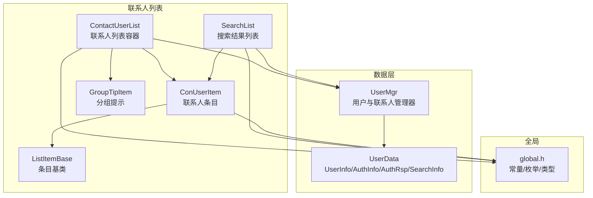
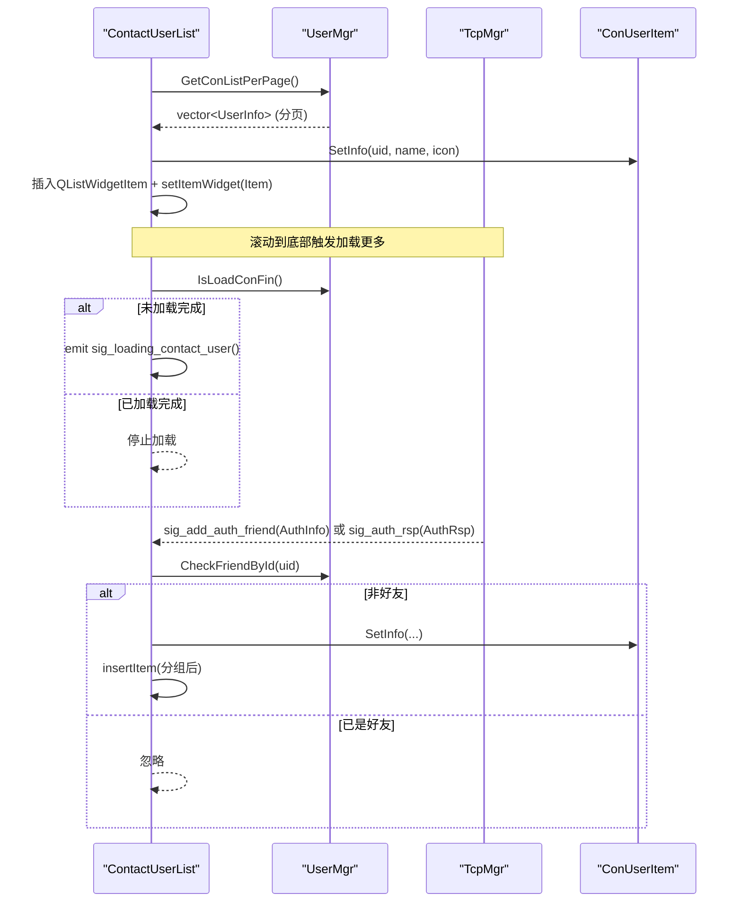
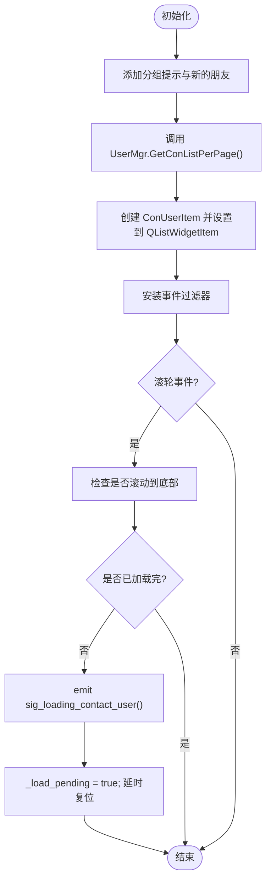
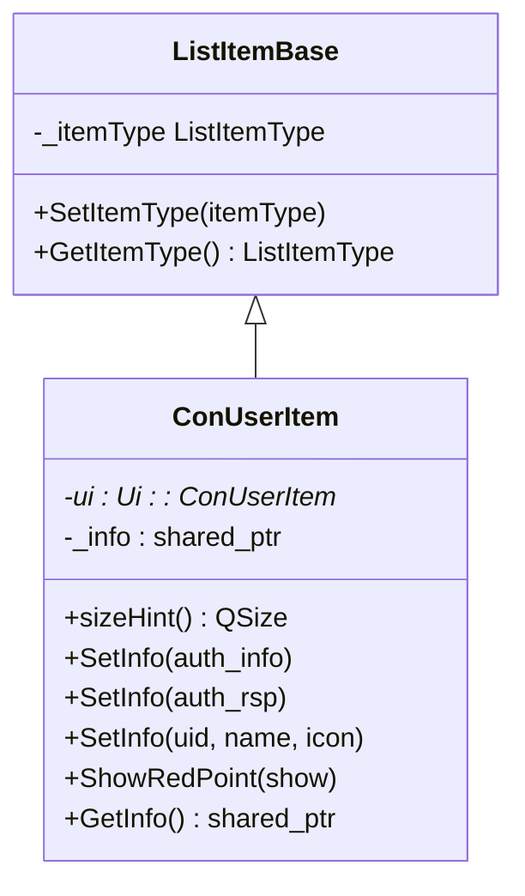
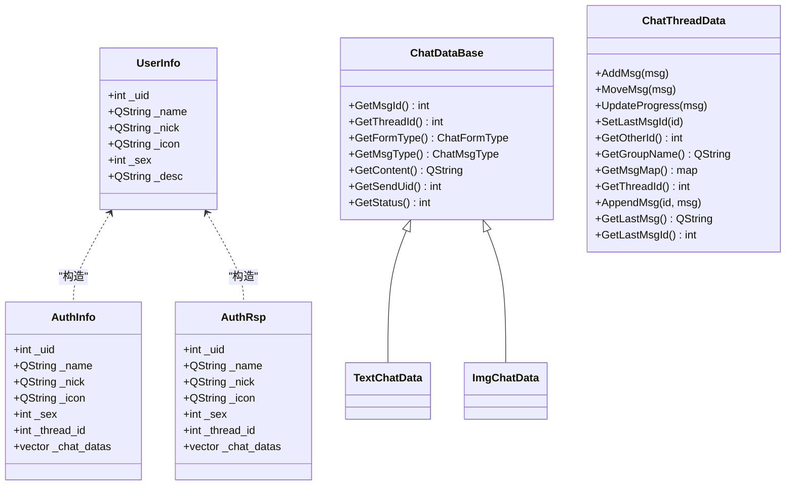
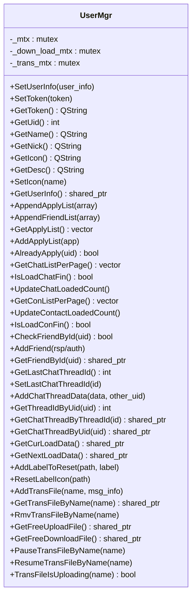
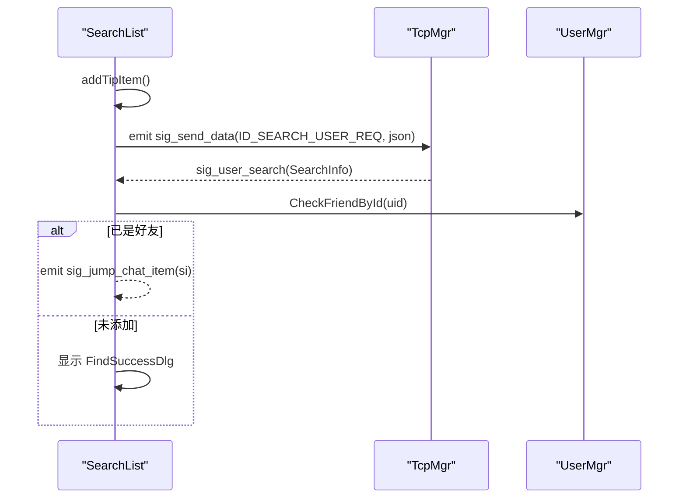
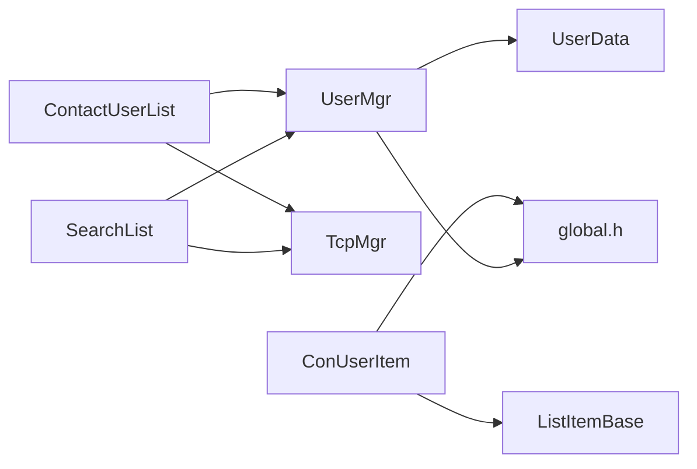

# 联系人管理

<cite>
**本文引用的文件**   
- [contactuserlist.h](file://client/llfcchat/include/contactuserlist.h)
- [contactuserlist.cpp](file://client/llfcchat/src/contactuserlist.cpp)
- [conuseritem.h](file://client/llfcchat/include/conuseritem.h)
- [conuseritem.cpp](file://client/llfcchat/src/conuseritem.cpp)
- [userdata.h](file://client/llfcchat/include/userdata.h)
- [usermgr.h](file://client/llfcchat/include/usermgr.h)
- [usermgr.cpp](file://client/llfcchat/src/usermgr.cpp)
- [searchlist.h](file://client/llfcchat/include/searchlist.h)
- [searchlist.cpp](file://client/llfcchat/src/searchlist.cpp)
- [global.h](file://client/llfcchat/include/global.h)
- [listitembase.h](file://client/llfcchat/include/listitembase.h)
- [grouptipitem.h](file://client/llfcchat/include/grouptipitem.h)
- [chatuserlist.h](file://client/llfcchat/include/chatuserlist.h)
- [chatuserlist.cpp](file://client/llfcchat/src/chatuserlist.cpp)
</cite>

## 目录
1. [简介](#简介)
2. [项目结构](#项目结构)
3. [核心组件](#核心组件)
4. [架构总览](#架构总览)
5. [详细组件分析](#详细组件分析)
6. [依赖关系分析](#依赖关系分析)
7. [性能考虑](#性能考虑)
8. [故障排查指南](#故障排查指南)
9. [结论](#结论)
10. [附录：接口与最佳实践](#附录接口与最佳实践)

## 简介
本技术文档聚焦于 LLFCChat 客户端的“联系人管理”功能，系统性说明联系人列表的维护机制、数据模型、UI 组件架构、事件处理与实时更新策略。重点覆盖以下方面：
- 好友分组展示、搜索过滤、状态显示（红点提示）与实时更新
- 联系人项数据结构设计（用户信息缓存、头像加载、在线状态同步扩展点）
- 列表 UI 组件架构（自定义控件、事件过滤器、滚动分页加载）
- 联系人与聊天会话的关联关系与数据同步机制
- 搜索算法与排序规则、分页加载等性能优化策略
- 联系人状态变化监听与界面更新逻辑
- 核心接口使用示例与最佳实践

## 项目结构
联系人管理相关代码主要位于客户端模块中，采用 Qt 框架实现，核心文件包括：
- 列表容器与交互：ContactUserList、SearchList、ChatUserList
- 列表项控件：ConUserItem、GroupTipItem、ListItemBase
- 数据模型与管理：UserData（UserInfo、AuthInfo、AuthRsp、SearchInfo）、UserMgr
- 全局常量与类型定义：global.h（分页大小、列表项类型、消息类型等）

图表来源
- [contactuserlist.h:1-38](file://client/llfcchat/include/contactuserlist.h#L1-L38)
- [contactuserlist.cpp:1-260](file://client/llfcchat/src/contactuserlist.cpp#L1-L260)
- [conuseritem.h:1-31](file://client/llfcchat/include/conuseritem.h#L1-L31)
- [conuseritem.cpp:1-78](file://client/llfcchat/src/conuseritem.cpp#L1-L78)
- [usermgr.h:1-116](file://client/llfcchat/include/usermgr.h#L1-L116)
- [usermgr.cpp:1-566](file://client/llfcchat/src/usermgr.cpp#L1-L566)
- [searchlist.h:1-62](file://client/llfcchat/include/searchlist.h#L1-L62)
- [searchlist.cpp:1-151](file://client/llfcchat/src/searchlist.cpp#L1-L151)
- [global.h:1-296](file://client/llfcchat/include/global.h#L1-L296)
- [listitembase.h:1-27](file://client/llfcchat/include/listitembase.h#L1-L27)
- [grouptipitem.h:1-26](file://client/llfcchat/include/grouptipitem.h#L1-L26)

章节来源
- [contactuserlist.h:1-38](file://client/llfcchat/include/contactuserlist.h#L1-L38)
- [contactuserlist.cpp:1-260](file://client/llfcchat/src/contactuserlist.cpp#L1-L260)
- [conuseritem.h:1-31](file://client/llfcchat/include/conuseritem.h#L1-L31)
- [conuseritem.cpp:1-78](file://client/llfcchat/src/conuseritem.cpp#L1-L78)
- [usermgr.h:1-116](file://client/llfcchat/include/usermgr.h#L1-L116)
- [usermgr.cpp:1-566](file://client/llfcchat/src/usermgr.cpp#L1-L566)
- [searchlist.h:1-62](file://client/llfcchat/include/searchlist.h#L1-L62)
- [searchlist.cpp:1-151](file://client/llfcchat/src/searchlist.cpp#L1-L151)
- [global.h:1-296](file://client/llfcchat/include/global.h#L1-L296)
- [listitembase.h:1-27](file://client/llfcchat/include/listitembase.h#L1-L27)
- [grouptipitem.h:1-26](file://client/llfcchat/include/grouptipitem.h#L1-L26)

## 核心组件
- ContactUserList：联系人列表容器，负责分组提示、“新的朋友”入口、联系人项渲染、滚动到底部触发加载更多、点击事件分发、实时新增联系人插入。
- ConUserItem：联系人条目控件，封装用户头像、名称、红点提示，支持从 AuthInfo/AuthRsp/UserInfo 构造并渲染。
- UserMgr：单例管理器，维护好友列表、申请列表、聊天线程映射、分页加载计数、头像重置队列、文件传输信息等；提供按页获取联系人、判断是否已添加好友、根据 uid 获取会话线程等功能。
- SearchList：搜索结果列表，处理用户搜索请求、结果弹窗（成功/失败）、跳转到已有好友或发起新好友申请。
- ListItemBase / GroupTipItem：列表项基类与分组提示项，统一条目类型标记与绘制。
- global.h：定义分页大小 CHAT_COUNT_PER_PAGE=13、列表项类型、消息类型、传输状态等关键常量与枚举。

章节来源
- [contactuserlist.h:1-38](file://client/llfcchat/include/contactuserlist.h#L1-L38)
- [contactuserlist.cpp:1-260](file://client/llfcchat/src/contactuserlist.cpp#L1-L260)
- [conuseritem.h:1-31](file://client/llfcchat/include/conuseritem.h#L1-L31)
- [conuseritem.cpp:1-78](file://client/llfcchat/src/conuseritem.cpp#L1-L78)
- [usermgr.h:1-116](file://client/llfcchat/include/usermgr.h#L1-L116)
- [usermgr.cpp:1-566](file://client/llfcchat/src/usermgr.cpp#L1-L566)
- [searchlist.h:1-62](file://client/llfcchat/include/searchlist.h#L1-L62)
- [searchlist.cpp:1-151](file://client/llfcchat/src/searchlist.cpp#L1-L151)
- [global.h:1-296](file://client/llfcchat/include/global.h#L1-L296)
- [listitembase.h:1-27](file://client/llfcchat/include/listitembase.h#L1-L27)
- [grouptipitem.h:1-26](file://client/llfcchat/include/grouptipitem.h#L1-L26)

## 架构总览
联系人管理的整体流程如下：
- 初始化时，ContactUserList 构建分组提示与“新的朋友”入口，并从 UserMgr 分页拉取联系人列表渲染到 QListWidget。
- 当用户滚动到底部时，通过 eventFilter 检测滚轮事件，调用 UserMgr::IsLoadConFin() 判断是否加载完成，未完成则触发加载更多信号。
- 当收到对端认证通知或本地同意认证后，TcpMgr 发出信号，ContactUserList 在“联系人”分组之后动态插入新条目。
- SearchList 接收搜索请求，返回结果后根据是否已是好友决定跳转或弹出“查找成功”对话框。
- UserMgr 统一管理好友列表、申请列表、聊天线程映射，并提供按页获取与查询接口。

图表来源
- [contactuserlist.cpp:41-101](file://client/llfcchat/src/contactuserlist.cpp#L41-L101)
- [contactuserlist.cpp:103-160](file://client/llfcchat/src/contactuserlist.cpp#L103-L160)
- [contactuserlist.cpp:205-257](file://client/llfcchat/src/contactuserlist.cpp#L205-L257)
- [usermgr.cpp:149-167](file://client/llfcchat/src/usermgr.cpp#L149-L167)
- [usermgr.cpp:238-261](file://client/llfcchat/src/usermgr.cpp#L238-L261)

## 详细组件分析

### 联系人列表容器 ContactUserList
- 职责
  - 初始化分组提示与“新的朋友”入口
  - 分页加载联系人并渲染为自定义条目
  - 事件过滤器处理鼠标悬浮与滚轮事件，实现滚动到底部加载更多
  - 响应 TcpMgr 的信号，动态插入新联系人
  - 点击事件分发，跳转到好友申请页面或联系人详情页面
- 关键点
  - 使用 QListWidget 的 setItemWidget 绑定自定义 ConUserItem
  - 通过 UserMgr 的分页接口与计数控制加载进度
  - 使用 _load_pending 防抖避免重复触发加载
  - 在“联系人”分组之后插入新条目，保证分组顺序

图表来源
- [contactuserlist.cpp:41-101](file://client/llfcchat/src/contactuserlist.cpp#L41-L101)
- [contactuserlist.cpp:103-160](file://client/llfcchat/src/contactuserlist.cpp#L103-L160)

章节来源
- [contactuserlist.h:1-38](file://client/llfcchat/include/contactuserlist.h#L1-L38)
- [contactuserlist.cpp:1-260](file://client/llfcchat/src/contactuserlist.cpp#L1-L260)

### 联系人条目 ConUserItem
- 职责
  - 渲染用户头像、昵称、红点提示
  - 支持从 AuthInfo、AuthRsp、UserInfo 构造并填充 UI
  - 暴露 GetInfo() 供上层获取用户信息
- 关键点
  - 继承自 ListItemBase，统一条目类型标记
  - 头像加载使用 QPixmap 缩放并设置平滑变换
  - 红点提示用于未读或新增提醒

图表来源
- [listitembase.h:1-27](file://client/llfcchat/include/listitembase.h#L1-L27)
- [conuseritem.h:1-31](file://client/llfcchat/include/conuseritem.h#L1-L31)
- [conuseritem.cpp:1-78](file://client/llfcchat/src/conuseritem.cpp#L1-L78)

章节来源
- [conuseritem.h:1-31](file://client/llfcchat/include/conuseritem.h#L1-L31)
- [conuseritem.cpp:1-78](file://client/llfcchat/src/conuseritem.cpp#L1-L78)

### 数据模型 UserData
- UserInfo：联系人基本信息（uid、name、nick、icon、sex、desc），支持从 AuthInfo/AuthRsp/SearchInfo 构造
- AuthInfo/AuthRsp：认证信息与认证回复，包含 thread_id 与聊天数据向量
- ChatDataBase/TextChatData/ImgChatData：聊天消息基类与具体类型
- ChatThreadData：会话数据，包含消息映射、未回复消息、群成员与群名等
- MsgInfo：文件传输元数据（类型、大小、MD5、序列号、状态等）

图表来源
- [userdata.h:67-142](file://client/llfcchat/include/userdata.h#L67-L142)
- [userdata.h:144-284](file://client/llfcchat/include/userdata.h#L144-L284)

章节来源
- [userdata.h:1-288](file://client/llfcchat/include/userdata.h#L1-L288)

### 用户与联系人管理器 UserMgr
- 职责
  - 维护当前用户信息、令牌、好友列表、申请列表
  - 分页获取联系人/聊天列表，维护加载计数与完成标志
  - 建立 uid 与 thread_id 的映射，提供会话数据查询
  - 头像路径到 QLabel 的批量重置队列，支持上传后刷新
  - 文件传输状态管理与并发控制
- 关键点
  - 所有共享数据访问均加锁保护（std::mutex）
  - 分页接口基于 CHAT_COUNT_PER_PAGE=13 进行切片
  - CheckFriendById 使用 _friend_map 快速判断是否已添加好友

图表来源
- [usermgr.h:1-116](file://client/llfcchat/include/usermgr.h#L1-L116)
- [usermgr.cpp:1-566](file://client/llfcchat/src/usermgr.cpp#L1-L566)

章节来源
- [usermgr.h:1-116](file://client/llfcchat/include/usermgr.h#L1-L116)
- [usermgr.cpp:1-566](file://client/llfcchat/src/usermgr.cpp#L1-L566)

### 搜索列表 SearchList
- 职责
  - 提供搜索输入框与提示条目
  - 发送搜索请求（ID_SEARCH_USER_REQ）
  - 处理搜索结果（sig_user_search），弹出成功/失败对话框
  - 若搜索结果为已存在好友，直接跳转到对应聊天项
- 关键点
  - 使用 LoadingDlg 显示等待状态
  - 通过 TcpMgr 发送网络请求
  - 避免重复发送（_send_pending）

图表来源
- [searchlist.cpp:55-122](file://client/llfcchat/src/searchlist.cpp#L55-L122)
- [searchlist.cpp:124-151](file://client/llfcchat/src/searchlist.cpp#L124-L151)

章节来源
- [searchlist.h:1-62](file://client/llfcchat/include/searchlist.h#L1-L62)
- [searchlist.cpp:1-151](file://client/llfcchat/src/searchlist.cpp#L1-L151)

### 聊天列表 ChatUserList（对比参考）
- 职责
  - 与 ContactUserList 类似，但用于聊天会话列表的分页加载
  - 事件过滤器处理滚轮事件，触发加载更多聊天项
- 关键点
  - 使用 UserMgr::IsLoadChatFin() 判断加载完成
  - 通过 QTimer 防抖避免重复触发

章节来源
- [chatuserlist.h:1-24](file://client/llfcchat/include/chatuserlist.h#L1-L24)
- [chatuserlist.cpp:1-70](file://client/llfcchat/src/chatuserlist.cpp#L1-L70)

## 依赖关系分析
- ContactUserList 依赖 UserMgr 获取联系人数据与状态，依赖 TcpMgr 接收认证通知
- ConUserItem 依赖 ListItemBase 统一条目类型，依赖 global.h 中的枚举与常量
- SearchList 依赖 TcpMgr 发送搜索请求，依赖 UserMgr 判断好友状态
- UserMgr 依赖 userdata.h 的数据结构与 global.h 的常量

图表来源
- [contactuserlist.cpp:1-260](file://client/llfcchat/src/contactuserlist.cpp#L1-L260)
- [conuseritem.cpp:1-78](file://client/llfcchat/src/conuseritem.cpp#L1-L78)
- [searchlist.cpp:1-151](file://client/llfcchat/src/searchlist.cpp#L1-L151)
- [usermgr.cpp:1-566](file://client/llfcchat/src/usermgr.cpp#L1-L566)

章节来源
- [contactuserlist.cpp:1-260](file://client/llfcchat/src/contactuserlist.cpp#L1-L260)
- [conuseritem.cpp:1-78](file://client/llfcchat/src/conuseritem.cpp#L1-L78)
- [searchlist.cpp:1-151](file://client/llfcchat/src/searchlist.cpp#L1-L151)
- [usermgr.cpp:1-566](file://client/llfcchat/src/usermgr.cpp#L1-L566)

## 性能考虑
- 分页加载：通过 CHAT_COUNT_PER_PAGE=13 控制每页加载数量，减少初始渲染压力
- 防抖机制：_load_pending 与 QTimer 防止频繁触发加载更多
- 事件过滤器：在 viewport 上安装过滤器，避免子控件事件冒泡带来的额外开销
- 头像加载：使用 QPixmap 缩放与平滑变换，避免大图重绘卡顿
- 并发安全：UserMgr 中所有共享数据访问均加锁，避免竞态条件
- 滚动条隐藏：鼠标离开时隐藏垂直滚动条，提升视觉简洁性

[本节为通用性能建议，不直接分析具体文件]

## 故障排查指南
- 联系人未更新
  - 检查 TcpMgr 是否发出 sig_add_auth_friend 或 sig_auth_rsp
  - 确认 UserMgr::CheckFriendById 返回是否正确
  - 查看 ContactUserList::slot_add_auth_firend/slot_auth_rsp 是否执行插入逻辑
- 加载更多无效
  - 检查 UserMgr::IsLoadConFin() 返回值
  - 确认 _load_pending 防抖逻辑是否误阻止
  - 验证滚轮事件是否被正确拦截与处理
- 头像不显示
  - 确认图片路径有效且 QPixmap 加载成功
  - 检查 Resize 与缩放参数是否合理
- 搜索无结果
  - 检查搜索请求 JSON 格式与 ReqId 是否正确
  - 确认 TcpMgr::sig_user_search 是否回调

章节来源
- [contactuserlist.cpp:205-257](file://client/llfcchat/src/contactuserlist.cpp#L205-L257)
- [usermgr.cpp:238-261](file://client/llfcchat/src/usermgr.cpp#L238-L261)
- [searchlist.cpp:124-151](file://client/llfcchat/src/searchlist.cpp#L124-L151)

## 结论
LLFCChat 的联系人管理模块以 Qt 列表控件为基础，结合自定义条目与事件过滤器实现了高效的分页加载与实时更新。UserMgr 作为数据中枢，统一管理好友列表、申请列表与聊天线程映射，并通过信号槽机制与 UI 层解耦。整体架构清晰、可扩展性强，适合后续增加更多联系人状态与交互功能。

[本节为总结性内容，不直接分析具体文件]

## 附录：接口与最佳实践
- 分页加载联系人
  - 调用 UserMgr::GetConListPerPage() 获取分页数据
  - 每次渲染后调用 UserMgr::UpdateContactLoadedCount() 更新计数
  - 滚动到底部时检查 UserMgr::IsLoadConFin() 决定是否继续加载
- 动态插入新联系人
  - 监听 TcpMgr::sig_add_auth_friend 与 sig_auth_rsp
  - 使用 UserMgr::CheckFriendById 去重
  - 在“联系人”分组之后插入 ConUserItem
- 搜索用户
  - 通过 TcpMgr::sig_send_data 发送 ID_SEARCH_USER_REQ
  - 处理 TcpMgr::sig_user_search 回调，根据结果选择跳转或弹窗
- 头像刷新
  - 使用 UserMgr::AddLabelToReset 注册需要刷新的 QLabel
  - 上传完成后调用 UserMgr::ResetLabelIcon 批量刷新

章节来源
- [usermgr.cpp:149-167](file://client/llfcchat/src/usermgr.cpp#L149-L167)
- [usermgr.cpp:211-226](file://client/llfcchat/src/usermgr.cpp#L211-L226)
- [contactuserlist.cpp:205-257](file://client/llfcchat/src/contactuserlist.cpp#L205-L257)
- [searchlist.cpp:124-151](file://client/llfcchat/src/searchlist.cpp#L124-L151)