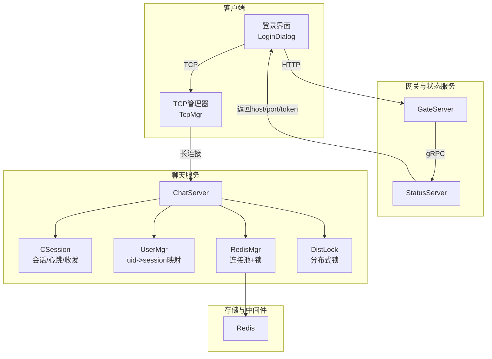
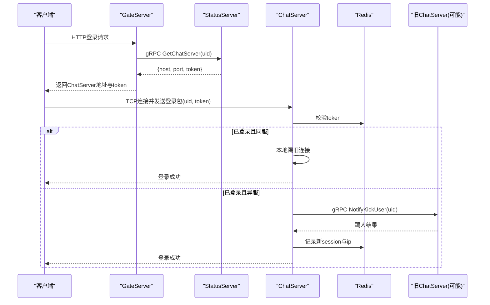
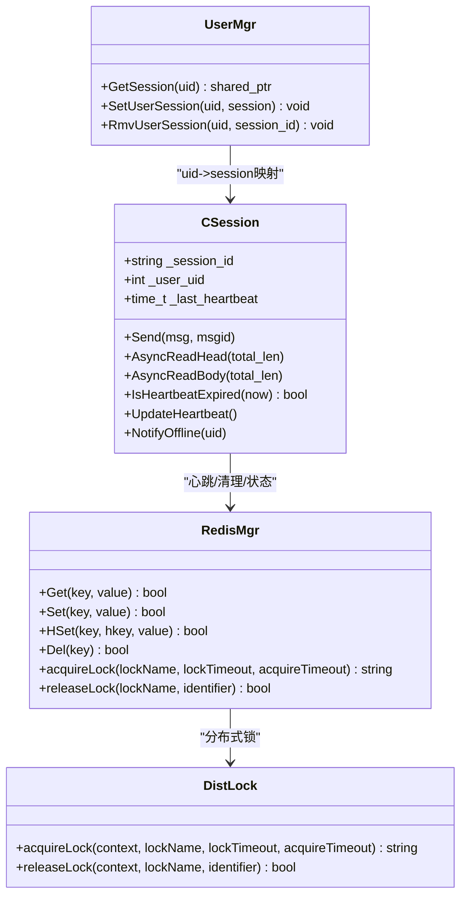
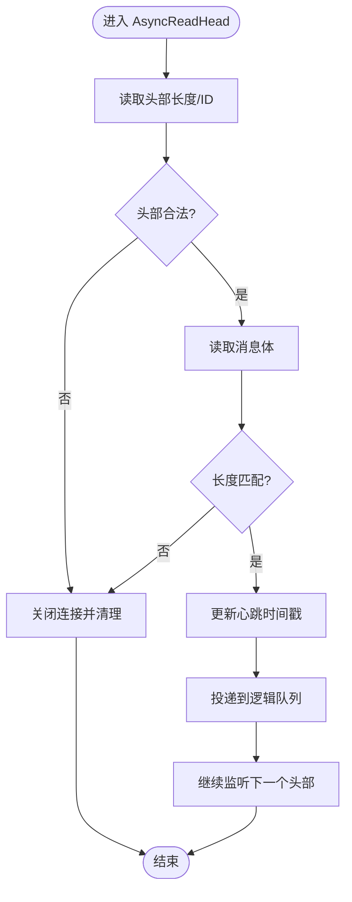
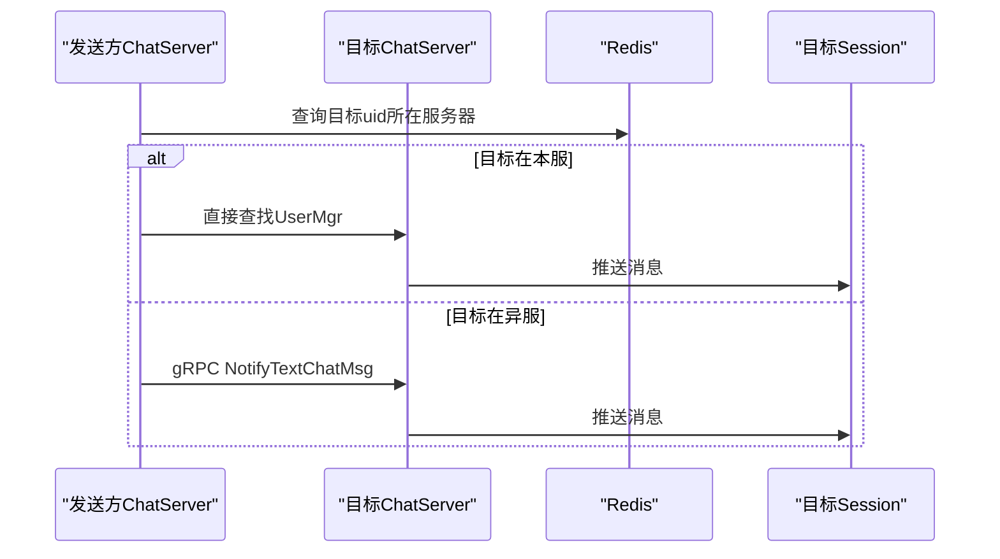
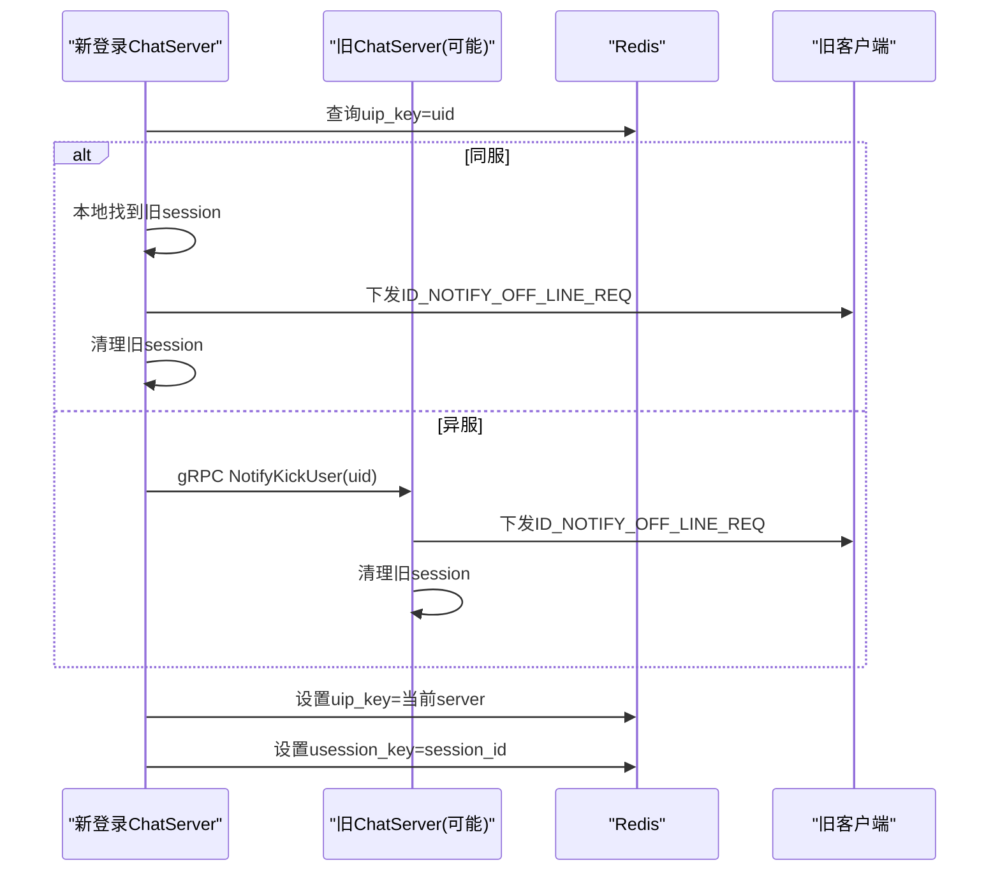
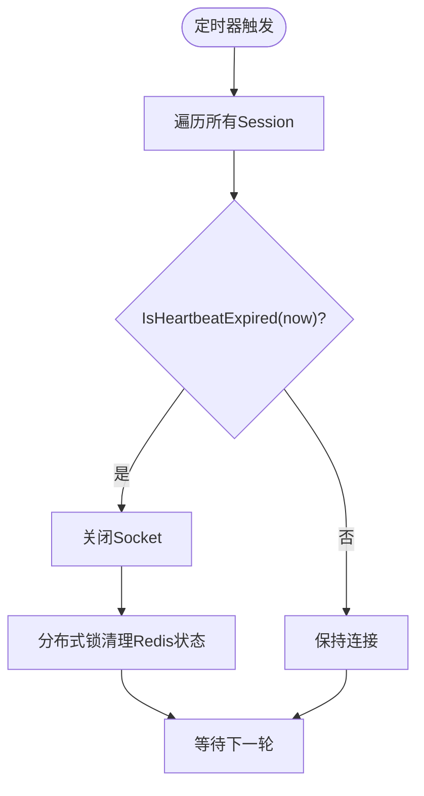
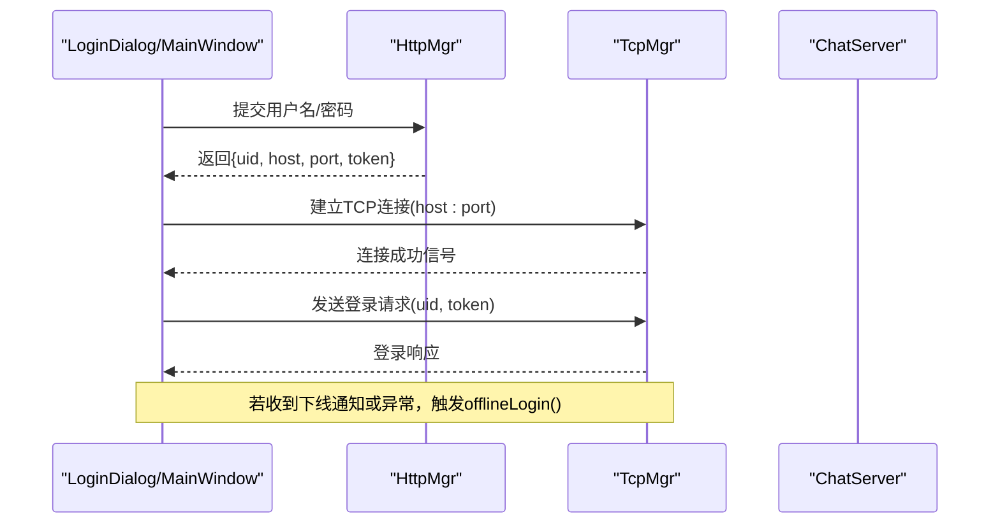
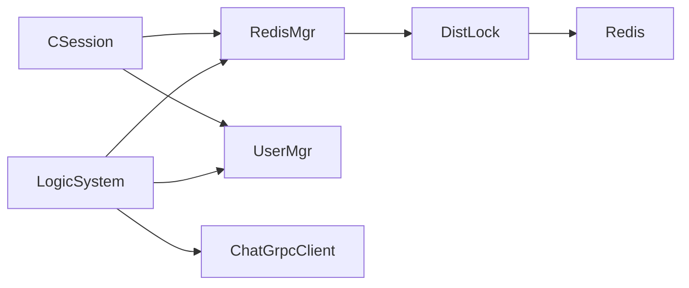

# 多设备登录管理

<cite>
**本文引用的文件**   
- [CSession.h](file://server/ChatServer/include/CSession.h)
- [CSession.cpp](file://server/ChatServer/src/CSession.cpp)
- [UserMgr.h](file://server/ChatServer/include/UserMgr.h)
- [UserMgr.cpp](file://server/ChatServer/src/UserMgr.cpp)
- [DistLock.h](file://server/ChatServer/include/DistLock.h)
- [DistLock.cpp](file://server/ChatServer/src/DistLock.cpp)
- [RedisMgr.h](file://server/ChatServer/include/RedisMgr.h)
- [RedisMgr.cpp](file://server/ChatServer/src/RedisMgr.cpp)
- [const.h](file://server/ChatServer/include/const.h)
- [LogicSystem.cpp](file://server/ChatServer/src/LogicSystem.cpp)
- [ChatGrpcClient.cpp](file://server/ChatServer/src/ChatGrpcClient.cpp)
- [message.proto](file://server/proto/chat/message.proto)
- [StatusServiceImpl.cpp](file://server/StatusServer/src/StatusServiceImpl.cpp)
- [logindialog.cpp](file://client/llfcchat/src/logindialog.cpp)
- [mainwindow.cpp](file://client/llfcchat/src/mainwindow.cpp)
- [day35心跳逻辑.md](file://开发文档/day35心跳逻辑.md)
</cite>

## 目录
1. [简介](#简介)
2. [项目结构](#项目结构)
3. [核心组件](#核心组件)
4. [架构总览](#架构总览)
5. [详细组件分析](#详细组件分析)
6. [依赖关系分析](#依赖关系分析)
7. [性能考量](#性能考量)
8. [故障排查指南](#故障排查指南)
9. [结论](#结论)
10. [附录](#附录)

## 简介
本技术文档围绕 LLFCChat 项目的“多设备登录管理”能力，系统性阐述以下方面：
- 设备标识生成与管理：UUID 生成算法、设备信息收集与唯一性保证
- 会话管理机制：TCP 连接池维护、会话状态跟踪、资源清理策略
- 消息分发算法：目标设备查找、消息广播、优先级处理
- 冲突解决机制：同时登录检测、强制下线逻辑、状态同步策略
- 在线状态管理：心跳检测、超时处理、状态更新通知
- 分布式环境下的会话同步、负载均衡考虑、故障恢复机制

## 项目结构
本项目采用多服务架构（Gate/Chat/Resource/Status/Verify），其中 ChatServer 承担用户会话、消息路由与跨服踢人等核心职责。客户端通过 Gate 获取 Token 并建立到 ChatServer 的 TCP 长连接，使用自定义二进制协议进行通信。

**图表来源** 
- [CSession.h:1-86](file://server/ChatServer/include/CSession.h#L1-L86)
- [CSession.cpp:1-338](file://server/ChatServer/src/CSession.cpp#L1-L338)
- [UserMgr.h:1-22](file://server/ChatServer/include/UserMgr.h#L1-L22)
- [UserMgr.cpp:1-50](file://server/ChatServer/src/UserMgr.cpp#L1-L50)
- [RedisMgr.h:1-305](file://server/ChatServer/include/RedisMgr.h#L1-L305)
- [RedisMgr.cpp:1-462](file://server/ChatServer/src/RedisMgr.cpp#L1-L462)
- [DistLock.h:1-18](file://server/ChatServer/include/DistLock.h#L1-L18)
- [DistLock.cpp:1-73](file://server/ChatServer/src/DistLock.cpp#L1-L73)
- [StatusServiceImpl.cpp:1-55](file://server/StatusServer/src/StatusServiceImpl.cpp#L1-L55)
- [logindialog.cpp:1-32](file://client/llfcchat/src/logindialog.cpp#L1-L32)
- [mainwindow.cpp:81-161](file://client/llfcchat/src/mainwindow.cpp#L81-L161)

**章节来源**
- [CSession.h:1-86](file://server/ChatServer/include/CSession.h#L1-L86)
- [CSession.cpp:1-338](file://server/ChatServer/src/CSession.cpp#L1-L338)
- [UserMgr.h:1-22](file://server/ChatServer/include/UserMgr.h#L1-L22)
- [UserMgr.cpp:1-50](file://server/ChatServer/src/UserMgr.cpp#L1-L50)
- [RedisMgr.h:1-305](file://server/ChatServer/include/RedisMgr.h#L1-L305)
- [RedisMgr.cpp:1-462](file://server/ChatServer/src/RedisMgr.cpp#L1-L462)
- [DistLock.h:1-18](file://server/ChatServer/include/DistLock.h#L1-L18)
- [DistLock.cpp:1-73](file://server/ChatServer/src/DistLock.cpp#L1-L73)
- [StatusServiceImpl.cpp:1-55](file://server/StatusServer/src/StatusServiceImpl.cpp#L1-L55)
- [logindialog.cpp:1-32](file://client/llfcchat/src/logindialog.cpp#L1-L32)
- [mainwindow.cpp:81-161](file://client/llfcchat/src/mainwindow.cpp#L81-L161)

## 核心组件
- CSession：封装 TCP 读写、消息头体解析、发送队列、心跳时间戳、异常处理与离线通知
- UserMgr：进程内 uid -> session 映射，用于快速定位当前登录的连接
- RedisMgr：Redis 连接池、常用命令封装、分布式锁接口、服务器登录计数
- DistLock：基于 Redis SET NX EX + Lua 的分布式锁实现
- LogicSystem：业务逻辑编排（登录校验、冲突检测、跨服踢人、会话绑定）
- ChatGrpcClient：跨服务 gRPC 调用（文本消息转发、踢人通知）
- StatusServiceImpl：生成 token 并持久化，供客户端认证后获取 ChatServer 地址

**章节来源**
- [CSession.h:1-86](file://server/ChatServer/include/CSession.h#L1-L86)
- [CSession.cpp:1-338](file://server/ChatServer/src/CSession.cpp#L1-L338)
- [UserMgr.h:1-22](file://server/ChatServer/include/UserMgr.h#L1-L22)
- [UserMgr.cpp:1-50](file://server/ChatServer/src/UserMgr.cpp#L1-L50)
- [RedisMgr.h:1-305](file://server/ChatServer/include/RedisMgr.h#L1-L305)
- [RedisMgr.cpp:1-462](file://server/ChatServer/src/RedisMgr.cpp#L1-L462)
- [DistLock.h:1-18](file://server/ChatServer/include/DistLock.h#L1-L18)
- [DistLock.cpp:1-73](file://server/ChatServer/src/DistLock.cpp#L1-L73)
- [ChatGrpcClient.cpp:145-204](file://server/ChatServer/src/ChatGrpcClient.cpp#L145-L204)
- [StatusServiceImpl.cpp:1-55](file://server/StatusServer/src/StatusServiceImpl.cpp#L1-L55)

## 架构总览
下图展示多设备登录的关键流程：客户端经 Gate 获取 token，再直连 ChatServer；ChatServer 校验 token、检查是否已有登录、必要时跨服踢人，最后绑定 uid-session 并写入 Redis。

**图表来源** 
- [logindialog.cpp:1-32](file://client/llfcchat/src/logindialog.cpp#L1-L32)
- [StatusServiceImpl.cpp:1-55](file://server/StatusServer/src/StatusServiceImpl.cpp#L1-L55)
- [LogicSystem.cpp:211-254](file://server/ChatServer/src/LogicSystem.cpp#L211-L254)
- [ChatGrpcClient.cpp:145-204](file://server/ChatServer/src/ChatGrpcClient.cpp#L145-L204)
- [RedisMgr.cpp:1-462](file://server/ChatServer/src/RedisMgr.cpp#L1-L462)

## 详细组件分析

### 设备标识生成与管理
- UUID 生成：CSession 构造时通过随机 UUID 生成全局唯一的 session_id；DistLock 使用相同方式生成 identifier 作为锁持有者标识；StatusServiceImpl 为 token 生成唯一字符串。
- 设备信息收集：登录成功后将 uid 与所在服务器名绑定（USERIPPREFIX），并将 session_id 与 uid 绑定（USER_SESSION_PREFIX）。
- 唯一性保证：通过 Redis 键值与分布式锁共同保证同一时刻一个 uid 仅能有一个活跃 session。

**图表来源** 
- [CSession.h:1-86](file://server/ChatServer/include/CSession.h#L1-L86)
- [CSession.cpp:1-338](file://server/ChatServer/src/CSession.cpp#L1-L338)
- [DistLock.h:1-18](file://server/ChatServer/include/DistLock.h#L1-L18)
- [DistLock.cpp:1-73](file://server/ChatServer/src/DistLock.cpp#L1-L73)
- [RedisMgr.h:1-305](file://server/ChatServer/include/RedisMgr.h#L1-L305)
- [RedisMgr.cpp:1-462](file://server/ChatServer/src/RedisMgr.cpp#L1-L462)
- [UserMgr.h:1-22](file://server/ChatServer/include/UserMgr.h#L1-L22)
- [UserMgr.cpp:1-50](file://server/ChatServer/src/UserMgr.cpp#L1-L50)

**章节来源**
- [CSession.cpp:1-338](file://server/ChatServer/src/CSession.cpp#L1-L338)
- [DistLock.cpp:1-73](file://server/ChatServer/src/DistLock.cpp#L1-L73)
- [StatusServiceImpl.cpp:1-55](file://server/StatusServer/src/StatusServiceImpl.cpp#L1-L55)
- [const.h:1-104](file://server/ChatServer/include/const.h#L1-L104)

### 会话管理机制（TCP连接池、状态跟踪、资源清理）
- 连接生命周期：CSession::Start 启动异步读头/体；发送走 Send 队列，避免并发写竞争；Close 关闭 socket 并标记关闭。
- 状态跟踪：每个 Session 维护 last_heartbeat，收到数据时 UpdateHeartbeat；定时任务扫描 IsHeartbeatExpired 判定过期。
- 资源清理：异常或超时时 DealExceptionSession 加分布式锁清理 Redis 中的 session/ip/token 信息，并移除进程内映射。

**图表来源** 
- [CSession.cpp:133-194](file://server/ChatServer/src/CSession.cpp#L133-L194)
- [CSession.cpp:90-131](file://server/ChatServer/src/CSession.cpp#L90-L131)
- [CSession.cpp:288-302](file://server/ChatServer/src/CSession.cpp#L288-L302)
- [CSession.cpp:304-336](file://server/ChatServer/src/CSession.cpp#L304-L336)

**章节来源**
- [CSession.cpp:1-338](file://server/ChatServer/src/CSession.cpp#L1-L338)
- [day35心跳逻辑.md:28-444](file://开发文档/day35心跳逻辑.md#L28-L444)

### 消息分发算法（目标设备查找、广播、优先级）
- 目标设备查找：根据 uid 从 UserMgr 获取当前 session；若不在本机则通过 ChatGrpcClient 跨服转发。
- 消息广播：对文本/图片消息，按 proto 定义组装请求并通过 gRPC 推送至目标端。
- 优先级处理：发送侧使用队列限制 MAX_SENDQUE，避免拥塞；接收侧按固定头部顺序解析，确保有序。

**图表来源** 
- [ChatGrpcClient.cpp:145-204](file://server/ChatServer/src/ChatGrpcClient.cpp#L145-L204)
- [message.proto:107-166](file://server/proto/chat/message.proto#L107-L166)
- [UserMgr.cpp:1-50](file://server/ChatServer/src/UserMgr.cpp#L1-L50)

**章节来源**
- [ChatGrpcClient.cpp:145-204](file://server/ChatServer/src/ChatGrpcClient.cpp#L145-L204)
- [message.proto:107-166](file://server/proto/chat/message.proto#L107-L166)
- [UserMgr.cpp:1-50](file://server/ChatServer/src/UserMgr.cpp#L1-L50)

### 冲突解决机制（同时登录检测、强制下线、状态同步）
- 同时登录检测：登录前查 Redis 中 USERIPPREFIX[uid] 是否指向当前服务器；若同服则本地踢旧连接；若异服则通过 gRPC 通知对方踢人。
- 强制下线逻辑：旧连接收到 ID_NOTIFY_OFF_LINE_REQ 后客户端弹出提示并断开重连。
- 状态同步：登录成功后更新 USERIPPREFIX[uid]=server_name，并写入 USER_SESSION_PREFIX[uid]=session_id，保证后续踢人与清理一致性。

**图表来源** 
- [LogicSystem.cpp:211-254](file://server/ChatServer/src/LogicSystem.cpp#L211-L254)
- [ChatGrpcClient.cpp:177-204](file://server/ChatServer/src/ChatGrpcClient.cpp#L177-L204)
- [CSession.cpp:253-264](file://server/ChatServer/src/CSession.cpp#L253-L264)
- [const.h:49-79](file://server/ChatServer/include/const.h#L49-L79)

**章节来源**
- [LogicSystem.cpp:211-254](file://server/ChatServer/src/LogicSystem.cpp#L211-L254)
- [CSession.cpp:253-264](file://server/ChatServer/src/CSession.cpp#L253-L264)
- [const.h:49-79](file://server/ChatServer/include/const.h#L49-L79)

### 在线状态管理（心跳检测、超时处理、状态更新通知）
- 心跳检测：每次收到数据更新 last_heartbeat；定时器周期扫描 IsHeartbeatExpired 判断是否超过阈值（示例为 20s，生产建议 60s）。
- 超时处理：过期连接 Close 并触发 DealExceptionSession 清理 Redis 中的 session/ip/token。
- 状态更新通知：当检测到异地登录或异常时，向客户端下发下线通知，客户端弹出提示并回退到登录态。

**图表来源** 
- [CSession.cpp:288-302](file://server/ChatServer/src/CSession.cpp#L288-L302)
- [CSession.cpp:304-336](file://server/ChatServer/src/CSession.cpp#L304-L336)
- [day35心跳逻辑.md:28-444](file://开发文档/day35心跳逻辑.md#L28-L444)

**章节来源**
- [CSession.cpp:288-302](file://server/ChatServer/src/CSession.cpp#L288-L302)
- [CSession.cpp:304-336](file://server/ChatServer/src/CSession.cpp#L304-L336)
- [day35心跳逻辑.md:28-444](file://开发文档/day35心跳逻辑.md#L28-L444)

### 客户端侧登录与下线流程
- 登录流程：LoginDialog 通过 HttpMgr 完成 HTTP 登录，收到 ChatServer 地址与 token 后，发起 TcpMgr 长连接，随后发送登录请求。
- 下线流程：收到 ID_NOTIFY_OFF_LINE_REQ 或心跳超时/异常时，MainWindow 弹出提示并关闭连接，回到登录界面。

**图表来源** 
- [logindialog.cpp:1-32](file://client/llfcchat/src/logindialog.cpp#L1-L32)
- [mainwindow.cpp:124-161](file://client/llfcchat/src/mainwindow.cpp#L124-L161)

**章节来源**
- [logindialog.cpp:1-32](file://client/llfcchat/src/logindialog.cpp#L1-L32)
- [mainwindow.cpp:124-161](file://client/llfcchat/src/mainwindow.cpp#L124-L161)

## 依赖关系分析
- CSession 依赖 RedisMgr 进行状态存取与锁操作，依赖 UserMgr 进行 uid->session 映射
- LogicSystem 协调 RedisMgr、UserMgr、ChatGrpcClient 完成登录校验与跨服踢人
- DistLock 依赖 hiredis 与 Redis 原子操作（SET NX EX + EVAL Lua）
- RedisMgr 提供连接池、健康检查与自动重连

**图表来源** 
- [CSession.cpp:1-338](file://server/ChatServer/src/CSession.cpp#L1-L338)
- [UserMgr.cpp:1-50](file://server/ChatServer/src/UserMgr.cpp#L1-L50)
- [RedisMgr.cpp:1-462](file://server/ChatServer/src/RedisMgr.cpp#L1-L462)
- [DistLock.cpp:1-73](file://server/ChatServer/src/DistLock.cpp#L1-L73)
- [ChatGrpcClient.cpp:145-204](file://server/ChatServer/src/ChatGrpcClient.cpp#L145-L204)

**章节来源**
- [CSession.cpp:1-338](file://server/ChatServer/src/CSession.cpp#L1-L338)
- [UserMgr.cpp:1-50](file://server/ChatServer/src/UserMgr.cpp#L1-L50)
- [RedisMgr.cpp:1-462](file://server/ChatServer/src/RedisMgr.cpp#L1-L462)
- [DistLock.cpp:1-73](file://server/ChatServer/src/DistLock.cpp#L1-L73)
- [ChatGrpcClient.cpp:145-204](file://server/ChatServer/src/ChatGrpcClient.cpp#L145-L204)

## 性能考量
- 连接复用：RedisMgr 使用连接池与后台健康检查线程，降低握手开销与失败率
- 发送限流：CSession 发送队列上限 MAX_SENDQUE，防止拥塞导致内存暴涨
- 心跳阈值：建议生产环境设置为 60s，避免误判；示例代码中使用 20s 便于演示
- 锁粒度：分布式锁以 uid 为 key，减少热点冲突；重试间隔短，提升吞吐
- 网络字节序：统一使用网络字节序转换，避免跨平台差异导致的解析错误

[本节为通用指导，不直接分析具体文件]

## 故障排查指南
- 登录失败
  - 检查 token 是否正确（Redis USERTOKENPREFIX[uid]）
  - 确认 ChatServer 地址与端口正确（StatusServer 返回）
- 被强制下线
  - 检查是否存在异地登录（USERIPPREFIX[uid] 指向其他服务器）
  - 查看是否收到 ID_NOTIFY_OFF_LINE_REQ
- 心跳超时
  - 检查客户端是否持续发送数据或心跳包
  - 确认服务器定时器与阈值配置
- Redis 连接问题
  - 观察 RedisMgr 连接池健康检查日志
  - 检查 AUTH 与 PING 是否正常

**章节来源**
- [CSession.cpp:304-336](file://server/ChatServer/src/CSession.cpp#L304-L336)
- [RedisMgr.cpp:137-206](file://server/ChatServer/src/RedisMgr.cpp#L137-L206)
- [const.h:49-79](file://server/ChatServer/include/const.h#L49-L79)

## 结论
LLFCChat 的多设备登录管理通过“Redis 状态 + 分布式锁 + gRPC 跨服协调”的组合，实现了高可靠、可扩展的会话管理与冲突解决。CSession 的心跳与异常处理保证了连接的活性与资源的及时回收；UserMgr 与 Redis 的协同确保了 uid->session 的一致性与可追踪性。未来可在负载均衡、分片路由、消息幂等等方面进一步优化。

[本节为总结，不直接分析具体文件]

## 附录
- 关键常量与消息 ID：参考 const.h 中的 MSG_IDS 与各类前缀
- Proto 定义：参考 message.proto 中的 TextChatMsgReq/Rsp、KickUserReq/Rsp 等

**章节来源**
- [const.h:49-79](file://server/ChatServer/include/const.h#L49-L79)
- [message.proto:107-166](file://server/proto/chat/message.proto#L107-L166)