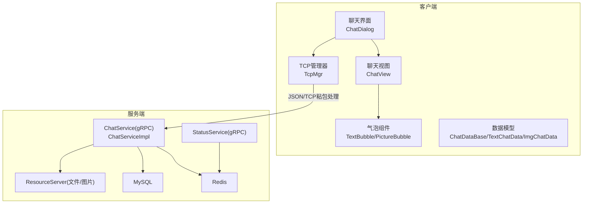
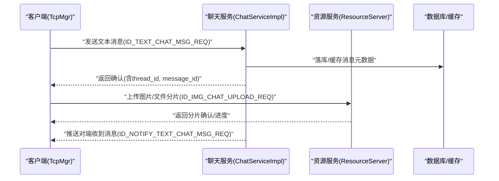
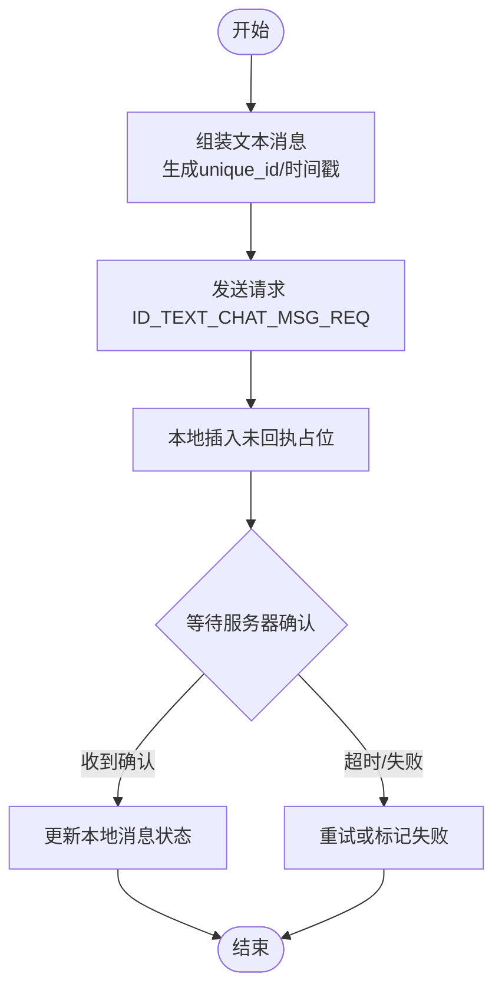
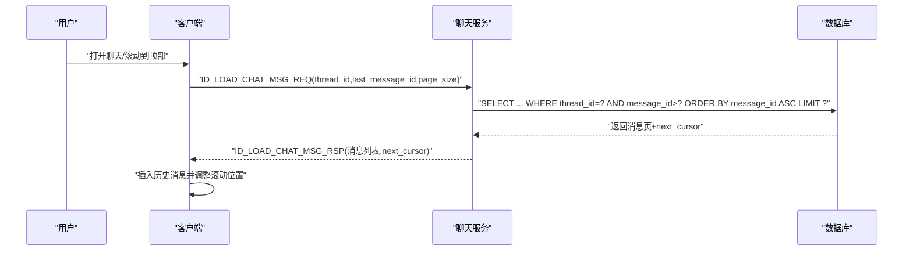
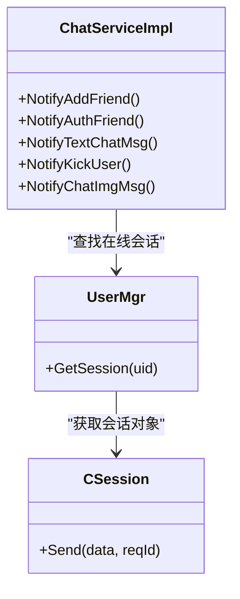
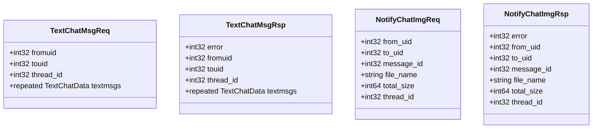
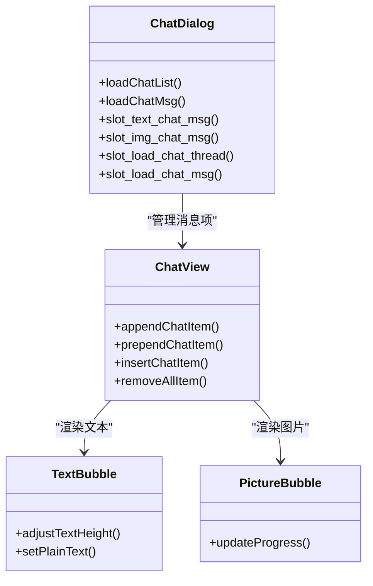
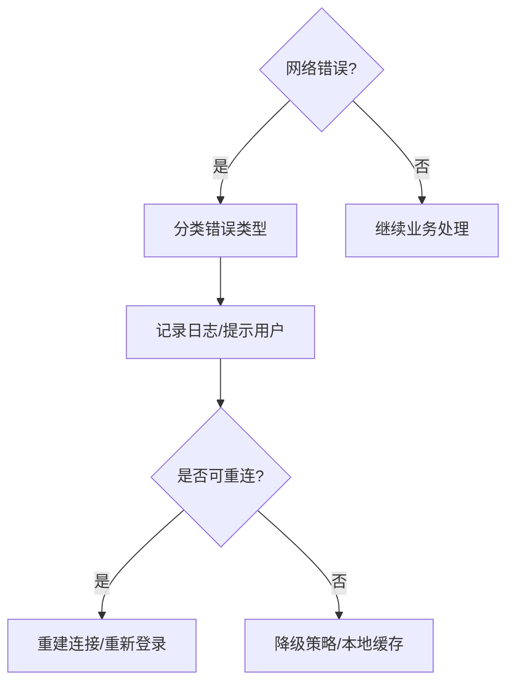
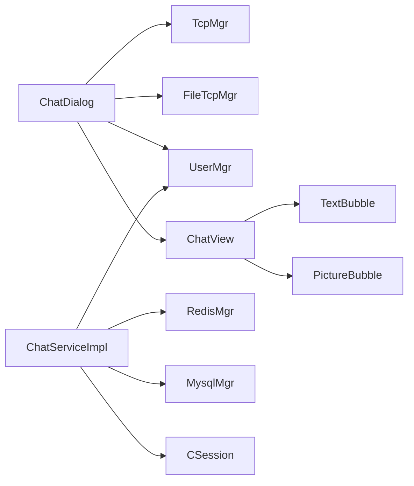

# 实时聊天功能

<cite>
**本文引用的文件**   
- [README.md](file://README.md)
- [message.proto](file://server/proto/chat/message.proto)
- [ChatServiceImpl.h](file://server/ChatServer/include/ChatServiceImpl.h)
- [ChatServiceImpl.cpp](file://server/ChatServer/src/ChatServiceImpl.cpp)
- [chatdialog.h](file://client/llfcchat/include/chatdialog.h)
- [chatdialog.cpp](file://client/llfcchat/src/chatdialog.cpp)
- [tcpmgr.h](file://client/llfcchat/include/tcpmgr.h)
- [tcpmgr.cpp](file://client/llfcchat/src/tcpmgr.cpp)
- [userdata.h](file://client/llfcchat/include/userdata.h)
- [global.h](file://client/llfcchat/include/global.h)
- [chatview.h](file://client/llfcchat/include/chatview.h)
- [textbubble.h](file://client/llfcchat/include/textbubble.h)
- [day37-聊天信息存储方案.md](file://开发文档/day37-聊天信息存储方案.md)
- [day42-用户加载聊天资源.md](file://开发文档/day42-用户加载聊天资源.md)
</cite>

## 目录
1. [引言](#引言)
2. [项目结构](#项目结构)
3. [核心组件](#核心组件)
4. [架构总览](#架构总览)
5. [详细组件分析](#详细组件分析)
6. [依赖关系分析](#依赖关系分析)
7. [性能考量](#性能考量)
8. [故障排查指南](#故障排查指南)
9. [结论](#结论)
10. [附录](#附录)

## 引言
本技术文档围绕LLFCChat项目的“实时聊天”能力，系统性梳理文本消息的发送与接收、消息序列化与网络传输、消息路由与已读状态同步、聊天历史分页与增量加载、多设备登录管理、gRPC协议在消息通道中的应用、客户端对话框渲染（气泡、输入框、表情、文件插入）以及持久化策略、内存管理与异常恢复等高级主题。文档以代码级为依据，结合服务端与客户端实现，提供架构图、时序图与流程图，帮助读者快速理解并扩展该模块。

## 项目结构
- 客户端（Qt/C++）：负责UI交互、消息拼装、TCP长连接收发、本地会话缓存与渲染。
- 服务端（C++/gRPC + Redis/MySQL）：包含ChatServer（聊天服务）、StatusServer（状态服务）、ResourceServer（资源服务）、GateServer（网关）、VarifyServer（验证码）。
- 协议定义：proto目录下的message.proto定义了聊天相关RPC接口与消息体。

**图示来源** 
- [chatdialog.h:1-98](file://client/llfcchat/include/chatdialog.h#L1-L98)
- [chatdialog.cpp:1-200](file://client/llfcchat/src/chatdialog.cpp#L1-L200)
- [tcpmgr.h:1-90](file://client/llfcchat/include/tcpmgr.h#L1-L90)
- [tcpmgr.cpp:1-200](file://client/llfcchat/src/tcpmgr.cpp#L1-L200)
- [ChatServiceImpl.h:1-55](file://server/ChatServer/include/ChatServiceImpl.h#L1-L55)
- [ChatServiceImpl.cpp:1-200](file://server/ChatServer/src/ChatServiceImpl.cpp#L1-L200)
- [message.proto:1-167](file://server/proto/chat/message.proto#L1-L167)

**章节来源**
- [README.md:1-112](file://README.md#L1-L112)

## 核心组件
- 聊天对话框（ChatDialog）：承载聊天列表、搜索、联系人、设置等页面切换；订阅TCP信号，更新消息列表与头像、进度条等。
- 聊天视图（ChatView）：封装滚动区域与消息项插入（头插、尾插、中间插），优化滚动体验。
- 气泡组件（TextBubble/PictureBubble）：渲染文本与图片消息，支持自适应高度与样式。
- TCP管理器（TcpMgr）：维护QTcpSocket、粘包/拆包、发送队列、错误处理、消息分发到业务槽函数。
- 数据模型（ChatDataBase及其派生类）：统一抽象消息基类，区分文本、图片、视频、文件类型，携带唯一ID、会话ID、时间戳、状态等。
- gRPC协议（message.proto）：定义聊天、好友、状态、图片通知等RPC接口与消息体。

**章节来源**
- [chatdialog.h:1-98](file://client/llfcchat/include/chatdialog.h#L1-L98)
- [chatdialog.cpp:1-200](file://client/llfcchat/src/chatdialog.cpp#L1-L200)
- [chatview.h:1-33](file://client/llfcchat/include/chatview.h#L1-L33)
- [textbubble.h:1-24](file://client/llfcchat/include/textbubble.h#L1-L24)
- [tcpmgr.h:1-90](file://client/llfcchat/include/tcpmgr.h#L1-L90)
- [tcpmgr.cpp:1-200](file://client/llfcchat/src/tcpmgr.cpp#L1-L200)
- [userdata.h:1-288](file://client/llfcchat/include/userdata.h#L1-L288)
- [message.proto:1-167](file://server/proto/chat/message.proto#L1-L167)

## 架构总览
聊天系统采用“客户端-聊天服务-资源服务-数据库/缓存”的分层架构。客户端通过TCP与聊天服务通信，使用JSON进行消息编解码；聊天服务基于gRPC对外暴露接口，内部转发至对应会话的在线客户端；图片等资源走独立资源服务，支持断点续传与分片上传。

**图示来源** 
- [tcpmgr.cpp:1-200](file://client/llfcchat/src/tcpmgr.cpp#L1-L200)
- [ChatServiceImpl.cpp:1-200](file://server/ChatServer/src/ChatServiceImpl.cpp#L1-L200)
- [message.proto:1-167](file://server/proto/chat/message.proto#L1-L167)

## 详细组件分析

### 文本消息发送与接收机制
- 发送流程
  - 用户在输入框编辑消息，按长度阈值聚合多条文本，生成unique_id与时间戳，构造JSON载荷。
  - 通过TcpMgr发送ID_TEXT_CHAT_MSG_REQ请求，同时本地插入未回执消息占位，等待服务器确认。
  - 服务器校验后落库并推送到对端，客户端收到ID_NOTIFY_TEXT_CHAT_MSG_REQ后更新UI与状态。
- 接收流程
  - TcpMgr解析粘包后的JSON，根据ReqId分发到对应槽函数，更新会话数据与UI。
- 已读状态同步
  - 消息状态字段status用于标记未读/已读/发送失败/未上传完成等，服务端或客户端在适当时机更新。

**图示来源** 
- [chatdialog.cpp:1-200](file://client/llfcchat/src/chatdialog.cpp#L1-L200)
- [tcpmgr.cpp:1-200](file://client/llfcchat/src/tcpmgr.cpp#L1-L200)
- [global.h:1-296](file://client/llfcchat/include/global.h#L1-L296)

**章节来源**
- [chatdialog.cpp:1-200](file://client/llfcchat/src/chatdialog.cpp#L1-L200)
- [tcpmgr.cpp:1-200](file://client/llfcchat/src/tcpmgr.cpp#L1-L200)
- [global.h:1-296](file://client/llfcchat/include/global.h#L1-L296)

### 聊天历史加载（分页与增量）
- 分页查询
  - 客户端发起ID_LOAD_CHAT_THREAD_REQ获取会话列表，随后按thread_id与last_message_id分页拉取消息。
  - 服务端MysqlDao使用LIMIT+游标方式查询，确保稳定分页。
- 增量加载
  - 当用户滚动到顶部时，触发加载更多历史消息；服务端返回next_cursor用于下一次请求。
- 排序与时间戳
  - 消息按message_id升序排列，时间戳chat_time用于展示与排序辅助。

**图示来源** 
- [day37-聊天信息存储方案.md:2714-2778](file://开发文档/day37-聊天信息存储方案.md#L2714-L2778)
- [day42-用户加载聊天资源.md:718-774](file://开发文档/day42-用户加载聊天资源.md#L718-L774)

**章节来源**
- [day37-聊天信息存储方案.md:2486-2778](file://开发文档/day37-聊天信息存储方案.md#L2486-L2778)
- [day42-用户加载聊天资源.md:718-774](file://开发文档/day42-用户加载聊天资源.md#L718-L774)

### 多设备登录管理
- 设备标识
  - 登录成功后获得token与会话信息，客户端保存uid与token用于后续鉴权。
- 消息分发
  - 聊天服务根据目标uid查找在线session，将消息推送到对应客户端。
- 冲突解决
  - 若同一账号在多设备登录，可通过踢人逻辑（NotifyKickUser）强制下线旧设备，保证一致性。
- 在线状态同步
  - 心跳机制维持连接活跃；断开时触发离线通知，客户端清理状态。

**图示来源** 
- [ChatServiceImpl.h:1-55](file://server/ChatServer/include/ChatServiceImpl.h#L1-L55)
- [ChatServiceImpl.cpp:1-200](file://server/ChatServer/src/ChatServiceImpl.cpp#L1-L200)

**章节来源**
- [ChatServiceImpl.cpp:1-200](file://server/ChatServer/src/ChatServiceImpl.cpp#L1-L200)

### gRPC协议在聊天消息中的应用
- 消息类型定义
  - TextChatMsgReq/Rsp：文本聊天请求与响应，包含fromuid、touid、thread_id、textmsgs数组。
  - NotifyChatImgReq/Rsp：图片聊天通知，包含message_id、file_name、total_size、thread_id等。
  - KickUserReq/Rsp：踢人控制接口。
- 错误处理
  - 所有响应包含error字段，便于客户端判断成功与否。
- 性能优化
  - 使用protobuf二进制编码减少体积；服务端批量组织JSON再下发，降低序列化开销。

**图示来源** 
- [message.proto:1-167](file://server/proto/chat/message.proto#L1-L167)

**章节来源**
- [message.proto:1-167](file://server/proto/chat/message.proto#L1-L167)

### 客户端聊天对话框实现
- 消息气泡渲染
  - TextBubble自适应高度，PictureBubble显示图片缩略图与下载进度。
- 输入框处理
  - MessageTextEdit支持多行文本、表情插入、文件拖拽；发送前进行长度校验与聚合。
- 表情与文件插入
  - 表情作为文本片段插入；文件通过资源服务分片上传，进度回调更新UI。
- 滚动与性能
  - ChatView封装QScrollArea，头插/尾插/中间插避免重排；事件过滤器优化交互。

**图示来源** 
- [chatdialog.h:1-98](file://client/llfcchat/include/chatdialog.h#L1-L98)
- [chatdialog.cpp:1-200](file://client/llfcchat/src/chatdialog.cpp#L1-L200)
- [chatview.h:1-33](file://client/llfcchat/include/chatview.h#L1-L33)
- [textbubble.h:1-24](file://client/llfcchat/include/textbubble.h#L1-L24)

**章节来源**
- [chatdialog.h:1-98](file://client/llfcchat/include/chatdialog.h#L1-L98)
- [chatdialog.cpp:1-200](file://client/llfcchat/src/chatdialog.cpp#L1-L200)
- [chatview.h:1-33](file://client/llfcchat/include/chatview.h#L1-L33)
- [textbubble.h:1-24](file://client/llfcchat/include/textbubble.h#L1-L24)

### 消息持久化策略、内存管理与异常恢复
- 持久化
  - 文本消息落库chat_message表，图片/文件通过资源服务存储，客户端缓存缩略图与下载路径。
- 内存管理
  - 会话级ChatThreadData缓存消息Map，未回执消息单独维护，避免重复发送。
- 异常恢复
  - TCP错误分类处理（连接拒绝、远程关闭、主机未找到、超时、网络错误）；发送队列与bytesWritten回调保障可靠发送；心跳保活与断线重连。

**图示来源** 
- [tcpmgr.cpp:1-200](file://client/llfcchat/src/tcpmgr.cpp#L1-L200)
- [global.h:1-296](file://client/llfcchat/include/global.h#L1-L296)

**章节来源**
- [tcpmgr.cpp:1-200](file://client/llfcchat/src/tcpmgr.cpp#L1-L200)
- [global.h:1-296](file://client/llfcchat/include/global.h#L1-L296)

## 依赖关系分析
- 客户端依赖
  - ChatDialog依赖TcpMgr、FileTcpMgr、UserMgr进行网络与数据管理；依赖ChatView与气泡组件进行UI渲染。
- 服务端依赖
  - ChatServiceImpl依赖UserMgr、RedisMgr、MysqlMgr进行会话与数据访问；依赖CSession进行消息推送。
- 外部依赖
  - gRPC用于服务间通信；Redis用于缓存；MySQL用于持久化。

**图示来源** 
- [chatdialog.h:1-98](file://client/llfcchat/include/chatdialog.h#L1-L98)
- [tcpmgr.h:1-90](file://client/llfcchat/include/tcpmgr.h#L1-L90)
- [ChatServiceImpl.h:1-55](file://server/ChatServer/include/ChatServiceImpl.h#L1-L55)

**章节来源**
- [chatdialog.h:1-98](file://client/llfcchat/include/chatdialog.h#L1-L98)
- [tcpmgr.h:1-90](file://client/llfcchat/include/tcpmgr.h#L1-L90)
- [ChatServiceImpl.h:1-55](file://server/ChatServer/include/ChatServiceImpl.h#L1-L55)

## 性能考量
- 网络传输
  - TCP粘包处理与发送队列避免阻塞；心跳保活降低频繁重连开销。
- 序列化
  - JSON用于客户端与服务端通信，gRPC用于服务间调用，平衡可读性与性能。
- UI渲染
  - 滚动区域按需插入消息项，避免全量重绘；图片懒加载与缩略图提升首屏速度。
- 数据库
  - 分页查询使用LIMIT+游标，减少大结果集传输；索引优化thread_id与message_id。

[本节为通用指导，不直接分析具体文件]

## 故障排查指南
- 常见问题
  - 连接失败：检查主机端口、防火墙、Token有效性。
  - 消息丢失：核对unique_id与message_id映射，检查未回执队列。
  - 图片下载失败：确认资源服务地址与分片序列号，检查MD5校验。
- 定位方法
  - 查看TcpMgr错误分类日志；检查ChatServiceImpl推送是否命中在线session；核对数据库落库记录。

**章节来源**
- [tcpmgr.cpp:1-200](file://client/llfcchat/src/tcpmgr.cpp#L1-L200)
- [ChatServiceImpl.cpp:1-200](file://server/ChatServer/src/ChatServiceImpl.cpp#L1-L200)

## 结论
LLFCChat的实时聊天模块通过清晰的职责划分与稳定的网络协议，实现了高可用的文本与多媒体消息通信。客户端注重用户体验与性能优化，服务端强调可扩展性与数据一致性。未来可在消息去重、离线消息补偿、端到端加密等方面进一步增强。

[本节为总结性内容，不直接分析具体文件]

## 附录
- 关键枚举与常量
  - ReqId：定义各类请求ID，如文本聊天、图片聊天、心跳、加载会话等。
  - MsgStatus：消息状态（未读、发送失败、已读、未上传完成）。
  - ChatFormType/ChatMsgType：聊天形式与消息类型。

**章节来源**
- [global.h:1-296](file://client/llfcchat/include/global.h#L1-L296)