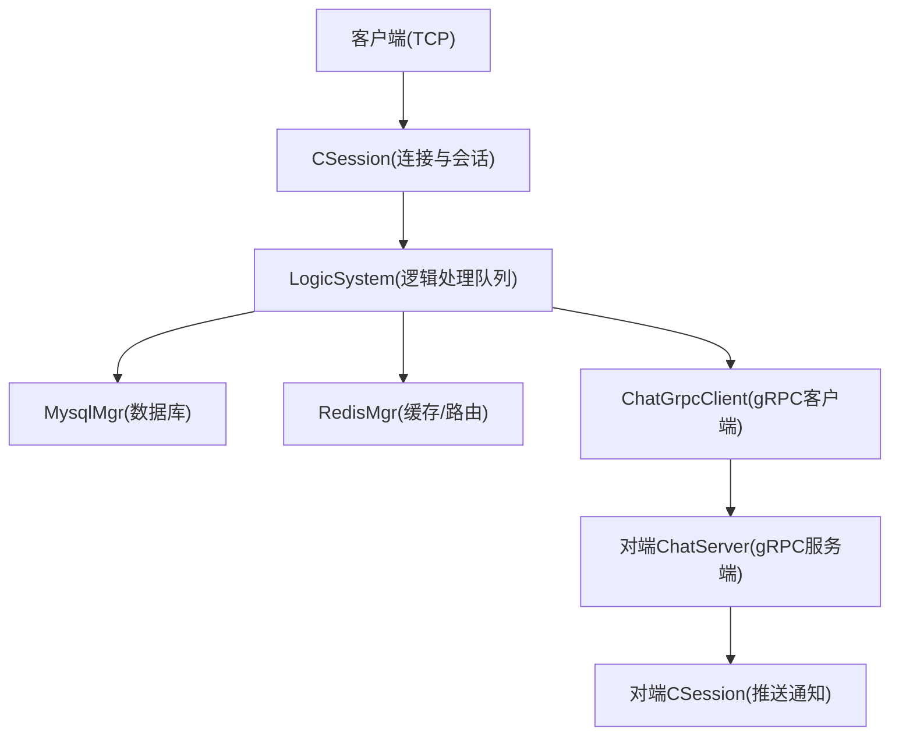
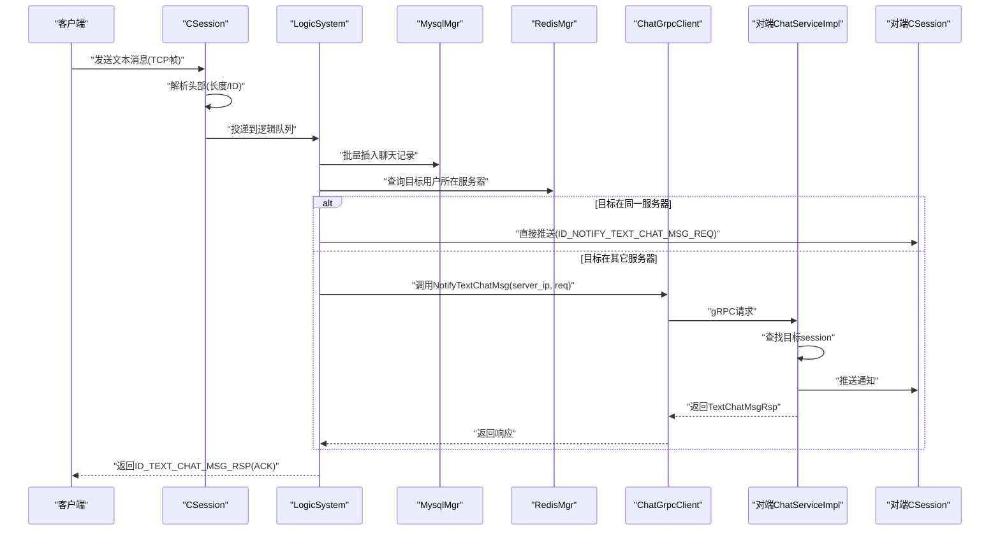
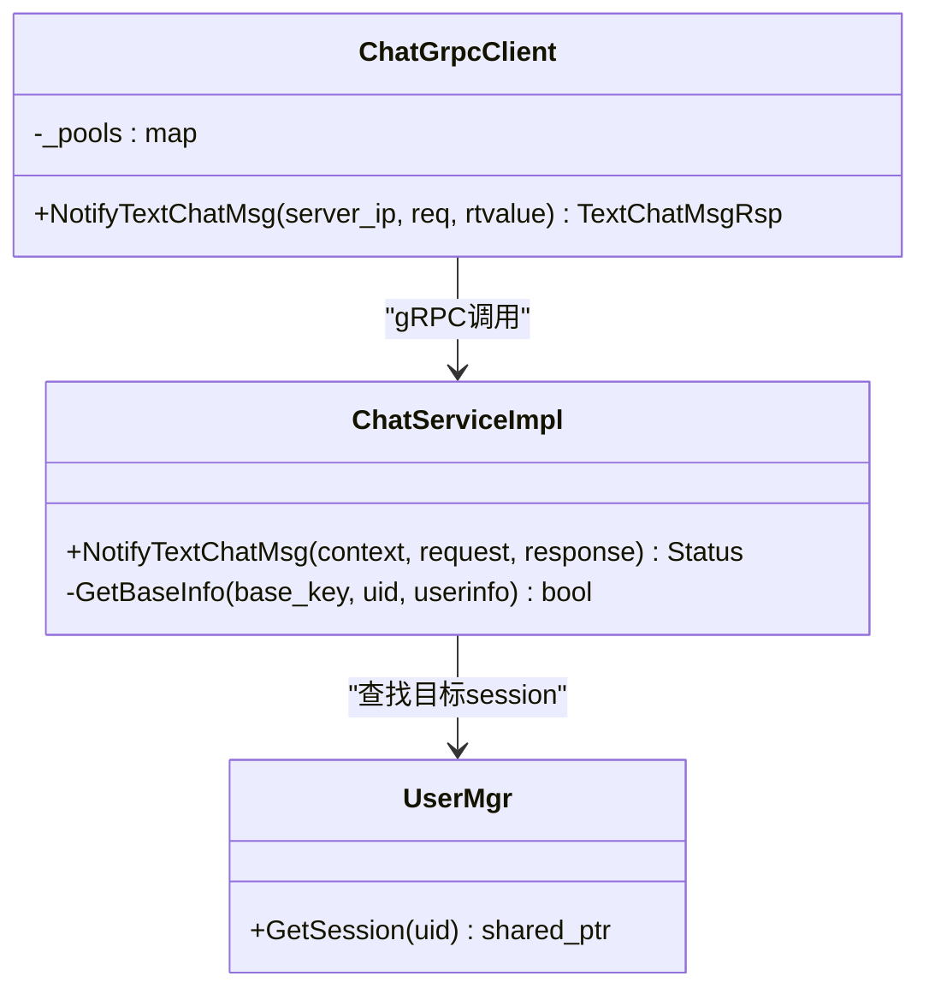
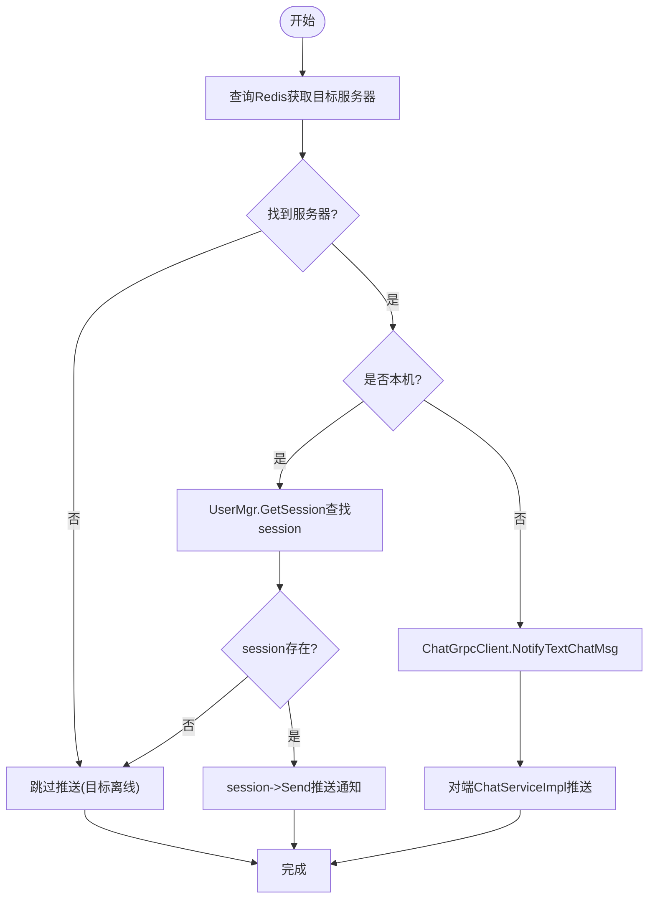
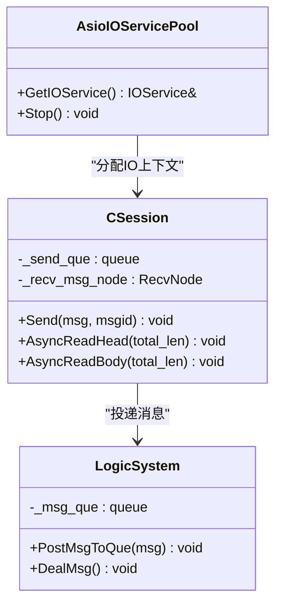
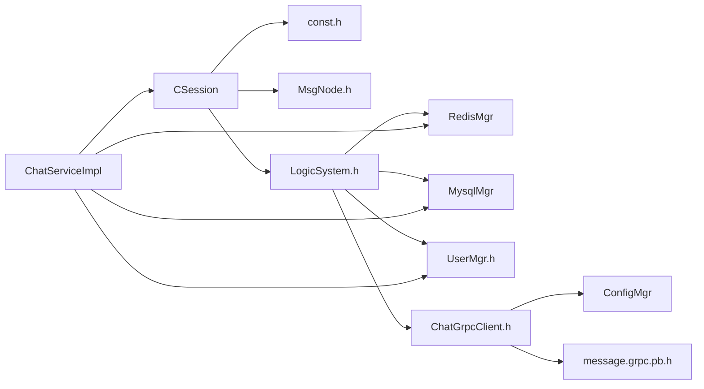

# 消息处理机制

<cite>
**本文引用的文件**   
- [message.proto](file://server/proto/chat/message.proto)
- [ChatServiceImpl.h](file://server/ChatServer/include/ChatServiceImpl.h)
- [ChatServiceImpl.cpp](file://server/ChatServer/src/ChatServiceImpl.cpp)
- [CSession.h](file://server/ChatServer/include/CSession.h)
- [CSession.cpp](file://server/ChatServer/src/CSession.cpp)
- [UserMgr.h](file://server/ChatServer/include/UserMgr.h)
- [LogicSystem.h](file://server/ChatServer/include/LogicSystem.h)
- [LogicSystem.cpp](file://server/ChatServer/src/LogicSystem.cpp)
- [const.h](file://server/ChatServer/include/const.h)
- [data.h](file://server/ChatServer/include/data.h)
- [MsgNode.h](file://server/ChatServer/include/MsgNode.h)
- [AsioIOServicePool.h](file://server/ChatServer/include/AsioIOServicePool.h)
- [ChatGrpcClient.h](file://server/ChatServer/include/ChatGrpcClient.h)
- [ChatGrpcClient.cpp](file://server/ChatServer/src/ChatGrpcClient.cpp)
</cite>

## 目录
1. [简介](#简介)
2. [项目结构](#项目结构)
3. [核心组件](#核心组件)
4. [架构总览](#架构总览)
5. [详细组件分析](#详细组件分析)
6. [依赖关系分析](#依赖关系分析)
7. [性能与并发优化](#性能与并发优化)
8. [故障排查指南](#故障排查指南)
9. [结论](#结论)
10. [附录：调试技巧与示例路径](#附录调试技巧与示例路径)

## 简介
本技术文档聚焦于 LLFCChat 项目的消息处理机制，围绕文本消息的序列化/反序列化、gRPC 服务接口（特别是 NotifyTextChatMsg）调用流程、消息路由算法、ACK 确认与重试策略、以及队列管理与并发控制等主题展开。读者将了解从客户端发送文本消息到对端接收通知的完整链路，包括协议定义、网络帧头设计、数据校验、跨进程/跨节点通信、在线状态检查与转发、以及失败处理与恢复策略。

## 项目结构
本项目采用多服务架构，ChatServer 负责聊天业务逻辑与 TCP/gRPC 接入；通过 Redis 进行用户会话与路由信息缓存；MySQL 用于持久化聊天记录与好友关系；各 ChatServer 实例之间通过 gRPC 通信完成跨节点消息投递。

图表来源 
- [CSession.h:1-86](file://server/ChatServer/include/CSession.h#L1-L86)
- [LogicSystem.h:1-61](file://server/ChatServer/include/LogicSystem.h#L1-L61)
- [ChatGrpcClient.h:1-120](file://server/ChatServer/include/ChatGrpcClient.h#L1-L120)
- [ChatServiceImpl.h:1-55](file://server/ChatServer/include/ChatServiceImpl.h#L1-L55)

章节来源
- [CSession.h:1-86](file://server/ChatServer/include/CSession.h#L1-L86)
- [LogicSystem.h:1-61](file://server/ChatServer/include/LogicSystem.h#L1-L61)
- [ChatGrpcClient.h:1-120](file://server/ChatServer/include/ChatGrpcClient.h#L1-L120)
- [ChatServiceImpl.h:1-55](file://server/ChatServer/include/ChatServiceImpl.h#L1-L55)

## 核心组件
- 协议与消息定义：使用 protobuf 定义跨服务消息体，如 TextChatMsgReq/TextChatMsgRsp、NotifyChatImgReq/NotifyChatImgRsp 等。
- 网络层与帧格式：自定义 TCP 帧头（固定长度），包含消息ID与数据长度，解决粘包/半包问题。
- 会话管理：CSession 维护单个连接的读写、心跳、异常处理与发送队列。
- 逻辑处理：LogicSystem 单线程消费队列，按消息ID分派处理器，完成业务逻辑（登录、搜索、好友、聊天、图片等）。
- 用户会话映射：UserMgr 维护 uid -> session 的内存映射，支持快速查找与踢人。
- gRPC 客户端与服务端：ChatGrpcClient 提供连接池与 RPC 调用封装；ChatServiceImpl 实现 ChatService 的 RPC 方法。
- 存储与缓存：Redis 用于用户登录态、IP->服务器名路由、基础信息缓存；MySQL 用于持久化聊天记录与好友关系。

章节来源
- [message.proto:107-127](file://server/proto/chat/message.proto#L107-L127)
- [const.h:38-79](file://server/ChatServer/include/const.h#L38-L79)
- [CSession.cpp:133-194](file://server/ChatServer/src/CSession.cpp#L133-L194)
- [LogicSystem.cpp:83-114](file://server/ChatServer/src/LogicSystem.cpp#L83-L114)
- [UserMgr.h:1-22](file://server/ChatServer/include/UserMgr.h#L1-L22)
- [ChatGrpcClient.cpp:139-175](file://server/ChatServer/src/ChatGrpcClient.cpp#L139-L175)
- [ChatServiceImpl.cpp:105-139](file://server/ChatServer/src/ChatServiceImpl.cpp#L105-L139)

## 架构总览
下图展示文本消息从客户端到对端的端到端流程，涵盖 TCP 帧解析、逻辑处理、数据库写入、跨节点 gRPC 通知与最终推送。

图表来源 
- [CSession.cpp:133-194](file://server/ChatServer/src/CSession.cpp#L133-L194)
- [LogicSystem.cpp:480-576](file://server/ChatServer/src/LogicSystem.cpp#L480-L576)
- [ChatGrpcClient.cpp:139-175](file://server/ChatServer/src/ChatGrpcClient.cpp#L139-L175)
- [ChatServiceImpl.cpp:105-139](file://server/ChatServer/src/ChatServiceImpl.cpp#L105-L139)

## 详细组件分析

### 文本消息序列化与反序列化
- 协议定义：TextChatMsgReq/TextChatMsgRsp 与 TextChatData 定义了文本消息的结构，包含发送者、接收者、线程ID与消息数组。
- 序列化方向：
  - 客户端 -> 服务器：TCP 帧内 JSON 负载，字段包括 fromuid、touid、thread_id、text_array（数组元素含 content、unique_id）。
  - 服务器 -> 客户端：ID_TEXT_CHAT_MSG_RSP 返回 ACK，包含 error、fromuid、touid、thread_id、chat_datas（含 message_id、unique_id、content、status、chat_time）。
- 反序列化与校验：
  - 使用 Json::Reader 解析 JSON 负载，校验关键字段存在性与类型。
  - 对 unique_id 与 msg_id 进行一致性校验，确保去重与幂等。
  - 对 thread_id 进行合法性校验，保证消息归属正确的聊天线程。

章节来源
- [message.proto:107-127](file://server/proto/chat/message.proto#L107-L127)
- [LogicSystem.cpp:480-518](file://server/ChatServer/src/LogicSystem.cpp#L480-L518)
- [const.h:60-79](file://server/ChatServer/include/const.h#L60-L79)

### 消息头设计与数据校验
- 帧头结构：固定 4 字节，前 2 字节为消息ID（MSG_IDS），后 2 字节为数据长度（network byte order）。
- 解析流程：
  - 先读 HEAD_TOTAL_LEN，解析 msg_id 与 msg_len，并进行范围校验（msg_id <= MAX_LENGTH，msg_len <= MAX_LENGTH）。
  - 根据 msg_len 读取完整负载，拷贝到 RecvNode，更新心跳时间，投递到 LogicSystem。
- 错误处理：
  - 长度不匹配或非法 ID/长度时关闭连接并清理会话。
  - 异常捕获与日志输出，便于定位问题。

章节来源
- [const.h:38-79](file://server/ChatServer/include/const.h#L38-L79)
- [CSession.cpp:133-194](file://server/ChatServer/src/CSession.cpp#L133-L194)
- [MsgNode.h:1-48](file://server/ChatServer/include/MsgNode.h#L1-L48)

### gRPC 服务接口实现（NotifyTextChatMsg）
- 客户端侧（ChatGrpcClient）：
  - 从配置获取对端 ChatServer 列表，建立连接池。
  - 构造 TextChatMsgReq，调用 stub->NotifyTextChatMsg，设置超时与错误码。
  - 返回 TextChatMsgRsp，包含 error、fromuid、touid、thread_id、textmsgs。
- 服务端侧（ChatServiceImpl）：
  - 根据 touid 查找 UserMgr 中的 session。
  - 若 session 存在，构造 JSON 通知负载，通过 session->Send 推送 ID_NOTIFY_TEXT_CHAT_MSG_REQ。
  - 若不存在，直接返回 OK（避免阻塞发送方）。

图表来源 
- [ChatGrpcClient.cpp:139-175](file://server/ChatServer/src/ChatGrpcClient.cpp#L139-L175)
- [ChatServiceImpl.cpp:105-139](file://server/ChatServer/src/ChatServiceImpl.cpp#L105-L139)
- [UserMgr.h:1-22](file://server/ChatServer/include/UserMgr.h#L1-L22)

章节来源
- [ChatGrpcClient.cpp:139-175](file://server/ChatServer/src/ChatGrpcClient.cpp#L139-L175)
- [ChatServiceImpl.cpp:105-139](file://server/ChatServer/src/ChatServiceImpl.cpp#L105-L139)

### 消息路由算法
- 目标用户查找：
  - 通过 Redis 的 USERIPPREFIX + uid 键获取目标用户所在服务器名称。
  - 若无记录，说明目标离线或未登录，跳过推送。
- 在线状态检查：
  - 本地服务器：UserMgr.GetSession(touid) 是否存在。
  - 远端服务器：通过 gRPC 调用 ChatServiceImpl.NotifyTextChatMsg。
- 转发逻辑：
  - 同服：直接 session->Send 推送通知。
  - 异服：构造 TextChatMsgReq，调用 ChatGrpcClient.NotifyTextChatMsg。

图表来源 
- [LogicSystem.cpp:537-576](file://server/ChatServer/src/LogicSystem.cpp#L537-L576)
- [ChatGrpcClient.cpp:139-175](file://server/ChatServer/src/ChatGrpcClient.cpp#L139-L175)
- [ChatServiceImpl.cpp:105-139](file://server/ChatServer/src/ChatServiceImpl.cpp#L105-L139)

章节来源
- [LogicSystem.cpp:537-576](file://server/ChatServer/src/LogicSystem.cpp#L537-L576)
- [ChatGrpcClient.cpp:139-175](file://server/ChatServer/src/ChatGrpcClient.cpp#L139-L175)
- [ChatServiceImpl.cpp:105-139](file://server/ChatServer/src/ChatServiceImpl.cpp#L105-L139)

### 消息确认机制（ACK、重试、失败处理）
- ACK 响应：
  - 发送方收到 ID_TEXT_CHAT_MSG_RSP 作为 ACK，包含 error 与 chat_datas（含 message_id、unique_id、status、chat_time）。
- 重试策略：
  - 当前实现未内置自动重试；可在上层应用层基于 unique_id 与 status 判断是否需要重发。
  - gRPC 调用失败时返回 ErrorCodes::RPCFailed，可结合业务策略进行有限次重试。
- 失败处理：
  - 目标离线：跳过推送，发送方仍会收到 ACK（表示已落库成功）。
  - 网络异常：gRPC 层返回错误码，上层可记录日志并告警。

章节来源
- [const.h:5-20](file://server/ChatServer/include/const.h#L5-L20)
- [ChatGrpcClient.cpp:139-175](file://server/ChatServer/src/ChatGrpcClient.cpp#L139-L175)
- [LogicSystem.cpp:518-576](file://server/ChatServer/src/LogicSystem.cpp#L518-L576)

### 消息队列管理与并发控制
- 接收队列：
  - CSession 内部 _send_que 限制最大长度（MAX_SENDQUE），防止内存溢出。
  - 异步写回，完成后弹出并继续下一个。
- 逻辑队列：
  - LogicSystem 单线程消费 _msg_que，避免竞争与乱序。
  - 条件变量唤醒，减少忙轮询。
- 并发模型：
  - AsioIOServicePool 提供多 io_context 并行处理 IO。
  - 每个 CSession 独立 socket 与队列，互不影响。

图表来源 
- [CSession.cpp:46-78](file://server/ChatServer/src/CSession.cpp#L46-L78)
- [LogicSystem.cpp:27-81](file://server/ChatServer/src/LogicSystem.cpp#L27-L81)
- [AsioIOServicePool.h:1-28](file://server/ChatServer/include/AsioIOServicePool.h#L1-L28)

章节来源
- [CSession.cpp:46-78](file://server/ChatServer/src/CSession.cpp#L46-L78)
- [LogicSystem.cpp:27-81](file://server/ChatServer/src/LogicSystem.cpp#L27-L81)
- [AsioIOServicePool.h:1-28](file://server/ChatServer/include/AsioIOServicePool.h#L1-L28)

## 依赖关系分析
- 模块耦合：
  - CSession 依赖 const.h（常量）、MsgNode.h（消息节点）、LogicSystem.h（逻辑队列）。
  - LogicSystem 依赖 RedisMgr、MysqlMgr、UserMgr、ChatGrpcClient。
  - ChatGrpcClient 依赖 ConfigMgr、message.grpc.pb.h。
  - ChatServiceImpl 依赖 UserMgr、CSession、RedisMgr、MysqlMgr。
- 外部依赖：
  - gRPC（protobuf 生成代码）
  - Boost.Asio/Beast（网络IO）
  - Redis（缓存与路由）
  - MySQL（持久化）

图表来源 
- [CSession.h:1-86](file://server/ChatServer/include/CSession.h#L1-L86)
- [LogicSystem.h:1-61](file://server/ChatServer/include/LogicSystem.h#L1-L61)
- [ChatGrpcClient.h:1-120](file://server/ChatServer/include/ChatGrpcClient.h#L1-L120)
- [ChatServiceImpl.h:1-55](file://server/ChatServer/include/ChatServiceImpl.h#L1-L55)

章节来源
- [CSession.h:1-86](file://server/ChatServer/include/CSession.h#L1-L86)
- [LogicSystem.h:1-61](file://server/ChatServer/include/LogicSystem.h#L1-L61)
- [ChatGrpcClient.h:1-120](file://server/ChatServer/include/ChatGrpcClient.h#L1-L120)
- [ChatServiceImpl.h:1-55](file://server/ChatServer/include/ChatServiceImpl.h#L1-L55)

## 性能与并发优化
- 网络层优化：
  - 使用 boost::asio 异步 IO，减少阻塞。
  - 固定长度帧头，避免粘包/半包解析开销。
- 内存优化：
  - 发送队列限流（MAX_SENDQUE），防止内存暴涨。
  - RecvNode/MsgNode 复用缓冲区，减少频繁分配。
- 并发模型：
  - AsioIOServicePool 多 io_context 并行处理 IO。
  - LogicSystem 单线程消费，避免锁竞争与顺序问题。
- 缓存策略：
  - Redis 缓存用户基础信息与路由表，降低数据库压力。
  - 登录态与 IP->服务器映射加速路由决策。

[本节为通用指导，无需特定文件引用]

## 故障排查指南
- 常见问题定位：
  - 帧解析失败：检查 HEAD_TOTAL_LEN 与 msg_len 校验逻辑。
  - 目标离线：检查 Redis 中 USERIPPREFIX + uid 是否存在。
  - gRPC 调用失败：查看 ErrorCodes::RPCFailed 与日志。
  - 发送队列满：监控 MAX_SENDQUE 阈值与网络延迟。
- 调试技巧：
  - 启用详细日志（CSession::AsyncReadHead/AsyncReadBody、LogicSystem::DealMsg）。
  - 使用 Redis CLI 检查路由键与登录态。
  - 使用 gRPC 工具（grpcurl）模拟调用 ChatService 接口。

章节来源
- [CSession.cpp:133-194](file://server/ChatServer/src/CSession.cpp#L133-L194)
- [LogicSystem.cpp:43-81](file://server/ChatServer/src/LogicSystem.cpp#L43-L81)
- [ChatGrpcClient.cpp:139-175](file://server/ChatServer/src/ChatGrpcClient.cpp#L139-L175)

## 结论
LLFCChat 的消息处理机制以自定义 TCP 帧头与 JSON 负载为基础，结合 gRPC 实现跨节点可靠通信。通过 Redis 路由与 UserMgr 会话映射，系统实现了高效的消息分发与在线状态检查。ACK 机制确保发送方感知结果，而失败处理与重试策略可在上层扩展。整体架构清晰、模块化良好，具备高可扩展性与易维护性。

[本节为总结，无需特定文件引用]

## 附录：调试技巧与示例路径
- 关键代码路径参考：
  - 文本消息处理：[LogicSystem.cpp:480-576](file://server/ChatServer/src/LogicSystem.cpp#L480-L576)
  - gRPC 客户端调用：[ChatGrpcClient.cpp:139-175](file://server/ChatServer/src/ChatGrpcClient.cpp#L139-L175)
  - gRPC 服务端实现：[ChatServiceImpl.cpp:105-139](file://server/ChatServer/src/ChatServiceImpl.cpp#L105-L139)
  - 帧头解析与校验：[CSession.cpp:133-194](file://server/ChatServer/src/CSession.cpp#L133-L194)
  - 消息常量定义：[const.h:5-79](file://server/ChatServer/include/const.h#L5-L79)
  - 数据结构定义：[data.h:1-65](file://server/ChatServer/include/data.h#L1-L65)
  - 消息节点结构：[MsgNode.h:1-48](file://server/ChatServer/include/MsgNode.h#L1-L48)
  - 协议定义：[message.proto:107-127](file://server/proto/chat/message.proto#L107-L127)

章节来源
- [LogicSystem.cpp:480-576](file://server/ChatServer/src/LogicSystem.cpp#L480-L576)
- [ChatGrpcClient.cpp:139-175](file://server/ChatServer/src/ChatGrpcClient.cpp#L139-L175)
- [ChatServiceImpl.cpp:105-139](file://server/ChatServer/src/ChatServiceImpl.cpp#L105-L139)
- [CSession.cpp:133-194](file://server/ChatServer/src/CSession.cpp#L133-L194)
- [const.h:5-79](file://server/ChatServer/include/const.h#L5-L79)
- [data.h:1-65](file://server/ChatServer/include/data.h#L1-L65)
- [MsgNode.h:1-48](file://server/ChatServer/include/MsgNode.h#L1-L48)
- [message.proto:107-127](file://server/proto/chat/message.proto#L107-L127)