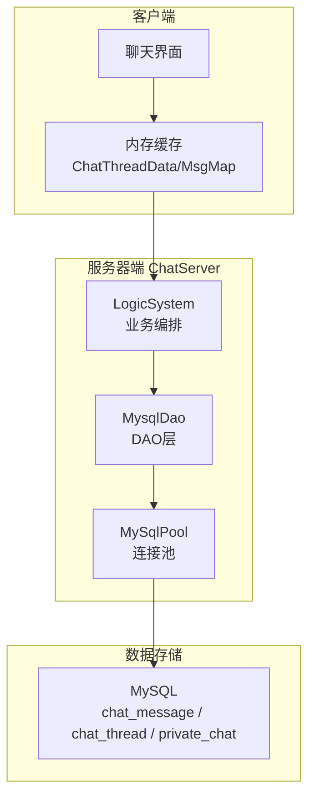
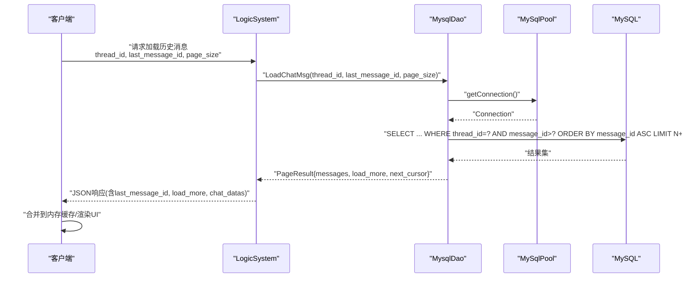
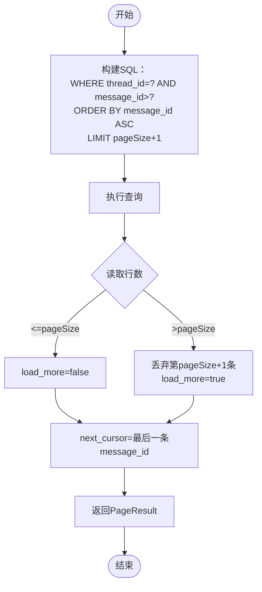
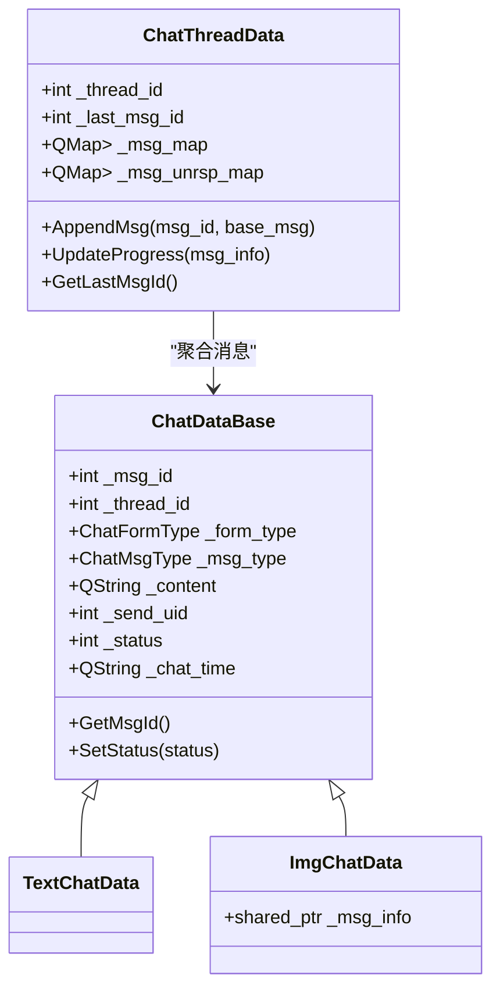
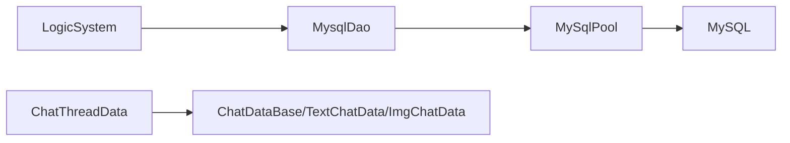

# 聊天历史管理

<cite>
**本文引用的文件**   
- [chat_message.sql](file://sql备份/chat_message.sql)
- [llfc.sql](file://sql备份/llfc.sql)
- [MysqlDao.h](file://server/ChatServer/include/MysqlDao.h)
- [MysqlDao.cpp](file://server/ChatServer/src/MysqlDao.cpp)
- [data.h](file://server/ChatServer/include/data.h)
- [LogicSystem.cpp](file://server/ChatServer/src/LogicSystem.cpp)
- [userdata.h](file://client/llfcchat/include/userdata.h)
- [userdata.cpp](file://client/llfcchat/src/userdata.cpp)
- [usermgr.cpp](file://client/llfcchat/src/usermgr.cpp)
- [day37-聊天信息存储方案.md](file://开发文档/day37-聊天信息存储方案.md)
</cite>

## 目录
1. [简介](#简介)
2. [项目结构](#项目结构)
3. [核心组件](#核心组件)
4. [架构总览](#架构总览)
5. [详细组件分析](#详细组件分析)
6. [依赖关系分析](#依赖关系分析)
7. [性能与优化](#性能与优化)
8. [故障排查指南](#故障排查指南)
9. [结论](#结论)
10. [附录](#附录)

## 简介
本技术文档聚焦于 LLFCChat 项目的“聊天历史管理”能力，围绕消息持久化、分页加载、排序规则、客户端缓存与同步、查询接口设计以及大数据量下的优化策略进行系统化说明。内容覆盖 MySQL 表结构与索引、服务端 DAO 层实现、逻辑层处理流程、客户端内存数据结构与增量同步机制，并给出可落地的优化建议与排障要点。

## 项目结构
与聊天历史相关的关键代码分布在以下位置：
- 数据库脚本：sql备份/chat_message.sql、sql备份/llfc.sql
- 服务器端（ChatServer）：
  - MysqlDao.h/.cpp：MySQL 连接池、会话与消息的增删改查、分页加载
  - data.h：消息、线程、分页结果等数据模型
  - LogicSystem.cpp：业务逻辑编排，组装返回给客户端的分页响应
- 客户端（Qt/C++）：
  - userdata.h/.cpp：消息类型、线程数据、消息映射与进度更新
  - usermgr.cpp：好友列表与聊天加载计数控制

图表来源
- [MysqlDao.h:25-232](file://server/ChatServer/include/MysqlDao.h#L25-L232)
- [MysqlDao.cpp:871-936](file://server/ChatServer/src/MysqlDao.cpp#L871-L936)
- [LogicSystem.cpp:895-917](file://server/ChatServer/src/LogicSystem.cpp#L895-L917)
- [userdata.h:247-284](file://client/llfcchat/include/userdata.h#L247-L284)

章节来源
- [MysqlDao.h:25-232](file://server/ChatServer/include/MysqlDao.h#L25-L232)
- [MysqlDao.cpp:871-936](file://server/ChatServer/src/MysqlDao.cpp#L871-L936)
- [LogicSystem.cpp:895-917](file://server/ChatServer/src/LogicSystem.cpp#L895-L917)
- [userdata.h:247-284](file://client/llfcchat/include/userdata.h#L247-L284)

## 核心组件
- 数据模型
  - ChatMessage：消息实体（message_id、thread_id、sender_id、recv_id、content、chat_time、status、msg_type）
  - PageResult：分页结果（messages、load_more、next_cursor）
  - ChatThreadInfo：会话信息（thread_id、type、user1_id、user2_id）
- 访问层
  - MySqlPool：连接池、健康检查、自动重连
  - MysqlDao：会话与消息的 CRUD、分页加载、事务写入
- 业务层
  - LogicSystem：拼装请求参数、调用 DAO、构造 JSON 响应
- 客户端缓存
  - ChatThreadData：按 thread_id 聚合消息、维护最后一条消息 ID、未回复消息集合
  - TextChatData/ImgChatData：具体消息类型的封装

章节来源
- [data.h:32-65](file://server/ChatServer/include/data.h#L32-L65)
- [MysqlDao.h:236-270](file://server/ChatServer/include/MysqlDao.h#L236-L270)
- [userdata.h:186-284](file://client/llfcchat/include/userdata.h#L186-L284)

## 架构总览
聊天历史的核心流程：
- 客户端登录或进入会话后，向服务器发起“加载历史消息”请求，携带 thread_id 和 last_message_id（游标）。
- 服务器 LogicSystem 解析请求，调用 MysqlDao.LoadChatMsg 执行分页 SQL。
- MysqlDao 通过 MySqlPool 获取连接，执行基于 message_id 的游标分页查询，返回 PageResult。
- 客户端将消息插入本地内存缓存（按 msg_id 去重），渲染到界面，并记录 next_cursor 用于后续增量拉取。

图表来源
- [LogicSystem.cpp:895-917](file://server/ChatServer/src/LogicSystem.cpp#L895-L917)
- [MysqlDao.cpp:871-936](file://server/ChatServer/src/MysqlDao.cpp#L871-L936)
- [MysqlDao.h:25-232](file://server/ChatServer/include/MysqlDao.h#L25-L232)

## 详细组件分析

### 数据库设计与索引优化
- 表结构
  - chat_message：消息主表，包含 message_id、thread_id、sender_id、recv_id、content、created_at、updated_at、status、msg_type
  - chat_thread：会话主表，区分 private/group
  - private_chat：私聊参与者映射，支持唯一约束与用户维度的复合索引
- 索引策略
  - 主键：message_id 自增主键，快速定位单条消息
  - 会话+时间：idx_thread_created(thread_id, created_at)，支持按时间范围与时间序分页
  - 会话+ID：idx_thread_message(thread_id, message_id)，支撑游标分页（WHERE thread_id=? AND message_id > ?）
- 扩展字段
  - msg_type：文本/图片/视频/文件，便于前端差异化渲染与后端分类统计

章节来源
- [chat_message.sql:24-36](file://sql备份/chat_message.sql#L24-L36)
- [llfc.sql:24-37](file://sql备份/llfc.sql#L24-L37)
- [llfc.sql:406-418](file://sql备份/llfc.sql#L406-L418)

### 分页加载机制（游标分页 + 增量算法）
- 游标分页
  - 使用 message_id 作为游标，避免 OFFSET 的性能问题
  - 每次多取一条（LIMIT pageSize+1），判断是否还有下一页（load_more）
  - 返回 next_cursor 为本页最后一条 message_id，供下次请求使用
- 增量加载
  - 客户端首次加载时 last_message_id=0，服务器返回从最早开始的消息
  - 后续请求携带上次返回的 next_cursor，仅拉取大于该 ID 的新消息
- 会话列表分页
  - 使用 CTE 合并私聊与群聊成员，ORDER BY thread_id，LIMIT pageSize+1，判断 load_more 并更新 nextLastId

图表来源
- [MysqlDao.cpp:871-936](file://server/ChatServer/src/MysqlDao.cpp#L871-L936)
- [day37-聊天信息存储方案.md:377-431](file://开发文档/day37-聊天信息存储方案.md#L377-L431)

章节来源
- [MysqlDao.cpp:871-936](file://server/ChatServer/src/MysqlDao.cpp#L871-L936)
- [day37-聊天信息存储方案.md:377-431](file://开发文档/day37-聊天信息存储方案.md#L377-L431)

### 消息排序规则
- 时间顺序
  - 默认按 message_id 升序排列，等价于插入顺序（自增主键）
  - 若需严格按时间排序，可使用 created_at；当前实现以 message_id 为主
- 消息类型分组
  - msg_type 字段标识文本/图片/视频/文件，前端据此渲染不同气泡样式
- 已读未读状态标记
  - status：0=未读，1=已读，2=撤回；可在展示时根据 recv_id 与当前用户做过滤与标记

章节来源
- [data.h:40-65](file://server/ChatServer/include/data.h#L40-L65)
- [llfc.sql:24-37](file://sql备份/llfc.sql#L24-L37)

### 客户端缓存策略
- 内存缓存
  - ChatThreadData：按 thread_id 聚合消息，维护 _msg_map（msg_id -> ChatDataBase）、_last_msg_id、未回复消息集合
  - TextChatData/ImgChatData：继承基类 ChatDataBase，统一消息属性（id、thread_id、type、content、send_uid、status、time）
- 数据同步机制
  - 首次加载：服务器返回的历史消息按 msg_id 去重插入内存缓存
  - 增量同步：收到新消息推送后，直接追加到对应 thread 的 _msg_map，并更新最后一条消息 ID
  - 进度更新：对图片等大对象消息，通过 MsgInfo 更新上传/下载进度

图表来源
- [userdata.h:144-284](file://client/llfcchat/include/userdata.h#L144-L284)
- [userdata.cpp:76-142](file://client/llfcchat/src/userdata.cpp#L76-L142)

章节来源
- [userdata.h:144-284](file://client/llfcchat/include/userdata.h#L144-L284)
- [userdata.cpp:76-142](file://client/llfcchat/src/userdata.cpp#L76-L142)

### 历史消息查询接口
- 请求参数
  - thread_id：会话 ID
  - last_message_id：游标（上次最后一条消息 ID）
  - page_size：每页大小
- 处理流程
  - LogicSystem 解析请求，调用 MysqlMgr/MysqlDao 的 LoadChatMsg
  - DAO 层执行游标分页 SQL，返回 PageResult
  - LogicSystem 组装 JSON，包含 last_message_id、load_more、chat_datas
- 异常恢复
  - 连接失败：MySqlPool 健康检查与自动重连
  - SQL 异常：捕获 SQLException 并回滚事务，返回错误码

章节来源
- [LogicSystem.cpp:895-917](file://server/ChatServer/src/LogicSystem.cpp#L895-L917)
- [MysqlDao.cpp:871-936](file://server/ChatServer/src/MysqlDao.cpp#L871-L936)
- [MysqlDao.h:25-232](file://server/ChatServer/include/MysqlDao.h#L25-L232)

### 大数据量优化与存储空间管理
- 查询优化
  - 使用 idx_thread_message 索引加速游标分页
  - 限制单次返回数量（page_size），避免一次性加载过多数据
- 存储优化
  - content 使用 TEXT 类型，适合长文本；大附件应走资源服务（URL/分片）
  - 定期归档/清理历史消息（如冷数据迁移至归档库）
- 清理策略
  - 按时间窗口清理过期消息（如超过 N 天）
  - 针对群聊大群，考虑分表或分区（按 thread_id 或时间）

[本节为通用指导，不直接分析具体文件]

## 依赖关系分析
- 模块耦合
  - LogicSystem 依赖 MysqlDao 提供数据访问能力
  - MysqlDao 依赖 MySqlPool 管理连接生命周期与健康检查
  - 客户端 ChatThreadData 依赖消息类型抽象（ChatDataBase）
- 外部依赖
  - MySQL JDBC 驱动
  - Qt 容器与 JSON 处理
  - Boost.Asio（网络层，非本主题重点）

图表来源
- [MysqlDao.h:25-232](file://server/ChatServer/include/MysqlDao.h#L25-L232)
- [userdata.h:144-284](file://client/llfcchat/include/userdata.h#L144-L284)

章节来源
- [MysqlDao.h:25-232](file://server/ChatServer/include/MysqlDao.h#L25-L232)
- [userdata.h:144-284](file://client/llfcchat/include/userdata.h#L144-L284)

## 性能与优化
- 索引选择
  - 优先使用 (thread_id, message_id) 进行游标分页，避免全表扫描
  - 如需按时间范围筛选，可结合 (thread_id, created_at)
- 分页策略
  - 使用 LIMIT N+1 判断是否有下一页，减少额外 COUNT 查询
  - 合理设置 page_size（如 20~50），平衡首屏加载与滚动体验
- 连接池
  - MySqlPool 周期性健康检查与自动重连，提升稳定性
- 客户端渲染
  - 虚拟列表/懒加载，避免一次性渲染大量气泡
  - 图片等资源延迟加载与缓存

[本节为通用指导，不直接分析具体文件]

## 故障排查指南
- 常见问题
  - 连接超时/断开：检查 MySqlPool 健康检查日志与重连逻辑
  - 分页错乱：确认 last_message_id 是否正确传递与更新
  - 重复消息：客户端插入时使用 msg_id 去重（INSERT OR IGNORE）
- 日志定位
  - DAO 层 SQLException 输出错误码与 SQLState
  - 逻辑层返回错误码（如 LOAD_CHAT_FAILED）
- 恢复策略
  - 重试机制：对瞬时错误（如死锁）进行有限次重试
  - 降级策略：网络不可用时优先展示本地缓存

章节来源
- [MysqlDao.cpp:993-1001](file://server/ChatServer/src/MysqlDao.cpp#L993-L1001)
- [LogicSystem.cpp:895-917](file://server/ChatServer/src/LogicSystem.cpp#L895-L917)

## 结论
LLFCChat 的聊天历史管理采用“游标分页 + 增量同步”的设计，结合合理的 MySQL 索引与连接池管理，实现了高效、稳定的消息加载与展示。客户端通过内存缓存与消息类型抽象，保证了良好的用户体验与可扩展性。未来可进一步引入本地 SQLite 持久化、冷热数据分离与更细粒度的权限控制，以应对更大规模的数据与更复杂的业务场景。

[本节为总结性内容，不直接分析具体文件]

## 附录
- 关键 SQL 片段路径
  - 游标分页查询：[MysqlDao.cpp:887-895](file://server/ChatServer/src/MysqlDao.cpp#L887-L895)
  - 会话列表 CTE 分页：[day37-聊天信息存储方案.md:377-431](file://开发文档/day37-聊天信息存储方案.md#L377-L431)
- 数据模型定义路径
  - ChatMessage/PageResult：[data.h:40-65](file://server/ChatServer/include/data.h#L40-L65)
  - ChatThreadData/消息类型：[userdata.h:144-284](file://client/llfcchat/include/userdata.h#L144-L284)

[本节为参考信息，不直接分析具体文件]