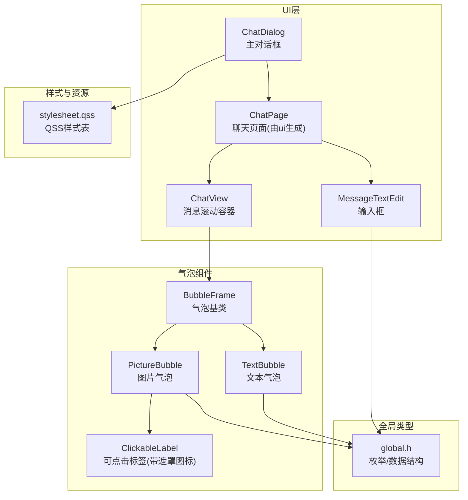
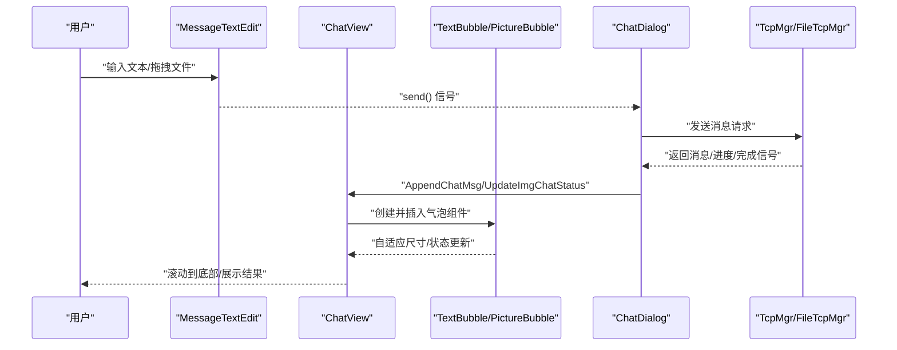
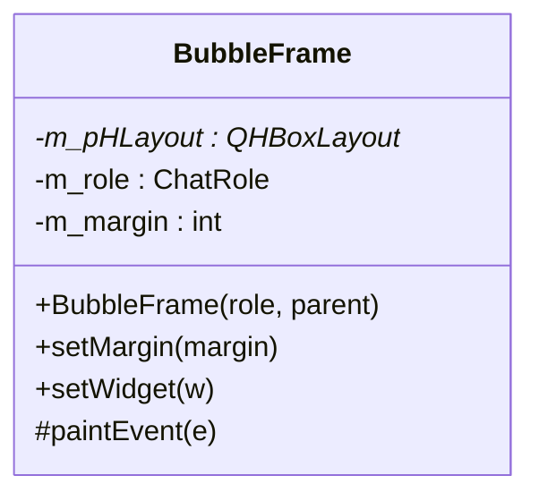
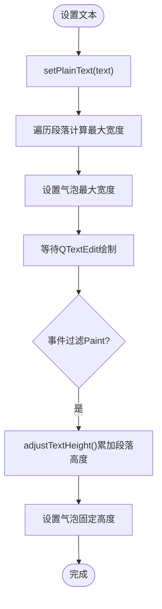
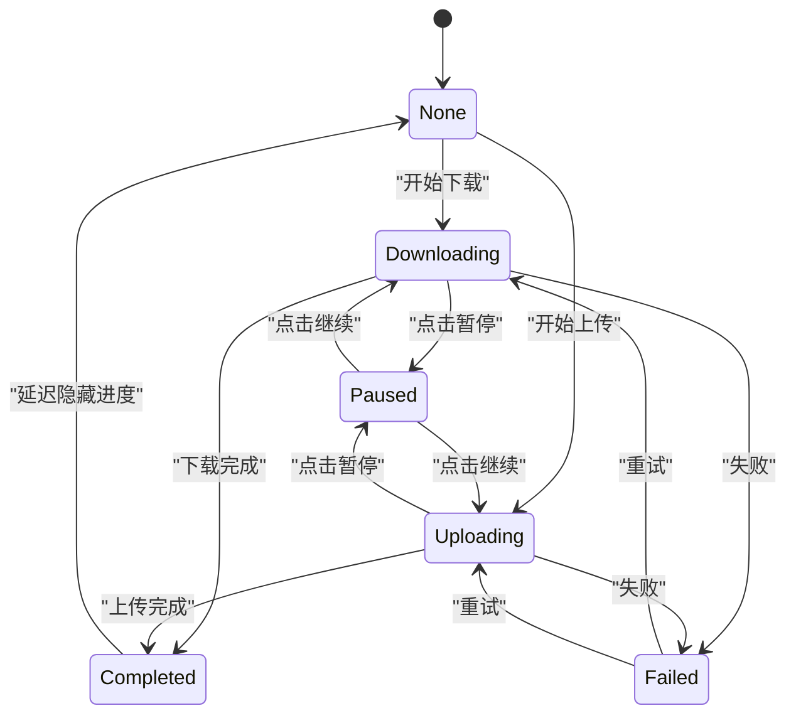
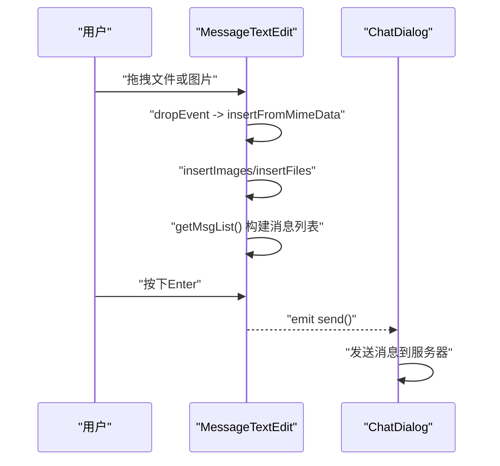
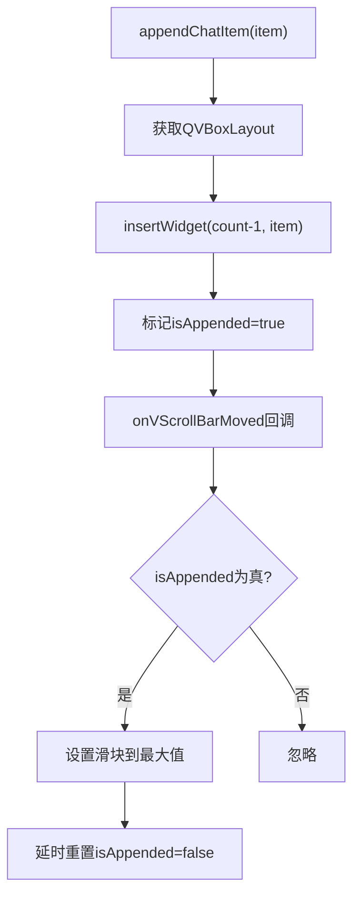
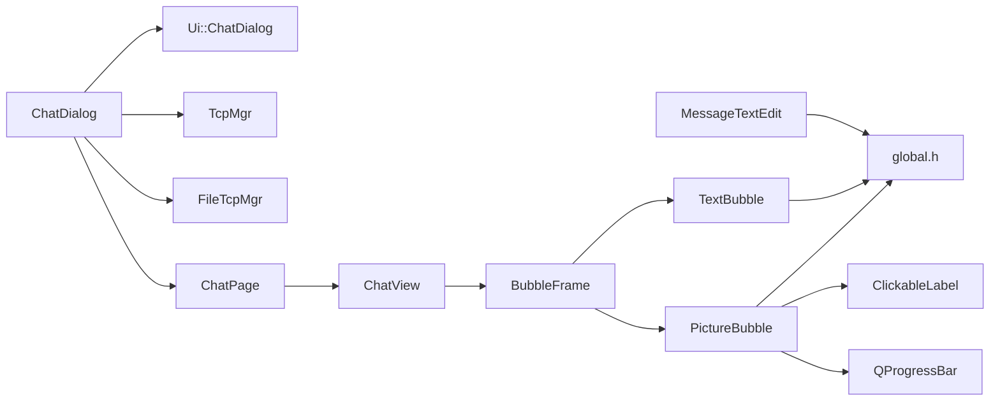

# 聊天界面实现

<cite>
**本文引用的文件**   
- [BubbleFrame.h](file://client/llfcchat/include/BubbleFrame.h)
- [BubbleFrame.cpp](file://client/llfcchat/src/BubbleFrame.cpp)
- [TextBubble.h](file://client/llfcchat/include/TextBubble.h)
- [TextBubble.cpp](file://client/llfcchat/src/TextBubble.cpp)
- [PictureBubble.h](file://client/llfcchat/include/PictureBubble.h)
- [PictureBubble.cpp](file://client/llfcchat/src/PictureBubble.cpp)
- [MessageTextEdit.h](file://client/llfcchat/include/MessageTextEdit.h)
- [MessageTextEdit.cpp](file://client/llfcchat/src/MessageTextEdit.cpp)
- [ChatView.h](file://client/llfcchat/include/ChatView.h)
- [ChatView.cpp](file://client/llfcchat/src/ChatView.cpp)
- [ClickableLabel.h](file://client/llfcchat/include/ClickableLabel.h)
- [global.h](file://client/llfcchat/include/global.h)
- [stylesheet.qss](file://client/llfcchat/resources/style/stylesheet.qss)
- [chatdialog.ui](file://client/llfcchat/ui/chatdialog.ui)
- [chatdialog.cpp](file://client/llfcchat/src/chatdialog.cpp)
</cite>

## 目录
1. [简介](#简介)
2. [项目结构](#项目结构)
3. [核心组件](#核心组件)
4. [架构总览](#架构总览)
5. [详细组件分析](#详细组件分析)
6. [依赖关系分析](#依赖关系分析)
7. [性能考虑](#性能考虑)
8. [故障排查指南](#故障排查指南)
9. [结论](#结论)
10. [附录](#附录)

## 简介
本技术文档聚焦于 LLFCChat 客户端的聊天界面实现，围绕主窗口布局、消息区域管理、输入框集成与自定义聊天气泡组件展开。重点解析 BubbleFrame 基类设计、TextBubble 文本气泡、PictureBubble 图片气泡的实现细节；阐述消息渲染机制（动态布局计算、自适应高度、滚动优化）；说明输入框功能（文本编辑、表情插入、文件拖拽、快捷键支持）；详述 UI 事件处理（鼠标交互、键盘事件、焦点管理）；并给出样式定制、主题切换、国际化扩展建议以及组件复用模式与性能优化技巧。

## 项目结构
聊天界面相关代码主要分布在 include、src、resources/style 与 ui 目录：
- include: 定义气泡组件、消息输入框、聊天视图等头文件
- src: 对应实现文件，包含绘制、事件处理、布局与数据流逻辑
- resources/style: QSS 样式表，统一控制外观与主题
- ui: Qt Designer 生成的界面描述，定义主对话框布局与控件层次

**图示来源** 
- [chatdialog.ui:1-405](file://client/llfcchat/ui/chatdialog.ui#L1-L405)
- [ChatView.h:1-33](file://client/llfcchat/include/ChatView.h#L1-L33)
- [BubbleFrame.h:1-24](file://client/llfcchat/include/BubbleFrame.h#L1-L24)
- [TextBubble.h:1-24](file://client/llfcchat/include/TextBubble.h#L1-L24)
- [PictureBubble.h:1-53](file://client/llfcchat/include/PictureBubble.h#L1-L53)
- [ClickableLabel.h:1-29](file://client/llfcchat/include/ClickableLabel.h#L1-L29)
- [global.h:138-200](file://client/llfcchat/include/global.h#L138-L200)
- [stylesheet.qss:1-815](file://client/llfcchat/resources/style/stylesheet.qss#L1-L815)

**章节来源**
- [chatdialog.ui:1-405](file://client/llfcchat/ui/chatdialog.ui#L1-L405)
- [ChatView.h:1-33](file://client/llfcchat/include/ChatView.h#L1-L33)
- [BubbleFrame.h:1-24](file://client/llfcchat/include/BubbleFrame.h#L1-L24)
- [TextBubble.h:1-24](file://client/llfcchat/include/TextBubble.h#L1-L24)
- [PictureBubble.h:1-53](file://client/llfcchat/include/PictureBubble.h#L1-L53)
- [ClickableLabel.h:1-29](file://client/llfcchat/include/ClickableLabel.h#L1-L29)
- [global.h:138-200](file://client/llfcchat/include/global.h#L138-L200)
- [stylesheet.qss:1-815](file://client/llfcchat/resources/style/stylesheet.qss#L1-L815)

## 核心组件
- ChatView：封装 QScrollArea，提供尾插/头插/中间插入消息项的能力，隐藏默认滚动条并通过右侧独立滚动条进行滚动控制，支持追加后自动滚到底部。
- BubbleFrame：气泡基类，根据 ChatRole（Self/Other）设置左右边距与三角箭头方向，使用 QHBoxLayout 承载子控件，并在 paintEvent 中绘制圆角矩形与三角箭头。
- TextBubble：基于 QTextEdit 的只读文本气泡，通过遍历段落宽度计算最大宽度，依据字体度量与边距计算固定高度，确保气泡自适应内容尺寸。
- PictureBubble：图片气泡，内置 ClickableLabel 显示缩略图与进度条，支持上传/下载状态切换、暂停/继续/重试、完成延迟隐藏进度条，并根据状态更新遮罩图标。
- MessageTextEdit：增强型 QTextEdit，支持拖拽图片/文件、Enter 发送、URL 解析、MD5 计算、预览图生成与消息列表构建。
- ClickableLabel：可点击 QLabel，支持鼠标事件、悬停效果与遮罩图标叠加显示。
- global.h：集中定义 ChatRole、MsgType、TransferType、TransferState、MsgInfo 等关键枚举与数据结构，贯穿消息与传输状态管理。

**章节来源**
- [ChatView.h:1-33](file://client/llfcchat/include/ChatView.h#L1-L33)
- [BubbleFrame.h:1-24](file://client/llfcchat/include/BubbleFrame.h#L1-L24)
- [TextBubble.h:1-24](file://client/llfcchat/include/TextBubble.h#L1-L24)
- [PictureBubble.h:1-53](file://client/llfcchat/include/PictureBubble.h#L1-L53)
- [MessageTextEdit.h:1-62](file://client/llfcchat/include/MessageTextEdit.h#L1-L62)
- [ClickableLabel.h:1-29](file://client/llfcchat/include/ClickableLabel.h#L1-L29)
- [global.h:138-200](file://client/llfcchat/include/global.h#L138-L200)

## 架构总览
聊天界面的整体架构遵循“视图-组件-数据”分层：
- 视图层：ChatDialog 作为主窗口，内部包含侧边栏、用户列表、聊天页（ChatPage）与工具区。
- 组件层：ChatView 负责消息区域的滚动与布局；BubbleFrame 及其派生类 TextBubble、PictureBubble 负责单条消息的气泡渲染；MessageTextEdit 负责输入与多媒体插入。
- 数据层：global.h 中的 MsgInfo、TransferState 等结构与 TcpMgr/FileTcpMgr 的信号槽协同，驱动消息与传输状态的更新。

**图示来源** 
- [MessageTextEdit.cpp:83-91](file://client/llfcchat/src/MessageTextEdit.cpp#L83-L91)
- [chatdialog.cpp:149-194](file://client/llfcchat/src/chatdialog.cpp#L149-L194)
- [ChatView.cpp:46-52](file://client/llfcchat/src/ChatView.cpp#L46-L52)
- [PictureBubble.cpp:122-149](file://client/llfcchat/src/PictureBubble.cpp#L122-L149)

**章节来源**
- [chatdialog.cpp:149-194](file://client/llfcchat/src/chatdialog.cpp#L149-L194)
- [MessageTextEdit.cpp:83-91](file://client/llfcchat/src/MessageTextEdit.cpp#L83-L91)
- [ChatView.cpp:46-52](file://client/llfcchat/src/ChatView.cpp#L46-L52)
- [PictureBubble.cpp:122-149](file://client/llfcchat/src/PictureBubble.cpp#L122-L149)

## 详细组件分析

### BubbleFrame 基类设计
- 职责：统一气泡边框与三角箭头绘制，按角色设置左右边距，承载子控件。
- 关键点：
  - 构造函数根据 ChatRole 设置 QHBoxLayout 的边距，区分左右气泡。
  - setWidget 仅允许添加一次子控件，避免重复布局。
  - paintEvent 中绘制圆角矩形与三角箭头，颜色与位置随角色变化。

**图示来源** 
- [BubbleFrame.h:1-24](file://client/llfcchat/include/BubbleFrame.h#L1-L24)
- [BubbleFrame.cpp:1-73](file://client/llfcchat/src/BubbleFrame.cpp#L1-L73)

**章节来源**
- [BubbleFrame.h:1-24](file://client/llfcchat/include/BubbleFrame.h#L1-L24)
- [BubbleFrame.cpp:1-73](file://client/llfcchat/src/BubbleFrame.cpp#L1-L73)

### TextBubble 文本气泡
- 职责：以只读 QTextEdit 显示文本，自适应宽度与高度。
- 关键点：
  - setPlainText 遍历段落计算最大宽度，设置气泡最大宽度。
  - eventFilter 拦截 Paint 事件，调用 adjustTextHeight 累加每段高度得到固定高度。
  - initStyleSheet 将 QTextEdit 背景透明、无边框，融入气泡背景。

**图示来源** 
- [TextBubble.cpp:37-73](file://client/llfcchat/src/TextBubble.cpp#L37-L73)

**章节来源**
- [TextBubble.h:1-24](file://client/llfcchat/include/TextBubble.h#L1-L24)
- [TextBubble.cpp:1-79](file://client/llfcchat/src/TextBubble.cpp#L1-L79)

### PictureBubble 图片气泡
- 职责：显示图片缩略图与进度条，支持上传/下载状态管理与遮罩图标。
- 关键点：
  - 构造时缩放图片至限定尺寸，初始化进度条与遮罩图标。
  - setState 根据状态显示/隐藏进度条，完成后延迟隐藏。
  - updateIconOverlay 根据状态切换遮罩图标（暂停/播放/下载）。
  - onPictureClicked 触发暂停/继续/重试操作，并发出信号给上层。

**图示来源** 
- [PictureBubble.cpp:122-149](file://client/llfcchat/src/PictureBubble.cpp#L122-L149)
- [PictureBubble.cpp:189-217](file://client/llfcchat/src/PictureBubble.cpp#L189-L217)

**章节来源**
- [PictureBubble.h:1-53](file://client/llfcchat/include/PictureBubble.h#L1-L53)
- [PictureBubble.cpp:1-243](file://client/llfcchat/src/PictureBubble.cpp#L1-L243)

### MessageTextEdit 输入框
- 职责：文本编辑、图片/文件拖拽插入、Enter 发送、消息列表构建。
- 关键点：
  - keyPressEvent 检测 Enter/Return（非 Shift）触发 send() 信号。
  - dragEnterEvent/dropEvent 接受拖拽，insertFromMimeData 解析 URL。
  - insertImages/insertFiles 分别处理图片与文件，生成预览图与 MD5，构建 MsgInfo。
  - getMsgList 扫描富文本中的替换符，提取文本与媒体消息，清空输入框。

**图示来源** 
- [MessageTextEdit.cpp:69-91](file://client/llfcchat/src/MessageTextEdit.cpp#L69-L91)
- [MessageTextEdit.cpp:106-192](file://client/llfcchat/src/MessageTextEdit.cpp#L106-L192)
- [MessageTextEdit.cpp:229-236](file://client/llfcchat/src/MessageTextEdit.cpp#L229-L236)

**章节来源**
- [MessageTextEdit.h:1-62](file://client/llfcchat/include/MessageTextEdit.h#L1-L62)
- [MessageTextEdit.cpp:1-319](file://client/llfcchat/src/MessageTextEdit.cpp#L1-L319)

### ChatView 消息区域管理
- 职责：封装 QScrollArea，提供消息项插入接口与滚动行为控制。
- 关键点：
  - appendChatItem/prependChatItem/insertChatItem 在 QVBoxLayout 中插入消息项。
  - removeAllItem 清理所有子项并释放内存。
  - eventFilter 控制垂直滚动条的显隐，onVScrollBarMoved 在追加后自动滚动到底部。

**图示来源** 
- [ChatView.cpp:46-52](file://client/llfcchat/src/ChatView.cpp#L46-L52)
- [ChatView.cpp:108-120](file://client/llfcchat/src/ChatView.cpp#L108-L120)

**章节来源**
- [ChatView.h:1-33](file://client/llfcchat/include/ChatView.h#L1-L33)
- [ChatView.cpp:1-133](file://client/llfcchat/src/ChatView.cpp#L1-L133)

### ClickableLabel 可点击标签
- 职责：支持点击事件、悬停效果与遮罩图标叠加显示。
- 关键点：
  - mousePressEvent 触发 clicked 信号。
  - enterEvent/leaveEvent 控制悬停状态。
  - paintEvent 绘制遮罩图标，showIconOverlay 控制显示。

**章节来源**
- [ClickableLabel.h:1-29](file://client/llfcchat/include/ClickableLabel.h#L1-L29)

## 依赖关系分析
- ChatDialog 依赖 Ui::ChatDialog（由 chatdialog.ui 生成），并连接 TcpMgr/FileTcpMgr 的信号槽以更新聊天界面。
- ChatView 依赖 QVBoxLayout/QScrollArea，用于消息项的布局与滚动。
- BubbleFrame 依赖 QHBoxLayout 与 QFrame，派生出 TextBubble 与 PictureBubble。
- PictureBubble 依赖 ClickableLabel 与 QProgressBar，用于图片显示与进度反馈。
- MessageTextEdit 依赖 QTextEdit 与系统文件 API，用于拖拽与文件信息处理。
- global.h 被多个组件引用，提供统一的枚举与数据结构。

**图示来源** 
- [chatdialog.cpp:149-194](file://client/llfcchat/src/chatdialog.cpp#L149-L194)
- [ChatView.cpp:1-44](file://client/llfcchat/src/ChatView.cpp#L1-L44)
- [BubbleFrame.cpp:1-17](file://client/llfcchat/src/BubbleFrame.cpp#L1-L17)
- [PictureBubble.cpp:1-64](file://client/llfcchat/src/PictureBubble.cpp#L1-L64)
- [MessageTextEdit.cpp:1-15](file://client/llfcchat/src/MessageTextEdit.cpp#L1-L15)
- [global.h:138-200](file://client/llfcchat/include/global.h#L138-L200)

**章节来源**
- [chatdialog.cpp:149-194](file://client/llfcchat/src/chatdialog.cpp#L149-L194)
- [ChatView.cpp:1-44](file://client/llfcchat/src/ChatView.cpp#L1-L44)
- [BubbleFrame.cpp:1-17](file://client/llfcchat/src/BubbleFrame.cpp#L1-L17)
- [PictureBubble.cpp:1-64](file://client/llfcchat/src/PictureBubble.cpp#L1-L64)
- [MessageTextEdit.cpp:1-15](file://client/llfcchat/src/MessageTextEdit.cpp#L1-L15)
- [global.h:138-200](file://client/llfcchat/include/global.h#L138-L200)

## 性能考虑
- 文本气泡高度计算：通过遍历段落累加高度，避免频繁重排；建议在大量文本场景下缓存测量结果。
- 图片缩放：PictureBubble 构造时对图片进行缩放，减少大图渲染开销；建议使用异步加载与缓存策略。
- 滚动优化：ChatView 在追加消息后延迟滚动，避免多次滚动导致的闪烁；可结合增量布局与虚拟滚动进一步优化。
- 样式应用：QSS 样式集中管理，避免在组件内硬编码样式；主题切换可通过 repolish 函数刷新样式。
- 事件过滤：TextBubble 使用 eventFilter 拦截 Paint 事件，减少不必要的重绘；注意事件处理的时机与频率。

[本节为通用性能建议，不直接分析具体文件]

## 故障排查指南
- 气泡未显示或尺寸异常：检查 BubbleFrame 的 setWidget 是否重复调用；确认 TextBubble 的 adjustTextHeight 是否正确计算高度。
- 图片进度条不更新：确认 PictureBubble 的 setState 与 setProgress 调用顺序；检查 FileTcpMgr 的信号槽连接。
- 输入框无法发送：验证 keyPressEvent 中 Enter/Return 的判断条件；确保 send() 信号已连接到发送逻辑。
- 滚动条不显示或滚动异常：检查 ChatView 的 eventFilter 与 onVScrollBarMoved 逻辑；确认 isAppended 标志位重置。
- 样式不生效：确认 QSS 文件路径与对象名匹配；必要时调用 repolish 刷新样式。

**章节来源**
- [BubbleFrame.cpp:25-32](file://client/llfcchat/src/BubbleFrame.cpp#L25-L32)
- [TextBubble.cpp:58-73](file://client/llfcchat/src/TextBubble.cpp#L58-L73)
- [PictureBubble.cpp:122-149](file://client/llfcchat/src/PictureBubble.cpp#L122-L149)
- [MessageTextEdit.cpp:83-91](file://client/llfcchat/src/MessageTextEdit.cpp#L83-L91)
- [ChatView.cpp:82-97](file://client/llfcchat/src/ChatView.cpp#L82-L97)
- [stylesheet.qss:132-152](file://client/llfcchat/resources/style/stylesheet.qss#L132-L152)

## 结论
LLFCChat 聊天界面采用清晰的组件化架构，BubbleFrame 基类统一了气泡绘制与布局，TextBubble 与 PictureBubble 分别处理文本与图片消息，MessageTextEdit 提供丰富的输入与多媒体支持，ChatView 负责消息区域的滚动与布局。通过 QSS 样式表与全局枚举/数据结构，实现了样式定制、主题切换与状态管理。整体设计具备良好的可扩展性与性能优化空间，适合进一步迭代与功能增强。

[本节为总结性内容，不直接分析具体文件]

## 附录
- 样式定制：通过 stylesheet.qss 统一管理外观，支持不同状态下的图标与颜色切换。
- 主题切换：利用 repolish 函数刷新样式，实现动态主题切换。
- 国际化支持：建议在字符串资源文件中管理多语言文本，通过 Qt 的翻译机制实现。
- 组件复用：BubbleFrame 作为基类，便于扩展新的气泡类型；ClickableLabel 可用于其他需要遮罩图标的场景。

[本节为补充说明，不直接分析具体文件]