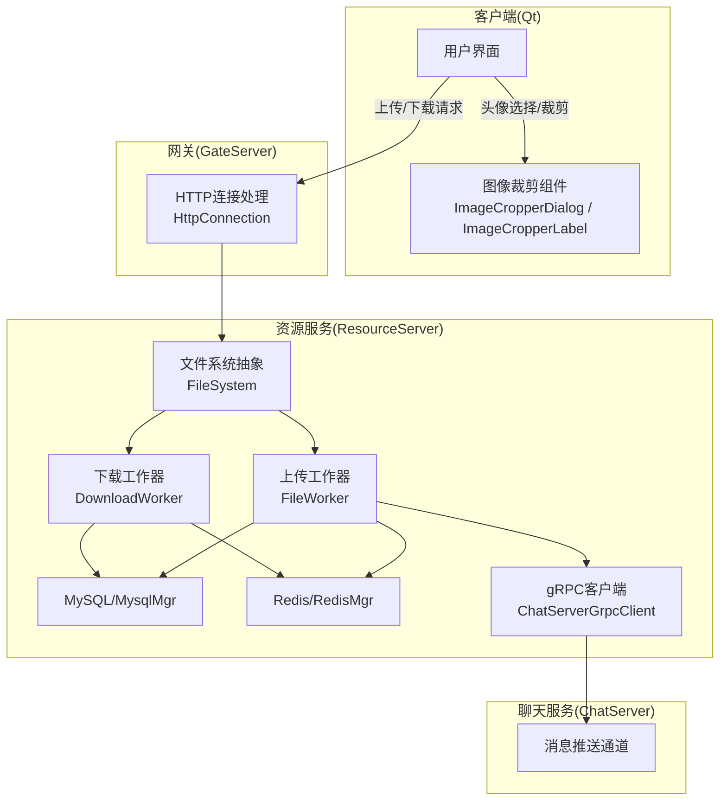
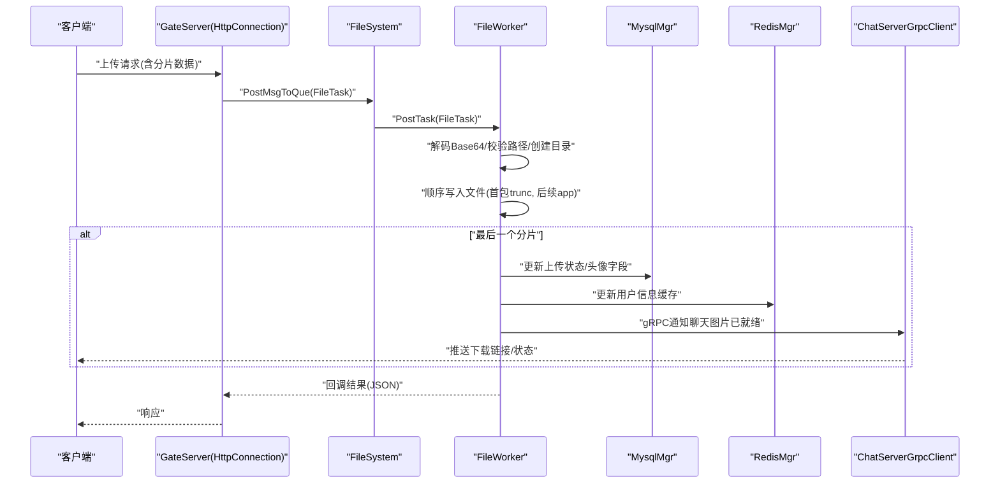
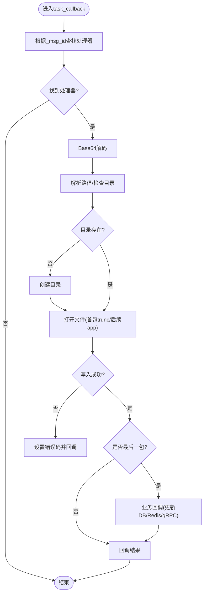
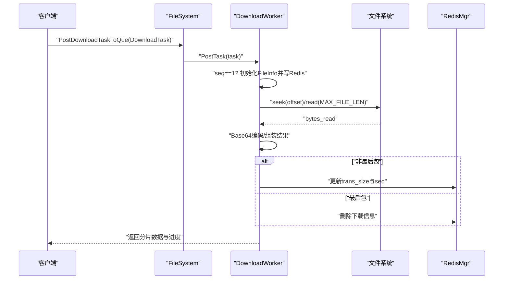
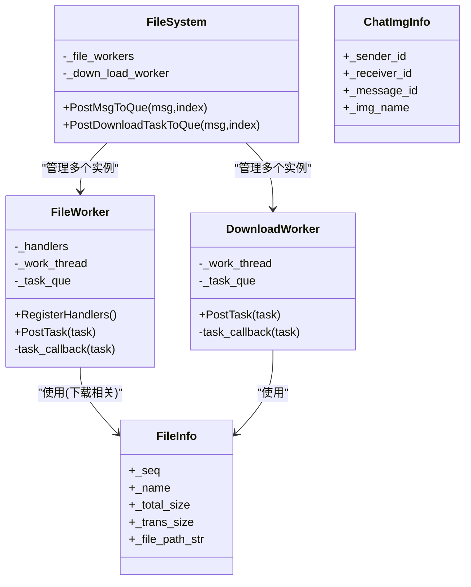

# 上传下载功能

<cite>
**本文引用的文件**   
- [FileWorker.h](file://server/ResourceServer/include/FileWorker.h)
- [FileWorker.cpp](file://server/ResourceServer/src/FileWorker.cpp)
- [FileSystem.h](file://server/ResourceServer/include/FileSystem.h)
- [FileSystem.cpp](file://server/ResourceServer/src/FileSystem.cpp)
- [FileInfo.h](file://server/ResourceServer/include/FileInfo.h)
- [HttpConnection.h](file://server/GateServer/include/HttpConnection.h)
- [imagecropperdialog.h](file://client/llfcchat/include/imagecropperdialog.h)
- [imagecropperlabel.cpp](file://client/llfcchat/src/imagecropperlabel.cpp)
</cite>

## 目录
1. [简介](#简介)
2. [项目结构](#项目结构)
3. [核心组件](#核心组件)
4. [架构总览](#架构总览)
5. [详细组件分析](#详细组件分析)
6. [依赖关系分析](#依赖关系分析)
7. [性能考虑](#性能考虑)
8. [故障排查指南](#故障排查指南)
9. [结论](#结论)
10. [附录：API与使用示例](#附录api与使用示例)

## 简介
本技术文档围绕LLFCChat项目的“文件上传/下载”能力，系统性梳理服务端资源服务（ResourceServer）与客户端（Qt）的协作流程。重点覆盖：
- 通用文件上传：请求处理、权限校验、目录创建、分片写入、状态更新
- 头像上传特殊逻辑：图片裁剪、格式转换、尺寸调整、数据库与缓存同步
- 聊天图片上传异步通知：Redis状态管理、gRPC通知、客户端推送
- 文件下载：读取、分片发送、进度反馈、完成确认与断点续传
- 性能优化：多线程工作队列、缓冲区管理、I/O优化
- 错误处理：权限不足、磁盘空间不足、网络中断等异常
- API接口说明与使用示例

## 项目结构
资源服务侧采用多Worker线程模型，通过文件系统抽象层将任务分发到独立的上传与下载工作器；客户端侧提供图像裁剪工具用于头像编辑。

图表来源
- [FileSystem.h:1-21](file://server/ResourceServer/include/FileSystem.h#L1-L21)
- [FileSystem.cpp:1-29](file://server/ResourceServer/src/FileSystem.cpp#L1-L29)
- [FileWorker.h:1-90](file://server/ResourceServer/include/FileWorker.h#L1-L90)
- [FileWorker.cpp:1-663](file://server/ResourceServer/src/FileWorker.cpp#L1-L663)
- [HttpConnection.h:1-36](file://server/GateServer/include/HttpConnection.h#L1-L36)
- [imagecropperdialog.h:1-100](file://client/llfcchat/include/imagecropperdialog.h#L1-L100)
- [imagecropperlabel.cpp:1-715](file://client/llfcchat/src/imagecropperlabel.cpp#L1-L715)

章节来源
- [FileSystem.h:1-21](file://server/ResourceServer/include/FileSystem.h#L1-L21)
- [FileSystem.cpp:1-29](file://server/ResourceServer/src/FileSystem.cpp#L1-L29)
- [FileWorker.h:1-90](file://server/ResourceServer/include/FileWorker.h#L1-L90)
- [FileWorker.cpp:1-663](file://server/ResourceServer/src/FileWorker.cpp#L1-L663)
- [HttpConnection.h:1-36](file://server/GateServer/include/HttpConnection.h#L1-L36)
- [imagecropperdialog.h:1-100](file://client/llfcchat/include/imagecropperdialog.h#L1-L100)
- [imagecropperlabel.cpp:1-715](file://client/llfcchat/src/imagecropperlabel.cpp#L1-L715)

## 核心组件
- 文件系统抽象层 FileSystem：维护多个上传/下载工作器实例，按索引分发任务，实现负载均衡与隔离。
- 上传工作器 FileWorker：基于单线程+条件变量的任务队列，支持多种上传场景（通用文件、头像、聊天图片、信息同步、断点续传）。
- 下载工作器 DownloadWorker：独立线程处理下载任务，支持分片读取、Base64编码、进度与断点续传状态在Redis中持久化。
- 数据模型 FileInfo/ChatImgInfo：封装下载进度、文件大小、文件名及聊天图片元信息。
- 客户端图像裁剪：ImageCropperDialog/ImageCropperLabel提供矩形/椭圆/圆形等多种裁剪形状，输出目标尺寸与格式。

章节来源
- [FileSystem.h:1-21](file://server/ResourceServer/include/FileSystem.h#L1-L21)
- [FileSystem.cpp:1-29](file://server/ResourceServer/src/FileSystem.cpp#L1-L29)
- [FileWorker.h:1-90](file://server/ResourceServer/include/FileWorker.h#L1-L90)
- [FileWorker.cpp:1-663](file://server/ResourceServer/src/FileWorker.cpp#L1-L663)
- [FileInfo.h:1-26](file://server/ResourceServer/include/FileInfo.h#L1-L26)
- [imagecropperdialog.h:1-100](file://client/llfcchat/include/imagecropperdialog.h#L1-L100)
- [imagecropperlabel.cpp:1-715](file://client/llfcchat/src/imagecropperlabel.cpp#L1-L715)

## 架构总览
资源服务采用“请求入队—工作器处理—回调返回”的异步流水线。上传与下载分别由不同工作器承担，避免IO阻塞影响其他任务。关键交互包括：
- 上传：解码Base64→校验路径→创建目录→顺序写入→最后包触发业务回调（如DB更新、Redis缓存、gRPC通知）
- 下载：首包初始化FileInfo并写Redis→后续包按偏移读取→Base64编码返回→更新进度或清理状态

图表来源
- [FileWorker.cpp:49-112](file://server/ResourceServer/src/FileWorker.cpp#L49-L112)
- [FileWorker.cpp:115-196](file://server/ResourceServer/src/FileWorker.cpp#L115-L196)
- [FileWorker.cpp:199-283](file://server/ResourceServer/src/FileWorker.cpp#L199-L283)
- [FileSystem.cpp:9-17](file://server/ResourceServer/src/FileSystem.cpp#L9-L17)
- [HttpConnection.h:1-36](file://server/GateServer/include/HttpConnection.h#L1-L36)

## 详细组件分析

### 上传工作器 FileWorker
- 任务队列与线程模型：单线程循环从队列取任务，条件变量唤醒，保证串行执行避免同一文件的并发写入冲突。
- 处理器注册：根据消息ID映射到具体处理逻辑（通用上传、头像上传、聊天图片上传、信息同步、续传）。
- 通用上传流程：Base64解码→路径解析→目录存在性检查与创建→首包截断/后续追加→写入失败回退→回调返回。
- 头像上传增强：除写入外，更新用户头像字段至数据库，并将最新用户信息序列化写入Redis缓存，供其他服务快速读取。
- 聊天图片上传异步通知：写入完成后更新数据库上传状态，查询接收者在线IP（Redis），若在线则通过gRPC通知ChatServer进行客户端推送。
- 续传图片上传：与聊天图片类似，但强调断点续传语义，确保序列号一致性与状态一致性。

图表来源
- [FileWorker.cpp:473-481](file://server/ResourceServer/src/FileWorker.cpp#L473-L481)
- [FileWorker.cpp:49-112](file://server/ResourceServer/src/FileWorker.cpp#L49-L112)
- [FileWorker.cpp:115-196](file://server/ResourceServer/src/FileWorker.cpp#L115-L196)
- [FileWorker.cpp:199-283](file://server/ResourceServer/src/FileWorker.cpp#L199-L283)
- [FileWorker.cpp:372-456](file://server/ResourceServer/src/FileWorker.cpp#L372-L456)

章节来源
- [FileWorker.h:1-90](file://server/ResourceServer/include/FileWorker.h#L1-L90)
- [FileWorker.cpp:1-663](file://server/ResourceServer/src/FileWorker.cpp#L1-L663)

### 下载工作器 DownloadWorker
- 首包初始化：读取文件大小，构造FileInfo并写入Redis，设置过期时间，记录seq=1。
- 续传分支：从Redis获取FileInfo，校验seq一致性，计算偏移量offset=(seq-1)*MAX_FILE_LEN。
- 分片读取：定位偏移读取固定长度缓冲，Base64编码后返回data、seq、total_size、current_size、is_last。
- 进度与完成：非最后包更新Redis中的trans_size与seq；最后包删除Redis中的下载信息，表示完成。

图表来源
- [FileWorker.cpp:483-516](file://server/ResourceServer/src/FileWorker.cpp#L483-L516)
- [FileWorker.cpp:518-526](file://server/ResourceServer/src/FileWorker.cpp#L518-L526)
- [FileWorker.cpp:528-662](file://server/ResourceServer/src/FileWorker.cpp#L528-L662)

章节来源
- [FileWorker.h:76-89](file://server/ResourceServer/include/FileWorker.h#L76-L89)
- [FileWorker.cpp:483-662](file://server/ResourceServer/src/FileWorker.cpp#L483-L662)
- [FileInfo.h:1-26](file://server/ResourceServer/include/FileInfo.h#L1-L26)

### 文件系统抽象 FileSystem
- 作用：维护多个FileWorker与DownloadWorker实例，按索引轮询或策略分发任务，提升吞吐与隔离性。
- 接口：PostMsgToQue与PostDownloadTaskToQue分别将上传与下载任务投递到对应工作器队列。

章节来源
- [FileSystem.h:1-21](file://server/ResourceServer/include/FileSystem.h#L1-L21)
- [FileSystem.cpp:1-29](file://server/ResourceServer/src/FileSystem.cpp#L1-L29)

### 客户端图像裁剪（头像上传前置）
- 功能：支持矩形、正方形、椭圆、圆形等裁剪形状，固定尺寸与自由拖拽，输出裁剪后的QPixmap。
- 集成：ImageCropperDialog封装对话框生命周期，调用ImageCropperLabel完成实际裁剪与UI交互。
- 输出：裁剪结果可用于后续压缩/转码/尺寸调整，再作为Base64上传。

章节来源
- [imagecropperdialog.h:1-100](file://client/llfcchat/include/imagecropperdialog.h#L1-L100)
- [imagecropperlabel.cpp:1-715](file://client/llfcchat/src/imagecropperlabel.cpp#L1-L715)

## 依赖关系分析
- 模块耦合：
  - FileSystem仅依赖FileWorker/DownloadWorker接口，低耦合高内聚。
  - FileWorker依赖MysqlMgr、RedisMgr、ChatServerGrpcClient进行状态与通知。
  - DownloadWorker依赖RedisMgr进行进度持久化。
- 外部依赖：
  - Boost.Filesystem用于路径与目录操作。
  - JSON库用于结构化结果传递。
  - Base64编解码用于二进制传输。
- 潜在循环依赖：当前未见循环引用，职责边界清晰。

图表来源
- [FileSystem.h:1-21](file://server/ResourceServer/include/FileSystem.h#L1-L21)
- [FileWorker.h:1-90](file://server/ResourceServer/include/FileWorker.h#L1-L90)
- [FileInfo.h:1-26](file://server/ResourceServer/include/FileInfo.h#L1-L26)

章节来源
- [FileSystem.h:1-21](file://server/ResourceServer/include/FileSystem.h#L1-L21)
- [FileWorker.h:1-90](file://server/ResourceServer/include/FileWorker.h#L1-L90)
- [FileInfo.h:1-26](file://server/ResourceServer/include/FileInfo.h#L1-L26)

## 性能考虑
- 多线程与队列：
  - 上传与下载各自独立线程，避免相互阻塞。
  - 条件变量+互斥锁实现高效等待与唤醒。
- I/O优化：
  - 分片大小MAX_FILE_LEN控制内存占用与网络传输效率。
  - 二进制流直接写入，减少中间拷贝。
- Redis缓存：
  - 头像信息更新后立即落Redis，降低DB压力。
  - 下载进度以键值形式存储，支持断点续传与快速恢复。
- gRPC异步通知：
  - 聊天图片上传完成后异步通知，不阻塞上传主流程。
- 建议：
  - 根据服务器CPU核数与磁盘I/O能力动态调整工作器数量。
  - 对大文件可引入并行分块校验与合并策略。
  - 监控Redis键过期策略，避免残留状态。

[本节为通用指导，无需源码引用]

## 故障排查指南
- 权限不足：
  - 现象：无法打开文件进行写入/读取，返回相应错误码。
  - 排查：检查进程对目标目录的读写权限，确认SELinux/ACL配置。
- 磁盘空间不足：
  - 现象：写入失败或目录创建失败。
  - 排查：df -h查看可用空间，清理临时文件或扩容。
- 网络中断：
  - 现象：客户端分片丢失或超时。
  - 排查：启用重试机制，利用Redis中的下载进度断点续传。
- Redis不可用：
  - 现象：断点续传失败或缓存未命中。
  - 排查：检查Redis连通性与键是否存在，必要时重建状态。
- gRPC通知失败：
  - 现象：聊天图片未推送给接收者。
  - 排查：检查ChatServerGrpcClient连接与接收者在线IP是否存在。

章节来源
- [FileWorker.cpp:89-102](file://server/ResourceServer/src/FileWorker.cpp#L89-L102)
- [FileWorker.cpp:153-166](file://server/ResourceServer/src/FileWorker.cpp#L153-L166)
- [FileWorker.cpp:237-250](file://server/ResourceServer/src/FileWorker.cpp#L237-L250)
- [FileWorker.cpp:540-553](file://server/ResourceServer/src/FileWorker.cpp#L540-L553)
- [FileWorker.cpp:576-594](file://server/ResourceServer/src/FileWorker.cpp#L576-L594)

## 结论
本方案通过清晰的模块划分与异步工作器模式，实现了稳定高效的文件上传下载能力。头像上传与聊天图片上传分别针对业务特性进行了增强（缓存同步与异步通知），下载支持断点续传与进度反馈。整体架构具备良好的扩展性与可观测性，适合大规模分布式部署。

[本节为总结，无需源码引用]

## 附录：API与使用示例
- 上传接口（示例）
  - 端点：POST /upload
  - 参数：uid、msg_id、path、name、seq、total_size、trans_size、last、file_data(Base64)、chat_msg_id、sender、receiver
  - 行为：按seq顺序写入，last=true时触发业务回调（DB/Redis/gRPC）
  - 返回：JSON包含error字段（成功或错误码）
- 头像上传接口（示例）
  - 端点：POST /upload_head_icon
  - 参数：uid、path、name、seq、last、file_data(Base64)
  - 行为：写入头像文件，更新DB与Redis缓存
  - 返回：JSON包含error字段
- 聊天图片上传接口（示例）
  - 端点：POST /img_chat_upload
  - 参数：uid、path、name、seq、last、file_data(Base64)、chat_msg_id、sender、receiver
  - 行为：写入图片，更新DB状态，若接收者在线则gRPC通知
  - 返回：JSON包含error字段
- 文件下载接口（示例）
  - 端点：GET /download?name=&seq=
  - 行为：首包初始化FileInfo并写Redis，后续包按seq读取分片，Base64编码返回
  - 返回：JSON包含data、seq、total_size、current_size、is_last

章节来源
- [FileWorker.cpp:49-112](file://server/ResourceServer/src/FileWorker.cpp#L49-L112)
- [FileWorker.cpp:115-196](file://server/ResourceServer/src/FileWorker.cpp#L115-L196)
- [FileWorker.cpp:199-283](file://server/ResourceServer/src/FileWorker.cpp#L199-L283)
- [FileWorker.cpp:528-662](file://server/ResourceServer/src/FileWorker.cpp#L528-L662)
- [HttpConnection.h:1-36](file://server/GateServer/include/HttpConnection.h#L1-L36)