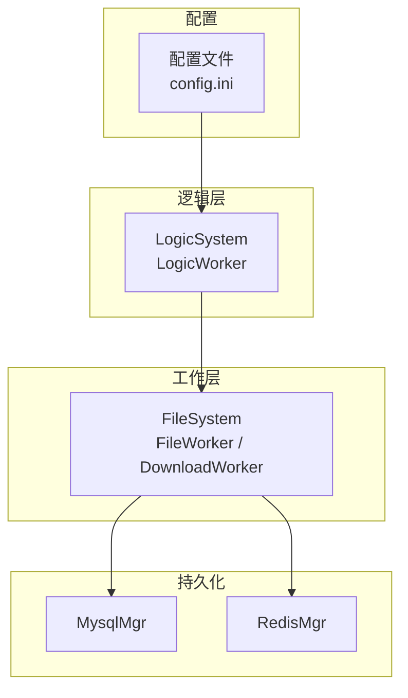
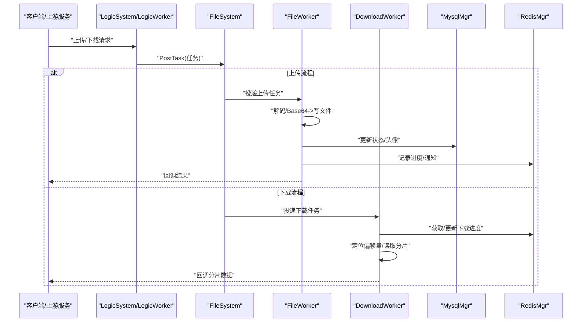
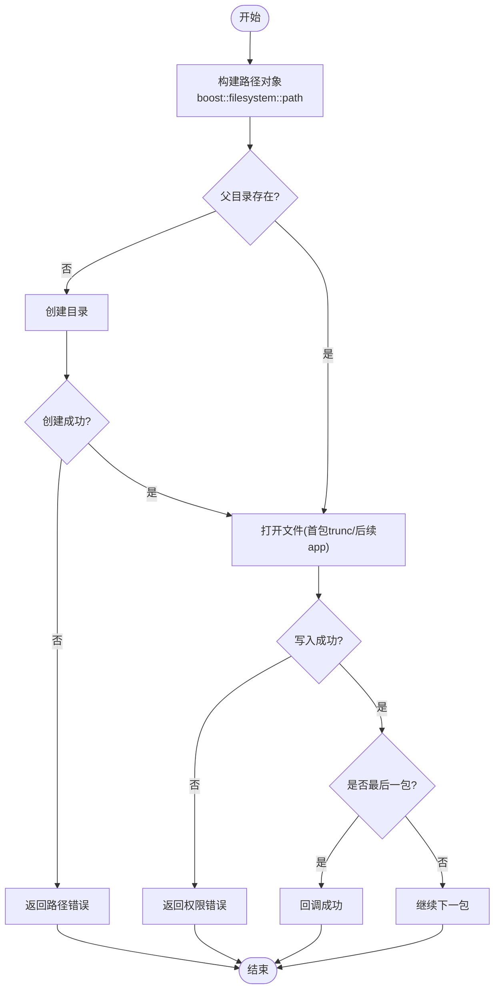
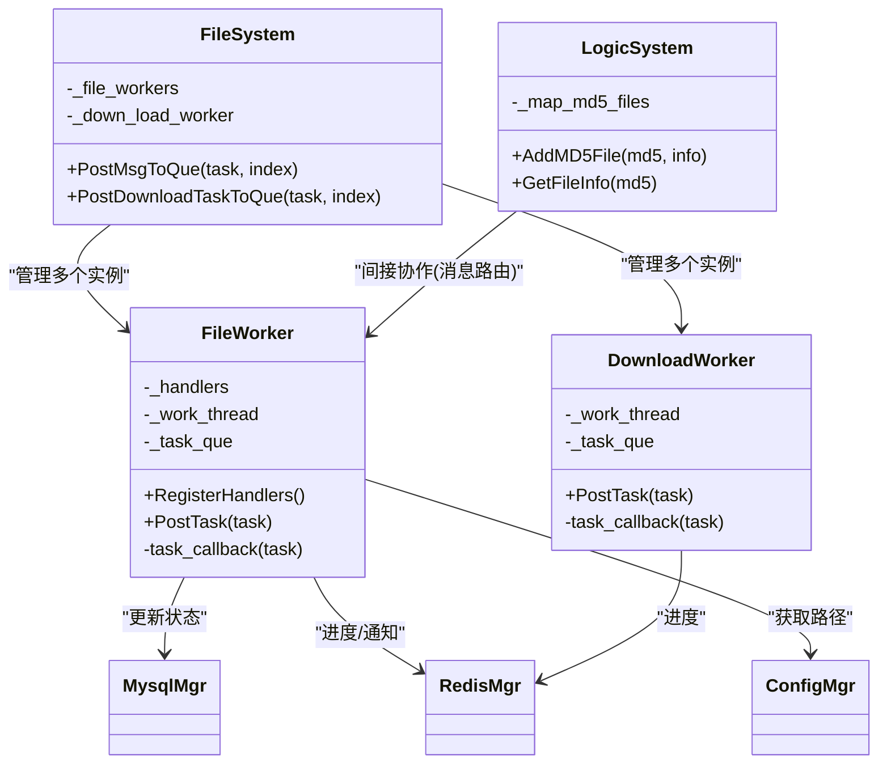

# 存储管理

<cite>
**本文引用的文件**   
- [FileSystem.h](file://server/ResourceServer/include/FileSystem.h)
- [FileSystem.cpp](file://server/ResourceServer/src/FileSystem.cpp)
- [FileWorker.h](file://server/ResourceServer/include/FileWorker.h)
- [FileWorker.cpp](file://server/ResourceServer/src/FileWorker.cpp)
- [FileInfo.h](file://server/ResourceServer/include/FileInfo.h)
- [const.h](file://server/ResourceServer/include/const.h)
- [data.h](file://server/ResourceServer/include/data.h)
- [LogicSystem.h](file://server/ResourceServer/include/LogicSystem.h)
- [LogicWorker.h](file://server/ResourceServer/include/LogicWorker.h)
- [MysqlMgr.h](file://server/ResourceServer/include/MysqlMgr.h)
- [RedisMgr.h](file://server/ResourceServer/include/RedisMgr.h)
- [ConfigMgr.h](file://server/ResourceServer/include/ConfigMgr.h)
- [config.ini](file://server/ResourceServer/config/config.ini)
</cite>

## 目录
1. [引言](#引言)
2. [项目结构](#项目结构)
3. [核心组件](#核心组件)
4. [架构总览](#架构总览)
5. [详细组件分析](#详细组件分析)
6. [依赖关系分析](#依赖关系分析)
7. [性能考量](#性能考量)
8. [故障排查指南](#故障排查指南)
9. [结论](#结论)
10. [附录](#附录)

## 引言
本技术文档聚焦于LLFCChat项目的文件存储管理系统，围绕资源服务器（ResourceServer）中的文件系统抽象层、目录组织、元数据与状态管理、配额与限制、安全策略、存储优化以及监控告警等主题进行系统化说明。目标是帮助读者快速理解并扩展该系统的存储能力，同时为运维与开发提供可操作的指导。

## 项目结构
资源服务器的文件存储相关代码集中在 server/ResourceServer 目录下，关键头文件位于 include，实现位于 src，配置位于 config。整体采用“逻辑层 + 工作线程池 + 持久化”的分层设计：
- 配置层：通过配置文件定义输出路径、静态目录、数据库与缓存连接信息。
- 逻辑层：负责消息路由、任务分发与业务编排。
- 工作层：文件上传/下载工作线程，独立处理IO密集型任务。
- 持久化层：MySQL用于用户与聊天消息等结构化数据；Redis用于会话、进度与分布式锁等热点数据。

**图表来源** 
- [config.ini:1-27](file://server/ResourceServer/config/config.ini#L1-L27)
- [LogicSystem.h:1-34](file://server/ResourceServer/include/LogicSystem.h#L1-L34)
- [FileSystem.h:1-21](file://server/ResourceServer/include/FileSystem.h#L1-L21)
- [MysqlMgr.h:1-44](file://server/ResourceServer/include/MysqlMgr.h#L1-L44)
- [RedisMgr.h:1-313](file://server/ResourceServer/include/RedisMgr.h#L1-L313)

**章节来源**
- [config.ini:1-27](file://server/ResourceServer/config/config.ini#L1-L27)
- [ConfigMgr.h:1-90](file://server/ResourceServer/include/ConfigMgr.h#L1-L90)

## 核心组件
- FileSystem：单例，维护多组 FileWorker 与 DownloadWorker，负责将任务投递到对应工作队列。
- FileWorker：基于条件变量与互斥量的工作线程，注册多种消息处理器（上传、头像、聊天图片、续传、同步等），完成二进制写入与回调。
- DownloadWorker：下载工作线程，支持断点续传，使用 Redis 保存下载进度，按固定分片大小读取并Base64编码返回。
- FileInfo：描述文件基本信息（名称、总大小、已传输大小、路径）。
- LogicSystem/LogicWorker：逻辑调度层，持有MD5到FileInfo的映射，用于去重与进度跟踪（当前在内存中）。
- MysqlMgr/RedisMgr：分别封装MySQL与Redis操作，包括用户信息、聊天消息、下载进度、分布式锁等。
- ConfigMgr：解析INI配置，提供输出目录与静态目录路径。

**章节来源**
- [FileSystem.h:1-21](file://server/ResourceServer/include/FileSystem.h#L1-L21)
- [FileSystem.cpp:1-29](file://server/ResourceServer/src/FileSystem.cpp#L1-L29)
- [FileWorker.h:1-90](file://server/ResourceServer/include/FileWorker.h#L1-L90)
- [FileWorker.cpp:1-663](file://server/ResourceServer/src/FileWorker.cpp#L1-L663)
- [FileInfo.h:1-26](file://server/ResourceServer/include/FileInfo.h#L1-L26)
- [LogicSystem.h:1-34](file://server/ResourceServer/include/LogicSystem.h#L1-L34)
- [MysqlMgr.h:1-44](file://server/ResourceServer/include/MysqlMgr.h#L1-L44)
- [RedisMgr.h:1-313](file://server/ResourceServer/include/RedisMgr.h#L1-L313)
- [ConfigMgr.h:1-90](file://server/ResourceServer/include/ConfigMgr.h#L1-L90)

## 架构总览
资源服务器以“请求-响应+异步工作线程”的模式运行。客户端或上游服务通过协议发送文件上传/下载请求，逻辑层解析后投递到文件系统工作队列，由专用线程执行IO操作，并通过回调返回结果。下载过程借助Redis维护进度，支持断点续传。

**图表来源** 
- [FileWorker.cpp:1-663](file://server/ResourceServer/src/FileWorker.cpp#L1-L663)
- [RedisMgr.h:1-313](file://server/ResourceServer/include/RedisMgr.h#L1-L313)
- [MysqlMgr.h:1-44](file://server/ResourceServer/include/MysqlMgr.h#L1-L44)

## 详细组件分析

### 文件系统抽象层与跨平台兼容
- 路径规范化：使用 boost::filesystem 构造路径对象，自动处理不同平台的分隔符与相对/绝对路径问题。
- 目录创建：在写入前检查父目录是否存在，不存在则递归创建，失败时返回错误码。
- 权限控制：打开文件失败时返回“写权限不足”、“读权限不足”等错误码，便于上层统一处理。
- 常量与限制：最大分片大小、消息ID枚举、错误码集中定义，保证行为一致。

**图表来源** 
- [FileWorker.cpp:50-112](file://server/ResourceServer/src/FileWorker.cpp#L50-L112)
- [const.h:1-117](file://server/ResourceServer/include/const.h#L1-L117)

**章节来源**
- [FileWorker.cpp:50-112](file://server/ResourceServer/src/FileWorker.cpp#L50-L112)
- [const.h:1-117](file://server/ResourceServer/include/const.h#L1-L117)

### 文件目录组织结构
- 输出目录：通过配置文件指定 Output.Path，运行时由 ConfigMgr 初始化并返回。
- 静态目录：Static.Path 作为默认存储根，实际文件路径由文件名拼接得到。
- 用户隔离：当前实现以文件名为维度进行落盘，未显式按用户ID分层；可在上层根据用户名或ID生成唯一文件名以实现隔离。
- 类型分类：可通过文件名前缀或子目录区分头像、聊天图片、普通文件等。
- 时间分区：当前未实现按日期分桶；可在命名规则中加入时间戳或目录层级。
- 容量规划：建议结合操作系统磁盘配额与进程级监控，避免单节点写满。

**章节来源**
- [config.ini:1-27](file://server/ResourceServer/config/config.ini#L1-L27)
- [ConfigMgr.h:1-90](file://server/ResourceServer/include/ConfigMgr.h#L1-L90)

### 文件元数据管理
- 文件属性：FileInfo 包含序列号、文件名、总大小、已传输大小、文件路径。
- 访问统计：当前未内置访问计数；可在下载成功后通过Redis计数器记录。
- 版本控制：当前无版本字段；可通过文件名后缀或独立表记录版本。
- 垃圾回收：未实现自动清理；可基于最后访问时间或过期策略定期扫描删除。

**章节来源**
- [FileInfo.h:1-26](file://server/ResourceServer/include/FileInfo.h#L1-L26)

### 存储配额与限制机制
- 用户级配额：当前未在代码中实现；可在上传前查询Redis中用户累计大小并与阈值比较。
- 全局限制：MAX_FILE_LEN 限制单次分片大小，防止过大分片导致内存压力。
- 动态调整：可通过配置项或外部配置中心动态调整分片大小与工作线程数量。

**章节来源**
- [const.h:1-117](file://server/ResourceServer/include/const.h#L1-L117)

### 文件安全策略
- 访问控制：读写失败时返回相应错误码，上层可据此拒绝非法访问。
- 病毒扫描：当前未集成；可在写入完成后调用外部扫描工具并标记风险文件。
- 内容过滤：可在上传处理器中增加白名单校验（扩展名、MIME类型）。
- 审计日志：建议在关键路径（上传、下载、权限失败）追加审计日志，便于追踪。

**章节来源**
- [FileWorker.cpp:112-196](file://server/ResourceServer/src/FileWorker.cpp#L112-L196)
- [const.h:1-117](file://server/ResourceServer/include/const.h#L1-L117)

### 存储优化技术
- 压缩存储：当前未启用；可在写入前对数据进行压缩以降低空间占用。
- 去重机制：LogicSystem 持有 MD5->FileInfo 映射，可用于重复检测；当前仅内存态，需持久化以支持重启恢复。
- 缓存策略：Redis 用于会话、进度与用户信息缓存，提升热点访问性能。
- 冷热分离：可将近期频繁访问的文件放在SSD，历史归档至HDD；当前未实现，可在上层按时间或访问频率迁移。

**章节来源**
- [LogicSystem.h:1-34](file://server/ResourceServer/include/LogicSystem.h#L1-L34)
- [RedisMgr.h:1-313](file://server/ResourceServer/include/RedisMgr.h#L1-L313)

### 存储监控与告警
- 空间使用率：建议监控输出目录磁盘使用率，超过阈值触发告警。
- IO性能：监控读写延迟与吞吐，识别瓶颈。
- 错误统计：汇总各类错误码（权限、路径、网络、序列化）并上报。
- 健康检查：Redis连接池PING检测与自动重连，确保缓存可用性。

**章节来源**
- [RedisMgr.h:1-313](file://server/ResourceServer/include/RedisMgr.h#L1-L313)

## 依赖关系分析
- 组件耦合：
  - FileWorker 依赖 ConfigMgr（路径）、MysqlMgr（状态更新）、RedisMgr（进度/通知）、base64（编解码）。
  - DownloadWorker 依赖 RedisMgr（进度）、base64（编码）。
  - FileSystem 聚合多个 FileWorker/DownloadWorker，解耦具体处理逻辑。
- 潜在循环依赖：当前未见循环引用，职责清晰。
- 外部依赖：Boost.Filesystem、JSON库、hiredis、gRPC客户端（通知ChatServer）。

**图表来源** 
- [FileSystem.h:1-21](file://server/ResourceServer/include/FileSystem.h#L1-L21)
- [FileWorker.h:1-90](file://server/ResourceServer/include/FileWorker.h#L1-L90)
- [LogicSystem.h:1-34](file://server/ResourceServer/include/LogicSystem.h#L1-L34)
- [MysqlMgr.h:1-44](file://server/ResourceServer/include/MysqlMgr.h#L1-L44)
- [RedisMgr.h:1-313](file://server/ResourceServer/include/RedisMgr.h#L1-L313)
- [ConfigMgr.h:1-90](file://server/ResourceServer/include/ConfigMgr.h#L1-L90)

**章节来源**
- [FileSystem.cpp:1-29](file://server/ResourceServer/src/FileSystem.cpp#L1-L29)
- [FileWorker.cpp:1-663](file://server/ResourceServer/src/FileWorker.cpp#L1-L663)

## 性能考量
- 并发模型：每个工作线程独立队列，减少锁竞争；可根据负载调整 FILE_WORKER_COUNT 与 DOWN_LOAD_WORKER_COUNT。
- I/O优化：二进制流写入、顺序读取，减少随机IO；大文件分片传输降低内存峰值。
- 缓存命中：Redis缓存用户信息与下载进度，降低数据库压力。
- 网络开销：Base64编码带来约33%额外开销，可考虑二进制协议或压缩传输。
- 资源上限：MAX_FILE_LEN 控制分片大小，平衡内存与网络带宽。

[本节为通用性能讨论，不直接分析具体文件]

## 故障排查指南
- 常见错误码：
  - FileNotExists：路径创建失败或文件不存在。
  - FileWritePermissionFailed/ReadPermissionFailed：权限不足或路径不可用。
  - FileSeqInvalid/FileOffsetInvalid：序列号或偏移量异常。
  - RedisReadErr：缓存读取失败。
- 排查步骤：
  - 检查配置文件路径是否正确，目录是否存在且可写。
  - 查看工作线程日志，确认分片序列与偏移计算。
  - 验证Redis连通性与键值是否存在。
  - 核对MySQL状态更新是否成功。
- 恢复策略：
  - 断点续传：利用Redis中的下载进度从上次位置继续。
  - 重试机制：对临时性错误（网络、缓存）进行指数退避重试。

**章节来源**
- [const.h:1-117](file://server/ResourceServer/include/const.h#L1-L117)
- [FileWorker.cpp:528-663](file://server/ResourceServer/src/FileWorker.cpp#L528-L663)

## 结论
LLFCChat的资源服务器存储模块采用清晰的分层与异步工作线程模型，具备跨平台路径处理、基础权限控制与断点续传能力。当前在用户隔离、类型分类、时间分区、容量规划与安全策略方面仍有扩展空间。建议引入更完善的配额管理、内容过滤、审计日志与监控告警，以提升系统稳定性与可观测性。

[本节为总结性内容，不直接分析具体文件]

## 附录
- 配置项说明：
  - SelfServer：服务名称、监听地址与端口。
  - Mysql/Redis：数据库与缓存连接参数。
  - Output/Static：输出目录与静态目录路径。
  - chatserverX：上游聊天服务地址。

**章节来源**
- [config.ini:1-27](file://server/ResourceServer/config/config.ini#L1-L27)