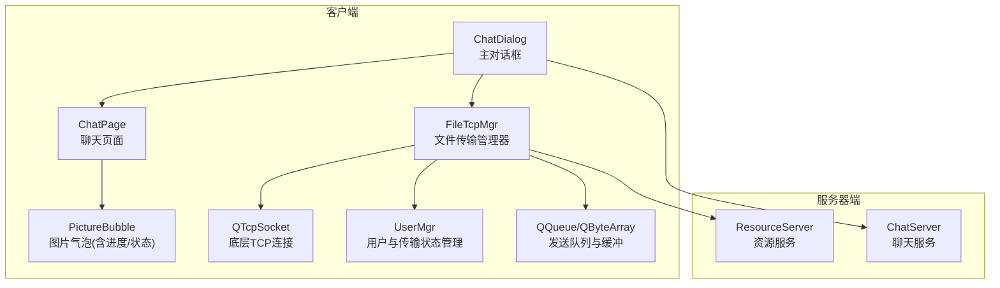
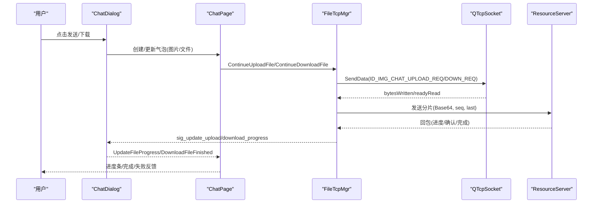
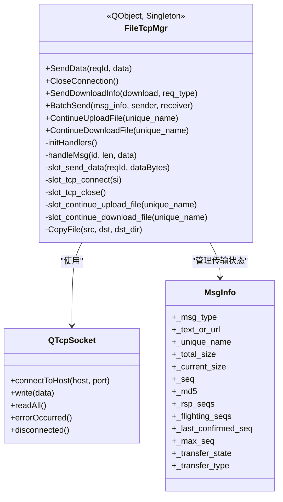
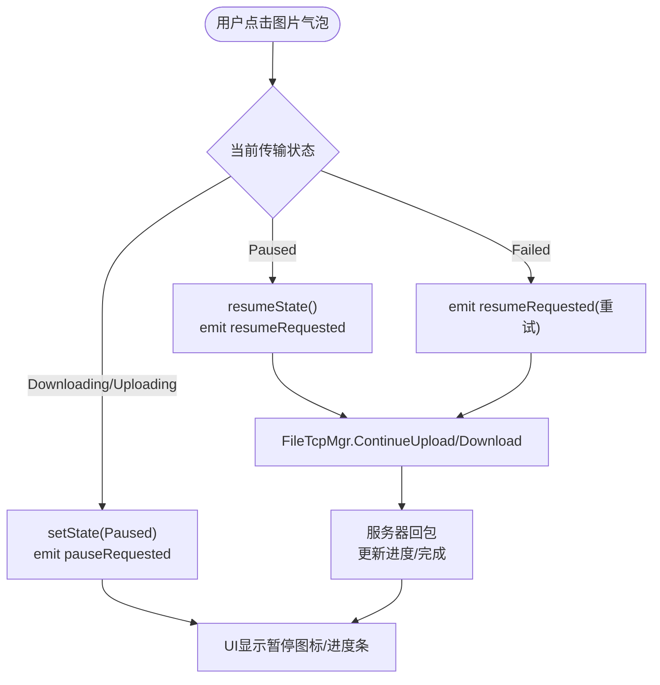
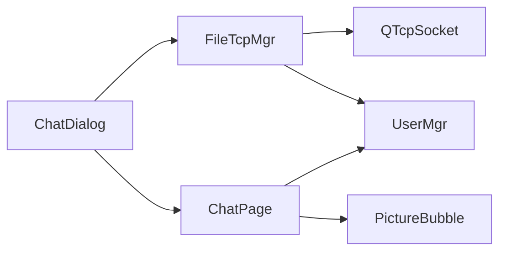

# 客户端集成

<cite>
**本文引用的文件**   
- [filetcpmgr.h](file://client/llfcchat/include/filetcpmgr.h)
- [filetcpmgr.cpp](file://client/llfcchat/src/filetcpmgr.cpp)
- [global.h](file://client/llfcchat/include/global.h)
- [userdata.h](file://client/llfcchat/include/userdata.h)
- [chatdialog.h](file://client/llfcchat/include/chatdialog.h)
- [chatdialog.cpp](file://client/llfcchat/src/chatdialog.cpp)
- [chatpage.h](file://client/llfcchat/include/chatpage.h)
- [chatpage.cpp](file://client/llfcchat/src/chatpage.cpp)
</cite>

## 目录
1. [简介](#简介)
2. [项目结构](#项目结构)
3. [核心组件](#核心组件)
4. [架构总览](#架构总览)
5. [详细组件分析](#详细组件分析)
6. [依赖关系分析](#依赖关系分析)
7. [性能考量](#性能考量)
8. [故障排查指南](#故障排查指南)
9. [结论](#结论)
10. [附录](#附录)

## 简介
本技术文档聚焦于LLFCChat客户端的文件传输集成，围绕FileTcpMgr类展开，系统阐述连接管理、任务调度、进度回调与错误处理机制；并深入说明与聊天界面的UI集成（进度条显示、暂停/恢复、取消操作、错误提示）、文件选择对话框扩展（过滤器、多选、预览、批量操作）、传输队列管理（优先级、并发控制、资源限制、内存管理），以及与聊天界面深度集成的图片预览、附件、拖拽上传、粘贴插入等能力。同时给出移动端适配考虑与用户体验优化策略（预加载、懒加载、增量更新、离线支持）。

## 项目结构
- 客户端核心模块位于 client/llfcchat，包含 UI、网络、数据模型与业务逻辑。
- 文件传输相关的关键头文件与实现：
  - filetcpmgr.h/cpp：文件传输管理器，封装TCP连接、消息收发、断点续传、拥塞窗口控制、下载/上传流程。
  - global.h：全局常量、枚举（ReqId、ErrorCodes、MsgType、TransferState等）、数据结构（MsgInfo、DownloadInfo）。
  - userdata.h：用户与聊天数据模型（TextChatData、ImgChatData、ChatThreadData等）。
  - chatdialog.h/cpp：主对话窗口，负责信号槽绑定、进度回调、头像下载与刷新。
  - chatpage.h/cpp：聊天页面，负责消息气泡渲染、图片上传/下载状态交互、暂停/恢复控制。

**图表来源** 
- [filetcpmgr.h:26-84](file://client/llfcchat/include/filetcpmgr.h#L26-L84)
- [filetcpmgr.cpp:1-143](file://client/llfcchat/src/filetcpmgr.cpp#L1-L143)
- [chatdialog.cpp:184-195](file://client/llfcchat/src/chatdialog.cpp#L184-L195)
- [chatpage.cpp:86-90](file://client/llfcchat/src/chatpage.cpp#L86-L90)

**章节来源**
- [filetcpmgr.h:1-85](file://client/llfcchat/include/filetcpmgr.h#L1-L85)
- [filetcpmgr.cpp:1-143](file://client/llfcchat/src/filetcpmgr.cpp#L1-L143)
- [chatdialog.cpp:184-195](file://client/llfcchat/src/chatdialog.cpp#L184-L195)
- [chatpage.cpp:18-31](file://client/llfcchat/src/chatpage.cpp#L18-L31)

## 核心组件
- FileTcpMgr：单例管理器，负责：
  - TCP连接建立、断开、错误处理与重连信号。
  - 消息编解码（头部ID+长度+体），粘包处理，接收缓冲区管理。
  - 发送队列与拥塞窗口控制（MAX_CWND_SIZE），避免过度发送。
  - 上传/下载分片、Base64编码、断点续传（seq、last标志、已确认序列号）。
  - 进度回调信号（sig_update_upload_progress、sig_update_download_progress、sig_download_finish）。
- ChatDialog：UI层入口，负责：
  - 绑定FileTcpMgr的信号到槽函数，驱动界面更新。
  - 头像下载与刷新（self_icon/other_icon），触发下载请求。
  - 进度更新与完成回调，联动ChatPage刷新。
- ChatPage：聊天页面，负责：
  - 消息气泡渲染（文本/图片），图片气泡的暂停/恢复/失败重试。
  - 文件传输状态映射到UI（进度条百分比、完成隐藏、失败图标）。
  - 与FileTcpMgr交互，调用ContinueUploadFile/ContinueDownloadFile。

**章节来源**
- [filetcpmgr.h:26-84](file://client/llfcchat/include/filetcpmgr.h#L26-L84)
- [filetcpmgr.cpp:175-221](file://client/llfcchat/src/filetcpmgr.cpp#L175-L221)
- [chatdialog.cpp:184-195](file://client/llfcchat/src/chatdialog.cpp#L184-L195)
- [chatpage.cpp:334-367](file://client/llfcchat/src/chatpage.cpp#L334-L367)

## 架构总览
下图展示从用户操作到文件传输完成的端到端流程，包括UI事件、管理器、网络协议与服务器响应。

**图表来源** 
- [filetcpmgr.cpp:925-996](file://client/llfcchat/src/filetcpmgr.cpp#L925-L996)
- [filetcpmgr.cpp:1078-1105](file://client/llfcchat/src/filetcpmgr.cpp#L1078-L1105)
- [chatdialog.cpp:1078-1133](file://client/llfcchat/src/chatdialog.cpp#L1078-L1133)
- [chatpage.cpp:600-618](file://client/llfcchat/src/chatpage.cpp#L600-L618)

## 详细组件分析

### FileTcpMgr 类分析
- 连接管理：
  - 通过QTcpSocket::connected/disconnected/error信号处理连接生命周期。
  - slot_tcp_connect发起连接，slot_tcp_close关闭连接。
- 消息收发：
  - handleMsg根据ReqId分发到对应处理器（_handlers）。
  - slot_send_data将数据打包为“ID+长度+体”，使用QDataStream写入，按网络字节序。
  - bytesWritten回调实现流式发送与队列出队。
- 上传/下载流程：
  - BatchSend：按MAX_FILE_LEN分片读取，Base64编码，设置last标志，维护_cwnd_size拥塞窗口。
  - slot_continue_upload_file：基于last_confirmed_seq断点续传。
  - ID_IMG_CHAT_DOWN_RSP/ID_IMG_CHAT_CONTINUE_UPLOAD_RSP：解析服务器回包，写文件（首包覆盖，后续追加），更新进度，必要时继续请求。
- 进度与完成：
  - 每收到一次回包或写入成功，计算当前大小并emit进度信号。
  - 完成时清理传输记录，通知界面刷新。

**图表来源** 
- [filetcpmgr.h:26-84](file://client/llfcchat/include/filetcpmgr.h#L26-L84)
- [filetcpmgr.cpp:175-221](file://client/llfcchat/src/filetcpmgr.cpp#L175-L221)
- [global.h:167-200](file://client/llfcchat/include/global.h#L167-L200)

**章节来源**
- [filetcpmgr.cpp:1-143](file://client/llfcchat/src/filetcpmgr.cpp#L1-L143)
- [filetcpmgr.cpp:925-996](file://client/llfcchat/src/filetcpmgr.cpp#L925-L996)
- [filetcpmgr.cpp:1078-1105](file://client/llfcchat/src/filetcpmgr.cpp#L1078-L1105)
- [global.h:167-200](file://client/llfcchat/include/global.h#L167-L200)

### 聊天界面集成（进度条、暂停/恢复、取消、错误提示）
- 进度条显示：
  - ChatPage.UpdateFileProgress根据MsgInfo的_rsp_size与_total_size更新PictureBubble进度。
  - PictureBubble.setProgress计算百分比并设置状态（完成时延迟隐藏进度条）。
- 暂停/恢复：
  - PictureBubble.onPictureClicked根据当前状态发射pauseRequested/resumeRequested信号。
  - ChatPage.on_clicked_paused/on_clicked_resume调用UserMgr暂停/恢复，并触发FileTcpMgr继续上传/下载。
- 取消操作：
  - 可在PictureBubble中增加cancelRequested信号，结合UserMgr取消任务并从队列移除。
- 错误提示：
  - FileTcpMgr在error信号中区分连接拒绝、远程关闭、主机未找到、超时等，emit连接失败信号供UI提示。

**图表来源** 
- [chatpage.cpp:600-618](file://client/llfcchat/src/chatpage.cpp#L600-L618)
- [chatdialog.cpp:1078-1133](file://client/llfcchat/src/chatdialog.cpp#L1078-L1133)
- [filetcpmgr.cpp:1078-1105](file://client/llfcchat/src/filetcpmgr.cpp#L1078-L1105)

**章节来源**
- [chatpage.cpp:334-367](file://client/llfcchat/src/chatpage.cpp#L334-L367)
- [chatdialog.cpp:1078-1133](file://client/llfcchat/src/chatdialog.cpp#L1078-L1133)
- [filetcpmgr.cpp:65-93](file://client/llfcchat/src/filetcpmgr.cpp#L65-L93)

### 文件选择对话框扩展（过滤器、多选、预览、批量操作）
- 过滤器设置：
  - 在Qt的文件对话框中设置MIME类型与扩展名过滤（如image/*、application/pdf等）。
- 多选支持：
  - 使用QFileDialog::getOpenFileNames获取多文件路径列表。
- 预览功能：
  - 对图片文件生成缩略图（QPixmap缩放），用于快速预览。
- 批量操作：
  - 遍历文件列表，依次加入UserMgr的传输队列，按优先级排序（如大文件优先或用户指定顺序）。
  - 支持批量暂停/恢复/取消。

[本节为概念性说明，不直接分析具体文件]

### 传输队列管理机制（优先级、并发控制、资源限制、内存管理）
- 优先级排序：
  - 可根据文件大小、类型、用户选择设定优先级，使用优先队列（std::priority_queue）替代QQueue。
- 并发控制：
  - 通过_cwnd_size限制同时发送的分片数量，避免拥塞。
  - MAX_CWND_SIZE=5，确保稳定吞吐。
- 资源限制：
  - 限制每个会话的最大并发上传/下载数，防止资源耗尽。
- 内存管理：
  - 使用QByteArray缓冲与QIODevice读写，及时释放临时对象。
  - 分片大小MAX_FILE_LEN=32KB，平衡内存与网络效率。

**章节来源**
- [global.h:22-24](file://client/llfcchat/include/global.h#L22-L24)
- [filetcpmgr.cpp:925-996](file://client/llfcchat/src/filetcpmgr.cpp#L925-L996)

### 与聊天界面的集成（图片预览、文件附件、拖拽上传、粘贴插入）
- 图片预览：
  - PictureBubble初始化时加载缩略图，支持点击放大查看。
- 文件附件：
  - ChatPage.AppendChatMsg中根据MsgType创建对应气泡（文本/图片/文件）。
- 拖拽上传：
  - 重写MessageTextEdit的dragEnterEvent/dragDropEvent，解析拖拽文件并加入发送队列。
- 粘贴插入：
  - 监听剪贴板变化，若为图片或文件则自动插入到输入框并准备发送。

**章节来源**
- [chatpage.cpp:66-176](file://client/llfcchat/src/chatpage.cpp#L66-L176)
- [chatpage.cpp:416-560](file://client/llfcchat/src/chatpage.cpp#L416-L560)

### 移动端适配考虑（触摸操作、屏幕适配、电池优化、网络切换）
- 触摸操作：
  - 使用QTouchEvent处理长按、滑动等操作，适配手势控制。
- 屏幕适配：
  - 动态调整气泡尺寸与字体，适配不同分辨率与方向。
- 电池优化：
  - 后台传输降低频率，空闲时暂停非关键任务。
- 网络切换：
  - 监听网络状态变化（WiFi/蜂窝），切换时暂停大文件传输，恢复后继续。

[本节为概念性说明，不直接分析具体文件]

### 用户体验优化策略（预加载、懒加载、增量更新、离线支持）
- 预加载：
  - 提前下载常用头像与缩略图，减少首次加载时间。
- 懒加载：
  - 聊天消息按需加载，滚动到底部时加载更多历史。
- 增量更新：
  - 仅更新变化的消息项，避免全量刷新。
- 离线支持：
  - 本地缓存消息与文件，网络恢复后同步。

[本节为概念性说明，不直接分析具体文件]

## 依赖关系分析
- FileTcpMgr依赖：
  - QTcpSocket：底层网络IO。
  - UserMgr：用户信息与传输状态管理。
  - QQueue/QByteArray：发送队列与缓冲。
- ChatDialog依赖：
  - FileTcpMgr：接收进度与完成信号。
  - ChatPage：更新UI状态。
- ChatPage依赖：
  - PictureBubble：图片气泡交互。
  - UserMgr：暂停/恢复传输。

**图表来源** 
- [filetcpmgr.h:26-84](file://client/llfcchat/include/filetcpmgr.h#L26-L84)
- [chatdialog.cpp:184-195](file://client/llfcchat/src/chatdialog.cpp#L184-L195)
- [chatpage.cpp:86-90](file://client/llfcchat/src/chatpage.cpp#L86-L90)

**章节来源**
- [filetcpmgr.h:26-84](file://client/llfcchat/include/filetcpmgr.h#L26-L84)
- [chatdialog.cpp:184-195](file://client/llfcchat/src/chatdialog.cpp#L184-L195)
- [chatpage.cpp:86-90](file://client/llfcchat/src/chatpage.cpp#L86-L90)

## 性能考量
- 网络层面：
  - 拥塞窗口_cwnd_size限制并发，避免网络拥塞。
  - 分片大小MAX_FILE_LEN=32KB，平衡内存与吞吐。
- 内存层面：
  - 使用QByteArray缓冲，及时释放临时对象。
  - 避免重复Base64编码，缓存结果。
- UI层面：
  - 进度更新节流，避免频繁刷新导致卡顿。
  - 图片缩略图异步加载，主线程仅处理UI。

[本节提供一般性指导，不直接分析具体文件]

## 故障排查指南
- 连接问题：
  - 检查QTcpSocket::error信号，区分连接拒绝、主机未找到、超时等。
  - 确认服务器地址与端口配置正确。
- 传输中断：
  - 检查_cwnd_size是否达到上限，调整MAX_CWND_SIZE。
  - 验证last_confirmed_seq是否正确更新。
- UI不同步：
  - 确认FileTcpMgr进度信号已连接到ChatDialog槽函数。
  - 检查ChatPage.UpdateFileProgress是否被调用。

**章节来源**
- [filetcpmgr.cpp:65-93](file://client/llfcchat/src/filetcpmgr.cpp#L65-L93)
- [filetcpmgr.cpp:925-996](file://client/llfcchat/src/filetcpmgr.cpp#L925-L996)
- [chatdialog.cpp:1078-1133](file://client/llfcchat/src/chatdialog.cpp#L1078-L1133)

## 结论
FileTcpMgr作为LLFCChat客户端文件传输的核心，提供了健壮的连接管理、分片传输、断点续传与进度回调机制。通过与ChatDialog和ChatPage的深度集成，实现了流畅的用户体验（进度可视化、暂停/恢复、错误提示）。未来可进一步优化队列优先级、内存管理与移动端适配，提升整体性能与可用性。

[本节总结性内容，不直接分析具体文件]

## 附录
- 关键常量与枚举：
  - FILE_UPLOAD_HEAD_LEN、MAX_FILE_LEN、MAX_CWND_SIZE。
  - ReqId（ID_IMG_CHAT_UPLOAD_REQ、ID_IMG_CHAT_DOWN_REQ等）。
  - TransferState（Downloading、Uploading、Paused、Completed、Failed）。
- 数据结构：
  - MsgInfo：传输元数据与状态。
  - DownloadInfo：下载任务信息。

**章节来源**
- [global.h:15-24](file://client/llfcchat/include/global.h#L15-L24)
- [global.h:43-88](file://client/llfcchat/include/global.h#L43-L88)
- [global.h:158-165](file://client/llfcchat/include/global.h#L158-L165)
- [global.h:167-200](file://client/llfcchat/include/global.h#L167-L200)
- [global.h:284-290](file://client/llfcchat/include/global.h#L284-L290)