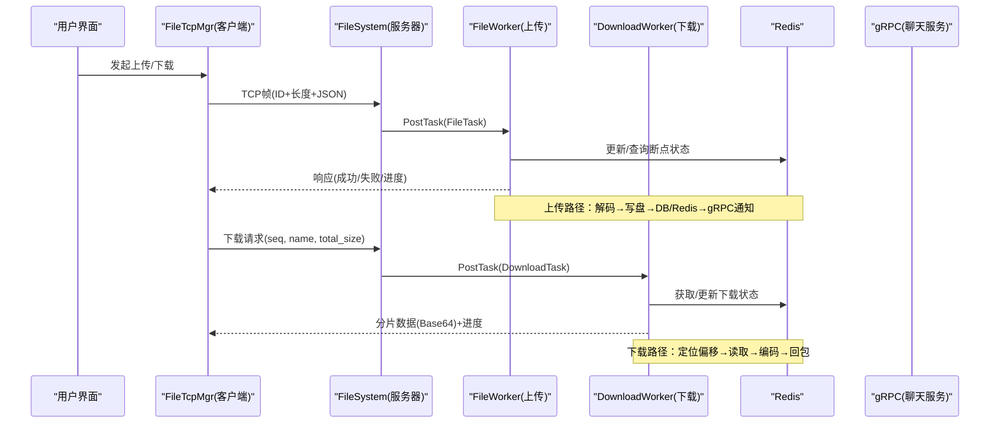
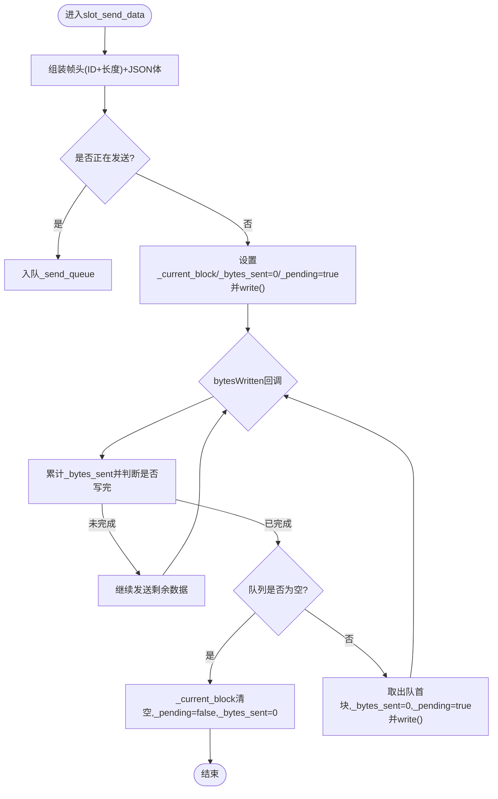
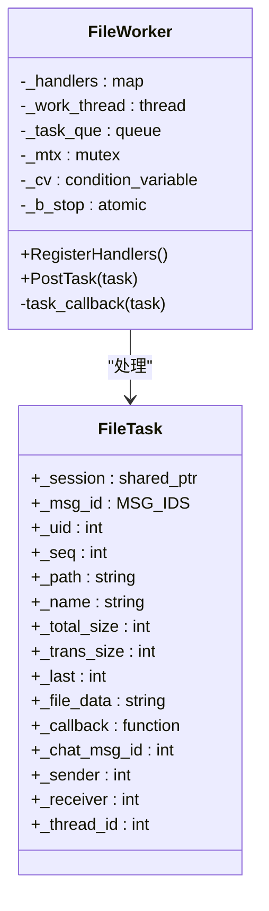
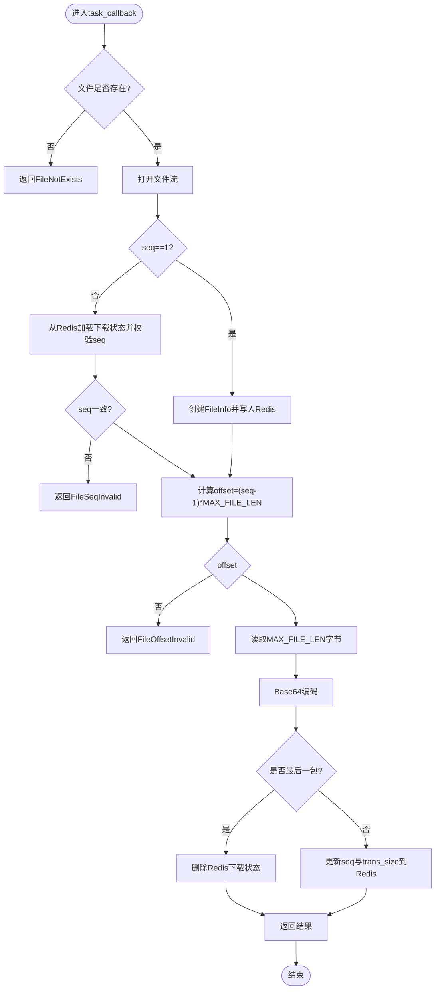
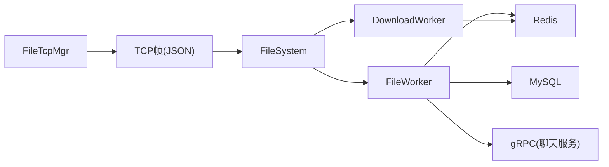

# 文件传输架构设计

<cite>
**本文引用的文件**   
- [filetcpmgr.h](file://client/llfcchat/include/filetcpmgr.h)
- [filetcpmgr.cpp](file://client/llfcchat/src/filetcpmgr.cpp)
- [global.h](file://client/llfcchat/include/global.h)
- [FileWorker.h](file://server/ResourceServer/include/FileWorker.h)
- [FileWorker.cpp](file://server/ResourceServer/src/FileWorker.cpp)
- [FileSystem.h](file://server/ResourceServer/include/FileSystem.h)
- [FileSystem.cpp](file://server/ResourceServer/src/FileSystem.cpp)
- [const.h](file://server/ResourceServer/include/const.h)
- [FileInfo.h](file://server/ResourceServer/include/FileInfo.h)
- [message.proto](file://server/proto/resource/message.proto)
</cite>

## 目录
1. [简介](#简介)
2. [项目结构](#项目结构)
3. [核心组件](#核心组件)
4. [架构总览](#架构总览)
5. [详细组件分析](#详细组件分析)
6. [依赖关系分析](#依赖关系分析)
7. [性能与并发特性](#性能与并发特性)
8. [故障处理与错误码](#故障处理与错误码)
9. [分布式存储策略](#分布式存储策略)
10. [结论](#结论)
11. [附录：协议与数据格式](#附录协议与数据格式)

## 简介
本技术文档聚焦于LLFCChat项目的文件传输子系统，系统性阐述客户端与服务器端的通信协议、双工作线程模型（FileWorker与DownloadWorker）、任务队列机制、异步处理流程以及分布式环境下的文件存储策略。重点说明：
- 客户端FileTcpMgr负责与资源服务器的TCP连接管理、消息编解码、发送队列与拥塞控制、断点续传与进度回调。
- 服务器端FileWorker负责上传类任务处理（头像、聊天图片、通用文件），DownloadWorker负责下载类任务处理（分片读取、Base64编码、断点续传状态维护）。
- FileSystem作为单例协调多个FileWorker与DownloadWorker实例，实现负载均衡与任务分发。
- 协议层基于自定义TCP帧头+JSON载荷，配合Redis进行断点续传状态持久化，通过gRPC在资源服务与聊天服务间协作完成通知。

## 项目结构
- 客户端（Qt/C++）
  - filetcpmgr.h/cpp：文件传输的TCP管理器，封装连接、收发、队列、拥塞窗口、断点续传等逻辑。
  - global.h：全局常量、枚举（ReqId、ErrorCodes、MsgInfo、TransferState等）、数据结构定义。
- 服务器端（C++/Asio + gRPC + Redis + MySQL）
  - FileWorker.h/cpp：上传任务工作线程与处理器注册，支持多种上传场景。
  - DownloadWorker：下载任务工作线程，实现分片读取、断点续传、状态同步。
  - FileSystem.h/cpp：单例，维护多实例FileWorker/DownloadWorker，提供任务入队接口。
  - const.h：服务器侧消息ID、错误码、常量（如MAX_FILE_LEN、WORKER_COUNT等）。
  - FileInfo.h：下载断点信息的数据结构。
  - message.proto：gRPC协议定义，用于聊天服务与资源服务之间的通知交互。

```mermaid
graph TB
subgraph "客户端"
UI["界面层"]
TCPMGR["FileTcpMgr<br/>TCP连接/队列/拥塞控制"]
GLOBAL["全局定义<br/>ReqId/MsgInfo/错误码"]
end
subgraph "服务器端-资源服务"
FS["FileSystem<br/>多Worker调度"]
FW["FileWorker<br/>上传任务处理"]
DW["DownloadWorker<br/>下载任务处理"]
REDIS["Redis<br/>断点续传状态"]
MYSQL["MySQL<br/>用户/消息元数据"]
GRPC["gRPC Client<br/>通知聊天服务"]
end
UI --> TCPMGR
TCPMGR --> |TCP帧(JSON)| FS
FS --> FW
FS --> DW
FW --> REDIS
FW --> MYSQL
FW --> GRPC
DW --> REDIS
```

**图表来源** 
- [filetcpmgr.h:26-82](file://client/llfcchat/include/filetcpmgr.h#L26-L82)
- [FileWorker.h:58-89](file://server/ResourceServer/include/FileWorker.h#L58-L89)
- [FileSystem.h:7-18](file://server/ResourceServer/include/FileSystem.h#L7-L18)
- [const.h:72-95](file://server/ResourceServer/include/const.h#L72-L95)

**章节来源**
- [filetcpmgr.h:26-82](file://client/llfcchat/include/filetcpmgr.h#L26-L82)
- [global.h:43-88](file://client/llfcchat/include/global.h#L43-L88)
- [const.h:72-95](file://server/ResourceServer/include/const.h#L72-L95)

## 核心组件
- FileTcpMgr（客户端）
  - 职责：建立并维护与资源服务器的TCP连接；解析接收帧头（ID+长度）与JSON体；维护发送队列与当前块；实现拥塞窗口控制；处理上传/下载/续传/进度回调；复制本地文件到用户资源目录。
  - 关键成员：_socket、_send_queue、_current_block、_bytes_sent、_pending、_cwnd_size、_handlers映射。
- FileWorker（服务器端）
  - 职责：独立工作线程消费任务队列；根据MSG_IDS路由到具体处理器；执行Base64解码、文件写入、目录创建、数据库更新、Redis缓存更新、gRPC通知。
  - 关键成员：_work_thread、_task_que、_handlers、互斥量与条件变量。
- DownloadWorker（服务器端）
  - 职责：独立工作线程消费下载任务；按seq分片读取文件，Base64编码后返回；维护断点续传状态（seq、trans_size、total_size）于Redis；最后包清理状态。
  - 关键成员：_work_thread、_task_que、互斥量与条件变量。
- FileSystem（服务器端）
  - 职责：单例，持有多个FileWorker与DownloadWorker实例；提供PostMsgToQue与PostDownloadTaskToQue接口，按索引选择Worker实现负载均衡。
- 协议与常量
  - ReqId（客户端）与MSG_IDS（服务器端）定义消息类型；ErrorCodes统一错误码；MAX_FILE_LEN为分片大小；FILE_UPLOAD_HEAD_LEN为TCP帧头长度。

**章节来源**
- [filetcpmgr.h:26-82](file://client/llfcchat/include/filetcpmgr.h#L26-L82)
- [filetcpmgr.cpp:175-221](file://client/llfcchat/src/filetcpmgr.cpp#L175-L221)
- [FileWorker.h:14-56](file://server/ResourceServer/include/FileWorker.h#L14-L56)
- [FileWorker.cpp:49-112](file://server/ResourceServer/src/FileWorker.cpp#L49-L112)
- [FileSystem.h:7-18](file://server/ResourceServer/include/FileSystem.h#L7-L18)
- [global.h:43-88](file://client/llfcchat/include/global.h#L43-L88)
- [const.h:72-95](file://server/ResourceServer/include/const.h#L72-L95)

## 架构总览
整体采用“客户端TCP管理器 + 服务器双Worker”的架构：
- 客户端FileTcpMgr以事件驱动方式处理网络I/O，使用QQueue做发送缓冲，避免阻塞UI线程。
- 服务器端FileSystem将上传与下载任务分别投递给独立的FileWorker与DownloadWorker，两者各自维护一个任务队列与工作线程，保证高并发与解耦。
- 断点续传通过Redis持久化下载状态（文件名、seq、trans_size、total_size），确保异常中断后可恢复。
- 聊天图片上传完成后，资源服务通过gRPC通知聊天服务，由聊天服务推送给在线接收方。



**图表来源** 
- [filetcpmgr.cpp:175-221](file://client/llfcchat/src/filetcpmgr.cpp#L175-L221)
- [FileWorker.cpp:49-112](file://server/ResourceServer/src/FileWorker.cpp#L49-L112)
- [FileWorker.cpp:528-662](file://server/ResourceServer/src/FileWorker.cpp#L528-L662)
- [FileSystem.cpp:9-17](file://server/ResourceServer/src/FileSystem.cpp#L9-L17)

## 详细组件分析

### 客户端FileTcpMgr
- 连接与事件处理
  - 连接成功/失败/断开均通过信号通知上层；readyRead事件循环解析头部（ID+长度）与JSON体，调用handleMsg分发到对应处理器。
- 发送队列与拥塞控制
  - slot_send_data将消息组装为“ID+长度+JSON”的块，若正在发送则入队；bytesWritten回调推进发送指针，直到全部发送完毕再取下一个块。
  - _cwnd_size限制并发未确认包数量，防止拥塞。
- 上传/下载处理器
  - 上传：构造JSON（md5/name/seq/trans_size/total_size/data/last等），发送ID_IMG_CHAT_UPLOAD_REQ或ID_IMG_CHAT_CONTINUE_UPLOAD_REQ；收到回复后更新已确认序列集合与进度。
  - 下载：组织ID_IMG_CHAT_DOWN_REQ请求，收到ID_IMG_CHAT_DOWN_RSP后Base64解码并追加写入本地文件，更新进度，直至is_last=true。
- 断点续传
  - 上传：依据_last_confirmed_seq与_flighting_seqs计算待重传序列；下载：依据_current_size与_total_size继续请求下一分片。
- 文件拷贝
  - CopyFile将临时文件移动到用户资源目录（AppData/user/{uid}/chatimg/{sender_id}）。



**图表来源** 
- [filetcpmgr.cpp:186-221](file://client/llfcchat/src/filetcpmgr.cpp#L186-L221)
- [filetcpmgr.cpp:106-132](file://client/llfcchat/src/filetcpmgr.cpp#L106-L132)

**章节来源**
- [filetcpmgr.cpp:175-221](file://client/llfcchat/src/filetcpmgr.cpp#L175-L221)
- [filetcpmgr.cpp:243-332](file://client/llfcchat/src/filetcpmgr.cpp#L243-L332)
- [filetcpmgr.cpp:334-433](file://client/llfcchat/src/filetcpmgr.cpp#L334-L433)
- [filetcpmgr.cpp:925-996](file://client/llfcchat/src/filetcpmgr.cpp#L925-L996)
- [filetcpmgr.cpp:1002-1076](file://client/llfcchat/src/filetcpmgr.cpp#L1002-L1076)
- [filetcpmgr.cpp:1078-1105](file://client/llfcchat/src/filetcpmgr.cpp#L1078-L1105)
- [filetcpmgr.cpp:898-915](file://client/llfcchat/src/filetcpmgr.cpp#L898-L915)

### 服务器端FileWorker（上传）
- 任务队列与工作线程
  - RegisterHandlers注册不同MSG_IDS对应的处理器；PostTask将lambda包装入队；工作线程等待条件变量唤醒后出队执行。
- 处理器能力
  - ID_UPLOAD_FILE_REQ：通用文件上传，Base64解码后二进制写入，支持首包trunc与后续包append。
  - ID_UPLOAD_HEAD_ICON_REQ：头像上传，完成后更新用户头像至MySQL，并刷新Redis缓存。
  - ID_IMG_CHAT_UPLOAD_REQ / ID_IMG_CHAT_CONTINUE_UPLOAD_REQ：聊天图片上传，完成后更新消息上传状态并通过gRPC通知聊天服务。
  - ID_FILE_INFO_SYNC_REQ：文件信息同步，类似聊天图片上传流程。
- 错误处理
  - 目录不存在则创建；文件打开/写入失败返回相应错误码；last标志位触发收尾逻辑。



**图表来源** 
- [FileWorker.h:58-73](file://server/ResourceServer/include/FileWorker.h#L58-L73)
- [FileWorker.h:14-40](file://server/ResourceServer/include/FileWorker.h#L14-L40)

**章节来源**
- [FileWorker.cpp:49-112](file://server/ResourceServer/src/FileWorker.cpp#L49-L112)
- [FileWorker.cpp:115-196](file://server/ResourceServer/src/FileWorker.cpp#L115-L196)
- [FileWorker.cpp:199-283](file://server/ResourceServer/src/FileWorker.cpp#L199-L283)
- [FileWorker.cpp:286-369](file://server/ResourceServer/src/FileWorker.cpp#L286-L369)
- [FileWorker.cpp:372-456](file://server/ResourceServer/src/FileWorker.cpp#L372-L456)

### 服务器端DownloadWorker（下载）
- 任务队列与工作线程
  - PostTask将DownloadTask入队；工作线程等待条件变量唤醒后出队执行task_callback。
- 下载流程
  - seq==1：新建FileInfo，记录文件大小与初始状态，存入Redis；否则从Redis读取历史状态并校验seq一致性。
  - 计算offset=(seq-1)*MAX_FILE_LEN，定位读取，Base64编码后返回data/seq/total_size/current_size/is_last。
  - is_last=true时删除Redis中的下载状态；否则更新seq与trans_size并回写Redis。
- 错误处理
  - 文件不存在、权限不足、读取失败、Redis读失败、seq不匹配、偏移越界等均返回对应错误码。



**图表来源** 
- [FileWorker.cpp:528-662](file://server/ResourceServer/src/FileWorker.cpp#L528-L662)

**章节来源**
- [FileWorker.cpp:483-516](file://server/ResourceServer/src/FileWorker.cpp#L483-L516)
- [FileWorker.cpp:518-526](file://server/ResourceServer/src/FileWorker.cpp#L518-L526)
- [FileWorker.cpp:528-662](file://server/ResourceServer/src/FileWorker.cpp#L528-L662)

### FileSystem（任务调度）
- 单例模式初始化固定数量的FileWorker与DownloadWorker实例（FILE_WORKER_COUNT/DOWN_LOAD_WORKER_COUNT）。
- PostMsgToQue与PostDownloadTaskToQue按index选择具体Worker，实现简单轮询式负载均衡。

**章节来源**
- [FileSystem.h:7-18](file://server/ResourceServer/include/FileSystem.h#L7-L18)
- [FileSystem.cpp:9-17](file://server/ResourceServer/src/FileSystem.cpp#L9-L17)
- [FileSystem.cpp:19-28](file://server/ResourceServer/src/FileSystem.cpp#L19-L28)
- [const.h:64-69](file://server/ResourceServer/include/const.h#L64-L69)

## 依赖关系分析
- 客户端依赖
  - Qt网络模块（QTcpSocket）、JSON序列化（QJsonDocument/QJsonObject）、文件系统（QFile/QDir）、线程（QThread）。
  - 全局定义（ReqId、ErrorCodes、MsgInfo、TransferState等）。
- 服务器端依赖
  - AsioIOServicePool（网络I/O）、Redis（断点续传状态）、MySQL（用户/消息元数据）、gRPC（跨服务通知）、Boost.Filesystem（路径操作）。
- 组件耦合
  - FileTcpMgr与FileSystem通过TCP帧与JSON协议耦合；FileWorker/DownloadWorker通过Redis与外部状态耦合；FileWorker通过gRPC与聊天服务耦合。



**图表来源** 
- [filetcpmgr.cpp:175-221](file://client/llfcchat/src/filetcpmgr.cpp#L175-L221)
- [FileWorker.cpp:49-112](file://server/ResourceServer/src/FileWorker.cpp#L49-L112)
- [FileWorker.cpp:528-662](file://server/ResourceServer/src/FileWorker.cpp#L528-L662)
- [FileSystem.cpp:9-17](file://server/ResourceServer/src/FileSystem.cpp#L9-L17)

**章节来源**
- [global.h:43-88](file://client/llfcchat/include/global.h#L43-L88)
- [const.h:72-95](file://server/ResourceServer/include/const.h#L72-L95)

## 性能与并发特性
- 客户端
  - 发送队列与bytesWritten回调避免阻塞UI线程；拥塞窗口_cwnd_size限制并发未确认包，缓解网络拥塞。
  - 大文件分片（MAX_FILE_LEN=32KB）降低单次内存占用与网络压力。
- 服务器端
  - FileWorker与DownloadWorker各自独立工作线程，互不阻塞；条件变量高效等待任务。
  - Redis缓存下载状态，减少磁盘随机访问与重复计算。
  - 多Worker实例提升吞吐，适合高并发场景。

[本节为通用指导，无需特定文件引用]

## 故障处理与错误码
- 客户端错误
  - JSON解析失败、网络错误、连接拒绝/超时/远程关闭等，均通过信号或日志提示。
- 服务器端错误
  - 文件不存在、读写权限不足、Redis读取失败、seq不匹配、偏移越界、读取失败等，均返回明确错误码。
- 错误码定义
  - 客户端：ErrorCodes（SUCCESS、ERR_JSON、ERR_NETWORK等）。
  - 服务器端：ErrorCodes（Success、Error_Json、FileNotExists、FileWritePermissionFailed、FileReadPermissionFailed、FileSeqInvalid、FileOffsetInvalid、FileReadFailed、RedisReadErr等）。

**章节来源**
- [global.h:91-95](file://client/llfcchat/include/global.h#L91-L95)
- [const.h:5-29](file://server/ResourceServer/include/const.h#L5-L29)

## 分布式存储策略
- 分片存储
  - 客户端与服务端均以MAX_FILE_LEN为分片大小，seq标识分片顺序，last标志最后一个分片。
- 负载均衡
  - FileSystem维护多个FileWorker/DownloadWorker实例，按index轮询分配任务，提升并发处理能力。
- 故障转移
  - 断点续传通过Redis持久化下载状态（seq、trans_size、total_size），异常中断后可恢复；上传侧通过_last_confirmed_seq与_flighting_seqs跟踪未确认分片，支持重传。
- 通知机制
  - 聊天图片上传完成后，资源服务通过gRPC通知聊天服务，由聊天服务推送给在线接收方，确保实时性。

**章节来源**
- [FileWorker.cpp:528-662](file://server/ResourceServer/src/FileWorker.cpp#L528-L662)
- [filetcpmgr.cpp:925-996](file://client/llfcchat/src/filetcpmgr.cpp#L925-L996)
- [message.proto:138-165](file://server/proto/resource/message.proto#L138-L165)

## 结论
LLFCChat的文件传输架构通过客户端FileTcpMgr与服务器端FileWorker/DownloadWorker的双工作线程模型，实现了高并发、低延迟、可恢复的文件传输。基于TCP帧+JSON的轻量协议、Redis断点续传、gRPC跨服务通知，构成了稳定可靠的分布式文件传输方案。未来可扩展更多Worker实例、优化拥塞控制算法、引入更细粒度的错误恢复策略，以进一步提升系统性能与鲁棒性。

[本节为总结性内容，无需特定文件引用]

## 附录：协议与数据格式
- 客户端ReqId（部分）
  - ID_UPLOAD_HEAD_ICON_REQ/RSP、ID_DOWN_LOAD_FILE_REQ/RSP、ID_IMG_CHAT_MSG_REQ/RSP、ID_IMG_CHAT_UPLOAD_REQ/RSP、ID_FILE_INFO_SYNC_REQ/RSP、ID_IMG_CHAT_CONTINUE_UPLOAD_REQ/RSP、ID_IMG_CHAT_DOWN_REQ/RSP等。
- 服务器端MSG_IDS（部分）
  - ID_UPLOAD_FILE_REQ/RSP、ID_SYNC_FILE_REQ/RSP、ID_UPLOAD_HEAD_ICON_REQ/RSP、ID_DOWN_LOAD_FILE_REQ/RSP、ID_IMG_CHAT_UPLOAD_REQ/RSP、ID_NOTIFY_IMG_CHAT_MSG_REQ、ID_FILE_INFO_SYNC_REQ/RSP、ID_IMG_CHAT_CONTINUE_UPLOAD_REQ/RSP、ID_IMG_CHAT_DOWN_INFO_SYNC_REQ/RSP、ID_IMG_CHAT_DOWN_REQ/RSP等。
- 错误码
  - 客户端：SUCCESS、ERR_JSON、ERR_NETWORK。
  - 服务器端：Success、Error_Json、RPCFailed、VarifyExpired、VarifyCodeErr、UserExist、PasswdErr、EmailNotMatch、PasswdUpFailed、PasswdInvalid、TokenInvalid、UidInvalid、FileNotExists、FileSaveRedisFailed、CreateFilePathFailed、FileWritePermissionFailed、FileReadPermissionFailed、FileSeqInvalid、FileOffsetInvalid、FileReadFailed、RedisReadErr、ServerIpErr、MsgIdErr。
- gRPC协议
  - ChatService.NotifyChatImgMsg用于资源服务向聊天服务通知聊天图片可用，包含from_uid、to_uid、message_id、file_name、total_size、thread_id等字段。

**章节来源**
- [global.h:43-88](file://client/llfcchat/include/global.h#L43-L88)
- [const.h:72-95](file://server/ResourceServer/include/const.h#L72-L95)
- [message.proto:138-165](file://server/proto/resource/message.proto#L138-L165)