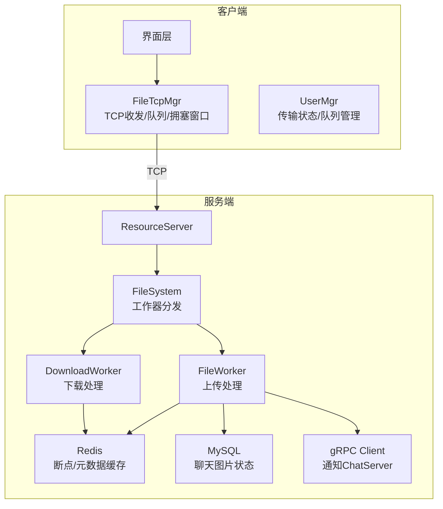
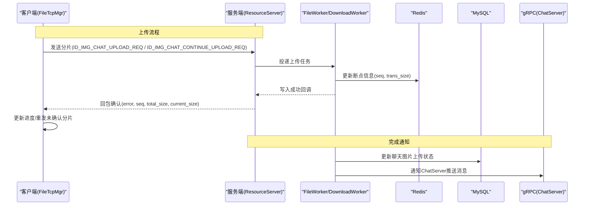
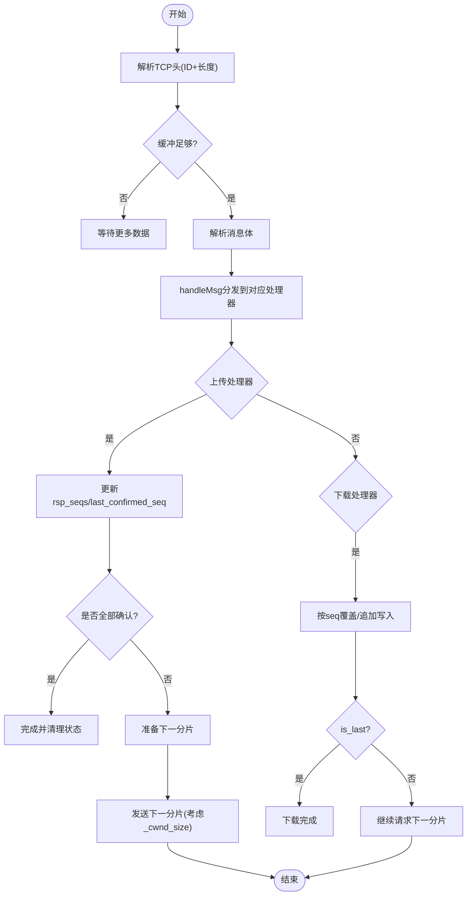
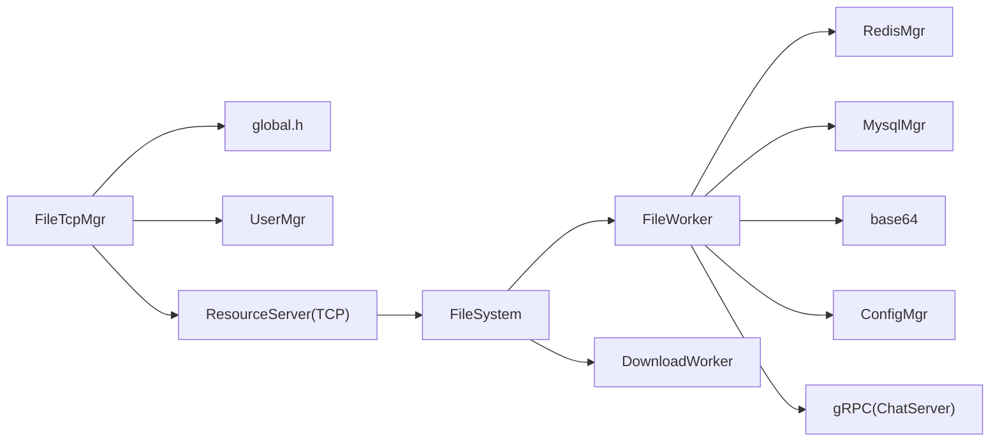

# 文件传输系统

<cite>
**本文引用的文件**   
- [filetcpmgr.h](file://client/llfcchat/include/filetcpmgr.h)
- [filetcpmgr.cpp](file://client/llfcchat/src/filetcpmgr.cpp)
- [global.h](file://client/llfcchat/include/global.h)
- [FileWorker.h](file://server/ResourceServer/include/FileWorker.h)
- [FileWorker.cpp](file://server/ResourceServer/src/FileWorker.cpp)
- [FileSystem.h](file://server/ResourceServer/include/FileSystem.h)
- [FileSystem.cpp](file://server/ResourceServer/src/FileSystem.cpp)
- [FileInfo.h](file://server/ResourceServer/include/FileInfo.h)
- [const.h](file://server/ResourceServer/include/const.h)
- [RedisMgr.h](file://server/ResourceServer/include/RedisMgr.h)
- [MysqlMgr.h](file://server/ResourceServer/include/MysqlMgr.h)
- [usermgr.cpp](file://client/llfcchat/src/usermgr.cpp)
</cite>

## 目录
1. [简介](#简介)
2. [项目结构](#项目结构)
3. [核心组件](#核心组件)
4. [架构总览](#架构总览)
5. [详细组件分析](#详细组件分析)
6. [依赖关系分析](#依赖关系分析)
7. [性能考量](#性能考量)
8. [故障排查指南](#故障排查指南)
9. [结论](#结论)
10. [附录](#附录)

## 简介
本技术文档面向 LLFCChat 项目的文件传输子系统，重点阐述断点续传机制、大文件分片策略、进度记录与恢复、并发控制、上传下载优化、服务端存储实现（文件系统、目录管理、权限控制、存储空间监控）、客户端传输管理器（队列、进度、暂停恢复、错误处理）以及安全校验、病毒扫描与配额管理等高级特性。文档以代码级为依据，结合架构图与时序图帮助读者快速理解整体设计与关键流程。

## 项目结构
- 客户端（Qt/C++）：通过 FileTcpMgr 维护与 ResourceServer 的 TCP 连接，负责分片发送、接收响应、更新进度、断点恢复与拥塞窗口控制。
- 服务端（C++）：ResourceServer 提供文件读写能力，使用 FileWorker/DownloadWorker 线程池异步处理上传/下载任务；通过 Redis 持久化断点信息；通过 MySQL 更新聊天图片上传状态；通过 gRPC 通知 ChatServer 推送消息。
- 协议与常量：全局常量定义分片大小、拥塞窗口上限、消息 ID、错误码等。



**图示来源** 
- [filetcpmgr.h:1-85](file://client/llfcchat/include/filetcpmgr.h#L1-L85)
- [filetcpmgr.cpp:1-140](file://client/llfcchat/src/filetcpmgr.cpp#L1-L140)
- [FileWorker.h:1-90](file://server/ResourceServer/include/FileWorker.h#L1-L90)
- [FileWorker.cpp:1-120](file://server/ResourceServer/src/FileWorker.cpp#L1-L120)
- [FileSystem.h:1-21](file://server/ResourceServer/include/FileSystem.h#L1-L21)
- [FileSystem.cpp:1-29](file://server/ResourceServer/src/FileSystem.cpp#L1-L29)
- [RedisMgr.h:269-313](file://server/ResourceServer/include/RedisMgr.h#L269-L313)
- [MysqlMgr.h:1-44](file://server/ResourceServer/include/MysqlMgr.h#L1-L44)

**章节来源**
- [filetcpmgr.h:1-85](file://client/llfcchat/include/filetcpmgr.h#L1-L85)
- [filetcpmgr.cpp:1-140](file://client/llfcchat/src/filetcpmgr.cpp#L1-L140)
- [FileWorker.h:1-90](file://server/ResourceServer/include/FileWorker.h#L1-L90)
- [FileWorker.cpp:1-120](file://server/ResourceServer/src/FileWorker.cpp#L1-L120)
- [FileSystem.h:1-21](file://server/ResourceServer/include/FileSystem.h#L1-L21)
- [FileSystem.cpp:1-29](file://server/ResourceServer/src/FileSystem.cpp#L1-L29)
- [RedisMgr.h:269-313](file://server/ResourceServer/include/RedisMgr.h#L269-L313)
- [MysqlMgr.h:1-44](file://server/ResourceServer/include/MysqlMgr.h#L1-L44)

## 核心组件
- 客户端 FileTcpMgr：封装 TCP 收发、粘包处理、发送队列、拥塞窗口、分片上传/下载、进度回调、断点恢复。
- 服务端 FileWorker/DownloadWorker：基于线程池的异步任务处理器，分别处理上传与下载请求，进行 Base64 编解码、文件读写、断点信息维护。
- FileSystem：工作器实例管理与任务分发，按文件名哈希选择具体 Worker。
- RedisMgr：连接池、键值存取、分布式锁、断点信息持久化（上传/下载）。
- MysqlMgr：聊天图片上传状态更新、用户头像更新。
- 全局常量与数据结构：MAX_FILE_LEN、拥塞窗口、ReqId、MsgInfo、FileInfo、DownloadInfo 等。

**章节来源**
- [filetcpmgr.h:1-85](file://client/llfcchat/include/filetcpmgr.h#L1-L85)
- [filetcpmgr.cpp:186-241](file://client/llfcchat/src/filetcpmgr.cpp#L186-L241)
- [FileWorker.h:14-90](file://server/ResourceServer/include/FileWorker.h#L14-L90)
- [FileWorker.cpp:49-112](file://server/ResourceServer/src/FileWorker.cpp#L49-L112)
- [FileSystem.h:7-21](file://server/ResourceServer/include/FileSystem.h#L7-L21)
- [RedisMgr.h:269-313](file://server/ResourceServer/include/RedisMgr.h#L269-L313)
- [MysqlMgr.h:1-44](file://server/ResourceServer/include/MysqlMgr.h#L1-L44)
- [global.h:15-25](file://client/llfcchat/include/global.h#L15-L25)
- [global.h:167-200](file://client/llfcchat/include/global.h#L167-L200)
- [global.h:284-291](file://client/llfcchat/include/global.h#L284-L291)
- [const.h:5-30](file://server/ResourceServer/include/const.h#L5-L30)
- [const.h:72-95](file://server/ResourceServer/include/const.h#L72-L95)
- [const.h:114-115](file://server/ResourceServer/include/const.h#L114-L115)

## 架构总览
文件传输采用“客户端分片 + 服务端异步写入”的模式：
- 客户端将文件按固定分片大小切分，逐片发送并等待服务器确认，支持拥塞窗口并发。
- 服务端通过 Redis 保存断点信息（序列号、已传字节数），确保网络异常后可从断点恢复。
- 下载时服务端按 seq 偏移读取文件片段，Base64 编码后返回客户端，客户端按顺序写入本地文件。
- 聊天图片上传完成后，通过 gRPC 通知 ChatServer 推送给在线接收者。



**图示来源** 
- [filetcpmgr.cpp:521-608](file://client/llfcchat/src/filetcpmgr.cpp#L521-L608)
- [filetcpmgr.cpp:610-693](file://client/llfcchat/src/filetcpmgr.cpp#L610-L693)
- [FileWorker.cpp:199-283](file://server/ResourceServer/src/FileWorker.cpp#L199-L283)
- [FileWorker.cpp:372-456](file://server/ResourceServer/src/FileWorker.cpp#L372-L456)
- [RedisMgr.h:303-313](file://server/ResourceServer/include/RedisMgr.h#L303-L313)
- [MysqlMgr.h:35-36](file://server/ResourceServer/include/MysqlMgr.h#L35-L36)

## 详细组件分析

### 客户端 FileTcpMgr：分片上传/下载、拥塞窗口、断点恢复
- 分片策略：固定分片大小 MAX_FILE_LEN（默认 32KB），计算最大序列号 max_seq = ceil(total_size / MAX_FILE_LEN)。
- 发送队列与拥塞窗口：_send_queue 为待发送块队列；_cwnd_size 控制并发未确认分片数量，避免拥塞。
- 粘包处理：接收缓冲区 _buffer 解析头部（ID+长度），循环读取完整报文体后分发到 handleMsg。
- 进度与断点：根据 last_confirmed_seq 与 rsp_seqs 集合推进进度；失败或暂停时保留 seq 与 trans_size，恢复时从断点继续。
- 下载流程：收到下载响应后按 seq 决定覆盖/追加写入，is_last 标志结束；若暂停则不自动继续。



**图示来源** 
- [filetcpmgr.cpp:16-55](file://client/llfcchat/src/filetcpmgr.cpp#L16-L55)
- [filetcpmgr.cpp:186-241](file://client/llfcchat/src/filetcpmgr.cpp#L186-L241)
- [filetcpmgr.cpp:521-608](file://client/llfcchat/src/filetcpmgr.cpp#L521-L608)
- [filetcpmgr.cpp:695-784](file://client/llfcchat/src/filetcpmgr.cpp#L695-L784)

**章节来源**
- [filetcpmgr.h:26-82](file://client/llfcchat/include/filetcpmgr.h#L26-L82)
- [filetcpmgr.cpp:16-55](file://client/llfcchat/src/filetcpmgr.cpp#L16-L55)
- [filetcpmgr.cpp:186-241](file://client/llfcchat/src/filetcpmgr.cpp#L186-L241)
- [filetcpmgr.cpp:521-608](file://client/llfcchat/src/filetcpmgr.cpp#L521-L608)
- [filetcpmgr.cpp:695-784](file://client/llfcchat/src/filetcpmgr.cpp#L695-L784)
- [global.h:15-25](file://client/llfcchat/include/global.h#L15-L25)
- [global.h:167-200](file://client/llfcchat/include/global.h#L167-L200)

### 服务端 FileWorker/DownloadWorker：异步任务与断点续传
- 任务模型：FileTask/DownloadTask 包含会话、消息类型、路径、名称、序列号、总大小、数据、回调等。
- 上传处理：Base64 解码 -> 创建目录 -> 首包 trunc 打开，后续包 append 写入 -> 最后包回调（更新数据库、通知 ChatServer）。
- 下载处理：首包获取文件大小并初始化 FileInfo 存入 Redis；续传时从 Redis 取断点，校验 seq，按 offset 读取分片，Base64 编码返回；完成时删除 Redis 断点。
- 并发控制：多个 FileWorker/DownloadWorker 实例，按文件名哈希分配任务，提升吞吐。

```mermaid
classDiagram
class FileTask {
+shared_ptr<CSession> _session
+MSG_IDS _msg_id
+int _uid
+string _path
+string _name
+int _seq
+int _total_size
+int _trans_size
+int _last
+string _file_data
+function<void(Json : : Value)> _callback
+int _chat_msg_id
+int _sender
+int _receiver
+int _thread_id
}
class DownloadTask {
+shared_ptr<CSession> _session
+int _uid
+string _name
+int _seq
+string _file_path
+function<void(Json : : Value)> _callback
}
class FileWorker {
+RegisterHandlers()
+PostTask(shared_ptr<FileTask>)
-task_callback(shared_ptr<FileTask>)
-queue<std : : function<void()>> _task_que
-mutex _mtx
-condition_variable _cv
}
class DownloadWorker {
+PostTask(shared_ptr<DownloadTask>)
-task_callback(shared_ptr<DownloadTask>)
-queue<shared_ptr<DownloadTask>> _task_que
-mutex _mtx
-condition_variable _cv
}
FileWorker --> FileTask : "处理"
DownloadWorker --> DownloadTask : "处理"
```

**图示来源** 
- [FileWorker.h:14-56](file://server/ResourceServer/include/FileWorker.h#L14-L56)
- [FileWorker.h:58-90](file://server/ResourceServer/include/FileWorker.h#L58-L90)
- [FileWorker.cpp:12-47](file://server/ResourceServer/src/FileWorker.cpp#L12-L47)
- [FileWorker.cpp:483-516](file://server/ResourceServer/src/FileWorker.cpp#L483-L516)

**章节来源**
- [FileWorker.h:14-90](file://server/ResourceServer/include/FileWorker.h#L14-L90)
- [FileWorker.cpp:49-112](file://server/ResourceServer/src/FileWorker.cpp#L49-L112)
- [FileWorker.cpp:528-663](file://server/ResourceServer/src/FileWorker.cpp#L528-L663)

### FileSystem：工作器分发与实例管理
- 构造时创建固定数量的 FileWorker 与 DownloadWorker。
- PostMsgToQue/PostDownloadTaskToQue 按 index 路由到对应工作器，index 由上层按文件名哈希计算得到。

**章节来源**
- [FileSystem.h:7-21](file://server/ResourceServer/include/FileSystem.h#L7-L21)
- [FileSystem.cpp:19-29](file://server/ResourceServer/src/FileSystem.cpp#L19-L29)

### 全局常量与数据结构：分片大小、拥塞窗口、消息ID、错误码
- 分片大小：MAX_FILE_LEN=32KB（客户端与服务端一致）。
- 拥塞窗口：MAX_CWND_SIZE=5，限制并发未确认分片数量。
- 消息ID：ReqId 与 MSG_IDS 定义上传/下载/同步/通知等消息类型。
- 错误码：ErrorCodes 统一错误码，涵盖 JSON、网络、文件、Redis、权限等。

**章节来源**
- [global.h:15-25](file://client/llfcchat/include/global.h#L15-L25)
- [global.h:43-88](file://client/llfcchat/include/global.h#L43-L88)
- [const.h:5-30](file://server/ResourceServer/include/const.h#L5-L30)
- [const.h:72-95](file://server/ResourceServer/include/const.h#L72-L95)
- [const.h:114-115](file://server/ResourceServer/include/const.h#L114-L115)

### 客户端 UserMgr：传输状态与队列管理
- 维护当前用户信息、Token、好友列表、申请列表等。
- 提供获取/设置用户名、昵称、头像等方法；在文件传输中用于查询 UID、Token、检查上传状态等。

**章节来源**
- [usermgr.cpp:10-53](file://client/llfcchat/src/usermgr.cpp#L10-L53)
- [usermgr.cpp:61-65](file://client/llfcchat/src/usermgr.cpp#L61-L65)

## 依赖关系分析
- 客户端依赖：
  - FileTcpMgr 依赖 global.h（常量、数据结构）、UserMgr（用户信息与状态）。
  - 通过 QTcpSocket 与 ResourceServer 通信。
- 服务端依赖：
  - FileWorker/DownloadWorker 依赖 RedisMgr（断点/元数据）、MysqlMgr（聊天图片状态）、ConfigMgr（路径配置）、base64（编解码）。
  - FileSystem 依赖 FileWorker/DownloadWorker 实例。
  - 通过 gRPC 与 ChatServer 交互，推送聊天图片消息。



**图示来源** 
- [filetcpmgr.h:1-85](file://client/llfcchat/include/filetcpmgr.h#L1-L85)
- [global.h:15-25](file://client/llfcchat/include/global.h#L15-L25)
- [usermgr.cpp:10-53](file://client/llfcchat/src/usermgr.cpp#L10-L53)
- [FileWorker.h:1-90](file://server/ResourceServer/include/FileWorker.h#L1-L90)
- [RedisMgr.h:269-313](file://server/ResourceServer/include/RedisMgr.h#L269-L313)
- [MysqlMgr.h:1-44](file://server/ResourceServer/include/MysqlMgr.h#L1-L44)

**章节来源**
- [filetcpmgr.h:1-85](file://client/llfcchat/include/filetcpmgr.h#L1-L85)
- [global.h:15-25](file://client/llfcchat/include/global.h#L15-L25)
- [usermgr.cpp:10-53](file://client/llfcchat/src/usermgr.cpp#L10-L53)
- [FileWorker.h:1-90](file://server/ResourceServer/include/FileWorker.h#L1-L90)
- [RedisMgr.h:269-313](file://server/ResourceServer/include/RedisMgr.h#L269-L313)
- [MysqlMgr.h:1-44](file://server/ResourceServer/include/MysqlMgr.h#L1-L44)

## 性能考量
- 分片大小：MAX_FILE_LEN=32KB，平衡内存占用与网络开销，适合大多数场景。
- 拥塞窗口：MAX_CWND_SIZE=5，限制并发未确认分片，避免网络拥塞与丢包重传风暴。
- 多线程：服务端 FileWorker/DownloadWorker 多实例并行处理，提高吞吐。
- 缓冲区管理：客户端使用 QDataStream 与 QByteArray 缓冲，减少拷贝；服务端使用二进制流直接写入。
- 带宽控制：可通过调整 MAX_CWND_SIZE 与分片大小适配不同网络环境。
- 内存优化：Base64 编解码仅在必要阶段进行，避免全量加载大文件。

[本节为通用指导，无需特定文件引用]

## 故障排查指南
- 连接问题：
  - 客户端错误回调区分拒绝、关闭、超时、主机未知等，触发 sig_con_success(false) 信号。
- 解析错误：
  - JSON 解析失败返回 ERR_JSON，需检查消息格式与字段完整性。
- 文件操作错误：
  - 权限不足、路径不存在、偏移无效、读取失败等错误码明确，检查路径与权限。
- Redis 错误：
  - 连接池健康检查与自动重连；断点读取失败返回 RedisReadErr。
- 下载中断：
  - 检查 is_last 标志与 seq 一致性；确认 Redis 断点信息是否存在。
- 上传未完成：
  - 检查 last_confirmed_seq 与 max_seq 是否相等；确认服务器回调是否执行。

**章节来源**
- [filetcpmgr.cpp:65-93](file://client/llfcchat/src/filetcpmgr.cpp#L65-L93)
- [filetcpmgr.cpp:246-288](file://client/llfcchat/src/filetcpmgr.cpp#L246-L288)
- [FileWorker.cpp:67-112](file://server/ResourceServer/src/FileWorker.cpp#L67-L112)
- [FileWorker.cpp:540-553](file://server/ResourceServer/src/FileWorker.cpp#L540-L553)
- [RedisMgr.h:139-208](file://server/ResourceServer/include/RedisMgr.h#L139-L208)

## 结论
LLFCChat 的文件传输系统通过稳定的分片策略、可靠的断点续传、合理的并发控制与完善的错误处理，实现了高效、健壮的大文件上传/下载能力。服务端采用多线程与 Redis 持久化保障高可用与可恢复性，客户端通过拥塞窗口与队列管理提升用户体验。未来可在安全验证、病毒扫描、配额管理等方面进一步增强。

[本节为总结，无需特定文件引用]

## 附录
- 分片大小与拥塞窗口参数建议：
  - MAX_FILE_LEN：32KB（默认），可根据网络延迟与带宽调整。
  - MAX_CWND_SIZE：5（默认），高延迟网络可适当降低，低延迟网络可适当提高。
- 错误码参考：
  - ErrorCodes 涵盖 JSON、网络、文件、Redis、权限等常见错误，便于定位问题。
- 消息ID参考：
  - ReqId 与 MSG_IDS 定义了完整的上传/下载/同步/通知消息类型，便于扩展与维护。

[本节为补充信息，无需特定文件引用]