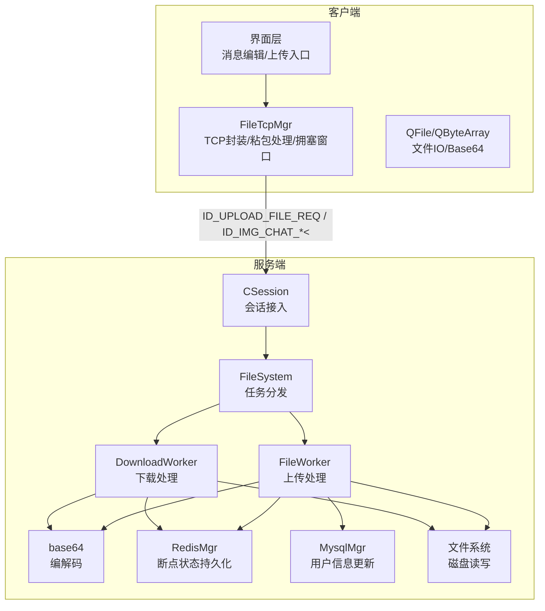
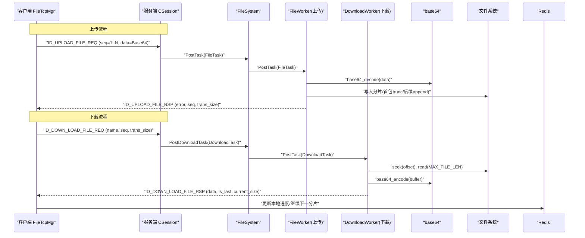
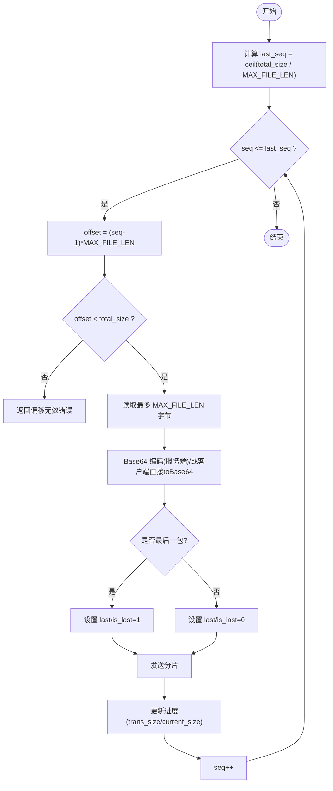
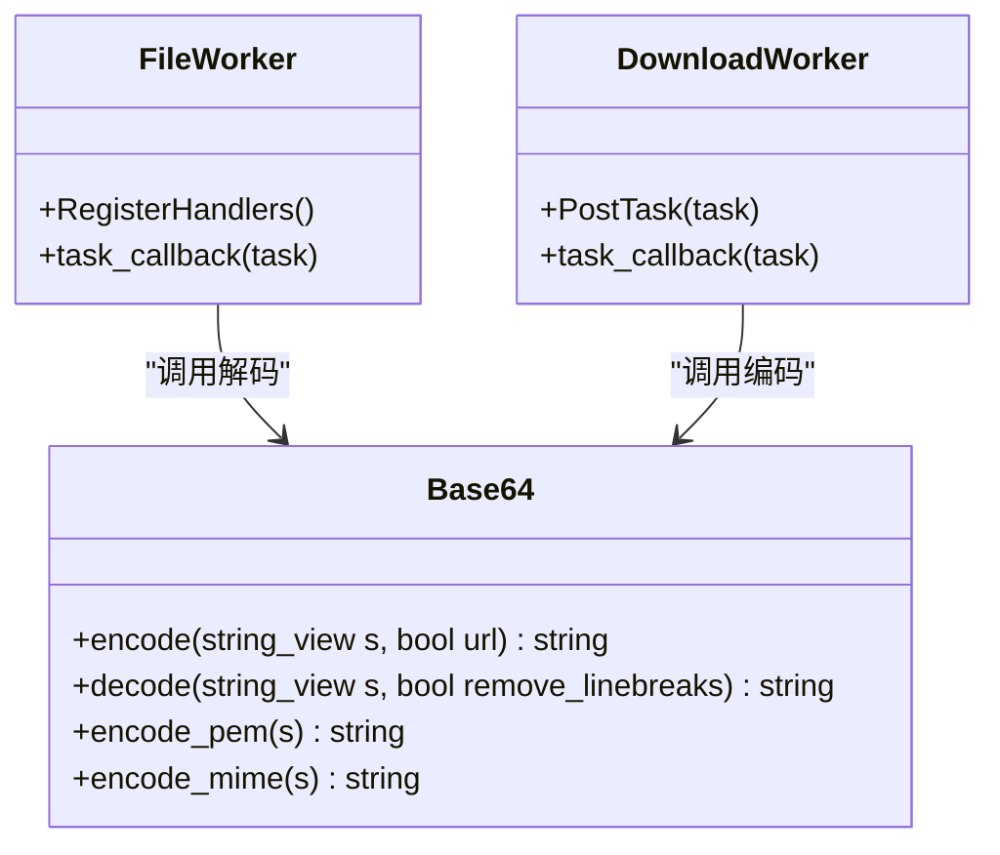
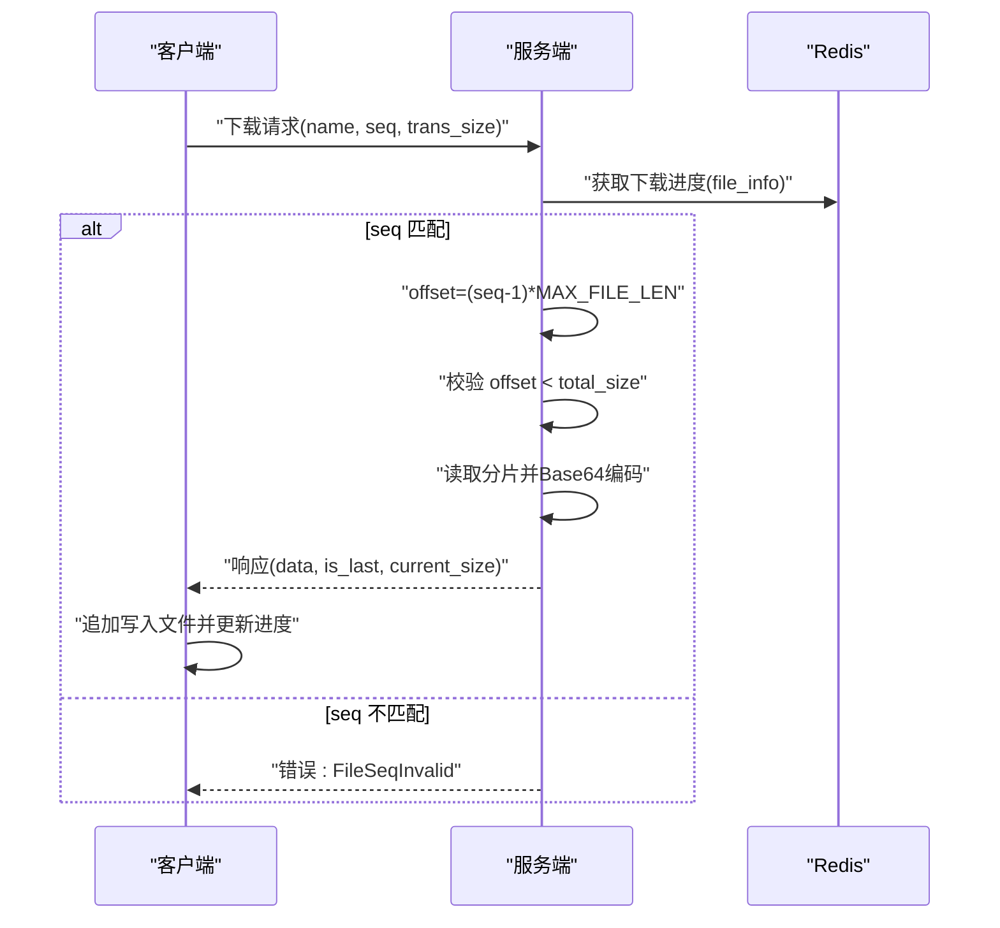
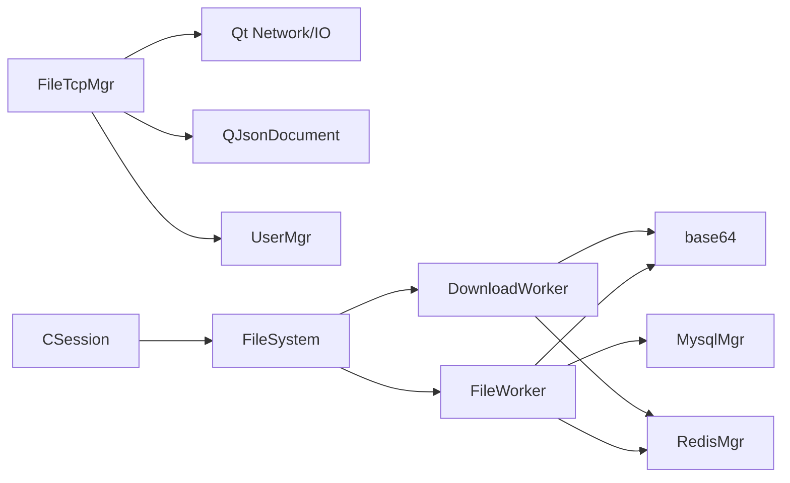

# 文件分片传输

<cite>
**本文引用的文件**   
- [filetcpmgr.h](file://client/llfcchat/include/filetcpmgr.h)
- [filetcpmgr.cpp](file://client/llfcchat/src/filetcpmgr.cpp)
- [global.h](file://client/llfcchat/include/global.h)
- [FileWorker.h](file://server/ResourceServer/include/FileWorker.h)
- [FileWorker.cpp](file://server/ResourceServer/src/FileWorker.cpp)
- [FileSystem.cpp](file://server/ResourceServer/src/FileSystem.cpp)
- [base64.h](file://server/ResourceServer/include/base64.h)
- [base64.cpp](file://server/ResourceServer/src/base64.cpp)
- [FileInfo.h](file://server/ResourceServer/include/FileInfo.h)
- [const.h](file://server/ResourceServer/include/const.h)
- [config.ini](file://server/ResourceServer/config/config.ini)
- [day31-文件传输.md](file://开发文档/day31-文件传输.md)
- [day38-断点续传.md](file://开发文档/day38-断点续传.md)
- [day41-通知客户端异步下载聊天图片.md](file://开发文档/day41-通知客户端异步下载聊天图片.md)
</cite>

## 目录
1. [简介](#简介)
2. [项目结构](#项目结构)
3. [核心组件](#核心组件)
4. [架构总览](#架构总览)
5. [详细组件分析](#详细组件分析)
6. [依赖关系分析](#依赖关系分析)
7. [性能考量](#性能考量)
8. [故障排查指南](#故障排查指南)
9. [结论](#结论)
10. [附录](#附录)

## 简介
本技术文档围绕 LLFCChat 项目的“文件分片传输系统”展开，重点覆盖以下方面：
- 大文件分片策略设计：分片大小、分片数量计算、边界条件处理与断点续传。
- Base64 编码解码优化：内存管理、缓冲区复用、编码效率提升建议。
- 顺序控制与乱序处理：序列号机制、完整性校验与重放保护。
- 校验和验证算法：MD5 校验、CRC 校验、哈希验证等方案与落地现状。
- 错误重试机制：超时处理、网络异常恢复、数据一致性保证。
- 性能优化策略：并行传输、批量处理、内存池管理等。
- 配置参数调优与监控指标：关键常量、配置文件项与可观测性建议。

## 项目结构
LLFCChat 的文件分片传输涉及客户端与服务端两个侧：
- 客户端（Qt/C++）：负责文件读取、Base64 编码、按分片发送、接收响应并实现断点续传。
- 服务端（C++/Asio + Redis/Mysql）：负责接收分片、Base64 解码、落盘、进度持久化、并发处理。

图表来源
- [filetcpmgr.h](file://client/llfcchat/include/filetcpmgr.h)
- [filetcpmgr.cpp](file://client/llfcchat/src/filetcpmgr.cpp)
- [FileWorker.h](file://server/ResourceServer/include/FileWorker.h)
- [FileWorker.cpp](file://server/ResourceServer/src/FileWorker.cpp)
- [FileSystem.cpp](file://server/ResourceServer/src/FileSystem.cpp)
- [base64.h](file://server/ResourceServer/include/base64.h)
- [base64.cpp](file://server/ResourceServer/src/base64.cpp)
- [FileInfo.h](file://server/ResourceServer/include/FileInfo.h)
- [const.h](file://server/ResourceServer/include/const.h)

章节来源
- [filetcpmgr.h:1-85](file://client/llfcchat/include/filetcpmgr.h#L1-L85)
- [filetcpmgr.cpp:1-200](file://client/llfcchat/src/filetcpmgr.cpp#L1-L200)
- [FileWorker.h:1-90](file://server/ResourceServer/include/FileWorker.h#L1-L90)
- [FileWorker.cpp:1-200](file://server/ResourceServer/src/FileWorker.cpp#L1-L200)
- [FileSystem.cpp:1-28](file://server/ResourceServer/src/FileSystem.cpp#L1-L28)
- [base64.h:1-36](file://server/ResourceServer/include/base64.h#L1-L36)
- [base64.cpp:1-282](file://server/ResourceServer/src/base64.cpp#L1-L282)
- [FileInfo.h:1-26](file://server/ResourceServer/include/FileInfo.h#L1-L26)
- [const.h:1-117](file://server/ResourceServer/include/const.h#L1-L117)

## 核心组件
- 客户端 FileTcpMgr：封装 TCP 连接、粘包/拆包、发送队列与拥塞窗口控制，提供上传/下载的接口与回调。
- 服务端 FileWorker/DownloadWorker：基于线程+队列的 Worker 模型，分别处理上传与下载任务，进行 Base64 编解码与文件 IO。
- FileSystem：维护多个 FileWorker 与 DownloadWorker，将请求分发到不同 worker 以并行处理。
- base64：提供字符串与字节数组的 Base64 编解码接口。
- FileInfo：描述分片传输元数据（序列号、文件名、总大小、已传输大小、路径）。
- const：定义错误码、消息 ID、分片大小、Worker 数量等关键常量。

章节来源
- [filetcpmgr.h:1-85](file://client/llfcchat/include/filetcpmgr.h#L1-L85)
- [filetcpmgr.cpp:200-400](file://client/llfcchat/src/filetcpmgr.cpp#L200-L400)
- [FileWorker.h:1-90](file://server/ResourceServer/include/FileWorker.h#L1-L90)
- [FileWorker.cpp:1-200](file://server/ResourceServer/src/FileWorker.cpp#L1-L200)
- [FileSystem.cpp:1-28](file://server/ResourceServer/src/FileSystem.cpp#L1-L28)
- [base64.h:1-36](file://server/ResourceServer/include/base64.h#L1-L36)
- [FileInfo.h:1-26](file://server/ResourceServer/include/FileInfo.h#L1-L26)
- [const.h:1-117](file://server/ResourceServer/include/const.h#L1-L117)

## 架构总览
下图展示了从客户端发起上传到服务端落盘的端到端流程，以及下载的反向流程。

图表来源
- [filetcpmgr.cpp:200-400](file://client/llfcchat/src/filetcpmgr.cpp#L200-L400)
- [FileWorker.cpp:1-200](file://server/ResourceServer/src/FileWorker.cpp#L1-L200)
- [FileSystem.cpp:1-28](file://server/ResourceServer/src/FileSystem.cpp#L1-L28)
- [base64.cpp:1-282](file://server/ResourceServer/src/base64.cpp#L1-L282)
- [day38-断点续传.md:2875-3131](file://开发文档/day38-断点续传.md#L2875-L3131)
- [day41-通知客户端异步下载聊天图片.md:571-836](file://开发文档/day41-通知客户端异步下载聊天图片.md#L571-L836)

## 详细组件分析

### 分片策略与边界处理
- 分片大小：通过常量 MAX_FILE_LEN 统一控制，客户端与服务端均按此大小切分与读取。
- 分片数量：根据 total_size 与 MAX_FILE_LEN 计算 last_seq；当 total_size % MAX_FILE_LEN != 0 时，last_seq = total_size/MAX_FILE_LEN + 1，否则为整除值。
- 边界条件：最后一个分片可能小于 MAX_FILE_LEN；is_last/last 标志用于标识结束；偏移量 offset = (seq-1)*MAX_FILE_LEN，需校验 offset < total_size。
- 断点续传：客户端记录 trans_size 与 seq，服务端在 Redis 中保存下载/上传进度，支持中断后从指定偏移继续。

图表来源
- [global.h:1-41](file://client/llfcchat/include/global.h#L1-L41)
- [const.h:1-117](file://server/ResourceServer/include/const.h#L1-L117)
- [day31-文件传输.md:1-200](file://开发文档/day31-文件传输.md#L1-L200)
- [day38-断点续传.md:2875-3131](file://开发文档/day38-断点续传.md#L2875-L3131)

章节来源
- [global.h:1-41](file://client/llfcchat/include/global.h#L1-L41)
- [const.h:1-117](file://server/ResourceServer/include/const.h#L1-L117)
- [day31-文件传输.md:1-200](file://开发文档/day31-文件传输.md#L1-L200)
- [day38-断点续传.md:2875-3131](file://开发文档/day38-断点续传.md#L2875-L3131)

### Base64 编解码优化
- 现状：服务端使用 base64_encode/base64_decode 对分片数据进行编解码；客户端使用 Qt 的 toBase64/fromBase64。
- 内存管理：避免重复分配，尽量复用 buffer；在服务端可将解码结果直接写入文件流，减少中间拷贝。
- 缓冲区复用：在循环中重用 string/buffer 对象，减少频繁构造析构开销。
- 编码效率：对于二进制数据，优先使用流式编码；若网络允许，考虑二进制协议替代 Base64 以降低 33% 体积膨胀。
- URL/MIME 模式：根据场景选择 url 或 mime 模式，避免额外转义。

图表来源
- [base64.h:1-36](file://server/ResourceServer/include/base64.h#L1-L36)
- [base64.cpp:1-282](file://server/ResourceServer/src/base64.cpp#L1-L282)
- [FileWorker.cpp:1-200](file://server/ResourceServer/src/FileWorker.cpp#L1-L200)

章节来源
- [base64.h:1-36](file://server/ResourceServer/include/base64.h#L1-L36)
- [base64.cpp:1-282](file://server/ResourceServer/src/base64.cpp#L1-L282)
- [FileWorker.cpp:1-200](file://server/ResourceServer/src/FileWorker.cpp#L1-L200)

### 顺序控制与乱序处理
- 序列号 seq：每个分片携带 seq，服务端据此定位偏移并顺序写入；客户端依据 last_seq 判断结束。
- 完整性校验：服务端校验 seq 与 Redis 中的期望 seq 一致，防止乱序或重放；若不一致返回 FileSeqInvalid。
- 偏移校验：offset >= total_size 时返回 FileOffsetInvalid，避免越界写入。
- 最后分片标记：is_last/last 字段确保客户端正确终止循环。

图表来源
- [day38-断点续传.md:2875-3131](file://开发文档/day38-断点续传.md#L2875-L3131)
- [day41-通知客户端异步下载聊天图片.md:571-836](file://开发文档/day41-通知客户端异步下载聊天图片.md#L571-L836)

章节来源
- [day38-断点续传.md:2875-3131](file://开发文档/day38-断点续传.md#L2875-L3131)
- [day41-通知客户端异步下载聊天图片.md:571-836](file://开发文档/day41-通知客户端异步下载聊天图片.md#L571-L836)

### 校验和验证算法
- MD5：客户端在上传前计算文件 MD5，并在 JSON 中携带 md5 字段，便于服务端或后续阶段做一致性校验。
- CRC 校验：当前代码未显式实现 CRC；可在分片级增加 CRC32 校验以提升传输可靠性。
- 哈希验证：建议在最终文件完成后进行全量哈希校验（如 SHA256），确保端到端一致性。
- 现状：服务端主要依赖 seq 与 Redis 进度保证顺序与完整性；MD5 可用于跨进程/跨设备校验。

章节来源
- [day31-文件传输.md:1-200](file://开发文档/day31-文件传输.md#L1-L200)
- [MessageTextEdit.cpp:175-227](file://client/llfcchat/src/MessageTextEdit.cpp#L175-L227)

### 错误重试机制
- 网络异常：客户端监听 QTcpSocket::error/disconnected，区分拒绝、关闭、超时等错误类型并上报。
- 超时处理：可通过心跳与定时器检测空闲连接；服务端定时清理过期会话。
- 数据一致性：失败时保留 Redis 中的进度，客户端根据 trans_size 与 seq 重试；服务端校验 seq 与 offset 合法性。
- 重试策略：指数退避 + 最大重试次数；对幂等操作（如续传）更安全。

章节来源
- [filetcpmgr.cpp:1-200](file://client/llfcchat/src/filetcpmgr.cpp#L1-L200)
- [day35心跳逻辑.md:41-93](file://开发文档/day35心跳逻辑.md#L41-L93)

### 并发与并行传输
- 服务端 Worker：FileSystem 初始化多个 FileWorker 与 DownloadWorker，通过 PostTask 分发任务，提高吞吐。
- 客户端拥塞窗口：_cwnd_size 限制同时发送的分片数，避免拥塞；bytesWritten 回调驱动队列出队。
- 批量处理：可按批聚合小分片以减少序列化/网络开销（需权衡延迟）。

章节来源
- [FileSystem.cpp:1-28](file://server/ResourceServer/src/FileSystem.cpp#L1-L28)
- [filetcpmgr.cpp:200-400](file://client/llfcchat/src/filetcpmgr.cpp#L200-L400)
- [const.h:1-117](file://server/ResourceServer/include/const.h#L1-L117)

## 依赖关系分析
- 客户端依赖 Qt 网络与 IO 库，使用 QJsonDocument 解析响应，UserMgr 管理上传/下载元数据。
- 服务端依赖 Asio、jsoncpp、Boost.Filesystem、Redis、MySQL；Redis 用于断点状态，MySQL 用于用户信息更新。
- 模块间通过消息 ID 解耦，Handler 映射实现职责分离。

图表来源
- [filetcpmgr.h:1-85](file://client/llfcchat/include/filetcpmgr.h#L1-L85)
- [FileWorker.h:1-90](file://server/ResourceServer/include/FileWorker.h#L1-L90)
- [FileSystem.cpp:1-28](file://server/ResourceServer/src/FileSystem.cpp#L1-L28)
- [base64.h:1-36](file://server/ResourceServer/include/base64.h#L1-L36)

章节来源
- [filetcpmgr.h:1-85](file://client/llfcchat/include/filetcpmgr.h#L1-L85)
- [FileWorker.h:1-90](file://server/ResourceServer/include/FileWorker.h#L1-L90)
- [FileSystem.cpp:1-28](file://server/ResourceServer/src/FileSystem.cpp#L1-L28)
- [base64.h:1-36](file://server/ResourceServer/include/base64.h#L1-L36)

## 性能考量
- 分片大小调优：MAX_FILE_LEN 影响内存占用与网络往返；建议根据带宽与 RTT 调整（当前为 32KB）。
- Base64 开销：编码/解码 CPU 消耗较大；可考虑二进制协议或 GPU 加速编码。
- 并发度：FILE_WORKER_COUNT/DOWN_LOAD_WORKER_COUNT 应与 CPU 核数匹配；过高会导致上下文切换开销。
- 拥塞控制：MAX_CWND_SIZE 限制并发分片，避免丢包重传；可根据链路质量动态调整。
- I/O 缓冲：服务端使用流式写入，避免多余拷贝；客户端注意 QByteArray 的扩容策略。
- 缓存命中：Redis 断点信息应设置合理过期时间，避免脏数据导致续传失败。

[本节为通用指导，无需具体文件引用]

## 故障排查指南
- 常见错误码：
  - FileSeqInvalid：序列号不匹配，检查 Redis 中的期望 seq 与客户端传入 seq。
  - FileOffsetInvalid：偏移量超出文件大小，检查 total_size 与 offset 计算。
  - FileReadFailed/FileWritePermissionFailed：文件权限或路径问题，检查目录创建与权限。
  - RedisReadErr：Redis 读取失败，检查连接与键是否存在。
- 日志定位：
  - 客户端：打印 _message_id/_message_len 与 handleMsg 路由，确认粘包/拆包正常。
  - 服务端：Worker 回调中输出 seq/trans_size/total_size 与 is_last，确认分片边界。
- 网络问题：
  - 检查 error/disconnected 事件，区分拒绝、关闭、超时等类型。
  - 心跳与超时：确保客户端/服务端心跳正常，及时清理僵尸连接。

章节来源
- [const.h:1-117](file://server/ResourceServer/include/const.h#L1-L117)
- [filetcpmgr.cpp:1-200](file://client/llfcchat/src/filetcpmgr.cpp#L1-L200)
- [day38-断点续传.md:2875-3131](file://开发文档/day38-断点续传.md#L2875-L3131)

## 结论
LLFCChat 的文件分片传输系统通过固定分片大小、序列号与 Redis 断点状态，实现了可靠的上传与下载能力。Base64 编解码在当前实现中较为简单，但具备优化空间。顺序控制与边界处理完善，错误码体系清晰。未来可引入 CRC/SHA256 校验、二进制协议、动态拥塞控制与更细粒度的监控指标，进一步提升性能与健壮性。

[本节为总结，无需具体文件引用]

## 附录
- 关键常量与配置：
  - MAX_FILE_LEN：分片大小（默认 32KB）
  - FILE_UPLOAD_HEAD_LEN：TCP 包头长度（6 字节）
  - MAX_CWND_SIZE：最大拥塞窗口（默认 5）
  - FILE_WORKER_COUNT/DOWN_LOAD_WORKER_COUNT：Worker 数量（默认 4）
  - config.ini：服务端口、Redis/MySQL 连接信息
- 监控指标建议：
  - 分片成功率、平均分片耗时、重传率
  - Base64 编解码 CPU 占用、内存峰值
  - Redis 命中率与过期键数量
  - 网络吞吐与 RTT

章节来源
- [global.h:1-41](file://client/llfcchat/include/global.h#L1-L41)
- [const.h:1-117](file://server/ResourceServer/include/const.h#L1-L117)
- [config.ini:1-26](file://server/ResourceServer/config/config.ini#L1-L26)