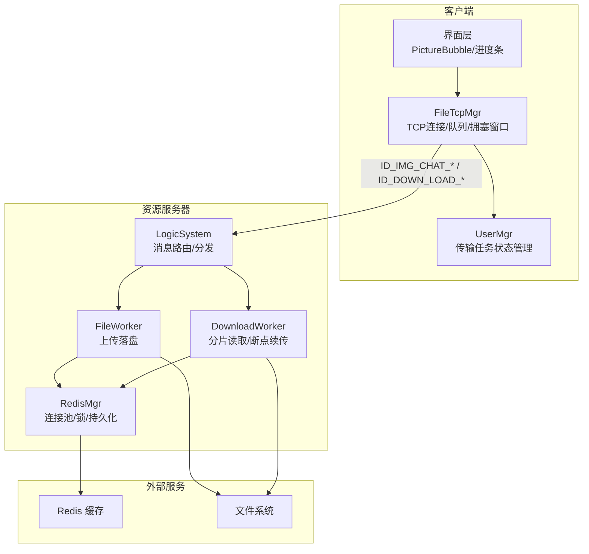
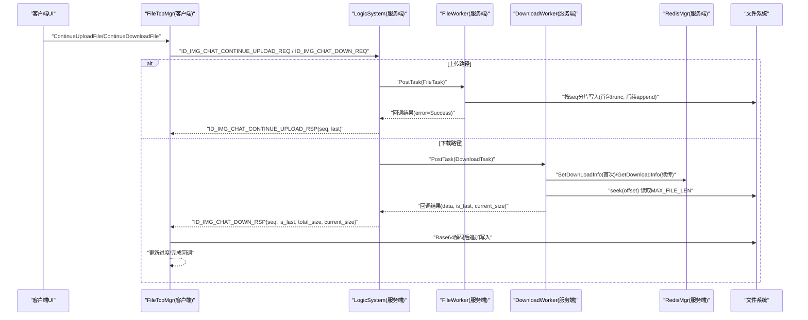
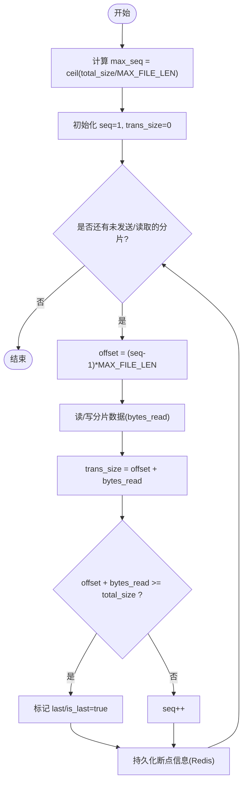
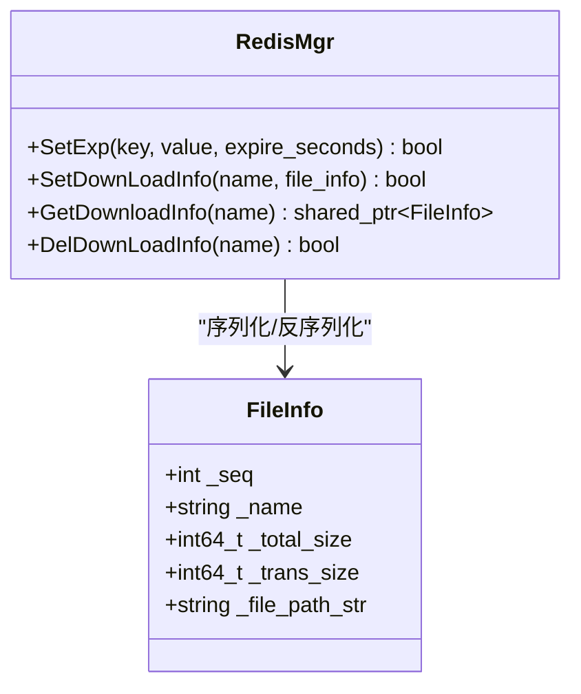
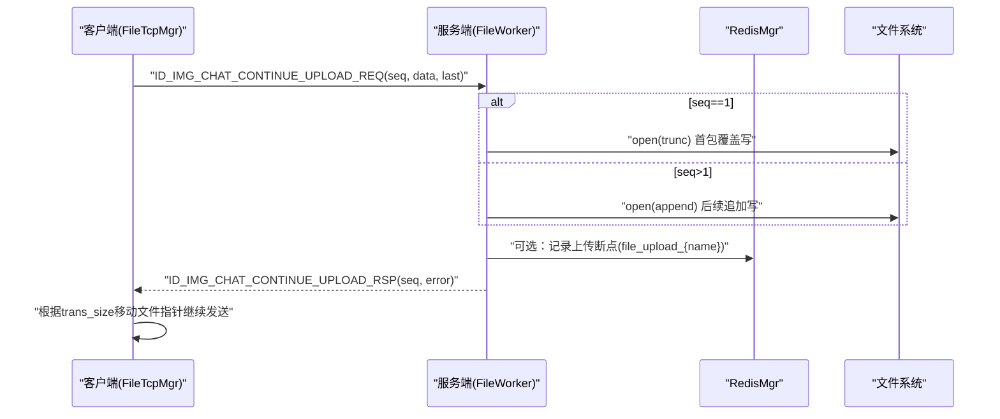
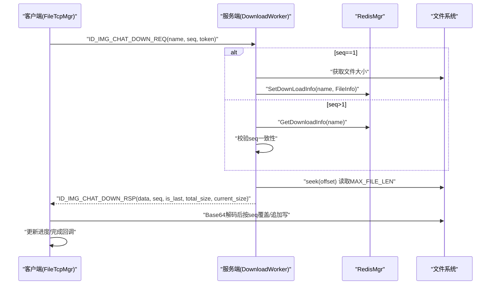
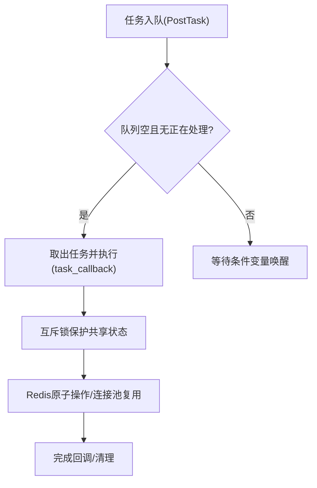
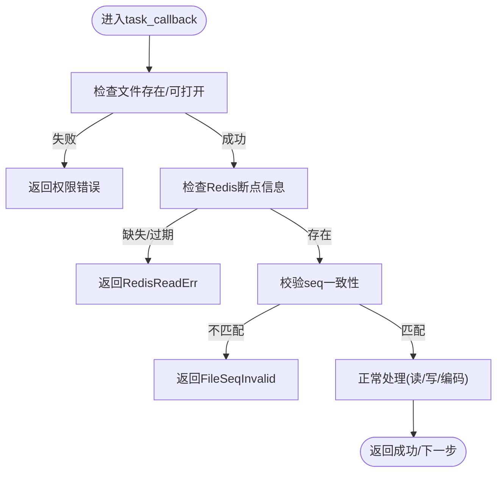
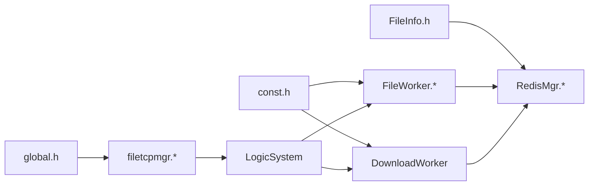

# 断点续传机制

<cite>
**本文引用的文件**   
- [filetcpmgr.h](file://client/llfcchat/include/filetcpmgr.h)
- [filetcpmgr.cpp](file://client/llfcchat/src/filetcpmgr.cpp)
- [global.h](file://client/llfcchat/include/global.h)
- [FileWorker.h](file://server/ResourceServer/include/FileWorker.h)
- [FileWorker.cpp](file://server/ResourceServer/src/FileWorker.cpp)
- [RedisMgr.h](file://server/ResourceServer/include/RedisMgr.h)
- [RedisMgr.cpp](file://server/ResourceServer/src/RedisMgr.cpp)
- [FileInfo.h](file://server/ResourceServer/include/FileInfo.h)
- [const.h](file://server/ResourceServer/include/const.h)
- [day38-断点续传.md](file://开发文档/day38-断点续传.md)
- [day40-聊天图片资源续传和进度显示.md](file://开发文档/day40-聊天图片资源续传和进度显示.md)
- [day41-通知客户端异步下载聊天图片.md](file://开发文档/day41-通知客户端异步下载聊天图片.md)
</cite>

## 目录
1. [简介](#简介)
2. [项目结构](#项目结构)
3. [核心组件](#核心组件)
4. [架构总览](#架构总览)
5. [详细组件分析](#详细组件分析)
6. [依赖关系分析](#依赖关系分析)
7. [性能考量](#性能考量)
8. [故障排查指南](#故障排查指南)
9. [结论](#结论)
10. [附录](#附录)

## 简介
本技术文档围绕 LLFCChat 项目的断点续传机制，系统性阐述其核心实现原理与工程实践。内容涵盖：
- 文件分片策略、序列号管理与偏移量计算
- Redis 在断点续传中的作用（存储下载信息、状态同步、过期清理）
- 上传与下载的断点恢复流程（断点检测、偏移量计算、数据完整性校验）
- 并发控制机制（防止多进程同时修改同一文件的下载进度）
- 异常处理示例（网络中断、磁盘写入失败等）
- 断点信息的持久化策略与清理机制（避免内存泄漏与存储空间浪费）

## 项目结构
本项目采用前后端分离的架构：
- 客户端（Qt/C++）负责 UI、网络收发、分片发送与接收、进度展示与暂停/继续控制
- 资源服务器（C++）负责文件落盘、分片读取、断点进度记录与返回
- Redis 作为分布式缓存，用于跨进程/跨实例的状态同步与断点信息持久化

**图表来源** 
- [filetcpmgr.h:1-85](file://client/llfcchat/include/filetcpmgr.h#L1-L85)
- [filetcpmgr.cpp:1-143](file://client/llfcchat/src/filetcpmgr.cpp#L1-L143)
- [FileWorker.h:1-90](file://server/ResourceServer/include/FileWorker.h#L1-L90)
- [FileWorker.cpp:1-300](file://server/ResourceServer/src/FileWorker.cpp#L1-L300)
- [RedisMgr.h:1-313](file://server/ResourceServer/include/RedisMgr.h#L1-L313)
- [RedisMgr.cpp:1-115](file://server/ResourceServer/src/RedisMgr.cpp#L1-L115)

**章节来源**
- [filetcpmgr.h:1-85](file://client/llfcchat/include/filetcpmgr.h#L1-L85)
- [filetcpmgr.cpp:1-143](file://client/llfcchat/src/filetcpmgr.cpp#L1-L143)
- [FileWorker.h:1-90](file://server/ResourceServer/include/FileWorker.h#L1-L90)
- [FileWorker.cpp:1-300](file://server/ResourceServer/src/FileWorker.cpp#L1-L300)
- [RedisMgr.h:1-313](file://server/ResourceServer/include/RedisMgr.h#L1-L313)
- [RedisMgr.cpp:1-115](file://server/ResourceServer/src/RedisMgr.cpp#L1-L115)

## 核心组件
- FileTcpMgr（客户端）
  - 维护 TCP 连接、发送队列、字节计数与拥塞窗口，提供断点续传的“继续上传/下载”接口
  - 处理下载回包并追加写入本地文件，更新进度与完成回调
- FileWorker（服务端）
  - 处理上传请求，按 seq 分片落盘；首个包覆盖写，后续包追加写
- DownloadWorker（服务端）
  - 处理下载请求，基于 Redis 中的断点信息定位偏移量，分片读取并 Base64 编码返回
- RedisMgr（服务端）
  - 封装 Redis 操作（SET/GET/SETEX/HSET/HDEL/Del），提供 SetDownLoadInfo/GetDownloadInfo/DelDownLoadInfo 等接口
- FileInfo（数据结构）
  - 保存文件名、seq、total_size、trans_size、file_path_str 等关键断点字段

**章节来源**
- [filetcpmgr.h:1-85](file://client/llfcchat/include/filetcpmgr.h#L1-L85)
- [filetcpmgr.cpp:334-433](file://client/llfcchat/src/filetcpmgr.cpp#L334-L433)
- [FileWorker.h:1-90](file://server/ResourceServer/include/FileWorker.h#L1-L90)
- [FileWorker.cpp:51-112](file://server/ResourceServer/src/FileWorker.cpp#L51-L112)
- [RedisMgr.h:269-313](file://server/ResourceServer/include/RedisMgr.h#L269-L313)
- [RedisMgr.cpp:514-531](file://server/ResourceServer/src/RedisMgr.cpp#L514-L531)
- [FileInfo.h:1-26](file://server/ResourceServer/include/FileInfo.h#L1-L26)

## 架构总览
下图展示了从客户端发起续传到服务端落盘/读取的关键交互流程。

**图表来源** 
- [filetcpmgr.cpp:334-433](file://client/llfcchat/src/filetcpmgr.cpp#L334-L433)
- [FileWorker.cpp:51-112](file://server/ResourceServer/src/FileWorker.cpp#L51-L112)
- [FileWorker.cpp:552-633](file://server/ResourceServer/src/FileWorker.cpp#L552-L633)
- [RedisMgr.cpp:514-531](file://server/ResourceServer/src/RedisMgr.cpp#L514-L531)

## 详细组件分析

### 文件分片策略与序列号管理
- 分片大小：MAX_FILE_LEN = 1024*32 字节（客户端与服务端一致定义）
- 序列号 seq：从 1 开始递增，每个分片对应一个 seq
- 最后一个分片判断：当 offset + bytes_read >= total_size 时标记为 last/is_last
- 最大序列号计算：max_seq = ceil(total_size / MAX_FILE_LEN)

**图表来源** 
- [global.h:21-24](file://client/llfcchat/include/global.h#L21-L24)
- [const.h:113-114](file://server/ResourceServer/include/const.h#L113-L114)
- [FileWorker.cpp:552-633](file://server/ResourceServer/src/FileWorker.cpp#L552-L633)
- [filetcpmgr.cpp:334-433](file://client/llfcchat/src/filetcpmgr.cpp#L334-L433)

**章节来源**
- [global.h:21-24](file://client/llfcchat/include/global.h#L21-L24)
- [const.h:113-114](file://server/ResourceServer/include/const.h#L113-L114)
- [FileWorker.cpp:552-633](file://server/ResourceServer/src/FileWorker.cpp#L552-L633)
- [filetcpmgr.cpp:334-433](file://client/llfcchat/src/filetcpmgr.cpp#L334-L433)

### Redis 在断点续传中的作用
- 存储键名约定：
  - 上传断点：file_upload_{name}
  - 下载断点：file_download_{name}
- 存储内容：JSON 序列化 FileInfo（包含 file_path_str、name、seq、total_size、trans_size）
- 过期策略：使用 SETEX 设置过期时间（例如 3600 秒），避免长期占用内存
- 清理策略：下载完成后调用 DelDownLoadInfo 删除 key；上传完成后由业务逻辑清理或依赖过期

**图表来源** 
- [RedisMgr.h:269-313](file://server/ResourceServer/include/RedisMgr.h#L269-L313)
- [RedisMgr.cpp:514-531](file://server/ResourceServer/src/RedisMgr.cpp#L514-L531)
- [FileInfo.h:1-26](file://server/ResourceServer/include/FileInfo.h#L1-L26)

**章节来源**
- [RedisMgr.h:269-313](file://server/ResourceServer/include/RedisMgr.h#L269-L313)
- [RedisMgr.cpp:514-531](file://server/ResourceServer/src/RedisMgr.cpp#L514-L531)
- [FileInfo.h:1-26](file://server/ResourceServer/include/FileInfo.h#L1-L26)

### 上传断点恢复流程
- 客户端侧：
  - 收到服务器响应后，根据 trans_size 将文件指针移动到已发送位置，继续读取下一个分片
  - 支持暂停/继续：通过状态位控制是否继续发送
- 服务端侧：
  - 第一个包覆盖写，后续包追加写
  - 若 last=true，表示本次分片为末尾，可触发后续业务（如数据库状态更新、通知下游）

**图表来源** 
- [FileWorker.cpp:51-112](file://server/ResourceServer/src/FileWorker.cpp#L51-L112)
- [filetcpmgr.cpp:246-332](file://client/llfcchat/src/filetcpmgr.cpp#L246-L332)

**章节来源**
- [FileWorker.cpp:51-112](file://server/ResourceServer/src/FileWorker.cpp#L51-L112)
- [filetcpmgr.cpp:246-332](file://client/llfcchat/src/filetcpmgr.cpp#L246-L332)

### 下载断点恢复流程
- 服务端侧：
  - 首次下载：获取文件大小，构造 FileInfo 并立即 SetDownLoadInfo（覆盖旧数据，设置过期）
  - 续传下载：从 Redis 获取历史断点，校验 seq 一致性，计算 offset 并 seek 到指定位置读取
  - 最后分片：is_last=true 时删除断点信息
- 客户端侧：
  - 收到分片数据后，根据 seq 决定覆盖写或追加写
  - 更新当前进度，若 is_last=true 则完成并清理状态

**图表来源** 
- [FileWorker.cpp:552-633](file://server/ResourceServer/src/FileWorker.cpp#L552-L633)
- [filetcpmgr.cpp:334-433](file://client/llfcchat/src/filetcpmgr.cpp#L334-L433)
- [RedisMgr.cpp:514-531](file://server/ResourceServer/src/RedisMgr.cpp#L514-L531)

**章节来源**
- [FileWorker.cpp:552-633](file://server/ResourceServer/src/FileWorker.cpp#L552-L633)
- [filetcpmgr.cpp:334-433](file://client/llfcchat/src/filetcpmgr.cpp#L334-L433)
- [RedisMgr.cpp:514-531](file://server/ResourceServer/src/RedisMgr.cpp#L514-L531)

### 并发控制与多进程安全
- 服务端下载写入：
  - DownloadWorker 内部使用互斥量与条件变量保护任务队列，确保单线程顺序处理
  - Redis 操作通过连接池与原子命令保证并发安全
- 客户端上传/下载：
  - FileTcpMgr 使用发送队列与 pending 标志避免重复写入 socket
  - 拥塞窗口控制（_cwnd_size）限制并发发送数量，避免拥塞

**图表来源** 
- [FileWorker.h:58-90](file://server/ResourceServer/include/FileWorker.h#L58-L90)
- [FileWorker.cpp:12-40](file://server/ResourceServer/src/FileWorker.cpp#L12-L40)
- [filetcpmgr.cpp:106-132](file://client/llfcchat/src/filetcpmgr.cpp#L106-L132)

**章节来源**
- [FileWorker.h:58-90](file://server/ResourceServer/include/FileWorker.h#L58-L90)
- [FileWorker.cpp:12-40](file://server/ResourceServer/src/FileWorker.cpp#L12-L40)
- [filetcpmgr.cpp:106-132](file://client/llfcchat/src/filetcpmgr.cpp#L106-L132)

### 异常处理与错误码
- 网络异常：
  - 客户端监听 QTcpSocket::error 信号，区分连接拒绝、远程关闭、主机未找到、超时等
- 磁盘异常：
  - 服务端检查文件打开/写入失败，返回相应错误码（如 FileWritePermissionFailed、FileReadPermissionFailed）
- 断点信息异常：
  - Redis 读取失败或过期导致断点丢失，返回 RedisReadErr 或 FileSeqInvalid

**图表来源** 
- [filetcpmgr.cpp:65-93](file://client/llfcchat/src/filetcpmgr.cpp#L65-L93)
- [FileWorker.cpp:552-633](file://server/ResourceServer/src/FileWorker.cpp#L552-L633)

**章节来源**
- [filetcpmgr.cpp:65-93](file://client/llfcchat/src/filetcpmgr.cpp#L65-L93)
- [FileWorker.cpp:552-633](file://server/ResourceServer/src/FileWorker.cpp#L552-L633)

## 依赖关系分析
- 客户端依赖：
  - global.h：定义 ReqId、ErrorCodes、MsgInfo、MAX_FILE_LEN 等常量与类型
  - filetcpmgr.*：实现 TCP 收发、断点续传、进度更新
- 服务端依赖：
  - FileWorker.*：实现上传/下载分片处理
  - RedisMgr.*：封装 Redis 操作与连接池
  - const.h：定义 MAX_FILE_LEN 与常量前缀
- 数据结构：
  - FileInfo：断点信息载体

**图表来源** 
- [global.h:1-200](file://client/llfcchat/include/global.h#L1-L200)
- [const.h:100-117](file://server/ResourceServer/include/const.h#L100-L117)
- [FileInfo.h:1-26](file://server/ResourceServer/include/FileInfo.h#L1-L26)
- [filetcpmgr.h:1-85](file://client/llfcchat/include/filetcpmgr.h#L1-L85)
- [FileWorker.h:1-90](file://server/ResourceServer/include/FileWorker.h#L1-L90)
- [RedisMgr.h:1-313](file://server/ResourceServer/include/RedisMgr.h#L1-L313)

**章节来源**
- [global.h:1-200](file://client/llfcchat/include/global.h#L1-L200)
- [const.h:100-117](file://server/ResourceServer/include/const.h#L100-L117)
- [FileInfo.h:1-26](file://server/ResourceServer/include/FileInfo.h#L1-L26)
- [filetcpmgr.h:1-85](file://client/llfcchat/include/filetcpmgr.h#L1-L85)
- [FileWorker.h:1-90](file://server/ResourceServer/include/FileWorker.h#L1-L90)
- [RedisMgr.h:1-313](file://server/ResourceServer/include/RedisMgr.h#L1-L313)

## 性能考量
- 分片大小：MAX_FILE_LEN=32KB，平衡网络开销与内存占用
- 发送队列与拥塞窗口：避免 socket 缓冲区溢出，提升吞吐稳定性
- Redis 连接池：减少连接建立开销，提高高并发下的响应速度
- 文件 I/O：首包覆盖写、后续追加写，减少不必要的重排与合并

[本节为通用指导，无需特定文件引用]

## 故障排查指南
- 网络连接问题：
  - 检查 QTcpSocket::error 信号分支，确认连接拒绝、超时等错误类型
- 文件写入失败：
  - 服务端检查 open/truncate/append 返回值，确认权限与磁盘空间
- 断点信息不一致：
  - 核对 Redis 中 file_download_{name} 的 seq 与请求 seq 是否一致
- 进度不更新：
  - 检查客户端是否根据 is_last 正确推进 seq 与 trans_size

**章节来源**
- [filetcpmgr.cpp:65-93](file://client/llfcchat/src/filetcpmgr.cpp#L65-L93)
- [FileWorker.cpp:552-633](file://server/ResourceServer/src/FileWorker.cpp#L552-L633)

## 结论
LLFCChat 的断点续传机制通过稳定的分片策略、严格的序列号管理与 Redis 持久化，实现了可靠的上传与下载能力。结合发送队列、拥塞窗口与连接池等技术，系统在复杂网络与高并发场景下仍能保持良好性能与稳定性。建议在生产环境中进一步引入端到端校验（如 MD5）与更细粒度的重试策略，以提升健壮性。

[本节为总结性内容，无需特定文件引用]

## 附录
- 相关开发文档参考：
  - [day38-断点续传.md](file://开发文档/day38-断点续传.md)
  - [day40-聊天图片资源续传和进度显示.md](file://开发文档/day40-聊天图片资源续传和进度显示.md)
  - [day41-通知客户端异步下载聊天图片.md](file://开发文档/day41-通知客户端异步下载聊天图片.md)

[本节为参考资料，无需特定文件引用]