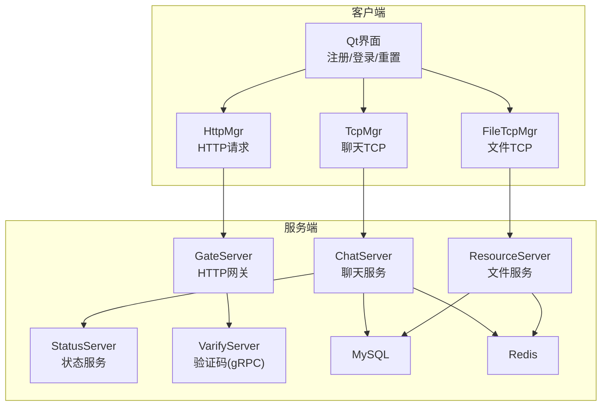
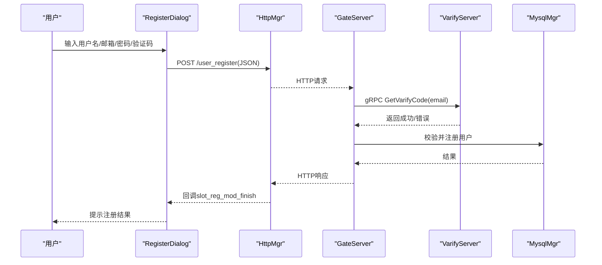
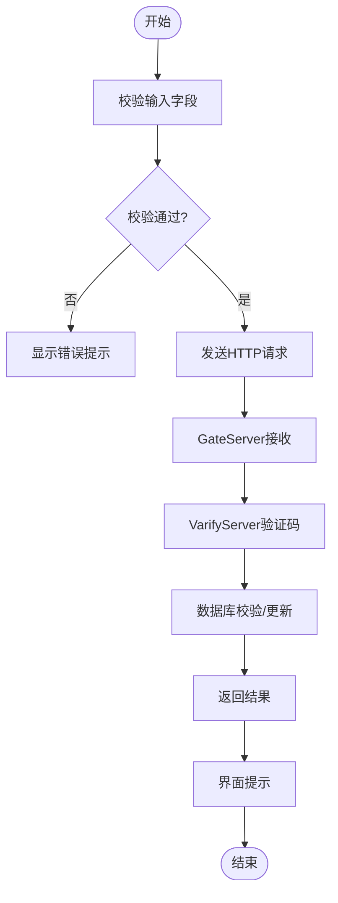
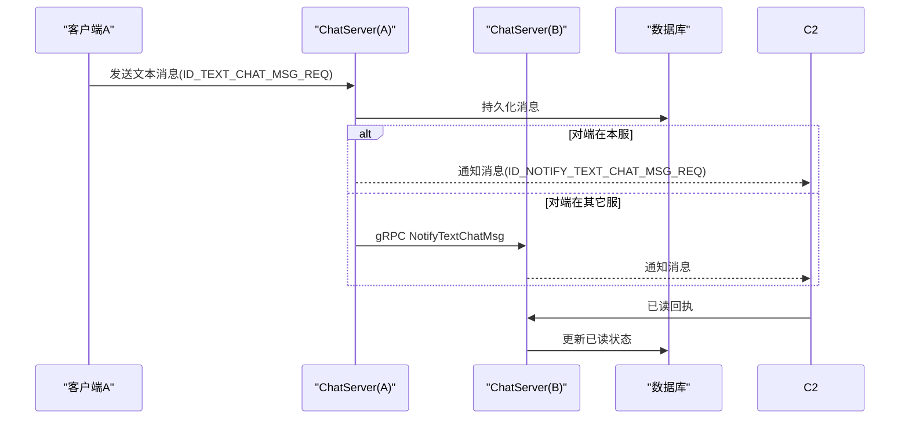
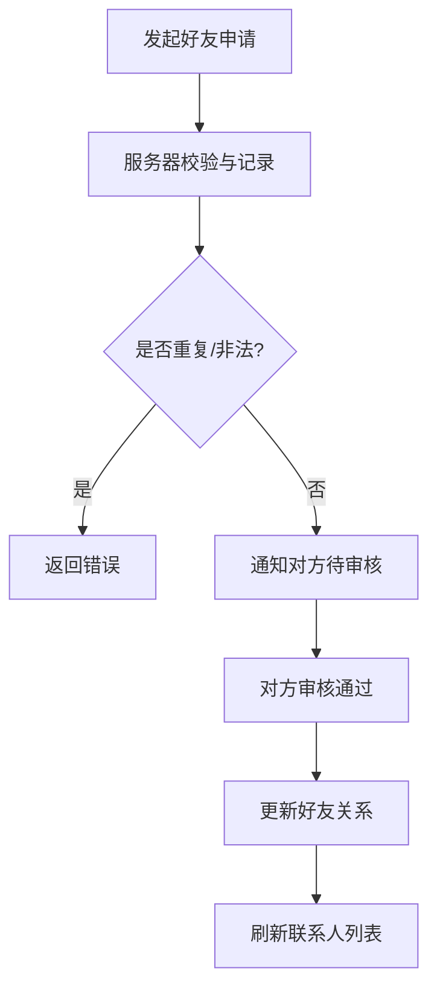
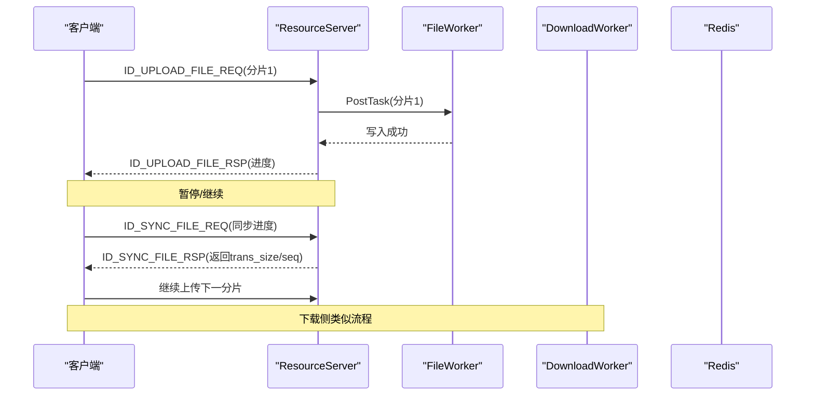
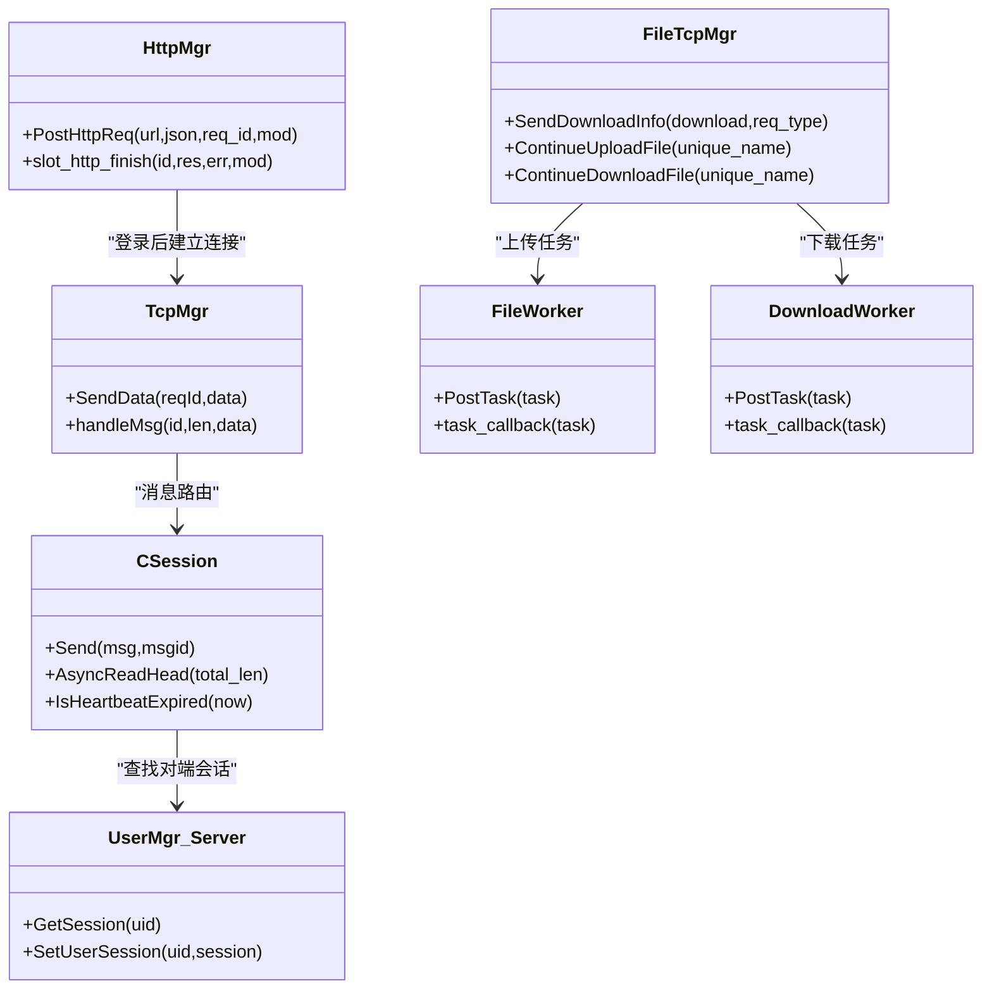

# 核心功能实现

<cite>
**本文引用的文件**   
- [README.md](file://README.md)
- [registerdialog.h](file://client/llfcchat/include/registerdialog.h)
- [logindialog.h](file://client/llfcchat/include/logindialog.h)
- [resetdialog.h](file://client/llfcchat/include/resetdialog.h)
- [httpmgr.h](file://client/llfcchat/include/httpmgr.h)
- [tcpmgr.h](file://client/llfcchat/include/tcpmgr.h)
- [filetcpmgr.h](file://client/llfcchat/include/filetcpmgr.h)
- [usermgr.cpp](file://client/llfcchat/src/usermgr.cpp)
- [server.js](file://server/VarifyServer/server.js)
- [CSession.h](file://server/ChatServer/include/CSession.h)
- [UserMgr.h](file://server/ChatServer/include/UserMgr.h)
- [LogicSystem.h](file://server/ChatServer/include/LogicSystem.h)
- [FileWorker.h](file://server/ResourceServer/include/FileWorker.h)
- [FileSystem.h](file://server/ResourceServer/include/FileSystem.h)
- [day11-注册功能.md](file://开发文档/day11-注册功能.md)
- [day12-注册界面完善.md](file://开发文档/day12-注册界面完善.md)
- [day13-重置界面.md](file://开发文档/day13-重置界面.md)
- [day37-聊天信息存储方案.md](file://开发文档/day37-聊天信息存储方案.md)
- [day38-断点续传.md](file://开发文档/day38-断点续传.md)
- [day41-通知客户端异步下载聊天图片.md](file://开发文档/day41-通知客户端异步下载聊天图片.md)
- [更新记录.md](file://更新记录.md)
</cite>

## 目录
1. [简介](#简介)
2. [项目结构](#项目结构)
3. [核心组件](#核心组件)
4. [架构总览](#架构总览)
5. [详细组件分析](#详细组件分析)
6. [依赖关系分析](#依赖关系分析)
7. [性能考量](#性能考量)
8. [故障排查指南](#故障排查指南)
9. [结论](#结论)
10. [附录](#附录)

## 简介
本文件面向LLFCChat项目的核心功能实现，覆盖用户认证（邮箱验证码注册、登录验证、密码重置）、实时聊天（消息收发、历史加载、已读状态同步、多设备管理）、好友关系管理（申请与认证、联系人维护）以及文件传输系统（断点续传、进度显示、并发控制、分片传输）。文档从架构到代码级细节逐层展开，并给出流程图与时序图，帮助读者快速理解数据流转与异常处理策略。

## 项目结构
项目采用前后端分离与多服务协同的架构：
- 客户端（Qt/C++）：负责UI交互、HTTP鉴权、TCP长连接、文件传输、本地状态管理。
- GateServer：网关入口，统一对外暴露HTTP接口，转发鉴权请求。
- ChatServer：聊天业务核心，处理消息路由、会话管理、跨服通知。
- ResourceServer：资源与文件服务，提供分片上传/下载、断点续传、并发写入。
- StatusServer：状态服务，用于在线状态与踢人逻辑等。
- VarifyServer：验证码服务（Node.js），通过gRPC提供邮箱验证码下发能力。
- SQL备份：数据库脚本与存储过程。

**图示来源** 
- [README.md:1-112](file://README.md#L1-L112)

**章节来源**
- [README.md:1-112](file://README.md#L1-L112)

## 核心组件
- 用户认证模块
  - 客户端：RegisterDialog、LoginDialog、ResetDialog、HttpMgr
  - 服务端：GateServer、VarifyServer、MysqlDao/MysqlMgr
- 实时聊天模块
  - 客户端：TcpMgr、UserMgr、ChatPage/ChatDialog
  - 服务端：ChatServer(CSession, UserMgr, LogicSystem)、Redis
- 好友关系管理
  - 客户端：ApplyFriendPage、ContactUserList、UserMgr
  - 服务端：ChatServer(LogicSystem)
- 文件传输模块
  - 客户端：FileTcpMgr、UserMgr、PicBubble
  - 服务端：ResourceServer(FileWorker, DownloadWorker, FileSystem)、Redis

**章节来源**
- [registerdialog.h:1-55](file://client/llfcchat/include/registerdialog.h#L1-L55)
- [logindialog.h:1-47](file://client/llfcchat/include/logindialog.h#L1-L47)
- [resetdialog.h:1-44](file://client/llfcchat/include/resetdialog.h#L1-L44)
- [httpmgr.h:1-34](file://client/llfcchat/include/httpmgr.h#L1-L34)
- [tcpmgr.h:1-90](file://client/llfcchat/include/tcpmgr.h#L1-L90)
- [filetcpmgr.h:1-85](file://client/llfcchat/include/filetcpmgr.h#L1-L85)
- [usermgr.cpp:155-218](file://client/llfcchat/src/usermgr.cpp#L155-L218)
- [CSession.h:1-86](file://server/ChatServer/include/CSession.h#L1-L86)
- [UserMgr.h:1-22](file://server/ChatServer/include/UserMgr.h#L1-L22)
- [LogicSystem.h:1-61](file://server/ChatServer/include/LogicSystem.h#L1-L61)
- [FileWorker.h:1-90](file://server/ResourceServer/include/FileWorker.h#L1-L90)
- [FileSystem.h:1-21](file://server/ResourceServer/include/FileSystem.h#L1-L21)

## 架构总览
整体采用“HTTP鉴权 + gRPC验证码 + TCP聊天 + 独立文件服务”的分层架构。客户端通过HttpMgr完成注册/登录/重置；通过TcpMgr建立与ChatServer的长连接进行消息通信；通过FileTcpMgr与ResourceServer进行大文件分片传输。服务端各职责清晰，ChatServer负责消息路由与跨服通知，ResourceServer专注IO密集型任务，并通过Redis缓存状态提升性能。

**图示来源** 
- [registerdialog.h:1-55](file://client/llfcchat/include/registerdialog.h#L1-L55)
- [httpmgr.h:1-34](file://client/llfcchat/include/httpmgr.h#L1-L34)
- [server.js:1-76](file://server/VarifyServer/server.js#L1-L76)

**章节来源**
- [day11-注册功能.md:1-708](file://开发文档/day11-注册功能.md#L1-L708)
- [day12-注册界面完善.md:133-203](file://开发文档/day12-注册界面完善.md#L133-L203)
- [server.js:1-76](file://server/VarifyServer/server.js#L1-L76)

## 详细组件分析

### 用户认证系统（注册、登录、密码重置）
- 注册流程
  - 前端校验：用户名、邮箱、密码、确认密码、验证码非空与格式校验。
  - 发送HTTP请求至GateServer，GateServer调用VarifyServer获取或生成验证码并发送邮件。
  - 后端校验后写入数据库，返回结果给客户端。
- 登录流程
  - 客户端校验输入，发起HTTP登录请求，成功后建立TCP连接至ChatServer，并保存Token。
- 密码重置
  - 前端校验用户名、邮箱、验证码、新密码格式；后端校验验证码有效性后更新密码。

**图示来源** 
- [registerdialog.h:1-55](file://client/llfcchat/include/registerdialog.h#L1-L55)
- [logindialog.h:1-47](file://client/llfcchat/include/logindialog.h#L1-L47)
- [resetdialog.h:1-44](file://client/llfcchat/include/resetdialog.h#L1-L44)
- [httpmgr.h:1-34](file://client/llfcchat/include/httpmgr.h#L1-L34)
- [server.js:1-76](file://server/VarifyServer/server.js#L1-L76)

**章节来源**
- [day11-注册功能.md:1-708](file://开发文档/day11-注册功能.md#L1-L708)
- [day12-注册界面完善.md:133-203](file://开发文档/day12-注册界面完善.md#L133-L203)
- [day13-重置界面.md:88-173](file://开发文档/day13-重置界面.md#L88-L173)

### 实时聊天系统（消息收发、历史加载、已读状态、多设备）
- 消息收发
  - 客户端通过TcpMgr发送文本/图片消息，服务器解析后持久化并推送给对端。
  - 若对端不在本服，通过gRPC跨服通知。
- 历史加载
  - 分页加载聊天线程与消息，支持加载更多。
- 已读状态
  - 消息状态枚举包含未读、发送失败、已读、未上传完成等，客户端根据状态渲染。
- 多设备管理
  - 心跳机制检测在线状态，支持踢人逻辑（单服/多服）。

**图示来源** 
- [tcpmgr.h:1-90](file://client/llfcchat/include/tcpmgr.h#L1-L90)
- [CSession.h:1-86](file://server/ChatServer/include/CSession.h#L1-L86)
- [LogicSystem.h:1-61](file://server/ChatServer/include/LogicSystem.h#L1-L61)
- [day37-聊天信息存储方案.md:3083-3528](file://开发文档/day37-聊天信息存储方案.md#L3083-L3528)
- [更新记录.md:198-224](file://更新记录.md#L198-L224)

**章节来源**
- [tcpmgr.h:1-90](file://client/llfcchat/include/tcpmgr.h#L1-L90)
- [CSession.h:1-86](file://server/ChatServer/include/CSession.h#L1-L86)
- [LogicSystem.h:1-61](file://server/ChatServer/include/LogicSystem.h#L1-L61)
- [day37-聊天信息存储方案.md:3083-3528](file://开发文档/day37-聊天信息存储方案.md#L3083-L3528)
- [更新记录.md:198-224](file://更新记录.md#L198-L224)

### 好友关系管理（申请、认证、联系人列表）
- 好友申请
  - 客户端发起申请请求，服务器校验并记录申请状态。
- 认证处理
  - 被申请方审核通过后，双方成为好友，更新联系人列表。
- 联系人列表维护
  - 分页加载联系人，支持搜索与红点提示。

**图示来源** 
- [usermgr.cpp:155-218](file://client/llfcchat/src/usermgr.cpp#L155-L218)
- [LogicSystem.h:1-61](file://server/ChatServer/include/LogicSystem.h#L1-L61)

**章节来源**
- [usermgr.cpp:155-218](file://client/llfcchat/src/usermgr.cpp#L155-L218)
- [LogicSystem.h:1-61](file://server/ChatServer/include/LogicSystem.h#L1-L61)

### 文件传输系统（断点续传、进度显示、并发控制、分片传输）
- 分片上传
  - 客户端按固定大小分片，携带md5、seq、trans_size、total_size、last等字段。
  - 服务器将任务分发至FileWorker队列，按哈希分桶并行处理。
- 断点续传
  - 暂停时记录当前进度，恢复时通过ID_SYNC_FILE_REQ同步进度继续上传。
- 下载与进度
  - 下载使用DownloadWorker，基于Redis缓存下载进度，支持暂停/继续。
- 并发控制
  - 客户端拥塞窗口_cwnd_size控制发送数量，避免网络拥塞。

**图示来源** 
- [filetcpmgr.h:1-85](file://client/llfcchat/include/filetcpmgr.h#L1-L85)
- [FileWorker.h:1-90](file://server/ResourceServer/include/FileWorker.h#L1-L90)
- [FileSystem.h:1-21](file://server/ResourceServer/include/FileSystem.h#L1-L21)
- [day38-断点续传.md:479-3084](file://开发文档/day38-断点续传.md#L479-L3084)
- [day41-通知客户端异步下载聊天图片.md:903-1108](file://开发文档/day41-通知客户端异步下载聊天图片.md#L903-L1108)

**章节来源**
- [filetcpmgr.h:1-85](file://client/llfcchat/include/filetcpmgr.h#L1-L85)
- [FileWorker.h:1-90](file://server/ResourceServer/include/FileWorker.h#L1-L90)
- [FileSystem.h:1-21](file://server/ResourceServer/include/FileSystem.h#L1-L21)
- [day38-断点续传.md:479-3084](file://开发文档/day38-断点续传.md#L479-L3084)
- [day41-通知客户端异步下载聊天图片.md:903-1108](file://开发文档/day41-通知客户端异步下载聊天图片.md#L903-L1108)

## 依赖关系分析
- 客户端内部依赖
  - HttpMgr依赖QNetworkAccessManager，封装HTTP请求与回调分发。
  - TcpMgr/QTcpSocket负责聊天长连接，维护粘包处理与消息路由。
  - FileTcpMgr独立线程处理文件传输，避免阻塞主线程。
- 服务端依赖
  - ChatServer依赖CSession进行IO读写，UserMgr维护uid到session映射。
  - ResourceServer通过FileSystem协调FileWorker/DownloadWorker，Redis缓存状态。
  - VarifyServer通过gRPC提供验证码服务，Redis缓存验证码。

**图示来源** 
- [httpmgr.h:1-34](file://client/llfcchat/include/httpmgr.h#L1-L34)
- [tcpmgr.h:1-90](file://client/llfcchat/include/tcpmgr.h#L1-L90)
- [filetcpmgr.h:1-85](file://client/llfcchat/include/filetcpmgr.h#L1-L85)
- [CSession.h:1-86](file://server/ChatServer/include/CSession.h#L1-L86)
- [UserMgr.h:1-22](file://server/ChatServer/include/UserMgr.h#L1-L22)
- [FileWorker.h:1-90](file://server/ResourceServer/include/FileWorker.h#L1-L90)

**章节来源**
- [httpmgr.h:1-34](file://client/llfcchat/include/httpmgr.h#L1-L34)
- [tcpmgr.h:1-90](file://client/llfcchat/include/tcpmgr.h#L1-L90)
- [filetcpmgr.h:1-85](file://client/llfcchat/include/filetcpmgr.h#L1-L85)
- [CSession.h:1-86](file://server/ChatServer/include/CSession.h#L1-L86)
- [UserMgr.h:1-22](file://server/ChatServer/include/UserMgr.h#L1-L22)
- [FileWorker.h:1-90](file://server/ResourceServer/include/FileWorker.h#L1-L90)

## 性能考量
- 网络与IO
  - 使用Asio/Beast实现高并发IO，减少阻塞。
  - 文件传输分片与并发写入，降低单次IO压力。
- 缓存与状态
  - Redis缓存验证码、下载进度、用户IP映射，提升查询效率。
- 内存与队列
  - 发送队列与任务队列解耦，避免突发流量导致内存暴涨。
- 拥塞控制
  - 客户端拥塞窗口限制并发发送，防止网络拥塞。

[本节为通用指导，不直接分析具体文件]

## 故障排查指南
- 验证码相关
  - 检查VarifyServer日志与Redis键是否存在过期。
  - 确认邮件服务配置正确。
- 登录失败
  - 检查GateServer与MysqlMgr连通性。
  - 查看客户端HttpMgr回调错误码。
- 聊天消息丢失
  - 检查TcpMgr粘包处理与消息路由。
  - 确认ChatServer跨服gRPC通知是否成功。
- 文件传输中断
  - 核对md5一致性、seq顺序、trans_size与total_size匹配。
  - 检查Redis中下载进度是否一致。

**章节来源**
- [server.js:1-76](file://server/VarifyServer/server.js#L1-L76)
- [tcpmgr.h:1-90](file://client/llfcchat/include/tcpmgr.h#L1-L90)
- [day38-断点续传.md:479-3084](file://开发文档/day38-断点续传.md#L479-L3084)

## 结论
LLFCChat通过清晰的模块化设计与分布式服务拆分，实现了稳定高效的认证、聊天、好友管理与文件传输能力。结合Redis缓存与分片并发，系统在性能与可扩展性上具备良好基础。后续可进一步引入消息去重、幂等性与更完善的监控告警体系。

[本节为总结，不直接分析具体文件]

## 附录
- 关键协议与数据结构
  - 文本聊天消息：包含sender、receiver、thread_id、unique_id、content、status、chat_time等。
  - 文件传输：包含md5、name、seq、trans_size、total_size、last、data等。
- 扩展建议
  - 增加消息ACK与重试机制。
  - 引入消息压缩与二进制协议优化。
  - 完善审计日志与链路追踪。

[本节为补充说明，不直接分析具体文件]