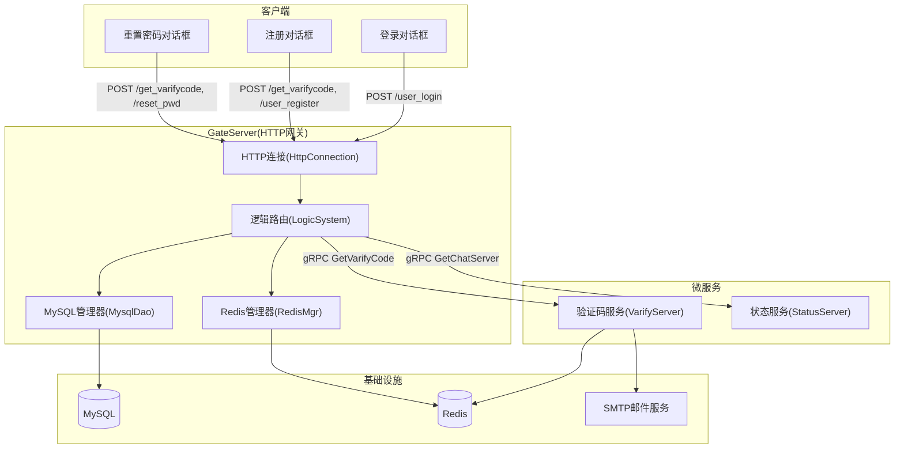
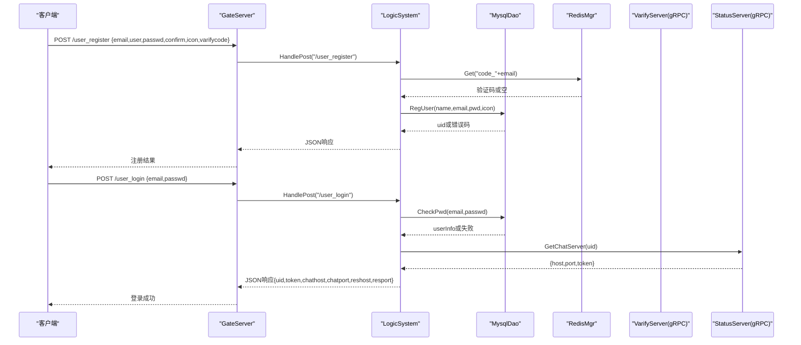
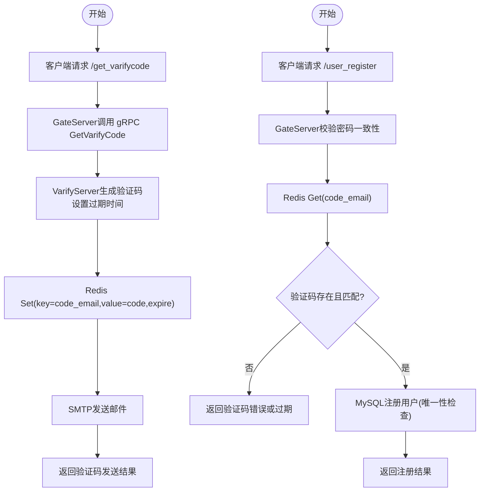
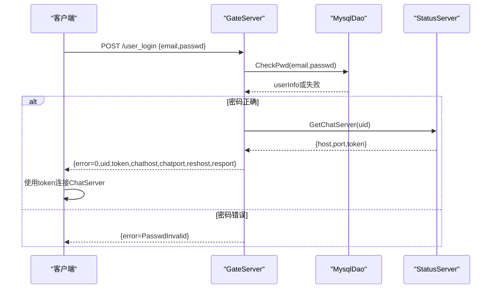
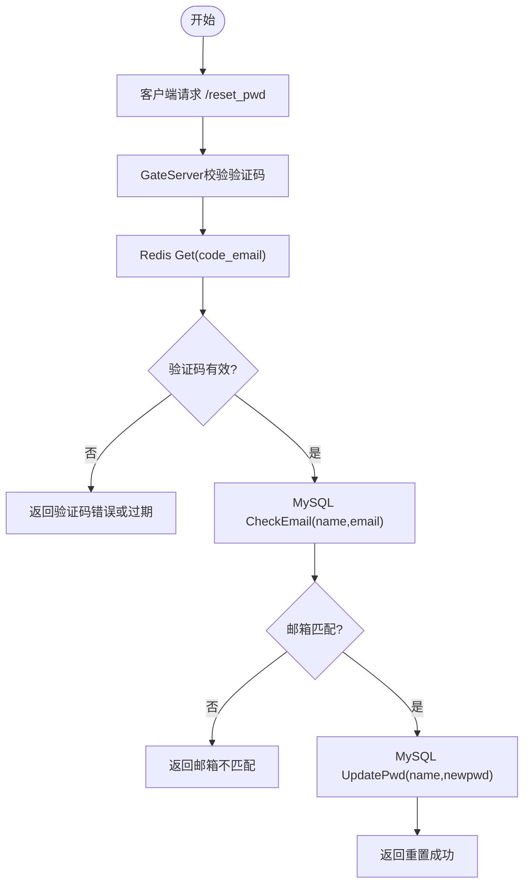
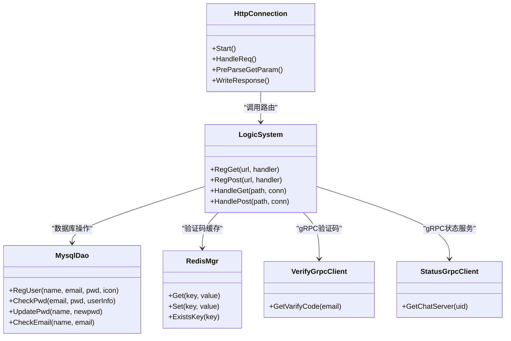

# 用户认证系统

<cite>
**本文引用的文件**   
- [HttpConnection.h](file://server/GateServer/include/HttpConnection.h)
- [HttpConnection.cpp](file://server/GateServer/src/HttpConnection.cpp)
- [LogicSystem.h](file://server/GateServer/include/LogicSystem.h)
- [LogicSystem.cpp](file://server/GateServer/src/LogicSystem.cpp)
- [MysqlDao.h](file://server/GateServer/include/MysqlDao.h)
- [MysqlDao.cpp](file://server/GateServer/src/MysqlDao.cpp)
- [RedisMgr.h](file://server/GateServer/include/RedisMgr.h)
- [RedisMgr.cpp](file://server/GateServer/src/RedisMgr.cpp)
- [const.h](file://server/GateServer/include/const.h)
- [config.ini](file://server/GateServer/config/config.ini)
- [logindialog.h](file://client/llfcchat/include/logindialog.h)
- [logindialog.cpp](file://client/llfcchat/src/logindialog.cpp)
- [registerdialog.h](file://client/llfcchat/include/registerdialog.h)
- [registerdialog.cpp](file://client/llfcchat/src/registerdialog.cpp)
- [resetdialog.h](file://client/llfcchat/include/resetdialog.h)
- [resetdialog.cpp](file://client/llfcchat/src/resetdialog.cpp)
- [server.js](file://server/VarifyServer/server.js)
</cite>

## 目录
1. [简介](#简介)
2. [项目结构](#项目结构)
3. [核心组件](#核心组件)
4. [架构总览](#架构总览)
5. [详细组件分析](#详细组件分析)
6. [依赖关系分析](#依赖关系分析)
7. [性能考虑](#性能考虑)
8. [故障排查指南](#故障排查指南)
9. [结论](#结论)
10. [附录：API与数据流说明](#附录api与数据流说明)

## 简介
本技术文档聚焦于LLFCChat项目的用户认证系统，覆盖以下关键能力：
- 邮箱验证码注册流程：验证码生成、邮件发送、Redis缓存策略、邮箱验证逻辑
- 登录验证机制：用户名（邮箱）密码校验、会话管理、多设备登录控制（基于Token）
- 密码重置功能：验证码校验、密码更新与安全存储
- GateServer的HTTP API设计：注册、登录、验证码获取等接口的请求/响应格式
- 客户端登录对话框实现细节：错误处理、用户体验优化
- 完整业务流程图与数据流转说明

## 项目结构
GateServer作为HTTP网关，负责接收客户端请求并路由到对应业务逻辑；通过gRPC调用验证码服务与状态服务；通过MySQL持久化用户数据；通过Redis缓存验证码。客户端使用Qt实现登录、注册、重置密码界面，并通过HTTP/TCP与后端交互。

图表来源
- [HttpConnection.cpp:132-194](file://server/GateServer/src/HttpConnection.cpp#L132-L194)
- [LogicSystem.cpp:36-406](file://server/GateServer/src/LogicSystem.cpp#L36-L406)
- [MysqlDao.cpp:19-316](file://server/GateServer/src/MysqlDao.cpp#L19-L316)
- [RedisMgr.cpp:18-361](file://server/GateServer/src/RedisMgr.cpp#L18-L361)
- [server.js:15-63](file://server/VarifyServer/server.js#L15-L63)

章节来源
- [HttpConnection.h:1-36](file://server/GateServer/include/HttpConnection.h#L1-L36)
- [HttpConnection.cpp:1-225](file://server/GateServer/src/HttpConnection.cpp#L1-L225)
- [LogicSystem.h:1-24](file://server/GateServer/include/LogicSystem.h#L1-L24)
- [LogicSystem.cpp:1-477](file://server/GateServer/src/LogicSystem.cpp#L1-L477)
- [MysqlDao.h:1-238](file://server/GateServer/include/MysqlDao.h#L1-L238)
- [MysqlDao.cpp:1-316](file://server/GateServer/src/MysqlDao.cpp#L1-L316)
- [RedisMgr.h:1-305](file://server/GateServer/include/RedisMgr.h#L1-L305)
- [RedisMgr.cpp:1-361](file://server/GateServer/src/RedisMgr.cpp#L1-L361)
- [const.h:32-66](file://server/GateServer/include/const.h#L32-L66)
- [config.ini:1-25](file://server/GateServer/config/config.ini#L1-L25)
- [logindialog.h:1-47](file://client/llfcchat/include/logindialog.h#L1-L47)
- [logindialog.cpp:1-277](file://client/llfcchat/src/logindialog.cpp#L1-L277)
- [registerdialog.h:1-55](file://client/llfcchat/include/registerdialog.h#L1-L55)
- [registerdialog.cpp:1-375](file://client/llfcchat/src/registerdialog.cpp#L1-L375)
- [resetdialog.h:1-44](file://client/llfcchat/include/resetdialog.h#L1-L44)
- [resetdialog.cpp:1-252](file://client/llfcchat/src/resetdialog.cpp#L1-L252)
- [server.js:1-76](file://server/VarifyServer/server.js#L1-L76)

## 核心组件
- HTTP连接层：封装Beast HTTP读写、超时控制、GET参数解析、统一响应写入
- 逻辑路由层：按URL路径分发GET/POST请求，执行业务校验与跨服务调用
- 数据库访问层：连接池、事务、存储过程调用、用户信息CRUD
- Redis缓存层：连接池、键值操作、分布式锁、计数器等
- 验证码服务：gRPC接口，生成验证码、存入Redis、发送邮件
- 状态服务：gRPC接口，分配ChatServer地址与认证Token
- 客户端对话框：登录、注册、重置密码UI与网络交互

章节来源
- [HttpConnection.cpp:132-194](file://server/GateServer/src/HttpConnection.cpp#L132-L194)
- [LogicSystem.cpp:36-406](file://server/GateServer/src/LogicSystem.cpp#L36-L406)
- [MysqlDao.cpp:19-316](file://server/GateServer/src/MysqlDao.cpp#L19-L316)
- [RedisMgr.cpp:18-361](file://server/GateServer/src/RedisMgr.cpp#L18-L361)
- [server.js:15-63](file://server/VarifyServer/server.js#L15-L63)

## 架构总览
GateServer作为统一入口，将HTTP请求路由至具体处理器，处理器组合调用MySQL、Redis与gRPC服务完成业务。验证码由VarifyServer生成并缓存到Redis，随后通过SMTP发送邮件。登录成功后，StatusServer为客户端分配ChatServer与Token，用于后续TCP长连接认证与会话管理。

图表来源
- [LogicSystem.cpp:161-239](file://server/GateServer/src/LogicSystem.cpp#L161-L239)
- [LogicSystem.cpp:338-405](file://server/GateServer/src/LogicSystem.cpp#L338-L405)
- [MysqlDao.cpp:19-57](file://server/GateServer/src/MysqlDao.cpp#L19-L57)
- [MysqlDao.cpp:223-266](file://server/GateServer/src/MysqlDao.cpp#L223-L266)
- [RedisMgr.cpp:18-45](file://server/GateServer/src/RedisMgr.cpp#L18-L45)

## 详细组件分析

### 邮箱验证码注册流程
- 验证码生成与发送：客户端调用/get_varifycode，GateServer通过gRPC调用VarifyServer；VarifyServer生成随机验证码，设置过期时间并写入Redis，再通过SMTP发送邮件
- 注册校验：GateServer在/user_register中校验两次密码一致、从Redis取验证码并比对、调用MySQL注册用户（含唯一性检查）
- Redis缓存策略：验证码key为CODEPREFIX+email，带过期时间；注册成功后可删除或保留（依策略而定）

图表来源
- [server.js:15-63](file://server/VarifyServer/server.js#L15-L63)
- [LogicSystem.cpp:113-151](file://server/GateServer/src/LogicSystem.cpp#L113-L151)
- [LogicSystem.cpp:161-239](file://server/GateServer/src/LogicSystem.cpp#L161-L239)
- [RedisMgr.cpp:18-45](file://server/GateServer/src/RedisMgr.cpp#L18-L45)

章节来源
- [server.js:15-63](file://server/VarifyServer/server.js#L15-L63)
- [LogicSystem.cpp:113-151](file://server/GateServer/src/LogicSystem.cpp#L113-L151)
- [LogicSystem.cpp:161-239](file://server/GateServer/src/LogicSystem.cpp#L161-L239)
- [RedisMgr.cpp:18-45](file://server/GateServer/src/RedisMgr.cpp#L18-L45)

### 登录验证机制
- 用户名密码验证：GateServer调用MysqlDao.CheckPwd进行邮箱与密码比对，同时返回用户基本信息
- Token与会话管理：StatusServer分配ChatServer地址与Token；客户端使用Token建立TCP连接并进行认证
- 多设备登录控制：通过Token标识会话，可在服务端维护在线会话列表与踢人逻辑（由其他模块实现）

图表来源
- [LogicSystem.cpp:338-405](file://server/GateServer/src/LogicSystem.cpp#L338-L405)
- [MysqlDao.cpp:223-266](file://server/GateServer/src/MysqlDao.cpp#L223-L266)

章节来源
- [LogicSystem.cpp:338-405](file://server/GateServer/src/LogicSystem.cpp#L338-L405)
- [MysqlDao.cpp:223-266](file://server/GateServer/src/MysqlDao.cpp#L223-L266)

### 密码重置功能
- 验证码校验：复用/get_varifycode接口，GateServer从Redis获取验证码并校验
- 安全更新：先校验用户名与邮箱是否匹配，再执行密码更新，防止恶意重置他人密码
- 加密存储：当前实现为明文比较与更新，建议在生产环境引入哈希加盐存储

图表来源
- [LogicSystem.cpp:249-324](file://server/GateServer/src/LogicSystem.cpp#L249-L324)
- [MysqlDao.cpp:156-191](file://server/GateServer/src/MysqlDao.cpp#L156-L191)
- [MysqlDao.cpp:193-221](file://server/GateServer/src/MysqlDao.cpp#L193-L221)

章节来源
- [LogicSystem.cpp:249-324](file://server/GateServer/src/LogicSystem.cpp#L249-L324)
- [MysqlDao.cpp:156-191](file://server/GateServer/src/MysqlDao.cpp#L156-L191)
- [MysqlDao.cpp:193-221](file://server/GateServer/src/MysqlDao.cpp#L193-L221)

### GateServer HTTP API接口设计
- GET /get_test：测试接口，回显查询参数
- POST /test_procedure：测试存储过程调用
- POST /get_varifycode：获取邮箱验证码
- POST /user_register：用户注册
- POST /reset_pwd：重置密码
- POST /user_login：用户登录

请求/响应示例（字段说明见附录）：
- /get_varifycode
  - 请求体：{"email":"..."}
  - 响应体：{"error":0,"email":"..."}
- /user_register
  - 请求体：{"email":"...","user":"...","passwd":"...","confirm":"...","icon":"...","varifycode":"..."}
  - 响应体：{"error":0,"uid":123,"email":"...","user":"...","passwd":"...","confirm":"...","icon":"...","varifycode":"..."}
- /reset_pwd
  - 请求体：{"email":"...","user":"...","passwd":"...","varifycode":"..."}
  - 响应体：{"error":0,"email":"...","user":"...","passwd":"...","varifycode":"..."}
- /user_login
  - 请求体：{"email":"...","passwd":"..."}
  - 响应体：{"error":0,"email":"...","uid":123,"token":"...","chathost":"...","chatport":"...","reshost":"...","resport":"..."}

章节来源
- [LogicSystem.cpp:36-406](file://server/GateServer/src/LogicSystem.cpp#L36-L406)
- [const.h:32-45](file://server/GateServer/include/const.h#L32-L45)

### 客户端登录对话框实现细节
- 输入校验：邮箱非空、密码长度与字符集限制、正则表达式校验
- 网络交互：通过HttpMgr发送POST请求，回调处理JSON响应
- 错误处理：网络错误、JSON解析错误、业务错误码提示
- 用户体验：按钮禁用/启用、错误提示动态显示、倒计时返回登录

章节来源
- [logindialog.cpp:175-277](file://client/llfcchat/src/logindialog.cpp#L175-L277)
- [registerdialog.cpp:98-375](file://client/llfcchat/src/registerdialog.cpp#L98-L375)
- [resetdialog.cpp:50-252](file://client/llfcchat/src/resetdialog.cpp#L50-L252)

## 依赖关系分析
- GateServer依赖：
  - Boost.Beast用于HTTP处理
  - JsonCpp用于JSON解析
  - MySQL Connector/C++用于数据库操作
  - hiredis用于Redis操作
  - gRPC客户端用于调用VarifyServer与StatusServer
- 客户端依赖：
  - Qt框架用于UI与网络通信
  - HttpMgr封装HTTP请求
  - TcpMgr/FileTcpMgr封装TCP连接

图表来源
- [HttpConnection.h:1-36](file://server/GateServer/include/HttpConnection.h#L1-L36)
- [LogicSystem.h:1-24](file://server/GateServer/include/LogicSystem.h#L1-L24)
- [MysqlDao.h:222-238](file://server/GateServer/include/MysqlDao.h#L222-L238)
- [RedisMgr.h:267-305](file://server/GateServer/include/RedisMgr.h#L267-L305)

章节来源
- [HttpConnection.h:1-36](file://server/GateServer/include/HttpConnection.h#L1-L36)
- [LogicSystem.h:1-24](file://server/GateServer/include/LogicSystem.h#L1-L24)
- [MysqlDao.h:222-238](file://server/GateServer/include/MysqlDao.h#L222-L238)
- [RedisMgr.h:267-305](file://server/GateServer/include/RedisMgr.h#L267-L305)

## 性能考虑
- 连接池：MySQL与Redis均使用连接池，减少频繁创建/销毁开销
- 异步IO：Beast异步读写HTTP请求，提升并发处理能力
- 超时控制：HTTP连接设置超时，避免资源泄露
- 缓存策略：验证码短期缓存，降低数据库压力
- 负载均衡：StatusServer分配ChatServer，避免单点过载

## 故障排查指南
- JSON解析错误：检查请求体格式与字段完整性
- 验证码过期：确认Redis中是否存在对应key及过期时间
- 数据库异常：检查连接池状态、SQL语句与存储过程
- gRPC调用失败：确认VarifyServer与StatusServer运行状态与端口配置
- 网络异常：检查客户端网络与服务器可达性

章节来源
- [LogicSystem.cpp:113-151](file://server/GateServer/src/LogicSystem.cpp#L113-L151)
- [MysqlDao.cpp:19-57](file://server/GateServer/src/MysqlDao.cpp#L19-L57)
- [RedisMgr.cpp:18-45](file://server/GateServer/src/RedisMgr.cpp#L18-L45)

## 结论
LLFCChat的用户认证系统通过GateServer统一接入，结合Redis缓存、MySQL持久化与gRPC微服务，实现了完整的注册、登录、密码重置流程。客户端提供友好的交互界面与完善的错误处理。未来可进一步优化密码存储安全性与多设备登录控制策略。

## 附录：API与数据流说明
- 错误码定义：参见const.h中的ErrorCodes枚举
- 配置文件：GateServer、VarifyServer、StatusServer、MySQL、Redis、ResServer的地址与端口配置
- 数据流转：客户端→GateServer→逻辑处理→MySQL/Redis/gRPC→响应返回

章节来源
- [const.h:32-45](file://server/GateServer/include/const.h#L32-L45)
- [config.ini:1-25](file://server/GateServer/config/config.ini#L1-L25)