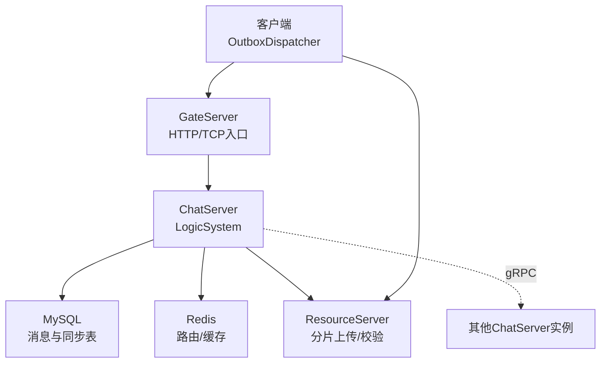
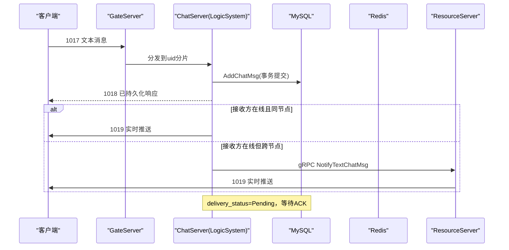
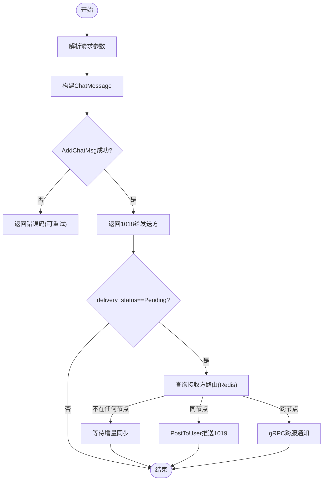
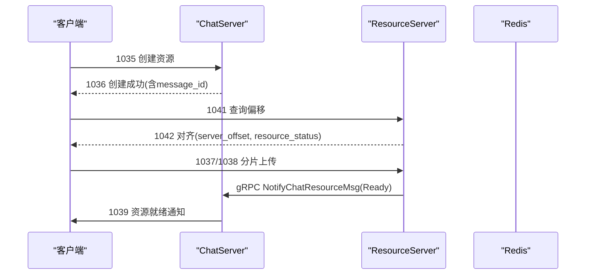
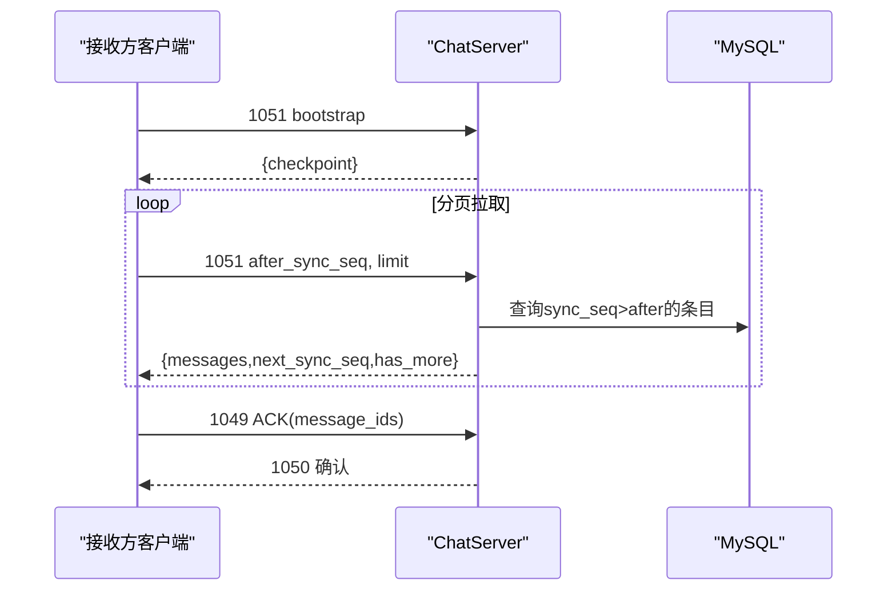
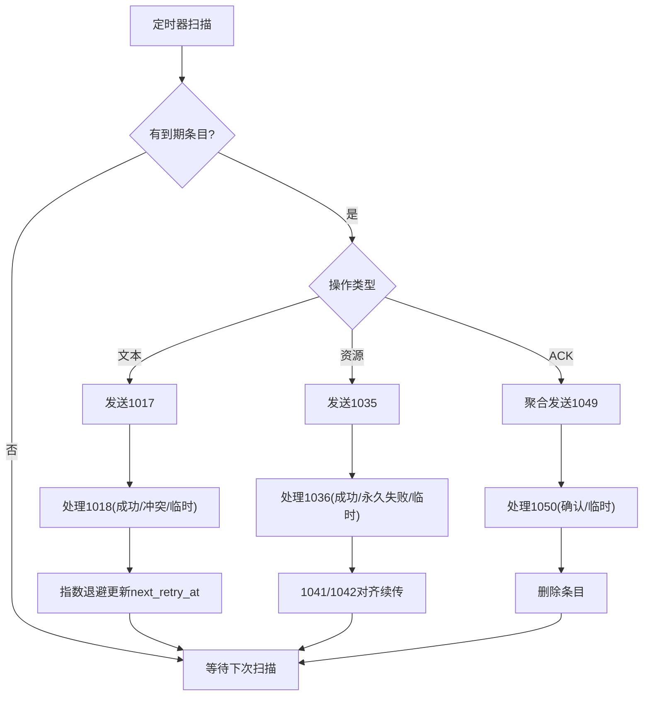
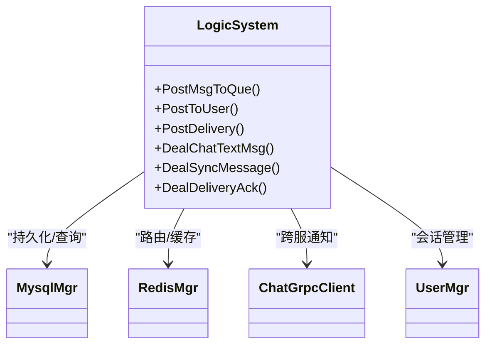

# 可靠消息投递系统

<cite>
**本文引用的文件**
- [README.md](file://README.md)
- [CMakeLists.txt](file://CMakeLists.txt)
- [LogicSystem.h](file://server/ChatServer/include/LogicSystem.h)
- [LogicSystem.cpp](file://server/ChatServer/src/LogicSystem.cpp)
- [data.h](file://server/ChatServer/include/data.h)
- [MsgNode.h](file://server/ChatServer/include/MsgNode.h)
- [outboxdispatcher.h](file://client/llfcchat/include/outboxdispatcher.h)
- [outboxdispatcher.cpp](file://client/llfcchat/src/outboxdispatcher.cpp)
- [localmessageDTO.h](file://client/llfcchat/include/localmessageDTO.h)
- [chat.proto](file://proto/chat_service/chat.proto)
- [im_scenarios.cpp](file://tests/integration/im_scenarios.cpp)
- [bench_im.py](file://bench_run/bench_im.py)
</cite>

## 目录
1. [简介](#简介)
2. [项目结构](#项目结构)
3. [核心组件](#核心组件)
4. [架构总览](#架构总览)
5. [关键流程详解](#关键流程详解)
6. [依赖关系分析](#依赖关系分析)
7. [性能与可靠性特性](#性能与可靠性特性)
8. [故障排查指南](#故障排查指南)
9. [结论](#结论)
10. [附录：协议与数据模型](#附录协议与数据模型)

## 简介
本仓库实现了一个“至少一次”的可靠消息投递系统，覆盖文本、图片、文件等聊天消息。系统通过客户端 Outbox 持久化重试、服务端按用户分片处理、在线时即时推送、离线时增量同步、接收方 ACK 确认以及跨服务 gRPC 通知，形成端到端的可靠链路。

## 项目结构
- 客户端（Qt/C++）：负责 UI、本地存储、Outbox 可靠发送与重传、资源上传协调。
- 服务端（C++）：Gate/Chat/Resource/Status 等多服务；ChatServer 承担消息落库、在线推送、跨服转发、增量同步与 ACK 处理。
- 协议层：gRPC 定义跨服务通知接口；TCP 帧用于客户端与服务端通信。
- 测试与压测：集成测试验证离线补全、ACK 清理、跨服场景；Python 基准脚本统计吞吐与时延。

图表来源
- [LogicSystem.h:23-79](file://server/ChatServer/include/LogicSystem.h#L23-L79)
- [outboxdispatcher.cpp:156-203](file://client/llfcchat/src/outboxdispatcher.cpp#L156-L203)
- [chat.proto:6-12](file://proto/chat_service/chat.proto#L6-L12)

章节来源
- [README.md:1-112](file://README.md#L1-L112)
- [CMakeLists.txt:1-44](file://CMakeLists.txt#L1-L44)

## 核心组件
- 客户端 OutboxDispatcher：维护 outbox 表镜像与内存状态，按指数退避定时扫描派发文本/资源/ACK；断线/重启恢复统一走对齐续传。
- 服务端 LogicSystem：按 uid 分片的逻辑 worker 池，负责登录、好友、文本消息落库与推送、资源创建、增量同步、ACK 处理。
- 数据模型：ChatMessage、DeliveryStatus、ResourceStatus、SyncedMessage 等描述消息生命周期与投递状态。
- 协议：gRPC 跨服务通知；TCP 帧 ID 如 1017/1018/1035/1036/1041/1042/1049/1050/1051/1052 等贯穿收发与同步。

章节来源
- [outboxdispatcher.h:11-80](file://client/llfcchat/include/outboxdispatcher.h#L11-L80)
- [LogicSystem.h:23-79](file://server/ChatServer/include/LogicSystem.h#L23-L79)
- [data.h:68-146](file://server/ChatServer/include/data.h#L68-L146)
- [chat.proto:6-12](file://proto/chat_service/chat.proto#L6-L12)

## 架构总览
系统采用“客户端持久化 + 服务端分片 + 在线即时 + 离线同步 + ACK 确认”的分层设计：
- 客户端将待发消息写入 outbox，定时器扫描并发送；收到 1018/1036/1042/1049/1050 等回包后更新本地状态。
- 服务端在 LogicWorker 中串行处理同一 uid 的请求，保证顺序与一致性；文本消息先落库再发 1018，随后尝试在线推送或跨服转发。
- 若接收方离线，消息进入 user_message_sync 增量流；接收方登录后通过 1051/1052 拉取并按 sync_seq 推进。
- 接收方消费完成后聚合发送 1049，服务端 1050 确认后清理 pending 集合。

图表来源
- [LogicSystem.cpp:657-786](file://server/ChatServer/src/LogicSystem.cpp#L657-L786)
- [chat.proto:53-75](file://proto/chat_service/chat.proto#L53-L75)

章节来源
- [LogicSystem.cpp:657-786](file://server/ChatServer/src/LogicSystem.cpp#L657-L786)
- [chat.proto:53-75](file://proto/chat_service/chat.proto#L53-L75)

## 关键流程详解

### 文本消息发送与在线推送
- 客户端 Outbox 将文本请求入队，定时器扫描发送 1017。
- 服务端 LogicSystem 解析请求，构造 ChatMessage，调用 MysqlMgr.AddChatMsg 单条事务提交。
- 提交后立即返回 1018 给发送方（语义为“已持久化”），避免 sender 误判失败。
- 仅当 delivery_status==Pending 时才尝试 live delivery：
  - 同节点：直接 PostToUser 投递 1019。
  - 跨节点：PostDelivery 到 sender 固定分片，调用 gRPC NotifyTextChatMsg 通知目标 ChatServer。
- 若接收方离线，同步行已随事务写入 user_message_sync，后续由 1051/1052 补齐。

图表来源
- [LogicSystem.cpp:657-786](file://server/ChatServer/src/LogicSystem.cpp#L657-L786)

章节来源
- [LogicSystem.cpp:657-786](file://server/ChatServer/src/LogicSystem.cpp#L657-L786)

### 资源消息（图片/文件）上传与就绪
- 客户端发送 1035 创建资源元数据；服务端校验类型、大小、文件名、整文件哈希等。
- 成功后返回 1036，客户端进入 uploading 阶段，通过 1041 查询服务端真实偏移，1042 对齐后窗口续发 1037/1038。
- ResourceServer 收齐分片并校验通过后置 resource_status=Ready，触发 gRPC NotifyChatResourceMsg 通知 ChatServer。
- ChatServer 读取 DB 组装 envelope，向接收方推送 1039 资源就绪通知。

图表来源
- [LogicSystem.cpp:1196-1231](file://server/ChatServer/src/LogicSystem.cpp#L1196-L1231)
- [chat.proto:87-105](file://proto/chat_service/chat.proto#L87-L105)

章节来源
- [LogicSystem.cpp:1196-1231](file://server/ChatServer/src/LogicSystem.cpp#L1196-L1231)
- [chat.proto:87-105](file://proto/chat_service/chat.proto#L87-L105)

### 离线补全与增量同步
- 接收方离线期间，消息仍会写入 user_message_sync，delivery_status 保持 Pending。
- 接收方登录后发起 1051 bootstrap 获取 checkpoint，再以 1051/1052 分页拉取，按 sync_seq 升序推进。
- 客户端消费完成后聚合发送 1049，服务端 1050 确认后清理 pending 集合，delivery_status 置为 Acked。

图表来源
- [im_scenarios.cpp:1033-1135](file://tests/integration/im_scenarios.cpp#L1033-L1135)
- [LogicSystem.h:217-235](file://server/ChatServer/include/LogicSystem.h#L217-L235)

章节来源
- [im_scenarios.cpp:1033-1135](file://tests/integration/im_scenarios.cpp#L1033-L1135)
- [LogicSystem.h:217-235](file://server/ChatServer/include/LogicSystem.h#L217-L235)

### 客户端 Outbox 重试与恢复
- OutboxDispatcher 维护 outbox 表镜像与内存映射，250ms 定时器扫描到期条目。
- 文本：发送 1017，根据 1018 结果确认或退避重试。
- 资源：发送 1035，成功后进入 uploading；通过 1041/1042 对齐续传；1038 完成则确认。
- ACK：聚合 1049 批量发送，1050 确认后删除条目。
- 断线/重启：重新加载 outbox，uploading 项统一走 1041 对齐恢复。

图表来源
- [outboxdispatcher.cpp:156-203](file://client/llfcchat/src/outboxdispatcher.cpp#L156-L203)
- [outboxdispatcher.cpp:302-313](file://client/llfcchat/src/outboxdispatcher.cpp#L302-L313)
- [outboxdispatcher.cpp:341-444](file://client/llfcchat/src/outboxdispatcher.cpp#L341-L444)

章节来源
- [outboxdispatcher.cpp:156-203](file://client/llfcchat/src/outboxdispatcher.cpp#L156-L203)
- [outboxdispatcher.cpp:302-313](file://client/llfcchat/src/outboxdispatcher.cpp#L302-L313)
- [outboxdispatcher.cpp:341-444](file://client/llfcchat/src/outboxdispatcher.cpp#L341-L444)

## 依赖关系分析
- LogicSystem 依赖：
  - MysqlMgr：消息持久化、会话/成员校验、同步行写入。
  - RedisMgr：用户路由、缓存用户信息。
  - ChatGrpcClient：跨服务通知（文本、资源、好友认证、踢人）。
  - UserMgr：会话管理、在线用户查找。
- 客户端 OutboxDispatcher 依赖：
  - TcpMgr/FileTcpMgr：网络发送与资源上传。
  - LocalChatStore：outbox/messages/conversations 本地持久化。
  - UserMgr：当前用户信息与传输文件上下文。

图表来源
- [LogicSystem.h:23-79](file://server/ChatServer/include/LogicSystem.h#L23-L79)
- [LogicSystem.cpp:657-786](file://server/ChatServer/src/LogicSystem.cpp#L657-L786)

章节来源
- [LogicSystem.h:23-79](file://server/ChatServer/include/LogicSystem.h#L23-L79)
- [LogicSystem.cpp:657-786](file://server/ChatServer/src/LogicSystem.cpp#L657-L786)

## 性能与可靠性特性
- 顺序性：按 uid 分片，同一用户的所有请求进入同一条 FIFO，避免乱序。
- 幂等性：unique_id 去重；重复 ACK 幂等；资源上传按 server_offset 对齐。
- 至少一次：sender 侧 Outbox 指数退避重试；receiver 侧增量同步兜底；ACK 清理 pending。
- 高可用：停机保护（_ingress_stopping/_delivery_stopping）拒绝新投递，排空后优雅关闭。
- 可扩展：跨服 gRPC 通知支持多 ChatServer 实例；Redis 路由解耦。
- 观测性：集成测试与基准脚本提供吞吐、RTT、丢失率等指标。

章节来源
- [LogicSystem.h:23-79](file://server/ChatServer/include/LogicSystem.h#L23-L79)
- [outboxdispatcher.cpp:302-313](file://client/llfcchat/src/outboxdispatcher.cpp#L302-L313)
- [im_scenarios.cpp:1033-1135](file://tests/integration/im_scenarios.cpp#L1033-L1135)
- [bench_im.py:145-165](file://bench_run/bench_im.py#L145-L165)

## 故障排查指南
- 文本消息未送达：
  - 检查 1018 是否返回成功；若失败，查看错误码（存储失败/冲突）。
  - 若 receiver 离线，确认 1051/1052 是否能拉取到消息。
  - 确认 delivery_status 是否为 Pending；若为 Acked，说明已被 ACK。
- 资源上传卡住：
  - 检查 1036 是否成功；若失败，查看资源非法/超限错误。
  - 使用 1041/1042 对齐偏移，确认 server_offset 与 resource_status。
  - 源文件丢失会导致标记失败，需重新选择文件。
- ACK 未清理：
  - 检查 1049 是否发送成功；1050 是否返回成功。
  - 若 transient 错误，Outbox 会保留条目并重试。
- 跨服通知失败：
  - 关注 gRPC 返回码与应用错误；即使失败，同步行已提交，receiver 可通过增量同步补齐。

章节来源
- [LogicSystem.cpp:657-786](file://server/ChatServer/src/LogicSystem.cpp#L657-L786)
- [LogicSystem.cpp:1196-1231](file://server/ChatServer/src/LogicSystem.cpp#L1196-L1231)
- [outboxdispatcher.cpp:341-444](file://client/llfcchat/src/outboxdispatcher.cpp#L341-L444)

## 结论
该系统通过客户端 Outbox 持久化重试与服务端分片处理相结合，实现了文本与资源的可靠投递；在线即时推送与离线增量同步互补，确保消息不丢；接收方 ACK 机制保障最终一致。整体架构清晰、扩展性强，适合大规模分布式聊天场景。

## 附录：协议与数据模型
- 协议要点：
  - 文本：1017 发送 → 1018 已持久化 → 1019 实时推送 → 1049/1050 ACK 清理。
  - 资源：1035 创建 → 1036 成功 → 1041/1042 对齐 → 1037/1038 上传 → 1039 就绪 → 1049/1050 ACK。
  - 同步：1051 bootstrap → 1051/1052 分页拉取 → 按 sync_seq 推进。
- 数据模型：
  - ChatMessage：包含 message_id、thread_id、sender/recv、unique_id、content、status、msg_type、resource_status、content_size、content_hash、mime_type、delivery_status。
  - DeliveryStatus：Pending/Acked。
  - ResourceStatus：Uploading/Ready/Expired。
  - SyncedMessage：sync_seq 与消息本体。

章节来源
- [data.h:68-146](file://server/ChatServer/include/data.h#L68-L146)
- [chat.proto:53-105](file://proto/chat_service/chat.proto#L53-L105)