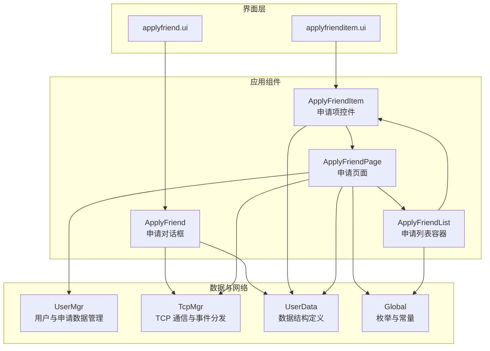
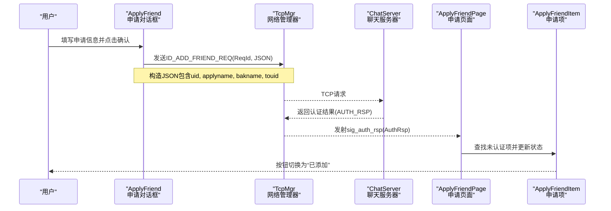
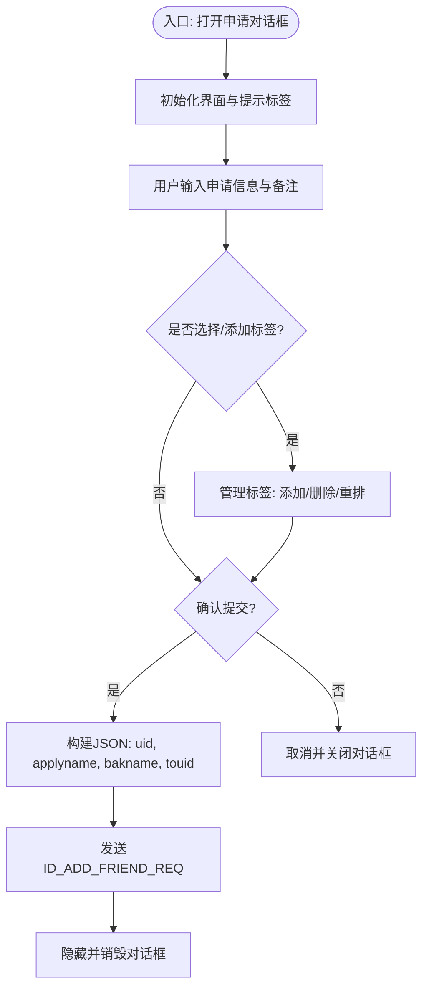
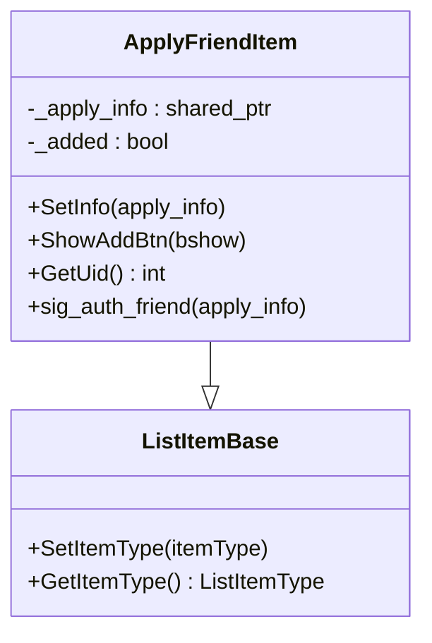
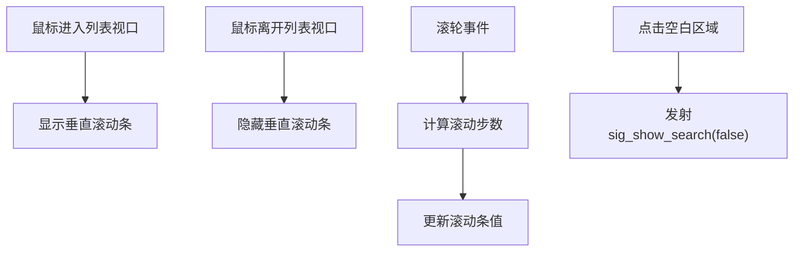
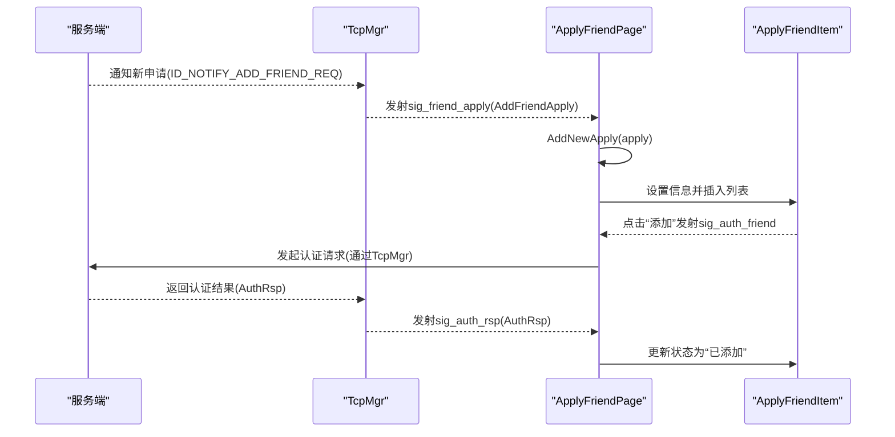
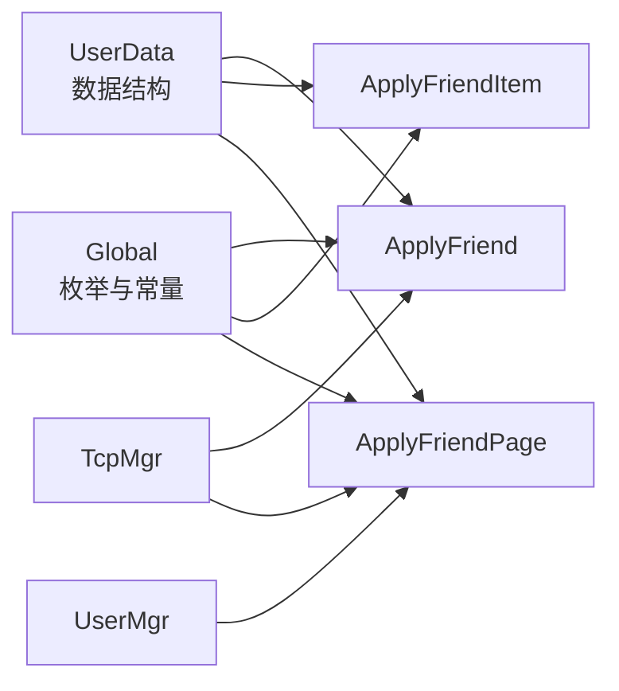

# 好友申请功能

<cite>
**本文引用的文件**   
- [applyfriend.h](file://client/llfcchat/include/applyfriend.h)
- [applyfriend.cpp](file://client/llfcchat/src/applyfriend.cpp)
- [applyfrienditem.h](file://client/llfcchat/include/applyfrienditem.h)
- [applyfrienditem.cpp](file://client/llfcchat/src/applyfrienditem.cpp)
- [applyfriendlist.h](file://client/llfcchat/include/applyfriendlist.h)
- [applyfriendlist.cpp](file://client/llfcchat/src/applyfriendlist.cpp)
- [applyfriendpage.h](file://client/llfcchat/include/applyfriendpage.h)
- [applyfriendpage.cpp](file://client/llfcchat/src/applyfriendpage.cpp)
- [userdata.h](file://client/llfcchat/include/userdata.h)
- [usermgr.h](file://client/llfcchat/include/usermgr.h)
- [tcpmgr.h](file://client/llfcchat/include/tcpmgr.h)
- [global.h](file://client/llfcchat/include/global.h)
- [applyfriend.ui](file://client/llfcchat/ui/applyfriend.ui)
- [applyfrienditem.ui](file://client/llfcchat/ui/applyfrienditem.ui)
</cite>

## 目录
1. [简介](#简介)
2. [项目结构](#项目结构)
3. [核心组件](#核心组件)
4. [架构总览](#架构总览)
5. [详细组件分析](#详细组件分析)
6. [依赖关系分析](#依赖关系分析)
7. [性能考虑](#性能考虑)
8. [故障排查指南](#故障排查指南)
9. [结论](#结论)
10. [附录](#附录)

## 简介
本技术文档围绕 LLFCChat 客户端的“好友申请”功能，系统性梳理并深入解析 ApplyFriend（申请对话框）、ApplyFriendItem（申请项控件）、ApplyFriendList（申请列表容器）与 ApplyFriendPage（申请页面）的实现细节。内容涵盖：
- 申请界面的交互逻辑、标签输入与提示、确认/取消流程
- 申请列表的动态加载、渲染与状态管理
- 信号槽机制、调用关系与异步消息处理
- 与 UserMgr（用户数据与本地缓存）和 TcpMgr（网络通信）的协作方式
- 申请流程的状态机设计与关键接口定义、参数与返回值说明
- 常见问题定位与解决方案

## 项目结构
好友申请相关代码主要位于 client/llfcchat 模块中，UI 使用 Qt Designer 的 .ui 文件描述界面布局，业务逻辑由 C++ 源文件实现，数据结构与全局常量在 userdata.h 与 global.h 中集中定义。

图表来源
- [applyfriend.ui](file://client/llfcchat/ui/applyfriend.ui)
- [applyfrienditem.ui](file://client/llfcchat/ui/applyfrienditem.ui)
- [applyfriendpage.cpp](file://client/llfcchat/src/applyfriendpage.cpp)
- [applyfriendlist.cpp](file://client/llfcchat/src/applyfriendlist.cpp)
- [applyfrienditem.cpp](file://client/llfcchat/src/applyfrienditem.cpp)
- [applyfriend.cpp](file://client/llfcchat/src/applyfriend.cpp)
- [usermgr.h](file://client/llfcchat/include/usermgr.h)
- [tcpmgr.h](file://client/llfcchat/include/tcpmgr.h)
- [userdata.h](file://client/llfcchat/include/userdata.h)
- [global.h](file://client/llfcchat/include/global.h)

章节来源
- [applyfriend.h:1-59](file://client/llfcchat/include/applyfriend.h#L1-L59)
- [applyfriend.cpp:1-515](file://client/llfcchat/src/applyfriend.cpp#L1-L515)
- [applyfrienditem.h:1-36](file://client/llfcchat/include/applyfrienditem.h#L1-L36)
- [applyfrienditem.cpp:1-55](file://client/llfcchat/src/applyfrienditem.cpp#L1-L55)
- [applyfriendlist.h:1-21](file://client/llfcchat/include/applyfriendlist.h#L1-L21)
- [applyfriendlist.cpp:1-52](file://client/llfcchat/src/applyfriendlist.cpp#L1-L52)
- [applyfriendpage.h:1-36](file://client/llfcchat/include/applyfriendpage.h#L1-L36)
- [applyfriendpage.cpp:1-136](file://client/llfcchat/src/applyfriendpage.cpp#L1-L136)
- [userdata.h:1-288](file://client/llfcchat/include/userdata.h#L1-L288)
- [usermgr.h:1-116](file://client/llfcchat/include/usermgr.h#L1-L116)
- [tcpmgr.h:1-90](file://client/llfcchat/include/tcpmgr.h#L1-L90)
- [global.h:1-296](file://client/llfcchat/include/global.h#L1-L296)

## 核心组件
- ApplyFriend（申请对话框）
  - 负责发起好友申请的表单输入、标签选择与确认发送
  - 通过 TcpMgr 发送 ID_ADD_FRIEND_REQ 请求
  - 支持标签动态添加、删除、提示联想与滚动区域交互
- ApplyFriendItem（申请项控件）
  - 展示单个好友申请条目（头像、名称、备注、操作按钮）
  - 点击“添加”按钮后发出 sig_auth_friend 信号，触发认证流程
  - 根据状态显示“添加”或“已添加”
- ApplyFriendList（申请列表容器）
  - 基于 QListWidget 封装，隐藏滚动条并在鼠标进入时按需显示
  - 滚轮事件自定义滚动行为；点击空白处可触发搜索栏显隐联动
- ApplyFriendPage（申请页面）
  - 聚合申请列表与新增申请项的渲染
  - 监听 TcpMgr 的 sig_auth_rsp 信号，更新对应项状态为“已添加”
  - 提供 AddNewApply 接口用于服务端推送新申请时的前端插入

章节来源
- [applyfriend.h:1-59](file://client/llfcchat/include/applyfriend.h#L1-L59)
- [applyfriend.cpp:1-515](file://client/llfcchat/src/applyfriend.cpp#L1-L515)
- [applyfrienditem.h:1-36](file://client/llfcchat/include/applyfrienditem.h#L1-L36)
- [applyfrienditem.cpp:1-55](file://client/llfcchat/src/applyfrienditem.cpp#L1-L55)
- [applyfriendlist.h:1-21](file://client/llfcchat/include/applyfriendlist.h#L1-L21)
- [applyfriendlist.cpp:1-52](file://client/llfcchat/src/applyfriendlist.cpp#L1-L52)
- [applyfriendpage.h:1-36](file://client/llfcchat/include/applyfriendpage.h#L1-L36)
- [applyfriendpage.cpp:1-136](file://client/llfcchat/src/applyfriendpage.cpp#L1-L136)

## 架构总览
下图展示了从用户交互到网络请求、再到服务端响应与 UI 更新的完整链路。

图表来源
- [applyfriend.cpp:477-506](file://client/llfcchat/src/applyfriend.cpp#L477-L506)
- [tcpmgr.h:64-87](file://client/llfcchat/include/tcpmgr.h#L64-L87)
- [applyfriendpage.cpp:124-132](file://client/llfcchat/src/applyfriendpage.cpp#L124-L132)
- [applyfrienditem.cpp:12-15](file://client/llfcchat/src/applyfrienditem.cpp#L12-L15)

章节来源
- [applyfriend.cpp:477-506](file://client/llfcchat/src/applyfriend.cpp#L477-L506)
- [tcpmgr.h:64-87](file://client/llfcchat/include/tcpmgr.h#L64-L87)
- [applyfriendpage.cpp:124-132](file://client/llfcchat/src/applyfriendpage.cpp#L124-L132)

## 详细组件分析

### ApplyFriend（申请对话框）
- 界面与交互
  - 无标题栏模态对话框，包含申请文本、备注名、标签输入与提示区、确认/取消按钮
  - 标签输入框支持回车添加、文本变化提示、点击提示项快速添加
  - “更多”按钮展开标签池，自动换行与高度自适应
- 标签管理
  - 维护 _add_labels（提示标签集合）与 _friend_labels（已选标签集合）
  - 通过 addLabel 与 SlotRemoveFriendLabel 增删标签，resetLabels 重排布局
  - 支持重复检测与选中状态同步
- 提交逻辑
  - 组装 JSON（uid、applyname、bakname、touid），通过 TcpMgr::sig_send_data 发送 ID_ADD_FRIEND_REQ
  - 确认后隐藏并延迟销毁对话框

图表来源
- [applyfriend.cpp:58-93](file://client/llfcchat/src/applyfriend.cpp#L58-L93)
- [applyfriend.cpp:129-198](file://client/llfcchat/src/applyfriend.cpp#L129-L198)
- [applyfriend.cpp:230-272](file://client/llfcchat/src/applyfriend.cpp#L230-L272)
- [applyfriend.cpp:274-332](file://client/llfcchat/src/applyfriend.cpp#L274-L332)
- [applyfriend.cpp:375-395](file://client/llfcchat/src/applyfriend.cpp#L375-L395)
- [applyfriend.cpp:477-506](file://client/llfcchat/src/applyfriend.cpp#L477-L506)

章节来源
- [applyfriend.h:1-59](file://client/llfcchat/include/applyfriend.h#L1-L59)
- [applyfriend.cpp:1-515](file://client/llfcchat/src/applyfriend.cpp#L1-L515)
- [applyfriend.ui:1-562](file://client/llfcchat/ui/applyfriend.ui#L1-L562)

### ApplyFriendItem（申请项控件）
- 数据绑定
  - SetInfo 将 ApplyInfo 绑定到 UI（头像、用户名、备注）
  - GetUid 暴露 UID 供上层定位与状态更新
- 状态显示
  - ShowAddBtn(true) 显示“添加”按钮，隐藏“已添加”
  - ShowAddBtn(false) 隐藏“添加”，显示“已添加”
- 交互信号
  - 点击“添加”按钮后发出 sig_auth_friend(apply_info)，由页面层打开认证对话框

图表来源
- [applyfrienditem.h:14-33](file://client/llfcchat/include/applyfrienditem.h#L14-L33)
- [applyfrienditem.cpp:4-15](file://client/llfcchat/src/applyfrienditem.cpp#L4-L15)
- [applyfrienditem.cpp:22-34](file://client/llfcchat/src/applyfrienditem.cpp#L22-L34)
- [applyfrienditem.cpp:36-48](file://client/llfcchat/src/applyfrienditem.cpp#L36-L48)
- [applyfrienditem.cpp:50-52](file://client/llfcchat/src/applyfrienditem.cpp#L50-L52)
- [listitembase.h:6-24](file://client/llfcchat/include/listitembase.h#L6-L24)

章节来源
- [applyfrienditem.h:1-36](file://client/llfcchat/include/applyfrienditem.h#L1-L36)
- [applyfrienditem.cpp:1-55](file://client/llfcchat/src/applyfrienditem.cpp#L1-L55)
- [applyfrienditem.ui:1-222](file://client/llfcchat/ui/applyfrienditem.ui#L1-L222)

### ApplyFriendList（申请列表容器）
- 滚动与交互
  - 默认隐藏水平与垂直滚动条，鼠标进入 viewport 时按需显示
  - 自定义滚轮事件，按步长调整滚动位置
  - 点击空白处发射 sig_show_search(false)，用于与搜索栏联动
- 与页面集成
  - 页面层连接其 sig_show_search 信号，统一控制搜索栏显隐

图表来源
- [applyfriendlist.cpp:6-13](file://client/llfcchat/src/applyfriendlist.cpp#L6-L13)
- [applyfriendlist.cpp:15-49](file://client/llfcchat/src/applyfriendlist.cpp#L15-L49)

章节来源
- [applyfriendlist.h:1-21](file://client/llfcchat/include/applyfriendlist.h#L1-L21)
- [applyfriendlist.cpp:1-52](file://client/llfcchat/src/applyfriendlist.cpp#L1-L52)

### ApplyFriendPage（申请页面）
- 列表加载
  - loadApplyList 从 UserMgr 获取本地申请列表，逐项创建 ApplyFriendItem 并插入列表
  - 根据 _status 决定显示“添加”或“已添加”
  - 为每个项连接 sig_auth_friend 信号，弹出认证对话框
- 新增申请
  - AddNewApply 接收服务端推送的新申请，随机头像占位，插入到列表顶部
  - 记录未认证项映射 _unauth_items[uid] -> item
- 认证响应
  - slot_auth_rsp 根据 AuthRsp._uid 定位未认证项并切换为“已添加”

图表来源
- [applyfriendpage.cpp:30-54](file://client/llfcchat/src/applyfriendpage.cpp#L30-L54)
- [applyfriendpage.cpp:64-122](file://client/llfcchat/src/applyfriendpage.cpp#L64-L122)
- [applyfriendpage.cpp:124-132](file://client/llfcchat/src/applyfriendpage.cpp#L124-L132)
- [tcpmgr.h:64-87](file://client/llfcchat/include/tcpmgr.h#L64-L87)

章节来源
- [applyfriendpage.h:1-36](file://client/llfcchat/include/applyfriendpage.h#L1-L36)
- [applyfriendpage.cpp:1-136](file://client/llfcchat/src/applyfriendpage.cpp#L1-L136)

## 依赖关系分析
- 数据模型
  - SearchInfo、AddFriendApply、ApplyInfo、AuthRsp 等结构体定义于 userdata.h，贯穿 UI 与网络层
- 用户数据管理
  - UserMgr 维护申请列表、好友列表、会话信息等，提供 AppendApplyList、GetApplyList、AlreadyApply 等方法
- 网络通信
  - TcpMgr 负责 TCP 连接、粘包处理、请求分发与信号发射，包括 ID_ADD_FRIEND_REQ、ID_AUTH_FRIEND_RSP 等
- 全局常量与枚举
  - ReqId、ListItemType、ClickLbState、tip_offset、add_prefix 等定义于 global.h，被多处引用

图表来源
- [userdata.h:11-64](file://client/llfcchat/include/userdata.h#L11-L64)
- [global.h:43-88](file://client/llfcchat/include/global.h#L43-L88)
- [usermgr.h:29-41](file://client/llfcchat/include/usermgr.h#L29-L41)
- [tcpmgr.h:64-87](file://client/llfcchat/include/tcpmgr.h#L64-L87)

章节来源
- [userdata.h:1-288](file://client/llfcchat/include/userdata.h#L1-L288)
- [global.h:1-296](file://client/llfcchat/include/global.h#L1-L296)
- [usermgr.h:1-116](file://client/llfcchat/include/usermgr.h#L1-L116)
- [tcpmgr.h:1-90](file://client/llfcchat/include/tcpmgr.h#L1-L90)

## 性能考虑
- 列表渲染
  - ApplyFriendItem 固定 sizeHint，避免频繁测量；QListWidgetItem 禁用选中与启用减少绘制开销
- 滚动体验
  - ApplyFriendList 隐藏滚动条并在鼠标进入时按需显示，降低常驻 UI 元素数量
  - 自定义滚轮事件以较小步长平滑滚动，提升用户体验
- 标签布局
  - 标签动态计算宽度与换行，避免多余重绘；仅在必要时调整容器高度
- 网络与状态更新
  - 通过信号槽解耦 UI 与网络层，避免阻塞主线程；认证响应仅更新目标项，减少全量刷新

## 故障排查指南
- 申请提交无响应
  - 检查 TcpMgr::sig_send_data 是否正确发射 ID_ADD_FRIEND_REQ
  - 确认 JSON 字段 uid、applyname、bakname、touid 是否齐全
  - 参考：[applyfriend.cpp:477-506](file://client/llfcchat/src/applyfriend.cpp#L477-L506)
- 认证结果未更新 UI
  - 检查 TcpMgr 是否发射 sig_auth_rsp，ApplyFriendPage 是否连接该信号
  - 确认 _unauth_items 映射中存在对应 uid
  - 参考：[applyfriendpage.cpp:124-132](file://client/llfcchat/src/applyfriendpage.cpp#L124-L132)
- 标签无法添加或重复
  - 检查 addLabel 中的重复判断与 _friend_labels 管理
  - 确认 SlotChangeFriendLabelByTip 状态切换逻辑
  - 参考：[applyfriend.cpp:230-272](file://client/llfcchat/src/applyfriend.cpp#L230-L272)、[applyfriend.cpp:375-395](file://client/llfcchat/src/applyfriend.cpp#L375-L395)
- 列表滚动异常
  - 检查 eventFilter 对 Enter/Leave/Wheel 的处理
  - 确认滚动条策略与 viewport 事件过滤器安装
  - 参考：[applyfriendlist.cpp:15-49](file://client/llfcchat/src/applyfriendlist.cpp#L15-L49)

章节来源
- [applyfriend.cpp:477-506](file://client/llfcchat/src/applyfriend.cpp#L477-L506)
- [applyfriendpage.cpp:124-132](file://client/llfcchat/src/applyfriendpage.cpp#L124-L132)
- [applyfriend.cpp:230-272](file://client/llfcchat/src/applyfriend.cpp#L230-L272)
- [applyfriend.cpp:375-395](file://client/llfcchat/src/applyfriend.cpp#L375-L395)
- [applyfriendlist.cpp:15-49](file://client/llfcchat/src/applyfriendlist.cpp#L15-L49)

## 结论
LLFCChat 的好友申请功能通过清晰的组件划分与信号槽机制实现了良好的解耦与可扩展性。ApplyFriend 负责输入与提交，ApplyFriendItem 与 ApplyFriendList 完成列表渲染与交互，ApplyFriendPage 统筹数据加载与状态更新。结合 UserMgr 与 TcpMgr，形成完整的“输入—网络—响应—UI”闭环。建议后续优化方向包括：
- 引入更完善的错误码与用户提示
- 增加批量操作与撤销能力
- 优化大数据量下的列表虚拟化渲染

## 附录

### 接口与数据结构摘要
- 申请对话框（ApplyFriend）
  - 关键方法：InitTipLbs、AddTipLbs、SetSearchInfo、SlotApplySure、SlotApplyCancel
  - 关键槽：ShowMoreLabel、SlotLabelEnter、SlotLabelTextChange、SlotAddFirendLabelByClickTip
- 申请项（ApplyFriendItem）
  - 关键方法：SetInfo、ShowAddBtn、GetUid
  - 信号：sig_auth_friend(apply_info)
- 申请列表（ApplyFriendList）
  - 信号：sig_show_search(bool)
- 申请页面（ApplyFriendPage）
  - 关键方法：AddNewApply、loadApplyList
  - 槽：slot_auth_rsp(AuthRsp)
- 数据模型（userdata.h）
  - SearchInfo、AddFriendApply、ApplyInfo、AuthRsp
- 网络与枚举（tcpmgr.h、global.h）
  - ReqId：ID_ADD_FRIEND_REQ、ID_AUTH_FRIEND_RSP 等
  - ListItemType、ClickLbState、tip_offset、add_prefix

章节来源
- [applyfriend.h:1-59](file://client/llfcchat/include/applyfriend.h#L1-L59)
- [applyfriend.cpp:1-515](file://client/llfcchat/src/applyfriend.cpp#L1-L515)
- [applyfrienditem.h:1-36](file://client/llfcchat/include/applyfrienditem.h#L1-L36)
- [applyfrienditem.cpp:1-55](file://client/llfcchat/src/applyfrienditem.cpp#L1-L55)
- [applyfriendlist.h:1-21](file://client/llfcchat/include/applyfriendlist.h#L1-L21)
- [applyfriendlist.cpp:1-52](file://client/llfcchat/src/applyfriendlist.cpp#L1-L52)
- [applyfriendpage.h:1-36](file://client/llfcchat/include/applyfriendpage.h#L1-L36)
- [applyfriendpage.cpp:1-136](file://client/llfcchat/src/applyfriendpage.cpp#L1-L136)
- [userdata.h:1-288](file://client/llfcchat/include/userdata.h#L1-L288)
- [tcpmgr.h:1-90](file://client/llfcchat/include/tcpmgr.h#L1-L90)
- [global.h:1-296](file://client/llfcchat/include/global.h#L1-L296)