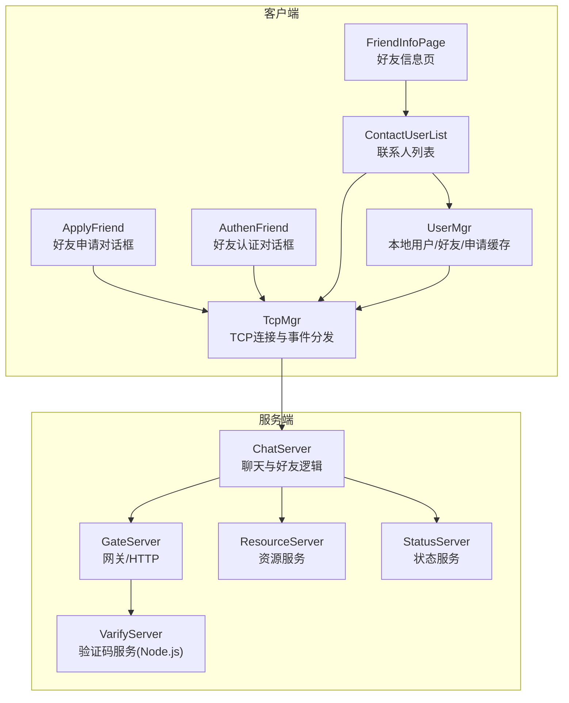
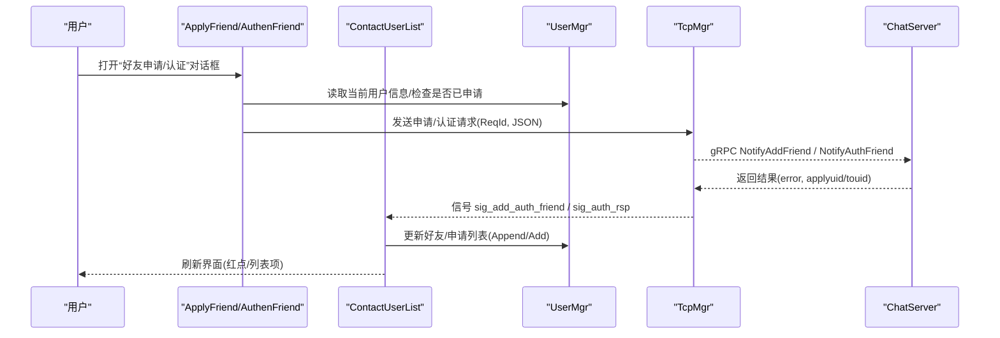
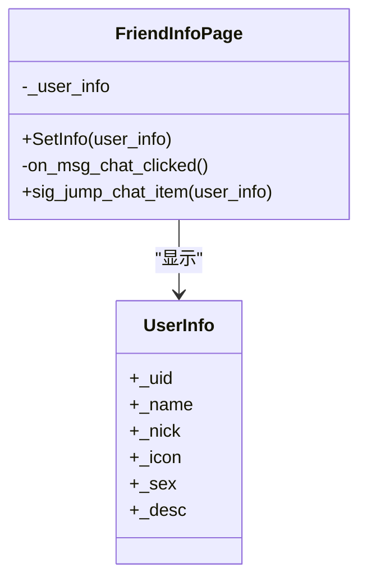
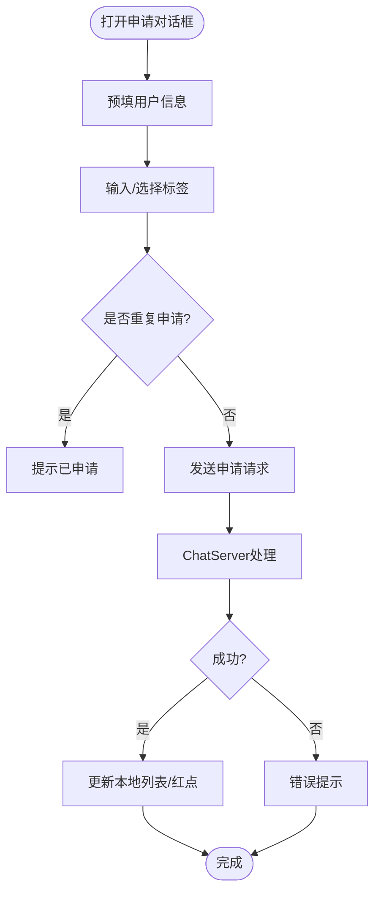
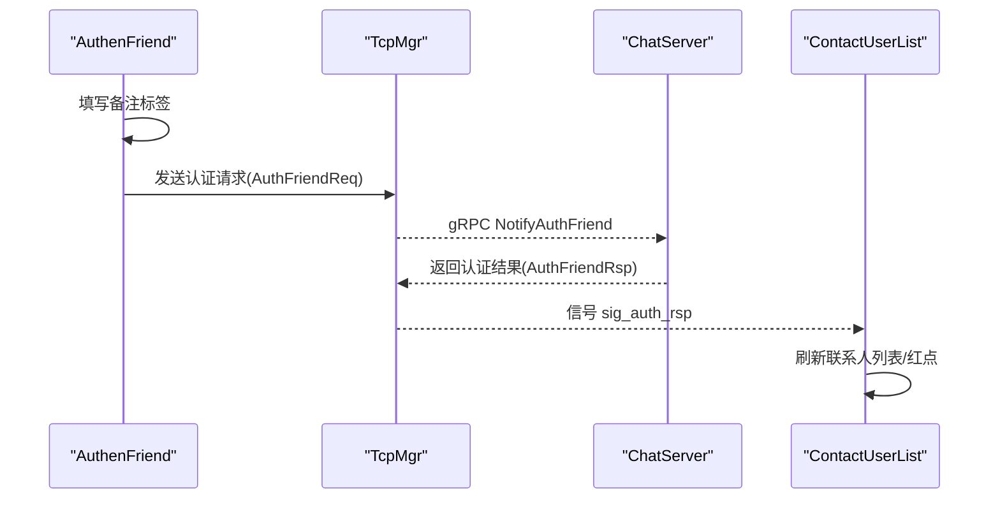
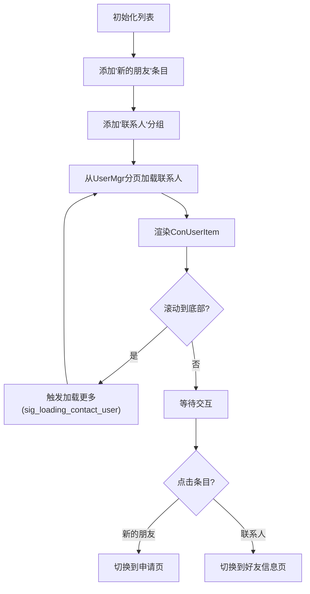
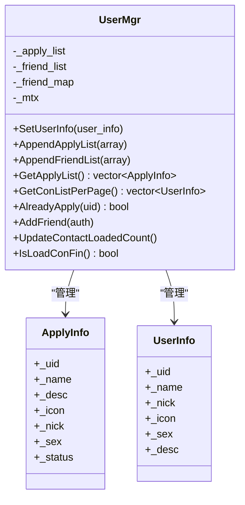
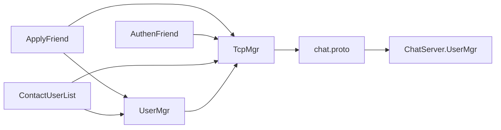

# 好友管理系统

<cite>
**本文引用的文件**   
- [friendinfopage.h](file://client/llfcchat/include/friendinfopage.h)
- [friendinfopage.cpp](file://client/llfcchat/src/friendinfopage.cpp)
- [applyfriend.h](file://client/llfcchat/include/applyfriend.h)
- [applyfriend.cpp](file://client/llfcchat/src/applyfriend.cpp)
- [authenfriend.h](file://client/llfcchat/include/authenfriend.h)
- [authenfriend.cpp](file://client/llfcchat/src/authenfriend.cpp)
- [contactuserlist.h](file://client/llfcchat/include/contactuserlist.h)
- [contactuserlist.cpp](file://client/llfcchat/src/contactuserlist.cpp)
- [usermgr.h](file://client/llfcchat/include/usermgr.h)
- [usermgr.cpp](file://client/llfcchat/src/usermgr.cpp)
- [userdata.h](file://client/llfcchat/include/userdata.h)
- [tcpmgr.h](file://client/llfcchat/include/tcpmgr.h)
- [chat.proto](file://proto/chat_service/chat.proto)
- [UserMgr.h](file://server/ChatServer/include/UserMgr.h)
</cite>

## 目录
1. [简介](#简介)
2. [项目结构](#项目结构)
3. [核心组件](#核心组件)
4. [架构总览](#架构总览)
5. [详细组件分析](#详细组件分析)
6. [依赖关系分析](#依赖关系分析)
7. [性能考虑](#性能考虑)
8. [故障排查指南](#故障排查指南)
9. [结论](#结论)
10. [附录](#附录)

## 简介
本文件面向LLFCChat的“好友管理系统”，围绕好友申请、好友认证、联系人列表与用户信息管理进行系统化说明。文档从界面组件、数据模型、网络通信、服务端交互四个维度展开，重点解释：
- 好友关系状态管理（申请中、已同意、已拒绝等）
- 申请流程控制（发起申请、标签选择、确认提交）
- 联系人数据同步（分页加载、增量更新、红点提示）
- 与UserMgr和ChatServer的关系（客户端本地状态管理与服务器端会话映射）

## 项目结构
本项目采用Qt/C++客户端 + C++后端服务（ChatServer/GateServer/ResourceServer/StatusServer/VarifyServer）的分层架构。好友管理相关代码集中在客户端UI与业务管理层：
- UI层：好友信息页、好友申请对话框、好友认证对话框、联系人列表
- 数据层：用户信息、申请信息、认证信息等数据结构
- 管理层：UserMgr负责本地好友/申请列表缓存与分页；TcpMgr负责网络收发与事件分发
- 协议层：gRPC proto定义好友申请与认证消息

图表来源
- [friendinfopage.h:1-30](file://client/llfcchat/include/friendinfopage.h#L1-L30)
- [applyfriend.h:1-59](file://client/llfcchat/include/applyfriend.h#L1-L59)
- [authenfriend.h:1-64](file://client/llfcchat/include/authenfriend.h#L1-L64)
- [contactuserlist.h:1-38](file://client/llfcchat/include/contactuserlist.h#L1-L38)
- [usermgr.h:1-116](file://client/llfcchat/include/usermgr.h#L1-L116)
- [tcpmgr.h:1-90](file://client/llfcchat/include/tcpmgr.h#L1-L90)
- [chat.proto:1-105](file://proto/chat_service/chat.proto#L1-L105)
- [UserMgr.h:1-22](file://server/ChatServer/include/UserMgr.h#L1-L22)

章节来源
- [friendinfopage.h:1-30](file://client/llfcchat/include/friendinfopage.h#L1-L30)
- [applyfriend.h:1-59](file://client/llfcchat/include/applyfriend.h#L1-L59)
- [authenfriend.h:1-64](file://client/llfcchat/include/authenfriend.h#L1-L64)
- [contactuserlist.h:1-38](file://client/llfcchat/include/contactuserlist.h#L1-L38)
- [usermgr.h:1-116](file://client/llfcchat/include/usermgr.h#L1-L116)
- [tcpmgr.h:1-90](file://client/llfcchat/include/tcpmgr.h#L1-L90)
- [chat.proto:1-105](file://proto/chat_service/chat.proto#L1-L105)
- [UserMgr.h:1-22](file://server/ChatServer/include/UserMgr.h#L1-L22)

## 核心组件
- FriendInfoPage：展示好友详细信息，提供跳转到聊天入口的信号
- ApplyFriend：好友申请对话框，支持标签输入与提示选择，提交申请
- AuthenFriend：好友认证对话框，接收待认证申请并填写备注标签后确认
- ContactUserList：联系人列表，包含“新的朋友”入口、联系人分组、滚动加载更多
- UserMgr：本地用户信息与好友/申请列表缓存，分页加载与查询
- TcpMgr：TCP连接封装，统一发送请求与广播事件（如新增认证、认证结果）
- 数据模型：SearchInfo、AddFriendApply、ApplyInfo、AuthInfo、AuthRsp、UserInfo、ChatThreadData等

章节来源
- [friendinfopage.cpp:1-40](file://client/llfcchat/src/friendinfopage.cpp#L1-L40)
- [applyfriend.cpp:1-200](file://client/llfcchat/src/applyfriend.cpp#L1-L200)
- [authenfriend.cpp:1-200](file://client/llfcchat/src/authenfriend.cpp#L1-L200)
- [contactuserlist.cpp:1-200](file://client/llfcchat/src/contactuserlist.cpp#L1-L200)
- [usermgr.cpp:1-200](file://client/llfcchat/src/usermgr.cpp#L1-L200)
- [userdata.h:1-288](file://client/llfcchat/include/userdata.h#L1-L288)
- [tcpmgr.h:1-90](file://client/llfcchat/include/tcpmgr.h#L1-L90)

## 架构总览
好友管理的端到端流程涉及客户端UI、本地缓存、网络传输与服务端处理。下图展示了关键调用链与数据流向：

图表来源
- [applyfriend.cpp:1-200](file://client/llfcchat/src/applyfriend.cpp#L1-L200)
- [authenfriend.cpp:1-200](file://client/llfcchat/src/authenfriend.cpp#L1-L200)
- [contactuserlist.cpp:1-200](file://client/llfcchat/src/contactuserlist.cpp#L1-L200)
- [usermgr.cpp:1-200](file://client/llfcchat/src/usermgr.cpp#L1-L200)
- [tcpmgr.h:1-90](file://client/llfcchat/include/tcpmgr.h#L1-L90)
- [chat.proto:1-105](file://proto/chat_service/chat.proto#L1-L105)

## 详细组件分析

### 好友信息页 FriendInfoPage
- 职责：展示好友头像、昵称、备注等信息；点击“发消息”触发跳转至聊天条目
- 关键接口
  - SetInfo(std::shared_ptr<UserInfo>)：设置并渲染用户信息
  - on_msg_chat_clicked()：发射跳转信号
- 信号
  - sig_jump_chat_item(UserInfo)：通知上层切换到聊天界面

图表来源
- [friendinfopage.h:1-30](file://client/llfcchat/include/friendinfopage.h#L1-L30)
- [friendinfopage.cpp:1-40](file://client/llfcchat/src/friendinfopage.cpp#L1-L40)
- [userdata.h:108-142](file://client/llfcchat/include/userdata.h#L108-L142)

章节来源
- [friendinfopage.h:1-30](file://client/llfcchat/include/friendinfopage.h#L1-L30)
- [friendinfopage.cpp:1-40](file://client/llfcchat/src/friendinfopage.cpp#L1-L40)

### 好友申请 ApplyFriend
- 职责：为搜索到的用户发起好友申请；支持标签输入与提示选择；校验重复申请
- 关键接口
  - SetSearchInfo(SearchInfo)：预填申请信息
  - SlotApplySure()/SlotApplyCancel()：提交或取消申请
  - InitTipLbs()/AddTipLbs()：初始化与布局提示标签
- 行为要点
  - 通过TcpMgr发送申请请求
  - 使用UserMgr.AlreadyApply(uid)避免重复申请
  - 成功后由TcpMgr广播事件，ContactUserList刷新

图表来源
- [applyfriend.cpp:1-200](file://client/llfcchat/src/applyfriend.cpp#L1-L200)
- [usermgr.cpp:116-126](file://client/llfcchat/src/usermgr.cpp#L116-L126)
- [tcpmgr.h:69-74](file://client/llfcchat/include/tcpmgr.h#L69-L74)
- [chat.proto:14-29](file://proto/chat_service/chat.proto#L14-L29)

章节来源
- [applyfriend.h:1-59](file://client/llfcchat/include/applyfriend.h#L1-L59)
- [applyfriend.cpp:1-200](file://client/llfcchat/src/applyfriend.cpp#L1-L200)
- [usermgr.cpp:116-126](file://client/llfcchat/src/usermgr.cpp#L116-L126)
- [tcpmgr.h:69-74](file://client/llfcchat/include/tcpmgr.h#L69-L74)
- [chat.proto:14-29](file://proto/chat_service/chat.proto#L14-L29)

### 好友认证 AuthenFriend
- 职责：对收到的好友申请进行认证；支持备注标签输入；确认后建立好友关系
- 关键接口
  - SetApplyInfo(ApplyInfo)：预填申请信息
  - SlotApplySure()/SlotApplyCancel()：确认或取消认证
  - InitTipLbs()/AddTipLbs()：标签布局与交互
- 行为要点
  - 通过TcpMgr发送认证请求
  - 成功后由TcpMgr广播sig_auth_rsp，ContactUserList更新列表

图表来源
- [authenfriend.cpp:1-200](file://client/llfcchat/src/authenfriend.cpp#L1-L200)
- [tcpmgr.h:73-74](file://client/llfcchat/include/tcpmgr.h#L73-L74)
- [chat.proto:31-51](file://proto/chat_service/chat.proto#L31-L51)

章节来源
- [authenfriend.h:1-64](file://client/llfcchat/include/authenfriend.h#L1-L64)
- [authenfriend.cpp:1-200](file://client/llfcchat/src/authenfriend.cpp#L1-L200)
- [tcpmgr.h:73-74](file://client/llfcchat/include/tcpmgr.h#L73-L74)
- [chat.proto:31-51](file://proto/chat_service/chat.proto#L31-L51)

### 联系人列表 ContactUserList
- 职责：展示“新的朋友”入口与联系人分组；支持滚动加载更多；响应认证结果刷新
- 关键接口与信号
  - ShowRedPoint(bool)：控制“新的朋友”红点显示
  - slot_item_clicked(QListWidgetItem*)：处理点击事件（跳转到申请页或好友信息页）
  - slot_add_auth_firend(AuthInfo)/slot_auth_rsp(AuthRsp)：处理认证相关事件
  - sig_loading_contact_user()：触发加载更多联系人
  - sig_switch_apply_friend_page()/sig_switch_friend_info_page(UserInfo)：页面切换
- 行为要点
  - 初始加载时插入“新的朋友”与“联系人”分组
  - 从UserMgr分页获取联系人列表
  - 监听TcpMgr事件，更新UI状态

图表来源
- [contactuserlist.cpp:1-200](file://client/llfcchat/src/contactuserlist.cpp#L1-L200)
- [contactuserlist.h:1-38](file://client/llfcchat/include/contactuserlist.h#L1-L38)
- [usermgr.cpp:149-167](file://client/llfcchat/src/usermgr.cpp#L149-L167)

章节来源
- [contactuserlist.h:1-38](file://client/llfcchat/include/contactuserlist.h#L1-L38)
- [contactuserlist.cpp:1-200](file://client/llfcchat/src/contactuserlist.cpp#L1-L200)
- [usermgr.cpp:149-167](file://client/llfcchat/src/usermgr.cpp#L149-L167)

### 用户管理 UserMgr
- 职责：维护当前用户信息、好友列表、申请列表；提供分页查询与增删改查；线程安全访问
- 关键接口
  - AppendApplyList(QJsonArray)/AppendFriendList(QJsonArray)：批量追加数据
  - GetApplyList()/GetConListPerPage()/GetChatListPerPage()：获取列表/分页数据
  - AlreadyApply(int uid)：检查是否已申请
  - AddFriend(AuthRsp/AuthInfo)：新增好友
  - UpdateContactLoadedCount()/IsLoadConFin()：分页计数与完成判断
- 并发与锁
  - 使用std::mutex保护共享数据，保证多线程安全

图表来源
- [usermgr.h:1-116](file://client/llfcchat/include/usermgr.h#L1-L116)
- [usermgr.cpp:1-200](file://client/llfcchat/src/usermgr.cpp#L1-200)
- [userdata.h:41-64](file://client/llfcchat/include/userdata.h#L41-L64)
- [userdata.h:108-142](file://client/llfcchat/include/userdata.h#L108-L142)

章节来源
- [usermgr.h:1-116](file://client/llfcchat/include/usermgr.h#L1-L116)
- [usermgr.cpp:1-200](file://client/llfcchat/src/usermgr.cpp#L1-200)
- [userdata.h:41-64](file://client/llfcchat/include/userdata.h#L41-L64)
- [userdata.h:108-142](file://client/llfcchat/include/userdata.h#L108-L142)

### 网络通信 TcpMgr
- 职责：封装QTcpSocket，统一发送请求与分发事件；注册回调处理器；队列化发送
- 关键信号
  - sig_load_apply_list(QJsonArray)：加载申请列表
  - sig_user_search(SearchInfo)：搜索结果
  - sig_friend_apply(AddFriendApply)：收到新申请
  - sig_add_auth_friend(AuthInfo)/sig_auth_rsp(AuthRsp)：认证相关事件
  - sig_text_chat_msg()/sig_chat_msg_rsp()/sig_img_chat_msg()：聊天消息
- 行为要点
  - 将网络事件转换为Qt信号，供UI层订阅
  - 与UserMgr协作更新本地状态

章节来源
- [tcpmgr.h:1-90](file://client/llfcchat/include/tcpmgr.h#L1-L90)

### 协议与数据模型
- 协议定义（gRPC）
  - AddFriendReq/AddFriendRsp：好友申请请求与响应
  - AuthFriendReq/AuthFriendRsp：好友认证请求与响应
  - TextChatMsgReq/TextChatMsgRsp：文本聊天消息
  - NotifyChatImgReq/NotifyChatImgRsp：图片消息通知
- 数据模型
  - SearchInfo：搜索结果
  - AddFriendApply：申请信息
  - ApplyInfo：申请详情（含状态）
  - AuthInfo/AuthRsp：认证信息与响应
  - UserInfo：用户信息
  - ChatThreadData：聊天线程数据

章节来源
- [chat.proto:1-105](file://proto/chat_service/chat.proto#L1-L105)
- [userdata.h:1-288](file://client/llfcchat/include/userdata.h#L1-L288)

## 依赖关系分析
- UI层依赖UserMgr获取本地数据，依赖TcpMgr发送网络请求与订阅事件
- 数据层通过UserMgr集中管理好友/申请列表，提供线程安全的查询与更新
- 网络层TcpMgr屏蔽底层Socket细节，向上暴露统一信号
- 服务端UserMgr仅维护用户会话映射，不直接参与好友关系存储（由具体业务实现决定）

图表来源
- [applyfriend.cpp:1-200](file://client/llfcchat/src/applyfriend.cpp#L1-L200)
- [authenfriend.cpp:1-200](file://client/llfcchat/src/authenfriend.cpp#L1-L200)
- [contactuserlist.cpp:1-200](file://client/llfcchat/src/contactuserlist.cpp#L1-L200)
- [usermgr.cpp:1-200](file://client/llfcchat/src/usermgr.cpp#L1-L200)
- [tcpmgr.h:1-90](file://client/llfcchat/include/tcpmgr.h#L1-L90)
- [chat.proto:1-105](file://proto/chat_service/chat.proto#L1-L105)
- [UserMgr.h:1-22](file://server/ChatServer/include/UserMgr.h#L1-L22)

章节来源
- [applyfriend.cpp:1-200](file://client/llfcchat/src/applyfriend.cpp#L1-L200)
- [authenfriend.cpp:1-200](file://client/llfcchat/src/authenfriend.cpp#L1-L200)
- [contactuserlist.cpp:1-200](file://client/llfcchat/src/contactuserlist.cpp#L1-L200)
- [usermgr.cpp:1-200](file://client/llfcchat/src/usermgr.cpp#L1-L200)
- [tcpmgr.h:1-90](file://client/llfcchat/include/tcpmgr.h#L1-L90)
- [chat.proto:1-105](file://proto/chat_service/chat.proto#L1-L105)
- [UserMgr.h:1-22](file://server/ChatServer/include/UserMgr.h#L1-L22)

## 性能考虑
- 分页加载：ContactUserList与UserMgr配合实现分页，减少一次性加载压力
- 事件驱动：TcpMgr通过信号机制解耦网络与UI，避免阻塞主线程
- 并发安全：UserMgr使用互斥锁保护共享数据，防止竞态条件
- 标签布局优化：ApplyFriend/AuthenFriend动态计算标签位置，避免重绘开销

[本节为通用指导，不直接分析具体文件]

## 故障排查指南
- 重复申请问题
  - 现象：同一用户多次申请
  - 排查：检查UserMgr.AlreadyApply(uid)逻辑是否正确调用
  - 参考：[usermgr.cpp:116-126](file://client/llfcchat/src/usermgr.cpp#L116-L126)
- 认证结果未刷新
  - 现象：认证通过后联系人列表未更新
  - 排查：确认TcpMgr是否发出sig_auth_rsp，ContactUserList是否订阅该信号
  - 参考：[tcpmgr.h:73-74](file://client/llfcchat/include/tcpmgr.h#L73-L74)，[contactuserlist.cpp:26-33](file://client/llfcchat/src/contactuserlist.cpp#L26-L33)
- 分页加载卡死
  - 现象：滚动到底部无反应
  - 排查：检查IsLoadChatFin/IsLoadConFin与_load_pending标志位
  - 参考：[contactuserlist.cpp:133-153](file://client/llfcchat/src/contactuserlist.cpp#L133-L153)，[usermgr.cpp:185-200](file://client/llfcchat/src/usermgr.cpp#L185-L200)
- 网络请求失败
  - 现象：申请/认证无响应
  - 排查：检查TcpMgr发送队列与socket连接状态
  - 参考：[tcpmgr.h:47-55](file://client/llfcchat/include/tcpmgr.h#L47-L55)

章节来源
- [usermgr.cpp:116-126](file://client/llfcchat/src/usermgr.cpp#L116-L126)
- [tcpmgr.h:73-74](file://client/llfcchat/include/tcpmgr.h#L73-L74)
- [contactuserlist.cpp:26-33](file://client/llfcchat/src/contactuserlist.cpp#L26-L33)
- [contactuserlist.cpp:133-153](file://client/llfcchat/src/contactuserlist.cpp#L133-L153)
- [usermgr.cpp:185-200](file://client/llfcchat/src/usermgr.cpp#L185-L200)
- [tcpmgr.h:47-55](file://client/llfcchat/include/tcpmgr.h#L47-L55)

## 结论
LLFCChat的好友管理系统以清晰的UI-Manager-Network分层实现，结合gRPC协议与Qt信号机制，实现了可靠的好友申请、认证与联系人同步。UserMgr作为本地状态中心，确保数据一致性与线程安全；TcpMgr屏蔽网络细节，提升可维护性。通过分页加载与事件驱动，系统在用户体验与性能之间取得平衡。

[本节为总结，不直接分析具体文件]

## 附录
- 配置选项与环境变量
  - 服务端配置文件位于各服务config目录下（如chatserver1.ini），用于端口、数据库、Redis等参数
  - 客户端资源路径与样式在resources下配置
- 常用接口速查
  - 好友申请：ApplyFriend.SetSearchInfo -> TcpMgr.SendData -> ChatServer.NotifyAddFriend
  - 好友认证：AuthenFriend.SetApplyInfo -> TcpMgr.SendData -> ChatServer.NotifyAuthFriend
  - 联系人加载：ContactUserList.addContactUserList -> UserMgr.GetConListPerPage
- 调试建议
  - 启用qDebug输出关键节点（如申请/认证回调、分页加载）
  - 使用抓包工具验证TCP/gRPC报文格式

[本节为补充信息，不直接分析具体文件]